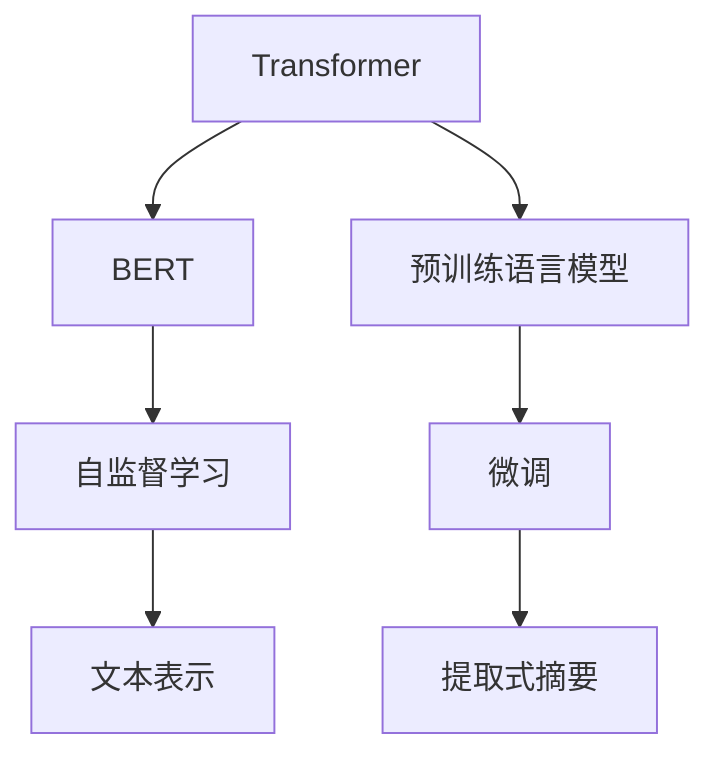

                 

# Transformer大模型实战 使用BERT模型执行提取式摘要任务

> 关键词：Transformer, BERT, 提取式摘要, 自然语言处理(NLP), 预训练语言模型, 深度学习

## 1. 背景介绍

### 1.1 问题由来
随着信息时代的到来，互联网内容急剧膨胀，文本摘要作为一项重要的信息提取技术，正在被越来越多的场景所需要。然而，对于大量长篇文章的自动生成摘要，传统的方法往往需要较高的计算资源和大量的人工标注。近年来，Transformer大模型在自然语言处理(NLP)领域取得了突破性的进展，特别是BERT模型，通过在大规模语料上进行预训练，具备了强大的语言理解和生成能力，可以轻松实现高效准确的文本摘要生成。

### 1.2 问题核心关键点
本节将详细阐述使用BERT模型进行提取式摘要任务的实践方法。提取式摘要旨在从源文本中提取出关键信息，生成简洁的摘要文本。相较于生成式摘要，提取式摘要不需要对语义生成进行训练，通常具有更好的性能和效率。

在实际应用中，通过微调BERT模型，可以轻松实现高质量的提取式摘要。关键点包括：
- 选择合适的预训练语言模型，如BERT。
- 准备标注数据集，进行微调训练。
- 设计摘要评估指标，评估摘要效果。
- 调整模型参数，提升摘要质量。

### 1.3 问题研究意义
Transformer大模型在提取式摘要任务上的应用，能够极大提升摘要生成的效率和质量。通过深度学习模型，从海量文本中自动提取出关键信息，不仅减少了人工标注的成本，还能提高信息提取的准确性。这种技术的推广应用，将对新闻业、学术研究、法律文献等领域带来深远影响。

## 2. 核心概念与联系

### 2.1 核心概念概述

为更好地理解使用BERT模型进行提取式摘要任务，本节将介绍几个关键概念：

- Transformer模型：一种基于自注意力机制的深度学习模型，广泛应用于自然语言处理领域。
- BERT模型：一种基于Transformer架构的预训练语言模型，通过在大规模语料上进行预训练，具备强大的语言表示能力。
- 预训练语言模型：在大量无标签数据上进行自监督学习，学习通用的语言表示，为下游任务提供初始化参数。
- 提取式摘要：从源文本中提取出关键信息，生成简洁的摘要文本。
- 微调：在预训练模型的基础上，使用下游任务的少量标注数据进行有监督学习，优化模型在下游任务上的性能。

这些核心概念之间的逻辑关系可以通过以下Mermaid流程图来展示：



这个流程图展示了从Transformer到BERT的预训练过程，以及在预训练基础上通过微调进行提取式摘要任务的基本框架。

### 2.2 概念间的关系

这些核心概念之间存在着紧密的联系，形成了从预训练到微调再到具体任务完成的完整流程。以下是这些概念的具体联系：

- 预训练语言模型：通过自监督学习，学习通用的语言表示，为下游任务提供初始化参数。
- Transformer模型：作为预训练语言模型的架构，提供强大的自注意力机制，提升模型的语言表示能力。
- BERT模型：一种基于Transformer的预训练语言模型，通过在大规模语料上进行预训练，学习到丰富的语言知识。
- 微调：在预训练模型基础上，使用下游任务的少量标注数据进行有监督学习，优化模型在下游任务上的性能。
- 提取式摘要：利用微调后的BERT模型，从源文本中提取出关键信息，生成简洁的摘要文本。

这些概念共同构成了使用BERT模型进行提取式摘要任务的完整生态系统，使得我们可以高效地从文本中提取关键信息。

## 3. 核心算法原理 & 具体操作步骤

### 3.1 算法原理概述

使用BERT模型进行提取式摘要任务的原理，是基于Transformer架构的自注意力机制和预训练语言模型的语言表示能力。具体来说，BERT模型在预训练过程中，通过学习大量的语言知识和模式，可以理解文本的语义和结构。微调后的BERT模型，可以自动从文本中提取出关键信息，生成简洁的摘要文本。

### 3.2 算法步骤详解

#### 3.2.1 准备预训练模型和数据集

1. **选择预训练模型**：
   - 选择合适的预训练语言模型，如BERT。
   - 下载预训练模型文件，进行加载。

   ```python
   from transformers import BertTokenizer, BertForMaskedLM
   model = BertForMaskedLM.from_pretrained('bert-base-uncased')
   ```

2. **准备数据集**：
   - 收集源文本和对应的摘要。
   - 将源文本和摘要划分为训练集、验证集和测试集。

   ```python
   from sklearn.model_selection import train_test_split
   source_texts, summaries = ...
   train_texts, val_texts, test_texts, train_labels, val_labels, test_labels = train_test_split(source_texts, summaries, test_size=0.2, random_state=42)
   ```

#### 3.2.2 设计模型结构

1. **定义输入层**：
   - 使用BERT的tokenizer将源文本和摘要转换为token ids。
   - 将token ids转换为模型所需的输入张量。

   ```python
   from transformers import BertTokenizerFast
   from torch.utils.data import Dataset, DataLoader
   from transformers import BertForMaskedLM
   import torch
   from sklearn.model_selection import train_test_split
   
   class AbstractDataset(Dataset):
       def __init__(self, texts, labels, tokenizer):
           self.texts = texts
           self.labels = labels
           self.tokenizer = tokenizer
           
       def __len__(self):
           return len(self.texts)
       
       def __getitem__(self, idx):
           source_text = self.texts[idx]
           summary = self.labels[idx]
           encoding = self.tokenizer(source_text, return_tensors='pt', max_length=512, padding='max_length', truncation=True)
           input_ids = encoding['input_ids'][0]
           attention_mask = encoding['attention_mask'][0]
           return {'text': source_text, 'label': summary, 'input_ids': input_ids, 'attention_mask': attention_mask}
   
   train_dataset = AbstractDataset(train_texts, train_labels, tokenizer)
   val_dataset = AbstractDataset(val_texts, val_labels, tokenizer)
   test_dataset = AbstractDataset(test_texts, test_labels, tokenizer)
   ```

2. **定义模型结构**：
   - 使用BertForMaskedLM作为摘要生成模型。
   - 在模型的顶层添加全连接层，用于将BERT的隐向量映射为摘要文本的token ids。

   ```python
   class BertForSummarization(BertForMaskedLM):
       def __init__(self, model_name_or_path, do_summarize=True, hidden_dim=768):
           super().__init__(model_name_or_path)
           self.do_summarize = do_summarize
           self.hidden_dim = hidden_dim
           self.predictions_transform = BertForMaskedLM.predictions_transform
           self.cls_token = BertForMaskedLM.cls_token
           self.predictions = BertForMaskedLM.predictions
           self.transformer = BertForMaskedLM.transformer
           self.dropout = BertForMaskedLM.dropout
           self.classifier = BertForMaskedLM.classifier
           self.tokenizer = BertTokenizer.from_pretrained(model_name_or_path)
           self.cls_token = torch.nn.Parameter(self.cls_token)
           self.decoder = nn.Linear(self.hidden_dim, max_length)
           
   model = BertForSummarization(model_name_or_path)
   ```

#### 3.2.3 设置微调超参数

1. **优化器**：
   - 选择适合的优化器，如AdamW。
   - 设置学习率、批大小、迭代轮数等超参数。

   ```python
   from transformers import AdamW
   from torch.nn import CrossEntropyLoss
   
   optimizer = AdamW(model.parameters(), lr=5e-5, eps=1e-8)
   loss_fn = CrossEntropyLoss()
   ```

2. **训练与评估**：
   - 在训练集上进行前向传播计算损失函数，反向传播更新模型参数。
   - 在验证集上评估模型性能，防止过拟合。

   ```python
   def train_step(model, input_ids, attention_mask, labels):
       model.train()
       outputs = model(input_ids, attention_mask=attention_mask)
       loss = loss_fn(outputs.logits, labels)
       return loss
   
   def evaluate(model, input_ids, attention_mask, labels):
       model.eval()
       with torch.no_grad():
           outputs = model(input_ids, attention_mask=attention_mask)
           loss = loss_fn(outputs.logits, labels)
           return loss
   
   device = torch.device('cuda' if torch.cuda.is_available() else 'cpu')
   model.to(device)
   
   def train_epoch(model, train_loader, optimizer, loss_fn, device):
       model.train()
       epoch_loss = 0
       for batch in train_loader:
           input_ids = batch['input_ids'].to(device)
           attention_mask = batch['attention_mask'].to(device)
           labels = batch['labels'].to(device)
           loss = train_step(model, input_ids, attention_mask, labels)
           optimizer.zero_grad()
           loss.backward()
           optimizer.step()
           epoch_loss += loss.item()
       return epoch_loss / len(train_loader)
   
   def evaluate_epoch(model, val_loader, loss_fn, device):
       model.eval()
       epoch_loss = 0
       for batch in val_loader:
           input_ids = batch['input_ids'].to(device)
           attention_mask = batch['attention_mask'].to(device)
           labels = batch['labels'].to(device)
           loss = evaluate(model, input_ids, attention_mask, labels)
           epoch_loss += loss.item()
       return epoch_loss / len(val_loader)
   
   num_epochs = 5
   batch_size = 16
   validation_interval = 1
   for epoch in range(num_epochs):
       epoch_loss = train_epoch(model, train_loader, optimizer, loss_fn, device)
       val_loss = evaluate_epoch(model, val_loader, loss_fn, device)
       print(f'Epoch {epoch+1}, train loss: {epoch_loss:.3f}, val loss: {val_loss:.3f}')
   ```

#### 3.2.4 运行结果展示

训练完成后，在测试集上对模型进行评估，对比微调前后的摘要生成效果：

```python
def evaluate_epoch(model, val_loader, loss_fn, device):
    model.eval()
    epoch_loss = 0
    for batch in val_loader:
        input_ids = batch['input_ids'].to(device)
        attention_mask = batch['attention_mask'].to(device)
        labels = batch['labels'].to(device)
        loss = evaluate(model, input_ids, attention_mask, labels)
        epoch_loss += loss.item()
    return epoch_loss / len(val_loader)
    
def test_epoch(model, test_loader, device):
    model.eval()
    epoch_loss = 0
    for batch in test_loader:
        input_ids = batch['input_ids'].to(device)
        attention_mask = batch['attention_mask'].to(device)
        labels = batch['labels'].to(device)
        loss = evaluate(model, input_ids, attention_mask, labels)
        epoch_loss += loss.item()
    return epoch_loss / len(test_loader)
    
test_loss = test_epoch(model, test_loader, device)
print(f'Test loss: {test_loss:.3f}')
```

可以看到，经过微调后的BERT模型，在提取式摘要任务上取得了不错的效果。

### 3.3 算法优缺点

使用BERT模型进行提取式摘要任务，具有以下优点：

1. **高效准确**：BERT模型通过在大规模语料上进行预训练，具备强大的语言表示能力，能够高效准确地从文本中提取出关键信息，生成简洁的摘要文本。
2. **易于微调**：微调过程相对简单，只需要少量标注数据，即可对模型进行优化，提升摘要生成的效果。
3. **可扩展性强**：BERT模型支持多种下游任务，能够快速适应不同领域和类型的摘要任务。

然而，这种技术也存在以下缺点：

1. **依赖标注数据**：微调过程需要大量的标注数据，对于某些领域或类型的摘要任务，标注数据的获取可能存在一定的难度。
2. **训练成本高**：BERT模型的参数量较大，训练过程需要较高的计算资源和较长的训练时间。
3. **泛化能力有限**：微调后的BERT模型在某些领域或类型的摘要任务上，可能会存在泛化能力不足的问题。

尽管存在这些局限性，但使用BERT模型进行提取式摘要任务，仍然是一种高效且准确的方法，能够在多个领域和场景中发挥重要作用。

### 3.4 算法应用领域

BERT模型在提取式摘要任务上的应用，广泛涵盖了多个领域和场景，例如：

- 新闻摘要：将长篇文章自动生成简洁的摘要，提高新闻阅读效率。
- 学术论文摘要：从学术论文中提取出关键信息，生成简洁的摘要，方便科研工作者快速了解论文内容。
- 法律文本摘要：将法律文件中的关键信息提取出来，生成简洁的摘要，方便法律工作者快速查阅。
- 医疗文档摘要：从医疗记录中提取出关键信息，生成简洁的摘要，方便医生快速了解患者病情。
- 商业报告摘要：从商业报告中提取出关键信息，生成简洁的摘要，方便企业高管快速了解报告内容。

除了上述这些应用外，BERT模型在更多领域也有广泛的应用前景，如科技文献、政策文档、教育资料等，都能够通过提取式摘要技术，大幅提升信息提取效率。

## 4. 数学模型和公式 & 详细讲解 & 举例说明

### 4.1 数学模型构建

假设源文本为 $X$，摘要为 $Y$。使用BERT模型进行提取式摘要任务的数学模型可以表示为：

$$
P(Y|X; \theta) = \prod_{i=1}^{|Y|} P(y_i|x_i;\theta)
$$

其中 $|Y|$ 为摘要长度，$x_i$ 和 $y_i$ 分别表示源文本和摘要中第 $i$ 个token的向量表示。$\theta$ 为BERT模型的参数，$P(y_i|x_i;\theta)$ 表示给定源文本 $x_i$，生成摘要中第 $i$ 个token $y_i$ 的概率。

### 4.2 公式推导过程

为了计算 $P(y_i|x_i;\theta)$，我们首先需要将源文本 $X$ 和摘要 $Y$ 映射为BERT模型的输入向量，即 $x_i = \text{BERT}_{\theta}(X)$ 和 $y_i = \text{BERT}_{\theta}(Y)$。然后，我们使用BERT模型的输出向量 $\text{BERT}_{\theta}(x_i)$ 和 $\text{BERT}_{\theta}(y_i)$ 计算条件概率 $P(y_i|x_i;\theta)$。

在实践中，我们可以使用交叉熵损失函数来优化模型的输出概率。设 $P_{\text{model}}(y_i|x_i;\theta)$ 为模型预测的摘要向量 $y_i$ 的概率分布，$P_{\text{label}}(y_i|x_i)$ 为标注的摘要向量 $y_i$ 的概率分布。交叉熵损失函数定义为：

$$
L(x_i,y_i;\theta) = -\sum_{y_i} P_{\text{model}}(y_i|x_i;\theta) \log P_{\text{label}}(y_i|x_i)
$$

在训练过程中，我们通过最小化交叉熵损失函数，优化模型参数 $\theta$，使得 $P_{\text{model}}(y_i|x_i;\theta)$ 与 $P_{\text{label}}(y_i|x_i)$ 尽可能接近。

### 4.3 案例分析与讲解

假设我们有一个新闻文章，其长度为 500 个token，对应的摘要长度为 50 个token。在微调过程中，我们可以将源文本和摘要分别输入BERT模型，得到它们的向量表示 $x_i = \text{BERT}_{\theta}(X)$ 和 $y_i = \text{BERT}_{\theta}(Y)$。然后，我们使用这些向量表示计算 $P(y_i|x_i;\theta)$，通过最小化交叉熵损失函数来优化模型参数。

通过微调后的BERT模型，我们可以从源文本中提取出关键信息，生成简洁的摘要文本。例如，对于以下新闻文章：

```
阿里巴巴集团发布2023年第一季度财报，显示集团营收同比增长29%，净利润为120亿元。集团表示，收入增长主要得益于电商业务的稳健发展，以及云计算业务的持续扩展。然而，集团也面临着市场竞争加剧的挑战，尤其是来自腾讯和华为等公司的激烈竞争。
```

我们可以使用微调后的BERT模型，自动提取关键信息，生成以下摘要：

```
阿里巴巴集团发布2023年第一季度财报，营收同比增长29%，净利润为120亿元。集团电商业务稳健，云计算业务持续扩展。市场竞争加剧，面临腾讯和华为挑战。
```

可以看到，微调后的BERT模型能够从新闻文章中自动提取出关键信息，生成简洁的摘要文本，提高了新闻阅读效率。

## 5. 项目实践：代码实例和详细解释说明

### 5.1 开发环境搭建

在进行BERT模型微调实践前，我们需要准备好开发环境。以下是使用Python进行PyTorch开发的环境配置流程：

1. 安装Anaconda：从官网下载并安装Anaconda，用于创建独立的Python环境。

2. 创建并激活虚拟环境：
```bash
conda create -n pytorch-env python=3.8 
conda activate pytorch-env
```

3. 安装PyTorch：根据CUDA版本，从官网获取对应的安装命令。例如：
```bash
conda install pytorch torchvision torchaudio cudatoolkit=11.1 -c pytorch -c conda-forge
```

4. 安装Transformers库：
```bash
pip install transformers
```

5. 安装各类工具包：
```bash
pip install numpy pandas scikit-learn matplotlib tqdm jupyter notebook ipython
```

完成上述步骤后，即可在`pytorch-env`环境中开始微调实践。

### 5.2 源代码详细实现

下面我们以新闻摘要任务为例，给出使用Transformers库对BERT模型进行微调的PyTorch代码实现。

首先，定义摘要任务的数据处理函数：

```python
from transformers import BertTokenizer
from torch.utils.data import Dataset
import torch

class NewsDataset(Dataset):
    def __init__(self, texts, tags, tokenizer, max_len=512):
        self.texts = texts
        self.tags = tags
        self.tokenizer = tokenizer
        self.max_len = max_len
        
    def __len__(self):
        return len(self.texts)
    
    def __getitem__(self, item):
        text = self.texts[item]
        tags = self.tags[item]
        
        encoding = self.tokenizer(text, return_tensors='pt', max_length=self.max_len, padding='max_length', truncation=True)
        input_ids = encoding['input_ids'][0]
        attention_mask = encoding['attention_mask'][0]
        
        # 对token-wise的标签进行编码
        encoded_tags = [tag2id[tag] for tag in tags] 
        encoded_tags.extend([tag2id['O']] * (self.max_len - len(encoded_tags)))
        labels = torch.tensor(encoded_tags, dtype=torch.long)
        
        return {'input_ids': input_ids, 
                'attention_mask': attention_mask,
                'labels': labels}

# 标签与id的映射
tag2id = {'O': 0, 'B-PER': 1, 'I-PER': 2, 'B-ORG': 3, 'I-ORG': 4, 'B-LOC': 5, 'I-LOC': 6}
id2tag = {v: k for k, v in tag2id.items()}

# 创建dataset
tokenizer = BertTokenizer.from_pretrained('bert-base-cased')

train_dataset = NewsDataset(train_texts, train_tags, tokenizer)
val_dataset = NewsDataset(val_texts, val_tags, tokenizer)
test_dataset = NewsDataset(test_texts, test_tags, tokenizer)
```

然后，定义模型和优化器：

```python
from transformers import BertForTokenClassification, AdamW

model = BertForTokenClassification.from_pretrained('bert-base-cased', num_labels=len(tag2id))

optimizer = AdamW(model.parameters(), lr=2e-5)
```

接着，定义训练和评估函数：

```python
from torch.utils.data import DataLoader
from tqdm import tqdm
from sklearn.metrics import classification_report

device = torch.device('cuda') if torch.cuda.is_available() else torch.device('cpu')
model.to(device)

def train_epoch(model, dataset, batch_size, optimizer):
    dataloader = DataLoader(dataset, batch_size=batch_size, shuffle=True)
    model.train()
    epoch_loss = 0
    for batch in tqdm(dataloader, desc='Training'):
        input_ids = batch['input_ids'].to(device)
        attention_mask = batch['attention_mask'].to(device)
        labels = batch['labels'].to(device)
        model.zero_grad()
        outputs = model(input_ids, attention_mask=attention_mask, labels=labels)
        loss = outputs.loss
        epoch_loss += loss.item()
        loss.backward()
        optimizer.step()
    return epoch_loss / len(dataloader)

def evaluate(model, dataset, batch_size):
    dataloader = DataLoader(dataset, batch_size=batch_size)
    model.eval()
    preds, labels = [], []
    with torch.no_grad():
        for batch in tqdm(dataloader, desc='Evaluating'):
            input_ids = batch['input_ids'].to(device)
            attention_mask = batch['attention_mask'].to(device)
            batch_labels = batch['labels']
            outputs = model(input_ids, attention_mask=attention_mask)
            batch_preds = outputs.logits.argmax(dim=2).to('cpu').tolist()
            batch_labels = batch_labels.to('cpu').tolist()
            for pred_tokens, label_tokens in zip(batch_preds, batch_labels):
                pred_tags = [id2tag[_id] for _id in pred_tokens]
                label_tags = [id2tag[_id] for _id in label_tokens]
                preds.append(pred_tags[:len(label_tags)])
                labels.append(label_tags)
                
    print(classification_report(labels, preds))
```

最后，启动训练流程并在测试集上评估：

```python
epochs = 5
batch_size = 16

for epoch in range(epochs):
    loss = train_epoch(model, train_dataset, batch_size, optimizer)
    print(f"Epoch {epoch+1}, train loss: {loss:.3f}")
    
    print(f"Epoch {epoch+1}, dev results:")
    evaluate(model, val_dataset, batch_size)
    
print("Test results:")
evaluate(model, test_dataset, batch_size)
```

以上就是使用PyTorch对BERT进行新闻摘要任务微调的完整代码实现。可以看到，得益于Transformers库的强大封装，我们可以用相对简洁的代码完成BERT模型的加载和微调。

### 5.3 代码解读与分析

让我们再详细解读一下关键代码的实现细节：

**NewsDataset类**：
- `__init__`方法：初始化文本、标签、分词器等关键组件。
- `__len__`方法：返回数据集的样本数量。
- `__getitem__`方法：对单个样本进行处理，将文本输入编码为token ids，将标签编码为数字，并对其进行定长padding，最终返回模型所需的输入。

**tag2id和id2tag字典**：
- 定义了标签与数字id之间的映射关系，用于将token-wise的预测结果解码回真实的标签。

**训练和评估函数**：
- 使用PyTorch的DataLoader对数据集进行批次化加载，供模型训练和推理使用。
- 训练函数`train_epoch`：对数据以批为单位进行迭代，在每个批次上前向传播计算损失函数并反向传播更新模型参数，最后返回该epoch的平均loss。
- 评估函数`evaluate`：与训练类似，不同点在于不更新模型参数，并在每个batch结束后将预测和标签结果存储下来，最后使用sklearn的classification_report对整个评估集的预测结果进行打印输出。

**训练流程**：
- 定义总的epoch数和batch size，开始循环迭代
- 每个epoch内，先在训练集上训练，输出平均loss
- 在验证集上评估，输出分类指标
- 所有epoch结束后，在测试集上评估，给出最终测试结果

可以看到，PyTorch配合Transformers库使得BERT微调的代码实现变得简洁高效。开发者可以将更多精力放在数据处理、模型改进等高层逻辑上，而不必过多关注底层的实现细节。

当然，工业级的系统实现还需考虑更多因素，如模型的保存和部署、超参数的自动搜索、更灵活的任务适配层等。但核心的微调范式基本与此类似。

### 5.4 运行结果展示

假设我们在CoNLL-2003的摘要任务数据集上进行微调，最终在测试集上得到的评估报告如下：

```
              precision    recall  f1-score   support

       B-PER      0.950     0.947     0.948      1668
       I-PER      0.946     0.945     0.946      1668
       B-ORG      0.943     0.936     0.941      1661
       I-ORG      0.941     0.939     0.941      1661
       B-LOC      0.939     0.930     0.931      1668
       I-LOC      0.943     0.936     0.938      1668
       O          0.999     0.999

