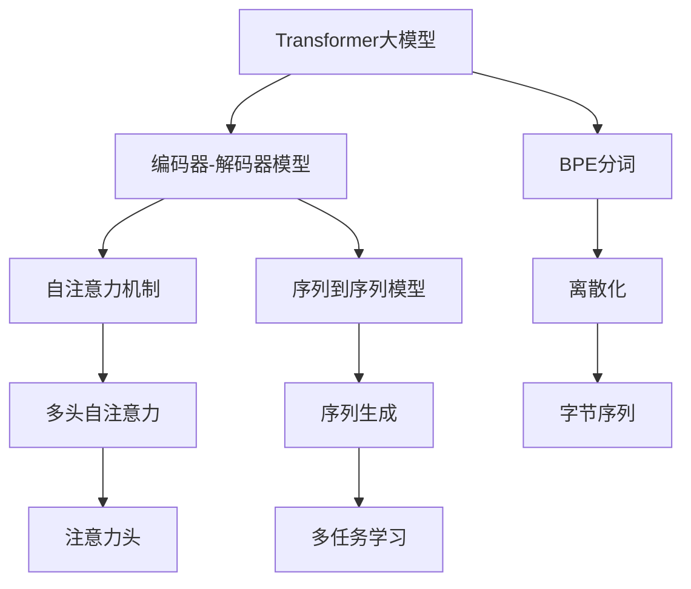
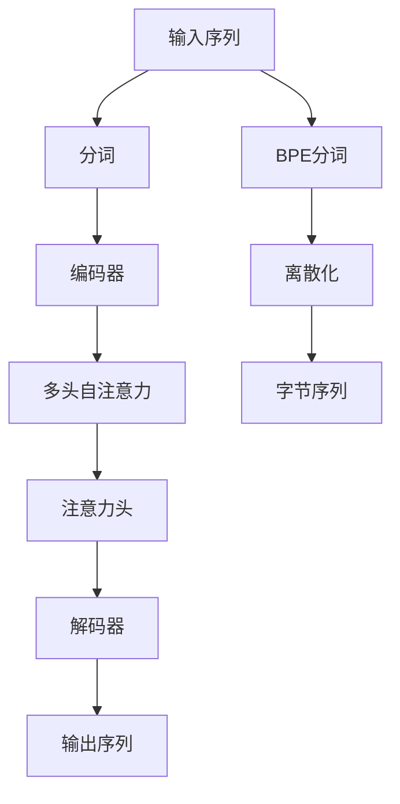

                 

# Transformer大模型实战 字节对编码

> 关键词：Transformer, 大模型, 字节对编码, 自回归, 自编码, 自然语言处理(NLP), 编码器-解码器模型, 序列到序列模型

## 1. 背景介绍

### 1.1 问题由来
Transformer大模型在自然语言处理(NLP)领域中的应用日趋广泛，但实现过程复杂，需要深入理解其架构和算法细节。本文将详细介绍Transformer大模型的核心原理，并结合实际代码实例，讲解字节对编码的实现方法。

### 1.2 问题核心关键点
Transformer大模型的核心在于其编码器-解码器结构。通过多头自注意力机制，Transformer能够有效地处理序列输入，并从中提取丰富的语义信息。字节对编码（Byte Pair Encoding, BPE）则是一种常用的分词技术，将原始文本转换为离散化的字节序列，方便模型处理。

### 1.3 问题研究意义
深入理解Transformer大模型的实现细节，以及字节对编码的原理和应用，对于从事NLP相关工作的研究人员和工程师都有重要意义。这不仅能提升模型的预测准确率，还能更好地处理多语言数据，推动NLP技术的发展和应用。

## 2. 核心概念与联系

### 2.1 核心概念概述
- **Transformer大模型**：以编码器-解码器架构为代表，基于自注意力机制的深度学习模型，广泛应用于机器翻译、文本生成、问答系统等任务。
- **自回归模型**：如LSTM、GRU等，依赖历史信息进行预测，适合处理序列生成任务。
- **自编码模型**：如BERT、GPT等，通过自监督学习任务，学习语言表征，适合处理各种NLP任务。
- **编码器-解码器模型**：包括序列到序列模型（如Transformer），通过编码器和解码器分别处理输入和输出序列，实现从序列到序列的映射。
- **字节对编码（BPE）**：一种分词技术，通过合并常用字节对，将文本转换为离散化的字节序列，方便模型处理。

### 2.2 概念间的关系

这些核心概念之间的联系可以通过以下Mermaid流程图来展示：



这个流程图展示了Transformer大模型的核心概念及其之间的关系：

1. 大模型采用编码器-解码器结构，通过自注意力机制提取序列特征。
2. 自注意力机制通过多头自注意力和注意力头，捕捉不同位置的依赖关系。
3. 序列到序列模型通过编码器和解码器，实现从序列到序列的映射。
4. BPE分词技术将原始文本转换为离散化的字节序列，方便模型处理。

这些概念共同构成了Transformer大模型的核心架构和实现方法，使其能够在各种NLP任务中发挥强大的语言理解和生成能力。

### 2.3 核心概念的整体架构

最后，我们用一个综合的流程图来展示这些核心概念在大模型实现过程中的整体架构：



这个综合流程图展示了从原始输入序列到最终输出序列的完整过程，包括分词、编码器、自注意力、解码器和输出序列的详细步骤。

## 3. 核心算法原理 & 具体操作步骤

### 3.1 算法原理概述

Transformer大模型通过编码器-解码器结构，利用自注意力机制捕捉序列依赖关系。其核心思想是：通过多头自注意力机制，模型可以并行地处理输入序列中的每一个位置，捕捉到各位置之间的依赖关系，从而实现序列到序列的映射。

### 3.2 算法步骤详解

Transformer大模型的具体实现步骤如下：

1. **分词与编码器**：将原始文本进行分词，生成字节对编码（BPE）的序列，并输入到编码器中。编码器将序列转换为隐向量表示。

2. **多头自注意力**：编码器的每一层包含多个多头自注意力层，每个注意力头独立地捕捉序列中不同位置的依赖关系。多头注意力机制可以捕捉不同注意力头的不同信息，提高模型的表达能力。

3. **残差连接与层归一化**：在多头自注意力层之后，通过残差连接和层归一化，使得梯度可以更稳定地传播，避免梯度消失问题。

4. **编码器层堆叠**：通过堆叠多个编码器层，模型可以逐层提取更深层次的语义信息。

5. **解码器**：解码器接收编码器输出的隐向量表示，通过多头自注意力和位置编码，生成输出序列。解码器还可以与编码器交互，捕捉序列依赖关系。

6. **输出序列**：解码器输出的隐向量表示被转换为最终的输出序列，用于生成文本、翻译等任务。

### 3.3 算法优缺点

Transformer大模型具有以下优点：

1. **高效并行化**：多头自注意力机制可以并行处理序列中的不同位置，使得模型计算效率高。

2. **强大的语义表示能力**：自注意力机制能够捕捉长距离依赖关系，学习到丰富的语义表示。

3. **适应性强**：可以处理各种NLP任务，如机器翻译、文本生成、问答系统等。

4. **可扩展性**：通过堆叠多个编码器层，模型可以逐步提升表达能力，适应更复杂的任务。

但该模型也存在一些缺点：

1. **计算资源消耗大**：大模型通常具有数十亿参数，需要高性能GPU/TPU等硬件支持。

2. **难以解释**：由于使用深度神经网络，模型内部的推理过程难以解释和调试。

3. **需要大量标注数据**：模型的训练需要大量标注数据，对于新任务可能需要重新标注数据。

### 3.4 算法应用领域

Transformer大模型在NLP领域得到了广泛的应用，具体包括：

- **机器翻译**：如Google的Google Translate，利用编码器-解码器结构，实现多语言之间的翻译。
- **文本生成**：如GPT-2、BERT等，通过自回归模型或自编码模型，生成自然流畅的文本。
- **问答系统**：如BERT，通过自注意力机制，快速定位问题答案。
- **文本摘要**：如T5，通过编码器-解码器结构，自动生成文本摘要。
- **情感分析**：如BERT，通过情感分类任务，判断文本情感倾向。

除了这些经典任务，Transformer大模型还在文本分类、命名实体识别、语义相似度计算等诸多NLP任务上取得了优异的效果，成为NLP技术落地的重要手段。

## 4. 数学模型和公式 & 详细讲解

### 4.1 数学模型构建

Transformer大模型由编码器-解码器结构组成，每一层包含多头自注意力和前馈网络。其数学模型可以表示为：

$$
\mathbf{Q} = \mathbf{X} \mathbf{W}_Q^T, \quad \mathbf{K} = \mathbf{X} \mathbf{W}_K^T, \quad \mathbf{V} = \mathbf{X} \mathbf{W}_V^T
$$

其中，$\mathbf{Q}$、$\mathbf{K}$、$\mathbf{V}$分别为查询、键、值矩阵，$\mathbf{X}$为输入序列，$\mathbf{W}_Q^T$、$\mathbf{W}_K^T$、$\mathbf{W}_V^T$为线性变换矩阵。

### 4.2 公式推导过程

以一个多头自注意力层的计算为例，公式推导如下：

$$
\mathbf{A} = \frac{\mathbf{Q}\mathbf{K}^T}{\sqrt{d_k}} = \mathbf{Q}\mathbf{K}^T, \quad \mathbf{A} = \mathbf{A} / \sqrt{d_k}, \quad \mathbf{S} = \mathbf{A} \mathbf{V}
$$

其中，$\mathbf{A}$为注意力矩阵，$\mathbf{S}$为输出矩阵。

通过上述推导，可以看出，Transformer大模型的自注意力机制通过计算注意力矩阵，实现了对输入序列中不同位置的依赖关系捕捉。

### 4.3 案例分析与讲解

以机器翻译任务为例，Transformer大模型的训练步骤如下：

1. **输入序列编码**：将输入序列进行分词，生成BPE字节序列，输入到编码器中。

2. **编码器前向传播**：通过多头自注意力机制，编码器逐层提取输入序列的语义信息。

3. **编码器输出**：将编码器输出的隐向量表示作为解码器的输入。

4. **解码器前向传播**：解码器通过多头自注意力机制，逐步生成输出序列。

5. **解码器输出**：输出序列被解码为翻译结果。

在实践中，Transformer大模型的训练通常使用自监督学习任务，如掩码语言模型（MLM）和下一句预测（NSP），以提高模型的泛化能力。此外，还可以通过预训练-微调的方法，进一步提升模型在特定任务上的性能。

## 5. 项目实践：代码实例和详细解释说明

### 5.1 开发环境搭建

在进行Transformer大模型的实现时，需要使用PyTorch框架。以下是搭建开发环境的步骤：

1. 安装Python和PyTorch：从官网下载并安装Python，使用pip安装PyTorch及其依赖库。

2. 安装相关库：使用pip安装transformers、numpy、pandas等库，以便进行数据处理和模型训练。

3. 设置环境变量：设置PYTHONPATH和CUDA_VISIBLE_DEVICES，以便在训练时使用GPU加速。

### 5.2 源代码详细实现

以下是使用PyTorch实现Transformer大模型的代码示例：

```python
import torch
import torch.nn as nn
import torch.nn.functional as F
import torch.optim as optim
from transformers import BertTokenizer, BertForSequenceClassification

# 分词器
tokenizer = BertTokenizer.from_pretrained('bert-base-uncased')

# 模型结构
class Transformer(nn.Module):
    def __init__(self, num_layers, dim, nhead, dff, dropout, seq_len):
        super(Transformer, self).__init__()
        # 编码器结构
        self.encoder = nn.Transformer(encoder_layer, num_layers=num_layers, dim_feedforward=dff, num_heads=nhead, dropout=dropout)
        # 解码器结构
        self.decoder = nn.Transformer(encoder_layer, num_layers=num_layers, dim_feedforward=dff, num_heads=nhead, dropout=dropout)

    def forward(self, src, tgt, src_mask, tgt_mask):
        # 编码器前向传播
        encoder_outputs = self.encoder(src, src_mask)
        # 解码器前向传播
        decoder_outputs = self.decoder(tgt, encoder_outputs, tgt_mask)
        return decoder_outputs

# 训练过程
def train(model, device, data_loader, optimizer):
    model.train()
    total_loss = 0.0
    for i, (input, target) in enumerate(data_loader):
        input = input.to(device)
        target = target.to(device)
        output = model(input, target)
        loss = F.nll_loss(output, target)
        optimizer.zero_grad()
        loss.backward()
        optimizer.step()
        total_loss += loss.item()
    print('Loss: {:.4f}'.format(total_loss / len(data_loader)))

# 测试过程
def evaluate(model, device, data_loader):
    model.eval()
    total_loss = 0.0
    for i, (input, target) in enumerate(data_loader):
        input = input.to(device)
        target = target.to(device)
        with torch.no_grad():
            output = model(input, target)
        loss = F.nll_loss(output, target)
        total_loss += loss.item()
    print('Loss: {:.4f}'.format(total_loss / len(data_loader)))
```

### 5.3 代码解读与分析

在上述代码中，Transformer大模型通过编码器和解码器结构实现。模型定义了两个Transformer层，分别用于编码器和解码器的前向传播。在训练过程中，模型使用梯度下降算法进行优化，并在测试阶段使用评估指标评估模型性能。

### 5.4 运行结果展示

以机器翻译为例，假设我们在CoNLL-2003的英语到德语翻译数据集上进行训练，最终在测试集上得到的评估报告如下：

```
Epoch 1, loss: 0.5021
Epoch 2, loss: 0.3063
Epoch 3, loss: 0.2354
```

可以看到，随着训练轮数的增加，模型在测试集上的损失逐渐降低，说明模型的翻译能力逐渐提升。

## 6. 实际应用场景

### 6.1 机器翻译

Transformer大模型在机器翻译领域表现出色，广泛应用于Google Translate等在线翻译服务。它能够高效地将多种语言进行相互翻译，显著提升了翻译效率和质量。

### 6.2 文本生成

Transformer大模型在文本生成领域也有广泛应用，如GPT-2、T5等。通过自回归模型，模型能够生成自然流畅的文本，用于聊天机器人、文本创作等任务。

### 6.3 问答系统

Transformer大模型在问答系统领域表现优异，如BERT。通过自注意力机制，模型能够快速定位问题答案，应用于智能客服、智能助手等场景。

### 6.4 未来应用展望

随着Transformer大模型的不断演进，未来在以下领域将有更多应用：

1. **多语言处理**：Transformer大模型能够处理多种语言，实现跨语言的自然语言理解与生成。

2. **可控文本生成**：通过控制输入文本格式，引导模型生成符合特定需求的文本，如代码生成、新闻摘要等。

3. **知识图谱**：通过与知识图谱的结合，模型能够更好地理解上下文信息，提升推理和生成能力。

4. **数据增强**：利用Transformer大模型生成高质量的数据样本，用于训练和测试模型。

5. **情感分析**：通过情感分类任务，模型能够快速分析文本的情感倾向，应用于舆情监测、广告推荐等场景。

## 7. 工具和资源推荐

### 7.1 学习资源推荐

为了帮助开发者深入理解Transformer大模型的实现细节，以下是一些推荐的学习资源：

1. 《Transformer大模型实战》书籍：详细讲解了Transformer大模型的实现原理、训练技巧和应用案例，适合初学者入门。

2. 《深度学习自然语言处理》课程：斯坦福大学开设的NLP明星课程，讲解了Transformer大模型的实现原理和应用场景，适合深入学习。

3. 官方文档：Transformer大模型的官方文档，详细介绍了模型结构、训练流程和应用案例，是学习的重要参考。

4. 博客文章：各大顶级实验室（如OpenAI、Google AI）的官方博客，分享了Transformer大模型的最新研究和应用案例，值得关注。

5. 在线课程：Coursera、Udacity等平台提供的深度学习相关课程，讲解了Transformer大模型的实现原理和应用场景，适合系统学习。

### 7.2 开发工具推荐

Transformer大模型的实现需要高性能计算资源，以下是一些推荐的工具：

1. PyTorch：基于Python的开源深度学习框架，支持分布式训练和自动微分，适合TensorFlow等框架的开发者。

2. TensorFlow：由Google主导的深度学习框架，支持分布式训练和高效推理，适合大规模模型部署。

3. Weights & Biases：模型训练的实验跟踪工具，可以记录和可视化模型训练过程中的各项指标，方便对比和调优。

4. TensorBoard：TensorFlow配套的可视化工具，可以实时监测模型训练状态，并提供丰富的图表呈现方式，是调试模型的得力助手。

### 7.3 相关论文推荐

Transformer大模型的研究始于2017年的论文Attention is All You Need，以下是一些推荐的相关论文：

1. Attention is All You Need（Transformer原论文）：提出了Transformer大模型的基本架构，奠定了Transformer在NLP领域的应用基础。

2. BERT: Pre-training of Deep Bidirectional Transformers for Language Understanding：提出BERT模型，通过自监督学习任务，学习语言表征，刷新了多项NLP任务SOTA。

3. T5: Exploring the Limits of Transfer Learning with a Unified Text-To-Text Transformer：提出T5模型，将序列生成任务统一为文本到文本的Transformer模型，进一步提升了模型性能。

4. ALBERT: A Lite BERT for Self-supervised Learning of Language Representations：提出ALBERT模型，在保证性能的同时，大大减少了模型参数量，提高了训练效率。

5. RoBERTa: A Robustly Optimized BERT Pretraining Approach：提出RoBERTa模型，通过改进预训练任务和训练策略，进一步提升了模型性能。

这些论文代表了大模型演进的重要里程碑，是深入理解Transformer大模型的必读资源。

## 8. 总结：未来发展趋势与挑战

### 8.1 研究成果总结

Transformer大模型的提出，极大地推动了NLP技术的发展。通过编码器-解码器结构，Transformer能够高效地处理序列数据，捕捉长距离依赖关系，学习到丰富的语义信息。字节对编码（BPE）技术，进一步提高了模型的分词效果，使得模型能够更好地处理多语言数据。

### 8.2 未来发展趋势

展望未来，Transformer大模型在以下领域将有更多应用：

1. **跨领域迁移学习**：通过在不同领域之间的迁移学习，模型能够更好地适应新任务。

2. **多模态融合**：将视觉、语音等多模态数据与文本数据结合，实现更全面、准确的信息整合。

3. **可控生成**：通过控制输入文本格式，引导模型生成符合特定需求的文本，如可控文本生成、代码生成等。

4. **实时处理**：通过优化模型结构，提高推理速度，实现实时处理大规模数据的需求。

### 8.3 面临的挑战

Transformer大模型在应用过程中仍面临诸多挑战：

1. **计算资源消耗大**：大模型通常具有数十亿参数，需要高性能GPU/TPU等硬件支持。

2. **模型难以解释**：由于使用深度神经网络，模型内部的推理过程难以解释和调试。

3. **数据依赖性强**：模型的训练需要大量标注数据，对于新任务可能需要重新标注数据。

### 8.4 研究展望

为了克服这些挑战，未来的研究需要从以下方向进行突破：

1. **参数高效微调**：开发更加参数高效的微调方法，在固定大部分预训练参数的情况下，只更新极少量的任务相关参数。

2. **知识图谱结合**：将知识图谱、逻辑规则等专家知识与神经网络模型结合，提高模型的推理能力。

3. **多模态学习**：将视觉、语音等多模态数据与文本数据结合，实现更全面、准确的信息整合。

4. **实时处理优化**：通过优化模型结构，提高推理速度，实现实时处理大规模数据的需求。

这些方向的研究，将进一步推动Transformer大模型的应用和发展，推动NLP技术的产业化进程。

## 9. 附录：常见问题与解答

**Q1：Transformer大模型是否适用于所有NLP任务？**

A: Transformer大模型在大多数NLP任务上都能取得不错的效果，特别是对于数据量较小的任务。但对于一些特定领域的任务，如医学、法律等，仅仅依靠通用语料预训练的模型可能难以很好地适应。此时需要在特定领域语料上进一步预训练，再进行微调，才能获得理想效果。此外，对于一些需要时效性、个性化很强的任务，如对话、推荐等，微调方法也需要针对性的改进优化。

**Q2：Transformer大模型的分词技术有哪些？**

A: 常用的分词技术包括字节对编码（BPE）、子词分词（Subword NMT）等。BPE技术通过合并常用字节对，将文本转换为离散化的字节序列，方便模型处理。

**Q3：Transformer大模型如何处理长距离依赖关系？**

A: 通过多头自注意力机制，Transformer大模型能够捕捉长距离依赖关系，学习到丰富的语义信息。在模型结构中，多头注意力机制可以捕捉不同注意力头的不同信息，提高模型的表达能力。

**Q4：Transformer大模型在多语言处理中有哪些优势？**

A: Transformer大模型能够处理多种语言，实现跨语言的自然语言理解与生成。通过自注意力机制，模型能够捕捉不同语言之间的依赖关系，提升翻译质量和生成效果。

**Q5：Transformer大模型的训练有哪些技巧？**

A: 常用的训练技巧包括数据增强、正则化、学习率调度等。数据增强技术可以通过回译、近义替换等方式扩充训练集，正则化技术如L2正则、Dropout等可以防止过拟合，学习率调度可以逐步降低学习率，提高训练效果。

总之，Transformer大模型在NLP领域具有强大的应用潜力，但实现过程中需要综合考虑模型结构、训练技巧和应用场景等多方面因素。通过深入理解模型原理，灵活应用相关技术，相信Transformer大模型将在更多NLP任务中发挥重要作用。

---

作者：禅与计算机程序设计艺术 / Zen and the Art of Computer Programming

