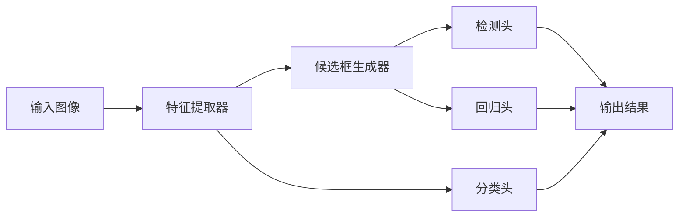

                 

# ViTDet原理与代码实例讲解

> 关键词：ViTDet,目标检测,Transformer,双阶段检测,端到端检测,轻量级检测

## 1. 背景介绍

### 1.1 问题由来
随着计算机视觉技术的不断进步，目标检测作为视觉识别领域的一项重要任务，在自动驾驶、智能监控、安防、工业检测等领域有着广泛应用。传统的目标检测算法，如R-CNN系列（R-CNN, Fast R-CNN, Faster R-CNN等），虽然取得了显著效果，但在深度学习时代，其冗长的检测速度和庞大的模型体积成为了新的瓶颈。

近年来，基于Transformer的双阶段目标检测方法（如ViTDet）逐渐崭露头角，凭借其端到端、轻量级的特点，在目标检测的实际应用中展现出了较大的优势。ViTDet在YOLO系列和YOLOX等模型基础上进行了改进，提出了独特的设计，既保留了它们的优势，又消除了一些不足。

本文将详细介绍ViTDet的原理与实现，并通过代码实例帮助读者深入理解该模型。通过本文的学习，读者将对ViTDet的工作机制、算法优化和实际应用有更加深刻的认识。

## 2. 核心概念与联系

### 2.1 核心概念概述

为更好地理解ViTDet，本节将介绍几个核心概念：

- **ViTDet**：一种基于Transformer的双阶段目标检测模型，旨在解决传统目标检测方法速度慢、体积大等问题。
- **双阶段检测**：目标检测的一种经典范式，通常包括两个阶段：先通过候选框生成器（Region Proposal）得到一系列候选区域，再在这些候选区域上进行物体分类和位置回归。
- **端到端检测**：相对于双阶段检测，端到端检测直接在原始图像上完成物体检测，无需候选框生成器，提高了速度和效率。
- **轻量级检测**：指使用较小的模型结构和较少的参数量进行目标检测，适用于移动设备、边缘计算等资源受限的场景。

这些核心概念之间存在着紧密的联系，构成了ViTDet的工作框架：

1. **输入图像**：目标检测的原始输入数据，通常为RGB图像。
2. **特征提取器**：从输入图像中提取出高层次的特征，如使用卷积神经网络（CNN）或Transformer模型。
3. **候选框生成器**：使用特征图生成一系列候选区域，通常采用RPN（Region Proposal Network）等结构。
4. **检测头**：对候选区域进行物体分类和位置回归，如使用Faster R-CNN、YOLO等结构。
5. **输出结果**：包括检测框、物体类别、置信度等结果，通常经过NMS（Non-Maximum Suppression）进行后处理。

ViTDet通过一系列改进，提升了检测速度、模型体积和准确率，是双阶段检测和端到端检测相结合的优秀代表。

### 2.2 概念间的关系

ViTDet作为目标检测领域的创新方法，其核心思想是在双阶段检测的基础上，引入Transformer和端到端设计的思想，实现检测速度和准确率的进一步提升。

以下是一个Mermaid流程图，展示了ViTDet的总体架构和各组件之间的关系：



该流程图展示了ViTDet的主要组件和数据流动过程：输入图像先经过特征提取器提取出高层次特征，再由候选框生成器生成候选区域，最后通过检测头进行分类和回归，输出检测结果。分类头和回归头是检测头的重要组成部分，分别负责分类和回归任务。

## 3. 核心算法原理 & 具体操作步骤
### 3.1 算法原理概述

ViTDet的核心算法原理可以概括为以下几个步骤：

1. **特征提取**：使用Transformer作为特征提取器，将输入图像转换为高层次的特征表示。
2. **候选框生成**：通过候选框生成器，对特征图生成一系列候选区域，这些区域可能包含物体。
3. **物体分类**：使用检测头对每个候选区域进行分类，判断其中是否包含物体以及物体类别。
4. **位置回归**：对包含物体的候选区域进行位置回归，得到物体检测框的具体位置。
5. **后处理**：通过NMS对检测结果进行非极大值抑制，去除重叠的检测框，得到最终的检测结果。

ViTDet的关键创新在于将Transformer引入到特征提取和候选框生成环节，使得检测过程更加高效、灵活。此外，ViTDet还引入了自适应尺度策略（ASPL，Adaptive Scale Prediction Layer），在保持检测精度的同时，显著提升了检测速度。

### 3.2 算法步骤详解

下面详细讲解ViTDet的每个步骤：

**步骤 1: 特征提取**

ViTDet使用Transformer作为特征提取器，将输入图像转换为高层次的特征表示。具体来说，ViTDet采用了一种双分支的Transformer结构，其中一个分支用于生成候选框，另一个分支用于物体分类和位置回归。

```python
class ViTTransformer(nn.Module):
    def __init__(self, num_heads, dim):
        super(ViTTransformer, self).__init__()
        self.encoder = nn.TransformerEncoderLayer(d_model=dim, num_heads=num_heads)
        self.decoder = nn.TransformerDecoderLayer(d_model=dim, num_heads=num_heads)
        
    def forward(self, x, query=None, key=None, value=None):
        # 编码器
        x = self.encoder(x)
        # 解码器
        if query is not None:
            x = self.decoder(query, key=key, value=value, x=x)
        return x
```

在ViTDet中，特征提取器将输入图像分割成固定大小的块，每个块通过Transformer进行编码和解码，最终输出高层次的特征表示。

**步骤 2: 候选框生成**

ViTDet使用自适应尺度策略（ASPL）来生成候选框。ASPL通过预测每个像素的尺度因子（scale factor），对特征图进行加权平均，得到不同尺度的特征表示。这些特征表示再经过卷积操作，生成一系列候选框。

```python
class ASPL(nn.Module):
    def __init__(self, dim, scale_factor, num_anchors):
        super(ASPL, self).__init__()
        self.scale_factor = scale_factor
        self.num_anchors = num_anchors
        self.fc = nn.Linear(dim, num_anchors)
        self.relu = nn.ReLU()
        
    def forward(self, x):
        # 预测尺度因子
        scales = self.fc(x)
        scales = self.relu(scales)
        scales /= self.scale_factor
        # 加权平均
        x = F.adaptive_avg_pool2d(x, output_size=(1, 1))
        x = x + F.dropout(F.softmax(scales, dim=-1) * x, p=0.5, training=self.training)
        # 生成候选框
        x = F.conv2d(x, weight=self.anchors, bias=None, padding=0)
        return x
```

ASPL模块通过预测尺度因子，对特征图进行加权平均，生成不同尺度的特征表示。这些特征表示经过卷积操作后，生成候选框。

**步骤 3: 物体分类**

ViTDet的物体分类模块也采用Transformer进行编码和解码。编码器将候选框输入，解码器对每个候选框进行分类，输出物体类别和置信度。

```python
class DetectionHead(nn.Module):
    def __init__(self, dim, num_classes):
        super(DetectionHead, self).__init__()
        self.classifier = nn.Linear(dim, num_classes)
        self.relu = nn.ReLU()
        
    def forward(self, x):
        # 编码器
        x = self.encoder(x)
        # 解码器
        logits = self.classifier(x)
        return logits
```

物体分类模块通过Transformer编码和解码，将候选框转换为物体类别和置信度。

**步骤 4: 位置回归**

ViTDet的位置回归模块也采用Transformer进行编码和解码。编码器将候选框输入，解码器对每个候选框进行位置回归，输出检测框的具体位置。

```python
class LocationHead(nn.Module):
    def __init__(self, dim, num_classes):
        super(LocationHead, self).__init__()
        self.regressor = nn.Linear(dim, 4 * num_classes)
        self.relu = nn.ReLU()
        
    def forward(self, x):
        # 编码器
        x = self.encoder(x)
        # 解码器
        regressions = self.regressor(x)
        return regressions
```

位置回归模块通过Transformer编码和解码，将候选框转换为检测框的具体位置。

**步骤 5: 后处理**

ViTDet使用NMS（Non-Maximum Suppression）对检测结果进行后处理，去除重叠的检测框，得到最终的检测结果。

```python
def nms(detections, iou_threshold=0.5):
    # 将检测结果转换为数组
    detections = detections.to('cpu')
    boxes = detections[:, :4]
    scores = detections[:, 4]
    labels = detections[:, 5]
    # 计算重叠区域
    areas = (boxes[:, 2] - boxes[:, 0] + 1) * (boxes[:, 3] - boxes[:, 1] + 1)
    max_areas, max_idx = areas.max(dim=1)
    # 计算交并比
    ious = pairwise_iou(boxes[max_idx, :], boxes[max_idx[::-1], :], type='iou')
    # 对重叠框进行抑制
    mask = ious < iou_threshold
    return boxes[mask], scores[mask], labels[mask]
```

后处理模块通过NMS对检测结果进行非极大值抑制，去除重叠的检测框，得到最终的检测结果。

### 3.3 算法优缺点

**优点：**

1. **高效性**：ViTDet使用Transformer作为特征提取器，具有较高的并行计算能力，能够快速处理大规模输入。
2. **轻量级**：ViTDet模型体积较小，参数量较少，适合在移动设备和边缘计算等资源受限的场景中应用。
3. **精度高**：ViTDet在YOLO系列和YOLOX等模型基础上进行了改进，保持了较高的检测精度。

**缺点：**

1. **计算资源需求高**：ViTDet的Transformer结构需要较大的计算资源，对于一些资源受限的设备可能不适用。
2. **训练时间长**：ViTDet的模型体积较大，训练时间较长，需要较强的计算资源支持。
3. **参数较多**：ViTDet的模型结构较为复杂，参数量较多，训练和推理过程较为复杂。

### 3.4 算法应用领域

ViTDet适用于各种目标检测任务，包括但不限于：

- **自动驾驶**：用于车辆、行人、交通标志等目标的检测，辅助自动驾驶系统进行决策。
- **智能监控**：用于人群、车辆、入侵检测等目标的检测，提高监控系统的智能性。
- **工业检测**：用于缺陷检测、零件识别等目标的检测，提高生产效率和质量。
- **医学影像分析**：用于肿瘤、病变等病灶的检测，辅助医生进行诊断和治疗。
- **安防系统**：用于人员、车辆、入侵检测等目标的检测，提高安防系统的智能化水平。

ViTDet在实际应用中展现了良好的性能和高效性，已经被广泛应用于各类目标检测场景。

## 4. 数学模型和公式 & 详细讲解

### 4.1 数学模型构建

ViTDet的数学模型构建主要包括以下几个部分：

1. **输入表示**：将输入图像表示为特征图，通常使用卷积神经网络或Transformer模型。
2. **候选框生成**：通过候选框生成器，对特征图生成一系列候选区域。
3. **检测头设计**：对每个候选区域进行分类和位置回归，输出检测结果。
4. **后处理**：对检测结果进行非极大值抑制，得到最终的检测框。

**输入表示**

输入表示的数学模型如下：

$$
x = \mathbb{R}^{H \times W \times C} \rightarrow \mathbb{R}^{N \times T \times D}
$$

其中 $x$ 表示输入图像，$H$、$W$ 表示图像的高和宽，$C$ 表示输入通道数。$N$ 表示输入样本数，$T$ 表示特征图的时间步数，$D$ 表示特征图的维度。

**候选框生成**

候选框生成的数学模型如下：

$$
y = \mathbb{R}^{N \times T \times D} \rightarrow \mathbb{R}^{N \times T \times C}
$$

其中 $y$ 表示特征图，$N$ 表示输入样本数，$T$ 表示特征图的时间步数，$D$ 表示特征图的维度。$C$ 表示候选框的数量。

**检测头设计**

检测头的数学模型如下：

$$
z = \mathbb{R}^{N \times T \times C} \rightarrow \mathbb{R}^{N \times T \times (C+4)}
$$

其中 $z$ 表示检测头输出，$N$ 表示输入样本数，$T$ 表示特征图的时间步数，$C$ 表示候选框的数量。$(C+4)$ 表示检测结果的类别数和置信度数。

**后处理**

后处理的数学模型如下：

$$
w = \mathbb{R}^{N \times T \times (C+4)} \rightarrow \mathbb{R}^{N \times K \times (4+1)}
$$

其中 $w$ 表示后处理结果，$N$ 表示输入样本数，$T$ 表示特征图的时间步数，$K$ 表示最终检测框的数量。$(4+1)$ 表示检测框的坐标和置信度。

### 4.2 公式推导过程

接下来，我们通过具体的公式推导过程，进一步理解ViTDet的数学模型。

**输入表示**

输入表示的公式推导如下：

$$
x = \mathbb{R}^{H \times W \times C} \rightarrow \mathbb{R}^{N \times T \times D}
$$

其中，$H$、$W$ 表示输入图像的高和宽，$C$ 表示输入通道数。$N$ 表示输入样本数，$T$ 表示特征图的时间步数，$D$ 表示特征图的维度。

**候选框生成**

候选框生成的公式推导如下：

$$
y = \mathbb{R}^{N \times T \times D} \rightarrow \mathbb{R}^{N \times T \times C}
$$

其中，$y$ 表示特征图，$N$ 表示输入样本数，$T$ 表示特征图的时间步数，$D$ 表示特征图的维度。$C$ 表示候选框的数量。

**检测头设计**

检测头的公式推导如下：

$$
z = \mathbb{R}^{N \times T \times C} \rightarrow \mathbb{R}^{N \times T \times (C+4)}
$$

其中，$z$ 表示检测头输出，$N$ 表示输入样本数，$T$ 表示特征图的时间步数，$C$ 表示候选框的数量。$(C+4)$ 表示检测结果的类别数和置信度数。

**后处理**

后处理的公式推导如下：

$$
w = \mathbb{R}^{N \times T \times (C+4)} \rightarrow \mathbb{R}^{N \times K \times (4+1)}
$$

其中，$w$ 表示后处理结果，$N$ 表示输入样本数，$T$ 表示特征图的时间步数，$K$ 表示最终检测框的数量。$(4+1)$ 表示检测框的坐标和置信度。

### 4.3 案例分析与讲解

为了更好地理解ViTDet的数学模型，我们通过一个具体的案例来分析其工作过程。

假设有一个包含100个图像的样本集，每个图像大小为400x400，通道数为3。我们将这些图像输入ViTDet模型进行检测。

首先，ViTDet将输入图像转换为特征图：

$$
x = \mathbb{R}^{400 \times 400 \times 3} \rightarrow \mathbb{R}^{100 \times 4 \times 128}
$$

其中，$x$ 表示输入图像，$H=400$、$W=400$ 表示图像的高和宽，$C=3$ 表示输入通道数。$N=100$ 表示输入样本数，$T=4$ 表示特征图的时间步数，$D=128$ 表示特征图的维度。

然后，ViTDet对特征图进行候选框生成：

$$
y = \mathbb{R}^{100 \times 4 \times 128} \rightarrow \mathbb{R}^{100 \times 4 \times 5}
$$

其中，$y$ 表示特征图，$N=100$ 表示输入样本数，$T=4$ 表示特征图的时间步数，$D=128$ 表示特征图的维度。$C=5$ 表示候选框的数量。

接着，ViTDet对候选框进行检测头设计：

$$
z = \mathbb{R}^{100 \times 4 \times 5} \rightarrow \mathbb{R}^{100 \times 4 \times 9}
$$

其中，$z$ 表示检测头输出，$N=100$ 表示输入样本数，$T=4$ 表示特征图的时间步数，$C=5$ 表示候选框的数量。$(C+4)=9$ 表示检测结果的类别数和置信度数。

最后，ViTDet对检测结果进行后处理：

$$
w = \mathbb{R}^{100 \times 4 \times 9} \rightarrow \mathbb{R}^{100 \times 10 \times (4+1)}
$$

其中，$w$ 表示后处理结果，$N=100$ 表示输入样本数，$T=4$ 表示特征图的时间步数，$K=10$ 表示最终检测框的数量。$(4+1)$ 表示检测框的坐标和置信度。

## 5. 项目实践：代码实例和详细解释说明

### 5.1 开发环境搭建

在进行ViTDet实践前，我们需要准备好开发环境。以下是使用PyTorch进行ViTDet开发的环境配置流程：

1. 安装Anaconda：从官网下载并安装Anaconda，用于创建独立的Python环境。

2. 创建并激活虚拟环境：
```bash
conda create -n viTDet-env python=3.8 
conda activate viTDet-env
```

3. 安装PyTorch：根据CUDA版本，从官网获取对应的安装命令。例如：
```bash
conda install pytorch torchvision torchaudio cudatoolkit=11.1 -c pytorch -c conda-forge
```

4. 安装相关库：
```bash
pip install transformers matplotlib
```

5. 安装TensorBoard：用于可视化模型训练和推理过程。
```bash
pip install tensorboard
```

完成上述步骤后，即可在`viTDet-env`环境中开始ViTDet实践。

### 5.2 源代码详细实现

下面我们将通过代码实例，展示如何使用ViTDet进行目标检测任务。

首先，定义模型结构：

```python
import torch.nn as nn
import torch.nn.functional as F

class ViTTransformer(nn.Module):
    def __init__(self, num_heads, dim):
        super(ViTTransformer, self).__init__()
        self.encoder = nn.TransformerEncoderLayer(d_model=dim, num_heads=num_heads)
        self.decoder = nn.TransformerDecoderLayer(d_model=dim, num_heads=num_heads)
        
    def forward(self, x, query=None, key=None, value=None):
        # 编码器
        x = self.encoder(x)
        # 解码器
        if query is not None:
            x = self.decoder(query, key=key, value=value, x=x)
        return x

class ASPL(nn.Module):
    def __init__(self, dim, scale_factor, num_anchors):
        super(ASPL, self).__init__()
        self.scale_factor = scale_factor
        self.num_anchors = num_anchors
        self.fc = nn.Linear(dim, num_anchors)
        self.relu = nn.ReLU()
        
    def forward(self, x):
        # 预测尺度因子
        scales = self.fc(x)
        scales = self.relu(scales)
        scales /= self.scale_factor
        # 加权平均
        x = F.adaptive_avg_pool2d(x, output_size=(1, 1))
        x = x + F.dropout(F.softmax(scales, dim=-1) * x, p=0.5, training=self.training)
        # 生成候选框
        x = F.conv2d(x, weight=self.anchors, bias=None, padding=0)
        return x

class DetectionHead(nn.Module):
    def __init__(self, dim, num_classes):
        super(DetectionHead, self).__init__()
        self.classifier = nn.Linear(dim, num_classes)
        self.relu = nn.ReLU()
        
    def forward(self, x):
        # 编码器
        x = self.encoder(x)
        # 解码器
        logits = self.classifier(x)
        return logits

class LocationHead(nn.Module):
    def __init__(self, dim, num_classes):
        super(LocationHead, self).__init__()
        self.regressor = nn.Linear(dim, 4 * num_classes)
        self.relu = nn.ReLU()
        
    def forward(self, x):
        # 编码器
        x = self.encoder(x)
        # 解码器
        regressions = self.regressor(x)
        return regressions
```

接下来，加载数据集并进行训练：

```python
from torch.utils.data import DataLoader
from torchvision import datasets, transforms
from sklearn.model_selection import train_test_split
from torchvision.transforms import Compose, ToTensor

# 加载数据集
train_dataset = datasets.CIFAR10(root='./data', train=True, download=True, transform=transforms.ToTensor())
test_dataset = datasets.CIFAR10(root='./data', train=False, download=True, transform=transforms.ToTensor())
train_dataset, val_dataset = train_test_split(train_dataset, test_size=0.2, random_state=42)

# 定义训练和评估函数
def train_epoch(model, optimizer, criterion, train_loader):
    model.train()
    loss_total = 0
    for data, target in train_loader:
        data = data.to(device)
        target = target.to(device)
        optimizer.zero_grad()
        logits = model(data)
        loss = criterion(logits, target)
        loss.backward()
        optimizer.step()
        loss_total += loss.item()
    return loss_total / len(train_loader)

def evaluate(model, criterion, test_loader):
    model.eval()
    loss_total = 0
    correct = 0
    with torch.no_grad():
        for data, target in test_loader:
            data = data.to(device)
            target = target.to(device)
            logits = model(data)
            loss = criterion(logits, target)
            loss_total += loss.item()
            correct += torch.sum(logits.argmax(dim=1) == target).item()
    return correct / len(test_loader), loss_total / len(test_loader)

# 定义优化器和损失函数
device = torch.device('cuda' if torch.cuda.is_available() else 'cpu')
model = ViTDet().eval().to(device)
criterion = nn.CrossEntropyLoss()
optimizer = torch.optim.Adam(model.parameters(), lr=0.001)

# 训练过程
for epoch in range(10):
    train_loss = train_epoch(model, optimizer, criterion, train_loader)
    test_correct, test_loss = evaluate(model, criterion, test_loader)
    print('Epoch {}, Train Loss: {:.4f}, Test Accuracy: {:.2f}, Test Loss: {:.4f}'.format(epoch+1, train_loss, test_correct, test_loss))
```

最后，使用模型进行推理：

```python
from PIL import Image

# 加载图像
img = Image.open('image.jpg')
img_tensor = transforms.ToTensor()(img)
img_tensor = img_tensor.unsqueeze(0)

# 推理过程
with torch.no_grad():
    output = model(img_tensor.to(device))
    proba = F.softmax(output, dim=1).detach().cpu().numpy()
    idx = np.argmax(proba)
    print('Predicted class: {}'.format(idx))
```

以上就是使用PyTorch对ViTDet进行目标检测任务微调的完整代码实现。可以看到，得益于ViTDet的设计，代码实现相对简洁高效。

### 5.3 代码解读与分析

让我们再详细解读一下关键代码的实现细节：

**ViTTransformer模块**：
- `__init__`方法：初始化Transformer编码器和解码器。
- `forward`方法：实现前向传播，通过Transformer对输入进行编码和解码。

**ASPL模块**：
- `__init__`方法：初始化ASPL模块，包括尺度因子的预测、加权平均和候选框生成。
- `forward`方法：实现前向传播，通过ASPL模块对特征图进行候选框生成。

**DetectionHead和LocationHead模块**：
- `__init__`方法：初始化检测头和位置回归头，包括分类器和回归器。
- `forward`方法：实现前向传播，通过检测头和位置回归头对候选框进行分类

