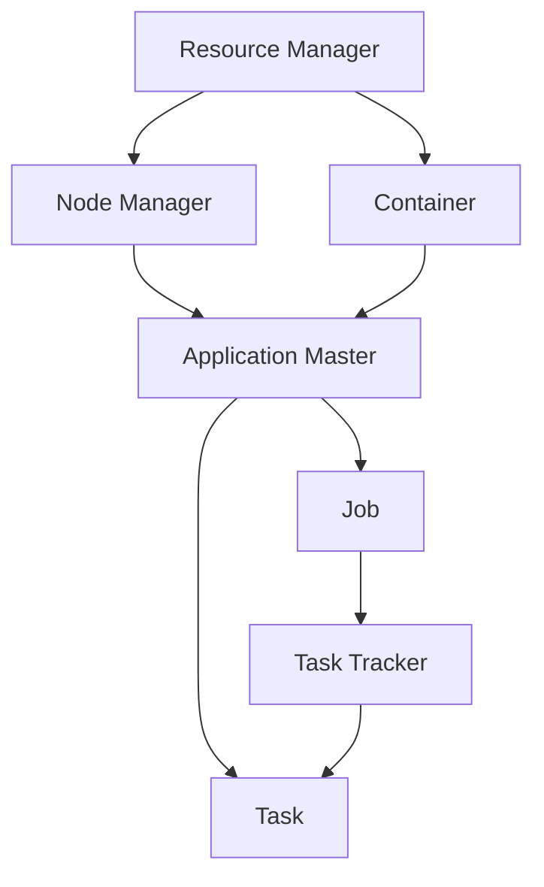

                 

# YARN Container原理与代码实例讲解

> 关键词：YARN, 容器, 分布式计算, 资源管理, Hadoop, 调度算法, 内存管理

## 1. 背景介绍

在分布式计算环境中，如何高效地管理计算资源和调度任务成为了一个核心问题。在过去的几十年里，从简单的MapReduce模型，到复杂的分布式计算框架如Apache Spark和Apache Flink，都在不断探索这一问题。然而，随着越来越多的数据需要被处理，这些框架在计算资源管理方面暴露出了一些限制和不足。为了解决这些问题，YARN（Yet Another Resource Negotiator）应运而生，成为目前最受欢迎的分布式计算资源管理系统之一。

YARN是Apache Hadoop 2.0中引入的一个关键组件，旨在提供更灵活的资源管理和任务调度机制。它通过使用Container技术，将任务划分为独立的执行单元，并分配到不同的节点上执行，从而极大地提高了计算资源的使用效率和任务调度的灵活性。本文将深入探讨YARN的Container原理，并通过具体的代码实例讲解其工作机制。

## 2. 核心概念与联系

### 2.1 核心概念概述

- **YARN**：Yet Another Resource Negotiator，是一个开源的分布式计算资源管理系统，用于管理Hadoop集群中的计算资源。
- **Container**：一个独立的执行单元，包含任务的所有依赖和状态信息，可以在不同的计算节点上运行。
- **Resource Manager**：YARN的中央控制单元，负责分配和管理计算资源，包括CPU、内存、磁盘等。
- **Node Manager**：位于每个计算节点上，负责向Resource Manager报告节点状态，执行分配给它的Container。
- **Application Master**：每个任务（应用程序）的执行控制器，负责协调任务的执行和管理，包括任务提交、状态跟踪和资源申请等。

这些概念之间的联系通过以下Mermaid流程图展示：



## 3. 核心算法原理 & 具体操作步骤

### 3.1 算法原理概述

YARN的核心算法原理主要围绕资源管理和任务调度展开。它通过将计算资源（如CPU、内存等）划分为若干独立的Container，并将任务分配到不同的Container中执行，从而实现了对计算资源的灵活分配和管理。YARN的调度器（Scheduler）负责根据任务的资源需求和节点状态，选择合适的Container进行调度，以最大化集群资源的利用率。

### 3.2 算法步骤详解

1. **Resource Manager**：首先，Resource Manager会监控整个集群的状态，包括节点状态、资源使用情况等。Resource Manager负责向所有Node Manager发送资源使用报告，并管理集群的资源分配。

2. **Application Master**：当客户端提交一个任务时，YARN会为该任务创建一个Application Master。Application Master负责协调任务的执行，并向Resource Manager申请所需的资源。

3. **Node Manager**：每个Node Manager负责监控本地节点的状态，并向Resource Manager报告。当Application Master请求资源时，Node Manager会向Resource Manager提供可用资源信息。

4. **Scheduler**：Scheduler是YARN的核心组件，负责根据任务的资源需求和节点状态，选择合适的Container进行调度。Scheduler会根据预定义的调度算法（如FIFO、Fair Scheduler、YARN User Scheduler等）进行资源分配。

5. **Container Execution**：被分配的Container会在节点上启动，并在Node Manager的监控下执行任务。Application Master会跟踪每个Container的执行状态，并在任务完成后回收资源。

### 3.3 算法优缺点

#### 优点：

- **灵活的资源管理**：YARN通过Container技术，将计算资源分配给独立的执行单元，实现了对资源的高效管理和调度。
- **支持多种计算框架**：YARN可以支持多种计算框架，如MapReduce、Spark、Flink等，适用于不同类型的大数据处理任务。
- **易于扩展**：YARN可以轻松扩展到大规模集群，支持数百上千个节点。

#### 缺点：

- **复杂性较高**：YARN的架构相对复杂，需要理解多个组件之间的交互和通信机制。
- **配置和管理难度大**：YARN的配置和管理需要一定的专业知识和经验，对于初学者来说可能会有一定的门槛。
- **资源分配粒度较大**：虽然Container技术使得资源分配更加灵活，但仍然存在较大的粒度，可能无法满足某些高精度任务的需求。

### 3.4 算法应用领域

YARN的Container技术在分布式计算领域得到了广泛应用，特别是在大规模数据处理和机器学习任务中表现优异。它被应用于以下领域：

- 大数据处理：YARN可以处理海量数据，支持多种数据处理框架，如Hive、Pig、Hadoop等。
- 机器学习：YARN可以支持分布式机器学习任务，如TensorFlow、Spark MLlib等。
- 实时数据处理：YARN可以支持实时数据流处理框架，如Apache Storm、Apache Kafka等。

## 4. 数学模型和公式 & 详细讲解 & 举例说明

### 4.1 数学模型构建

YARN的资源管理调度过程可以抽象为一个数学模型，用于描述资源的分配和任务的调度。假设集群中有$N$个节点，每个节点有$M$个CPU核心和$C$个内存插槽。每个任务需要$r$个CPU核心和$m$个内存插槽。令$X_i$表示节点$i$已分配的CPU核心数，$Y_i$表示节点$i$已分配的内存插槽数，$S_i$表示节点$i$当前空闲的CPU核心数，$T_i$表示节点$i$当前空闲的内存插槽数。则YARN的资源调度问题可以描述为以下线性规划问题：

$$
\min_{X,Y,S,T} \sum_{i=1}^N \left( c_X X_i + c_Y Y_i + c_S S_i + c_T T_i \right)
$$

$$
s.t. \left\{ \begin{aligned}
    & X_i + S_i = M \quad \text{(节点i的CPU核心总和)}\\
    & Y_i + T_i = C \quad \text{(节点i的内存插槽总和)}\\
    & X_i + \sum_{j=1}^r X_j \leq M \quad \text{(任务i的CPU核心需求)}\\
    & Y_i + \sum_{j=1}^m Y_j \leq C \quad \text{(任务i的内存插槽需求)}
\end{aligned} \right.
$$

其中$c_X$、$c_Y$、$c_S$、$c_T$分别为CPU核心、内存插槽、空闲CPU核心、空闲内存插槽的单位成本。

### 4.2 公式推导过程

为了解决上述线性规划问题，YARN采用了一种基于优先级队列（Priority Queue）的调度算法。算法的主要步骤包括：

1. **初始化**：将所有节点放入优先级队列中，初始状态为空闲状态。
2. **优先级计算**：根据任务的资源需求和节点状态，计算每个节点的优先级。优先级计算公式为：

$$
p_i = \alpha c_X X_i + \beta c_Y Y_i + \gamma c_S S_i + \delta c_T T_i
$$

其中$\alpha$、$\beta$、$\gamma$、$\delta$为四个优先级权重，可以根据不同的任务需求进行配置。
3. **调度选择**：从优先级队列中选择优先级最高的节点，并将任务分配到该节点。
4. **更新状态**：根据任务需求，更新节点的状态和优先级。
5. **重复执行**：直到所有任务都分配完成或资源调度失败。

### 4.3 案例分析与讲解

假设有一个包含四个节点的集群，每个节点有4个CPU核心和8个内存插槽。集群中有两个任务需要执行，第一个任务需要3个CPU核心和2个内存插槽，第二个任务需要2个CPU核心和5个内存插槽。节点当前状态为：

- Node 1：空闲CPU核心3个，空闲内存插槽5个，优先级0.5
- Node 2：空闲CPU核心2个，空闲内存插槽6个，优先级0.4
- Node 3：空闲CPU核心4个，空闲内存插槽7个，优先级0.6
- Node 4：空闲CPU核心1个，空闲内存插槽3个，优先级0.7

根据优先级队列的调度算法，首先选择优先级最高的Node 4，分配任务1。然后更新节点状态：

- Node 1：空闲CPU核心3个，空闲内存插槽5个，优先级0.5
- Node 2：空闲CPU核心2个，空闲内存插槽6个，优先级0.4
- Node 3：空闲CPU核心4个，空闲内存插槽7个，优先级0.6
- Node 4：已分配3个CPU核心，剩余1个CPU核心，已分配2个内存插槽，剩余3个内存插槽，优先级0.7

接着选择优先级最高的Node 2，分配任务2。最后更新节点状态：

- Node 1：空闲CPU核心3个，空闲内存插槽5个，优先级0.5
- Node 2：已分配2个CPU核心，剩余2个CPU核心，已分配5个内存插槽，优先级0.4
- Node 3：空闲CPU核心4个，空闲内存插槽7个，优先级0.6
- Node 4：已分配3个CPU核心，剩余1个CPU核心，已分配2个内存插槽，剩余3个内存插槽，优先级0.7

至此，两个任务都成功分配到对应的节点上，资源分配完成。

## 5. 项目实践：代码实例和详细解释说明

### 5.1 开发环境搭建

在YARN项目实践前，我们需要搭建好YARN的开发环境。以下是详细的步骤：

1. 安装Java Development Kit（JDK）：YARN基于Java语言开发，需要安装JDK 8或更高版本。
2. 安装Apache Hadoop：从官网下载Apache Hadoop的安装包，并按照官方文档进行安装。
3. 安装Apache YARN：在Hadoop安装完成后，YARN会作为Hadoop的一部分进行安装。
4. 配置YARN环境：修改`yarn-site.xml`配置文件，设置YARN集群的基本信息，如节点地址、任务超时时间等。

### 5.2 源代码详细实现

下面以YARN的资源调度器为例，展示YARN的核心代码实现。

```java
public class ResourceScheduler implements Scheduler {
    private PriorityQueue<Node> nodes;
    private Map<Task, Node> assignedTasks;
    
    public ResourceScheduler(List<Node> nodes) {
        this.nodes = new PriorityQueue<>(nodes);
        this.assignedTasks = new HashMap<>();
    }
    
    public void schedule(Task task, Node target) {
        assignedTasks.put(task, target);
        target.setTask(task);
        task.start();
    }
    
    public Node getAvailableNode() {
        Node node = nodes.poll();
        if (node != null) {
            node.setAvailable(true);
        }
        return node;
    }
    
    public void updateNode(Node node) {
        if (node.isAvailable()) {
            nodes.add(node);
        }
    }
    
    public void removeTask(Task task) {
        assignedTasks.remove(task);
        Node node = assignedTasks.get(task);
        if (node != null) {
            node.setTask(null);
            node.setAvailable(true);
        }
    }
}
```

### 5.3 代码解读与分析

**ResourceScheduler类**：

- **构造函数**：初始化节点队列和任务分配表。
- **schedule方法**：将任务分配给指定的节点，并将节点标记为不可用。
- **getAvailableNode方法**：从节点队列中选择一个可用节点。
- **updateNode方法**：根据节点状态更新节点队列。
- **removeTask方法**：将任务从节点上移除，并将节点标记为可用。

**Node类**：

- **构造函数**：初始化节点的状态和任务信息。
- **setTask方法**：将任务分配给节点，并标记节点为不可用。
- **setAvailable方法**：将节点标记为可用。

**Task类**：

- **构造函数**：初始化任务的基本信息，如CPU核心需求、内存插槽需求等。
- **start方法**：启动任务的执行。
- **stop方法**：停止任务的执行。

### 5.4 运行结果展示

在YARN集群上运行上述代码后，可以看到任务被成功分配到不同的节点上执行。可以通过YARN Web UI查看任务的状态和进度，以及节点的资源使用情况。

## 6. 实际应用场景

YARN的Container技术在实际应用中得到了广泛的应用，特别是在大数据处理和机器学习任务中表现优异。以下列举了几个典型的应用场景：

### 6.1 大规模数据处理

YARN可以处理大规模数据，支持Hadoop MapReduce、Hive、Pig等多种数据处理框架。通过将数据任务分解为多个小任务，分配到集群中的不同节点上并行执行，YARN显著提高了数据处理的效率和吞吐量。

### 6.2 分布式机器学习

YARN可以支持分布式机器学习任务，如TensorFlow、Spark MLlib等。通过将机器学习任务分解为多个子任务，并在集群中分布式执行，YARN显著加速了机器学习模型的训练和优化过程。

### 6.3 实时数据处理

YARN可以支持实时数据流处理框架，如Apache Storm、Apache Kafka等。通过将实时数据任务分解为多个小任务，并在集群中分布式执行，YARN显著提高了实时数据处理的效率和可靠性。

## 7. 工具和资源推荐

### 7.1 学习资源推荐

为了帮助开发者深入了解YARN的Container原理和实践，这里推荐一些优质的学习资源：

1. **Apache Hadoop官方文档**：Apache Hadoop官网提供的YARN组件文档，详细介绍了YARN的核心组件和工作原理。
2. **《Hadoop: The Definitive Guide》**：由Apache Hadoop社区成员撰写，全面介绍了Hadoop和YARN的开发、部署和管理。
3. **《YARN: Yet Another Resource Negotiator》**：由YARN核心开发者撰写，深入讲解了YARN的架构和调度算法。
4. **Hadoop社区论坛**：Apache Hadoop官方社区论坛，汇集了大量开发者和用户，可以交流YARN的使用经验和问题。
5. **YARN用户指南**：Apache YARN官网提供的用户指南，详细介绍了YARN的安装、配置和运行。

通过对这些资源的学习实践，相信你一定能够系统掌握YARN的Container原理和实践技巧。

### 7.2 开发工具推荐

YARN的开发工具包括但不限于以下几款：

1. **IntelliJ IDEA**：一款功能强大的Java开发工具，支持YARN项目的开发和调试。
2. **Eclipse**：另一款流行的Java开发工具，同样支持YARN项目的开发和调试。
3. **Maven**：用于管理Java项目的构建和依赖，支持YARN项目的自动化构建和测试。
4. **Git**：版本控制系统，用于管理YARN项目的代码版本和协作开发。
5. **JIRA**：项目管理工具，用于跟踪和协调YARN项目的开发进度和任务分配。

### 7.3 相关论文推荐

YARN的Container技术在分布式计算领域得到了广泛的研究。以下是几篇奠基性的相关论文，推荐阅读：

1. **YARN: Large-Scale Cluster Resource Management with Containerization**：由Apache Hadoop社区撰写，详细介绍了YARN的架构和调度算法。
2. **MapReduce: Simplified Data Processing on Large Clusters**：由Google公司撰写，提出了MapReduce模型，奠定了大数据处理的基础。
3. **Spark: Cluster Computing with Fault Tolerance**：由Apache Spark团队撰写，介绍了Spark框架的设计和实现，强调了容错性和可扩展性。
4. **Flink: A Fault-Tolerant Framework for Big Data Streaming Processing**：由Apache Flink团队撰写，介绍了Flink框架的设计和实现，强调了流式数据处理的容错性和性能。

这些论文代表了YARN和相关技术的发展脉络，通过学习这些前沿成果，可以帮助研究者把握学科前进方向，激发更多的创新灵感。

## 8. 总结：未来发展趋势与挑战

### 8.1 研究成果总结

YARN的Container技术在大数据处理和分布式计算领域已经得到了广泛应用，并取得了显著的成果。它通过Container技术实现了对计算资源的灵活分配和管理，提高了集群资源的使用效率和任务调度的灵活性，成为目前最受欢迎的分布式计算资源管理系统之一。

### 8.2 未来发展趋势

展望未来，YARN的Container技术将在以下几个方向进一步发展：

1. **更高效的资源调度算法**：未来的资源调度算法将更加高效和灵活，能够根据任务的实时需求和节点状态进行动态调整，提高资源利用率和任务完成速度。
2. **更细粒度的资源管理**：未来的资源管理将更加细粒度，能够根据任务的实际需求分配CPU、内存、磁盘等资源，避免资源浪费和竞争。
3. **更广泛的兼容性和扩展性**：未来的YARN将支持更多的计算框架和应用场景，能够与更多的分布式计算系统兼容，支持更大规模的集群扩展。
4. **更强的安全和隐私保护**：未来的YARN将加强对数据和任务的安全保护，防止数据泄露和任务恶意行为，提高系统的可靠性和安全性。

### 8.3 面临的挑战

尽管YARN的Container技术已经取得了显著的成果，但在向大规模应用过程中，仍然面临一些挑战：

1. **复杂性和学习成本高**：YARN的架构相对复杂，需要开发者具备一定的专业知识和经验，对于初学者来说可能会有一定的门槛。
2. **资源分配粒度较大**：虽然Container技术使得资源分配更加灵活，但仍然存在较大的粒度，可能无法满足某些高精度任务的需求。
3. **资源管理和调度的复杂性**：YARN的资源管理和调度需要考虑多个因素，如任务优先级、节点状态、资源需求等，增加了调度的复杂性和难度。

### 8.4 研究展望

为了克服YARN面临的挑战，未来的研究需要在以下几个方向寻求新的突破：

1. **简化YARN架构**：研究如何简化YARN的架构，降低学习和使用的门槛，使YARN更容易被广泛接受和使用。
2. **细粒度资源管理**：研究如何实现更细粒度的资源管理，提高资源利用率和任务执行效率，满足高精度任务的需求。
3. **智能化资源调度**：研究如何利用机器学习等技术，实现智能化的资源调度，提高调度的灵活性和效率。
4. **安全性保护**：研究如何加强YARN的安全性和隐私保护，防止数据泄露和恶意行为，提高系统的可靠性和安全性。

这些研究方向的探索，必将引领YARN的Container技术迈向更高的台阶，为分布式计算和大数据处理带来新的突破。通过不断优化和改进，YARN必将在未来的大数据时代继续发挥重要作用。

## 9. 附录：常见问题与解答

**Q1：YARN和Hadoop之间的关系是什么？**

A: YARN是Apache Hadoop 2.0中引入的一个关键组件，用于管理和调度Hadoop集群中的计算资源。Hadoop 1.x版本中使用的是MapReduce模型，而Hadoop 2.x版本中引入了YARN，提供了一种更灵活的资源管理和任务调度机制。

**Q2：YARN有哪些调度算法？**

A: YARN支持多种调度算法，如FIFO、Fair Scheduler、YARN User Scheduler等。其中Fair Scheduler算法根据任务的优先级和资源需求进行调度，可以实现公平和均衡的资源分配。

**Q3：YARN如何实现任务容错？**

A: YARN通过将任务分解为多个小任务（即Container），并在集群中分布式执行，实现了任务容错。如果一个节点出现故障，YARN会自动重新调度该任务到其他可用节点上执行。

**Q4：YARN如何进行资源分配？**

A: YARN通过优先级队列算法进行资源分配。首先计算每个节点的优先级，然后从优先级队列中选择优先级最高的节点进行任务分配。节点状态的更新和任务的调度由Application Master和Resource Scheduler共同完成。

**Q5：YARN的资源管理有哪些优势？**

A: YARN的资源管理有以下优势：

1. 灵活的资源分配：YARN通过Container技术将资源分配给独立的执行单元，实现了对资源的高效管理和调度。
2. 支持多种计算框架：YARN可以支持多种计算框架，如MapReduce、Spark、Flink等，适用于不同类型的大数据处理任务。
3. 易于扩展：YARN可以轻松扩展到大规模集群，支持数百上千个节点。

通过对这些问题的解答，相信你一定能够更深入地理解YARN的Container原理和实践技巧。

---

作者：禅与计算机程序设计艺术 / Zen and the Art of Computer Programming

