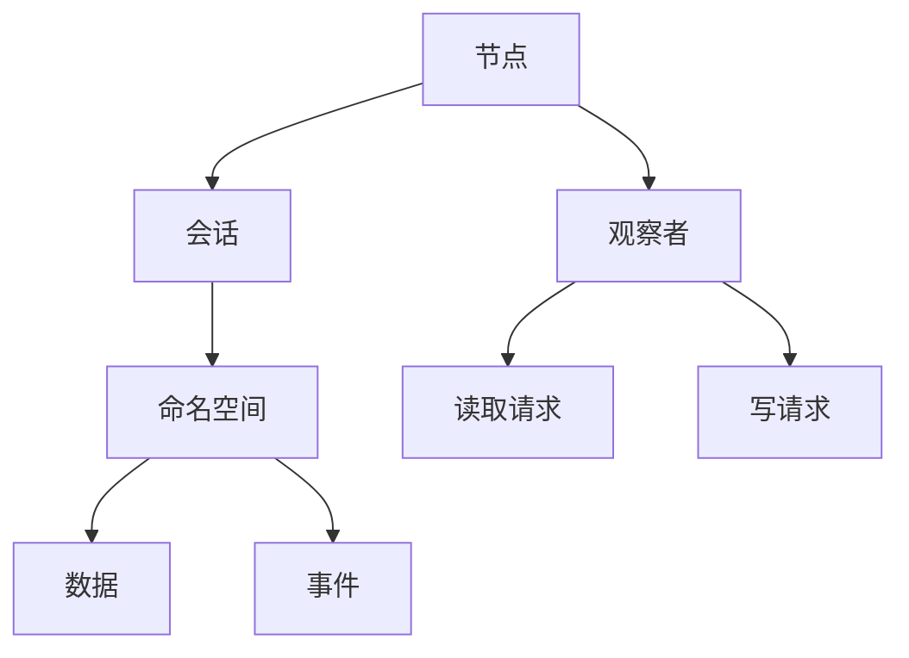

                 

# Zookeeper原理与代码实例讲解

## 1. 背景介绍

随着大数据、云计算等技术的迅猛发展，分布式系统的规模越来越大、复杂度越来越高。在分布式系统中，各个节点之间的协调与同步变得尤为重要。然而，在分布式环境中，由于网络通信的不稳定性、故障节点等问题，节点之间的协调变得困难重重。

Apache Zookeeper作为一款专门用于分布式协调服务(也称“配置服务”)的软件，能够提供一个稳定、高效、实时的协调环境，帮助分布式系统进行配置管理、服务发现、群集管理等操作。如今，Zookeeper已经被广泛应用于大数据、云计算、微服务、容器化等分布式系统中，是实现分布式系统协调的重要工具。

## 2. 核心概念与联系

### 2.1 核心概念概述

为了更好地理解Zookeeper的核心原理和架构，本节将介绍几个关键的概念：

- Zookeeper：Apache软件基金会开发的一款开源分布式协调服务软件，具有配置管理、服务发现、群集管理等功能。
- 节点(Node)：Zookeeper中的基本运行单元，可以是单独的服务器或者服务器的某个进程。
- 会话(Session)：客户端与服务端建立的一种连接关系，用于在Zookeeper中进行数据读写、操作节点等。
- 命名空间(ZNode)：Zookeeper中存放数据的容器，类似于文件系统的目录结构。
- 数据(Data)：存储在Zookeeper中的实际数据，可以是配置信息、监控数据等。
- 事件(Event)：Zookeeper中用于通知客户端节点状态变化等事件的数据结构。
- 观察者(Observer)：用于监听Zookeeper节点变化的工具，如Curator框架。

这些核心概念构成了Zookeeper的基本框架，使分布式系统中的各个节点能够高效、稳定地协作。

### 2.2 核心概念之间的关系

Zookeeper的设计理念是“主从架构”，即所有的会话都连接到一个Master节点上，而其他节点作为Follower节点。Master节点负责处理所有的写请求，并保证数据的一致性，而Follower节点负责处理所有的读请求，并实时同步Master节点的数据。这样的架构设计，保证了Zookeeper的性能和稳定性。

通过上述Mermaid流程图，可以更直观地理解这些核心概念之间的关系：



## 3. 核心算法原理 & 具体操作步骤

### 3.1 算法原理概述

Zookeeper的核心算法包括数据模型、一致性算法、会话管理等。其中，数据模型是基于树形结构的命名空间，一致性算法主要使用ZAB协议来保证数据的同步和一致性，会话管理则通过心跳机制、会话失效机制等来维护会话状态。

在Zookeeper中，所有的数据都被存储在一个命名空间中，类似于文件系统目录。每个节点都是一个数据节点，包含一个或多个子节点。节点之间通过ZNode进行关联，ZNode可以通过路径来访问，路径采用/号进行分隔，类似于文件系统的路径。

### 3.2 算法步骤详解

1. **数据模型**

    Zookeeper的数据模型是基于树形结构的命名空间，每个节点对应一个ZNode。ZNode包含三种类型：

    - 持久节点(Persistent Nodes)：即使客户端断开连接，数据仍然保存在Zookeeper中。
    - 临时节点(Ephemeral Nodes)：当客户端断开连接时，节点将被自动删除。
    - 顺序节点(Sequence Nodes)：自动生成节点名的数字编号。

    命名空间中的路径遵循文件系统路径的规则，每个路径都可以唯一地定位到节点。例如，/root/a/b/c的路径表示根节点下，依次包含a、b、c三个节点。

2. **一致性算法**

    Zookeeper的一致性算法主要使用ZAB协议(Zookeeper Atomic Broadcast)来保证数据的同步和一致性。ZAB协议是一种基于Raft协议的共识算法，分为两个阶段：

    - 选举阶段：当主节点宕机时，所有Follower节点开始选举新的主节点。通过心跳机制来检测主节点的状态，当主节点宕机时，所有Follower节点将发送投票消息，选择新的主节点。
    - 同步阶段：新的主节点接收客户端请求，并将数据广播给所有Follower节点，所有Follower节点更新本地数据，以保证数据的一致性。

    通过ZAB协议，Zookeeper保证了数据的一致性和分布式系统的稳定性。

3. **会话管理**

    会话管理主要通过心跳机制、会话失效机制等来维护会话状态。每个客户端都维护一个会话，并定期向Master节点发送心跳包，以保证会话的活跃性。当客户端没有收到心跳包时，会话将被认为失效，Zookeeper将释放会话占用的资源，并通知观察者进行相应的处理。

    会话管理保证了客户端与服务端的连接状态，使得客户端能够实时获取最新的数据变化。

### 3.3 算法优缺点

Zookeeper具有以下优点：

- 稳定可靠：通过ZAB协议，Zookeeper能够保证数据的一致性和系统的稳定性。
- 高效灵活：支持多种数据类型，能够灵活地处理各种分布式协调场景。
- 易于扩展：支持分布式架构，能够轻松地扩展节点，提高系统的可靠性。

同时，Zookeeper也存在一些缺点：

- 单节点故障会导致整个系统的瘫痪，因此需要备用节点来保证系统的稳定。
- 数据模型简单，不适合存储大量复杂的数据。
- 负载均衡和压力测试需要额外的配置和调试，增加了系统的复杂性。

### 3.4 算法应用领域

Zookeeper广泛应用于各种分布式系统中，包括但不限于以下领域：

- 分布式系统协调：用于分布式系统中的配置管理、服务发现、群集管理等。
- 数据库一致性：用于数据库中主从节点的同步，保证数据的一致性。
- 微服务架构：用于微服务架构中的服务发现和配置管理。
- 大数据集群：用于大数据集群中的节点管理、配置同步等。

## 4. 数学模型和公式 & 详细讲解

### 4.1 数学模型构建

Zookeeper的数学模型主要包括以下几个部分：

- 命名空间模型：使用树形结构表示节点，每个节点都有一个唯一的路径。
- 一致性算法模型：使用ZAB协议保证数据的一致性，使用心跳机制和会话失效机制来维护会话状态。

### 4.2 公式推导过程

假设Zookeeper有n个节点，每个节点有m个数据节点。每个数据节点都有一个唯一的路径，路径由节点的父节点和子节点组成。例如，/root/a/b/c的路径表示根节点下，依次包含a、b、c三个节点。

在一致性算法中，ZAB协议的选举阶段使用以下公式来计算节点A的投票数：

$$
\text{Votes}_A = \sum_{i=1}^{n} \text{Heartbeats}_i
$$

其中，$\text{Heartbeats}_i$表示节点A收到的节点i的心跳数。

在同步阶段，新的主节点将数据广播给所有Follower节点，每个节点将本地数据更新为最新的数据。因此，同步阶段的更新过程可以用以下公式表示：

$$
\text{NewData} = \text{OldData} + \text{BroadcastData}
$$

其中，$\text{NewData}$表示最新的数据，$\text{OldData}$表示旧的本地数据，$\text{BroadcastData}$表示新的数据。

### 4.3 案例分析与讲解

以创建持久节点为例，以下是Python代码实现：

```python
from kazoo.client import KazooClient

zookeeper = KazooClient(hosts='localhost:2181')

# 创建持久节点
zookeeper.create('/root/a/b/c', value='hello', ephemeral=False)
```

以上代码创建了一个持久节点/root/a/b/c，并将其值设置为'hello'。

## 5. 项目实践：代码实例和详细解释说明

### 5.1 开发环境搭建

Zookeeper的开发环境搭建相对简单，只需要安装Java和Zookeeper软件包即可。具体步骤如下：

1. 安装Java：从官网下载并安装Java JDK。
2. 下载Zookeeper软件包：从Apache官网下载最新版本的Zookeeper软件包。
3. 解压并启动Zookeeper：将软件包解压到指定目录，启动Zookeeper服务。

### 5.2 源代码详细实现

以下是使用Kazoo客户端库在Python中实现Zookeeper的示例代码：

```python
from kazoo.client import KazooClient

# 创建Kazoo客户端对象
zookeeper = KazooClient(hosts='localhost:2181')

# 创建持久节点
zookeeper.create('/root/a/b/c', value='hello', ephemeral=False)

# 读取节点数据
data, _ = zookeeper.get('/root/a/b/c')

# 删除节点
zookeeper.delete('/root/a/b/c')

# 监听节点变化
def watch(event):
    print(f'Node /{event.path} has changed!')

zookeeper.get('/root/a/b/c', watch)
```

以上代码实现了创建、读取、删除节点和监听节点变化的功能。

### 5.3 代码解读与分析

通过上述代码，可以看出Kazoo客户端库提供了丰富的API，可以轻松地实现Zookeeper的基本功能。其中，`create`方法用于创建节点，`get`方法用于读取节点数据，`delete`方法用于删除节点，`get`方法的第二个参数`watch`用于监听节点变化。

## 6. 实际应用场景

### 6.1 分布式系统协调

Zookeeper最常见的应用场景是在分布式系统中进行配置管理、服务发现和群集管理。例如，在Hadoop集群中，Zookeeper可以用于管理HDFS和MapReduce的配置信息，以及进行任务调度。

### 6.2 数据库一致性

Zookeeper还可以用于数据库中主从节点的同步，保证数据的一致性。例如，在MySQL数据库中，Zookeeper可以用于管理主从节点的同步，保证数据的一致性和可用性。

### 6.3 微服务架构

在微服务架构中，Zookeeper可以用于服务发现和配置管理。例如，在Spring Cloud中，Zookeeper可以用于注册和发现服务，保证服务的可靠性和可用性。

### 6.4 大数据集群

在大数据集群中，Zookeeper可以用于管理节点的配置信息和任务调度。例如，在Hadoop集群中，Zookeeper可以用于管理HDFS和YARN的配置信息，以及进行任务调度。

## 7. 工具和资源推荐

### 7.1 学习资源推荐

为了帮助开发者系统掌握Zookeeper的理论基础和实践技巧，这里推荐一些优质的学习资源：

1. Apache Zookeeper官方文档：详细介绍了Zookeeper的架构、功能和使用方法，是学习Zookeeper的必读资源。
2. Zookeeper实战：通过实际案例讲解Zookeeper的架构和应用，适合初学者快速上手。
3. 分布式系统协调：介绍了Zookeeper在分布式系统中的协调作用，适合深度学习Zookeeper的应用场景。
4. 大数据集群管理：介绍了Zookeeper在大数据集群中的作用，适合大数据开发人员学习。
5. Curator框架：Curator是一个开源的Zookeeper客户端工具，提供丰富的API和实用工具，适合开发者快速上手。

### 7.2 开发工具推荐

1. Python：Kazoo客户端库提供了Python接口，可以方便地进行Zookeeper的开发和测试。
2. Java：Zookeeper最初使用Java语言实现，因此Java开发者可以使用Java SDK进行Zookeeper的开发和测试。
3. REST客户端：Zookeeper提供了RESTful API，可以使用REST客户端工具进行Zookeeper的开发和测试。

### 7.3 相关论文推荐

Zookeeper的研究论文涉及广泛，以下是几篇经典论文：

1. Apache Zookeeper: A Fault Tolerant Distributed Service Framework: 介绍Zookeeper的设计理念和实现原理。
2. Zookeeper Consensus: The Design of a Log-based Snapshot-Based Synchronous Leader Election Algorithm: 介绍Zookeeper一致性算法的设计和实现。
3. Zookeeper: Efficient Distributed Coordination: 介绍Zookeeper在分布式系统中的应用和实现。

## 8. 总结：未来发展趋势与挑战

### 8.1 总结

本文对Zookeeper的核心原理和实践方法进行了全面系统的介绍。首先阐述了Zookeeper的应用背景和重要性，明确了其作为分布式协调服务的重要作用。其次，从原理到实践，详细讲解了Zookeeper的核心算法和具体操作步骤，提供了丰富的代码示例。同时，本文还探讨了Zookeeper在各种实际应用场景中的应用，展示了其广泛的应用价值。最后，本文精选了Zookeeper的学习资源和工具推荐，力求为读者提供全方位的技术指引。

通过本文的系统梳理，可以看到，Zookeeper作为一种高性能、高可靠性的分布式协调服务，已经成为分布式系统中的重要工具。其一致性算法和会话管理机制，使得Zookeeper在各种分布式场景下都能提供稳定、高效、实时的协调环境。

### 8.2 未来发展趋势

展望未来，Zookeeper的发展趋势将呈现以下几个方向：

1. 社区化和开源化：Zookeeper作为Apache基金会的产品，未来将继续推进社区化和开源化进程，吸引更多的开发者和用户参与。
2. 云化和服务化：随着云服务的普及，Zookeeper将进一步向云化和服务化方向发展，提供更灵活、高效的协调服务。
3. 生态系统建设：Zookeeper将继续扩展其生态系统，引入更多第三方工具和组件，提高系统的集成和互操作能力。
4. 跨平台支持：Zookeeper将进一步支持更多的平台和语言，使其更广泛地应用于各种分布式系统中。

### 8.3 面临的挑战

尽管Zookeeper在分布式系统中发挥着重要作用，但在其发展过程中仍面临诸多挑战：

1. 高可用性问题：Zookeeper的单节点故障会导致整个系统的瘫痪，因此需要备用节点来保证系统的稳定。
2. 性能瓶颈：Zookeeper在高负载情况下可能会遇到性能瓶颈，因此需要优化算法和架构，提高系统的并发能力和扩展性。
3. 安全性问题：Zookeeper需要保证系统的安全性，避免数据泄露和攻击等安全问题。
4. 兼容性问题：Zookeeper需要与多种分布式系统和工具兼容，确保系统的稳定性和可靠性。
5. 资源消耗：Zookeeper的资源消耗较大，需要在系统中进行合理的资源规划和配置。

### 8.4 研究展望

未来的研究需要在以下几个方面寻求新的突破：

1. 优化一致性算法：通过优化ZAB协议，提高数据的一致性和系统的稳定性。
2. 改进会话管理机制：通过改进会话失效和心跳机制，提高系统的可用性和可靠性。
3. 引入新特性：引入更多新特性，如分布式锁、事务管理等，提高系统的灵活性和可扩展性。
4. 加强安全防护：加强系统的安全防护，防止数据泄露和攻击等安全问题。
5. 扩展生态系统：扩展Zookeeper的生态系统，引入更多第三方工具和组件，提高系统的集成和互操作能力。

这些研究方向将进一步提升Zookeeper的性能和功能，使其更好地适应分布式系统的发展需求。

## 9. 附录：常见问题与解答

**Q1: Zookeeper为什么使用ZAB协议？**

A: ZAB协议是一种基于Raft协议的共识算法，能够保证数据的一致性和系统的稳定性。ZAB协议主要分为两个阶段：选举阶段和同步阶段。选举阶段通过心跳机制来检测主节点的状态，当主节点宕机时，所有Follower节点将发送投票消息，选择新的主节点。同步阶段，新的主节点接收客户端请求，并将数据广播给所有Follower节点，所有Follower节点更新本地数据，以保证数据的一致性。

**Q2: 如何保证Zookeeper的性能？**

A: 为了保证Zookeeper的性能，需要注意以下几点：
1. 合理配置节点：合理配置节点数量和负载均衡，避免节点过度集中。
2. 优化一致性算法：优化ZAB协议，提高数据的一致性和系统的稳定性。
3. 合理配置内存和磁盘：合理配置内存和磁盘，避免系统资源消耗过大。
4. 优化客户端连接：优化客户端连接，避免连接过多造成的系统压力。

**Q3: Zookeeper支持哪些数据类型？**

A: Zookeeper支持以下数据类型：
1. 持久节点：即使客户端断开连接，数据仍然保存在Zookeeper中。
2. 临时节点：当客户端断开连接时，节点将被自动删除。
3. 顺序节点：自动生成节点名的数字编号。

**Q4: 如何实现Zookeeper的高可用性？**

A: 实现Zookeeper的高可用性需要注意以下几点：
1. 配置备用节点：配置备用节点，确保系统的高可用性。
2. 优化一致性算法：优化ZAB协议，提高数据的一致性和系统的稳定性。
3. 实现分布式锁：实现分布式锁，保证系统的稳定性和一致性。
4. 合理配置节点：合理配置节点数量和负载均衡，避免节点过度集中。

**Q5: Zookeeper的性能瓶颈有哪些？**

A: Zookeeper的性能瓶颈主要有以下几点：
1. 数据模型简单：Zookeeper的数据模型简单，不适合存储大量复杂的数据。
2. 一致性算法复杂：ZAB协议实现复杂，容易出错。
3. 负载均衡和压力测试需要额外的配置和调试，增加了系统的复杂性。

通过以上问题的解答，可以看出Zookeeper在实际应用中需要注意的一些细节和优化点，确保系统的稳定性和性能。

---

作者：禅与计算机程序设计艺术 / Zen and the Art of Computer Programming

