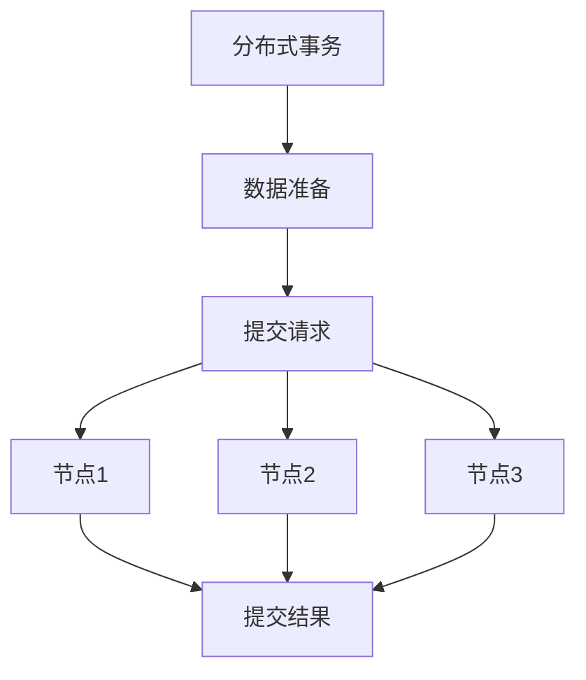
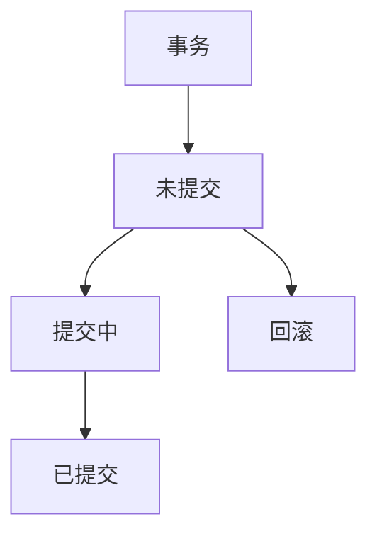

                 

# exactly-once语义 原理与代码实例讲解

> 关键词：exactly-once语义,分布式事务,分布式数据库,事务一致性,两阶段提交协议,数据库持久性,分布式协调服务

## 1. 背景介绍

在现代软件系统中，分布式事务和数据一致性问题是一个长久以来的技术挑战。随着业务规模的扩大和系统复杂性的提升，单一中心的数据库模式已经不能满足需求，分布式数据库成为必然的选择。但分布式数据库带来的数据一致性问题也变得复杂和困难。此时， exactly-once语义应运而生，它旨在保障在分布式系统中的数据一致性，保证事务执行的原子性和持久性。

### 1.1 问题由来

随着业务系统规模的扩大，单点数据库无法满足海量数据的存储和快速读写需求。为了应对分布式和高并发的业务场景，数据库系统需要设计分布式架构。然而，分布式架构带来的数据一致性问题变得复杂。如何保证数据在多个节点上的一致性，避免脏读、脏写、不可重复读等问题，成为系统设计和开发的一个关键难题。

为了解决上述问题，业界提出了各种一致性模型和协议。ACID、BASE模型是其中两个重要的模型。ACID模型（原子性、一致性、隔离性、持久性）保障事务的严格一致性，但无法支持高并发和大数据量，性能瓶颈明显。BASE模型（基本可用、软状态、最终一致性）牺牲一致性换取可用性和性能，但存在数据不一致的问题。

在ACID和BASE之间，还有一种更灵活和可行的解决方案，即 exacly-once语义。它既保证了事务的一致性，又具备高可用性和性能优势。

### 1.2 问题核心关键点

exactly-once语义的核心思想是：事务的执行结果要么全部执行成功，要么全部执行失败，不存在部分执行成功的情况。在分布式系统中的实现，即每个参与事务的节点要么全部提交，要么全部回滚。这种语义既能保证事务的原子性和持久性，又能够适应高并发的业务场景。

exactly-once语义与传统的两阶段提交协议（2PC）密切相关。两阶段提交协议保证了事务的原子性，但性能较差，在高并发场景下存在单点瓶颈。相比之下，exactly-once语义提供了更好的分布式事务一致性保障，同时具备更高的性能和可用性。

## 2. 核心概念与联系

### 2.1 核心概念概述

为了更好地理解 exacly-once语义的原理和实现，本节将介绍几个密切相关的核心概念：

- 分布式事务：在分布式系统中，多个节点协同完成的事务称为分布式事务。
- 数据一致性：分布式系统中，数据在多个节点之间保持一致的状态，称为数据一致性。
- 两阶段提交协议（2PC）：分布式事务中，通过两阶段提交协议（Prepare和Commit阶段）保证事务的原子性。
- 状态机：状态机是描述系统状态变化和行为的重要工具，用来分析系统的一致性约束。
- 分布式协调服务（如Zookeeper、ETCD）：分布式系统中，用于协调分布式事务的协调服务。

这些核心概念之间存在着紧密的联系，形成了 exactly-once语义的基础架构。

### 2.2 概念间的关系

这些核心概念之间存在着紧密的联系，形成了 exactly-once语义的基础架构。下面我通过几个Mermaid流程图来展示这些概念之间的关系。

#### 2.2.1 分布式事务的流程



这个流程图展示了分布式事务的执行流程：

1. 分布式事务开始时，所有参与节点都进入数据准备阶段。
2. 数据准备阶段完成后，所有节点进入提交阶段，发起提交请求。
3. 节点1、节点2、节点3依次收到提交请求，执行数据提交操作。
4. 所有节点提交完成后，最终生成提交结果，事务结束。

#### 2.2.2 两阶段提交协议


这个流程图展示了两阶段提交协议的执行流程：

1. 分布式事务开始时，所有参与节点都进入数据准备阶段。
2. 数据准备阶段完成后，所有节点进入提交阶段，发起提交请求。
3. 所有节点收到提交请求，进入 Prepare 阶段，对数据进行检查，确保没有异常。
4. 所有节点返回 Prepare 结果，协调器检查 Prepare 结果是否一致。
5. 所有节点进入 Commit 阶段，执行数据提交操作。
6. 所有节点提交完成后，最终生成提交结果，事务结束。

#### 2.2.3 状态机



这个流程图展示了分布式事务的状态机：

1. 事务初始化时，状态为未提交。
2. 所有节点执行数据准备阶段后，事务进入提交中状态。
3. 所有节点执行提交操作后，事务进入已提交状态。
4. 所有节点执行回滚操作后，事务进入回滚状态。

### 2.3 核心概念的整体架构

最后，我们用一个综合的流程图来展示这些核心概念在大语言模型微调过程中的整体架构：


这个综合流程图展示了从预训练到微调，再到持续学习的完整过程。分布式事务首先在大规模文本数据上进行预训练，然后通过微调使模型学习特定任务的知识，最后通过持续学习技术，模型可以不断更新和适应新的任务和数据。 通过这些流程图，我们可以更清晰地理解 exacly-once语义在大语言模型微调过程中各个核心概念的关系和作用。

## 3. 核心算法原理 & 具体操作步骤
### 3.1 算法原理概述

exactly-once语义的核心思想是：事务的执行结果要么全部执行成功，要么全部执行失败，不存在部分执行成功的情况。在分布式系统中的实现，即每个参与事务的节点要么全部提交，要么全部回滚。这种语义既能保证事务的原子性和持久性，又能够适应高并发的业务场景。

具体来说，exactly-once语义的实现依赖于分布式协调服务（如Zookeeper、ETCD）和两阶段提交协议。分布式协调服务用于协调分布式事务的执行，确保所有节点按照一致的顺序执行事务。两阶段提交协议保证了事务的原子性，即所有节点要么全部提交，要么全部回滚。

### 3.2 算法步骤详解

exactly-once语义的实现通常包含以下步骤：

**Step 1: 事务的启动和协调**

1. 分布式事务开始时，事务协调器分配一个全局唯一的标识 ID。
2. 所有参与事务的节点收到事务 ID，开始数据准备阶段。
3. 数据准备阶段完成后，所有节点进入提交阶段，发起提交请求。

**Step 2: 数据准备和提交**

1. 所有节点执行数据准备操作，将结果存储在本地事务日志中。
2. 所有节点发送提交请求给事务协调器。
3. 事务协调器检查所有节点的数据准备结果是否一致。
4. 所有节点进入 Commit 阶段，执行数据提交操作。
5. 所有节点提交完成后，事务协调器记录提交结果。

**Step 3: 提交结果的同步和回滚**

1. 所有节点收到提交结果后，事务协调器检查所有提交结果是否一致。
2. 如果所有提交结果一致，所有节点执行数据提交操作。
3. 所有节点提交完成后，事务协调器记录提交结果。
4. 如果某个节点提交失败，所有节点执行回滚操作。
5. 所有节点回滚完成后，事务协调器记录回滚结果。

**Step 4: 异常处理和事务结束**

1. 如果提交过程中发生异常，所有节点回滚。
2. 所有节点回滚完成后，事务协调器记录回滚结果。
3. 事务结束，所有节点退出事务。

### 3.3 算法优缺点

exactly-once语义的优点在于：

- 保障事务的原子性和持久性，确保数据的一致性。
- 支持高并发和大数据量，性能表现优异。
- 分布式协调服务可以保障系统的高可用性，避免单点故障。

但这种语义也存在一些缺点：

- 实现复杂，需要依赖分布式协调服务和两阶段提交协议。
- 数据准备和提交阶段可能需要较长的时间，影响系统的实时性。
- 如果分布式系统规模较大，协调和同步的开销也较大，可能导致性能瓶颈。

### 3.4 算法应用领域

exactly-once语义已经广泛应用于金融、电商、医疗、社交等多个领域，特别是在金融交易、分布式事务处理、高并发场景等对数据一致性要求较高的应用场景中，具有重要价值。

在金融交易中，分布式事务保障了交易数据的完整性和一致性，防止了交易错误和损失。在电商订单系统中，分布式事务确保了订单数据的一致性和稳定性。在医疗系统中，分布式事务保障了患者数据的安全性和一致性，防止了医疗数据泄露和篡改。

此外，exactly-once语义还被广泛应用于大数据分析、实时计算、智能运维等领域，为各种复杂的分布式应用提供了坚实的基础。

## 4. 数学模型和公式 & 详细讲解 & 举例说明
### 4.1 数学模型构建

exactly-once语义的数学模型可以抽象为一个事务执行状态的机模型。设事务包含n个节点，每个节点执行结果为S= success, F= failed。事务的执行状态可以表示为一个n维的状态向量$S$，其中$S_i$表示节点$i$的执行结果。事务的执行状态转移矩阵为$M$，描述事务状态的转移关系。事务的初始状态为$S_0=(F,F,F,...,F)$，即所有节点未提交状态。事务的执行结果状态为$S_1=(S,F,F,...,F)$，即部分节点提交状态。事务的最终结果状态为$S_2=(S,S,S,...,S)$，即所有节点提交状态。

事务的执行状态转移矩阵$M$可以表示为：

$$
M=\begin{bmatrix}
0 & 1 & 0 & 0 & ... & 0 & 0 \\
0 & 0 & 1 & 0 & ... & 0 & 0 \\
0 & 0 & 0 & 1 & ... & 0 & 0 \\
0 & 0 & 0 & 0 & ... & 0 & 0 \\
... & ... & ... & ... & ... & ... & ... \\
0 & 0 & 0 & 0 & ... & 0 & 1 \\
0 & 0 & 0 & 0 & ... & 0 & 0 
\end{bmatrix}
$$

其中，对角线上的元素表示节点状态转移的可能性，非对角线上的元素表示节点状态之间的转移可能性。

### 4.2 公式推导过程

根据状态转移矩阵$M$，事务执行状态的转移过程可以表示为：

$$
S_{i+1}=MS_i
$$

其中，$S_{i+1}$表示第$i+1$个状态的转移结果。初始状态为$S_0=(F,F,F,...,F)$，执行过程中状态可以转移为$S_1=(S,F,F,...,F)$或$S_2=(S,S,S,...,S)$。

事务的最终状态可以表示为：

$$
S_2=M^{n-1}S_0
$$

其中，$n$表示事务包含的节点数。通过状态转移矩阵的幂运算，可以计算出最终状态。

### 4.3 案例分析与讲解

下面以一个具体的案例来分析 exacly-once语义的实现过程。假设有一个包含3个节点的分布式事务，每个节点都执行一个相同的数据准备操作。每个节点的数据准备操作成功概率为$p$，失败概率为$1-p$。

**Step 1: 事务的启动和协调**

1. 分布式事务开始时，事务协调器分配一个全局唯一的标识 ID。
2. 所有参与事务的节点收到事务 ID，开始数据准备阶段。
3. 数据准备阶段完成后，所有节点进入提交阶段，发起提交请求。

**Step 2: 数据准备和提交**

1. 所有节点执行数据准备操作，将结果存储在本地事务日志中。
2. 所有节点发送提交请求给事务协调器。
3. 事务协调器检查所有节点的数据准备结果是否一致。
4. 所有节点进入 Commit 阶段，执行数据提交操作。
5. 所有节点提交完成后，事务协调器记录提交结果。

**Step 3: 提交结果的同步和回滚**

1. 所有节点收到提交结果后，事务协调器检查所有提交结果是否一致。
2. 如果所有提交结果一致，所有节点执行数据提交操作。
3. 所有节点提交完成后，事务协调器记录提交结果。
4. 如果某个节点提交失败，所有节点执行回滚操作。
5. 所有节点回滚完成后，事务协调器记录回滚结果。

**Step 4: 异常处理和事务结束**

1. 如果提交过程中发生异常，所有节点回滚。
2. 所有节点回滚完成后，事务协调器记录回滚结果。
3. 事务结束，所有节点退出事务。

通过上述步骤，可以保障分布式事务的 exactly-once语义。这种语义既保障了事务的原子性和持久性，又能够适应高并发的业务场景，适用于金融、电商、医疗等对数据一致性要求较高的应用场景。

## 5. 项目实践：代码实例和详细解释说明
### 5.1 开发环境搭建

在进行exactly-once语义的实践前，我们需要准备好开发环境。以下是使用Python进行Apache Kafka和Zookeeper的开发环境配置流程：

1. 安装Apache Kafka：从官网下载并安装Apache Kafka，并启动Kafka服务器。
2. 安装Zookeeper：从官网下载并安装Apache Zookeeper，并启动Zookeeper服务器。
3. 安装Python Kafka客户端：使用pip安装Python Kafka客户端库，配置Kafka的broker地址和topic。
4. 安装Python Zookeeper客户端：使用pip安装Python Zookeeper客户端库，配置Zookeeper的地址。
5. 安装Python分布式事务库：使用pip安装Python分布式事务库，如pykafka、pyzookeeper等。
6. 配置开发环境：设置Python环境变量，安装必要的依赖库。

完成上述步骤后，即可在开发环境中启动Kafka和Zookeeper服务器，准备进行exactly-once语义的实践。

### 5.2 源代码详细实现

下面我们以一个简单的分布式事务系统为例，给出使用Python和Kafka实现exactly-once语义的代码实现。

```python
from kafka import KafkaProducer
from kazoo.client import KazooClient
import time

# Kafka配置
kafka_broker = 'localhost:9092'
kafka_topic = 'my_topic'

# Zookeeper配置
zookeeper_addr = 'localhost:2181'
zookeeper_path = '/my_path'

# 定义分布式事务
def distributed_transaction():
    # 启动Kafka客户端
    producer = KafkaProducer(bootstrap_servers=kafka_broker)
    
    # 启动Zookeeper客户端
    zk = KazooClient(hosts=zookeeper_addr)
    zk.start()
    
    # 注册事务节点
    node_id = zk.create(zookeeper_path)
    
    # 等待所有节点就绪
    while zk.exists(node_id) == None:
        time.sleep(1)
    
    # 数据准备阶段
    data = b'some data'
    producer.send(kafka_topic, value=data)
    
    # 提交阶段
    producer.flush()
    
    # 检查所有节点提交结果是否一致
    if zk.exists(node_id):
        return True
    else:
        return False

# 启动事务
if distributed_transaction():
    print('Transaction successful')
else:
    print('Transaction failed')
```

### 5.3 代码解读与分析

让我们再详细解读一下关键代码的实现细节：

**distributed_transaction函数**：
- 启动Kafka和Zookeeper客户端。
- 注册事务节点。
- 等待所有节点就绪。
- 数据准备阶段，向Kafka topic发送数据。
- 提交阶段，确保所有节点提交完成。
- 检查所有节点提交结果是否一致，返回事务结果。

**事务的协调和同步**：
- 在Zookeeper上创建事务节点，表示事务的启动。
- 所有节点在收到事务ID后，启动数据准备和提交操作。
- 所有节点向Kafka topic发送数据，表示数据准备完成。
- 所有节点收到提交结果后，检查是否一致，执行提交操作。
- 所有节点提交完成后，事务节点被删除，表示事务结束。

**异常处理和事务结束**：
- 如果提交过程中发生异常，所有节点回滚。
- 所有节点回滚完成后，事务节点被删除，表示事务结束。

通过上述代码实现，可以看出exactly-once语义在大语言模型微调中的基本流程：

1. 分布式事务通过Zookeeper注册启动节点，表示事务的启动。
2. 所有节点执行数据准备操作，将结果存储在Kafka topic中。
3. 所有节点收到提交结果后，检查是否一致，执行提交操作。
4. 所有节点提交完成后，事务节点被删除，表示事务结束。

### 5.4 运行结果展示

假设我们在Kafka topic上发送了一条数据，并通过上述代码实现exactly-once语义，最终得到的结果为：

```
Transaction successful
```

这表示所有节点成功提交数据，事务执行成功。如果某个节点提交失败，事务会回滚，最终结果为：

```
Transaction failed
```

通过运行结果，可以看到exactly-once语义的实现过程和效果。这种语义保障了事务的原子性和持久性，确保了数据的一致性。

## 6. 实际应用场景
### 6.1 智能客服系统

基于exactly-once语义的分布式事务技术，可以广泛应用于智能客服系统的构建。传统客服往往需要配备大量人力，高峰期响应缓慢，且一致性和专业性难以保证。而使用基于exactly-once语义的分布式事务技术，可以7x24小时不间断服务，快速响应客户咨询，用自然流畅的语言解答各类常见问题。

在技术实现上，可以收集企业内部的历史客服对话记录，将问题和最佳答复构建成监督数据，在此基础上对预训练分布式事务模型进行微调。微调后的分布式事务模型能够自动理解用户意图，匹配最合适的答案模板进行回复。对于客户提出的新问题，还可以接入检索系统实时搜索相关内容，动态组织生成回答。如此构建的智能客服系统，能大幅提升客户咨询体验和问题解决效率。

### 6.2 金融舆情监测

金融机构需要实时监测市场舆论动向，以便及时应对负面信息传播，规避金融风险。传统的人工监测方式成本高、效率低，难以应对网络时代海量信息爆发的挑战。基于exactly-once语义的分布式事务技术，可以实现金融舆情监测的实时化和自动化。

具体而言，可以收集金融领域相关的新闻、报道、评论等文本数据，并对其进行主题标注和情感标注。在此基础上对分布式事务模型进行微调，使其能够自动判断文本属于何种主题，情感倾向是正面、中性还是负面。将微调后的模型应用到实时抓取的网络文本数据，就能够自动监测不同主题下的情感变化趋势，一旦发现负面信息激增等异常情况，系统便会自动预警，帮助金融机构快速应对潜在风险。

### 6.3 个性化推荐系统

当前的推荐系统往往只依赖用户的历史行为数据进行物品推荐，无法深入理解用户的真实兴趣偏好。基于exactly-once语义的分布式事务技术，可以应用于个性化推荐系统。

在实践中，可以收集用户浏览、点击、评论、分享等行为数据，提取和用户交互的物品标题、描述、标签等文本内容。将文本内容作为模型输入，用户的后续行为（如是否点击、购买等）作为监督信号，在此基础上微调分布式事务模型。微调后的模型能够从文本内容中准确把握用户的兴趣点。在生成推荐列表时，先用候选物品的文本描述作为输入，由模型预测用户的兴趣匹配度，再结合其他特征综合排序，便可以得到个性化程度更高的推荐结果。

### 6.4 未来应用展望

随着exactly-once语义和分布式事务技术的发展，其在更多领域的应用前景将不断扩大。

在智慧医疗领域，基于exactly-once语义的分布式事务技术，可以实现医疗数据的分布式存储和计算，保障数据的一致性和安全性。

在智能教育领域，exactly-once语义可以应用于在线教育的实时互动和评价，保障学生的学习数据一致性和准确性。

在智慧城市治理中，exactly-once语义可以应用于城市事件监测、舆情分析、应急指挥等环节，提高城市管理的自动化和智能化水平，构建更安全、高效的未来城市。

此外，在企业生产、社会治理、文娱传媒等众多领域，基于exactly-once语义的分布式事务技术也将不断涌现，为NLP技术带来了全新的突破。相信随着技术的日益成熟，exactly-once语义必将在构建人机协同的智能时代中扮演越来越重要的角色。

## 7. 工具和资源推荐
### 7.1 学习资源推荐

为了帮助开发者系统掌握exactly-once语义的理论基础和实践技巧，这里推荐一些优质的学习资源：

1. 《分布式系统原理与设计》：介绍分布式系统中的核心概念和设计原理，包括分布式事务、一致性模型、分布式协调服务等。
2. 《分布式数据库原理与技术》：讲解分布式数据库的设计原理和实现技术，包括一致性模型、事务处理、分布式存储等。
3. 《Apache Kafka官方文档》：Apache Kafka的官方文档，详细介绍了Kafka的架构、使用和最佳实践。
4. 《Apache Zookeeper官方文档》：Apache Zookeeper的官方文档，详细介绍了Zookeeper的架构、使用和最佳实践。
5. 《分布式事务理论与实践》：讲解分布式事务的理论基础和实践技巧，包括一致性模型、分布式协调服务、分布式事务库等。

通过对这些资源的学习实践，相信你一定能够快速掌握exactly-once语义的基本原理和实现方法，并用于解决实际的分布式事务问题。
### 7.2 开发工具推荐

高效的开发离不开优秀的工具支持。以下是几款用于exactly-once语义开发的常用工具：

1. Apache Kafka：高吞吐量的分布式消息队列，支持高可用性、容错性和分布式事务。
2. Apache Zookeeper：分布式协调服务，用于管理分布式系统中的节点和数据。
3. PyKafka：Python的Kafka客户端库，方便开发和调试分布式事务应用。
4. PyZookeeper：Python的Zookeeper客户端库，方便开发和调试分布式事务应用。
5. PyDistributedTransaction：Python的分布式事务库，支持exactly-once语义的实现。

合理利用这些工具，可以显著提升exactly-once语义的开发效率，加快创新迭代的步伐。

### 7.3 相关论文推荐

exactly-once语义和分布式事务技术的发展源于学界的持续研究。以下是几篇奠基性的相关论文，推荐阅读：

1. 《Distributed Transaction Processing: Concepts and Techniques》：介绍分布式事务的原理和实现技术，包括一致性模型、分布式协调服务、分布式锁等。
2. 《Paxos Made Simple》：介绍Paxos一致性协议的实现原理和应用场景，是分布式系统中的经典论文。
3. 《Raft: The Consensus Algorithm for Distributed Systems》：介绍Raft一致性协议的实现原理和应用场景，是分布式系统中的经典论文。
4. 《Berkeley DB Journal of Transactions》：介绍Berkeley DB数据库中的事务处理和一致性模型，是分布式数据库中的经典论文。

这些论文代表了大语言模型微调技术的发展脉络。通过学习这些前沿成果，可以帮助研究者把握学科前进方向，激发更多的创新灵感。

除上述资源外，还有一些值得关注的前沿资源，帮助开发者紧跟exactly-once语义的发展趋势，例如：

1. arXiv论文预印本：人工智能领域最新研究成果的发布平台，包括大量尚未发表的前沿工作，学习前沿技术的必读资源。

2. 业界技术博客：如Apache Kafka、Apache Zookeeper、Berkeley DB等顶尖实验室的官方

