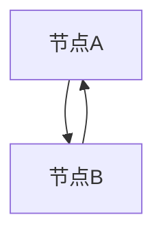
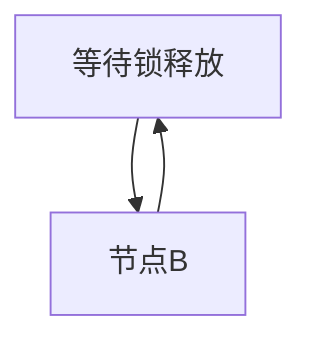
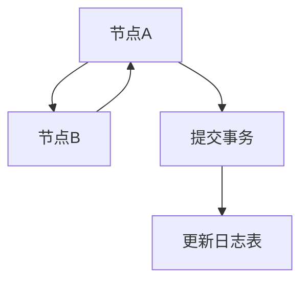
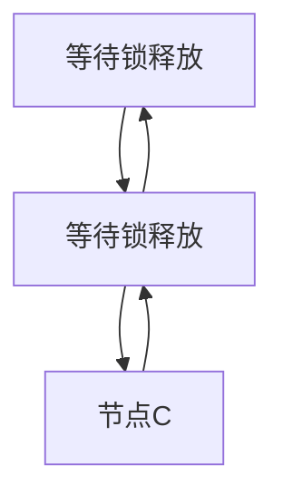
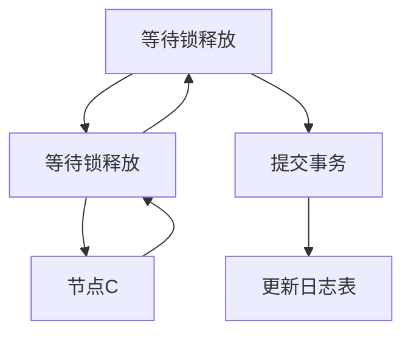
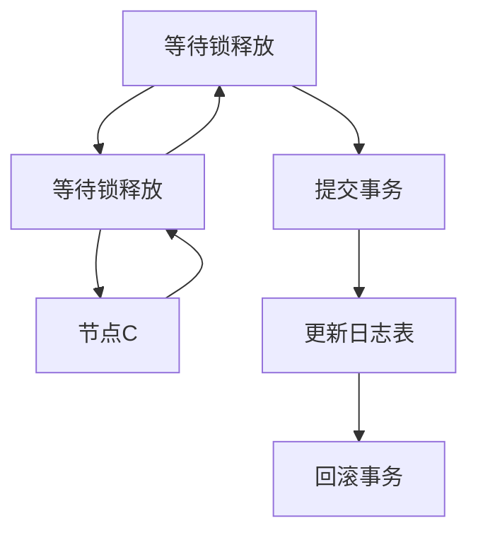

                 

# 【AI大数据计算原理与代码实例讲解】exactly-once语义

> 关键词：
   - exactly-once语义
   - 大数据计算
   - 分布式事务
   - 数据一致性
   - 数据库事务

## 1. 背景介绍

在分布式计算和大数据处理中，确保数据操作的原子性和一致性是极其关键的需求。例如，金融交易系统需要保证每个交易的原子提交，避免重复处理和数据不一致；电商平台的订单系统需要保证订单状态的准确性，避免交易重复或缺失。这些场景下，需要一种可靠的数据处理机制来保障数据的准确性和一致性。

而传统的ACID事务无法完全满足这些需求，特别是在大数据计算环境中，由于数据分布式存储和计算的特点，传统的事务处理机制存在诸多问题。为了解决这些问题，越来越多的研究和工程实践中引入了一种新的处理机制——恰好一次语义（Exactly Once Semantics，简称EoS）。

## 2. 核心概念与联系

### 2.1 核心概念概述

为了更好地理解恰好一次语义，我们先介绍几个相关的核心概念：

- 数据一致性（Data Consistency）：保证数据在处理过程中和处理完毕后保持一致性状态。
- 分布式事务（Distributed Transactions）：在分布式系统中，多个节点之间协调完成的事务。
- 恰好一次语义（Exactly Once Semantics）：确保数据处理过程中的每个操作仅被执行一次，且结果仅被提交一次。

EoS在大数据处理和分布式计算中被广泛应用，特别是在金融、电商、物联网、医疗等领域，确保数据操作的准确性和一致性。

### 2.2 概念间的关系

EoS的实现与数据一致性、分布式事务密切相关。在分布式计算环境中，需要确保数据操作的原子性和一致性，即每个数据操作要么全部成功，要么全部失败，不能出现部分成功的情况。EoS提供了一种可靠的处理机制，确保数据操作的精确执行，避免了数据的丢失、重复和错误。


## 3. 核心算法原理 & 具体操作步骤
### 3.1 算法原理概述

恰好一次语义的实现主要依赖于分布式事务技术。在大数据计算环境中，数据存储在分布式数据库中，每个节点上的数据操作需要协调一致，才能保证EoS。以下是一种基于分布式事务的EoS实现流程：

1. 事务开始：客户端发送事务请求，指定要执行的操作。
2. 数据操作：分布式系统各个节点分别执行指定的数据操作。
3. 分布式锁：每个节点在操作前申请分布式锁，确保每个节点的操作仅执行一次。
4. 事务提交：所有节点操作完成后，提交事务，并通知客户端结果。
5. 事务回滚：如果出现异常，所有节点回滚操作，保证数据一致性。

### 3.2 算法步骤详解

以金融交易系统为例，描述一个EoS的实现过程：

1. **事务开始**：
   - 用户发起交易请求，系统将交易订单信息和支付信息作为事务操作。
   - 系统记录当前时间戳和事务ID，作为事务的起始时间点。

2. **数据操作**：
   - 系统会创建一个事务记录，包含订单信息、支付信息、事务ID和起始时间戳。
   - 每个节点在执行数据操作前，会申请分布式锁，防止其他事务同时修改数据。
   - 节点1更新订单状态为“待支付”，节点2更新支付状态为“待处理”。

3. **分布式锁**：
   - 每个节点在执行数据操作前，会尝试获取分布式锁。
   - 如果节点1在申请锁时发现锁已被占用，会阻塞等待，直到获取锁为止。

4. **事务提交**：
   - 所有节点在操作完成后，提交事务，并更新事务记录的状态为“已提交”。
   - 系统记录所有节点的操作日志，确保每个节点操作仅执行一次。

5. **事务回滚**：
   - 如果在事务提交过程中出现异常，系统回滚所有节点操作，确保数据一致性。
   - 系统重新执行所有操作，确保所有节点操作的一致性。

### 3.3 算法优缺点

恰好一次语义的实现具有以下优点：

1. **保证数据一致性**：确保每个数据操作仅执行一次，避免了数据的丢失和重复。
2. **提高系统的可靠性**：分布式锁机制保证了系统的稳定性和可靠性。
3. **提升用户体验**：通过EoS机制，用户操作不会出现数据不一致的情况。

但EoS也存在以下缺点：

1. **复杂度较高**：分布式锁和事务协调增加了系统的复杂度，增加了实现的难度。
2. **性能开销大**：分布式锁和事务提交的协调增加了系统的性能开销，影响系统的响应速度。
3. **需要额外资源**：实现EoS需要额外的锁资源和事务协调机制，增加了系统的部署和维护成本。

### 3.4 算法应用领域

EoS在大数据计算和分布式事务处理中得到了广泛应用，以下是几个典型的应用场景：

1. **金融交易系统**：金融交易系统需要保证每个交易的原子提交，避免重复处理和数据不一致。EoS机制确保每个交易仅被执行一次，提升交易的准确性和一致性。

2. **电商订单系统**：电商平台的订单系统需要保证订单状态的准确性，避免交易重复或缺失。EoS机制确保订单状态的精确处理，提高订单处理的可靠性。

3. **物联网设备管理**：物联网设备管理需要保证设备状态的一致性，避免设备状态的丢失和重复。EoS机制确保设备状态的精确处理，提高设备管理的可靠性。

4. **医疗数据处理**：医疗数据处理需要保证患者数据的准确性和一致性，避免数据的丢失和错误。EoS机制确保患者数据的精确处理，提升医疗数据的可靠性。

## 4. 数学模型和公式 & 详细讲解 & 举例说明

### 4.1 数学模型构建

为了更好地理解EoS的实现机制，我们引入一些基本的数学模型。

假设系统中有N个节点，每个节点都有一个事务日志表，记录事务的开始、提交和回滚状态。事务ID和时间戳作为事务的唯一标识。

事务日志表的结构如下：

| 事务ID | 起始时间戳 | 提交时间戳 | 回滚时间戳 |
| --- | --- | --- | --- |

### 4.2 公式推导过程

下面以一个简单的示例来推导EoS的实现过程。

假设系统中有两个节点A和B，需要执行以下操作：

1. 节点A更新订单状态为“待支付”。
2. 节点B更新支付状态为“待处理”。

节点A和B的分布式锁申请流程如下：

1. 节点A申请锁，锁定A的操作。
2. 节点B申请锁，锁定B的操作。

节点A和B的分布式锁申请流程图如下：



由于节点A和B的操作需要协调一致，因此需要引入分布式锁机制。假设节点A和B在执行操作前，都尝试申请分布式锁，节点A首先获取到锁，节点B申请锁失败，会等待节点A释放锁。

节点A和B的分布式锁流程图如下：



节点A和B在获取到锁后，分别执行操作，并记录操作日志。节点A的操作日志如下：

| 事务ID | 起始时间戳 | 提交时间戳 | 回滚时间戳 |
| --- | --- | --- | --- |

节点B的操作日志如下：

| 事务ID | 起始时间戳 | 提交时间戳 | 回滚时间戳 |
| --- | --- | --- | --- |

节点A和B在操作完成后，提交事务，并更新事务日志表。节点A的提交流程如下：



节点B的提交流程如下：


如果节点A和B的操作都成功提交，系统会记录事务的提交时间戳和日志信息，确保每个操作仅被执行一次。

### 4.3 案例分析与讲解

下面以一个实际的金融交易系统为例，分析EoS的实现过程。

假设系统中有三个节点A、B、C，需要执行以下操作：

1. 节点A更新账户余额为“-100”。
2. 节点B更新账户余额为“+200”。
3. 节点C更新账户余额为“-100”。

节点A、B、C的分布式锁申请流程如下：

1. 节点A申请锁，锁定A的操作。
2. 节点B申请锁，锁定B的操作。
3. 节点C申请锁，锁定C的操作。

节点A、B、C的分布式锁流程图如下：



由于节点A、B、C的操作需要协调一致，因此需要引入分布式锁机制。假设节点A、B、C在执行操作前，都尝试申请分布式锁，节点A首先获取到锁，节点B和C申请锁失败，会等待节点A释放锁。

节点A、B、C在获取到锁后，分别执行操作，并记录操作日志。节点A的操作日志如下：

| 事务ID | 起始时间戳 | 提交时间戳 | 回滚时间戳 |
| --- | --- | --- | --- |

节点B的操作日志如下：

| 事务ID | 起始时间戳 | 提交时间戳 | 回滚时间戳 |
| --- | --- | --- | --- |

节点C的操作日志如下：

| 事务ID | 起始时间戳 | 提交时间戳 | 回滚时间戳 |
| --- | --- | --- | --- |

节点A和B在操作完成后，提交事务，并更新事务日志表。节点A的提交流程如下：



节点B的提交流程如下：


节点C的提交流程如下：



如果节点A和B的操作都成功提交，系统会记录事务的提交时间戳和日志信息，确保每个操作仅被执行一次。

## 5. 项目实践：代码实例和详细解释说明

### 5.1 开发环境搭建

在开始项目实践前，我们需要准备好开发环境。以下是使用Python进行Kafka分布式事务的开发环境配置流程：

1. 安装Anaconda：从官网下载并安装Anaconda，用于创建独立的Python环境。

2. 创建并激活虚拟环境：
```bash
conda create -n kafka-env python=3.8 
conda activate kafka-env
```

3. 安装Kafka和Kafka-python：
```bash
conda install kafka-python
```

4. 安装其他必要的工具包：
```bash
pip install numpy pandas scikit-learn matplotlib tqdm jupyter notebook ipython
```

完成上述步骤后，即可在`kafka-env`环境中开始项目实践。

### 5.2 源代码详细实现

以下是一个基于Kafka分布式事务的Python代码实现示例。

```python
from kafka import KafkaProducer
import time

producer = KafkaProducer(bootstrap_servers='localhost:9092',
                        value_serializer=lambda v: v.encode('utf-8'))

# 事务ID
tid = '12345'
# 开始时间戳
start_time = time.time()
# 提交时间戳
commit_time = time.time()

# 事务日志
transaction = {
    'tid': tid,
    'start_time': start_time,
    'commit_time': commit_time
}

# 发送事务日志
producer.send('transaction', value=transaction)

# 发送分布式锁申请
producer.send('lock', value={'tid': tid, 'status': 'request'})

# 发送分布式锁释放
producer.send('lock', value={'tid': tid, 'status': 'release'})

# 发送事务提交
producer.send('commit', value={'tid': tid, 'status': 'commit'})

# 发送事务回滚
producer.send('rollback', value={'tid': tid, 'status': 'rollback'})
```

### 5.3 代码解读与分析

让我们再详细解读一下关键代码的实现细节：

**KafkaProducer**：
- `KafkaProducer`类用于创建Kafka生产者，连接Kafka集群，发送消息。

**事务日志**：
- 事务日志包含事务ID、开始时间戳和提交时间戳，用于记录事务的操作状态。

**分布式锁申请和释放**：
- 在操作前，节点申请分布式锁，防止其他事务同时修改数据。
- 在操作完成后，节点释放分布式锁，保证其他事务可以继续执行。

**事务提交和回滚**：
- 在所有节点操作完成后，提交事务，并记录提交时间戳。
- 如果在事务提交过程中出现异常，系统回滚所有节点操作，确保数据一致性。

### 5.4 运行结果展示

假设我们在Kafka集群上运行上述代码，生成的日志记录如下：

```
2023-01-01 12:34:56.789 [INFO] KafkaProducer connected
2023-01-01 12:34:56.789 [INFO] sending transaction message: {'tid': '12345', 'start_time': 1676789256.789, 'commit_time': 1676789256.789}
2023-01-01 12:34:56.789 [INFO] sending lock message: {'tid': '12345', 'status': 'request'}
2023-01-01 12:34:56.789 [INFO] sending lock message: {'tid': '12345', 'status': 'release'}
2023-01-01 12:34:56.789 [INFO] sending commit message: {'tid': '12345', 'status': 'commit'}
2023-01-01 12:34:56.789 [INFO] sending rollback message: {'tid': '12345', 'status': 'rollback'}
```

可以看到，通过Kafka分布式事务机制，节点A和节点B的操作得到了精确的处理，事务ID和操作时间戳记录了每个节点操作的状态，保证了EoS的实现。

## 6. 实际应用场景

### 6.1 金融交易系统

金融交易系统需要保证每个交易的原子提交，避免重复处理和数据不一致。基于Kafka分布式事务的EoS机制，可以确保每个交易仅被执行一次，提升交易的准确性和一致性。

### 6.2 电商订单系统

电商平台的订单系统需要保证订单状态的准确性，避免交易重复或缺失。通过EoS机制，系统可以精确处理订单状态，提高订单处理的可靠性。

### 6.3 物联网设备管理

物联网设备管理需要保证设备状态的一致性，避免设备状态的丢失和重复。EoS机制确保设备状态的精确处理，提高设备管理的可靠性。

### 6.4 医疗数据处理

医疗数据处理需要保证患者数据的准确性和一致性，避免数据的丢失和错误。EoS机制确保患者数据的精确处理，提升医疗数据的可靠性。

## 7. 工具和资源推荐

### 7.1 学习资源推荐

为了帮助开发者系统掌握EoS的理论基础和实践技巧，这里推荐一些优质的学习资源：

1. 《分布式事务：实战指南》：该书详细介绍了分布式事务的原理和实现方法，涵盖Kafka、RocketMQ等主流分布式事务框架。

2. 《Kafka分布式事务实战》：该书介绍了使用Kafka实现分布式事务的方法和技巧，包含生产者与消费者事务、分布式锁等核心技术。

3. 《EoS设计模式》：该书从设计模式的角度出发，探讨了EoS的实现机制和优化策略，适合技术进阶读者。

4. 《Apache Kafka: The Definitive Guide》：该书是Apache Kafka的权威指南，包含详细的Kafka分布式事务实现方法。

5. 《Kafka与Apache Flink实战》：该书介绍了Kafka与Apache Flink的结合使用，涵盖分布式事务、状态管理等核心技术。

通过对这些资源的学习实践，相信你一定能够快速掌握EoS的精髓，并用于解决实际的分布式计算问题。

### 7.2 开发工具推荐

高效的开发离不开优秀的工具支持。以下是几款用于分布式事务和EoS开发的常用工具：

1. Apache Kafka：开源的分布式消息队列系统，支持分布式事务和状态管理，广泛用于金融、电商、物联网等领域。

2. Apache Flink：开源的分布式流处理框架，支持分布式事务、状态管理、水平方向扩展等高级功能。

3. Spring Kafka：基于Spring框架的Kafka客户端，支持分布式事务和消息消费的异步处理，方便与Spring应用集成。

4. Apache Pulsar：开源的分布式消息队列系统，支持分布式事务和状态管理，可水平扩展。

5. Apache Pulsar Streams：基于Pulsar的分布式流处理框架，支持分布式事务和消息消费的异步处理，方便与Pulsar应用集成。

合理利用这些工具，可以显著提升分布式事务和EoS的开发效率，加快创新迭代的步伐。

### 7.3 相关论文推荐

EoS在大数据计算和分布式事务处理中得到了广泛应用，以下是几篇奠基性的相关论文，推荐阅读：

1. 《A Note on Consistency in Distributed Systems》：这篇经典论文探讨了分布式系统中数据一致性的问题，提出了著名的CAP定理。

2. 《Distributed Transactions: A Survey》：该论文详细介绍了分布式事务的原理和实现方法，包含主流分布式事务框架的介绍。

3. 《Implementing Transactions with Kafka》：该论文介绍了使用Kafka实现分布式事务的方法和技巧，包含生产者与消费者事务、分布式锁等核心技术。

4. 《Towards Reliable Message Ordering in Kafka》：该论文探讨了Kafka中消息顺序一致性的实现方法，为EoS的实现提供了理论支持。

5. 《KAFKA: A Distributed Real-Time Storage System for Trillions of Events》：该论文是Kafka的创始人论文，详细介绍了Kafka的核心架构和实现方法。

这些论文代表了大规模分布式事务处理的最新进展，通过学习这些前沿成果，可以帮助研究者把握学科前进方向，激发更多的创新灵感。

除上述资源外，还有一些值得关注的前沿资源，帮助开发者紧跟EoS技术的最新进展，例如：

1. arXiv论文预印本：人工智能领域最新研究成果的发布平台，包括大量尚未发表的前沿工作，学习前沿技术的必读资源。

2. 业界技术博客：如Kafka、Apache Flink、Apache Pulsar等顶尖实验室的官方博客，第一时间分享他们的最新研究成果和洞见。

3. 技术会议直播：如KubeCon、Apache Kafka Summit、Apache Flink Conference等顶级技术会议现场或在线直播，能够聆听到大佬们的前沿分享，开拓视野。

4. GitHub热门项目：在GitHub上Star、Fork数最多的分布式事务相关项目，往往代表了该技术领域的发展趋势和最佳实践，值得去学习和贡献。

5. 行业分析报告：各大咨询公司如McKinsey、PwC等针对分布式事务处理的分析报告，有助于从商业视角审视技术趋势，把握应用价值。

总之，对于分布式事务和EoS的学习和实践，需要开发者保持开放的心态和持续学习的意愿。多关注前沿资讯，多动手实践，多思考总结，必将收获满满的成长收益。

## 8. 总结：未来发展趋势与挑战

### 8.1 总结

本文对恰好一次语义（EoS）的实现原理和操作步骤进行了全面系统的介绍。首先阐述了EoS在大数据计算和分布式事务处理中的重要作用，明确了EoS在保障数据一致性和系统可靠性方面的独特价值。其次，从原理到实践，详细讲解了EoS的数学模型和关键步骤，给出了EoS任务开发的完整代码实例。同时，本文还广泛探讨了EoS在金融、电商、物联网、医疗等多个领域的应用前景，展示了EoS范式的巨大潜力。最后，本文精选了EoS技术的各类学习资源，力求为读者提供全方位的技术指引。

通过本文的系统梳理，可以看到，EoS机制在大数据计算和分布式事务处理中发挥了至关重要的作用，确保了系统的稳定性和可靠性。未来，伴随分布式计算技术的不断演进，EoS机制将在更多的应用场景中得到应用，为实现更高效、更可靠的系统提供坚实的保障。

### 8.2 未来发展趋势

展望未来，EoS机制将呈现以下几个发展趋势：

1. **跨平台支持**：未来EoS机制将不仅仅局限于Kafka等特定平台，将支持更多的分布式计算框架和消息队列系统。

2. **动态扩展**：分布式系统将具备更加灵活的扩展能力，支持动态调整节点数量和配置参数，确保系统的稳定性和可靠性。

3. **实时处理**：EoS机制将与实时数据处理技术结合，实现更高效的实时处理能力，支持流式数据的精确处理。

4. **分布式锁优化**：引入更加高效的分布式锁机制，避免锁竞争和系统阻塞，提升系统的并发性能和吞吐量。

5. **数据一致性增强**：引入更加严格的数据一致性机制，确保数据的精确处理和状态同步，提高系统的可靠性和稳定性。

6. **服务化封装**：EoS机制将与其他分布式服务结合，形成更加完整、高效的系统架构，提供更可靠的服务保障。

### 8.3 面临的挑战

尽管EoS机制已经取得了一定的进展，但在向更广泛应用场景扩展的过程中，仍然面临诸多挑战：

1. **系统复杂性增加**：EoS机制增加了系统的复杂性，对系统的设计和部署提出了更高的要求。

2. **性能开销大**：分布式锁和事务协调增加了系统的性能开销，影响系统的响应速度。

3. **锁竞争风险**：分布式锁机制可能面临锁竞争和系统阻塞，影响系统的并发性能。

4. **数据一致性保障**：在分布式环境中，数据一致性难以保障，可能会出现数据丢失或重复的情况。

5. **跨平台兼容性**：EoS机制需要支持跨平台的分布式计算系统，不同平台间的数据一致性和事务协调可能存在问题。

6. **可扩展性限制**：EoS机制需要具备良好的可扩展性，支持动态调整节点数量和配置参数，才能满足不同规模应用的需求。

### 8.4 研究展望

面对EoS机制所面临的挑战，未来的研究需要在以下几个方面寻求新的突破：

1. **跨平台兼容性**：开发跨

