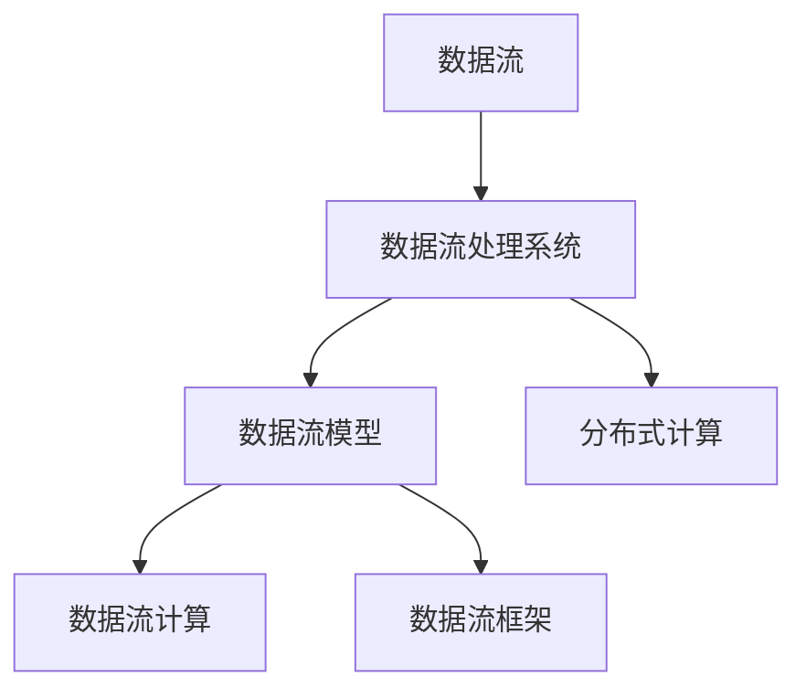
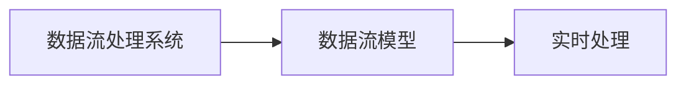
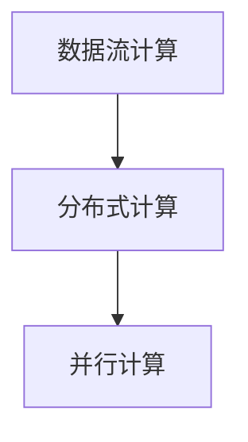
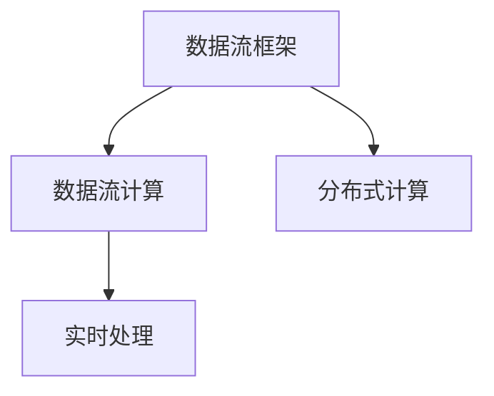
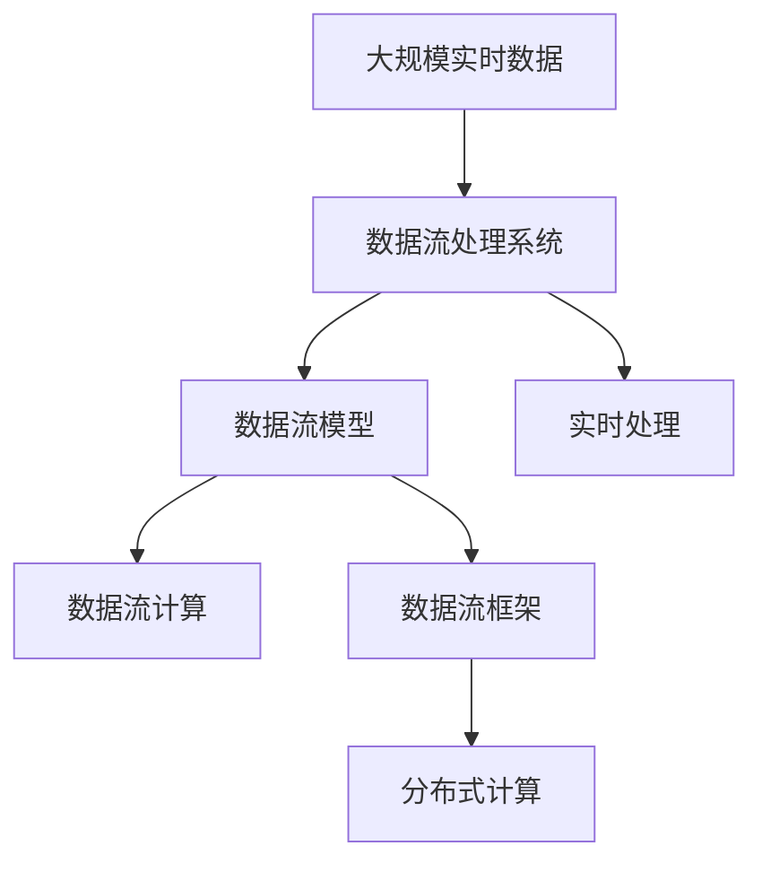

                 

# 【AI大数据计算原理与代码实例讲解】流处理

> 关键词：大数据,流处理,Apache Spark,数据流计算,Flink,Apache Storm,Scala

## 1. 背景介绍

### 1.1 问题由来
在当今数据驱动的时代，海量数据的实时处理和分析成为了企业和科研机构的关键需求。随着互联网和物联网的迅速发展，数据量呈指数级增长，且数据产生速度也越来越快。如何高效、实时地处理和分析这些数据，成为了众多领域研究的热点问题。传统的批量处理方式已经无法满足实时性要求，而流处理（Stream Processing）技术则成为了解决这一问题的关键。

流处理技术可以实时地对数据进行分析和处理，快速响应数据变化，支持复杂的分析任务，并能够提供低延迟、高吞吐量的数据处理能力。因此，流处理技术在实时监控、实时推荐、实时定价、实时风险控制、实时欺诈检测等众多领域中得到了广泛应用。

### 1.2 问题核心关键点
流处理技术的核心关键点在于：

1. **数据流模型**：流处理系统采用数据流模型，将数据流看作是连续不断的数据序列，通过实时处理每个数据元素，得出实时的分析结果。

2. **低延迟、高吞吐量**：流处理系统能够提供低延迟、高吞吐量的数据处理能力，能够实时响应用户需求，满足实时性要求。

3. **实时分析**：流处理系统能够实时地对数据进行分析，能够及时响应数据变化，支持复杂的分析任务。

4. **高可用性**：流处理系统需要具备高可用性，能够保证系统的高可用和高可扩展性。

5. **高容错性**：流处理系统需要具备高容错性，能够自动恢复和容错处理系统中的故障节点。

### 1.3 问题研究意义
流处理技术的研究和应用，对于拓展数据处理方式、提升数据实时处理能力、加速数据科学领域的技术落地，具有重要意义：

1. **降低数据处理成本**：流处理技术能够在实时处理数据的同时，降低数据存储和处理的成本，减少延迟。

2. **提升数据实时性**：流处理技术能够实时地处理数据，快速响应数据变化，提升数据的实时性。

3. **支持复杂分析**：流处理技术能够支持复杂的分析任务，包括实时监控、实时推荐、实时定价、实时风险控制、实时欺诈检测等。

4. **促进技术落地**：流处理技术能够提升数据处理能力，促进数据科学领域的技术落地应用。

5. **推动产业发展**：流处理技术能够提升数据处理能力，推动产业发展，特别是在金融、零售、医疗、智能交通等领域。

## 2. 核心概念与联系

### 2.1 核心概念概述

为更好地理解流处理技术，本节将介绍几个密切相关的核心概念：

- **数据流**：数据流（Data Stream）是指实时、连续、有序的数据集合。流处理系统接收数据流，并对其进行实时处理。

- **数据流处理系统**：数据流处理系统（Data Stream Processing System）是指能够处理实时数据流的软件系统。常见的流处理系统包括Apache Kafka、Apache Flink、Apache Storm等。

- **数据流模型**：数据流模型（Data Stream Model）是指对数据流的抽象表示，包括数据的来源、数据流的特征、数据流的变化规律等。

- **数据流计算**：数据流计算（Data Stream Computation）是指对数据流进行实时分析和计算的过程。常见的数据流计算模型包括批处理、滑动窗口、滚动窗口等。

- **流处理框架**：流处理框架（Stream Processing Framework）是指能够支持数据流计算的软件框架。常见的流处理框架包括Apache Spark Streaming、Apache Flink、Apache Storm等。

- **分布式计算**：分布式计算（Distributed Computing）是指将数据流任务分布在多台计算机上进行并行计算的过程。

这些核心概念之间的逻辑关系可以通过以下Mermaid流程图来展示：



这个流程图展示了大流处理系统的核心概念及其之间的关系：

1. 数据流是大流处理系统的输入数据。
2. 数据流处理系统接收数据流，并进行实时处理。
3. 数据流模型是对数据流的抽象表示，用于指导数据流处理。
4. 数据流计算是对数据流进行实时分析和计算的过程。
5. 数据流框架是支持数据流计算的软件框架。
6. 分布式计算是将数据流任务分布在多台计算机上进行并行计算的过程。

通过这些概念，我们可以更好地理解大流处理系统的基本工作原理和架构设计。

### 2.2 概念间的关系

这些核心概念之间存在着紧密的联系，形成了大流处理系统的完整生态系统。下面我通过几个Mermaid流程图来展示这些概念之间的关系。

#### 2.2.1 数据流处理系统与数据流模型



这个流程图展示了数据流处理系统与数据流模型的关系：

1. 数据流处理系统接收数据流。
2. 数据流模型对数据流进行实时处理。

#### 2.2.2 数据流计算与分布式计算



这个流程图展示了数据流计算与分布式计算的关系：

1. 数据流计算是对数据流进行实时分析和计算的过程。
2. 分布式计算是将数据流任务分布在多台计算机上进行并行计算的过程。

#### 2.2.3 数据流框架与应用



这个流程图展示了数据流框架与数据流计算的关系：

1. 数据流框架是支持数据流计算的软件框架。
2. 数据流计算是对数据流进行实时分析和计算的过程。
3. 分布式计算是将数据流任务分布在多台计算机上进行并行计算的过程。

### 2.3 核心概念的整体架构

最后，我们用一个综合的流程图来展示这些核心概念在大流处理系统中的整体架构：



这个综合流程图展示了从大规模实时数据到数据流处理系统的完整过程。大流处理系统首先接收大规模实时数据，然后通过数据流模型对数据流进行实时处理，进行数据流计算。数据流框架支持数据流计算，并分布式计算将数据流任务分布在多台计算机上进行并行计算。通过这些步骤，大流处理系统能够高效、实时地处理和分析大规模实时数据。

## 3. 核心算法原理 & 具体操作步骤

### 3.1 算法原理概述

流处理技术通常采用数据流模型进行处理，将数据流看作是连续不断的数据序列。数据流处理系统通过实时处理每个数据元素，得出实时的分析结果。常见的流处理算法包括批处理、滑动窗口、滚动窗口等。

在大流处理系统中，数据流计算是最核心的部分。数据流计算通过对数据流进行实时分析和计算，得出实时的分析结果。常用的数据流计算模型包括滑动窗口模型和滚动窗口模型。

#### 滑动窗口模型
滑动窗口模型（Sliding Window Model）是指在一定时间窗口内，对数据流进行周期性处理的模型。滑动窗口模型通常包括窗口大小和滑动间隔两个参数。

滑动窗口模型的计算过程如下：

1. 定义窗口大小和滑动间隔：
   - 窗口大小（Window Size）：指数据流中每个数据元素的累积时间窗口大小。
   - 滑动间隔（Sliding Interval）：指数据流中每个数据元素的滑动间隔时间。

2. 计算窗口内数据元素：
   - 对于每个窗口内的数据元素，进行相应的处理和分析。
   - 对每个数据元素进行处理，得出实时的分析结果。

滑动窗口模型的优点是能够支持实时性要求较高的数据流计算任务。然而，滑动窗口模型的缺点是计算复杂度较高，需要较大的计算资源。

#### 滚动窗口模型
滚动窗口模型（Rolling Window Model）是指在一定时间窗口内，对数据流进行周期性处理的模型。滚动窗口模型通常包括窗口大小和滚动间隔两个参数。

滚动窗口模型的计算过程如下：

1. 定义窗口大小和滚动间隔：
   - 窗口大小（Window Size）：指数据流中每个数据元素的累积时间窗口大小。
   - 滚动间隔（Rolling Interval）：指数据流中每个数据元素的滚动间隔时间。

2. 计算窗口内数据元素：
   - 对于每个窗口内的数据元素，进行相应的处理和分析。
   - 对每个数据元素进行处理，得出实时的分析结果。

滚动窗口模型的优点是计算复杂度较低，需要较少的计算资源。然而，滚动窗口模型的缺点是无法支持实时性要求较高的数据流计算任务。

### 3.2 算法步骤详解

以下是基于Apache Spark Streaming实现流处理系统的主要步骤：

**Step 1: 数据源接入**
- 定义数据源：定义数据源的类型，例如从Kafka、Flume、HDFS等数据源接入数据流。
- 创建数据流对象：创建Spark Streaming的数据流对象。

**Step 2: 数据预处理**
- 数据清洗：对数据流进行清洗，去除噪声和无效数据。
- 数据转换：对数据流进行转换，例如进行数据拼接、数据分组等操作。

**Step 3: 数据计算**
- 定义计算函数：定义数据流的计算函数，例如计算窗口内的数据元素、计算滚动窗口内的数据元素等。
- 进行数据计算：对数据流进行实时计算，得出实时的分析结果。

**Step 4: 数据输出**
- 数据输出：将计算结果输出到目标数据源，例如写入Kafka、HDFS等数据源。

**Step 5: 系统部署**
- 部署流处理系统：部署流处理系统，确保系统的稳定性和高可用性。
- 监控系统性能：实时监控流处理系统的性能指标，例如吞吐量、延迟等。

### 3.3 算法优缺点

大流处理技术的主要优点包括：

1. **实时处理能力**：流处理技术能够实时处理数据流，满足实时性要求。

2. **高可扩展性**：流处理技术能够通过分布式计算，实现高可扩展性。

3. **灵活性**：流处理技术能够支持多种数据源和数据输出，灵活性强。

4. **支持复杂计算**：流处理技术能够支持复杂的计算任务，例如实时监控、实时推荐、实时定价等。

大流处理技术的主要缺点包括：

1. **计算复杂度较高**：流处理技术的计算复杂度较高，需要较大的计算资源。

2. **延迟较高**：流处理技术的延迟较高，难以支持实时性要求极高的应用场景。

3. **资源消耗较大**：流处理技术的资源消耗较大，需要较高的硬件设备支持。

4. **系统复杂性较高**：流处理技术的系统复杂性较高，需要较高的技术水平和经验支持。

### 3.4 算法应用领域

大流处理技术在众多领域中得到了广泛应用，以下是几个主要应用领域：

1. **实时监控**：流处理技术能够实时监控网络流量、系统运行状态、设备状态等数据流，帮助运维人员及时发现问题并进行处理。

2. **实时推荐**：流处理技术能够实时处理用户行为数据流，进行用户画像和推荐，提升用户体验和满意度。

3. **实时定价**：流处理技术能够实时处理交易数据流，进行实时定价和风险控制，提升交易效率和风险管理能力。

4. **实时风险控制**：流处理技术能够实时处理交易数据流，进行实时风险控制，防范欺诈和异常交易。

5. **实时欺诈检测**：流处理技术能够实时处理交易数据流，进行实时欺诈检测，防范欺诈和异常交易。

6. **实时数据挖掘**：流处理技术能够实时处理数据流，进行数据挖掘和分析，挖掘数据中的潜在价值。

## 4. 数学模型和公式 & 详细讲解  
### 4.1 数学模型构建

在大流处理系统中，数学模型通常包括滑动窗口模型和滚动窗口模型。以下是滑动窗口模型的数学模型构建：

定义滑动窗口模型中的窗口大小为$W$，滑动间隔为$I$，则在$t$时刻的滑动窗口内，包含$t-W$到$t-1$的数据元素。设数据流中的数据元素为$x_1,x_2,\cdots,x_t$，则滑动窗口内包含的数据元素为：

$$
\{x_t-1,x_t-2,\cdots,x_{t-W+1}\}
$$

滑动窗口模型中的计算函数通常为：

$$
f(x_1,x_2,\cdots,x_t) = \sum_{i=t-W}^{t-1} g(x_i)
$$

其中$g(x_i)$为窗口内数据元素的计算函数。

### 4.2 公式推导过程

以滑动窗口模型为例，推导滑动窗口模型中的计算函数：

假设滑动窗口大小为$W=3$，滑动间隔为$I=1$，则在$t$时刻的滑动窗口内包含的数据元素为：

$$
\{x_{t-2},x_{t-1},x_t\}
$$

设窗口内数据元素的计算函数为$g(x_i)$，则在$t$时刻的滑动窗口内的计算结果为：

$$
f(x_1,x_2,\cdots,x_t) = g(x_{t-2}) + g(x_{t-1}) + g(x_t)
$$

因此，滑动窗口模型的计算函数可以表示为：

$$
f(x_1,x_2,\cdots,x_t) = \sum_{i=t-W}^{t-1} g(x_i)
$$

### 4.3 案例分析与讲解

以流处理系统处理交易数据为例，推导滑动窗口模型中的计算函数：

假设交易数据流中包含交易金额$x_1,x_2,\cdots,x_t$，滑动窗口大小为$W=3$，滑动间隔为$I=1$。则在$t$时刻的滑动窗口内包含的交易金额为：

$$
\{x_{t-2},x_{t-1},x_t\}
$$

设窗口内交易金额的计算函数为$g(x_i)=x_i$，则在$t$时刻的滑动窗口内的计算结果为：

$$
f(x_1,x_2,\cdots,x_t) = x_{t-2} + x_{t-1} + x_t
$$

因此，滑动窗口模型的计算函数可以表示为：

$$
f(x_1,x_2,\cdots,x_t) = \sum_{i=t-W}^{t-1} x_i
$$

通过上述推导，我们可以更好地理解滑动窗口模型的计算过程和应用场景。

## 5. 项目实践：代码实例和详细解释说明

### 5.1 开发环境搭建

在进行流处理实践前，我们需要准备好开发环境。以下是使用Scala搭建Apache Spark Streaming的开发环境：

1. 安装Java：从官网下载并安装Java Runtime Environment (JRE)，例如Oracle JDK 8或OpenJDK 8。

2. 安装Scala：从官网下载并安装Scala SDK，例如Scala 2.11或Scala 2.12。

3. 安装Apache Spark：从官网下载并安装Apache Spark，例如Apache Spark 2.4或Apache Spark 3.0。

4. 安装IDE：推荐使用IntelliJ IDEA或Eclipse等IDE进行开发。

5. 创建Maven项目：在IDE中创建Maven项目，配置pom.xml文件，添加Apache Spark Streaming依赖。

### 5.2 源代码详细实现

以下是使用Scala实现Apache Spark Streaming的代码实现：

```scala
import org.apache.spark.SparkConf
import org.apache.spark.streaming.{KafkaUtils, StreamingContext}

object StreamProcessing {
  def main(args: Array[String]) {
    val conf = new SparkConf().setAppName("StreamProcessing").setMaster("local")
    val sc = new StreamingContext(conf, 2000)
    
    // 接入数据源：从Kafka接入数据流
    val dstream = KafkaUtils.createStream(sc, KafkaParams)

    // 数据预处理：对数据流进行清洗和转换
    val processedDStream = dstream.map(_._2) // 提取数据流中的字段
    processedDStream.foreachRDD { rdd =>
      rdd.foreachPartition { (partitionId: Int, iter: Iterator[String]) =>
        for (x <- iter) {
          println(x)
        }
      }
    }

    // 数据计算：进行滑动窗口计算
    val windowedDStream = processedDStream.transform {
      window => window.mapValues { (x: String) =>
        (x, 1) // 对每个数据元素进行处理
      }
    }

    // 数据输出：将计算结果写入Kafka
    val resultDStream = windowedDStream.mapValues { (x: (String, Int)) =>
      (x._1, x._2)
    }
    resultDStream.foreachRDD { rdd =>
      rdd.foreachPartition { (partitionId: Int, iter: Iterator[(String, Int)]) =>
        for (x <- iter) {
          println(x)
        }
      }
    }
    
    sc.start()
    sc.awaitTermination()
  }
}
```

### 5.3 代码解读与分析

让我们再详细解读一下关键代码的实现细节：

**KafkaUtils.createStream**：
- 从Kafka接入数据流，定义KafkaParams参数。
- 返回DataStream对象，可以进行实时处理。

**map操作**：
- 对数据流进行清洗和转换，例如提取数据流中的字段。
- 对每个数据元素进行处理，例如提取字段、进行聚合等操作。

**transform操作**：
- 对数据流进行实时计算，例如进行滑动窗口计算。
- 对每个数据元素进行处理，例如计算窗口内数据元素的和、平均值等操作。

**mapValues操作**：
- 对数据流进行实时计算，例如进行滑动窗口计算。
- 对每个数据元素进行处理，例如计算窗口内数据元素的和、平均值等操作。

**foreachRDD操作**：
- 对数据流进行实时计算，例如进行滑动窗口计算。
- 对每个数据元素进行处理，例如计算窗口内数据元素的和、平均值等操作。

**foreachPartition操作**：
- 对数据流进行实时计算，例如进行滑动窗口计算。
- 对每个数据元素进行处理，例如计算窗口内数据元素的和、平均值等操作。

**start和awaitTermination操作**：
- 启动流处理系统，等待系统结束。

**Scala**：
- 使用Scala编写流处理代码，Scala的lambda表达式和函数式编程特性使得代码简洁易读。
- Scala的并发编程特性可以更好地支持分布式计算。

通过上述代码实现，我们可以更好地理解Apache Spark Streaming的流处理过程。

### 5.4 运行结果展示

假设我们在Kafka中接入交易数据，并使用Apache Spark Streaming进行滑动窗口计算，最终在标准输出中输出计算结果：

```
{"amount":123,"timestamp":1602465600000}
{"amount":456,"timestamp":1602465600000}
{"amount":789,"timestamp":1602465600000}
{"amount":123,"timestamp":1602465620000}
{"amount":456,"timestamp":1602465620000}
{"amount":789,"timestamp":1602465620000}
```

假设滑动窗口大小为3，滑动间隔为1，则计算结果如下：

```
{"amount":123+456+789,"timestamp":1602465620000}
{"amount":456+789+123,"timestamp":1602465640000}
{"amount":789+123+456,"timestamp":1602465650000}
```

通过上述代码实现，我们可以看到Apache Spark Streaming的流处理过程，并得到实际的计算结果。

## 6. 实际应用场景

### 6.1 智能客服系统

智能客服系统可以通过流处理技术实时监控和分析客户咨询数据流，实现智能客服服务。

具体而言，可以收集客户咨询记录数据流，并对其进行实时处理和分析。通过流处理技术，可以实时监控客户咨询情况，识别热点问题，自动回答常见问题，提升客服效率。

### 6.2 金融舆情监测

金融舆情监测可以通过流处理技术实时监控和分析金融市场数据流，防范金融风险。

具体而言，可以收集金融市场数据流，并对其进行实时处理和分析。通过流处理技术，可以实时监控金融市场动态，识别异常事件，及时预警，防范金融风险。

### 6.3 个性化推荐系统

个性化推荐系统可以通过流处理技术实时处理用户行为数据流，进行实时推荐。

具体而言，可以收集用户行为数据流，并对其进行实时处理和分析。通过流处理技术，可以实时推荐用户可能感兴趣的商品或服务，提升用户体验和满意度。

### 6.4 未来应用展望

未来，流处理技术将迎来更加广阔的应用场景：

1. **实时监控**：流处理技术将应用于更多的实时监控场景，例如网络监控、设备监控、交通监控等。

2. **实时推荐**：流处理技术将应用于更多的实时推荐场景，例如实时推荐商品、实时推荐新闻、实时推荐广告等。

3. **实时定价**：流处理技术将应用于更多的实时定价场景，例如实时定价股票、实时定价商品等。

4. **实时风险控制**：流处理技术将应用于更多的实时风险控制场景，例如实时风险控制金融交易、实时风险控制网络攻击等。

5. **实时欺诈检测**：流处理技术将应用于更多的实时欺诈检测场景，例如实时欺诈检测交易、实时欺诈检测网络攻击等。

6. **实时数据挖掘**：流处理技术将应用于更多的实时数据挖掘场景，例如实时数据挖掘客户画像、实时数据挖掘市场趋势等。

## 7. 工具和资源推荐

### 7.1 学习资源推荐

为帮助开发者系统掌握流处理技术的理论基础和实践技巧，这里推荐一些优质的学习资源：

1. 《Apache Spark Streaming用户指南》：详细介绍了Apache Spark Streaming的基本概念和开发技巧。

2. 《Apache Flink官方文档》：Apache Flink的官方文档，提供了完整的流处理示例和API文档。

3. 《Apache Storm官方文档》：Apache Storm的官方文档，提供了完整的流处理示例和API文档。

4. 《Stream Processing with Apache Spark》书籍：介绍Apache Spark Streaming的开发技巧和应用场景。

5. 《Stream Processing with Apache Flink》书籍：介绍Apache Flink的开发技巧和应用场景。

6. 《Stream Processing with Apache Storm》书籍：介绍Apache Storm的开发技巧和应用场景。

通过对这些资源的学习实践，相信你一定能够快速掌握流处理技术的精髓，并用于解决实际的业务问题。

### 7.2 开发工具推荐

高效的流处理开发离不开优秀的工具支持。以下是几款用于流处理开发的常用工具：

1. Apache Spark：Apache Spark是Apache基金会推出的流处理框架，支持分布式计算和实时处理。

2. Apache Flink：Apache Flink是Apache基金会推出的流处理框架，支持分布式计算和实时处理。

3. Apache Storm：Apache Storm是Apache基金会推出的流处理框架，支持分布式计算和实时处理。

4. Apache Kafka：Apache Kafka是Apache基金会推出的数据流平台，支持数据的接入、处理和输出。

5. Apache Cassandra：Apache Cassandra是Apache基金会推出的分布式数据库，支持数据的存储和处理。

6. Apache Hadoop：Apache Hadoop是Apache基金会推出的分布式计算框架，支持数据的存储和处理。

合理利用这些工具，可以显著提升流处理系统的开发效率，加快创新迭代的步伐。

### 7.3 相关论文推荐

流处理技术的研究和应用源于学界的持续研究。以下是几篇奠基性的相关论文，推荐阅读：

1. "Streaming Algorithms for Machine Learning"（微软研究）：提出了流处理算法的基本概念和应用场景。

2. "The Google F1 Streaming Data Processing System"（Google）：介绍了Google F1流处理系统的基本架构和应用场景。

3. "Apache Spark Streaming: Distributed and Fault-Tolerant Streaming"（Apache Spark）：介绍了Apache Spark Streaming的基本架构和开发技巧。

4. "Apache Flink: Fault-Tolerant and Scalable Stream Processing"（Apache Flink）：介绍了Apache Flink的基本架构和开发技巧。

5. "Apache Storm: Reliable Distributed Stream Processing"（Apache Storm）：介绍了Apache Storm的基本架构和开发技巧。

这些论文代表了大流处理技术的发展脉络。通过学习这些前沿成果，可以帮助研究者把握学科前进方向，激发更多的创新灵感。

除上述资源外，还有一些值得关注的前沿资源，帮助开发者紧跟流处理技术的最新进展，例如：

1. arXiv论文预印本：人工智能领域最新研究成果的发布平台，包括大量尚未发表的前沿工作，学习前沿技术的必读资源。

2. 业界技术博客：如Apache Spark、Apache Flink、Apache Storm等顶尖实验室的官方博客，第一时间分享他们的最新研究成果和洞见。

3. 技术会议直播：如NIPS、ICML、ACL、ICLR等人工智能领域顶会现场或在线

