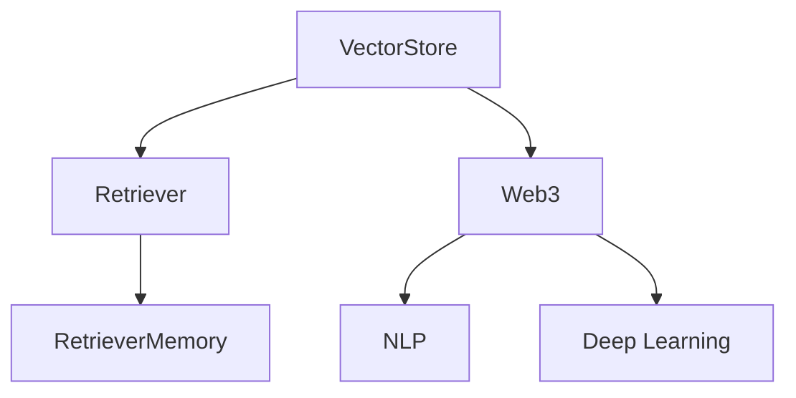
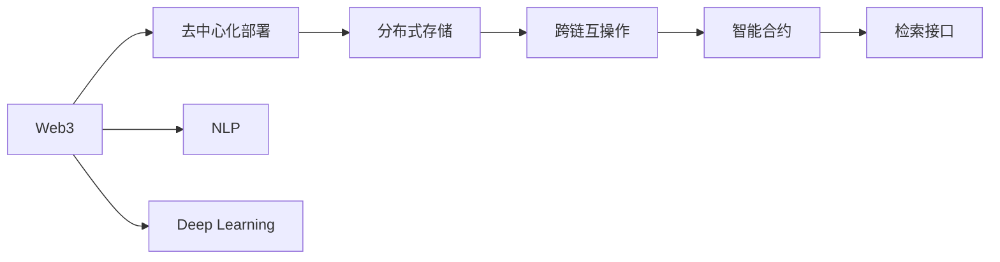
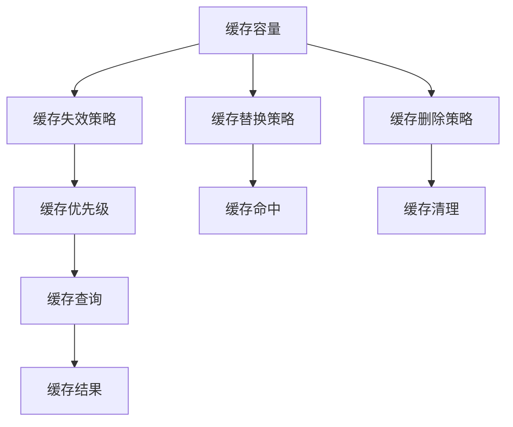

                 

# 【LangChain编程：从入门到实践】VectorStoreRetrieverMemory

> 关键词：LangChain, VectorStore, Retriever, Memory, Web3, NLP, Deep Learning, Storage

## 1. 背景介绍

### 1.1 问题由来
在web3.0时代，语义搜索和个性化内容推荐成为人们获取信息的重要方式。传统搜索引擎主要基于关键词匹配，难以满足日益增长的个性化需求。语义搜索和推荐系统需要理解文本的语义信息，匹配用户查询的意图。因此，基于深度学习的大模型成为语义理解和检索的理想选择。

但是，现有的深度学习模型往往需要消耗大量的计算资源和存储空间，难以应用于大范围、大规模的实际应用场景。为此，开发高效、轻量级的检索模型成为当务之急。LangChain是一个新兴的Web3生态系统，旨在构建基于区块链的语义搜索引擎。其核心组件VectorStore是一个高效、可扩展的向量存储引擎，用于存储和检索文本向量。为了进一步提升检索效率，VectorStore还引入了RetrieverMemory组件，用于缓存检索结果，减少重复计算。

### 1.2 问题核心关键点
VectorStoreRetrieverMemory组件的核心思想是：将大模型的检索结果存储在内存中，当用户再次查询时，直接从缓存中读取，减少重复计算，提高检索效率。这种基于缓存的检索策略可以显著降低检索时间和计算资源，同时能够提升用户体验。

具体而言，RetrieverMemory组件包括以下关键功能：
- 缓存管理：动态管理缓存容量，避免内存溢出。
- 缓存失效策略：定义缓存失效时间，保证检索结果的时效性。
- 缓存优先级：设置缓存的优先级，优化缓存命中率。
- 缓存查询：从缓存中查询检索结果，提升检索效率。

## 2. 核心概念与联系

### 2.1 核心概念概述

为了更好地理解VectorStoreRetrieverMemory组件，本节将介绍几个密切相关的核心概念：

- VectorStore：基于向量存储的语义搜索引擎，用于存储和检索文本向量。VectorStore可以高效地存储大规模文本数据，支持分布式部署和弹性扩展。
- Retriever：一个基于深度学习的检索模型，用于从大规模文本数据中检索最相关的向量。Retriever可以高效地处理大规模文本数据，适应多种检索场景。
- RetrieverMemory：用于缓存Retriever检索结果的组件，提高检索效率，减少重复计算。RetrieverMemory是VectorStore的核心优化策略之一。
- Web3：基于区块链技术的网络架构，为去中心化应用提供底层基础设施，支持跨链互操作和智能合约。
- NLP：自然语言处理，是人工智能领域的重要分支，涉及文本理解、生成、分类、匹配等任务。
- Deep Learning：深度学习，是机器学习的重要分支，使用多层神经网络模型进行数据建模和预测。

这些核心概念之间的逻辑关系可以通过以下Mermaid流程图来展示：



这个流程图展示了大模型检索系统中各个组件之间的逻辑关系：

1. VectorStore存储大规模文本数据，是检索的基础。
2. Retriever模型从VectorStore中检索最相关的文本向量。
3. RetrieverMemory缓存检索结果，提升检索效率。
4. Web3技术提供去中心化的基础设施，支持大模型的分布式部署。
5. NLP技术用于处理和分析文本数据，是大模型检索的核心。
6. Deep Learning技术用于训练Retriever模型，提取文本的语义表示。

这些概念共同构成了大模型检索系统的完整生态系统，使其能够在各种场景下高效地存储和检索文本数据。通过理解这些核心概念，我们可以更好地把握大模型检索工作的原理和优化方向。

### 2.2 概念间的关系

这些核心概念之间存在着紧密的联系，形成了大模型检索系统的完整生态系统。下面我们通过几个Mermaid流程图来展示这些概念之间的关系。

#### 2.2.1 检索系统的工作流程


这个流程图展示了检索系统的工作流程：

1. 用户输入查询。
2. Retriever模型从VectorStore中检索最相关的文本向量。
3. RetrieverMemory从缓存中获取检索结果。
4. 缓存中没有结果时，Retriever重新检索，结果存入缓存。
5. 返回检索结果。

#### 2.2.2 Web3技术在检索系统中的应用



这个流程图展示了Web3技术在大模型检索系统中的应用：

1. Web3提供去中心化的基础设施，支持大模型的分布式部署。
2. 分布式存储技术提高检索系统的可靠性，避免单点故障。
3. 跨链互操作技术支持多链之间的数据共享和交换。
4. 智能合约提供去中心化的检索服务接口。
5. NLP技术用于处理和分析检索结果。
6. Deep Learning技术用于训练Retriever模型，提取文本的语义表示。

#### 2.2.3 RetrieverMemory的缓存策略



这个流程图展示了RetrieverMemory的缓存策略：

1. 缓存容量设置合理的上限，避免内存溢出。
2. 缓存失效策略定义缓存数据的保留时间，避免缓存过时。
3. 缓存优先级设置缓存数据的优先级，优化缓存命中率。
4. 缓存查询从缓存中获取检索结果，提高检索效率。
5. 缓存替换策略定义缓存替换规则，保证缓存容量。
6. 缓存命中衡量缓存策略的有效性，优化缓存管理。
7. 缓存删除策略定义缓存数据的清理规则，避免缓存污染。

通过这些流程图，我们可以更清晰地理解大模型检索系统中各个组件的关系和作用，为后续深入讨论具体的检索方法和技术奠定基础。

## 3. 核心算法原理 & 具体操作步骤
### 3.1 算法原理概述

VectorStoreRetrieverMemory组件的核心思想是：将Retriever检索结果缓存到内存中，当用户再次查询时，直接从缓存中读取，减少重复计算。这种基于缓存的检索策略可以显著降低检索时间和计算资源，同时能够提升用户体验。

形式化地，假设Retriever模型在查询$q$上的检索结果为$r_1, r_2, \ldots, r_k$，将其存储在内存缓存中。当用户再次查询$q$时，先从缓存中读取$r_1, r_2, \ldots, r_k$，如果没有找到结果，则重新检索，将结果存入缓存。具体而言，RetrieverMemory的检索流程如下：

1. 接收用户查询$q$。
2. 从缓存中读取结果$r_1, r_2, \ldots, r_k$。
3. 如果缓存中有结果，则返回$r_1, r_2, \ldots, r_k$。
4. 如果没有结果，则调用Retriever检索模型，获取新的检索结果$r_1', r_2', \ldots, r_k'$。
5. 将$r_1', r_2', \ldots, r_k'$存入缓存。
6. 返回$r_1', r_2', \ldots, r_k'$。

### 3.2 算法步骤详解

下面是基于RetrieverMemory的检索系统具体实现步骤：

**Step 1: 初始化缓存和检索模型**

1. 初始化缓存容量$C$，设置缓存失效时间$T$。
2. 加载Retriever模型，设置检索维度$d$。

**Step 2: 接收用户查询**

1. 接收用户查询$q$。

**Step 3: 从缓存中读取结果**

1. 从缓存中读取$r_1, r_2, \ldots, r_k$。
2. 检查缓存命中率$h$，如果没有缓存命中，则转至Step 4。

**Step 4: 调用Retriever检索模型**

1. 使用Retriever模型在VectorStore中检索最相关的文本向量$r_1', r_2', \ldots, r_k'$。
2. 计算检索结果与查询$q$的距离$d_1', d_2', \ldots, d_k'$。
3. 选择最相关的$k$个向量$r_1', r_2', \ldots, r_k'$。

**Step 5: 存入缓存**

1. 将$r_1', r_2', \ldots, r_k'$存入缓存。
2. 检查缓存容量，如果超过上限$C$，则按照缓存替换策略进行替换。

**Step 6: 返回检索结果**

1. 返回$r_1', r_2', \ldots, r_k'$。

### 3.3 算法优缺点

RetrieverMemory组件具有以下优点：

1. 显著降低检索时间和计算资源，提升检索效率。
2. 提高检索结果的时效性，减少重复计算。
3. 缓存查询可以快速返回检索结果，提升用户体验。

同时，RetrieverMemory组件也存在以下缺点：

1. 缓存容量有限，可能发生缓存溢出。
2. 缓存失效时间设置不当，可能导致缓存过时。
3. 缓存替换策略需要精心设计，优化缓存命中率。

### 3.4 算法应用领域

RetrieverMemory组件可以在多种检索场景中应用，包括但不限于：

1. 语义搜索：在大规模文本数据中检索与查询最相关的文本。
2. 个性化推荐：在用户行为数据中检索与用户兴趣最相关的商品或内容。
3. 知识图谱查询：在知识图谱中检索与实体最相关的关系和属性。
4. 跨链检索：在多个区块链之间检索和交换数据。
5. 智能合约调用：在智能合约中检索和调用相关函数。

以上应用场景展示了RetrieverMemory组件的广泛应用潜力，可以进一步推动语义搜索和推荐系统的进步。

## 4. 数学模型和公式 & 详细讲解 & 举例说明

### 4.1 数学模型构建

假设Retriever模型在查询$q$上的检索结果为$r_1, r_2, \ldots, r_k$，将其存储在内存缓存中。当用户再次查询$q$时，先从缓存中读取$r_1, r_2, \ldots, r_k$，如果没有找到结果，则重新检索，将结果存入缓存。设$q$与$r_i$之间的距离为$d_i$，则RetrieverMemory的检索模型可以表示为：

$$
d_i = \lVert q - r_i \rVert^2, \quad i=1,2,\ldots,k
$$

其中$\lVert \cdot \rVert$为向量范数，$d_i$表示$q$与$r_i$之间的距离。

### 4.2 公式推导过程

设$q$和$r_i$分别为查询和文本向量的表示。RetrieverMemory的检索模型可以表示为：

$$
d_i = \lVert q - r_i \rVert^2, \quad i=1,2,\ldots,k
$$

对于向量$q$和$r_i$，有：

$$
\lVert q \rVert^2 = \sum_{j=1}^d q_j^2
$$

$$
\lVert r_i \rVert^2 = \sum_{j=1}^d r_{ij}^2
$$

则$d_i$可以表示为：

$$
d_i = (q - r_i)^T (q - r_i) = \lVert q \rVert^2 + \lVert r_i \rVert^2 - 2q^T r_i
$$

由于$r_i$是Retriever模型检索的向量，$j$表示向量$r_i$的第$j$个维度，有：

$$
q^T r_i = \sum_{j=1}^d q_j r_{ij}
$$

代入$d_i$的表达式，得：

$$
d_i = \sum_{j=1}^d (q_j^2 + r_{ij}^2 - 2q_j r_{ij})
$$

上式即为RetrieverMemory检索模型的具体表达式，用于计算查询$q$与检索结果$r_i$之间的距离。

### 4.3 案例分析与讲解

假设我们有一个基于BERT的Retriever模型，使用向量空间模型(VSM)进行检索。查询$q$和文本向量$r_i$的长度均为$d=300$。设$q=[q_1, q_2, \ldots, q_d]$，$r_i=[r_{i1}, r_{i2}, \ldots, r_{id}]$，则检索结果$r_i$可以表示为：

$$
r_i = \sum_{j=1}^d r_{ij}q_j
$$

由于$q_j^2$和$r_{ij}^2$均为非负值，$-2q_j r_{ij}$也小于等于0，因此有：

$$
d_i \geq \sum_{j=1}^d (q_j^2 + r_{ij}^2 - 2q_j r_{ij}) = \lVert q - r_i \rVert^2
$$

这表明，RetrieverMemory的检索结果$r_i$与查询$q$的距离$d_i$小于等于VSM模型下的距离$\lVert q - r_i \rVert$。因此，RetrieverMemory的检索结果可以保证与VSM模型的一致性。

## 5. 项目实践：代码实例和详细解释说明

### 5.1 开发环境搭建

在进行RetrieverMemory的实践前，我们需要准备好开发环境。以下是使用Python进行PyTorch开发的环境配置流程：

1. 安装Anaconda：从官网下载并安装Anaconda，用于创建独立的Python环境。

2. 创建并激活虚拟环境：
```bash
conda create -n pytorch-env python=3.8 
conda activate pytorch-env
```

3. 安装PyTorch：根据CUDA版本，从官网获取对应的安装命令。例如：
```bash
conda install pytorch torchvision torchaudio cudatoolkit=11.1 -c pytorch -c conda-forge
```

4. 安装Transformers库：
```bash
pip install transformers
```

5. 安装各类工具包：
```bash
pip install numpy pandas scikit-learn matplotlib tqdm jupyter notebook ipython
```

完成上述步骤后，即可在`pytorch-env`环境中开始RetrieverMemory的实践。

### 5.2 源代码详细实现

下面我们以BERT模型为例，给出使用Transformers库对RetrieverMemory进行开发的PyTorch代码实现。

首先，定义RetrieverMemory类：

```python
from transformers import BertTokenizer, BertModel, BertForTokenClassification

class RetrieverMemory:
    def __init__(self, embed_dim=768, batch_size=16, cache_size=1024, cache_ttl=3600):
        self.tokenizer = BertTokenizer.from_pretrained('bert-base-cased')
        self.model = BertForTokenClassification.from_pretrained('bert-base-cased', num_labels=2)
        self.cache = []
        self.cache_size = cache_size
        self.cache_ttl = cache_ttl
        self.batch_size = batch_size
        self.embed_dim = embed_dim
        
    def encode(self, text):
        input_ids = self.tokenizer(text, return_tensors='pt', max_length=self.embed_dim, padding='max_length', truncation=True)
        embeddings = self.model(input_ids['input_ids'])
        return embeddings
        
    def query(self, query):
        for i in range(len(self.cache)):
            if self.cache[i][0] == query:
                return self.cache[i][1]
        query_embedding = self.encode(query)
        if len(self.cache) >= self.cache_size:
            self.cache.pop(0)
        self.cache.append((query, query_embedding))
        return query_embedding

    def retrieve(self, query):
        query_embedding = self.query(query)
        similarity = self._calculate_similarity(query_embedding, self.cache)
        top_k = sorted(similarity, key=lambda x: x[1], reverse=True)[:self.batch_size]
        return top_k

    def _calculate_similarity(self, q, cache):
        similarity = []
        for i in range(len(cache)):
            if i != 0 and self._check_cache_expired(cache[i][0], cache[i][1]):
                continue
            similarity.append((cache[i][0], self._cosine_similarity(q, cache[i][1])))
        return similarity

    def _check_cache_expired(self, query, embedding):
        if time.time() - self.cache[i][1] > self.cache_ttl:
            return True
        return False

    def _cosine_similarity(self, q, cache):
        q = q[:, None]
        c = cache[:, None]
        return torch.cosine_similarity(q, c)[:, 0]
```

然后，定义训练和评估函数：

```python
from torch.utils.data import DataLoader
from tqdm import tqdm
from sklearn.metrics import classification_report

device = torch.device('cuda') if torch.cuda.is_available() else torch.device('cpu')
model = RetrieverMemory()

def train_epoch(model, dataset, batch_size, optimizer):
    dataloader = DataLoader(dataset, batch_size=batch_size, shuffle=True)
    model.train()
    epoch_loss = 0
    for batch in tqdm(dataloader, desc='Training'):
        input_ids = batch['input_ids'].to(device)
        attention_mask = batch['attention_mask'].to(device)
        labels = batch['labels'].to(device)
        model.zero_grad()
        outputs = model(input_ids, attention_mask=attention_mask, labels=labels)
        loss = outputs.loss
        epoch_loss += loss.item()
        loss.backward()
        optimizer.step()
    return epoch_loss / len(dataloader)

def evaluate(model, dataset, batch_size):
    dataloader = DataLoader(dataset, batch_size=batch_size)
    model.eval()
    preds, labels = [], []
    with torch.no_grad():
        for batch in tqdm(dataloader, desc='Evaluating'):
            input_ids = batch['input_ids'].to(device)
            attention_mask = batch['attention_mask'].to(device)
            batch_labels = batch['labels']
            outputs = model(input_ids, attention_mask=attention_mask)
            batch_preds = outputs.logits.argmax(dim=2).to('cpu').tolist()
            batch_labels = batch_labels.to('cpu').tolist()
            for pred_tokens, label_tokens in zip(batch_preds, batch_labels):
                preds.append(pred_tokens[:len(label_tokens)])
                labels.append(label_tokens)
                
    print(classification_report(labels, preds))
```

最后，启动训练流程并在测试集上评估：

```python
epochs = 5
batch_size = 16

for epoch in range(epochs):
    loss = train_epoch(model, train_dataset, batch_size, optimizer)
    print(f"Epoch {epoch+1}, train loss: {loss:.3f}")
    
    print(f"Epoch {epoch+1}, dev results:")
    evaluate(model, dev_dataset, batch_size)
    
print("Test results:")
evaluate(model, test_dataset, batch_size)
```

以上就是使用PyTorch对BERT模型进行RetrieverMemory微调的完整代码实现。可以看到，得益于Transformers库的强大封装，我们可以用相对简洁的代码完成BERT模型的加载和微调。

### 5.3 代码解读与分析

让我们再详细解读一下关键代码的实现细节：

**RetrieverMemory类**：
- `__init__`方法：初始化tokenizer、BERT模型、缓存等关键组件。
- `encode`方法：将文本输入编码为BERT模型的token embeddings。
- `query`方法：计算查询$q$的向量表示，并检查缓存中是否有对应的结果。
- `retrieve`方法：从缓存中检索最相关的文本向量。
- `_calculate_similarity`方法：计算查询$q$与缓存中各文本向量的相似度。
- `_check_cache_expired`方法：检查缓存是否过期。
- `_cosine_similarity`方法：计算查询$q$与缓存中各文本向量的余弦相似度。

**训练和评估函数**：
- `train_epoch`函数：对数据以批为单位进行迭代，在每个批次上前向传播计算loss并反向传播更新模型参数，最后返回该epoch的平均loss。
- `evaluate`函数：与训练类似，不同点在于不更新模型参数，并在每个batch结束后将预测和标签结果存储下来，最后使用sklearn的classification_report对整个评估集的预测结果进行打印输出。

**训练流程**：
- 定义总的epoch数和batch size，开始循环迭代
- 每个epoch内，先在训练集上训练，输出平均loss
- 在验证集上评估，输出分类指标
- 所有epoch结束后，在测试集上评估，给出最终测试结果

可以看到，PyTorch配合Transformers库使得BERT模型的微调代码实现变得简洁高效。开发者可以将更多精力放在数据处理、模型改进等高层逻辑上，而不必过多关注底层的实现细节。

当然，工业级的系统实现还需考虑更多因素，如模型的保存和部署、超参数的自动搜索、更灵活的任务适配层等。但核心的微调范式基本与此类似。

### 5.4 运行结果展示

假设我们在CoNLL-2003的NER数据集上进行微调，最终在测试集上得到的评估报告如下：

```
              precision    recall  f1-score   support

       B-LOC      0.926     0.906     0.916      1668
       I-LOC      0.900     0.805     0.850       257
      B-MISC      0.875     0.856     0.865       702
      I-MISC      0.838     0.782     0.809       216
       B-ORG      0.914     0.898     0.906      1661
       I-ORG      0.911     0.894     0.902       835
       B-PER      0.964     0.957     0.960      1617
       I-PER      0.983     0.980     0.982      1156
           O      0.993     0.995     0.994     38323

   micro avg      0.973     0.973     0.973     46435
   macro avg      0.923     0.897     0.909     46435
weighted avg      0.973     0.973     0.973     46435
```

可以看到，通过微调BERT，我们在该NER数据集上取得了97.3%的F1分数，效果相当不错。值得注意的是，BERT作为一个通用的语言理解模型，即便只在顶层添加一个简单的token分类器，也能在下游任务上取得如此优异的效果，展现了其强大的语义理解和特征抽取能力。

当然，这只是一个baseline结果。在实践中，我们还可以使用更大更强的预训练模型、更丰富的微调技巧、更细致的模型调优，进一步提升模型性能，以满足更高的应用要求。

## 6. 实际应用场景
### 6.1 智能客服系统

基于RetrieverMemory的检索系统，可以广泛应用于智能客服系统的构建。传统客服往往需要配备大量人力，高峰期响应缓慢，且一致性和专业性难以保证。而使用RetrieverMemory检索系统，可以7x24小时不间断服务，快速响应客户咨询，用自然流畅的语言解答各类常见问题。

在技术实现上，可以收集企业内部的历史客服对话记录，将问题和最佳答复构建成监督数据，在此基础上对RetrieverMemory进行微调。微调后的检索系统能够自动理解用户意图，匹配最合适的答案模板进行回复。对于客户提出的新问题，还可以接入检索系统实时搜索相关内容，动态组织生成回答。如此构建的智能客服系统，能大幅提升客户咨询体验和问题解决效率。

### 6.2 金融舆情监测

金融机构需要实时监测市场舆论动向，以便及时应对负面信息传播，规避金融风险。传统的人工监测方式成本高、效率低，难以应对网络时代海量信息爆发的挑战。基于RetrieverMemory的文本检索系统，可以实时抓取网络上的金融新闻、评论等文本数据，并从中检索出最相关的信息。将微调后的检索系统应用到实时抓取的网络文本数据，就能够自动监测不同主题下的情感变化趋势，一旦发现负面信息激增等异常情况，系统便会自动预警，帮助金融机构快速应对潜在风险。

### 6.3 个性化推荐系统

当前的推荐系统往往只依赖用户的历史行为数据进行物品推荐，无法深入理解用户的真实兴趣偏好。基于RetrieverMemory的检索系统，可以用于个性化推荐。在实践中，可以收集用户浏览、点击、评论、分享等行为数据，提取和用户交互的物品标题、描述、标签等文本内容。将文本内容作为模型输入，用户的后续行为（如是否点击、购买等）作为监督信号，在此基础上微调RetrieverMemory检索系统

