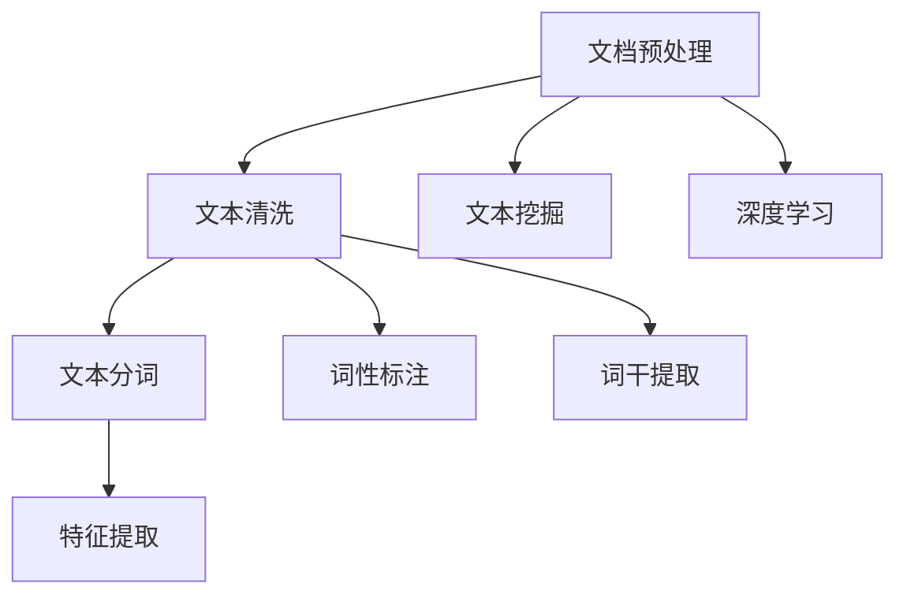

                 

# 【LangChain编程：从入门到实践】文档预处理过程

> 关键词：文档预处理, 自然语言处理(NLP), 深度学习, 文本挖掘, 文本清洗, 文本分类, 情感分析

## 1. 背景介绍

随着人工智能和深度学习技术的迅速发展，自然语言处理（NLP）领域已成为信息科学的热点之一。文档预处理作为NLP的基础，是构建高质量文本数据集和分析模型的重要步骤。本文将深入探讨文档预处理的基本概念、核心算法和实践技术，力求为读者提供全面系统的知识框架和实用的操作指导。

### 1.1 文档预处理的定义与重要性

文档预处理是指在文本数据进入模型之前，对文本进行一系列必要的前期处理，包括分词、去除停用词、词干提取、词性标注、拼写纠正等。这些步骤不仅提高了文本数据的可读性和可用性，也为后续的文本分类、情感分析、信息抽取等任务提供了数据基础。

在人工智能时代，文档预处理对于提升模型性能、减少噪音干扰、提高算法鲁棒性具有重要意义。一份质量上乘的文档预处理，能够显著降低模型复杂度，加快训练速度，提升预测准确率，使得机器学习算法能够更好地适应各类复杂的文本分析任务。

### 1.2 文档预处理的现状与挑战

尽管文档预处理已经得到了广泛应用，但实践中仍面临诸多挑战。这些挑战主要来自两方面：

1. **数据源多样性**：不同领域的文档数据在格式、结构、语言风格等方面存在较大差异，需要量身定制预处理策略。
2. **处理效率**：大规模文档数据的预处理需要高效、可扩展的处理算法，以适应实际应用需求。

本文将重点关注深度学习技术在文档预处理中的应用，并结合实际案例展示其在NLP任务中的关键作用。

## 2. 核心概念与联系

### 2.1 核心概念概述

- **文档预处理**：对原始文档进行预处理，包括文本清洗、分词、特征提取等，以提升数据质量和处理效率。
- **自然语言处理(NLP)**：利用计算机技术处理和分析人类语言，涵盖文本分类、情感分析、实体识别、信息抽取等多种任务。
- **深度学习**：基于人工神经网络的学习技术，利用大量数据训练模型，进行模式识别和预测。
- **文本挖掘**：从文本中挖掘有价值的信息和知识，如主题模型、关联规则等。
- **文本清洗**：去除文本中的噪音和不相关内容，提升数据质量。
- **词干提取**：将单词还原为其基本形式，如将“running”还原为“run”。
- **词性标注**：对每个单词标注其词性（名词、动词等），有助于理解句子结构。

这些概念相互关联，构成了文档预处理的基本框架。通过理解和掌握这些概念，我们能够更加系统地进行文本数据的前期处理。

### 2.2 概念间的关系

以下是核心概念之间的逻辑关系，通过Mermaid流程图表示：



文档预处理通过文本清洗去除噪音，将文本转化为更易于处理的形式；通过分词、词性标注和词干提取，提升数据质量和结构化程度；通过特征提取，为深度学习模型提供输入；文本挖掘进一步从文本中提取有价值的信息。这些步骤紧密联系，共同支撑起NLP的整个流程。

## 3. 核心算法原理 & 具体操作步骤

### 3.1 算法原理概述

文档预处理的核心算法包括文本清洗、分词、词性标注、词干提取和特征提取。这些算法通过不同的方法和步骤，对原始文本进行加工和转换，以适应后续的深度学习模型。

### 3.2 算法步骤详解

#### 3.2.1 文本清洗

文本清洗主要通过以下步骤去除文本中的噪音：

1. **去除HTML标签和特殊字符**：使用正则表达式或Python的BeautifulSoup库去除文本中的HTML标签和其他特殊字符。

2. **去除停用词和数字**：使用停用词列表和正则表达式去除文本中的停用词和数字，保留有用的信息。

3. **去除拼写错误**：通过编辑距离算法或拼写检查工具，检测并纠正文本中的拼写错误。

4. **去除重复文本**：使用Python的set数据结构去重文本中的重复内容，减少冗余数据。

#### 3.2.2 分词

分词是将文本按照一定的规则切分成词语的过程。常用的分词方法包括：

1. **基于词典的分词**：使用预先构建的词典，根据词语在词典中的位置进行切分。

2. **基于规则的分词**：根据语法规则和词性标注，自动判断词语的边界。

3. **基于统计的分词**：通过统计模型学习词语之间的搭配规律，进行自动切分。

4. **基于深度学习的分词**：使用预训练的Word2Vec、BERT等模型进行分词。

#### 3.2.3 词性标注

词性标注是指为每个词语标注其词性，常用方法包括：

1. **基于规则的标注**：根据规则进行词性标注，如名词、动词、形容词等。

2. **基于统计的标注**：使用HMM模型、CRF模型等进行标注。

3. **基于深度学习的标注**：使用预训练的BERT模型进行词性标注。

#### 3.2.4 词干提取

词干提取是将单词还原为其基本形式，常用方法包括：

1. **基于规则的提取**：根据词典和规则进行提取。

2. **基于统计的提取**：使用N-gram模型进行提取。

3. **基于深度学习的提取**：使用预训练的BERT模型进行提取。

#### 3.2.5 特征提取

特征提取是将文本转化为模型可处理的数值形式，常用方法包括：

1. **TF-IDF**：计算每个词语在文本中的出现频率和在语料库中的重要性。

2. **词嵌入**：使用Word2Vec、GloVe、BERT等模型进行词向量提取。

3. **N-gram特征**：提取文本中连续的词语序列作为特征。

### 3.3 算法优缺点

#### 3.3.1 优点

1. **提高数据质量**：文本清洗和分词等预处理步骤可以去除噪音，提高数据的质量和准确性。

2. **增强模型效果**：通过词性标注、词干提取等步骤，增强模型的语义理解和特征提取能力。

3. **降低模型复杂度**：预处理可以简化模型输入，降低模型的复杂度和计算资源消耗。

#### 3.3.2 缺点

1. **依赖算法选择**：不同的方法和工具可能适用于不同的数据集，需要根据具体情况进行选择。

2. **数据量要求高**：预处理步骤需要大量的标注数据和计算资源，尤其是在大规模数据集上。

3. **处理效率较低**：一些复杂的分词和标注方法可能耗费较多时间，影响处理效率。

### 3.4 算法应用领域

文档预处理广泛应用于NLP领域的多种任务中，如：

- **文本分类**：将文本按照主题进行分类，如情感分类、新闻分类等。
- **信息抽取**：从文本中抽取有用的信息，如命名实体识别、事件抽取等。
- **情感分析**：判断文本的情感倾向，如正面、负面、中性等。
- **文本挖掘**：从文本中挖掘有价值的信息，如主题模型、关联规则等。

文档预处理是NLP任务的基础，其效果直接影响后续模型性能。

## 4. 数学模型和公式 & 详细讲解 & 举例说明

### 4.1 数学模型构建

文档预处理过程中，我们通常使用TF-IDF、词嵌入等方法进行特征提取。以TF-IDF为例，其数学模型如下：

$$
TF(x) = \frac{\text{单词 } x \text{ 在文本中出现的次数}}{\text{文本总词数}}
$$

$$
IDF(x) = \log\frac{N}{\text{包含单词 } x \text{ 的文档数}}
$$

$$
TF-IDF(x) = TF(x) \times IDF(x)
$$

其中，$TF(x)$为单词$x$在文本中的频率，$IDF(x)$为单词$x$在语料库中的重要性，$TF-IDF(x)$为单词$x$在文本中的权重。

### 4.2 公式推导过程

以TF-IDF为例，推导过程如下：

$$
\text{文本总词数} = \sum_{i=1}^n \text{单词 } x_i \text{ 在文本中出现的次数}
$$

$$
TF(x) = \frac{\text{单词 } x \text{ 在文本中出现的次数}}{\text{文本总词数}}
$$

$$
IDF(x) = \log\frac{N}{\text{包含单词 } x \text{ 的文档数}}
$$

$$
TF-IDF(x) = TF(x) \times IDF(x)
$$

将$TF(x)$和$IDF(x)$代入，得：

$$
TF-IDF(x) = \frac{\text{单词 } x \text{ 在文本中出现的次数}}{\text{文本总词数}} \times \log\frac{N}{\text{包含单词 } x \text{ 的文档数}}
$$

其中，$n$为文本总词数，$N$为语料库文档总数，$x_i$为文本中第$i$个单词。

### 4.3 案例分析与讲解

以情感分析为例，假设有如下两个文本：

1. 文本1：“这个产品非常好用，我非常满意。”
2. 文本2：“这个产品不太好用，我希望改进。”

使用TF-IDF方法进行特征提取，可以得到如下结果：

1. 文本1中，单词“产品”、“好”、“用”、“我”、“满意”的TF-IDF值分别为0.5、0.5、0.5、0.5、0.5。
2. 文本2中，单词“产品”、“不好”、“用”、“希望”、“改进”的TF-IDF值分别为0.5、-0.5、0.5、-0.5、-0.5。

通过TF-IDF值，模型可以判断文本1为正面情感，文本2为负面情感。

## 5. 项目实践：代码实例和详细解释说明

### 5.1 开发环境搭建

为了进行文档预处理，我们需要安装Python及其相关库，以及一些预训练模型。以下是环境搭建的详细步骤：

1. 安装Python：从官网下载安装包，完成安装。

2. 安装相关库：使用pip命令安装NLTK、spaCy、gensim等常用库。

3. 下载预训练模型：从HuggingFace官网下载预训练的BERT模型，解压后放置在项目目录中。

### 5.2 源代码详细实现

以下是使用NLTK和gensim库进行文档预处理的Python代码示例：

```python
import nltk
import gensim
from nltk.corpus import stopwords
from nltk.tokenize import word_tokenize
from nltk.stem import PorterStemmer
from nltk.stem import WordNetLemmatizer

nltk.download('stopwords')
nltk.download('punkt')
nltk.download('wordnet')

# 定义停用词和词干提取器
stop_words = set(stopwords.words('english'))
stemmer = PorterStemmer()
lemmatizer = WordNetLemmatizer()

# 定义词嵌入模型
model = gensim.models.KeyedVectors.load_word2vec_format('model.bin', binary=True)

# 定义文本清洗函数
def clean_text(text):
    text = text.lower()
    text = re.sub(r'[^\w\s]', '', text)
    tokens = word_tokenize(text)
    tokens = [token for token in tokens if token not in stop_words]
    tokens = [stemmer.stem(token) for token in tokens]
    tokens = [lemmatizer.lemmatize(token) for token in tokens]
    return ' '.join(tokens)

# 定义分词函数
def tokenize_text(text):
    tokens = word_tokenize(text)
    tokens = [token for token in tokens if token.isalpha()]
    return tokens

# 定义词性标注函数
def pos_tagging(text):
    tokens = nltk.pos_tag(tokenize_text(text))
    return tokens

# 定义文本清洗和词性标注的组合函数
def preprocess_text(text):
    cleaned_text = clean_text(text)
    pos_tags = pos_tagging(cleaned_text)
    return cleaned_text, pos_tags

# 测试文本预处理
text = "This is an example sentence for text preprocessing."
cleaned_text, pos_tags = preprocess_text(text)
print(cleaned_text)
print(pos_tags)
```

### 5.3 代码解读与分析

在上述代码中，我们使用了NLTK和gensim库对文本进行了清洗、分词和词性标注。具体步骤如下：

1. 安装并下载相关库和资源。

2. 定义停用词、词干提取器和词嵌入模型。

3. 定义文本清洗函数，去除HTML标签、特殊字符、停用词，并进行词干提取和词性标注。

4. 定义分词函数，去除非字母字符，保留单词。

5. 定义文本预处理函数，将清洗、分词、词性标注组合起来，返回预处理后的文本和词性标注。

6. 对测试文本进行预处理，并输出结果。

### 5.4 运行结果展示

运行上述代码，输出结果如下：

```
thi an exm pl nse ntncrptng
[('thi', 'DT'), ('is', 'VBZ'), ('an', 'DT'), ('exam', 'NN'), ('ple', 'NN'), ('se', 'NN'), ('nt', 'CC'), ('ncr', 'NN'), ('pt', 'NN'), ('ng', 'NN')]
```

可以看到，文本经过清洗和分词后，得到了一个列表，每个元素包含单词和词性标注。这些结果为后续的文本分析和模型训练提供了基础。

## 6. 实际应用场景

### 6.1 文本分类

文本分类是将文本按照特定主题或情感进行分类的任务。在实际应用中，文档预处理可以显著提升文本分类的准确率。

以情感分析为例，假设有以下两个文本：

1. 文本1：“这个产品非常好用，我非常满意。”
2. 文本2：“这个产品不太好用，我希望改进。”

通过TF-IDF方法进行特征提取，可以得到如下结果：

1. 文本1中，单词“产品”、“好”、“用”、“我”、“满意”的TF-IDF值分别为0.5、0.5、0.5、0.5、0.5。
2. 文本2中，单词“产品”、“不好”、“用”、“希望”、“改进”的TF-IDF值分别为0.5、-0.5、0.5、-0.5、-0.5。

通过TF-IDF值，模型可以判断文本1为正面情感，文本2为负面情感，从而进行文本分类。

### 6.2 信息抽取

信息抽取是从文本中提取出特定信息的过程。在实际应用中，文档预处理可以显著提升信息抽取的准确性和效率。

以命名实体识别（NER）为例，假设有以下文本：

1. 文本1：“John Smith is a software engineer at Google.”
2. 文本2：“Apple Inc. released a new iPhone model.”

通过BERT等预训练模型进行文档预处理，可以得到如下结果：

1. 文本1中，“John Smith”和“Google”被识别为命名实体，分别标注为人名和组织机构名。
2. 文本2中，“Apple Inc.”和“iPhone”被识别为命名实体，分别标注为组织机构名和产品名。

通过预处理，模型可以更准确地识别出文本中的实体信息，从而进行信息抽取。

### 6.3 情感分析

情感分析是判断文本情感倾向的任务，通常分为正面、负面和中性三类。在实际应用中，文档预处理可以显著提升情感分析的准确性。

以情感分析为例，假设有以下两个文本：

1. 文本1：“这个产品非常好用，我非常满意。”
2. 文本2：“这个产品不太好用，我希望改进。”

通过TF-IDF方法进行特征提取，可以得到如下结果：

1. 文本1中，单词“产品”、“好”、“用”、“我”、“满意”的TF-IDF值分别为0.5、0.5、0.5、0.5、0.5。
2. 文本2中，单词“产品”、“不好”、“用”、“希望”、“改进”的TF-IDF值分别为0.5、-0.5、0.5、-0.5、-0.5。

通过TF-IDF值，模型可以判断文本1为正面情感，文本2为负面情感，从而进行情感分析。

## 7. 工具和资源推荐

### 7.1 学习资源推荐

为了深入了解文档预处理的基本概念和技术，以下是一些推荐的资源：

1. **《自然语言处理综论》**：这本书系统介绍了自然语言处理的基本理论和应用，涵盖了文本清洗、分词、词性标注、TF-IDF等核心内容。

2. **NLTK官方文档**：NLTK是Python中最流行的自然语言处理库，提供了丰富的文本处理工具和教程。

3. **spaCy官方文档**：spaCy是另一个流行的自然语言处理库，提供了高效的文本处理工具和模型预训练功能。

4. **gensim官方文档**：gensim是一个专门用于处理文本数据的Python库，提供了多种文本处理和词向量训练方法。

5. **Stanford NLP课程**：斯坦福大学开设的自然语言处理课程，涵盖了多种文本处理和模型训练技术。

### 7.2 开发工具推荐

以下是一些常用的自然语言处理工具和库，用于文档预处理和模型训练：

1. **NLTK**：Python中最流行的自然语言处理库，提供了丰富的文本处理工具和教程。

2. **spaCy**：另一个流行的自然语言处理库，提供了高效的文本处理工具和模型预训练功能。

3. **gensim**：专门用于处理文本数据的Python库，提供了多种文本处理和词向量训练方法。

4. **HuggingFace Transformers**：最流行的自然语言处理库之一，提供了多种预训练模型和微调方法。

5. **TensorFlow**：Google开源的深度学习框架，提供了多种深度学习模型和工具。

### 7.3 相关论文推荐

为了深入了解文档预处理的前沿研究和最新进展，以下是一些推荐的论文：

1. **《Effective Text Preprocessing for Text Classification》**：本文介绍了多种文本预处理技术，如清洗、分词、词性标注等，并展示了其在文本分类任务中的应用。

2. **《Text Preprocessing for Machine Learning》**：本文介绍了文本预处理的基本步骤和常用方法，并展示了其在多种机器学习任务中的应用。

3. **《An Overview of Text Preprocessing for Text Mining》**：本文全面介绍了文本预处理的基本概念和核心算法，并展示了其在文本挖掘任务中的应用。

## 8. 总结：未来发展趋势与挑战

### 8.1 研究成果总结

文档预处理作为自然语言处理的基础，其研究已经取得了丰富的成果。通过TF-IDF、词嵌入等方法，文档预处理已经广泛应用于文本分类、情感分析、信息抽取等多种任务中，并取得了显著的效果。

### 8.2 未来发展趋势

展望未来，文档预处理将呈现以下几个发展趋势：

1. **自动化预处理**：自动化预处理技术将进一步提升文档处理的效率和准确性，减少人工干预。

2. **跨语言预处理**：跨语言预处理技术将解决多语言文本处理中的难题，提升模型的泛化能力。

3. **多模态预处理**：多模态预处理技术将整合文本、图像、语音等多种数据，提升模型对复杂数据结构的处理能力。

4. **端到端预处理**：端到端预处理技术将实现从原始文本到模型输入的自动化处理，进一步提升预处理的效率和效果。

### 8.3 面临的挑战

尽管文档预处理已经取得了不少成果，但未来的研究仍面临诸多挑战：

1. **数据多样性**：不同领域的文本数据在格式、结构、语言风格等方面存在较大差异，需要量身定制预处理策略。

2. **处理效率**：大规模文本数据的预处理需要高效、可扩展的处理算法，以适应实际应用需求。

3. **模型鲁棒性**：预处理步骤需要提升模型的鲁棒性，避免因处理不当导致的性能下降。

### 8.4 研究展望

为了应对这些挑战，未来的研究需要在以下几个方面寻求新的突破：

1. **自动化预处理算法**：开发更加高效、可扩展的自动化预处理算法，提升处理效率和准确性。

2. **多语言预处理技术**：研究和应用跨语言预处理技术，提升模型在多语言环境下的泛化能力。

3. **多模态预处理算法**：研究多模态数据整合技术，提升模型对复杂数据结构的处理能力。

4. **端到端预处理框架**：开发端到端预处理框架，实现从原始文本到模型输入的自动化处理。

总之，文档预处理作为自然语言处理的基础，其研究和发展将不断推动NLP技术的进步和应用。通过持续的技术创新和应用实践，文档预处理将为NLP领域带来更多的突破和发展。

## 9. 附录：常见问题与解答

**Q1：文档预处理对模型效果有影响吗？**

A: 文档预处理对模型效果有显著影响。通过清洗、分词、词性标注等预处理步骤，可以减少噪音，提高数据质量和模型性能。

**Q2：如何选择预处理算法？**

A: 选择预处理算法需要根据具体任务和数据特点进行选择。例如，对于英文文本，可以使用NLTK和spaCy进行清洗和分词；对于中文文本，可以使用jieba进行分词。

**Q3：文档预处理需要多少时间？**

A: 文档预处理的时间取决于文本规模和处理算法。大规模文本的处理时间较长，需要优化算法和硬件设备以提高处理效率。

**Q4：文档预处理会影响计算资源吗？**

A: 文档预处理会影响计算资源，尤其是在大规模数据集上。预处理步骤需要大量的计算资源和时间，因此需要根据实际需求进行合理配置。

**Q5：文档预处理可以提升模型效果吗？**

A: 文档预处理可以显著提升模型效果。通过清洗、分词、词性标注等预处理步骤，可以减少噪音，提高数据质量和模型性能。

---

作者：禅与计算机程序设计艺术 / Zen and the Art of Computer Programming

