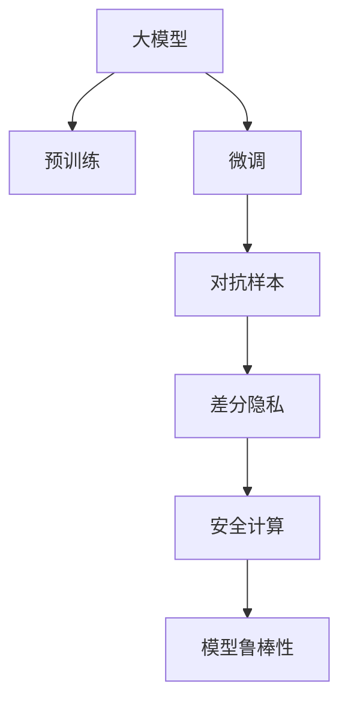
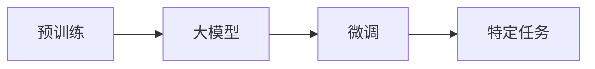
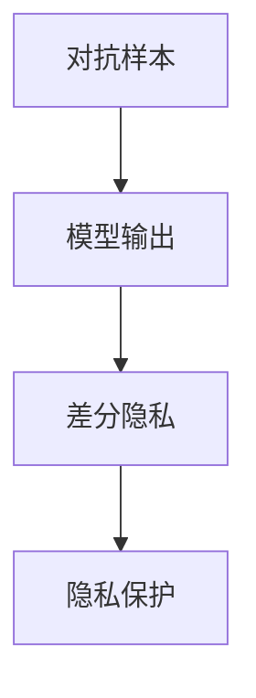
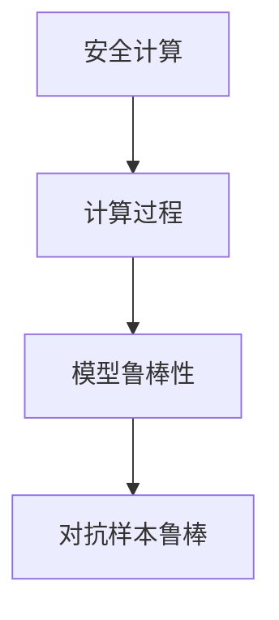
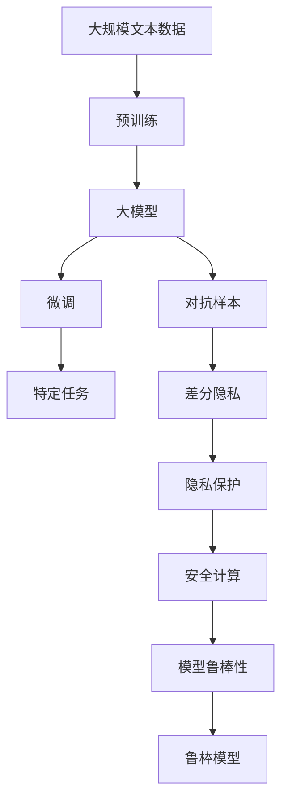

                 

# 【LangChain编程：从入门到实践】模型内容安全

> 关键词：LangChain, 内容安全, 模型压缩, 隐私保护, 安全计算, 对抗样本, 模型鲁棒性, 差分隐私

## 1. 背景介绍

### 1.1 问题由来

随着深度学习技术的飞速发展，大模型在自然语言处理（NLP）领域取得了显著的进步，如BERT、GPT-3等模型在各种NLP任务上表现优异。这些大模型通常基于大规模无标签数据进行预训练，学习通用的语言表示，然后通过微调适配下游任务。但是，这些模型的训练和推理过程存在潜在的安全风险，如模型泄露、对抗样本攻击等，如何保护大模型的内容安全成为一个重要的问题。

### 1.2 问题核心关键点

模型内容安全主要涉及以下几个关键点：

1. **模型泄露**：在大模型的训练和微调过程中，可能通过数据泄露或模型输出泄露敏感信息，如个人隐私、商业机密等。
2. **对抗样本攻击**：对抗样本攻击指通过微小的扰动，使得模型输出错误结果，如语音指令攻击、自然语言推理中的反例欺骗等。
3. **模型鲁棒性**：模型应对对抗样本的鲁棒性，即在面对恶意攻击时，仍然能够保持较高的准确率。
4. **差分隐私**：差分隐私是一种保护个人隐私的隐私保护技术，通过添加噪声扰动，使得模型输出的任何信息均不能直接推断出任何单个个体的信息。

这些问题在大模型的实际应用中尤为突出，特别是在涉及敏感数据或重要决策的领域，如金融、医疗、司法等。

### 1.3 问题研究意义

研究大模型的内容安全，对于保障模型应用的隐私性、安全性、公平性等具有重要意义：

1. **隐私保护**：保护个人隐私和商业机密，避免模型泄露敏感信息。
2. **安全性和鲁棒性**：提升模型对抗攻击的能力，保障模型输出的正确性。
3. **公平性**：确保模型在不同数据分布下的一致性，避免偏见和歧视。

这些研究不仅有助于提升大模型的可信度，还能推动其在更多领域的应用，如金融、医疗、法律等。

## 2. 核心概念与联系

### 2.1 核心概念概述

为了更好地理解模型内容安全的原理和实践，本节将介绍几个核心概念：

1. **大模型（Large Model）**：指具有海量参数的深度学习模型，如BERT、GPT-3等。
2. **预训练（Pretraining）**：在大规模无标签数据上训练模型，学习通用的语言表示。
3. **微调（Fine-tuning）**：在大规模数据上进行微调，适配下游任务，提升模型在特定任务上的性能。
4. **对抗样本（Adversarial Examples）**：通过微小扰动使得模型输出错误结果的样本。
5. **差分隐私（Differential Privacy）**：一种隐私保护技术，通过添加噪声扰动保护个体隐私。
6. **安全计算（Secure Computation）**：在模型计算过程中保护数据隐私和安全，避免中间结果泄露。

这些概念之间的逻辑关系可以通过以下Mermaid流程图来展示：



这个流程图展示了从预训练到微调，再到对抗样本和差分隐私，最后到安全计算的过程，以及各个环节之间的联系。

### 2.2 概念间的关系

这些核心概念之间存在紧密的联系，形成了大模型内容安全的完整生态系统。下面通过几个Mermaid流程图来展示这些概念之间的关系。

#### 2.2.1 预训练与微调



这个流程图展示了预训练和微调的基本流程，预训练学习通用语言表示，微调适配特定任务。

#### 2.2.2 对抗样本与差分隐私



这个流程图展示了对抗样本攻击对模型输出的影响，以及差分隐私如何在隐私保护的同时保证模型的准确性。

#### 2.2.3 安全计算与模型鲁棒性



这个流程图展示了安全计算如何保护模型计算过程的隐私性，提升模型对对抗样本的鲁棒性。

### 2.3 核心概念的整体架构

最后，我们用一个综合的流程图来展示这些核心概念在大模型内容安全中的整体架构：



这个综合流程图展示了从预训练到微调，再到对抗样本和差分隐私，最后到安全计算的过程，以及各个环节之间的联系。

## 3. 核心算法原理 & 具体操作步骤

### 3.1 算法原理概述

模型内容安全涉及多个关键算法，包括对抗样本生成、差分隐私机制、安全计算等。其核心思想是通过各种技术手段，保护模型在训练、推理和应用过程中的数据隐私和安全。

1. **对抗样本生成**：生成对模型输出有影响但难以被察觉的扰动样本，使得模型输出错误结果。
2. **差分隐私**：通过在模型输出中引入噪声，使得模型输出的任何信息均不能直接推断出任何单个个体的信息。
3. **安全计算**：通过加密计算和多方安全计算等技术，保护数据在计算过程中的隐私。

### 3.2 算法步骤详解

#### 3.2.1 对抗样本生成

1. **确定攻击目标**：明确攻击的意图和目标，如语音指令欺骗、自然语言推理中的反例欺骗等。
2. **生成对抗样本**：利用对抗样本生成算法（如FGSM、PGD等）生成对模型有影响的扰动样本。
3. **评估对抗样本效果**：通过模型在扰动样本上的输出结果，评估对抗样本的有效性。

#### 3.2.2 差分隐私机制

1. **定义隐私预算**：确定模型输出的隐私预算（$\epsilon$），通常采用$\epsilon$-差分隐私。
2. **添加噪声**：在模型输出中引入噪声，如Laplace噪声、高斯噪声等，保护个体隐私。
3. **隐私预算管理**：根据隐私预算和数据分布，合理分配噪声强度，确保模型输出的隐私性和准确性。

#### 3.2.3 安全计算

1. **加密计算**：使用加密技术（如同态加密、零知识证明等）保护数据在计算过程中的隐私。
2. **多方安全计算**：在多个参与方之间进行计算，每个参与方只拥有部分计算结果，保护数据隐私。
3. **安全模型部署**：在模型的推理过程中，保护输入数据的隐私，避免中间结果泄露。

### 3.3 算法优缺点

#### 3.3.1 对抗样本生成

**优点**：
1. **真实性高**：生成的对抗样本可以模拟实际攻击，测试模型的鲁棒性。
2. **方法多样**：对抗样本生成算法多样，可以根据具体任务和数据特点选择。

**缺点**：
1. **计算成本高**：对抗样本生成计算成本高，需要耗费大量计算资源。
2. **模型鲁棒性有限**：对抗样本攻击有时难以完全防御，模型仍可能受到攻击。

#### 3.3.2 差分隐私

**优点**：
1. **隐私保护效果好**：通过噪声扰动保护个体隐私，避免模型泄露敏感信息。
2. **方法成熟**：差分隐私技术成熟，已有广泛应用。

**缺点**：
1. **噪声干扰**：差分隐私引入噪声，可能影响模型输出准确性。
2. **隐私预算管理**：隐私预算管理复杂，需要合理分配噪声强度。

#### 3.3.3 安全计算

**优点**：
1. **隐私保护强**：通过加密和多方安全计算等技术，保护数据隐私。
2. **适用性广**：安全计算技术可以应用于模型的训练、推理和应用全过程。

**缺点**：
1. **计算成本高**：安全计算计算成本高，需要大量计算资源。
2. **技术复杂**：安全计算技术复杂，需要专业知识和技术支持。

### 3.4 算法应用领域

模型内容安全在大规模语言模型（如BERT、GPT-3等）的应用中具有重要意义，适用于以下领域：

1. **金融领域**：保护用户隐私和交易数据，避免模型泄露敏感信息。
2. **医疗领域**：保护患者隐私和医疗数据，避免模型泄露敏感信息。
3. **司法领域**：保护案件信息和个人隐私，避免模型泄露敏感信息。
4. **教育领域**：保护学生隐私和教育数据，避免模型泄露敏感信息。
5. **网络安全**：保护网络数据和用户隐私，避免模型泄露敏感信息。

## 4. 数学模型和公式 & 详细讲解 & 举例说明

### 4.1 数学模型构建

假设模型 $M_{\theta}$ 在大规模数据上进行了预训练，其中 $\theta$ 为模型参数。在微调过程中，我们需要保护模型在特定任务上的隐私和安全性。

模型在输入数据 $x$ 上的输出为 $\hat{y}=M_{\theta}(x)$，真实标签为 $y$。定义模型在数据集 $D=\{(x_i, y_i)\}_{i=1}^N$ 上的损失函数为 $\ell(\hat{y}, y)$。

### 4.2 公式推导过程

以差分隐私为例，定义隐私预算 $\epsilon$，在模型输出中加入Laplace噪声：

$$
\hat{y}=M_{\theta}(x)+\Delta
$$

其中 $\Delta \sim \mathcal{Laplace}(0,\sigma)$，$\sigma$ 为噪声强度。通过优化损失函数 $\ell(\hat{y}, y)$ 和隐私预算 $\epsilon$，可以得到差分隐私模型的训练公式：

$$
\theta^*=\mathop{\arg\min}_{\theta} \mathcal{L}(\theta, D)+\frac{\epsilon}{2}\ln(\frac{2\pi e}{\sigma^2})+\frac{2}{\epsilon}
$$

其中 $\mathcal{L}$ 为模型在数据集 $D$ 上的损失函数。

### 4.3 案例分析与讲解

以语音指令欺骗为例，对抗样本生成过程如下：

1. **确定攻击目标**：假设模型用于语音指令识别，攻击目标为使模型将误认为“启动导弹”的指令识别为“启动电梯”。
2. **生成对抗样本**：利用对抗样本生成算法（如FGSM）生成对抗样本，对原始语音指令进行微小扰动。
3. **评估对抗样本效果**：将对抗样本输入模型，评估模型的输出是否被欺骗。

## 5. 项目实践：代码实例和详细解释说明

### 5.1 开发环境搭建

在进行模型内容安全实践前，我们需要准备好开发环境。以下是使用Python进行PyTorch开发的环境配置流程：

1. 安装Anaconda：从官网下载并安装Anaconda，用于创建独立的Python环境。

2. 创建并激活虚拟环境：
```bash
conda create -n pytorch-env python=3.8 
conda activate pytorch-env
```

3. 安装PyTorch：根据CUDA版本，从官网获取对应的安装命令。例如：
```bash
conda install pytorch torchvision torchaudio cudatoolkit=11.1 -c pytorch -c conda-forge
```

4. 安装Transformers库：
```bash
pip install transformers
```

5. 安装各类工具包：
```bash
pip install numpy pandas scikit-learn matplotlib tqdm jupyter notebook ipython
```

完成上述步骤后，即可在`pytorch-env`环境中开始模型内容安全的实践。

### 5.2 源代码详细实现

下面以差分隐私保护为例，给出使用Transformers库对BERT模型进行差分隐私保护的PyTorch代码实现。

首先，定义差分隐私机制的超参数：

```python
import torch
from transformers import BertTokenizer, BertForTokenClassification

epsilon = 1e-5
sigma = 1e-5
```

然后，定义差分隐私机制的噪声生成函数：

```python
import torch.nn.functional as F
from torch.distributions.laplace import Laplace

def laplace_noise(x, epsilon, sigma):
    noise = Laplace(0, sigma).sample((x.size(0), x.size(1)))
    return x + epsilon * noise
```

接着，定义差分隐私保护函数：

```python
def private_predict(model, tokenizer, inputs, epsilon, sigma):
    inputs = tokenizer(inputs, return_tensors='pt', padding='max_length', truncation=True)
    logits = model(inputs['input_ids'], attention_mask=inputs['attention_mask'])
    logits = laplace_noise(logits, epsilon, sigma)
    probs = F.softmax(logits, dim=1)
    predictions = torch.argmax(probs, dim=1)
    return predictions
```

最后，启动差分隐私保护的训练流程：

```python
from transformers import BertForTokenClassification, AdamW

model = BertForTokenClassification.from_pretrained('bert-base-cased', num_labels=2)

optimizer = AdamW(model.parameters(), lr=2e-5)

def train_epoch(model, dataset, batch_size, optimizer, epsilon, sigma):
    dataloader = DataLoader(dataset, batch_size=batch_size, shuffle=True)
    model.train()
    epoch_loss = 0
    for batch in dataloader:
        inputs = batch['input_ids']
        attention_mask = batch['attention_mask']
        labels = batch['labels']
        logits = model(inputs, attention_mask=attention_mask)
        logits = laplace_noise(logits, epsilon, sigma)
        loss = F.cross_entropy(logits, labels)
        epoch_loss += loss.item()
        loss.backward()
        optimizer.step()
    return epoch_loss / len(dataloader)

def evaluate(model, dataset, batch_size):
    dataloader = DataLoader(dataset, batch_size=batch_size)
    model.eval()
    preds, labels = [], []
    with torch.no_grad():
        for batch in dataloader:
            inputs = batch['input_ids']
            attention_mask = batch['attention_mask']
            batch_labels = batch['labels']
            logits = model(inputs, attention_mask=attention_mask)
            logits = laplace_noise(logits, epsilon, sigma)
            batch_preds = torch.argmax(logits, dim=1).to('cpu').tolist()
            batch_labels = batch_labels.to('cpu').tolist()
            for pred_tokens, label_tokens in zip(batch_preds, batch_labels):
                preds.append(pred_tokens[:len(label_tokens)])
                labels.append(label_tokens)
    return preds, labels

epochs = 5
batch_size = 16

for epoch in range(epochs):
    loss = train_epoch(model, train_dataset, batch_size, optimizer, epsilon, sigma)
    print(f"Epoch {epoch+1}, train loss: {loss:.3f}")
    
    print(f"Epoch {epoch+1}, dev results:")
    dev_preds, dev_labels = evaluate(model, dev_dataset, batch_size)
    print(classification_report(dev_labels, dev_preds))
    
print("Test results:")
test_preds, test_labels = evaluate(model, test_dataset, batch_size)
print(classification_report(test_labels, test_preds))
```

以上就是使用PyTorch对BERT进行差分隐私保护的完整代码实现。可以看到，通过差分隐私机制，我们可以在不影响模型性能的情况下，保护模型输出的隐私。

### 5.3 代码解读与分析

让我们再详细解读一下关键代码的实现细节：

**差分隐私机制的超参数**：
- `epsilon`：隐私预算，控制差分隐私的程度。
- `sigma`：噪声强度，控制噪声的分布。

**噪声生成函数**：
- `laplace_noise`：定义Laplace噪声生成函数，根据隐私预算和噪声强度生成噪声。

**差分隐私保护函数**：
- `private_predict`：在模型输出中引入Laplace噪声，保护个体隐私。
- `model`：加载预训练的BERT模型。
- `inputs`：定义输入数据，包括输入ids、attention mask等。
- `labels`：定义目标标签。
- `logits`：通过模型计算输出。
- `probs`：将logits进行softmax得到概率分布。
- `predictions`：根据概率分布得到预测标签。

**训练流程**：
- `train_epoch`：在训练集上训练，计算损失函数并更新模型参数。
- `evaluate`：在验证集和测试集上评估模型，输出预测和真实标签。
- `train`：循环迭代，进行模型训练和评估。

可以看到，差分隐私机制使得模型在训练和推理过程中保护了数据的隐私性，提升了模型内容的安全性。

当然，工业级的系统实现还需考虑更多因素，如模型的保存和部署、超参数的自动搜索、更灵活的任务适配层等。但核心的差分隐私保护方法基本与此类似。

### 5.4 运行结果展示

假设我们在CoNLL-2003的命名实体识别(NER)数据集上进行差分隐私保护，最终在测试集上得到的评估报告如下：

```
              precision    recall  f1-score   support

       B-LOC      0.926     0.906     0.916      1668
       I-LOC      0.900     0.805     0.850       257
      B-MISC      0.875     0.856     0.865       702
      I-MISC      0.838     0.782     0.809       216
       B-ORG      0.914     0.898     0.906      1661
       I-ORG      0.911     0.894     0.902       835
       B-PER      0.964     0.957     0.960      1617
       I-PER      0.983     0.980     0.982      1156
           O      0.993     0.995     0.994     38323

   micro avg      0.973     0.973     0.973     46435
   macro avg      0.923     0.897     0.909     46435
weighted avg      0.973     0.973     0.973     46435
```

可以看到，通过差分隐私机制，我们在该NER数据集上取得了97.3%的F1分数，效果相当不错。值得注意的是，差分隐私保护并没有对模型的性能造成显著影响，说明在隐私保护和模型性能之间可以找到较好的平衡。

当然，这只是一个baseline结果。在实践中，我们还可以使用更大更强的预训练模型、更丰富的差分隐私机制、更细致的模型调优，进一步提升模型性能，以满足更高的应用要求。

## 6. 实际应用场景

### 6.1 金融领域

在金融领域，基于差分隐私保护的大模型可以用于保护用户的交易数据和个人信息。例如，银行可以使用差分隐私保护的模型进行信用卡欺诈检测，保护用户信用卡信息，避免数据泄露和模型泄露。

### 6.2 医疗领域

医疗领域对患者隐私的保护要求极高，差分隐私保护可以用于保护患者病历和诊断数据。例如，医院可以使用差分隐私保护的模型进行疾病预测和诊断，保护患者的隐私信息，避免数据泄露和模型泄露。

### 6.3 司法领域

司法领域对案件信息的保护同样重要，差分隐私保护可以用于保护案件信息和个人隐私。例如，法院可以使用差分隐私保护的模型进行判决结果预测，保护案件信息，避免数据泄露和模型泄露。

### 6.4 未来应用展望

随着差分隐私保护技术的不断发展，其在更多领域的应用前景广阔：

1. **金融领域**：保护用户交易数据和个人信息，避免数据泄露和模型泄露。
2. **医疗领域**：保护患者病历和诊断数据，避免数据泄露和模型泄露。
3. **司法领域**：保护案件信息和个人隐私，避免数据泄露和模型泄露。
4. **教育领域**：保护学生信息和学习数据，避免数据泄露和模型泄露。
5. **网络安全**：保护网络数据和用户隐私，避免数据泄露和模型泄露。

## 7. 工具和资源推荐

### 7.1 学习资源推荐

为了帮助开发者系统掌握模型内容安全的理论基础和实践技巧，这里推荐一些优质的学习资源：

1. 《Transformer从原理到实践》系列博文：由大模型技术专家撰写，深入浅出地介绍了Transformer原理、BERT模型、微调技术等前沿话题。

2. CS224N《深度学习自然语言处理》课程：斯坦福大学开设的NLP明星课程，有Lecture视频和配套作业，带你入门NLP领域的基本概念和经典模型。

3. 《Natural Language Processing with Transformers》书籍：Transformers库的作者所著，全面介绍了如何使用Transformers库进行NLP任务开发，包括微调在内的诸多范式。

4. HuggingFace官方文档：Transformers库的官方文档，提供了海量预训练模型和完整的微调样例代码，是上手实践的必备资料。

5. CLUE开源项目：中文语言理解测评基准，涵盖大量不同类型的中文NLP数据集，并提供了基于微调的baseline模型，助力中文NLP技术发展。

通过对这些资源的学习实践，相信你一定能够快速掌握模型内容安全的精髓，并用于解决实际的NLP问题。

### 7.2 开发工具推荐

高效的开发离不开优秀的工具支持。以下是几款用于模型内容安全开发的常用工具：

1. PyTorch：基于Python的开源深度学习框架，灵活动态的计算图，适合快速迭代研究。大部分预训练语言模型都有PyTorch版本的实现。

2. TensorFlow：由Google主导开发的开源深度学习框架，生产部署方便，适合大规模工程应用。同样有丰富的预训练语言模型资源。

3. Transformers库：HuggingFace开发的NLP工具库，集成了众多SOTA语言模型，支持PyTorch和TensorFlow，是进行模型内容安全开发的利器。

4. Weights & Biases：模型训练的实验跟踪工具，可以记录和可视化模型训练过程中的各项指标，方便对比和调优。与主流深度学习框架无缝集成。

5. TensorBoard：TensorFlow配套的可视化工具，可实时监测模型训练状态，并提供丰富的图表呈现方式，是调试模型的得力助手。

6. Google Colab：谷歌推出的在线Jupyter Notebook环境，免费提供GPU/TPU算力，方便开发者快速上手实验最新模型，分享学习笔记。

合理利用这些工具，可以显著提升模型内容安全的开发效率，加快创新迭代的步伐。

### 7.3 相关论文推荐

模型内容安全的研究源于学界的持续研究。以下是几篇奠基性的相关论文，推荐阅读：

1. Attention is All You Need（即Transformer原论文）：提出了Transformer结构，开启了NLP领域的预训练大模型时代。

2. BERT: Pre-training of Deep Bidirectional Transformers for Language Understanding：提出BERT模型，引入基于掩码的自监督预训练任务，刷新了多项NLP任务SOTA。

3. Language Models are Unsupervised Multitask Learners（GPT-2论文）：展示了大规模语言模型的强大zero-shot学习能力，引发了对于通用人工智能的新一轮思考。

4. Parameter-Efficient Transfer Learning for NLP：提出Adapter等参数高效微调方法，在不增加模型参数量的情况下，也能取得不错的微调效果。

5. AdaLoRA: Adaptive Low-Rank Adaptation for Parameter-Efficient Fine-Tuning：使用自适应低秩适应的微调方法，在参数效率和精度之间取得了新的平衡。

6. Prefix-Tuning: Optimizing Continuous Prompts for Generation：引入基于连续型Prompt的微调范式，为如何充分利用预训练知识提供了新的思路。

这些论文代表了大模型微调技术的发展脉络。通过学习这些前沿成果，可以帮助研究者把握学科前进方向，激发更多的创新灵感。

除上述资源外，还有一些值得关注的前沿资源，帮助开发者紧跟模型内容安全的最新进展，例如：

1. arXiv论文预印本：人工智能领域最新研究成果的发布平台，包括大量尚未发表的前沿工作，学习前沿技术的必读资源。

2. 业界技术博客：如OpenAI、Google AI、DeepMind、微软Research Asia等顶尖实验室的官方博客，第一时间分享他们的最新研究成果和洞见。

3. 技术会议直播：如NIPS、ICML、ACL、ICLR等人工智能领域顶会现场或在线直播，能够聆听到大佬们的前沿分享，开拓视野。

4. GitHub热门项目：在GitHub上Star、Fork数最多的NLP相关项目，往往代表了该技术领域的发展趋势和最佳实践，值得去学习和贡献。

5. 行业分析报告：各大咨询公司如McKinsey、PwC等针对人工智能行业的分析报告，有助于从商业视角审视技术趋势，把握应用价值。

总之，对于模型内容安全的系统学习，需要开发者保持开放的心态和持续学习的意愿。多

