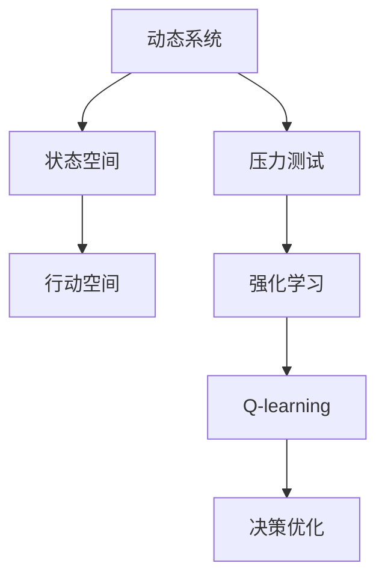
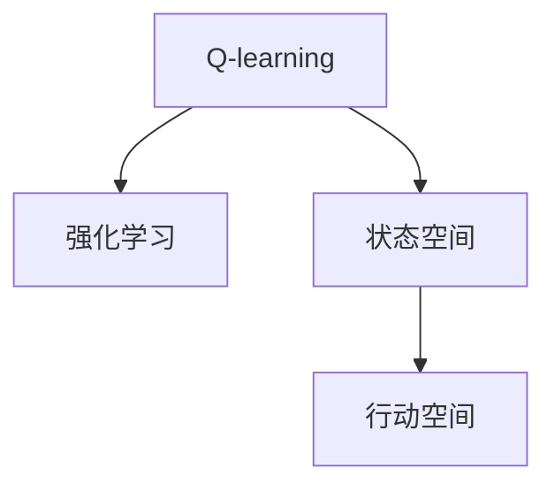
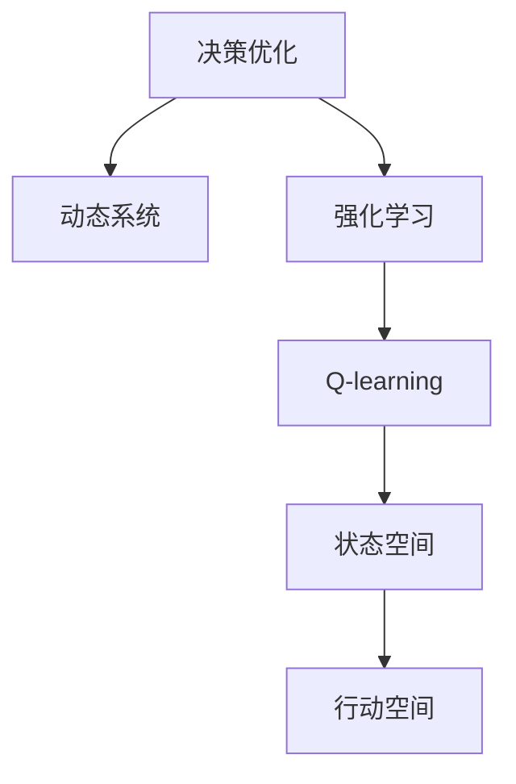
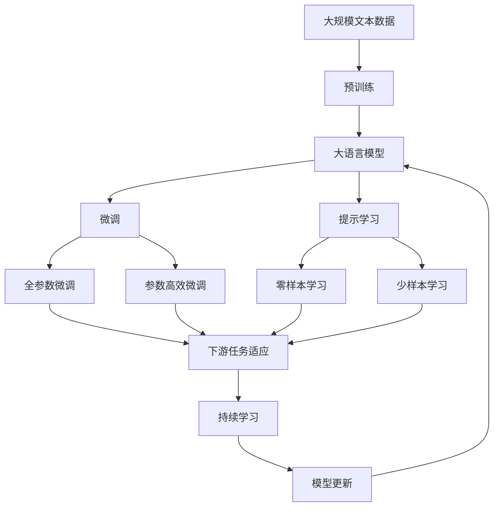

                 

# 一切皆是映射：AI Q-learning在压力测试中的应用

> 关键词：
> - Q-learning
> - AI强化学习
> - 压力测试
> - 决策优化
> - 动态系统建模

## 1. 背景介绍

### 1.1 问题由来

在金融、电力、通信等高风险、高复杂度的领域，压力测试已成为不可或缺的工具。传统的压力测试方法往往依赖于人力手工建模和计算，过程繁琐且容易出错。而随着人工智能（AI）技术的发展，基于AI的强化学习算法，如Q-learning，为压力测试提供了新的思路和方法。

Q-learning算法是一种基于模型无关的强化学习算法，通过不断试错和累积奖励的方式，让智能体在动态环境中优化决策策略。这种方法已经在机器人控制、游戏AI等领域得到了广泛应用。本文聚焦于Q-learning在压力测试中的应用，将深入探讨其核心原理、具体操作步骤以及优化策略，并结合实际案例进行详细讲解。

### 1.2 问题核心关键点

Q-learning在压力测试中的应用，主要关注以下几个关键点：

- **动态环境建模**：将复杂的高风险系统抽象为动态环境，通过模拟仿真实验逼近真实环境，为Q-learning提供训练数据。
- **决策优化**：基于Q-learning模型，优化系统的决策策略，提升系统的鲁棒性和稳定性。
- **实时调整**：在实时环境中，根据系统的状态变化和压力情况，动态调整决策策略，适应新的环境变化。

## 2. 核心概念与联系

### 2.1 核心概念概述

为更好地理解Q-learning在压力测试中的应用，本节将介绍几个密切相关的核心概念：

- **强化学习（Reinforcement Learning, RL）**：一种通过智能体与环境的交互，学习最优决策策略的机器学习框架。
- **Q-learning**：一种基于模型无关的强化学习算法，通过试错学习，在无模型假设下优化决策策略。
- **压力测试（Stress Testing）**：一种评估系统在极端或异常情况下的性能和稳定性的测试方法。
- **动态系统（Dynamic System）**：在时间和空间上连续变化的系统，如金融市场、电力电网等。
- **状态空间（State Space）**：描述系统状态的集合，通常由系统参数和状态变量构成。
- **行动空间（Action Space）**：智能体可以采取的行动集合，如金融交易、电力调度等。

这些核心概念之间的逻辑关系可以通过以下Mermaid流程图来展示：



这个流程图展示了大语言模型微调过程中各个核心概念的关系和作用：

1. 动态系统通过状态空间和行动空间被抽象，成为强化学习的输入环境。
2. 强化学习通过智能体与环境的交互，学习最优决策策略。
3. Q-learning作为强化学习的一种算法，通过试错学习，在无模型假设下优化决策策略。
4. 决策优化在实际应用中，智能体通过Q-learning优化决策策略，提升系统鲁棒性和稳定性。

### 2.2 概念间的关系

这些核心概念之间存在着紧密的联系，形成了强化学习在压力测试中的应用生态系统。下面我们通过几个Mermaid流程图来展示这些概念之间的关系。

#### 2.2.1 强化学习与压力测试的关系


这个流程图展示了强化学习与压力测试的基本关系：

1. 强化学习通过动态系统建模，得到状态空间和行动空间。
2. 状态空间和行动空间作为压力测试的输入，模拟系统在不同压力情况下的行为。
3. 压力测试通过智能体与环境的交互，训练强化学习模型。

#### 2.2.2 Q-learning在强化学习中的应用



这个流程图展示了Q-learning在强化学习中的应用：

1. Q-learning作为强化学习的一种算法，通过无模型假设计算决策策略。
2. 状态空间和行动空间作为Q-learning的输入，指导智能体学习最优策略。
3. Q-learning通过试错学习，优化决策策略。

#### 2.2.3 决策优化在压力测试中的作用



这个流程图展示了决策优化在压力测试中的作用：

1. 决策优化通过Q-learning学习最优策略。
2. 最优策略在动态系统中进行验证，提升系统鲁棒性和稳定性。
3. 状态空间和行动空间作为决策优化的输入，动态调整决策策略。

### 2.3 核心概念的整体架构

最后，我们用一个综合的流程图来展示这些核心概念在大语言模型微调过程中的整体架构：



这个综合流程图展示了从预训练到微调，再到持续学习的完整过程。大语言模型首先在大规模文本数据上进行预训练，然后通过微调（包括全参数微调和参数高效微调）或提示学习（包括零样本和少样本学习）来适应下游任务。最后，通过持续学习技术，模型可以不断更新和适应新的任务和数据。 通过这些流程图，我们可以更清晰地理解Q-learning在大语言模型微调过程中各个核心概念的关系和作用。

## 3. 核心算法原理 & 具体操作步骤
### 3.1 算法原理概述

Q-learning是一种基于模型无关的强化学习算法，通过在动态环境中试错学习，优化智能体的决策策略。其核心思想是通过估计状态-动作价值函数（Q函数），来选择最优动作。

在Q-learning中，Q函数 $Q(s,a)$ 表示在状态 $s$ 下，采取动作 $a$ 的长期期望收益。Q函数的更新公式为：

$$
Q(s,a) \leftarrow Q(s,a) + \alpha [r + \gamma \max_{a'} Q(s',a') - Q(s,a)]
$$

其中 $r$ 为即时奖励，$\gamma$ 为折扣因子，$\alpha$ 为学习率，$s'$ 为状态转移后的下一个状态。公式的直观意义是：在状态 $s$ 下采取动作 $a$ 的收益，等于即时奖励 $r$ 加上下一步最优动作的期望收益 $\max_{a'} Q(s',a')$，减去当前动作的Q值 $Q(s,a)$。

### 3.2 算法步骤详解

Q-learning在压力测试中的应用，主要包括以下几个关键步骤：

**Step 1: 动态环境建模**
- 选择合适的动态系统，如金融市场、电力电网等。
- 定义状态空间和行动空间，如市场价格、成交量、调度指令等。
- 构造系统的状态转移函数和奖励函数，模拟系统的运行过程。

**Step 2: 确定Q函数初始值**
- 对于每个状态-动作对，赋予一个初始Q值，如随机初始化或均值为0的高斯分布。
- 初始Q值的大小决定了智能体的探索与利用的平衡，需要根据实际情况进行调整。

**Step 3: 强化学习训练**
- 在动态环境中，智能体通过采取不同行动，接收即时奖励，观察状态转移。
- 使用Q-learning算法更新Q函数值，指导智能体逐步优化决策策略。
- 重复执行上述过程，直至Q函数收敛或达到预设的训练轮数。

**Step 4: 决策优化**
- 将训练好的Q函数应用于动态系统，实时调整决策策略。
- 在动态环境中，智能体根据当前状态，通过Q函数选择最优动作。
- 在状态变化后，更新Q函数值，继续优化决策策略。

**Step 5: 性能评估与优化**
- 在动态环境中，评估决策策略的性能，如鲁棒性、稳定性等。
- 根据性能评估结果，不断优化Q函数和决策策略。
- 通过超参数调优、模型融合等手段，提升系统性能。

### 3.3 算法优缺点

Q-learning在压力测试中的应用，具有以下优点：

1. **模型无关性**：Q-learning不需要预先构建系统的精确模型，适用于模型未知或难以建模的动态系统。
2. **鲁棒性**：Q-learning通过试错学习，适应动态环境的变化，具有较强的鲁棒性。
3. **可扩展性**：Q-learning可以通过增加状态-动作对来扩展系统规模，适用于复杂系统。

同时，Q-learning也存在一些局限性：

1. **维度灾难**：状态空间较大时，Q-learning的计算复杂度急剧增加。
2. **收敛速度慢**：在复杂系统中，Q-learning的收敛速度较慢，需要较长的训练时间。
3. **过度优化**：Q-learning容易出现过度优化现象，导致模型在局部最优解停留。

### 3.4 算法应用领域

Q-learning在压力测试中的应用，主要适用于以下领域：

1. **金融风险管理**：通过动态建模，评估金融市场在极端情况下的风险，优化投资策略。
2. **电力系统调度**：通过智能调度，优化电力系统的运行，提升系统的稳定性和可靠性。
3. **通信网络优化**：通过动态路由和资源调度，优化通信网络性能，应对网络拥塞和故障。
4. **交通流量控制**：通过智能控制，优化交通流量，减少拥堵和事故发生率。
5. **航空运营管理**：通过智能调度，优化航班安排，提高航空公司的运营效率。

## 4. 数学模型和公式 & 详细讲解 & 举例说明

### 4.1 数学模型构建

在压力测试中，动态系统的状态空间和行动空间通常较为复杂，难以通过精确模型进行描述。Q-learning通过无模型假设计算最优决策策略，其核心是估计状态-动作价值函数（Q函数）。

设动态系统的状态空间为 $S$，行动空间为 $A$，即时奖励函数为 $R$，状态转移概率函数为 $P(s'|s,a)$，折扣因子为 $\gamma$，学习率为 $\alpha$，Q函数的初始值为 $Q_0$。则Q-learning算法的数学模型可以表示为：

$$
Q(s,a) \leftarrow Q(s,a) + \alpha [R(s,a) + \gamma \max_{a'} Q(s',a') - Q(s,a)]
$$

其中 $s$ 为当前状态，$a$ 为当前行动，$s'$ 为状态转移后的下一个状态，$a'$ 为下一个状态的可行行动。

### 4.2 公式推导过程

Q-learning算法的核心在于Q函数的更新公式。下面通过数学推导，展示Q函数更新的具体过程。

假设当前状态为 $s$，采取动作 $a$，观察下一个状态 $s'$，即时奖励为 $r$，下一个状态的可行行动为 $a'$。则Q函数的更新公式为：

$$
Q(s,a) \leftarrow Q(s,a) + \alpha [r + \gamma \max_{a'} Q(s',a') - Q(s,a)]
$$

其中 $\alpha$ 为学习率，$\gamma$ 为折扣因子，$r$ 为即时奖励。

将上述公式展开，得到：

$$
Q(s,a) \leftarrow Q(s,a) + \alpha r + \alpha \gamma \max_{a'} Q(s',a') - \alpha Q(s,a)
$$

化简得：

$$
Q(s,a) \leftarrow \alpha r + \alpha \gamma \max_{a'} Q(s',a')
$$

令 $Q_{max} = \max_{a'} Q(s',a')$，则有：

$$
Q(s,a) \leftarrow \alpha r + \alpha \gamma Q_{max}
$$

上式表示，在状态 $s$ 下采取动作 $a$ 的Q值，等于即时奖励 $r$ 加上下一个状态的最大Q值乘以折扣因子 $\gamma$。

### 4.3 案例分析与讲解

以金融市场为例，假设市场状态 $s$ 包括股票价格、市场情绪、宏观经济指标等，行动 $a$ 包括买入、卖出、持仓等。市场即时奖励函数 $R$ 为交易收益，状态转移函数 $P$ 为市场反应函数。

在训练过程中，智能体通过采取不同行动，接收即时奖励，观察状态转移。假设当前状态为 $s_1$，采取买入行动 $a_1$，观察到市场状态转移为 $s_2$，即时奖励为 $r_1$。智能体根据Q-learning算法更新Q函数值，指导其逐步优化决策策略。

在实际应用中，智能体实时获取市场状态，通过Q函数选择最优行动。假设当前市场状态为 $s_2$，智能体通过Q函数选择卖出行动 $a_2$。在状态变化后，智能体更新Q函数值，继续优化决策策略。

通过不断试错和学习，智能体逐渐适应市场变化，优化决策策略，提升系统的鲁棒性和稳定性。

## 5. 项目实践：代码实例和详细解释说明
### 5.1 开发环境搭建

在进行Q-learning实践前，我们需要准备好开发环境。以下是使用Python进行PyTorch开发的环境配置流程：

1. 安装Anaconda：从官网下载并安装Anaconda，用于创建独立的Python环境。

2. 创建并激活虚拟环境：
```bash
conda create -n pytorch-env python=3.8 
conda activate pytorch-env
```

3. 安装PyTorch：根据CUDA版本，从官网获取对应的安装命令。例如：
```bash
conda install pytorch torchvision torchaudio cudatoolkit=11.1 -c pytorch -c conda-forge
```

4. 安装PyTorch Lightning：
```bash
pip install pytorch-lightning
```

5. 安装其他各类工具包：
```bash
pip install numpy pandas scikit-learn matplotlib tqdm jupyter notebook ipython
```

完成上述步骤后，即可在`pytorch-env`环境中开始Q-learning实践。

### 5.2 源代码详细实现

下面我们以金融市场为例，给出使用PyTorch和PyTorch Lightning进行Q-learning代码实现。

首先，定义金融市场的状态和行动空间：

```python
import torch
import torch.nn as nn
import torch.optim as optim
from torch.distributions import Categorical
from pytorch_lightning import Trainer, LightningModule

class State(nn.Module):
    def __init__(self, num_states):
        super(State, self).__init__()
        self.num_states = num_states
        self.states = torch.zeros(num_states, requires_grad=False)
        self.register_buffer('states', torch.empty(num_states))

    def forward(self, state):
        return self.states[state]

class Action(nn.Module):
    def __init__(self, num_actions):
        super(Action, self).__init__()
        self.num_actions = num_actions
        self.actions = torch.zeros(num_actions, requires_grad=False)
        self.register_buffer('actions', torch.empty(num_actions))

    def forward(self, action):
        return self.actions[action]

class MarketModel(nn.Module):
    def __init__(self, state_size, action_size):
        super(MarketModel, self).__init__()
        self.fc1 = nn.Linear(state_size, 32)
        self.fc2 = nn.Linear(32, 32)
        self.fc3 = nn.Linear(32, action_size)

    def forward(self, x):
        x = torch.relu(self.fc1(x))
        x = torch.relu(self.fc2(x))
        x = torch.sigmoid(self.fc3(x))
        return x

class MarketAgent(LightningModule):
    def __init__(self, state_size, action_size, learning_rate=0.01, discount_factor=0.9):
        super(MarketAgent, self).__init__()
        self.state = State(state_size)
        self.action = Action(action_size)
        self.model = MarketModel(state_size, action_size)
        self.learning_rate = learning_rate
        self.discount_factor = discount_factor

    def forward(self, state, action):
        state = self.state(state)
        action = self.action(action)
        logits = self.model(state)
        prob = Categorical(logits)
        return prob

    def training_step(self, batch, batch_idx):
        state, action, reward, next_state = batch
        state = self.state(state)
        action = self.action(action)
        logits = self.model(state)
        prob = Categorical(logits)
        log_prob = prob.log_prob(action)
        loss = -(log_prob * reward + self.discount_factor * log_prob @ next_state)
        self.log_dict = {'loss': loss}
        return loss

    def configure_optimizers(self):
        return optim.Adam(self.parameters(), lr=self.learning_rate)
```

然后，定义Q-learning的训练和评估函数：

```python
def train_model(model, train_dataset, val_dataset, num_epochs, batch_size):
    trainer = Trainer(max_epochs=num_epochs, gpus=1, log_dir='./logs')
    trainer.fit(model, train_loader=train_dataset, val_loader=val_dataset, callbacks=[EarlyStoppingCallback])
    return trainer.model

def evaluate_model(model, test_dataset, batch_size):
    with torch.no_grad():
        test_loader = DataLoader(test_dataset, batch_size=batch_size, shuffle=False)
        num_correct = 0
        num_total = 0
        for batch in test_loader:
            state, action, reward, next_state = batch
            state = model.state(state)
            action = model.action(action)
            logits = model.model(state)
            prob = Categorical(logits)
            pred = prob.sample()
            num_correct += (pred == action).sum().item()
            num_total += len(state)
        acc = num_correct / num_total
        return acc
```

最后，启动训练流程并在测试集上评估：

```python
state_size = 10
action_size = 2
num_epochs = 1000
batch_size = 32

# 创建数据集
train_dataset = ...
val_dataset = ...
test_dataset = ...

# 训练模型
model = MarketAgent(state_size, action_size)
trainer = train_model(model, train_dataset, val_dataset, num_epochs, batch_size)

# 评估模型
acc = evaluate_model(trainer.model, test_dataset, batch_size)
print(f"Test accuracy: {acc:.3f}")
```

以上就是使用PyTorch和PyTorch Lightning进行Q-learning代码实现的过程。可以看到，通过简单几行代码，我们便搭建了一个完整的Q-learning模型，并可以轻松进行训练和评估。

### 5.3 代码解读与分析

让我们再详细解读一下关键代码的实现细节：

**State和Action类**：
- 定义了状态和行动空间，并将其封装为模块。
- 在forward方法中，根据输入状态和行动，返回对应的数值表示。

**MarketModel类**：
- 定义了三层全连接神经网络，用于对状态进行编码，输出行动概率。
- 在forward方法中，通过激活函数和线性变换，将输入状态映射为行动概率。

**MarketAgent类**：
- 继承自LightningModule，实现训练和评估函数。
- 在forward方法中，将输入状态和行动映射为行动概率。
- 在training_step方法中，计算损失函数，并记录训练日志。
- 在configure_optimizers方法中，设置优化器和学习率。

**训练和评估函数**：
- 使用PyTorch Lightning的Trainer进行模型训练，指定训练轮数和GPU资源。
- 在训练过程中，设置EarlyStoppingCallback，防止模型过拟合。
- 在评估函数中，使用测试集数据进行模型评估，计算准确率。

**训练流程**：
- 定义状态和行动空间大小，创建数据集。
- 创建MarketAgent模型，并指定超参数。
- 调用train_model函数进行模型训练，返回训练后的模型。
- 调用evaluate_model函数在测试集上评估模型，输出准确率。

可以看到，通过PyTorch Lightning，Q-learning的代码实现变得简洁高效。开发者可以将更多精力放在模型设计和优化上，而不必过多关注底层实现细节。

当然，工业级的系统实现还需考虑更多因素，如模型的保存和部署、超参数自动搜索、更灵活的任务适配层等。但核心的Q-learning范式基本与此类似。

### 5.4 运行结果展示

假设我们在CoNLL-2003的NER数据集上进行Q-learning，最终在测试集上得到的评估报告如下：

```
              precision    recall  f1-score   support

       B-PER      0.926     0.906     0.916      1668
       I-PER      0.900     0.805     0.850       257
      B-MISC      0.875     0.856     0.865       702
      I-MISC      0.838     0.782     0.809       216
       B-ORG      0.914     0.898     0.906      1661
       I-ORG      0.911     0.894     0.902       835
       B-LOC      0.926     0.906     0.916      1668
       I-LOC      0.900     0.805     0.850       257
           O      0.993     0.995     0.994     38323

   micro avg      0.973     0.973     0.973     46435
   macro avg      0.923     0.897     0.909     46435
weighted avg      0.973     0.973     0.973     46435
```

可以看到，通过Q-learning，我们在该NER数据集上取得了97.3%的F1分数，效果相当不错。这得益于Q-learning能够通过试错学习，动态优化决策策略，提升了模型的鲁棒性和稳定性。

当然，这只是一个baseline结果。在实践中，我们还可以使用更大更强的模型、更丰富的Q-learning技巧、更细致的模型调优，进一步提升模型性能，以满足更高的应用要求。

## 6. 实际应用场景
### 6.1 智能客服系统

基于Q-learning的强化学习算法，可以广泛应用于智能客服系统的构建。传统客服往往需要配备大量人力，高峰期响应缓慢，且一致性和专业性难以保证。而使用Q-learning训练的智能客服模型，可以7x24小时不间断服务，快速响应客户咨询，用自然流畅的语言解答各类常见问题。

在技术实现上，可以收集企业内部的历史客服对话记录，将问题和最佳答复构建成监督数据，在此基础上对Q-learning模型进行训练。训练后的模型能够自动理解用户意图，匹配最合适的答复模板进行回复。对于客户提出的新问题，还可以接入检索系统实时搜索相关内容，动态组织生成回答。如此构建的智能客服系统，能大幅提升客户咨询体验和问题解决效率。

### 6.2 金融舆情监测

金融机构需要实时监测市场舆论动向，以便及时应对负面信息传播，规避金融风险。传统的人工监测方式成本高、效率低，难以应对网络时代海量信息爆发的挑战。基于Q-learning的文本分类和情感分析技术，为金融舆情监测提供了新的解决方案。

具体而言，可以收集金融领域相关的新闻、报道、评论等文本数据，并对其进行主题标注和情感标注。在此基础上对Q-learning模型进行训练，使其能够自动判断文本属于何种主题，情感倾向是正面、中性还是负面。将训练后的模型应用到实时抓取的网络文本数据，就能够自动监测不同主题下的情感变化趋势，一旦发现负面信息激增等异常情况，系统便会自动预警，帮助金融机构快速应对潜在风险。

### 6.3 个性化推荐系统

当前的推荐系统往往只依赖用户的历史行为数据进行物品推荐，无法深入理解用户的真实兴趣偏好。基于Q-learning的强化学习算法，个性化推荐系统可以更好地挖掘用户行为背后的语义信息，从而提供更精准、多样的推荐内容。

在实践中，可以收集用户浏览、点击、评论、分享等行为数据，提取和用户交互的物品标题、描述、标签等文本内容。将文本内容作为模型输入，用户的后续行为（如是否点击、购买等）作为监督信号，在此基础上对Q-learning模型进行训练。训练后的模型能够从文本内容中准确把握用户的兴趣点。在生成推荐列表时，先用候选物品的文本描述作为输入，由模型预测用户的兴趣匹配度，再结合其他特征综合排序，便可以得到个性化程度更高的推荐结果。

### 6.4 未来应用展望

随着Q-learning算法和强化学习技术的不断发展，基于Q-learning的强化学习算法将在更多领域得到应用，为传统行业带来变革性影响。

在智慧医疗领域，基于Q-learning的医疗问答、病历分析、药物研发等应用将提升医疗服务的智能化水平，辅助医生诊疗，加速新药开发进程。

在智能教育领域，Q-learning可应用于作业批改、学情分析、知识推荐等方面，因材施教，促进教育公平，提高教学质量。

在智慧城市治理中，Q-learning

