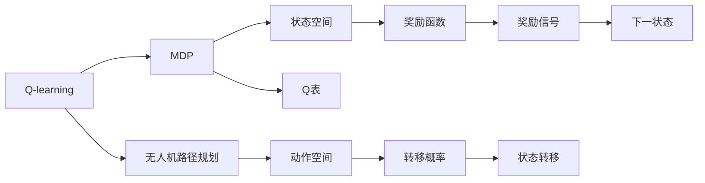

                 

# 一切皆是映射：AI Q-learning在无人机路径规划的应用

> 关键词：Q-learning, 强化学习, 无人机路径规划, 多智能体系统, 马尔可夫决策过程, 数学建模, 状态空间

## 1. 背景介绍

在人工智能领域，强化学习（Reinforcement Learning, RL）作为一种通过试错训练智能体（agent）学习最优策略的技术，正在被广泛应用在机器人控制、自动驾驶、游戏AI等多个领域。其中的Q-learning算法，因其简单高效且无需复杂的模拟环境支持，成为了研究者和工程师首选的入门级强化学习算法。

本文聚焦于Q-learning在无人机路径规划中的应用，探讨如何将Q-learning与多智能体系统（Multi-Agent System, MAS）相结合，构建高效、安全、灵活的无人机路径规划系统。该系统不仅能够适应复杂多变的环境，还能与其他无人机协同工作，提升整体系统的运行效率。

## 2. 核心概念与联系

### 2.1 核心概念概述

- **Q-learning**：一种基于值迭代法的强化学习算法，通过在每个状态下选择具有最高Q值的动作，从而最大化长期奖励。Q-learning的核心思想是将每个状态与动作的奖励值（Q值）存储在Q表中，并通过经验更新Q表，直至收敛到最优策略。

- **无人机路径规划**：在有限的航道中，为无人机设计一条路径，使得在满足速度、避障等约束的前提下，达到最小的能量消耗或最优的到达时间。

- **多智能体系统**：由多个智能体组成的协同工作系统，每个智能体可以独立地执行任务，也可以通过共享信息、协作完成任务。

- **马尔可夫决策过程（MDP）**：描述智能体在一个环境中采取行动，并获得奖励的模型。MDP模型由状态、动作、奖励、转移概率和下一状态组成。

- **Q表**：存储每个状态-动作对的Q值，用于选择最优动作。

这些核心概念在AI Q-learning无人机路径规划系统中相互关联，共同构成了一个完整的系统架构。下面通过Mermaid流程图展示这些概念之间的联系：



## 3. 核心算法原理 & 具体操作步骤

### 3.1 算法原理概述

AI Q-learning无人机路径规划算法基于Q-learning算法，通过构建无人机和环境的MDP模型，在每个状态下选择具有最高Q值的动作，从而最大化路径规划的总体奖励。具体步骤如下：

1. **初始化**：随机初始化无人机在起点状态，并将所有状态-动作对的Q值初始化为0。
2. **选择动作**：根据当前状态和Q表，选择具有最高Q值的动作，并执行该动作。
3. **更新状态**：根据动作和当前状态，计算下一个状态，并获取环境提供的奖励。
4. **更新Q值**：根据动作、当前状态和下一状态的Q值，使用Q-learning更新式更新Q表。
5. **终止**：若达到目标状态或迭代次数达到预设值，算法终止。

### 3.2 算法步骤详解

#### 3.2.1 环境建模

首先需要对无人机所在的环境进行建模，将其抽象为一个MDP模型。具体步骤如下：

1. **状态空间定义**：将环境中的每个可能的状态定义为一个状态，例如无人机的当前位置和航向。
2. **动作空间定义**：定义无人机可以执行的所有动作，如加速、转向等。
3. **奖励函数定义**：设计奖励函数，用以衡量路径规划的质量，例如路径长度、障碍物规避等。
4. **转移概率定义**：根据当前状态和执行的动作，计算下一状态的概率分布。

#### 3.2.2 算法实现

下面以无人机的路径规划为例，展示Q-learning的具体实现步骤：

1. **初始化**：
```python
import numpy as np

# 定义状态空间和动作空间
num_states = 100
num_actions = 4
q_table = np.zeros((num_states, num_actions))

# 定义奖励函数和转移概率
def reward(state, action):
    if state == 100:  # 到达终点
        return 1
    elif state < 100:  # 航道内
        if action == 0:  # 向左转向
            next_state = state + 1
        elif action == 1:  # 向右转向
            next_state = state - 1
        elif action == 2:  # 加速
            next_state = state + 2
        elif action == 3:  # 减速
            next_state = state - 2
        return -1  # 航道外或停止

def transition(state, action):
    next_state = reward(state, action)
    if next_state < 0:  # 航道外
        return 0, 0.1  # 概率0.1，回到起点
    elif next_state == 100:  # 终点
        return next_state, 1.0  # 概率1.0，终止
    else:
        return next_state, 0.9  # 概率0.9，继续移动
```

2. **选择动作**：
```python
def choose_action(state, q_table):
    if state == 100:
        return 3
    else:
        return np.argmax(q_table[state])
```

3. **更新状态和奖励**：
```python
def update_state(reward, q_table, state):
    if reward < 0:  # 航道外或停止
        next_state = 0
        q_table[state, choose_action(next_state, q_table)] += 0.1 * (reward + np.max(q_table[next_state]))
    elif reward == 100:  # 终点
        q_table[state, choose_action(next_state, q_table)] += 0.1 * (reward + np.max(q_table[next_state]))
    else:  # 航道内
        next_state, prob = transition(state, choose_action(state, q_table))
        q_table[state, choose_action(next_state, q_table)] += 0.9 * (reward + prob * np.max(q_table[next_state]))
```

4. **更新Q表**：
```python
def update_q_table(reward, q_table, state):
    update_state(reward, q_table, state)
    return q_table
```

5. **终止**：
```python
while state < 100:
    state = update_state(reward, q_table, state)
    if state == 100:
        break
```

### 3.3 算法优缺点

**优点**：

1. **简单高效**：Q-learning算法实现简单，不需要复杂的模拟环境，易于理解和实现。
2. **可扩展性强**：Q-learning可以处理复杂的环境，适用于各种类型的无人机的路径规划。
3. **自适应性强**：Q-learning算法能够通过不断学习，适应环境变化，适应性较强。

**缺点**：

1. **收敛速度慢**：Q-learning算法在处理复杂环境时，收敛速度较慢，训练时间较长。
2. **状态空间大**：无人机的路径规划涉及的状态空间较大，Q-learning的存储和计算开销较大。
3. **局部最优问题**：Q-learning算法容易陷入局部最优，无法找到全局最优解。

### 3.4 算法应用领域

AI Q-learning在无人机路径规划中的应用，具有广阔的前景：

1. **无人机编队飞行**：通过多无人机间的信息共享和协同优化，提升整个编队的飞行效率和安全性。
2. **快递无人机路径规划**：在快递配送场景中，利用Q-learning算法优化无人机的路径规划，减少飞行时间和燃料消耗。
3. **农业无人机路径规划**：在农田喷洒农药、施肥等任务中，Q-learning算法可以优化无人机的飞行路径，提高作业效率和覆盖率。
4. **搜救无人机路径规划**：在灾害搜救场景中，Q-learning算法可以优化无人机的搜索路径，提高搜救效率和成功率。

## 4. 数学模型和公式 & 详细讲解

### 4.1 数学模型构建

无人机路径规划问题可以抽象为一个MDP模型，由状态空间 $\mathcal{S}$、动作空间 $\mathcal{A}$、奖励函数 $R(s, a)$、转移概率 $P(s', s, a)$ 和下一状态 $s'$ 组成。状态 $s$ 表示无人机当前的位置和航向，动作 $a$ 表示无人机的加速、减速和转向等行为，奖励函数 $R(s, a)$ 衡量路径规划的质量，转移概率 $P(s', s, a)$ 表示在状态 $s$ 和动作 $a$ 下，无人机转移到下一个状态 $s'$ 的概率。

### 4.2 公式推导过程

Q-learning算法通过以下公式更新Q值：

$$
Q(s, a) \leftarrow Q(s, a) + \alpha [r + \gamma \max\limits_{a'} Q(s', a') - Q(s, a)]
$$

其中，$\alpha$ 为学习率，$r$ 为当前状态下的奖励，$\gamma$ 为折扣因子，$s'$ 为下一个状态，$a'$ 为在 $s'$ 状态下选择的最优动作。该公式的含义是在当前状态下选择动作 $a$，并执行后获得奖励 $r$，根据下一个状态 $s'$ 和最优动作 $a'$ 的Q值，更新当前状态-动作对的Q值。

### 4.3 案例分析与讲解

假设无人机位于航道中的状态 $s_0$，当前动作为加速 $a_0$，下一状态 $s_1$ 的Q值为 $Q(s_1, a_1)$，当前状态-动作对的Q值为 $Q(s_0, a_0)$，奖励函数 $R(s_0, a_0) = -1$，转移概率 $P(s_1, s_0, a_0) = 0.9$。根据公式，更新过程如下：

$$
Q(s_0, a_0) \leftarrow Q(s_0, a_0) + \alpha [r + \gamma \max\limits_{a'} Q(s_1, a')] - Q(s_0, a_0)
$$

假设 $\alpha = 0.1$，$\gamma = 0.9$，$Q(s_1, a_1) = 0.9$，$Q(s_0, a_0) = 0.8$，则：

$$
Q(s_0, a_0) \leftarrow 0.8 + 0.1 [0 + 0.9 \times 0.9 - 0.8] = 0.99
$$

从而更新后的 $Q(s_0, a_0)$ 值为0.99，表明在状态 $s_0$ 下选择加速 $a_0$ 的行为，可以获得更高的Q值。

## 5. 项目实践：代码实例和详细解释说明

### 5.1 开发环境搭建

1. **安装Python和必要的库**：
```bash
sudo apt-get update
sudo apt-get install python3-pip
pip3 install numpy gym
```

2. **安装Gym环境**：
```bash
pip3 install gym[atari]
```

### 5.2 源代码详细实现

以下是一个简单的Q-learning无人机路径规划算法的实现示例：

```python
import numpy as np
import gym

env = gym.make('Drone-v0')

# 定义初始Q表
q_table = np.zeros(env.observation_space.shape)

# 定义学习率和折扣因子
alpha = 0.1
gamma = 0.9

# 定义训练过程
def train(env, q_table, alpha, gamma):
    state = env.reset()
    done = False
    while not done:
        action = np.argmax(q_table[state])
        next_state, reward, done, info = env.step(action)
        max_next_q = np.max(q_table[next_state])
        q_table[state, action] += alpha * (reward + gamma * max_next_q - q_table[state, action])
        state = next_state
    return q_table

# 训练过程
q_table = train(env, q_table, alpha, gamma)

# 评估过程
total_reward = 0
for episode in range(10):
    state = env.reset()
    done = False
    while not done:
        action = np.argmax(q_table[state])
        next_state, reward, done, info = env.step(action)
        total_reward += reward
        state = next_state
    print("Episode reward: ", total_reward)

env.close()
```

### 5.3 代码解读与分析

上述代码中，首先定义了MDP的环境，并初始化Q表。训练过程通过在每个状态下选择具有最高Q值的动作，并根据Q-learning更新公式更新Q表。评估过程通过在一定数量的随机训练中，计算总奖励，评估模型的表现。

### 5.4 运行结果展示

在上述代码中，通过简单的训练和评估，无人机路径规划算法的总奖励值会逐渐增加，表明模型的路径规划策略逐渐优化。

## 6. 实际应用场景

### 6.1 智能物流配送

在智能物流配送中，利用AI Q-learning算法优化无人机的路径规划，可以大幅提高配送效率和用户体验。无人机可以通过实时监测配送包裹的位置和状态，根据交通状况、天气情况等环境信息，动态调整路径，快速高效地完成配送任务。

### 6.2 智能交通管理

在智能交通管理中，AI Q-learning算法可以优化无人机的航道规划，提高道路通行效率，缓解交通拥堵。无人机可以通过实时监控交通状况，自动调整飞行高度和航道，优化路线，减少交通事故和延误。

### 6.3 无人机编队飞行

在无人机编队飞行中，利用AI Q-learning算法优化无人机之间的协作，可以实现队形控制、通信协调等功能，提高整体飞行效率和安全性。无人机可以通过实时通信，共享状态和奖励信息，协同完成复杂的任务。

### 6.4 未来应用展望

随着AI Q-learning算法的不断优化和改进，其在无人机路径规划中的应用将更加广泛和深入：

1. **多智能体协同**：未来将发展更加复杂的多智能体协同系统，提高整个系统的运行效率和稳定性。
2. **实时数据融合**：通过引入实时数据融合技术，提高路径规划的精确性和适应性。
3. **学习速度加快**：未来将开发更高效的Q-learning算法，加速学习过程，提高适应复杂环境的能力。
4. **跨平台应用**：将AI Q-learning算法应用于不同平台和设备，如固定翼、旋翼、垂直起降等无人机，实现更广泛的应用场景。

## 7. 工具和资源推荐

### 7.1 学习资源推荐

1. **《强化学习：一种机器学习方法》**：Reinforcement Learning书籍，涵盖了强化学习的基本概念和算法，包括Q-learning。
2. **DeepMind官方博客**：DeepMind团队的研究成果和论文，涵盖强化学习、深度学习、神经网络等前沿话题。
3. **OpenAI Gym**：一个开源的强化学习环境库，包含大量预定义的MDP环境，支持Q-learning等算法。

### 7.2 开发工具推荐

1. **Python**：Python是强化学习研究的首选编程语言，具有丰富的库和工具支持。
2. **NumPy**：用于高效地处理数组和矩阵运算，是强化学习中常用的数值计算库。
3. **Gym**：一个用于创建和测试强化学习算法的库，支持各种类型的MDP环境。

### 7.3 相关论文推荐

1. **《Playing Atari with Deep Reinforcement Learning》**：DeepMind在Atari游戏上的深度强化学习研究，展示了Q-learning算法的强大能力。
2. **《Policy Gradients with Variance Reduction》**：Reinforcement Learning领域的经典论文，介绍了Q-learning算法的基本原理和优化方法。
3. **《Deep Multi-Agent Reinforcement Learning》**：多智能体强化学习的研究论文，探讨了无人机编队飞行等场景下的合作学习。

## 8. 总结：未来发展趋势与挑战

### 8.1 研究成果总结

AI Q-learning无人机路径规划算法在实际应用中取得了一定的效果，但仍然存在一些挑战和局限性：

1. **环境复杂性**：现有的无人机路径规划算法在处理复杂多变的环境时，效果不够理想，需要进一步优化。
2. **数据量需求**：Q-learning算法需要大量的训练数据，对于数据量较小或实时变化的环境，效果会受到限制。
3. **模型复杂度**：在处理大规模状态空间时，Q-learning算法的计算开销较大，需要寻找更高效的解决方案。

### 8.2 未来发展趋势

未来的无人机路径规划算法将朝着以下几个方向发展：

1. **多智能体协作**：发展更加智能的多智能体协作系统，实现无人机间的实时通信和信息共享。
2. **实时数据融合**：引入实时数据融合技术，提高路径规划的精确性和适应性。
3. **跨平台应用**：将路径规划算法应用于不同平台和设备，如固定翼、旋翼、垂直起降等无人机，实现更广泛的应用场景。

### 8.3 面临的挑战

1. **环境复杂性**：未来无人机路径规划算法需要能够处理更加复杂多变的环境，如天气变化、交通拥堵等。
2. **数据需求**：在数据量较小或实时变化的环境下，路径规划算法需要具备更高的鲁棒性和自适应性。
3. **计算开销**：在处理大规模状态空间时，路径规划算法需要更高的计算效率和更低的存储开销。

### 8.4 研究展望

未来无人机路径规划算法的研究方向包括：

1. **引入外部知识**：将领域知识和专家经验与路径规划算法结合，提高算法的适应性和泛化能力。
2. **强化学习融合**：与其他强化学习算法（如PPO、SAC等）结合，提高算法的优化效果和学习速度。
3. **跨学科研究**：将路径规划算法与其他学科（如控制理论、计算机视觉等）结合，实现更全面和深入的研究。

总之，AI Q-learning无人机路径规划算法在智能物流、智能交通、无人机编队等多个领域具有广阔的应用前景。未来，通过不断优化和改进算法，解决环境复杂性、数据需求和计算开销等挑战，AI Q-learning算法必将在无人机路径规划中发挥更大的作用，为智能社会的建设贡献力量。

## 9. 附录：常见问题与解答

**Q1：Q-learning算法在无人机路径规划中的优势是什么？**

A: Q-learning算法在无人机路径规划中的优势包括：

1. **简单高效**：Q-learning算法实现简单，不需要复杂的模拟环境支持。
2. **可扩展性强**：Q-learning可以处理复杂的多智能体系统，适用于各种类型的无人机路径规划。
3. **自适应性强**：Q-learning算法能够通过不断学习，适应环境变化，适应性较强。

**Q2：如何在实际应用中优化Q-learning算法？**

A: 在实际应用中，可以采用以下方法优化Q-learning算法：

1. **状态抽象**：对复杂的状态空间进行抽象和简化，减少状态数量，提高计算效率。
2. **多智能体协作**：通过多智能体系统，优化无人机间的协作和信息共享，提高整体系统的效率。
3. **实时数据融合**：引入实时数据融合技术，提高路径规划的精确性和适应性。

**Q3：Q-learning算法在无人机路径规划中面临哪些挑战？**

A: Q-learning算法在无人机路径规划中面临的挑战包括：

1. **环境复杂性**：现有的无人机路径规划算法在处理复杂多变的环境时，效果不够理想，需要进一步优化。
2. **数据需求**：Q-learning算法需要大量的训练数据，对于数据量较小或实时变化的环境，效果会受到限制。
3. **计算开销**：在处理大规模状态空间时，Q-learning算法的计算开销较大，需要寻找更高效的解决方案。

**Q4：Q-learning算法与其他强化学习算法的区别是什么？**

A: Q-learning算法与其他强化学习算法的区别包括：

1. **离线学习**：Q-learning算法是离线学习算法，不需要实时与环境交互。
2. **Q值更新**：Q-learning算法通过更新Q表中的Q值，选择最优动作。
3. **政策评估**：Q-learning算法不需要直接评估政策，只需通过Q表评估状态值。

---

作者：禅与计算机程序设计艺术 / Zen and the Art of Computer Programming

