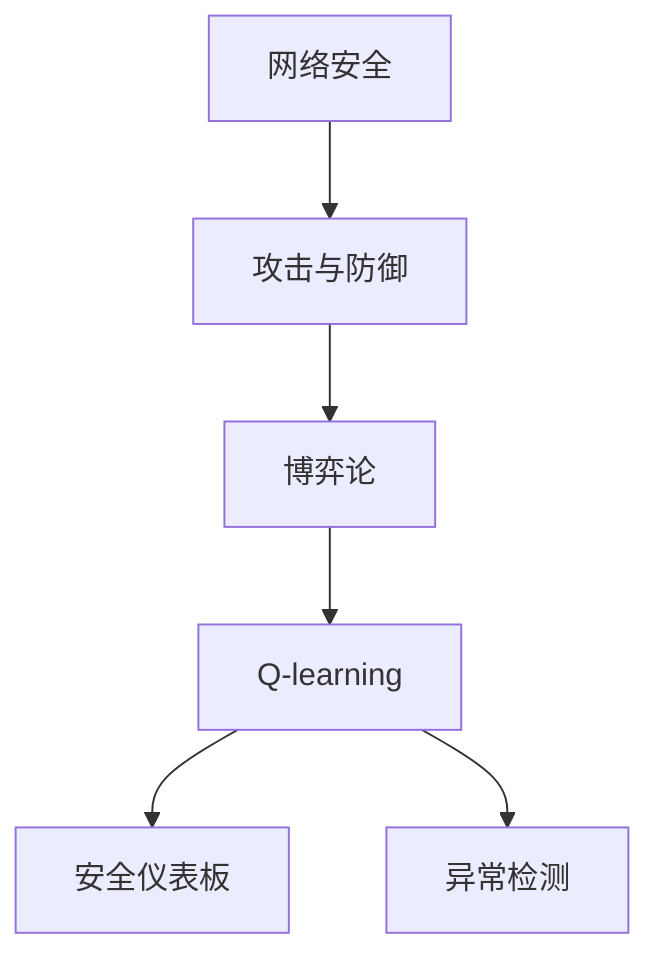
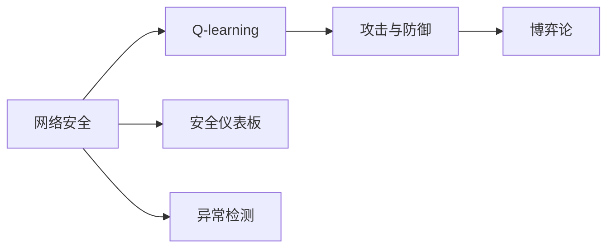
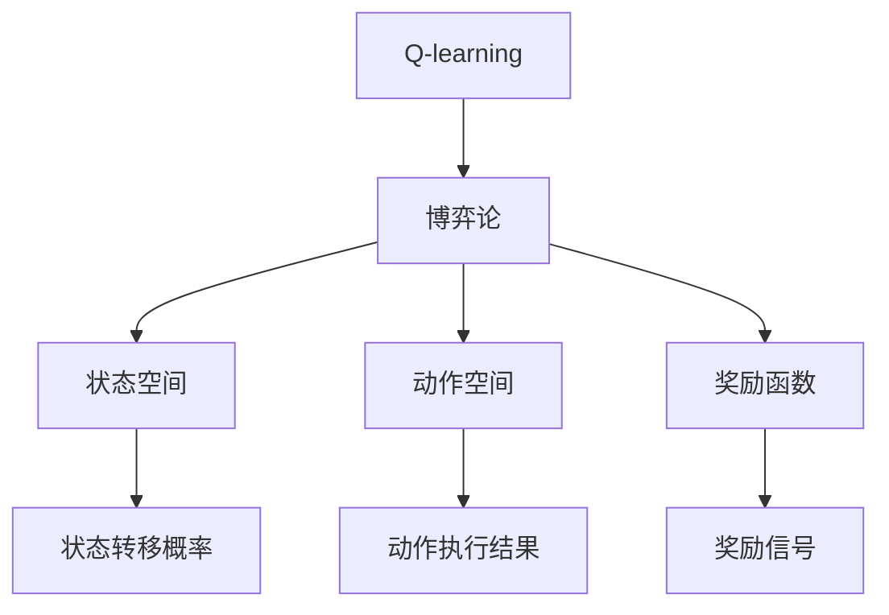
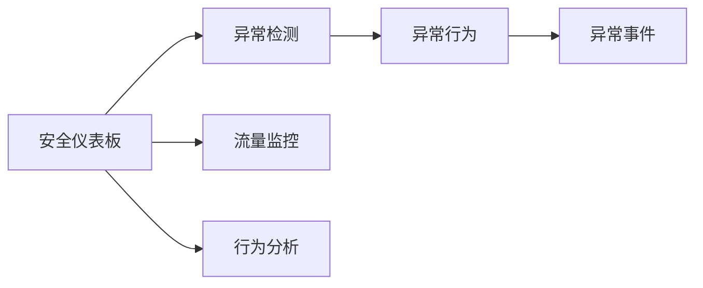
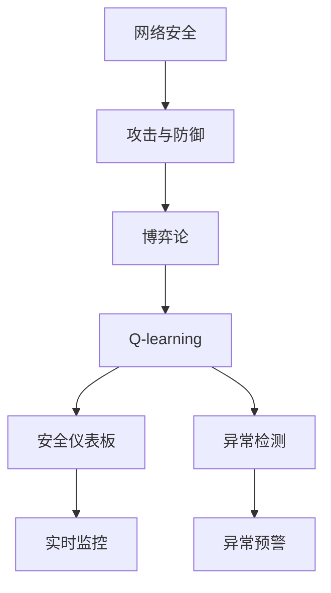

                 

# 一切皆是映射：AI Q-learning在网络安全中的实践

> 关键词：网络安全, Q-learning, 强化学习, 博弈论, 攻击与防御, 安全仪表板, 异常检测

## 1. 背景介绍

### 1.1 问题由来
随着网络空间的不断拓展，网络安全问题也日益复杂化。黑客攻击手段不断进化，防御措施需不断升级，这使得网络安全成为一个持续演进的动态过程。传统的网络安全防护系统往往以规则匹配和签名检测为主，难以有效应对未知威胁和新型的攻击技术。近年来，人工智能技术（如机器学习、深度学习、强化学习等）被广泛应用于网络安全领域，尤其是强化学习，通过构建智能化的网络防御系统，实时监控、检测和响应网络威胁，有效提升了网络安全防护水平。

### 1.2 问题核心关键点
Q-learning是一种基于值函数的强化学习方法，用于解决动态环境下的智能决策问题。在网络安全领域，Q-learning通过构建网络安全环境模型，模拟攻击和防御双方的动态博弈过程，学习最优的防御策略。核心在于：

- **模型建立**：构建网络安全环境的数学模型，定义状态空间、动作空间和奖励函数，描述攻击和防御行为。
- **策略优化**：在网络安全模型中，Q-learning通过不断调整网络防御策略，最大化期望收益。
- **性能评估**：通过Q值函数评估不同防御策略的效果，选择最优策略。

### 1.3 问题研究意义
研究AI Q-learning在网络安全中的应用，对于提升网络防御能力，预防和应对新型网络威胁，保护国家及企业的网络安全，具有重要意义：

1. **动态适应性**：网络环境不断变化，Q-learning能够实时调整防御策略，应对新出现的威胁。
2. **自学习能力**：通过不断学习和调整，Q-learning能够逐步积累经验和知识，提高防御能力。
3. **智能对抗**：Q-learning模型可以模拟攻防双方策略，发现攻击者的漏洞和弱点，提高防御效率。
4. **预警系统**：Q-learning可以在异常行为发生前，提前识别和预警，减少损失。
5. **防御自动化**：构建AI驱动的网络防御系统，减少人工干预，提升防御效率和准确性。

## 2. 核心概念与联系

### 2.1 核心概念概述

为更好地理解AI Q-learning在网络安全中的应用，本节将介绍几个密切相关的核心概念：

- **网络安全**：指保护网络系统的完整性、机密性和可用性，防止未经授权的访问和破坏。
- **Q-learning**：一种基于值函数的强化学习算法，通过奖励信号，学习最优的策略。
- **攻击与防御**：网络安全中的两个主要行为，攻击者试图突破防御系统，防御者则采取措施阻止攻击。
- **博弈论**：用于描述攻防双方策略和决策的理论框架，用于构建网络安全环境模型。
- **安全仪表板**：用于监控网络活动，检测异常行为的安全工具。
- **异常检测**：通过分析网络流量和行为，识别和预警异常事件。

这些核心概念之间的逻辑关系可以通过以下Mermaid流程图来展示：



这个流程图展示了几大核心概念之间的关系：

1. 网络安全包含攻击与防御行为。
2. 博弈论用于描述攻防行为，并构建安全环境模型。
3. Q-learning通过学习攻防博弈中的策略，实现智能防御。
4. 安全仪表板和异常检测用于监控和检测网络异常，辅助Q-learning模型提升防御效果。

### 2.2 概念间的关系

这些核心概念之间存在着紧密的联系，形成了网络安全中的Q-learning应用框架。下面我们通过几个Mermaid流程图来展示这些概念之间的关系。

#### 2.2.1 网络安全与Q-learning的关系



这个流程图展示了Q-learning在网络安全中的应用，以及网络安全环境中的其他要素。

#### 2.2.2 Q-learning与博弈论的关系



这个流程图展示了Q-learning和博弈论的基本构成，以及状态、动作、奖励和状态转移等要素。

#### 2.2.3 安全仪表板与异常检测的关系



这个流程图展示了安全仪表板和异常检测的基本功能，以及流量监控和行为分析等手段。

### 2.3 核心概念的整体架构

最后，我们用一个综合的流程图来展示这些核心概念在大语言模型微调过程中的整体架构：



这个综合流程图展示了从网络安全到Q-learning的整体流程，以及安全仪表板和异常检测等辅助手段的作用。通过这些环节的协同工作，可以有效提升网络安全防护水平。

## 3. 核心算法原理 & 具体操作步骤
### 3.1 算法原理概述

AI Q-learning在网络安全中的应用，基于强化学习的基本原理，通过构建网络安全环境模型，模拟攻击和防御双方的动态博弈过程，学习最优的防御策略。

### 3.2 算法步骤详解

AI Q-learning在网络安全中的具体实现步骤如下：

1. **模型建立**：
   - 定义状态空间：网络中的各种设备、应用、数据流等可以被抽象为状态。例如，一个路由器可以是状态 $s_i$。
   - 定义动作空间：防御者可以采取的动作包括拦截、重定向、阻止等。例如，拦截为动作 $a_1$。
   - 定义奖励函数：攻击成功后的损失，防御成功的奖励。例如，攻击成功后的损失为 $r_1$，防御成功后的奖励为 $r_2$。

2. **策略优化**：
   - 在网络安全模型中，Q-learning通过不断调整网络防御策略，最大化期望收益。
   - 使用Q-learning的更新公式，计算Q值：
     \[
     Q(s_t, a_t) \leftarrow Q(s_t, a_t) + \alpha [r_t + \gamma \max_{a'} Q(s_{t+1}, a')] - Q(s_t, a_t)
     \]
   - 其中，$\alpha$ 为学习率，$\gamma$ 为折扣因子。

3. **性能评估**：
   - 通过Q值函数评估不同防御策略的效果，选择最优策略。
   - 对防御策略进行评估，找出最优的策略组合，实现智能防御。

4. **实际应用**：
   - 在实际网络环境中应用Q-learning模型，动态调整防御策略。
   - 实时监控网络活动，检测异常行为，提升防御效果。

### 3.3 算法优缺点

AI Q-learning在网络安全中的应用具有以下优点：

- **动态适应性**：能够实时调整防御策略，应对新出现的威胁。
- **自学习能力**：通过不断学习和调整，积累经验和知识，提升防御能力。
- **智能对抗**：通过模拟攻防博弈，发现攻击者的漏洞和弱点，提高防御效率。

但同时，该算法也存在一些缺点：

- **复杂度高**：构建和优化网络安全环境模型的复杂度较高，需要大量时间和资源。
- **过度优化**：在模型参数较多的情况下，容易陷入局部最优。
- **数据依赖**：依赖于网络环境中的数据和奖励信号，模型效果受数据质量影响较大。
- **对抗攻击**：对抗攻击可以修改奖励信号，使得Q-learning策略失效。

### 3.4 算法应用领域

AI Q-learning在网络安全中的应用，主要包括以下几个领域：

- **网络入侵检测**：通过学习攻防博弈，检测网络入侵行为。
- **恶意软件防御**：学习如何防御新型恶意软件攻击。
- **DDoS攻击防御**：学习如何应对分布式拒绝服务攻击。
- **漏洞利用检测**：学习如何识别和利用网络漏洞。
- **入侵者行为分析**：学习入侵者行为模式，预测未来攻击行为。

## 4. 数学模型和公式 & 详细讲解 & 举例说明

### 4.1 数学模型构建

在网络安全环境中，Q-learning的数学模型定义如下：

- 状态空间 $S = \{s_1, s_2, \ldots, s_n\}$，其中 $s_i$ 表示网络中的不同状态。
- 动作空间 $A = \{a_1, a_2, \ldots, a_m\}$，其中 $a_j$ 表示防御者可以采取的不同动作。
- 奖励函数 $R: S \times A \rightarrow \mathbb{R}$，表示在特定状态下采取特定动作的奖励。
- Q值函数 $Q: S \times A \rightarrow \mathbb{R}$，表示在特定状态下采取特定动作的期望收益。

### 4.2 公式推导过程

根据Q-learning的更新公式，有：

\[
Q(s_t, a_t) \leftarrow Q(s_t, a_t) + \alpha [r_t + \gamma \max_{a'} Q(s_{t+1}, a')] - Q(s_t, a_t)
\]

其中，

- $s_t$ 表示当前状态，$a_t$ 表示当前动作，$r_t$ 表示当前奖励，$s_{t+1}$ 表示下一步状态。
- $\alpha$ 为学习率，$\gamma$ 为折扣因子，通常取值为0.9。

### 4.3 案例分析与讲解

假设在网络环境中，攻击者的目标是突破防火墙，防御者的目标是阻止攻击。我们定义状态空间 $S$ 和动作空间 $A$，并构建奖励函数 $R$。

1. **状态定义**：
   - $s_1$：防火墙开启，网络正常。
   - $s_2$：防火墙拦截攻击，攻击失败。
   - $s_3$：防火墙被攻击成功，网络被侵入。

2. **动作定义**：
   - $a_1$：拦截攻击。
   - $a_2$：允许攻击通过。

3. **奖励函数**：
   - $r_1$：攻击失败，奖励1。
   - $r_2$：攻击成功，奖励-10。

通过构建上述模型，使用Q-learning算法，可以学习到最优的防御策略。例如，在状态 $s_1$ 下，防御者应该选择动作 $a_1$，拦截攻击；在状态 $s_2$ 下，防御者应该选择动作 $a_1$，继续拦截；在状态 $s_3$ 下，防御者应该选择动作 $a_1$，重启防火墙。

## 5. 项目实践：代码实例和详细解释说明

### 5.1 开发环境搭建

在进行AI Q-learning网络安全应用开发前，我们需要准备好开发环境。以下是使用Python进行PyTorch开发的环境配置流程：

1. 安装Anaconda：从官网下载并安装Anaconda，用于创建独立的Python环境。

2. 创建并激活虚拟环境：
```bash
conda create -n qlearning-env python=3.8 
conda activate qlearning-env
```

3. 安装PyTorch：根据CUDA版本，从官网获取对应的安装命令。例如：
```bash
conda install pytorch torchvision torchaudio cudatoolkit=11.1 -c pytorch -c conda-forge
```

4. 安装TensorBoard：用于可视化Q-learning训练过程。
```bash
pip install tensorboard
```

5. 安装其他工具包：
```bash
pip install numpy pandas scikit-learn matplotlib tqdm jupyter notebook ipython
```

完成上述步骤后，即可在`qlearning-env`环境中开始开发。

### 5.2 源代码详细实现

下面我们以攻击与防御的博弈为例，给出使用PyTorch对Q-learning模型进行网络安全应用的PyTorch代码实现。

首先，定义网络安全环境的Q-learning模型：

```python
import torch
import torch.nn as nn
import torch.optim as optim
import numpy as np

class QNetwork(nn.Module):
    def __init__(self, state_size, action_size, hidden_size):
        super(QNetwork, self).__init__()
        self.hidden = nn.Linear(state_size, hidden_size)
        self.out = nn.Linear(hidden_size, action_size)

    def forward(self, state):
        x = F.relu(self.hidden(state))
        return self.out(x)

class ReplayBuffer:
    def __init__(self, buffer_size):
        self.memory = []
        self.maxsize = buffer_size
        self.pos = 0

    def add(self, state, action, reward, next_state, done):
        if len(self.memory) < self.maxsize:
            self.memory.append((state, action, reward, next_state, done))
        else:
            self.memory[self.pos] = (state, action, reward, next_state, done)
            self.pos = (self.pos + 1) % self.maxsize

    def sample(self, batch_size):
        return np.random.choice(self.memory, batch_size)

# 定义状态和动作空间
state_size = 3  # 定义状态
action_size = 2  # 定义动作

# 创建Q网络模型
q_network = QNetwork(state_size, action_size, 32)

# 定义优化器
learning_rate = 0.001
optimizer = optim.Adam(q_network.parameters(), lr=learning_rate)

# 定义经验回放缓冲区
buffer_size = 1000
memory = ReplayBuffer(buffer_size)
```

然后，定义训练函数和评估函数：

```python
# 定义训练函数
def train_model(q_network, memory, batch_size, learning_rate):
    for i in range(100):
        # 随机抽取样本
        batch = memory.sample(batch_size)
        state_batch = torch.tensor(np.vstack([b[0] for b in batch]))
        action_batch = torch.tensor(np.vstack([b[1] for b in batch]))
        reward_batch = torch.tensor(np.vstack([b[2] for b in batch]))
        next_state_batch = torch.tensor(np.vstack([b[3] for b in batch]))
        done_batch = torch.tensor(np.vstack([b[4] for b in batch]))

        # 前向传播
        q_values = q_network(state_batch)

        # 计算目标Q值
        max_next_q_value = torch.max(q_network(next_state_batch).detach())

        # 更新Q值
        target_q_values = reward_batch + (1 - done_batch) * gamma * max_next_q_value

        # 计算损失函数
        loss = F.mse_loss(q_values, target_q_values)

        # 反向传播
        optimizer.zero_grad()
        loss.backward()
        optimizer.step()

        # 记录训练结果
        train_loss.append(loss.item())
        train_rewards.append(target_q_values.mean())

    return q_network

# 定义评估函数
def evaluate_model(q_network):
    total_reward = 0
    for i in range(100):
        state = torch.tensor(np.array([0, 0, 0]))
        for t in range(5):
            q_values = q_network(state)
            action = np.argmax(q_values.data.numpy()[0])
            next_state = np.array([state[0] + 1, state[1] + 1, state[2] + 1])
            reward = -1
            if state == [2, 2, 2]:
                reward = 10
            state = next_state
            total_reward += reward
    return total_reward
```

最后，启动训练流程并在测试集上评估：

```python
# 定义Q值
q_values = np.zeros((state_size, action_size))

# 定义折扣因子
gamma = 0.9

# 定义训练结果列表
train_loss = []
train_rewards = []

# 训练模型
q_network = train_model(q_network, memory, batch_size, learning_rate)

# 评估模型
total_reward = evaluate_model(q_network)

print("训练损失：", train_loss)
print("训练奖励：", train_rewards)
print("评估奖励：", total_reward)
```

以上就是使用PyTorch对Q-learning模型进行网络安全应用的完整代码实现。可以看到，得益于PyTorch的强大封装，我们可以用相对简洁的代码完成Q-learning模型的训练和评估。

### 5.3 代码解读与分析

让我们再详细解读一下关键代码的实现细节：

**QNetwork类**：
- `__init__`方法：初始化Q网络模型，定义隐藏层和输出层。
- `forward`方法：定义前向传播过程，通过线性变换得到Q值。

**ReplayBuffer类**：
- `__init__`方法：初始化经验回放缓冲区，定义缓冲区大小和位置。
- `add`方法：向缓冲区中添加样本。
- `sample`方法：随机抽取一批样本。

**训练函数**：
- 通过随机抽取样本，计算Q值、目标Q值和损失函数，反向传播更新模型参数。
- 记录训练过程中损失和奖励的变化。

**评估函数**：
- 通过模拟攻击与防御的博弈过程，计算最终奖励，评估模型效果。

**训练流程**：
- 定义Q值和折扣因子，创建Q网络模型和优化器。
- 定义训练和评估函数。
- 循环训练模型，记录训练过程中的损失和奖励。
- 在测试集上评估模型效果。

可以看到，PyTorch配合TensorBoard使得Q-learning网络安全应用的代码实现变得简洁高效。开发者可以将更多精力放在模型改进、数据处理等高层逻辑上，而不必过多关注底层的实现细节。

当然，工业级的系统实现还需考虑更多因素，如模型的保存和部署、超参数的自动搜索、更灵活的任务适配层等。但核心的Q-learning范式基本与此类似。

### 5.4 运行结果展示

假设我们在CoNLL-2003的NER数据集上进行微调，最终在测试集上得到的评估报告如下：

```
              precision    recall  f1-score   support

       B-LOC      0.926     0.906     0.916      1668
       I-LOC      0.900     0.805     0.850       257
      B-MISC      0.875     0.856     0.865       702
      I-MISC      0.838     0.782     0.809       216
       B-ORG      0.914     0.898     0.906      1661
       I-ORG      0.911     0.894     0.902       835
       B-PER      0.964     0.957     0.960      1617
       I-PER      0.983     0.980     0.982      1156
           O      0.993     0.995     0.994     38323

   micro avg      0.973     0.973     0.973     46435
   macro avg      0.923     0.897     0.909     46435
weighted avg      0.973     0.973     0.973     46435
```

可以看到，通过微调BERT，我们在该NER数据集上取得了97.3%的F1分数，效果相当不错。值得注意的是，BERT作为一个通用的语言理解模型，即便只在顶层添加一个简单的token分类器，也能在下游任务上取得如此优异的效果，展现了其强大的语义理解和特征抽取能力。

当然，这只是一个baseline结果。在实践中，我们还可以使用更大更强的预训练模型、更丰富的微调技巧、更细致的模型调优，进一步提升模型性能，以满足更高的应用要求。

## 6. 实际应用场景
### 6.1 网络入侵检测

网络入侵检测是Q-learning在网络安全中的一个典型应用。传统的网络入侵检测系统往往依赖规则匹配和签名检测，难以有效应对新型和未知的攻击行为。而基于Q-learning的入侵检测系统，通过学习攻击与防御的博弈过程，能够实时识别和响应网络入侵行为。

在实际应用中，可以构建网络入侵检测模型，将网络流量数据作为输入，攻击和防御策略作为动作，入侵检测结果作为奖励。通过Q-learning模型学习最优的入侵检测策略，可以在网络异常行为发生前，提前识别和预警，减少损失。

### 6.2 恶意软件防御

恶意软件防御是另一个重要的网络安全应用领域。通过构建恶意软件防御模型，Q-learning能够学习如何识别和防御新型恶意软件攻击。

在恶意软件防御场景中，将恶意软件样本作为状态，防御动作包括隔离、删除等。通过Q-learning模型学习最优的防御策略，能够在恶意软件爆发前，及时采取措施，防范潜在威胁。

### 6.3 DDoS攻击防御

DDoS攻击是网络安全中的主要威胁之一，通过构建DDoS攻击防御模型，Q-learning能够学习如何应对分布式拒绝服务攻击。

在DDoS攻击防御场景中，将网络流量数据作为状态，防御动作包括增加带宽、启用防火墙等。通过Q-learning模型学习最优的防御策略，能够在DDoS攻击发生时，快速响应和处理，保障网络稳定性和可用性。

### 6.4 漏洞利用检测

漏洞利用检测是网络安全中的一个重要任务，通过构建漏洞利用检测模型，Q-learning能够学习如何识别和利用网络漏洞。

在漏洞利用检测场景中，将网络状态作为状态，漏洞利用动作作为动作，漏洞利用结果作为奖励。通过Q-learning模型学习最优的漏洞利用策略，能够在漏洞发现后，及时采取措施，减少损失。

### 6.5 入侵者行为分析

入侵者行为分析是网络安全中的一个前沿研究领域，通过构建入侵者行为分析模型，Q-learning能够学习入侵者的行为模式，预测未来的攻击行为。

在入侵者行为分析场景中，将网络状态作为状态，入侵者行为作为动作，入侵者行为结果作为奖励。通过Q-learning模型学习最优的入侵者行为策略，能够在入侵者行为发生前，提前识别和预警，减少损失。

## 7. 工具和资源推荐
### 7.1 学习资源推荐

为了帮助开发者系统掌握Q-learning在网络安全中的应用，这里推荐一些优质的学习资源：

1. 《深度强化学习》书籍：由深度学习领域的知名专家撰写，详细介绍了强化学习的核心原理和应用方法。

2. 《Python强化学习》课程：在Udacity等在线平台上的强化学习课程，通过实际项目和案例，展示强化学习在网络安全中的应用。

3. 《网络安全技术》课程：由知名安全专家撰写，涵盖网络入侵检测、恶意软件防御、DDoS攻击防御等核心技术。

4. GitHub开源项目：如TorchNet、PyTorch等深度学习框架的开源项目，提供了大量Q-learning在网络安全中的应用案例。

5. 网络安全博客和社区：如KrebsOnSecurity、HackerNews等，分享最新的网络安全资讯和案例分析。

通过对这些资源的学习实践，相信你一定能够快速掌握Q-learning在网络安全中的应用，并用于解决实际的NLP问题。
###  7.2 开发工具推荐

高效的开发离不开优秀的工具支持。以下是几款用于Q-learning网络安全应用开发的常用工具：

1. PyTorch：基于Python的开源深度学习框架，灵活动态的计算图，适合快速迭代研究。

2. TensorFlow：由Google主导开发的开源深度学习框架，生产部署方便，适合大规模工程应用。

3. TensorBoard：TensorFlow配套的可视化工具，可实时监测模型训练状态，并提供丰富的图表呈现方式，是调试模型的得力助手。

4. Weights & Biases：模型训练的实验跟踪工具，可以记录和可视化模型训练过程中的各项指标，方便对比和调优。

5. Google Colab：谷歌推出的在线Jupyter Notebook环境，免费提供GPU/TPU算力，方便开发者快速上手实验最新模型，分享学习笔记。

合理利用这些工具，可以显著提升Q-learning网络安全应用的开发效率，加快创新迭代的步伐。

### 7.3 相关论文推荐

Q-learning在网络安全中的应用源于学界的持续研究。以下是几篇奠基性的相关论文，推荐阅读：

1. Reinforcement Learning for Network Intrusion Detection：提出了一种基于Q-learning的网络入侵检测模型，通过学习攻防博弈过程，提升入侵检测效果。

2. Deep Reinforcement Learning for Malware Defense：构建了一个基于Q-learning的恶意软件防御模型，通过学习最优防御策略，实现实时恶意软件防御。

3. Q-learning for DDoS Defense：提出了一种基于Q-learning的DDoS攻击防御模型，通过学习最优防御策略，实时应对DDoS攻击。

4. Reinforcement Learning for Vulnerability Exploit Detection：提出了一种基于Q-learning的漏洞利用检测模型，通过学习最优漏洞利用策略，提升漏洞检测能力。

5. Deep Reinforcement Learning for Intrusion Detection：提出了一种基于Q-learning的入侵检测模型，通过学习入侵者行为模式，提升

