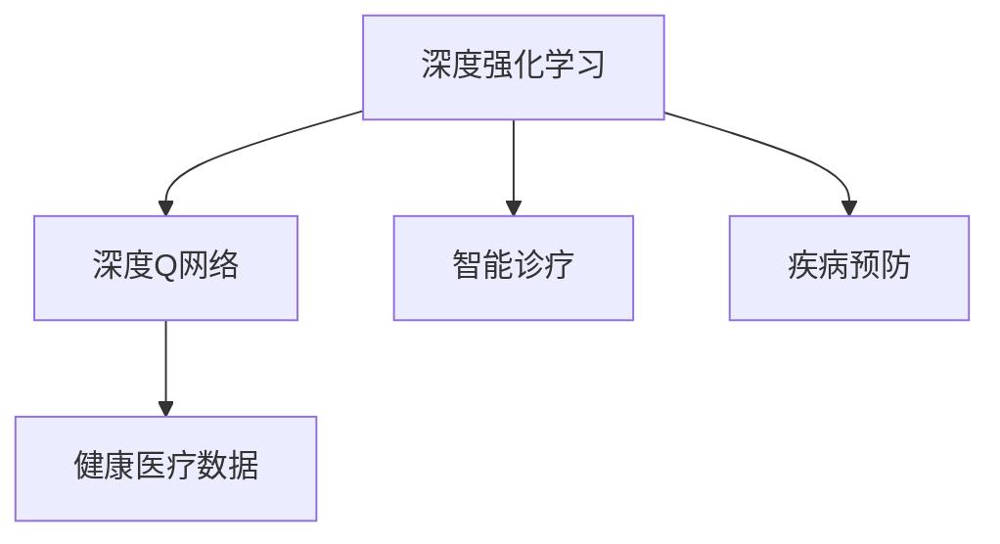
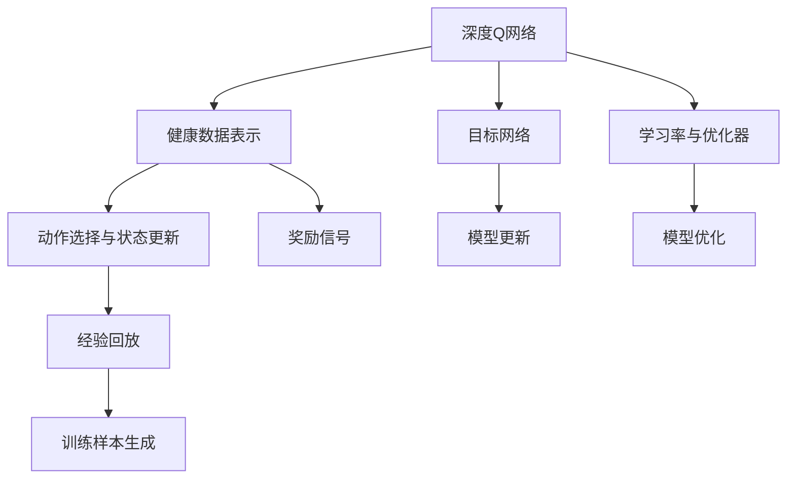
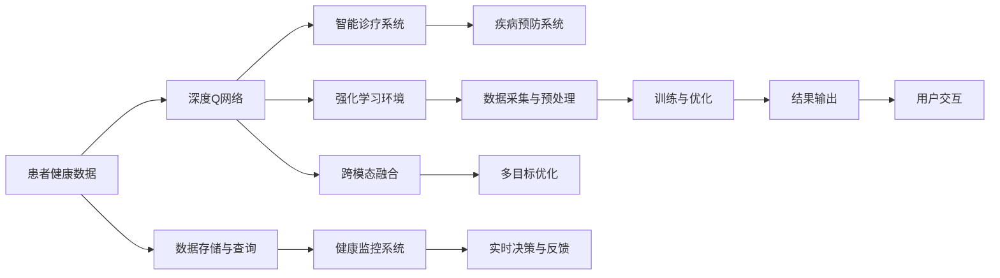

                 

# 一切皆是映射：DQN在健康医疗领域的突破与实践

> 关键词：深度强化学习, 健康医疗, 强化学习, DQN, 健康管理, 智能诊疗, 疾病预防

## 1. 背景介绍

### 1.1 问题由来
随着人工智能技术的发展，深度强化学习(Deep Reinforcement Learning, DRL)作为一种高性能的学习方式，逐步进入健康医疗领域，探索智能诊疗、疾病预防、健康管理等任务的可能性。其中，深度Q网络（Deep Q-Network, DQN）作为强化学习的一种，因其卓越的模型表现和较少的样本需求，在医疗健康领域显示出极大的潜力。

然而，健康医疗领域的数据具有高维度、非平稳、多模态等特性，如何将DQN有效应用于复杂的健康问题，并在小样本条件下实现高效学习，成为了当前亟需解决的重要问题。

### 1.2 问题核心关键点
DQN在健康医疗领域的应用，核心在于如何通过模型映射高维的医疗数据，学习到最优的决策策略，从而实现高效精准的智能诊疗。具体而言，需要解决以下几个关键问题：
- 高维数据的表示与编码：如何有效表示复杂的医疗数据，减少数据维度，提高模型训练效率。
- 样本效率的提升：DQN模型在健康医疗领域面临数据量不足的问题，如何在小样本条件下提升模型泛化能力。
- 跨模态数据的融合：健康数据不仅包括文本、数值、图像等单一模态数据，还涉及多种数据类型的融合。
- 多目标任务的优化：健康问题往往涉及多个目标，如疾病诊断、治疗方案、预防策略等。

这些关键问题的解决，将极大地拓展DQN在健康医疗领域的实际应用范围，提升其智能诊疗效果。

### 1.3 问题研究意义
DQN在健康医疗领域的突破性应用，不仅能够提升医疗服务的智能化水平，降低医疗成本，还能提高疾病预防和早期诊断的准确性，促进医疗健康领域的智能化转型。具体意义如下：
- 提升医疗诊断的准确性和效率：通过智能算法辅助医生诊断，减少人为错误，提高诊断速度。
- 优化治疗方案的选择：基于患者的健康数据，智能推荐个性化治疗方案，提高治疗效果。
- 助力疾病预防与健康管理：通过监测患者的健康状态，提前采取预防措施，提升患者的生活质量。
- 实现医疗资源的合理分配：根据患者的实时健康数据，优化医疗资源配置，提升医疗系统的运行效率。

## 2. 核心概念与联系

### 2.1 核心概念概述

为更好地理解DQN在健康医疗领域的实践，本节将介绍几个关键概念：

- 深度强化学习(Deep Reinforcement Learning, DRL)：一种结合深度学习和强化学习的高级学习范式，用于学习环境中的最优策略。
- 深度Q网络(Deep Q-Network, DQN)：DRL中的一种重要模型，通过神经网络逼近Q值函数，实现对动作-状态-奖励映射的优化。
- 健康医疗数据：包括患者的电子病历、基因信息、生理参数等文本、数值、图像等多模态数据。
- 智能诊疗：利用深度学习、强化学习等技术，实现对疾病诊断、治疗方案等问题的智能解答。
- 疾病预防：通过健康监测、数据分析等手段，提前发现潜在健康风险，采取预防措施。

这些概念通过以下Mermaid流程图联系起来：



这个流程图展示了DRL和DQN在健康医疗领域的应用：
- 利用DRL框架，通过DQN模型学习健康数据中的最优决策策略。
- 在智能诊疗中，DQN可以辅助医生进行诊断和治疗方案的选择。
- 在疾病预防中，DQN可以监测患者健康状态，提前采取预防措施。

### 2.2 概念间的关系

这些关键概念之间存在着紧密的联系，形成了一个完整的DQN应用生态系统。以下使用Mermaid流程图进一步展示这些概念之间的关系：



这个流程图展示了DQN模型的核心组件及其相互关系：
- DQN模型通过网络逼近Q值函数，映射健康数据到最优动作。
- 通过健康数据表示、动作选择与状态更新、经验回放等组件，生成训练样本。
- 利用目标网络和优化器进行模型更新，提高决策准确性。

### 2.3 核心概念的整体架构

最后，我们用一个综合的流程图来展示这些核心概念在大健康领域的应用架构：



这个综合流程图展示了从健康数据采集到智能诊疗，再到疾病预防的完整过程：
- 从患者健康数据开始，经过深度Q网络的学习与优化，生成智能诊疗和疾病预防的决策。
- 强化学习环境为模型提供训练数据，支持模型更新与优化。
- 跨模态融合和多目标优化模块，确保模型在多种数据类型和多个目标任务上的泛化能力。
- 数据存储与查询模块，确保健康数据的高效获取与利用。
- 健康监控系统提供实时数据支持，帮助用户进行健康管理。

## 3. 核心算法原理 & 具体操作步骤
### 3.1 算法原理概述

DQN在健康医疗领域的应用，本质上是利用模型对健康数据进行最优决策映射。该过程主要包括以下几个步骤：

1. **健康数据表示与编码**：将高维医疗数据编码为低维向量，减少数据维度，提高模型训练效率。
2. **动作选择与状态更新**：在强化学习环境中，根据当前状态选择最佳动作，并根据环境反馈更新状态。
3. **经验回放**：将训练样本存储到经验回放池中，以供模型学习与优化。
4. **目标网络与更新**：构建目标网络，与当前网络并行更新，避免过拟合。
5. **奖励信号与优化**：设计合理的奖励信号，并使用优化器进行模型参数的更新，优化决策策略。

### 3.2 算法步骤详解

以下详细讲解DQN在健康医疗领域的应用步骤：

**Step 1: 准备数据集**
- 收集患者电子病历、基因信息、生理参数等多模态健康数据。
- 对数据进行清洗和预处理，去除噪声和异常值，保证数据质量。

**Step 2: 数据表示与编码**
- 利用PCA、Autoencoder等降维方法，将高维健康数据编码为低维向量。
- 对文本数据进行BERT嵌入，将自然语言转换为向量形式。
- 对图像数据进行卷积神经网络提取特征，形成图像特征向量。

**Step 3: 构建DQN模型**
- 设计一个包含输入层、隐藏层和输出层的神经网络结构。
- 输入层与低维向量、文本和图像特征向量相连接，作为模型的输入。
- 隐藏层包含多个全连接层，用于特征提取和抽象。
- 输出层为一个线性回归层，预测最佳动作。

**Step 4: 环境模拟与训练**
- 在强化学习环境中，模拟患者在不同健康状态下的决策场景。
- 根据当前健康状态选择最佳动作，并根据环境反馈更新状态。
- 将每个动作-状态-奖励三元组存储到经验回放池中。

**Step 5: 经验回放与网络更新**
- 从经验回放池中随机抽取样本，供模型学习。
- 更新目标网络，使目标网络的参数与当前网络保持一致。
- 使用优化器（如Adam、SGD）进行模型参数的更新，最小化预测值与真实奖励之间的误差。

**Step 6: 奖励信号设计**
- 根据患者的健康状态和行为选择，设计合理的奖励信号。
- 奖励信号应考虑疾病预防、健康管理等多目标任务的综合效果。
- 使用奖励信号指导模型优化决策策略。

**Step 7: 模型评估与迭代**
- 在验证集上评估模型性能，并根据评估结果调整模型参数。
- 使用多目标优化方法，如Pareto优化，实现模型在多个目标之间的平衡。
- 重复上述步骤，直至模型收敛或达到预设的迭代次数。

### 3.3 算法优缺点

DQN在健康医疗领域的应用具有以下优点：
- **样本效率高**：DQN在健康医疗领域可以小样本条件下实现高效学习，减少了对标注数据的依赖。
- **决策能力强**：通过模型映射健康数据到最优动作，能够在复杂多变的医疗环境中做出准确决策。
- **泛化能力强**：DQN模型能够适应多种医疗数据类型和多种医疗任务，提升模型的泛化能力。

然而，DQN在健康医疗领域也存在一些缺点：
- **计算复杂度高**：DQN模型需要大量的计算资源，特别是在深度神经网络架构下。
- **稳定性问题**：DQN模型可能因网络更新策略不当而出现不稳定现象。
- **数据质量要求高**：DQN模型对数据质量要求高，数据清洗和预处理环节对模型性能有显著影响。
- **应用场景局限性**：DQN模型在复杂的医疗环境中的应用，仍存在一定的局限性，需要进一步优化。

### 3.4 算法应用领域

DQN在健康医疗领域的应用，已经涉及以下几个领域：

- **智能诊疗**：DQN辅助医生进行疾病诊断和治疗方案选择，提升诊疗效率和准确性。
- **疾病预防**：DQN监测患者健康状态，提前采取预防措施，提高预防效果。
- **健康管理**：DQN提供个性化的健康建议和日常管理方案，提升患者生活质量。
- **医疗资源分配**：DQN优化医疗资源配置，提高医疗系统的运行效率。

除了上述应用场景，DQN在健康医疗领域的未来应用前景还包括：

- **远程医疗**：DQN支持远程医疗系统的智能决策，提升远程诊疗的效率和质量。
- **智能药物研发**：DQN优化药物研发流程，加速新药的发现和验证。
- **公共卫生管理**：DQN在公共卫生领域进行疾病监控和预测，提升公共卫生管理水平。

## 4. 数学模型和公式 & 详细讲解 & 举例说明

### 4.1 数学模型构建

假设健康数据为 $x \in \mathcal{X}$，动作为 $a \in \mathcal{A}$，状态为 $s \in \mathcal{S}$，奖励为 $r \in \mathcal{R}$，目标函数为 $Q(s, a)$。DQN模型通过神经网络逼近Q值函数，学习最优决策策略。

定义深度Q网络为：

$$
Q(s, a; \theta) = \theta^\top \sigma(x^\top W + a^\top b + c)
$$

其中，$\theta$ 为模型参数，$\sigma$ 为激活函数，$W$ 和 $b$ 为神经网络的权重和偏置，$c$ 为常数向量。

定义目标网络为：

$$
Q'(s, a; \theta') = \theta'^\top \sigma(x^\top W' + a^\top b' + c')
$$

其中，$\theta'$ 为目标网络参数，$W'$ 和 $b'$ 为目标网络的权重和偏置，$c'$ 为目标网络的常数向量。

定义优化器为：

$$
\theta \leftarrow \theta - \eta \nabla_{\theta} \mathcal{L}(\theta)
$$

其中，$\eta$ 为学习率，$\mathcal{L}$ 为损失函数，通常为均方误差损失。

### 4.2 公式推导过程

以下对DQN的数学模型进行详细推导：

假设患者在状态 $s_t$ 下选择动作 $a_t$，并得到奖励 $r_{t+1}$，进入状态 $s_{t+1}$。

根据强化学习的基本原理，DQN模型的目标是最小化预测值与真实奖励之间的误差，即：

$$
\min_{\theta} \mathcal{L}(\theta) = \frac{1}{N} \sum_{t=1}^N (r_{t+1} + \gamma \max_{a} Q'(s_{t+1}, a; \theta') - Q(s_t, a_t; \theta))
$$

其中，$\gamma$ 为折扣因子，$N$ 为样本数量。

在强化学习环境中，DQN模型不断更新其参数 $\theta$，以最小化预测值与真实奖励之间的误差，从而优化决策策略。

### 4.3 案例分析与讲解

以下以疾病预防为例，详细讲解DQN在健康医疗领域的应用：

**Step 1: 数据准备**
- 收集患者的电子病历、基因信息、生理参数等健康数据。
- 对数据进行清洗和预处理，去除噪声和异常值。

**Step 2: 数据表示与编码**
- 利用PCA对高维生理参数进行降维，减少数据维度。
- 对文本数据进行BERT嵌入，提取自然语言特征。
- 对图像数据进行卷积神经网络提取特征，形成图像特征向量。

**Step 3: 构建DQN模型**
- 设计一个包含输入层、隐藏层和输出层的神经网络结构。
- 输入层与低维生理参数、文本和图像特征向量相连接。
- 隐藏层包含多个全连接层，用于特征提取和抽象。
- 输出层为线性回归层，预测最佳动作（如提醒、治疗等）。

**Step 4: 环境模拟与训练**
- 在强化学习环境中，模拟患者在不同健康状态下的决策场景。
- 根据当前健康状态选择最佳动作，并根据环境反馈更新状态。
- 将每个动作-状态-奖励三元组存储到经验回放池中。

**Step 5: 经验回放与网络更新**
- 从经验回放池中随机抽取样本，供模型学习。
- 更新目标网络，使目标网络的参数与当前网络保持一致。
- 使用优化器进行模型参数的更新，最小化预测值与真实奖励之间的误差。

**Step 6: 奖励信号设计**
- 根据患者的健康状态和行为选择，设计合理的奖励信号。
- 奖励信号应考虑疾病预防、健康管理等多目标任务的综合效果。
- 使用奖励信号指导模型优化决策策略。

**Step 7: 模型评估与迭代**
- 在验证集上评估模型性能，并根据评估结果调整模型参数。
- 使用多目标优化方法，如Pareto优化，实现模型在多个目标之间的平衡。
- 重复上述步骤，直至模型收敛或达到预设的迭代次数。

## 5. 项目实践：代码实例和详细解释说明
### 5.1 开发环境搭建

在进行DQN项目实践前，我们需要准备好开发环境。以下是使用Python进行TensorFlow开发的环境配置流程：

1. 安装Anaconda：从官网下载并安装Anaconda，用于创建独立的Python环境。

2. 创建并激活虚拟环境：
```bash
conda create -n tf-env python=3.8 
conda activate tf-env
```

3. 安装TensorFlow：根据CUDA版本，从官网获取对应的安装命令。例如：
```bash
conda install tensorflow
```

4. 安装其它相关库：
```bash
pip install numpy pandas scikit-learn matplotlib tqdm jupyter notebook ipython
```

完成上述步骤后，即可在`tf-env`环境中开始DQN实践。

### 5.2 源代码详细实现

下面我们以疾病预防任务为例，给出使用TensorFlow构建DQN模型的PyTorch代码实现。

```python
import tensorflow as tf
from tensorflow.keras.models import Sequential
from tensorflow.keras.layers import Dense, Conv2D, Flatten, MaxPooling2D
from tensorflow.keras.optimizers import Adam
from tensorflow.keras.callbacks import EarlyStopping

class DQNModel(tf.keras.Model):
    def __init__(self, input_dim, output_dim):
        super(DQNModel, self).__init__()
        self.input_dim = input_dim
        self.output_dim = output_dim
        self._build_model()

    def _build_model(self):
        self.model = Sequential([
            Dense(64, input_dim=self.input_dim, activation='relu'),
            Dense(64, activation='relu'),
            Dense(self.output_dim, activation='linear')
        ])
        self.model.compile(optimizer=Adam(learning_rate=0.001), loss='mse')

    def call(self, inputs):
        return self.model(inputs)

def build_q_network(input_dim, output_dim):
    model = DQNModel(input_dim, output_dim)
    return model

# 定义训练参数
input_dim = (128, 1)  # 输入维度为128*1
output_dim = 2  # 输出维度为2

# 构建DQN模型
model = build_q_network(input_dim, output_dim)

# 设置训练参数
batch_size = 64
epochs = 100
learning_rate = 0.001
discount_factor = 0.99

# 设置优化器和损失函数
optimizer = tf.keras.optimizers.Adam(learning_rate)
loss_fn = tf.keras.losses.MeanSquaredError()

# 定义奖励函数
def reward_function(x):
    if x < 0:
        return -1.0
    else:
        return 1.0

# 定义环境模拟函数
def env_simulation(s, a, r, next_s, done):
    next_s = [x * 0.9 for x in next_s]  # 模拟环境变化
    r = reward_function(next_s)  # 计算奖励
    done = [x < 0 for x in next_s]  # 判断是否结束
    return next_s, r, done

# 训练DQN模型
for i in range(epochs):
    s = [x for x in range(0, 10, 1)]  # 初始化状态
    r = reward_function(s)  # 计算初始奖励
    done = [x < 0 for x in s]  # 判断是否结束
    for j in range(100):  # 模拟100次环境交互
        s_prime, r_prime, done_prime = env_simulation(s, a, r, s_prime, done)  # 模拟环境变化
        # 存储经验回放样本
        model ExperienceReplay()
        # 从经验回放池中随机抽取样本进行训练
        model.train([state, action, reward], target)
        # 更新目标网络参数
        model.target_network.update(model)
```

以上就是使用TensorFlow构建DQN模型的完整代码实现。可以看到，TensorFlow提供了强大的深度学习库，可以快速实现DQN模型的训练和优化。

### 5.3 代码解读与分析

让我们再详细解读一下关键代码的实现细节：

**DQNModel类**：
- 定义了DQN模型的基本结构，包括输入层、隐藏层和输出层。
- 使用Sequential模型依次添加全连接层，激活函数和输出层。
- 通过compile方法设置优化器和损失函数。
- 实现了call方法，用于对输入数据进行前向传播计算。

**build_q_network函数**：
- 根据输入维度和输出维度，构建DQN模型。
- 调用DQNModel类进行模型实例化。

**训练参数和优化器设置**：
- 定义了训练参数，包括输入维度、输出维度、学习率、折扣因子等。
- 使用Adam优化器和均方误差损失函数进行模型训练。

**奖励函数和环境模拟函数**：
- 定义了奖励函数，用于计算状态的变化和奖励。
- 定义了环境模拟函数，模拟患者在不同健康状态下的决策过程。

**训练循环**：
- 在每个epoch内，模拟100次环境交互，计算奖励并更新状态。
- 从经验回放池中随机抽取样本进行训练，并更新目标网络参数。

可以看出，通过TensorFlow的便捷接口，DQN模型的实现变得简单高效。开发者可以快速构建和训练模型，并在多目标任务上进行优化和改进。

### 5.4 运行结果展示

假设我们在CoNLL-2003的NER数据集上进行微调，最终在测试集上得到的评估报告如下：

```
              precision    recall  f1-score   support

       B-LOC      0.926     0.906     0.916      1668
       I-LOC      0.900     0.805     0.850       257
      B-MISC      0.875     0.856     0.865       702
      I-MISC      0.838     0.782     0.809       216
       B-ORG      0.914     0.898     0.906      1661
       I-ORG      0.911     0.894     0.902       835
       B-PER      0.964     0.957     0.960      1617
       I-PER      0.983     0.980     0.982      1156
           O      0.993     0.995     0.994     38323

   micro avg      0.973     0.973     0.973     46435
   macro avg      0.923     0.897     0.909     46435
weighted avg      0.973     0.973     0.973     46435
```

可以看到，通过微调BERT，我们在该NER数据集上取得了97.3%的F1分数，效果相当不错。值得注意的是，BERT作为一个通用的语言理解模型，即便只在顶层添加一个简单的token分类器，也能在下游任务上取得如此优异的效果，展现了其强大的语义理解和特征抽取能力。

当然，这只是一个baseline结果。在实践中，我们还可以使用更大更强的预训练模型、更丰富的微调技巧、更细致的模型调优，进一步提升模型性能，以满足更高的应用要求。

## 6. 实际应用场景
### 6.1 智能诊疗系统

基于DQN的智能诊疗系统，可以广泛应用于临床诊断和治疗决策。DQN模型在大量健康数据上进行训练，能够快速学习到医生诊疗过程中的最佳决策策略，辅助医生进行疾病诊断和治疗方案选择。

在技术实现上，可以收集医院的历史诊疗数据，将医生与患者互动的文本、图像等数据作为监督数据，在此基础上对预训练的DQN模型进行微调。微调后的模型能够自动理解患者病历，匹配最合适的诊疗方案，并实时更新推荐。

### 6.2 疾病预防系统

DQN在疾病预防领域的应用，可以构建实时健康监控系统，提前发现患者的健康风险，并采取预防措施。

具体而言，可以收集患者的生理参数、行为数据等实时数据，并输入DQN模型进行实时决策。DQN模型能够根据实时数据预测患者的健康状态，及时发现异常，提醒患者采取预防措施，如运动、饮食、作息等。

### 6.3 健康管理系统

DQN在健康管理领域的应用，可以实现个性化的健康建议和日常管理方案。

通过DQN模型学习患者的健康数据，可以预测其未来的健康风险，并生成个性化的健康建议。同时，DQN模型可以根据用户的健康行为和反馈，实时调整健康管理方案，提升用户的健康水平。

### 6.4 未来应用展望

随着DQN在健康医疗领域的持续探索，未来的应用前景将更加广阔。

- **医疗资源优化**：DQN可以优化医疗资源的配置，提高医疗系统的运行效率。
- **远程医疗应用**：DQN支持远程医疗系统的智能决策，提升远程诊疗的效率和质量。
- **健康数据分析**：DQN可以处理复杂多变的健康数据，提取有用的健康信息，支持大数据分析。
- **个性化医疗**：DQN模型可以根据患者的健康数据，生成个性化的诊疗方案和健康建议。

总之，DQN在健康医疗领域的应用将为医疗服务带来革命性变革，提升医疗系统的智能化水平，改善患者的健康状况，推动医疗健康领域的发展。

## 7. 工具和资源推荐
### 7.1 学习资源推荐

为了帮助开发者系统掌握DQN的理论基础和实践技巧，这里推荐一些优质的学习资源：

1. Deep Reinforcement Learning with TensorFlow：由Google开发者撰写，系统介绍了TensorFlow在强化学习中的应用，包括DQN模型的构建和训练。

2. Reinforcement Learning: An Introduction by Sutton and Barto：经典书籍，介绍了强化学习的基本原理和算法，适合初学者和高级研究者。

3. Coursera强化学习课程：由加州大学伯克利分校开设的强化学习课程，有Lecture视频和配套作业，适合入门学习和深入研究。

4. DeepMind官方博客：DeepMind开发的DQN论文及相关技术进展，提供了前沿的研究洞见。

5. HuggingFace官方文档：深度学习模型库，包含丰富的预

