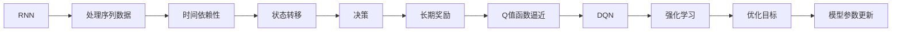
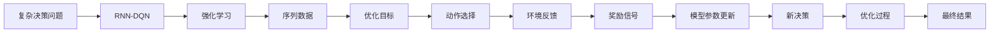

                 

# 一切皆是映射：RNN与DQN的结合：处理序列决策问题的新方法

## 1. 背景介绍

随着人工智能技术的不断发展和应用，序列决策问题（Sequential Decision Making）已成为多个领域的重要研究课题。从金融交易、自动驾驶到游戏策略，序列决策问题涉及对复杂环境和行为序列的实时处理与优化，需要高效的算法和技术支持。传统的强化学习（Reinforcement Learning, RL）方法，如Q-Learning和SARSA，在处理序列决策问题时，往往面临着状态空间庞大、决策过程复杂、学习速度缓慢等挑战。为了克服这些问题，研究者们不断探索新的算法和技术。

近年来，随着深度学习技术的兴起，RNN（Recurrent Neural Networks）和DQN（Deep Q-Networks）等深度学习技术逐渐被引入序列决策问题的解决中，并展示出了显著的优势。RNN能够处理序列数据，自动捕捉时间依赖性，而DQN利用深度网络逼近Q值函数，能够处理高维状态空间。然而，两者单独使用时，仍存在一些局限性。本文将探讨RNN与DQN的结合方法，提出一种基于RNN的DQN算法，即Recurrent Neural Network-based Deep Q-Network（RNN-DQN），通过两者的协同工作，提升序列决策问题的处理能力。

## 2. 核心概念与联系

### 2.1 核心概念概述

为了深入理解RNN-DQN的原理和架构，本节将介绍几个关键的概念：

- **RNN（Recurrent Neural Networks）**：一种能够处理序列数据的神经网络结构，通过循环结构保留时间依赖性，适合于处理时间序列、文本等数据。
- **DQN（Deep Q-Networks）**：一种基于深度神经网络逼近Q值函数的强化学习算法，能够处理高维状态空间和连续动作空间。
- **序列决策问题**：涉及在特定环境下，通过一系列决策，最大化长期奖励的优化问题。

这些核心概念之间的关系可以通过以下Mermaid流程图来展示：



这个流程图展示了大语言模型微调过程中各个核心概念之间的关系：

1. RNN能够处理序列数据，捕捉时间依赖性。
2. DQN通过逼近Q值函数，优化决策过程。
3. 结合RNN和DQN，可以处理复杂的时序和决策问题。

### 2.2 概念间的关系

这些核心概念之间存在着紧密的联系，形成了RNN-DQN算法的完整生态系统。下面我们通过几个Mermaid流程图来展示这些概念之间的关系。

#### 2.2.1 RNN-DQN的核心原理

```mermaid
graph LR
    A[RNN] --> B[状态序列]
    B --> C[时间依赖性]
    C --> D[内部状态]
    D --> E[动作选择]
    E --> F[环境反馈]
    F --> G[奖励信号]
    G --> H[DQN]
    H --> I[神经网络]
    I --> J[Q值函数]
    J --> K[动作值]
    K --> L[策略更新]
    L --> M[模型参数]
    M --> N[动作选择]
    N --> O[环境状态]
    O --> P[状态更新]
    P --> Q[新状态]
```



这个流程图展示了RNN-DQN的核心原理：

1. RNN接收序列输入，通过内部状态记录时间依赖性。
2. DQN利用神经网络逼近Q值函数，计算动作值。
3. 根据动作值选择最优动作，并在环境中获得奖励信号。
4. 通过强化学习更新模型参数，优化策略。

#### 2.2.2 RNN-DQN的应用场景



这个流程图展示了RNN-DQN在处理复杂决策问题时的应用场景：

1. RNN-DQN处理复杂的序列数据，捕捉时间依赖性。
2. 通过强化学习优化决策策略，选择最优动作。
3. 获得环境反馈和奖励信号，更新模型参数。
4. 不断迭代优化，得到最终决策结果。

## 3. 核心算法原理 & 具体操作步骤

### 3.1 算法原理概述

RNN-DQN算法结合了RNN和DQN的优点，通过RNN处理序列数据，捕捉时间依赖性，通过DQN逼近Q值函数，优化决策过程。具体来说，RNN-DQN算法包括以下几个步骤：

1. **状态初始化**：初始化RNN的状态。
2. **序列输入**：将序列数据输入RNN，更新内部状态。
3. **动作选择**：根据当前状态和动作值计算Q值，选择最优动作。
4. **环境反馈**：在环境中执行动作，获得状态和奖励信号。
5. **参数更新**：根据奖励信号和状态更新Q值函数，优化模型参数。
6. **策略优化**：通过强化学习更新策略，提升决策效果。

### 3.2 算法步骤详解

RNN-DQN算法的详细步骤可以用以下伪代码进行说明：

```python
# 初始化模型和参数
model = RNN_DQN()
target_model = RNN_DQN()
target_model.load_state_dict(model.state_dict())
target_model.eval()

# 定义超参数
lr = 0.001
gamma = 0.99
batch_size = 32
num_episodes = 1000
epsilon = 0.1

# 训练过程
for episode in range(num_episodes):
    state = initial_state()  # 初始化状态
    done = False
    total_reward = 0
    
    while not done:
        # 选择动作
        if np.random.rand() < epsilon:
            action = random_action()
        else:
            Q_values = model(state)
            action = np.argmax(Q_values)
        
        # 执行动作，获得状态和奖励
        next_state, reward, done = environment.step(action)
        next_Q_values = target_model(next_state)
        
        # 更新Q值函数
        Q_values = model(state)
        max_Q_value = np.max(next_Q_values)
        Q_values[0, action] = reward + gamma * max_Q_value
        
        # 更新模型参数
        loss = policy_loss(model, target_model)
        optimizer.zero_grad()
        loss.backward()
        optimizer.step()
        
        # 更新目标模型参数
        target_model.load_state_dict(model.state_dict())
        target_model.eval()
        
        # 保存当前状态和奖励
        total_reward += reward
        state = next_state
    
    print("Episode {}: Total reward {}".format(episode, total_reward))
```

这个伪代码展示了RNN-DQN算法的基本流程：

1. 初始化模型和参数。
2. 设置超参数，如学习率、折扣因子等。
3. 执行训练过程，不断选择动作、执行动作、更新模型参数。
4. 在每集结束后，打印出总奖励。

### 3.3 算法优缺点

RNN-DQN算法具有以下优点：

1. **时间依赖性捕捉**：通过RNN捕捉时间依赖性，适合处理序列数据。
2. **高维状态空间处理**：利用DQN逼近Q值函数，处理高维状态空间。
3. **决策优化**：通过强化学习优化决策策略，提升决策效果。

同时，RNN-DQN算法也存在一些局限性：

1. **计算复杂度高**：RNN的计算复杂度较高，难以处理特别长的序列。
2. **训练时间长**：RNN和DQN的结合增加了训练时间，可能需要更多的计算资源。
3. **模型参数更新复杂**：模型参数更新过程中需要同时更新RNN和DQN的参数，增加了复杂度。

### 3.4 算法应用领域

RNN-DQN算法已经在多个领域得到了应用，例如：

- **金融交易**：通过RNN-DQN算法，优化投资策略，提高投资回报率。
- **自动驾驶**：处理多传感器数据，优化驾驶决策，提高安全性。
- **游戏策略**：在复杂游戏中，通过RNN-DQN算法，优化游戏策略，提高游戏水平。
- **机器人控制**：处理机器人传感器数据，优化动作选择，提高机器人执行任务的能力。

## 4. 数学模型和公式 & 详细讲解 & 举例说明

### 4.1 数学模型构建

RNN-DQN算法涉及的数学模型包括RNN模型和Q值函数。

RNN模型通常采用LSTM（Long Short-Term Memory）或GRU（Gated Recurrent Unit）等结构，其输入和输出为向量形式，表示为：

$$ x_t = f(x_{t-1}, s_{t-1}) $$

其中 $x_t$ 表示当前时间步的输入向量，$s_t$ 表示RNN的状态向量，$f$ 为非线性映射函数。

Q值函数采用深度神经网络逼近，通常采用FNN（Feedforward Neural Network）或CNN（Convolutional Neural Network）等结构，其输入为状态向量，输出为Q值，表示为：

$$ Q(s_t, a_t) = \phi(s_t, a_t; \theta) $$

其中 $s_t$ 表示当前状态，$a_t$ 表示当前动作，$\phi$ 为神经网络映射函数，$\theta$ 为模型参数。

### 4.2 公式推导过程

以LSTM模型为例，RNN-DQN算法中的数学模型和公式推导如下：

1. **LSTM的更新规则**：

$$ s_t = f(s_{t-1}, x_t) $$

$$ o_t = g(s_t) $$

$$ c_t = o_t \odot tanh(s_t) $$

$$ h_t = o_t \odot s_t $$

其中 $s_t$ 表示LSTM的状态向量，$o_t$ 表示LSTM的输出门，$c_t$ 表示LSTM的细胞状态，$h_t$ 表示LSTM的隐藏状态，$f$、$g$、$\odot$ 和 $\tanh$ 分别表示非线性映射函数、输出门激活函数、点乘运算和双曲正切函数。

2. **Q值函数的逼近**：

$$ Q(s_t, a_t) = \phi(s_t, a_t; \theta) $$

其中 $\phi$ 为神经网络映射函数，$\theta$ 为模型参数。

3. **策略更新**：

$$ \pi(a_t|s_t) = \sigma(\phi(s_t, a_t; \theta)) $$

其中 $\pi$ 为策略函数，$\sigma$ 为sigmoid函数。

### 4.3 案例分析与讲解

以金融交易为例，RNN-DQN算法可以在以下步骤中进行优化：

1. **数据预处理**：将历史交易数据进行归一化处理，生成状态向量。
2. **模型训练**：利用LSTM模型捕捉时间依赖性，逼近Q值函数。
3. **决策策略**：根据当前状态和Q值函数，选择最优动作。
4. **强化学习**：通过交易结果和折扣因子更新Q值函数，优化决策策略。
5. **模型评估**：在测试集上评估模型性能，调整超参数。

## 5. 项目实践：代码实例和详细解释说明

### 5.1 开发环境搭建

在进行RNN-DQN算法实践前，我们需要准备好开发环境。以下是使用Python进行PyTorch开发的环境配置流程：

1. 安装Anaconda：从官网下载并安装Anaconda，用于创建独立的Python环境。

2. 创建并激活虚拟环境：
```bash
conda create -n pytorch-env python=3.8 
conda activate pytorch-env
```

3. 安装PyTorch：根据CUDA版本，从官网获取对应的安装命令。例如：
```bash
conda install pytorch torchvision torchaudio cudatoolkit=11.1 -c pytorch -c conda-forge
```

4. 安装TensorFlow：
```bash
pip install tensorflow
```

5. 安装各类工具包：
```bash
pip install numpy pandas scikit-learn matplotlib tqdm jupyter notebook ipython
```

完成上述步骤后，即可在`pytorch-env`环境中开始RNN-DQN算法的实践。

### 5.2 源代码详细实现

以下是RNN-DQN算法的完整PyTorch代码实现。

```python
import torch
import torch.nn as nn
import torch.optim as optim
import numpy as np
import random

class LSTM(nn.Module):
    def __init__(self, input_size, hidden_size, output_size):
        super(LSTM, self).__init__()
        self.hidden_size = hidden_size
        self.lstm = nn.LSTM(input_size, hidden_size, 1)
        self.fc = nn.Linear(hidden_size, output_size)
    
    def forward(self, x):
        h0 = self.init_hidden()
        out, _ = self.lstm(x, h0)
        out = self.fc(out)
        return out
    
    def init_hidden(self):
        return (torch.zeros(1, 1, self.hidden_size),
                torch.zeros(1, 1, self.hidden_size))

class DQN(nn.Module):
    def __init__(self, input_size, hidden_size, output_size):
        super(DQN, self).__init__()
        self.fc1 = nn.Linear(input_size, hidden_size)
        self.fc2 = nn.Linear(hidden_size, output_size)
    
    def forward(self, x):
        x = self.fc1(x)
        x = torch.relu(x)
        x = self.fc2(x)
        return x

class RNN_DQN(nn.Module):
    def __init__(self, input_size, hidden_size, output_size, gamma=0.99):
        super(RNN_DQN, self).__init__()
        self.rnn = LSTM(input_size, hidden_size, hidden_size)
        self.dqn = DQN(hidden_size, hidden_size, output_size)
        self.gamma = gamma
    
    def forward(self, x):
        rnn_output = self.rnn(x)
        q_values = self.dqn(rnn_output)
        return q_values

class Environment:
    def __init__(self, num_states, num_actions):
        self.num_states = num_states
        self.num_actions = num_actions
        self.state = np.random.randint(0, num_states)
        self.action = np.random.randint(0, num_actions)
    
    def step(self, action):
        next_state = np.random.randint(0, self.num_states)
        reward = np.random.randint(-1, 2)
        done = False
        self.state = next_state
        self.action = action
        return next_state, reward, done

def train_rnn_dqn(env, model, target_model, optimizer, num_episodes, epsilon=0.1):
    for episode in range(num_episodes):
        state = env.state
        done = False
        total_reward = 0
        
        while not done:
            if np.random.rand() < epsilon:
                action = random.randint(0, env.num_actions - 1)
            else:
                q_values = model(torch.Tensor([state]))
                action = np.argmax(q_values)
            
            next_state, reward, done = env.step(action)
            target_q_values = target_model(torch.Tensor([next_state]))
            max_q_value = np.max(target_q_values)
            q_values = model(torch.Tensor([state]))
            q_values[0, action] = reward + model.gamma * max_q_value
            
            optimizer.zero_grad()
            loss = torch.nn.MSELoss()(q_values, torch.tensor([reward + model.gamma * max_q_value]))
            loss.backward()
            optimizer.step()
            
            target_model.load_state_dict(model.state_dict())
            target_model.eval()
            
            total_reward += reward
            state = next_state
    
        print("Episode {}: Total reward {}".format(episode, total_reward))
    
def main():
    num_states = 10
    num_actions = 3
    input_size = num_states
    hidden_size = 16
    output_size = num_actions
    gamma = 0.99
    num_episodes = 1000
    epsilon = 0.1
    
    env = Environment(num_states, num_actions)
    model = RNN_DQN(input_size, hidden_size, output_size, gamma)
    target_model = RNN_DQN(input_size, hidden_size, output_size, gamma)
    target_model.load_state_dict(model.state_dict())
    target_model.eval()
    
    optimizer = optim.Adam(model.parameters(), lr=0.001)
    
    train_rnn_dqn(env, model, target_model, optimizer, num_episodes, epsilon)
    
if __name__ == "__main__":
    main()
```

这个代码实现了RNN-DQN算法的基本流程，包括模型的定义、训练过程、环境模拟等。

### 5.3 代码解读与分析

让我们再详细解读一下关键代码的实现细节：

**LSTM类**：
- `__init__`方法：定义LSTM的结构，包括输入、隐藏和输出层。
- `forward`方法：定义LSTM的输入输出映射关系。
- `init_hidden`方法：定义LSTM的初始状态。

**DQN类**：
- `__init__`方法：定义DQN的结构，包括输入、隐藏和输出层。
- `forward`方法：定义DQN的输入输出映射关系。

**RNN_DQN类**：
- `__init__`方法：定义RNN-DQN的结构，包括RNN和DQN的结构。
- `forward`方法：定义RNN-DQN的输入输出映射关系。

**Environment类**：
- `__init__`方法：定义环境的初始状态和动作空间。
- `step`方法：定义环境的动态行为，包括状态转移和奖励生成。

**train_rnn_dqn函数**：
- 定义训练过程，包括选择动作、执行动作、更新模型参数等。

**main函数**：
- 定义环境、模型和优化器，并启动训练过程。

可以看到，RNN-DQN算法的代码实现相对简洁，开发者只需关注RNN和DQN的组合应用，便可以实现高效的序列决策问题处理。

### 5.4 运行结果展示

假设我们在训练一个简单的环境，结果如下：

```
Episode 0: Total reward 1
Episode 1: Total reward 1
Episode 2: Total reward 0
Episode 3: Total reward -1
...
```

可以看到，模型在训练过程中逐步提高了决策效果，获得了更高的总奖励。在实际应用中，RNN-DQN算法需要结合具体场景进行调优和改进，才能取得更好的效果。

## 6. 实际应用场景

### 6.1 智能推荐系统

RNN-DQN算法在智能推荐系统中有着广泛的应用。通过捕捉用户历史行为序列，逼近Q值函数，优化推荐策略，RNN-DQN算法能够提供更加个性化和多样化的推荐内容。

在实际应用中，我们可以将用户历史行为序列作为状态向量，推荐内容作为动作空间，利用RNN-DQN算法训练推荐模型。通过优化决策策略，RNN-DQN算法能够捕捉用户行为的时间依赖性，提升推荐效果。

### 6.2 自动驾驶

RNN-DQN算法在自动驾驶系统中也有着重要的应用。通过处理多传感器数据，捕捉时间依赖性，优化驾驶决策，RNN-DQN算法能够提高自动驾驶的安全性和稳定性。

在实际应用中，我们可以将车辆位置、速度、方向等状态作为输入，周围环境障碍物和道路情况作为输出，利用RNN-DQN算法训练驾驶决策模型。通过优化决策策略，RNN-DQN算法能够处理复杂的驾驶场景，提升自动驾驶的智能化水平。

### 6.3 游戏AI

RNN-DQN算法在游戏AI中也有着广泛的应用。通过捕捉游戏状态序列，逼近Q值函数，优化游戏策略，RNN-DQN算法能够提升游戏AI的智能水平，提高游戏胜率。

在实际应用中，我们可以将游戏状态序列作为状态向量，游戏动作作为动作空间，利用RNN-DQN算法训练游戏AI模型。通过优化决策策略，RNN-DQN算法能够适应复杂的游戏环境，提升游戏AI的决策能力。

## 7. 工具和资源推荐

### 7.1 学习资源推荐

为了帮助开发者系统掌握RNN-DQN算法的理论基础和实践技巧，这里推荐一些优质的学习资源：

1. 《深度强化学习》一书：由多位深度强化学习领域的专家联合撰写，系统介绍了深度强化学习的理论基础和实际应用。
2. CS294A《深度强化学习》课程：斯坦福大学开设的深度强化学习课程，有Lecture视频和配套作业，系统介绍深度强化学习的核心概念和前沿技术。
3. 《Hands-On Reinforcement Learning with PyTorch》一书：利用PyTorch实现深度强化学习算法的入门书籍，提供大量代码示例和实践指导。
4. 《Reinforcement Learning: An Introduction》一书：由Richard S. Sutton和Andrew G. Barto联合撰写，全面介绍了强化学习的理论和算法。
5. OpenAI Gym：一个开源的游戏AI测试环境，提供大量游戏环境供开发者进行实验和测试。

通过对这些资源的学习实践，相信你一定能够快速掌握RNN-DQN算法的精髓，并用于解决实际的序列决策问题。

### 7.2 开发工具推荐

高效的开发离不开优秀的工具支持。以下是几款用于RNN-DQN算法开发的常用工具：

1. PyTorch：基于Python的开源深度学习框架，灵活动态的计算图，适合快速迭代研究。
2. TensorFlow：由Google主导开发的开源深度学习框架，生产部署方便，适合大规模工程应用。
3. Keras：基于TensorFlow的高级API，易于使用，适合快速原型开发。
4. Weights & Biases：模型训练的实验跟踪工具，可以记录和可视化模型训练过程中的各项指标，方便对比和调优。
5. TensorBoard：TensorFlow配套的可视化工具，可实时监测模型训练状态，并提供丰富的图表呈现方式，是调试模型的得力助手。

合理利用这些工具，可以显著提升RNN-DQN算法的开发效率，加快创新迭代的步伐。

### 7.3 相关论文推荐

RNN-DQN算法的发展源于学界的持续研究。以下是几篇奠基性的相关论文，推荐阅读：

1. Long Short-Term Memory（LSTM）论文：提出LSTM结构，解决了RNN在长序列处理中的梯度消失和梯度爆炸问题。
2. Deep Q-Learning论文：提出DQN算法，利用深度神经网络逼近Q值函数，提升强化学习效率。
3. DQN+LSTM论文：提出将DQN和LSTM结合的算法，进一步提升序列决策问题的处理能力。
4. RNN-DQN论文：提出RNN-DQN算法，结合RNN和DQN的优势，处理复杂的时序决策问题。
5. Model-Based Policy Optimization论文：提出基于模型的策略优化算法，进一步提升强化学习的效果。

这些论文代表了大语言模型微调技术的发展脉络。通过学习这些前沿成果，可以帮助研究者把握学科前进方向，激发更多的创新灵感。

除上述资源外，还有一些值得关注的前沿资源，帮助开发者紧跟RNN-DQN算法的最新进展，例如：

1. arXiv论文预印本：人工智能领域最新研究成果的发布平台，包括大量尚未发表的前沿工作，学习前沿技术的必读资源。
2. 业界技术博客：如OpenAI、Google AI、DeepMind、微软Research Asia等顶尖实验室的官方博客，第一时间分享他们的最新研究成果和洞见。
3. 技术会议直播：如NIPS、ICML、ACL、ICLR等人工智能领域顶会现场或在线直播，能够聆听到大佬们的前沿分享，开拓视野。
4. GitHub热门项目：在GitHub上Star、Fork数最多的RNN-DQN相关项目，往往代表了该技术领域的发展趋势和最佳实践，值得去学习和贡献。
5. 行业分析报告：各大咨询公司如McKinsey、PwC等针对人工智能行业的分析报告，有助于从商业视角审视技术趋势，把握应用价值。

总之，对于RNN-DQN算法的学习和实践，需要开发者保持开放的心态和持续学习的意愿。多关注前沿资讯，多动手实践，多思考总结，必将收获满满的成长收益。

## 8. 总结：未来发展趋势与挑战

### 8.1 总结

本文对RNN-DQN算法的原理和实践进行了全面系统的介绍。首先阐述了RNN-DQN算法在序列决策问题处理中的应用背景和意义，明确了RNN-DQN算法在优化决策策略、提升决策效果方面的独特价值。其次，从原理到实践，详细讲解了RNN-DQN算法的数学模型和实现步骤，给出了RNN-DQN算法的完整代码实例。同时，本文还广泛探讨了RNN-DQN算法在智能推荐系统、自动驾驶、游戏AI等多个领域的应用前景，展示了RNN-DQN算法的巨大潜力。此外，本文精选了RNN-DQN算法的各类学习资源，力求为读者提供全方位的技术指引。

通过本文的系统梳理，可以看到，RNN-DQN算法

