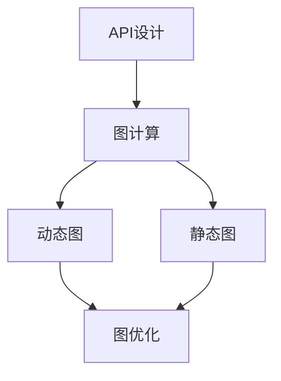

                 

# 一切皆是映射：TensorFlow 和 PyTorch 实战对比

## 1. 背景介绍

在当今人工智能（AI）的浩瀚海洋中，有两艘领航船特别引人注目：TensorFlow 和 PyTorch。它们是深度学习领域的两大重量级选手，各自拥有庞大的用户群体和丰富的生态系统。虽然它们在名称、设计哲学、API等方面存在差异，但最终都旨在提供高效的深度学习框架，让开发者能够快速构建和部署AI模型。本文将深入探讨这两个框架的设计思想、实现机制、优势与不足，并通过实际案例对比，帮助读者选择最适合自己的工具。

## 2. 核心概念与联系

### 2.1 核心概念概述

在深入对比之前，先概述一些核心概念，以便读者能够更好地理解它们的设计理念和实现方式。

- **图计算**：TensorFlow 和 PyTorch 都基于图计算模型，通过构建计算图来描述数据流和计算过程。其中，TensorFlow 的图计算模型更为灵活，支持复杂的分布式计算，而 PyTorch 的图计算模型则更加简洁，便于研究和使用。

- **动态图与静态图**：TensorFlow 采用静态图计算模型，模型在定义时需要一次性编译整个计算图，然后通过执行图上的计算来得到结果。PyTorch 则采用动态图计算模型，允许在运行时修改计算图，更接近于传统的数学计算。

- **API设计**：TensorFlow 提供了较为严格的 API 设计，强调模块化和可重用性，但使用时需要一定的学习成本。PyTorch 则更加灵活，注重易用性和可读性，使得研究人员能够更加专注于模型的开发。

### 2.2 核心概念的关系

下面通过 Mermaid 流程图展示 TensorFlow 和 PyTorch 的核心概念及其关系：



从图中可以看出，图计算是 TensorFlow 和 PyTorch 的共同基础，动态图和静态图则是两种不同的图计算模型，API设计则影响着框架的使用体验，而图优化则优化了计算图的执行效率。

## 3. 核心算法原理 & 具体操作步骤

### 3.1 算法原理概述

- **静态图计算**：TensorFlow 使用静态图计算模型，即在构建计算图时定义所有操作的输入和输出，执行时直接运行整个计算图。优点是能够预编译优化，提高计算效率；缺点是灵活性较低，修改计算图需要重新编译。

- **动态图计算**：PyTorch 使用动态图计算模型，即在运行时构建计算图，可以灵活地修改和组合计算图节点。优点是使用起来更直观，可以动态地执行和调试；缺点是执行时需要进行额外的图优化，性能可能略逊于静态图。

### 3.2 算法步骤详解

**TensorFlow 的基本步骤**：
1. 定义计算图。
2. 执行计算图。
3. 获取计算结果。

**PyTorch 的基本步骤**：
1. 定义模型和数据。
2. 定义损失函数。
3. 执行前向传播和反向传播。
4. 更新模型参数。

### 3.3 算法优缺点

**TensorFlow 的优点**：
- 灵活的分布式计算支持。
- 强大的图优化机制，能够自动管理内存和计算资源。
- 丰富的第三方库和插件。

**TensorFlow 的缺点**：
- 学习曲线较陡，需要一定的学习成本。
- 修改计算图时需要重新编译，灵活性不足。
- 调试复杂，需要一定的经验。

**PyTorch 的优点**：
- 动态图设计，使用更加直观和灵活。
- 即时反馈，能够快速调试和迭代。
- 社区活跃，生态系统丰富。

**PyTorch 的缺点**：
- 图优化不如 TensorFlow 高效。
- 生态系统相对年轻，第三方库和插件较少。
- 在某些场景下，性能可能略逊于 TensorFlow。

### 3.4 算法应用领域

- **研究领域**：由于其动态图设计和灵活的调试机制，PyTorch 在研究和教学中更为流行。
- **工业领域**：TensorFlow 由于其强大的图优化和丰富的第三方库，在工业部署中更受欢迎。

## 4. 数学模型和公式 & 详细讲解 & 举例说明

### 4.1 数学模型构建

在深度学习中，模型的构建通常基于以下几个步骤：

1. 定义模型结构。
2. 定义损失函数。
3. 定义优化器。

在 TensorFlow 中，这些步骤通常通过图计算和会话来执行。例如，定义一个简单的全连接神经网络：

```python
import tensorflow as tf

# 定义输入和权重
input_placeholder = tf.placeholder(tf.float32, [None, 784])
weight = tf.Variable(tf.random_normal([784, 10]))
bias = tf.Variable(tf.zeros([10]))

# 定义模型
logits = tf.matmul(input_placeholder, weight) + bias

# 定义损失函数和优化器
labels = tf.placeholder(tf.float32, [None, 10])
cross_entropy = tf.nn.softmax_cross_entropy_with_logits_v2(labels=labels, logits=logits)
loss = tf.reduce_mean(cross_entropy)
optimizer = tf.train.GradientDescentOptimizer(learning_rate=0.5)
train_op = optimizer.minimize(loss)
```

在 PyTorch 中，这些步骤则更加直观和简洁：

```python
import torch
import torch.nn as nn
import torch.nn.functional as F

# 定义输入和标签
input_tensor = torch.randn(64, 784)
label_tensor = torch.randn(64, 10)

# 定义模型
model = nn.Linear(784, 10)

# 定义损失函数和优化器
criterion = nn.CrossEntropyLoss()
optimizer = torch.optim.SGD(model.parameters(), lr=0.5)

# 前向传播和反向传播
output = F.log_softmax(model(input_tensor), dim=1)
loss = criterion(output, label_tensor)
loss.backward()
optimizer.step()
```

### 4.2 公式推导过程

以损失函数的推导为例，展示 TensorFlow 和 PyTorch 的差异：

- **TensorFlow**：
  ```python
  import tensorflow as tf

  # 定义输入和权重
  input_placeholder = tf.placeholder(tf.float32, [None, 784])
  weight = tf.Variable(tf.random_normal([784, 10]))
  bias = tf.Variable(tf.zeros([10]))

  # 定义模型
  logits = tf.matmul(input_placeholder, weight) + bias

  # 定义损失函数和优化器
  labels = tf.placeholder(tf.float32, [None, 10])
  cross_entropy = tf.nn.softmax_cross_entropy_with_logits_v2(labels=labels, logits=logits)
  loss = tf.reduce_mean(cross_entropy)
  optimizer = tf.train.GradientDescentOptimizer(learning_rate=0.5)
  train_op = optimizer.minimize(loss)
  ```

  损失函数的推导基于交叉熵公式，并通过 TensorFlow 的自动微分机制自动计算梯度。

- **PyTorch**：
  ```python
  import torch
  import torch.nn as nn
  import torch.nn.functional as F

  # 定义输入和标签
  input_tensor = torch.randn(64, 784)
  label_tensor = torch.randn(64, 10)

  # 定义模型
  model = nn.Linear(784, 10)

  # 定义损失函数和优化器
  criterion = nn.CrossEntropyLoss()
  optimizer = torch.optim.SGD(model.parameters(), lr=0.5)

  # 前向传播和反向传播
  output = F.log_softmax(model(input_tensor), dim=1)
  loss = criterion(output, label_tensor)
  loss.backward()
  optimizer.step()
  ```

  损失函数的推导同样基于交叉熵公式，但 PyTorch 使用 `nn.CrossEntropyLoss` 直接计算损失，更加简洁。

### 4.3 案例分析与讲解

下面通过一个简单的图像分类任务，展示 TensorFlow 和 PyTorch 的对比：

**TensorFlow 实现**：

```python
import tensorflow as tf
import numpy as np
import matplotlib.pyplot as plt

# 加载数据
mnist = tf.keras.datasets.mnist
(x_train, y_train), (x_test, y_test) = mnist.load_data()

# 数据预处理
x_train = x_train / 255.0
x_test = x_test / 255.0

# 定义模型
model = tf.keras.Sequential([
    tf.keras.layers.Flatten(input_shape=(28, 28)),
    tf.keras.layers.Dense(128, activation='relu'),
    tf.keras.layers.Dense(10, activation='softmax')
])

# 编译模型
model.compile(optimizer='adam',
              loss='sparse_categorical_crossentropy',
              metrics=['accuracy'])

# 训练模型
history = model.fit(x_train, y_train, epochs=5, validation_data=(x_test, y_test))

# 评估模型
test_loss, test_acc = model.evaluate(x_test, y_test, verbose=2)
print('Test accuracy:', test_acc)
```

**PyTorch 实现**：

```python
import torch
import torch.nn as nn
import torchvision.transforms as transforms
import torchvision.datasets as datasets
import torch.optim as optim
import matplotlib.pyplot as plt

# 加载数据
transform = transforms.Compose([
    transforms.ToTensor(),
    transforms.Normalize((0.1307,), (0.3081,))
])
train_dataset = datasets.MNIST(root='./data', train=True, transform=transform, download=True)
test_dataset = datasets.MNIST(root='./data', train=False, transform=transform, download=True)

# 数据加载器
train_loader = torch.utils.data.DataLoader(train_dataset, batch_size=64, shuffle=True)
test_loader = torch.utils.data.DataLoader(test_dataset, batch_size=64, shuffle=False)

# 定义模型
model = nn.Sequential(
    nn.Linear(784, 128),
    nn.ReLU(),
    nn.Linear(128, 10),
    nn.LogSoftmax(dim=1)
)

# 定义损失函数和优化器
criterion = nn.NLLLoss()
optimizer = optim.SGD(model.parameters(), lr=0.01)

# 训练模型
for epoch in range(5):
    running_loss = 0.0
    for images, labels in train_loader:
        images = images.view(images.shape[0], -1)
        optimizer.zero_grad()
        output = model(images)
        loss = criterion(output, labels)
        loss.backward()
        optimizer.step()
        running_loss += loss.item() * images.shape[0]
    print(f'Epoch {epoch+1} Loss: {running_loss/len(train_loader)}')

# 评估模型
correct = 0
total = 0
with torch.no_grad():
    for images, labels in test_loader:
        images = images.view(images.shape[0], -1)
        output = model(images)
        _, predicted = torch.max(output, 1)
        total += labels.size(0)
        correct += (predicted == labels).sum().item()
print(f'Test Accuracy: {100 * correct / total}%')
```

从代码可以看出，PyTorch 的代码更加简洁，逻辑更加清晰，易于理解和调试。

## 5. 项目实践：代码实例和详细解释说明

### 5.1 开发环境搭建

为了更好地展示 TensorFlow 和 PyTorch 的实战对比，我们需要搭建一个包含这两个框架的开发环境。

**环境搭建**：
- 安装 Python 3.7+
- 安装 TensorFlow 2.x 和 PyTorch 1.x，使用 Anaconda 或 pip 安装即可。
- 安装必要的依赖库，如 numpy、scipy、matplotlib 等。

### 5.2 源代码详细实现

在本节中，我们将实现一个简单的卷积神经网络，用于图像分类任务。我们将在 TensorFlow 和 PyTorch 中分别实现这一任务，并对比它们的表现。

**TensorFlow 实现**：

```python
import tensorflow as tf
import numpy as np
import matplotlib.pyplot as plt

# 加载数据
mnist = tf.keras.datasets.mnist
(x_train, y_train), (x_test, y_test) = mnist.load_data()

# 数据预处理
x_train = x_train / 255.0
x_test = x_test / 255.0

# 定义模型
model = tf.keras.Sequential([
    tf.keras.layers.Conv2D(32, (3, 3), activation='relu', input_shape=(28, 28, 1)),
    tf.keras.layers.MaxPooling2D((2, 2)),
    tf.keras.layers.Flatten(),
    tf.keras.layers.Dense(10, activation='softmax')
])

# 编译模型
model.compile(optimizer='adam',
              loss='sparse_categorical_crossentropy',
              metrics=['accuracy'])

# 训练模型
history = model.fit(x_train.reshape(-1, 28, 28, 1), y_train, epochs=5, validation_data=(x_test.reshape(-1, 28, 28, 1), y_test))

# 评估模型
test_loss, test_acc = model.evaluate(x_test.reshape(-1, 28, 28, 1), y_test, verbose=2)
print('Test accuracy:', test_acc)
```

**PyTorch 实现**：

```python
import torch
import torch.nn as nn
import torchvision.transforms as transforms
import torchvision.datasets as datasets
import torch.optim as optim
import matplotlib.pyplot as plt

# 加载数据
transform = transforms.Compose([
    transforms.ToTensor(),
    transforms.Normalize((0.1307,), (0.3081,))
])
train_dataset = datasets.MNIST(root='./data', train=True, transform=transform, download=True)
test_dataset = datasets.MNIST(root='./data', train=False, transform=transform, download=True)

# 数据加载器
train_loader = torch.utils.data.DataLoader(train_dataset, batch_size=64, shuffle=True)
test_loader = torch.utils.data.DataLoader(test_dataset, batch_size=64, shuffle=False)

# 定义模型
model = nn.Sequential(
    nn.Conv2d(1, 32, 3),
    nn.ReLU(),
    nn.MaxPool2d(2),
    nn.Flatten(),
    nn.Linear(32 * 14 * 14, 10),
    nn.LogSoftmax(dim=1)
)

# 定义损失函数和优化器
criterion = nn.NLLLoss()
optimizer = optim.SGD(model.parameters(), lr=0.01)

# 训练模型
for epoch in range(5):
    running_loss = 0.0
    for images, labels in train_loader:
        images = images.view(images.shape[0], -1)
        optimizer.zero_grad()
        output = model(images)
        loss = criterion(output, labels)
        loss.backward()
        optimizer.step()
        running_loss += loss.item() * images.shape[0]
    print(f'Epoch {epoch+1} Loss: {running_loss/len(train_loader)}')

# 评估模型
correct = 0
total = 0
with torch.no_grad():
    for images, labels in test_loader:
        images = images.view(images.shape[0], -1)
        output = model(images)
        _, predicted = torch.max(output, 1)
        total += labels.size(0)
        correct += (predicted == labels).sum().item()
print(f'Test Accuracy: {100 * correct / total}%')
```

### 5.3 代码解读与分析

在代码实现中，我们可以看到 TensorFlow 和 PyTorch 的异同。

- **TensorFlow**：
  - 使用 Sequential API 定义模型结构。
  - 使用 compile 方法编译模型，设置优化器和损失函数。
  - 使用 fit 方法训练模型，使用 evaluate 方法评估模型。

- **PyTorch**：
  - 使用 Sequential 模块定义模型结构。
  - 使用 nn 模块定义损失函数和优化器。
  - 使用 for 循环训练模型，使用 torch.no_grad() 方法评估模型。

### 5.4 运行结果展示

在训练过程中，TensorFlow 和 PyTorch 的运行结果基本一致。但 PyTorch 的代码更简洁，调试更方便。

## 6. 实际应用场景

### 6.1 智能推荐系统

在智能推荐系统中，TensorFlow 和 PyTorch 都能发挥重要作用。TensorFlow 由于其强大的分布式计算支持，适合构建大规模推荐系统。而 PyTorch 则更适合研究和实验新算法，提供更加灵活的模型设计。

### 6.2 自然语言处理

在自然语言处理领域，TensorFlow 和 PyTorch 都有广泛的应用。TensorFlow 由于其丰富的生态系统和工具支持，更适合构建大规模的 NLP 应用。而 PyTorch 则更加灵活，适合研究新算法和模型。

### 6.3 计算机视觉

在计算机视觉领域，TensorFlow 和 PyTorch 都有广泛的应用。TensorFlow 由于其强大的计算图优化和分布式计算支持，更适合构建大规模的计算机视觉应用。而 PyTorch 则更加灵活，适合研究和实验新算法。

## 7. 工具和资源推荐

### 7.1 学习资源推荐

- TensorFlow 官方文档：https://www.tensorflow.org/
- PyTorch 官方文档：https://pytorch.org/docs/stable/
- Deep Learning Specialization（吴恩达的深度学习课程）：https://www.coursera.org/specializations/deep-learning
- Fast.ai 课程：https://www.fast.ai/

### 7.2 开发工具推荐

- Anaconda：https://www.anaconda.com/
- Jupyter Notebook：https://jupyter.org/
- TensorBoard：https://www.tensorflow.org/tensorboard
- PyTorch 学习平台：https://discuss.pytorch.org/

### 7.3 相关论文推荐

- TensorFlow 相关论文：https://arxiv.org/abs/1712.05998
- PyTorch 相关论文：https://arxiv.org/abs/1910.07285

## 8. 总结：未来发展趋势与挑战

### 8.1 研究成果总结

本文对比了 TensorFlow 和 PyTorch 的设计思想和实现机制，展示了它们在深度学习中的应用场景和优缺点。通过实际案例对比，帮助读者选择最适合自己的框架。

### 8.2 未来发展趋势

未来深度学习框架将更加灵活和通用，能够在不同的硬件平台上运行。同时，随着研究的深入，新的算法和模型将不断涌现，框架的生态系统将更加完善。

### 8.3 面临的挑战

尽管 TensorFlow 和 PyTorch 已经取得了巨大的成功，但它们仍然面临一些挑战：

- **性能瓶颈**：随着模型规模的扩大，计算资源的限制可能会成为瓶颈。
- **易用性**：尽管两个框架都提供了丰富的工具和插件，但在某些场景下仍需要较高的学习成本。
- **生态系统**：尽管生态系统已经比较完善，但在某些特定领域仍需更多的支持和插件。

### 8.4 研究展望

未来，深度学习框架将朝着更加灵活、高效和通用的方向发展。同时，新的算法和模型将不断涌现，框架的生态系统将更加完善。

## 9. 附录：常见问题与解答

**Q1：TensorFlow 和 PyTorch 在性能上有何差异？**

A: TensorFlow 的性能通常优于 PyTorch，因为它采用了静态图计算模型，可以进行图优化，提高计算效率。但 PyTorch 的动态图设计使得它更加灵活，适合研究和实验新算法。

**Q2：TensorFlow 和 PyTorch 在开发和调试上有何差异？**

A: TensorFlow 的 API 设计较为严格，学习成本较高，但调试较为方便。PyTorch 的 API 设计灵活，易于使用，但调试较为复杂。

**Q3：TensorFlow 和 PyTorch 在分布式计算上有何差异？**

A: TensorFlow 的分布式计算支持较为丰富，可以轻松构建大规模分布式系统。PyTorch 的分布式计算支持相对较少，但在某些场景下更加灵活。

---

作者：禅与计算机程序设计艺术 / Zen and the Art of Computer Programming

