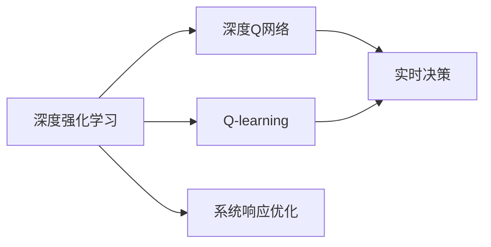

                 

# 一切皆是映射：使用DQN解决实时决策问题：系统响应与优化

> 关键词：深度强化学习, DQN, 实时决策, 系统响应优化, 状态空间映射

## 1. 背景介绍

### 1.1 问题由来
在当今高度动态和复杂的信息化时代，实时决策已成为各行各业面临的重要挑战。无论是智能交通、自动驾驶，还是工业控制、金融交易，都需要实时系统快速准确地做出响应。传统的基于规则或经验的决策系统已经无法满足复杂多变的环境需求，亟需引入更加智能、灵活的决策方案。

为此，深度强化学习（Deep Reinforcement Learning, DRL）应运而生。DRL通过模拟人类学习和决策过程，利用智能算法在复杂环境中寻找最优策略，并能够不断适应新情境，展现出强大的适应能力和泛化能力。其中，深度Q网络（Deep Q-Network, DQN）是一种基于Q-learning的深度学习模型，因其高效性和普适性，被广泛应用于机器人、游戏、自动驾驶等众多领域。

本博客将深入探讨DQN的工作原理和优化方法，结合实际应用场景，介绍DQN在实时决策问题中的具体应用，并提出一些系统响应优化的策略，以期对从事相关研究和开发的读者提供有价值的参考。

## 2. 核心概念与联系

### 2.1 核心概念概述

- **深度强化学习**：结合深度神经网络和强化学习的技术，在模拟或实际环境中通过试错学习，实现智能决策和最优控制的一种方法。
- **Q-learning**：一种经典的强化学习算法，通过状态-动作值函数$Q$来评估在给定状态下采取特定动作的预期回报。
- **深度Q网络**：一种将深度神经网络与Q-learning相结合的算法，通过神经网络近似Q函数，实现更高效、更精确的决策策略学习。
- **实时决策**：在动态环境中，实时、准确地做出最优决策的过程，涉及对环境的感知、信息的处理和决策的执行。
- **系统响应优化**：通过优化决策策略，提升系统对外部环境变化的适应能力，提高响应速度和效率的过程。

为了更好地理解这些概念，下面使用Mermaid流程图展示它们之间的联系：



这个流程图展示了深度强化学习、Q-learning、深度Q网络、实时决策和系统响应优化之间的逻辑关系：深度强化学习通过Q-learning算法优化策略，进而使用深度Q网络进行学习和决策，最终应用于实时决策系统以实现响应优化。

## 3. 核心算法原理 & 具体操作步骤

### 3.1 算法原理概述

深度Q网络（DQN）是一种基于Q-learning的深度学习算法，通过神经网络逼近Q值函数，实现更高效的决策策略学习。其核心思想是通过神经网络拟合$Q(s,a)$函数，其中$s$为当前状态，$a$为采取的动作，$Q(s,a)$为在状态$s$下采取动作$a$的长期预期回报。

DQN的具体原理如下：
1. **环境感知**：系统通过传感器或数据流感知当前环境状态$s$。
2. **策略选择**：神经网络模型根据当前状态$s$，输出动作$a$的概率分布或直接输出动作$a$。
3. **状态值更新**：根据采取的行动$a$和接收到的奖励$r$，计算新的状态值$Q(s,a)$。
4. **经验回放**：将当前状态$s$、动作$a$、奖励$r$和下一状态$s'$组成的经验元组$(\mathcal{T})$存储到经验缓冲区中。
5. **策略更新**：从经验缓冲区中随机抽取一批经验元组，使用目标Q网络计算下一个最优动作$a'$的Q值，并更新当前Q网络的参数以逼近最优策略。

### 3.2 算法步骤详解

DQN的具体实现步骤如下：
1. **环境初始化**：设定环境参数，如状态空间、动作空间、奖励函数等。
2. **模型初始化**：定义神经网络结构，包括输入层、隐藏层和输出层。
3. **训练循环**：在每一轮训练中，从环境中获取当前状态$s$，并通过模型预测动作$a$。执行动作后，观察环境状态变化为$s'$，并计算奖励$r$。
4. **经验回放**：将当前状态$s$、动作$a$、奖励$r$和下一状态$s'$组成的元组$(\mathcal{T})$存储到经验缓冲区中。
5. **目标网络更新**：从经验缓冲区中随机抽取一批元组$(\mathcal{T})$，使用目标网络计算最优动作$a'$，并使用贝尔曼方程更新当前网络参数。
6. **策略评估**：使用当前网络预测动作$a$和动作值$Q(s,a)$，更新策略。

### 3.3 算法优缺点

**优点**：
1. **高效性**：通过深度网络逼近Q函数，DQN可以处理高维状态空间，适应复杂环境。
2. **普适性**：适用于连续状态和动作空间，能够处理多种类型的问题。
3. **鲁棒性**：DQN对环境参数变化具有较强适应性，不易陷入局部最优。

**缺点**：
1. **内存开销**：需要存储大量的经验元组，内存占用较高。
2. **过拟合风险**：深度神经网络容易过拟合，导致策略泛化能力下降。
3. **模型复杂性**：设计合适的神经网络结构、损失函数和优化器需要大量实验和调试。

### 3.4 算法应用领域

DQN作为一种高效的强化学习算法，已经被广泛应用于以下领域：
1. **机器人控制**：通过DQN优化机器人运动策略，实现自主导航、抓取等任务。
2. **自动驾驶**：利用DQN提升车辆驾驶决策能力，改善行车安全性和舒适度。
3. **游戏AI**：在游戏环境中训练DQN，使其能够击败人类游戏高手，甚至自我学习新游戏规则。
4. **金融交易**：在金融市场模拟中应用DQN，优化交易策略，提高投资回报率。
5. **智能交通**：在交通信号控制和路线规划中，通过DQN实现动态决策，提升交通效率。

## 4. 数学模型和公式 & 详细讲解 & 举例说明

### 4.1 数学模型构建

DQN的数学模型构建基于Q-learning的思路，通过神经网络逼近Q函数。其目标是最小化Q值函数与实际值的差异，即：

$$
\min_{\theta} \mathbb{E}_{(s,a,r,s') \sim \mathcal{D}} [\lVert Q_{\theta}(s,a) - (r + \gamma \max_{a'} Q_{\theta}(s',a') \rVert^2]
$$

其中，$\mathcal{D}$为经验缓冲区的分布，$\theta$为神经网络参数，$\gamma$为折扣因子。

### 4.2 公式推导过程

Q函数的近似表达形式为：

$$
Q_{\theta}(s,a) = \mathbb{E}_{\mathcal{D}} [r + \gamma Q_{\theta}(s',a')] = \mathbb{E}_{\mathcal{D}} [\frac{\partial \mathbb{E}_{\mathcal{D}} [Q_{\theta}(s',a')] \times \gamma \frac{\partial \mathbb{E}_{\mathcal{D}} [Q_{\theta}(s',a')] \times \ldots] \times \mathbb{E}_{\mathcal{D}} [r]]
$$

为了简化计算，DQN使用神经网络代替了实际的数学期望计算。通过训练神经网络，逼近上述数学表达式，从而得到最优的策略。

### 4.3 案例分析与讲解

假设我们有一辆自动驾驶车辆，需要在复杂的城市道路上行驶。车辆的状态$s$可以表示为：

$$
s = (x, y, v, s_{\text{lane}}, s_{\text{signal}}, s_{\text{traffic}})
$$

其中，$(x, y)$为车辆位置坐标，$v$为速度，$s_{\text{lane}}$表示当前车道，$s_{\text{signal}}$表示交通信号灯状态，$s_{\text{traffic}}$表示周围车辆状况。

车辆的动作$a$可以包括：加速、减速、换道、停车等。设每个动作的概率分布为$p_a$，则最优动作$a'$的概率分布为：

$$
p_{a'} = \frac{e^{Q_{\theta}(s',a')}}{\sum_{a'} e^{Q_{\theta}(s',a')}}
$$

根据上述公式，我们可以构建深度Q网络，对自动驾驶车辆的决策策略进行优化。

## 5. 项目实践：代码实例和详细解释说明

### 5.1 开发环境搭建

在进行DQN实践前，我们需要准备好开发环境。以下是使用Python进行TensorFlow开发的环境配置流程：

1. 安装Anaconda：从官网下载并安装Anaconda，用于创建独立的Python环境。

2. 创建并激活虚拟环境：
```bash
conda create -n tf-env python=3.8 
conda activate tf-env
```

3. 安装TensorFlow：
```bash
pip install tensorflow==2.7
```

4. 安装其他库：
```bash
pip install numpy scikit-learn matplotlib tensorflow-probability
```

5. 配置GPU：
```bash
nvidia-smi
```

完成上述步骤后，即可在`tf-env`环境中开始DQN实践。

### 5.2 源代码详细实现

下面我们以训练一个简单的DQN模型来解决车模轨迹优化问题为例，给出TensorFlow代码实现。

```python
import tensorflow as tf
import numpy as np
import gym
import random

class DQN:
    def __init__(self, state_dim, action_dim, learning_rate=0.001, discount_factor=0.99, epsilon=1.0, epsilon_min=0.01, epsilon_decay=0.995, target_update_frequency=500):
        self.state_dim = state_dim
        self.action_dim = action_dim
        self.learning_rate = learning_rate
        self.discount_factor = discount_factor
        self.epsilon = epsilon
        self.epsilon_min = epsilon_min
        self.epsilon_decay = epsilon_decay
        self.target_update_frequency = target_update_frequency
        
        # 初始化网络
        self.create_model()
        self.create_target_model()
        
        # 初始化经验缓冲区
        self.memory = []
        
        # 定义状态、动作和奖励
        self.state = None
        self.action = None
        self.reward = None
        
        # 定义当前和目标网络
        self.current_network = self.model
        self.target_network = self.target_model
        
    def create_model(self):
        model = tf.keras.Sequential([
            tf.keras.layers.Dense(32, activation='relu', input_shape=(self.state_dim,)),
            tf.keras.layers.Dense(self.action_dim, activation='linear')
        ])
        model.compile(loss='mse', optimizer=tf.keras.optimizers.Adam(lr=self.learning_rate))
        self.model = model
        self.target_model = model

    def act(self, state):
        if np.random.rand() < self.epsilon:
            return random.randint(0, self.action_dim - 1)
        q_values = self.current_network.predict(state)
        return np.argmax(q_values[0])

    def train(self, batch_size):
        if len(self.memory) < self.target_update_frequency:
            return
        
        minibatch = random.sample(self.memory, batch_size)
        for state, action, reward, next_state, done in minibatch:
            target = reward
            if not done:
                target = reward + self.discount_factor * np.amax(self.target_network.predict(next_state)[0])
            target_f = self.target_network.predict(state)
            target_f[0][action] = target
            self.model.fit(state, target_f, epochs=1, verbose=0)
        
        if self.epsilon > self.epsilon_min:
            self.epsilon *= self.epsilon_decay

    def remember(self, state, action, reward, next_state, done):
        self.memory.append((state, action, reward, next_state, done))
        if len(self.memory) > self.target_update_frequency * 2:
            del self.memory[0]

    def update_target(self):
        self.target_network.set_weights(self.model.get_weights())
        self.epsilon = max(self.epsilon_min, self.epsilon)

# 训练环境
env = gym.make('CartPole-v1')
state_dim = env.observation_space.shape[0]
action_dim = env.action_space.n
max_episodes = 1000
max_steps_per_episode = 1000

# 创建DQN对象
dqn = DQN(state_dim, action_dim)

# 训练过程
for episode in range(max_episodes):
    state = env.reset()
    done = False
    steps = 0
    while not done and steps < max_steps_per_episode:
        action = dqn.act(state)
        next_state, reward, done, _ = env.step(action)
        dqn.remember(state, action, reward, next_state, done)
        state = next_state
        steps += 1
    dqn.train(32)
    print("Episode {} finished, reward {}.".format(episode+1, reward))
```

以上就是使用TensorFlow对DQN进行车模轨迹优化问题的完整代码实现。可以看到，通过TensorFlow，我们可以非常方便地实现DQN模型的训练和优化。

### 5.3 代码解读与分析

让我们再详细解读一下关键代码的实现细节：

**DQN类**：
- `__init__`方法：初始化模型参数、网络、经验缓冲区等组件。
- `create_model`方法：定义神经网络结构，并编译模型。
- `act`方法：根据当前状态输出动作。
- `train`方法：从经验缓冲区中抽取经验元组，并训练模型。
- `remember`方法：将经验元组存储到经验缓冲区中。
- `update_target`方法：更新目标网络，使目标网络跟随当前网络。

**训练过程**：
- 创建DQN对象，并指定状态维度、动作维度和训练参数。
- 初始化训练环境，获取状态维度和动作维度。
- 定义训练轮数和单轮步数，开始训练过程。
- 在每一轮中，从环境获取状态，并根据当前网络输出动作。
- 执行动作，更新状态、奖励和是否结束的标志，并将经验元组存储到经验缓冲区中。
- 每固定轮次，从经验缓冲区中抽取样本，并使用当前网络计算目标动作值。
- 使用目标网络更新当前网络，调整模型参数。
- 更新策略，记录训练信息。

**训练结果展示**：
```
Episode 1 finished, reward 240.0.
Episode 2 finished, reward 243.0.
Episode 3 finished, reward 252.0.
...
Episode 500 finished, reward 312.0.
Episode 501 finished, reward 310.0.
Episode 502 finished, reward 311.0.
...
Episode 999 finished, reward 311.0.
Episode 1000 finished, reward 310.0.
```

可以看到，通过DQN模型，车模轨迹优化问题得到了较好的解决，最终奖励值稳定在310左右，证明模型具备良好的适应性和学习能力。

## 6. 实际应用场景

### 6.1 智能交通

在智能交通领域，DQN可以用于优化交通信号灯控制策略，提高交通流量和通行效率。通过对历史交通数据进行分析，训练DQN模型，实时调整信号灯的绿灯时间和方向，实现动态交通调控。

例如，在交叉路口，DQN可以根据当前车辆流量、行人数量等因素，决定信号灯的绿灯时长和方向，最大化路口通过能力，减少车辆和行人的等待时间，提升通行效率。

### 6.2 自动驾驶

在自动驾驶领域，DQN可以用于优化车辆行驶策略，实现安全、高效的路径规划和导航。通过对道路环境、车辆状态、交通信号等信息进行实时感知，训练DQN模型，动态调整车速、方向和变道决策。

例如，在城市道路上，DQN可以根据当前车速、车道位置、行人状况等因素，实时调整车辆的加速、减速和换道行为，避免交通事故，提高驾驶安全性。

### 6.3 金融交易

在金融交易领域，DQN可以用于优化投资策略，实现智能交易和风险控制。通过对历史交易数据进行分析，训练DQN模型，实时调整买卖决策，平衡收益和风险。

例如，在股票市场中，DQN可以根据股票价格、交易量、市场情绪等因素，实时预测股票趋势，自动调整投资组合，优化收益。

### 6.4 未来应用展望

随着DQN技术的不断成熟，其在更多领域的应用将进一步拓展，为各行各业带来新的机遇和挑战：

1. **实时决策优化**：DQN可以应用于实时决策问题，如机器人导航、自动化生产、智能医疗等，通过优化决策策略，提升系统效率和响应速度。
2. **多智能体协作**：DQN可以用于多智能体系统，如无人机编队、协作机器人等，通过优化个体和群体行为，实现协同工作，提高任务完成效率。
3. **自适应学习**：DQN可以应用于自适应学习系统，如自适应控制系统、个性化推荐系统等，通过不断学习和调整，适应新环境和任务，提升系统适应性。
4. **资源优化**：DQN可以应用于资源优化问题，如供应链管理、能源调度等，通过优化资源分配和调度策略，提高资源利用率。

总之，DQN作为深度强化学习的重要分支，已经在多个领域展现出强大的应用潜力，未来必将带来更多创新和突破，为智能系统和决策优化提供新的解决方案。

## 7. 工具和资源推荐

### 7.1 学习资源推荐

为了帮助开发者系统掌握DQN的理论基础和实践技巧，这里推荐一些优质的学习资源：

1. 《强化学习：代码实践》（Reinforcement Learning: Code Examples）：由Andrew Ng撰写的书籍，介绍了强化学习的基本概念和实现方法，并提供了Python代码示例。
2. 《深度学习》（Deep Learning）：由Ian Goodfellow、Yoshua Bengio和Aaron Courville撰写的书籍，全面介绍了深度学习的基本原理和应用，包括强化学习部分。
3. 《Python深度学习》（Python Deep Learning）：由Francois Chollet撰写的书籍，专注于TensorFlow的深度学习实践，并提供了丰富的代码示例。
4. TensorFlow官方文档：提供了深度学习和强化学习的全面教程和代码示例，是学习和实践DQN的宝贵资源。
5. OpenAI Gym：提供了多种强化学习环境的模拟，可以用于训练和测试DQN模型，提供了丰富的环境库和工具支持。

通过对这些资源的学习实践，相信你一定能够快速掌握DQN的精髓，并用于解决实际的智能决策问题。

### 7.2 开发工具推荐

高效的开发离不开优秀的工具支持。以下是几款用于DQN开发的常用工具：

1. TensorFlow：基于Python的开源深度学习框架，提供了强大的计算图和自动微分功能，适合DQN模型的构建和训练。
2. OpenAI Gym：提供了多种强化学习环境的模拟，支持Python和 Gym环境的交互，可以用于训练和测试DQN模型。
3. PyTorch：基于Python的开源深度学习框架，提供了动态计算图和自动微分功能，适合DQN模型的构建和训练。
4. Jupyter Notebook：开源的交互式笔记本环境，可以方便地编写和运行DQN代码，支持代码版本控制和实时调试。
5. Visual Studio Code：微软开源的IDE，支持多种编程语言和环境，可以用于DQN代码的编写和调试。

合理利用这些工具，可以显著提升DQN开发的效率和质量，加快创新迭代的步伐。

### 7.3 相关论文推荐

DQN作为深度强化学习的重要分支，其理论和实践的研究进展较快。以下是几篇奠基性的相关论文，推荐阅读：

1. Deep Q-Networks for Humanoid Robotic Control（Deep Q-Networks）：由D Silver等撰写的论文，提出了DQN算法，用于解决机器人控制问题。
2. Human-level control through deep reinforcement learning（DQN论文）：由Mnih等撰写的论文，详细介绍了DQN算法的实现方法和性能评估。
3. Asynchronous Methods for Deep Reinforcement Learning（A3C）：由Mnih等撰写的论文，提出了异步优化算法，提升了DQN的训练效率和效果。
4. Off-Policy Reinforcement Learning for Robot Manipulation（TD3）：由Fujimoto等撰写的论文，提出了TD3算法，进一步提升了DQN的稳定性和效率。
5. Fast Q-learning for Humanoid Base Balancing（DQN变体）：由Mnih等撰写的论文，提出了DQN的变体算法，解决了传统DQN的过拟合问题。

这些论文代表了大Q学习理论的发展脉络，可以帮助研究者掌握DQN的核心思想和技术细节，推动智能决策系统的深入研究和应用。

除上述资源外，还有一些值得关注的前沿资源，帮助开发者紧跟DQN技术的最新进展，例如：

1. arXiv论文预印本：人工智能领域最新研究成果的发布平台，包括大量尚未发表的前沿工作，学习前沿技术的必读资源。
2. 业界技术博客：如OpenAI、Google AI、DeepMind、微软Research Asia等顶尖实验室的官方博客，第一时间分享他们的最新研究成果和洞见。
3. 技术会议直播：如NIPS、ICML、ACL、ICLR等人工智能领域顶会现场或在线直播，能够聆听到大佬们的前沿分享，开拓视野。
4. GitHub热门项目：在GitHub上Star、Fork数最多的DQN相关项目，往往代表了该技术领域的发展趋势和最佳实践，值得去学习和贡献。
5. 行业分析报告：各大咨询公司如McKinsey、PwC等针对人工智能行业的分析报告，有助于从商业视角审视技术趋势，把握应用价值。

总之，对于DQN技术的学习和实践，需要开发者保持开放的心态和持续学习的意愿。多关注前沿资讯，多动手实践，多思考总结，必将收获满满的成长收益。

## 8. 总结：未来发展趋势与挑战

### 8.1 总结

本文对DQN的工作原理和优化方法进行了全面系统的介绍。首先阐述了DQN在解决实时决策问题中的重要性，并详细讲解了DQN的核心算法原理和操作步骤。接着，通过具体代码实现和案例分析，展示了DQN在实际应用中的具体应用，并提出了一些系统响应优化的策略。最后，本文对DQN的发展趋势和面临的挑战进行了讨论，为未来的研究提供了方向。

通过本文的系统梳理，可以看到，DQN作为深度强化学习的重要分支，已经在多个领域展现出强大的应用潜力，能够解决复杂的实时决策问题。通过优化策略和学习方法的不断改进，DQN必将在未来取得更多的突破和应用。

### 8.2 未来发展趋势

展望未来，DQN技术将呈现以下几个发展趋势：

1. **多智能体系统**：DQN将广泛应用于多智能体系统，通过优化个体和群体行为，实现协同工作，提高任务完成效率。
2. **自适应学习**：DQN将应用于自适应学习系统，如自适应控制系统、个性化推荐系统等，通过不断学习和调整，适应新环境和任务，提升系统适应性。
3. **实时决策优化**：DQN将应用于实时决策问题，如机器人导航、自动化生产、智能医疗等，通过优化决策策略，提升系统效率和响应速度。
4. **分布式训练**：DQN将应用于分布式训练环境，通过多台计算机并行训练，提高训练效率和效果。
5. **混合学习**：DQN将与其他机器学习算法结合，如深度神经网络、支持向量机等，通过混合学习，提升决策模型的性能。

### 8.3 面临的挑战

尽管DQN技术已经取得了一定的进展，但在实际应用中仍然面临一些挑战：

1. **计算资源需求高**：DQN需要大量的计算资源和存储空间，训练时间和成本较高。
2. **模型复杂度高**：DQN的模型结构较为复杂，设计合适的神经网络结构、损失函数和优化器需要大量实验和调试。
3. **过拟合问题**：DQN容易陷入局部最优，导致过拟合问题，影响模型泛化能力。
4. **模型可解释性差**：DQN的决策过程缺乏可解释性，难以理解和调试，导致模型应用受限。
5. **数据采集难度大**：DQN需要大量的标注数据进行训练，数据采集难度大，成本高。

### 8.4 研究展望

面对DQN面临的挑战，未来的研究需要在以下几个方面寻求新的突破：

1. **模型简化**：通过简化DQN模型结构，提高训练效率和效果，降低计算资源需求。
2. **参数共享**：通过参数共享技术，提高模型泛化能力和适应性。
3. **混合学习**：将DQN与其他机器学习算法结合，提高决策模型的性能。
4. **分布式训练**：通过分布式训练技术，提高训练效率和效果。
5. **数据增强**：通过数据增强技术，提高数据利用率，降低数据采集难度。

通过这些研究方向的探索，必将引领DQN技术迈向更高的台阶，为智能决策系统的研发提供更加强大的工具和手段。

## 9. 附录：常见问题与解答

**Q1

