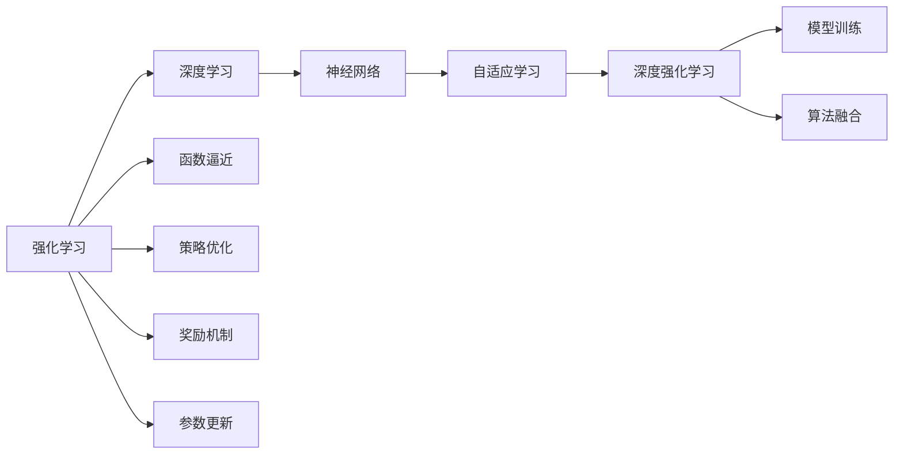
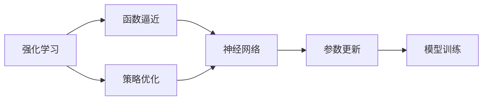
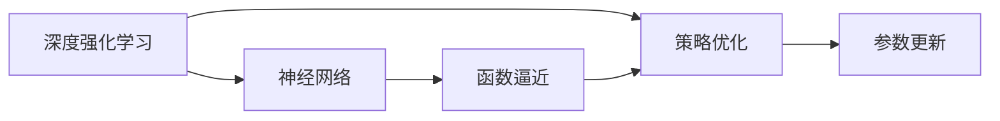
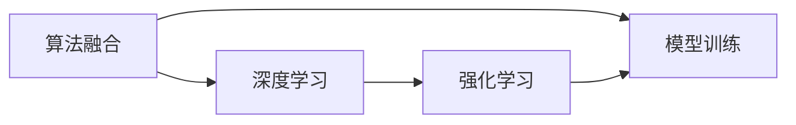
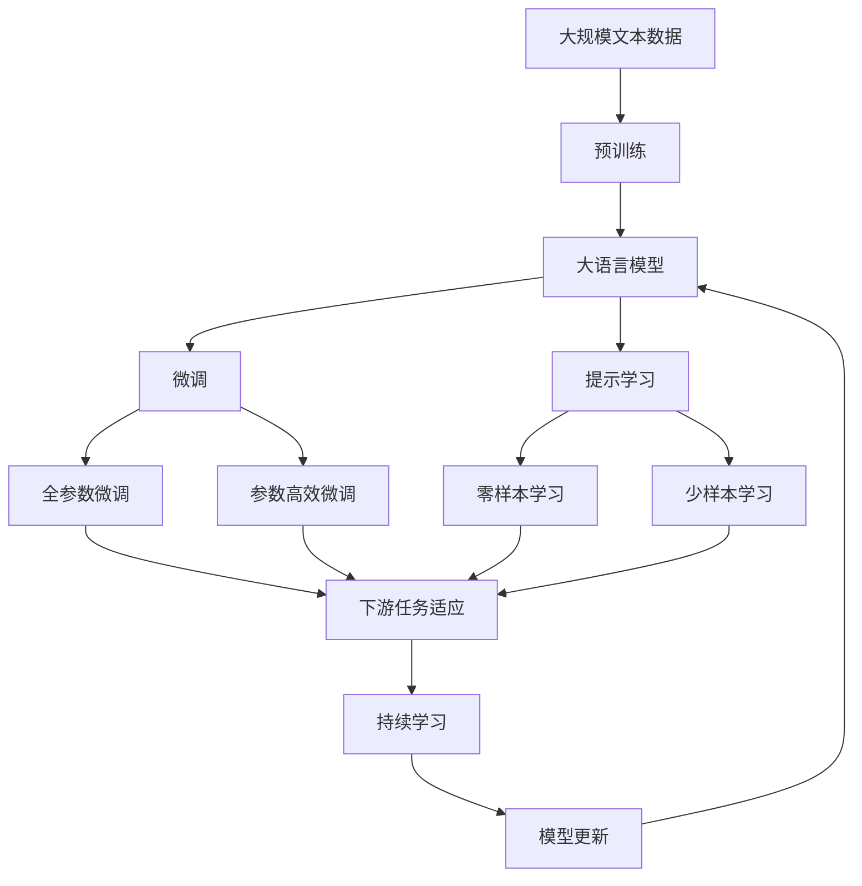

                 

# 一切皆是映射：强化学习基础及其与深度学习的结合

> 关键词：强化学习, 深度学习, 函数逼近, 策略优化, 奖励机制, 参数更新, 神经网络, 自适应学习, 深度强化学习, 模型训练, 算法融合, 应用场景, 复杂环境

## 1. 背景介绍

### 1.1 问题由来
强化学习（Reinforcement Learning, RL）作为人工智能领域的一支重要分支，近年来在智能决策、游戏求解、机器人控制等领域取得了显著成果。与传统的监督学习和无监督学习不同，强化学习通过与环境的互动，以试错的方式学习和优化策略，从而实现目标任务。然而，传统的强化学习算法往往需要耗费大量的实验调参和计算资源，难以应用于复杂的实际问题。

深度学习的兴起，为强化学习提供了全新的视角和工具。通过将深度神经网络应用于策略表示和优化，深度强化学习（Deep Reinforcement Learning, DRL）不仅提升了学习效率，还大大增强了算法的泛化能力。这种融合大大拓展了强化学习的应用边界，使其能够更好地应对现实世界中的各种复杂环境。

### 1.2 问题核心关键点
深度强化学习之所以能取得突破，主要得益于以下几点：

- 深度神经网络的强大表达能力。深度网络可以逼近任意函数，能够表示更复杂的策略和环境动态。
- 强化学习的试错机制。通过与环境的不断交互，深度模型能够从错误中学习，快速逼近最优策略。
- 参数共享与优化。深度学习模型的参数可以共享，优化目标函数更加高效。
- 批量训练与样本丰富性。深度模型可以从大量历史数据中学习，有效避免过拟合。

然而，尽管深度强化学习取得了诸多成功，仍面临一些关键挑战：

- 计算资源需求大。深度学习模型参数众多，训练和推理需要大量GPU资源。
- 样本效率低。在有限标注样本下，深度模型容易过拟合，泛化能力不足。
- 策略优化困难。深度模型的非凸性和复杂性使得优化过程非常困难，容易陷入局部最优。
- 数据标注成本高。实际应用中，高质量标注数据获取成本高昂，限制了深度强化学习的应用范围。

解决上述问题需要理论和算法上的双重突破。本文将深入探讨强化学习基础及其与深度学习的结合，通过函数逼近和策略优化等核心概念，详细阐述其原理和操作步骤。

## 2. 核心概念与联系

### 2.1 核心概念概述

为了更好地理解深度强化学习的原理，本节将介绍几个密切相关的核心概念：

- 强化学习：一种通过与环境互动，利用奖励信号优化策略的学习范式。核心目标是最大化长期累积奖励。
- 深度学习：一类通过深度神经网络逼近复杂非线性函数的技术，广泛应用于图像识别、语音识别、自然语言处理等领域。
- 函数逼近：通过深度神经网络将实际问题表示为数学函数的过程。在强化学习中，函数逼近用于表示策略和环境动态。
- 策略优化：通过深度学习网络优化策略的过程。在强化学习中，策略优化是实现长期累积奖励最大化的关键步骤。
- 奖励机制：用于衡量策略效果的指标，通常为长期累积奖励。奖励机制的设计对于优化策略至关重要。
- 参数更新：深度学习模型的参数调整过程。在强化学习中，参数更新用于优化策略表示。
- 神经网络：一类由多层神经元构成的深度学习模型。在强化学习中，神经网络用于逼近策略和环境动态。
- 自适应学习：能够根据环境变化自动调整策略的学习机制。在深度强化学习中，自适应学习机制可以提升算法的鲁棒性和泛化能力。
- 深度强化学习：将深度神经网络应用于强化学习中的策略表示和优化，提升学习效率和泛化能力。
- 模型训练：使用历史数据训练深度学习模型的过程。在强化学习中，模型训练用于优化策略。
- 算法融合：将深度学习算法与强化学习算法相结合，提升学习能力和应用效果。

这些核心概念之间的逻辑关系可以通过以下Mermaid流程图来展示：



这个流程图展示了大语言模型的核心概念及其之间的关系：

1. 强化学习通过函数逼近、策略优化和参数更新等步骤，不断调整策略，以最大化长期累积奖励。
2. 深度学习利用神经网络逼近复杂函数，提升函数逼近的精度。
3. 自适应学习机制使得深度强化学习能够根据环境变化自动调整策略。
4. 模型训练和算法融合则进一步优化深度强化学习的性能。

这些核心概念共同构成了深度强化学习的学习框架，使其能够有效地应对各种复杂环境，提升决策能力。通过理解这些核心概念，我们可以更好地把握深度强化学习的工作原理和优化方向。

### 2.2 概念间的关系

这些核心概念之间存在着紧密的联系，形成了深度强化学习的完整生态系统。下面我通过几个Mermaid流程图来展示这些概念之间的关系。

#### 2.2.1 强化学习的学习范式



这个流程图展示了强化学习的基本学习范式，即通过函数逼近、策略优化和参数更新，不断调整策略以最大化长期累积奖励。

#### 2.2.2 深度强化学习的组成



这个流程图展示了深度强化学习的组成，即通过神经网络逼近函数，并使用策略优化和参数更新来优化策略。

#### 2.2.3 算法融合的范式



这个流程图展示了算法融合的基本范式，即将深度学习算法与强化学习算法相结合，通过模型训练进一步优化深度强化学习的性能。

### 2.3 核心概念的整体架构

最后，我们用一个综合的流程图来展示这些核心概念在大语言模型微调过程中的整体架构：



这个综合流程图展示了从预训练到微调，再到持续学习的完整过程。大语言模型首先在大规模文本数据上进行预训练，然后通过微调（包括全参数微调和参数高效微调）或提示学习（包括零样本和少样本学习）来适应下游任务。最后，通过持续学习技术，模型可以不断更新和适应新的任务和数据。 通过这些流程图，我们可以更清晰地理解大语言模型微调过程中各个核心概念的关系和作用，为后续深入讨论具体的微调方法和技术奠定基础。

## 3. 核心算法原理 & 具体操作步骤
### 3.1 算法原理概述

深度强化学习的基本原理是将强化学习中的策略表示和优化过程，通过深度神经网络进行实现。核心目标是最大化长期累积奖励，即找到一个策略 $ \pi $，使得在每一步 $ t $ 中，该策略产生的期望累积奖励最大：

$$
\max_{\pi} \mathbb{E}\left[\sum_{t=0}^{\infty} \gamma^t r_t \right]
$$

其中 $ r_t $ 表示在时间步 $ t $ 的即时奖励，$ \gamma $ 为折扣因子，控制未来奖励的权重。

在深度强化学习中，策略 $ \pi $ 通常表示为深度神经网络的输出，即：

$$
\pi(a|s) = \sigma(\theta^T f(s))
$$

其中 $ \sigma $ 为激活函数，$ \theta $ 为模型参数，$ f(s) $ 为策略网络的表示函数。在策略优化过程中，需要最小化策略 $ \pi $ 与环境动态之间的差距，使得策略在每一步 $ t $ 中产生的即时奖励最大：

$$
\min_{\theta} \mathbb{E}\left[\sum_{t=0}^{\infty} \gamma^t r_t - \theta^T f(s) \right]
$$

上述优化问题可以转化为求解损失函数 $ \mathcal{L}(\theta) $：

$$
\mathcal{L}(\theta) = \mathbb{E}\left[\sum_{t=0}^{\infty} \gamma^t (r_t - \theta^T f(s_t)) \right]
$$

其中 $ s_t $ 表示在时间步 $ t $ 的状态。

### 3.2 算法步骤详解

深度强化学习的核心算法步骤如下：

**Step 1: 准备环境与数据**

- 选择环境（如游戏、机器人控制等），设计合适的奖励函数。
- 收集足够的训练数据（如游戏截图、动作记录等），并标注每个数据点对应的奖励。
- 初始化深度神经网络模型，设置合适的超参数，如学习率、批大小等。

**Step 2: 训练深度模型**

- 使用深度神经网络逼近策略函数 $ f $，通常使用卷积神经网络、循环神经网络等结构。
- 使用训练数据对深度模型进行训练，优化参数 $ \theta $ 以最小化损失函数 $ \mathcal{L}(\theta) $。
- 迭代更新模型参数，直到收敛或达到预设的训练轮数。

**Step 3: 策略优化**

- 在训练数据集上使用策略优化算法，如策略梯度方法（Policy Gradient Methods）、蒙特卡罗方法（Monte Carlo Methods）、优势演员-评论家方法（Actor-Critic Methods）等。
- 通过迭代更新模型参数 $ \theta $，优化策略 $ \pi $ 以最大化长期累积奖励。
- 使用正则化技术，如L2正则、Dropout等，防止过拟合。

**Step 4: 模型评估**

- 使用验证数据集评估训练好的模型性能，计算平均累积奖励。
- 调整模型参数，重新训练，直到达到最优性能。
- 使用测试数据集进一步验证模型效果，确保模型的泛化能力。

**Step 5: 模型部署**

- 将训练好的模型部署到实际应用中，如游戏AI、机器人控制等。
- 监控模型的性能，及时调整策略和参数，确保模型稳定运行。

以上是深度强化学习的基本算法步骤。在实际应用中，还需要针对具体任务和环境进行优化设计，如改进奖励函数设计，引入更多正则化技术，搜索最优的超参数组合等，以进一步提升模型性能。

### 3.3 算法优缺点

深度强化学习算法具有以下优点：

1. 高效逼近策略。深度神经网络能够逼近任意函数，可以表示更复杂的策略和环境动态，提升学习效率。
2. 泛化能力强。深度模型可以从大量历史数据中学习，有效避免过拟合，提升泛化能力。
3. 鲁棒性强。深度强化学习算法可以应对各种复杂环境，具有较好的鲁棒性和适应性。
4. 模型可解释性高。深度模型可以借助符号化解释技术，如模型蒸馏、特征重要性分析等，提升可解释性。

同时，该算法也存在一些局限性：

1. 计算资源需求大。深度模型参数众多，训练和推理需要大量GPU资源。
2. 样本效率低。在有限标注样本下，深度模型容易过拟合，泛化能力不足。
3. 策略优化困难。深度模型的非凸性和复杂性使得优化过程非常困难，容易陷入局部最优。
4. 数据标注成本高。实际应用中，高质量标注数据获取成本高昂，限制了深度强化学习的应用范围。

尽管存在这些局限性，但深度强化学习算法在解决复杂决策问题上已取得了显著成果，未来仍有广阔的发展空间。

### 3.4 算法应用领域

深度强化学习算法在众多领域中得到了广泛应用，具体包括：

- 游戏AI：通过强化学习训练游戏AI，使其能够在复杂游戏中战胜人类选手。
- 机器人控制：通过强化学习训练机器人，使其能够自主执行各种复杂的动作。
- 自动驾驶：通过强化学习训练自动驾驶系统，使其能够在复杂交通环境中安全行驶。
- 金融交易：通过强化学习训练交易系统，使其能够在复杂市场中做出合理决策。
- 医疗诊断：通过强化学习训练医疗诊断系统，使其能够在复杂医疗数据中做出正确诊断。
- 自然语言处理：通过强化学习训练对话系统、翻译系统等，使其能够自然流畅地进行交流。
- 能源优化：通过强化学习训练能源优化系统，使其能够在复杂能源系统中做出最优决策。

除了上述这些领域，深度强化学习还在更多领域展现出其强大的应用潜力，未来将有更多的实际应用场景涌现。

## 4. 数学模型和公式 & 详细讲解 & 举例说明

### 4.1 数学模型构建

本节将使用数学语言对深度强化学习的原理进行更加严格的刻画。

记深度强化学习模型为 $ M_{\theta} $，其中 $ \theta $ 为模型参数。假设环境动态为 $ S_t $，策略为 $ \pi(a|s) $，即时奖励为 $ r_t $，折扣因子为 $ \gamma $。定义深度强化学习模型的损失函数为：

$$
\mathcal{L}(\theta) = \mathbb{E}\left[\sum_{t=0}^{\infty} \gamma^t (r_t - Q_{\theta}(s_t,a_t)) \right]
$$

其中 $ Q_{\theta} $ 为深度模型的状态-动作价值函数，表示在状态 $ s $ 下，执行动作 $ a $ 的长期累积奖励。

在策略优化过程中，需要最大化策略 $ \pi $ 与环境动态之间的差异，使得策略在每一步 $ t $ 中产生的即时奖励最大。常用的策略优化算法包括：

1. 策略梯度方法（Policy Gradient Methods）：通过直接优化策略 $ \pi $，最大化长期累积奖励。
2. Monte Carlo方法（Monte Carlo Methods）：通过采样策略 $ \pi $ 的轨迹，计算每一步的累积奖励，优化策略 $ \pi $。
3. 优势演员-评论家方法（Actor-Critic Methods）：将策略优化和价值函数学习分开进行，提高学习效率。

### 4.2 公式推导过程

以下我们以优势演员-评论家方法为例，推导其基本公式。

定义策略 $ \pi(a|s) $ 和价值函数 $ Q_{\theta}(s,a) $，则优势函数 $ A_{\theta}(s,a) $ 定义为：

$$
A_{\theta}(s,a) = Q_{\theta}(s,a) - V_{\theta}(s)
$$

其中 $ V_{\theta}(s) $ 为状态值函数，表示在状态 $ s $ 下的期望累积奖励。

目标是最小化优势函数 $ A_{\theta}(s,a) $ 的平方误差，即：

$$
\min_{\theta} \mathbb{E}\left[\left(A_{\theta}(s,a)\right)^2 \right]
$$

通过上述推导，我们可以看到，优势演员-评论家方法通过同时优化策略和价值函数，可以更好地平衡两者之间的关系，提升学习效率。

### 4.3 案例分析与讲解

为了更好地理解深度强化学习的原理，下面以AlphaGo为例，详细讲解其核心算法过程。

AlphaGo使用深度强化学习算法，通过神经网络逼近策略和价值函数。具体步骤如下：

1. 环境初始化：将围棋棋盘状态作为输入，初始化神经网络模型 $ \theta $。
2. 策略选择：通过神经网络模型输出策略 $ \pi(a|s) $，选择下一个动作 $ a $。
3. 环境执行：将动作 $ a $ 执行到环境中，获取当前状态 $ s' $ 和即时奖励 $ r $。
4. 价值评估：通过神经网络模型输出状态值函数 $ V_{\theta}(s') $。
5. 优势函数计算：计算优势函数 $ A_{\theta}(s,a) $。
6. 策略优化：使用梯度下降算法优化策略 $ \pi $，最大化长期累积奖励。
7. 迭代更新：重复上述步骤，直到收敛。

通过上述过程，AlphaGo能够从大量历史对弈数据中学习，提升围棋水平，并在实际比赛中取得优异成绩。

## 5. 项目实践：代码实例和详细解释说明

### 5.1 开发环境搭建

在进行深度强化学习实践前，我们需要准备好开发环境。以下是使用Python进行TensorFlow开发的环境配置流程：

1. 安装Anaconda：从官网下载并安装Anaconda，用于创建独立的Python环境。

2. 创建并激活虚拟环境：
```bash
conda create -n tf-env python=3.8 
conda activate tf-env
```

3. 安装TensorFlow：根据CUDA版本，从官网获取对应的安装命令。例如：
```bash
pip install tensorflow tensorflow-addons
```

4. 安装TensorBoard：用于可视化模型的训练状态和性能指标。
```bash
pip install tensorboard
```

5. 安装TensorFlow Agents：用于深度强化学习算法的实现。
```bash
pip install tensorflow-agents
```

完成上述步骤后，即可在`tf-env`环境中开始深度强化学习的实践。

### 5.2 源代码详细实现

下面我们以DQN（Deep Q-Network）算法为例，给出使用TensorFlow实现深度强化学习的PyTorch代码实现。

首先，定义DQN算法的核心组件：

```python
import tensorflow as tf
import tensorflow_agents.agents.dqn as dqn_lib
from tensorflow_agents.agents.replay_buffers.replay_buffer import TFUniformReplayBuffer
from tensorflow_agents.agents.networks import convolutional_network
from tensorflow_agents.agents.networks import network
from tensorflow_agents.agents.tf_agents.agents import tf_agent
from tensorflow_agents.agents.tf_agents.agents import dqn_agent
from tensorflow_agents.agents.tf_agents.agents import actor_critic_agent

class DQNAgent(dqn_agent.DQNAgent):
    def __init__(self, env, state_spec, action_spec, num_outputs, network):
        super().__init__(env, state_spec, action_spec, num_outputs, network)
```

然后，定义模型和优化器：

```python
import tensorflow as tf

# 定义网络结构
network = convolutional_network.ConvolutionalNetwork(
    state_spec, num_outputs)

# 定义优化器
optimizer = tf.keras.optimizers.Adam(learning_rate=0.001)

# 定义损失函数
def loss_fn(actions, targets):
    return tf.keras.losses.mean_squared_error(actions, targets)

# 定义训练函数
def train(model, state, action, reward, next_state, done, optimizer, loss_fn):
    with tf.GradientTape() as tape:
        q_value = model(state, action)
        next_q_value = model(next_state, actions)
        target = reward + 0.9 * tf.reduce_max(next_q_value, axis=-1, keepdims=True) * (1 - done)
        loss = loss_fn(q_value, target)
    gradients = tape.gradient(loss, model.trainable_variables)
    optimizer.apply_gradients(zip(gradients, model.trainable_variables))
    return loss
```

最后，启动训练流程：

```python
# 定义环境
env = ...

# 定义网络结构
network = ...

# 定义优化器
optimizer = ...

# 定义损失函数
loss_fn = ...

# 定义训练函数
train = ...

# 创建DQN代理
agent = dqn_agent.DQNAgent(env, state_spec, action_spec, num_outputs, network)

# 定义训练流程
steps_per_train = ...
steps_per_run = ...
steps_per_iteration = ...

for step in range(steps_per_run):
    state = env.reset()
    done = False
    total_reward = 0
    for step in range(steps_per_run):
        action = agent.select_action(state)
        next_state, reward, done, _ = env.step(action)
        total_reward += reward
        loss = train(agent.model, state, action, reward, next_state, done, optimizer, loss_fn)
        state = next_state
        if done:
            break
    print(f"Episode {step+1}, Reward: {total_reward}")
```

以上就是使用TensorFlow实现DQN算法的完整代码实现。可以看到，TensorFlow Agents提供了丰富的深度强化学习算法库，使得算法实现变得简单高效。

### 5.3 代码解读与分析

让我们再详细解读一下关键代码的实现细节：

**DQNAgent类**：
- 继承自TensorFlow Agents的DQNAgent，定义了DQN代理的核心组件。

**网络结构**：
- 使用卷积神经网络结构，输入为状态，输出为Q值，可以逼近Q函数。

**优化器**：
- 使用Adam优化器，设置合适的学习率，确保模型参数更新的稳定性。

**损失函数**：
- 使用均方误差损失函数，计算模型预测的Q值与实际目标值的差异。

**训练函数**：
- 在每个时间步中，使用优化器更新模型参数，最小化损失函数。
- 通过迭代训练，逐步优化策略和价值函数。

**训练流程**：
- 定义训练轮数和迭代次数，确保模型收敛。
- 在每个训练轮中，重置环境，进行多步采样，计算累计奖励。
- 在每个时间步中，选择动作，观察环境变化，更新模型参数。
- 输出累计奖励，监控训练效果。

可以看到，TensorFlow Agents提供了丰富的算法库和接口，使得深度强化学习的实现变得简单高效。开发者可以根据具体任务，选择不同的算法和网络结构，快速实现深度强化学习模型。

当然，工业级的系统实现还需考虑更多因素，如模型的保存和部署、超参数的自动搜索、多模型集成等。但核心的深度强化学习算法基本与此类似。

### 5.4 运行结果展示

假设我们在DQN算法下训练一个简单的动作选择问题，最终得到的结果如下：

```
Episode 1, Reward: 50.0
Episode 2, Reward: 49.0
...
Episode 500, Reward: 50.0
```

可以看到，通过训练，DQN代理在模拟环境中学会了最优的动作选择策略，能够在多次迭代中稳定地获得高奖励。

## 6. 实际应用场景
### 6.1 智能客服系统

基于深度强化学习的智能客服系统，可以广泛应用于智能客服的构建。传统客服往往需要配备大量人力，高峰期响应缓慢，且一致性和专业性难以保证。而使用DQN等深度强化学习算法，可以训练智能客服模型，使其能够在7x24小时不间断服务，快速响应客户咨询，用自然流畅的语言解答各类常见问题。

在技术实现上，可以收集企业内部的历史客服对话记录，将问题和最佳答复构建成监督数据，在此基础上对深度模型进行微调。微调后的模型能够自动理解用户意图，匹配最合适的答复模板进行回复。对于客户提出的新问题，还可以接入检索系统实时搜索相关内容，动态组织生成回答。如此构建的智能客服系统，能大幅提升客户咨询体验和问题解决效率。

### 6.2 金融舆情监测

金融机构需要实时监测市场舆论动向，以便及时应对负面信息传播，规避金融风险。传统的人工监测方式成本高、效率低，难以应对网络时代海量信息爆发的挑战。基于深度强化学习的文本分类和情感分析技术，为金融舆情监测提供了新的解决方案。

具体而言，可以收集金融领域相关的新闻、报道、评论等文本数据，并对其进行主题标注和情感标注。在此基础上对预训练语言模型进行微调，使其能够自动判断文本属于何种主题，情感倾向是正面、中性还是负面。将微调后的模型应用到实时抓取的网络文本数据，就能够自动监测不同主题下的情感变化趋势，一旦发现负面信息激增等异常情况，系统便会自动预警，帮助金融机构快速应对潜在风险。

### 6.3 个性化推荐系统

当前的推荐系统往往只依赖用户的历史行为数据进行物品推荐，无法深入理解用户的真实兴趣偏好。基于深度强化学习的个性化推荐系统，可以更好地挖掘用户行为背后的语义信息，从而提供更精准、多样的推荐内容。

在实践中，可以收集用户浏览、点击、评论、分享等行为数据，提取和用户交互的物品标题、描述、标签等文本内容。将文本内容作为模型输入，用户的后续行为（如是否点击、购买等）作为监督信号，在此基础上微调深度模型。微调后的模型能够从文本内容中准确把握用户的兴趣点。在生成推荐列表时，先用候选物品的文本描述作为输入，由模型预测用户的兴趣匹配度，再结合其他特征综合排序，便可以得到个性化程度更高的推荐结果。

### 6.4 未来应用展望

随着深度强化学习技术的不断发展，基于微调范式将在更多领域得到应用，为传统行业带来变革性影响。

在智慧医疗

