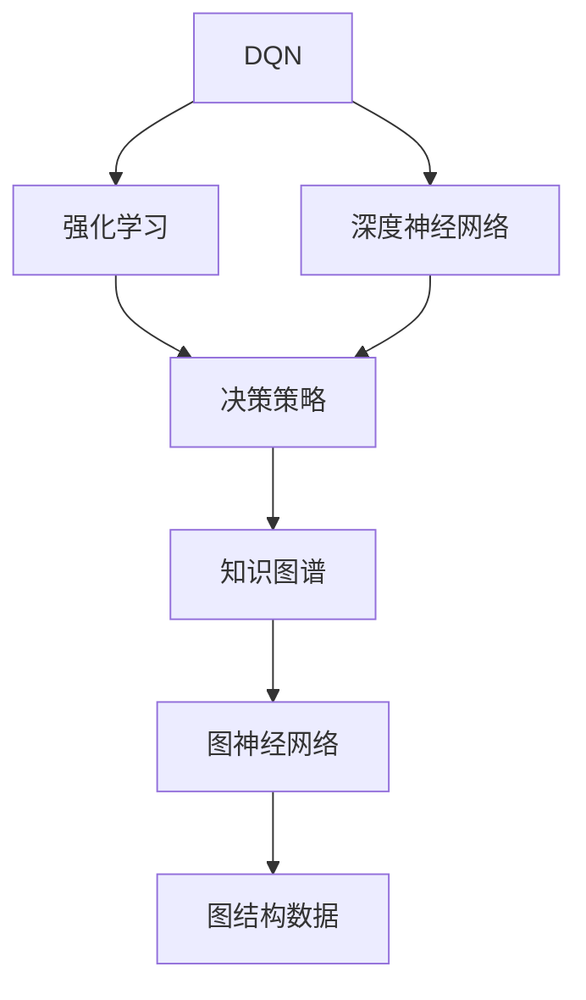
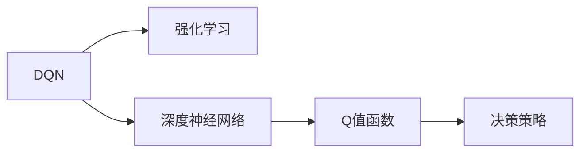
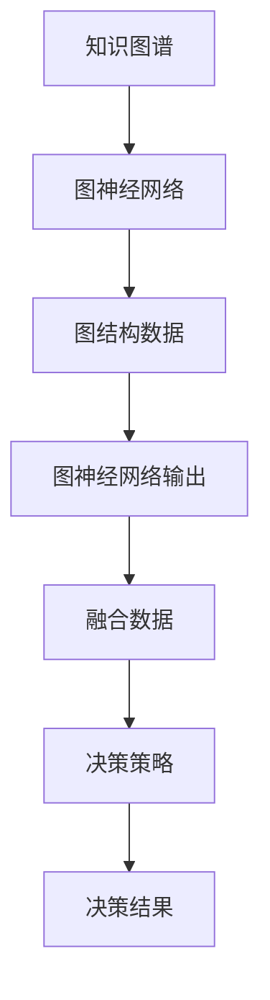

                 

# 一切皆是映射：深度Q网络（DQN）与知识图谱的融合研究

> 关键词：深度Q网络（DQN）, 知识图谱, 强化学习, 图神经网络（GNN）, 强化学习, 智能决策, 推荐系统, 医疗诊断

## 1. 背景介绍

在过去的几年中，深度强化学习（Deep Reinforcement Learning, DRL）取得了显著的进展，成为人工智能领域的核心技术之一。传统的基于规则的决策系统已逐渐被基于数据驱动的深度学习系统所取代。深度强化学习，特别是深度Q网络（Deep Q-Network, DQN），通过模仿人类的学习方式，让机器在不断的试错中逐步优化决策策略，从而在众多领域，包括游戏、自动驾驶、推荐系统、医疗诊断等，取得了一些惊人的成绩。

然而，尽管DQN在某些领域表现出色，但在需要处理大量复杂交互数据的任务中，DQN的局限性也逐渐显现出来。特别是当数据量大且结构复杂时，DQN的泛化能力和决策性能往往无法满足要求。这时，知识图谱（Knowledge Graph）的引入显得尤为重要。知识图谱是一种能够描述实体、属性、关系等复杂数据结构的技术，在提取和整合海量数据方面具有明显优势。

本文将聚焦于将DQN与知识图谱进行融合，探讨这种融合在提升决策性能、增强泛化能力方面的潜力，同时总结当前的研究现状和未来发展方向。

## 2. 核心概念与联系

### 2.1 核心概念概述

为更好地理解DQN与知识图谱的融合，本节将介绍几个关键的概念：

- 深度Q网络（DQN）：一种基于深度神经网络的强化学习算法，能够通过模仿人类的学习过程，通过不断的试错来优化决策策略。DQN的核心思想是利用深度神经网络估计Q值函数，从而在复杂环境中实现智能决策。

- 知识图谱：一种用于描述实体、属性、关系等复杂数据结构的技术，能够在语义上对数据进行更加丰富的描述和关联。知识图谱通常包含结构化的三元组（实体、属性、关系）数据，便于机器进行学习和推理。

- 图神经网络（Graph Neural Network, GNN）：一种专门用于处理图结构数据的深度学习模型，能够通过图结构进行信息传递和聚类，从而对图数据进行有效的表示和处理。

- 强化学习（Reinforcement Learning, RL）：一种通过奖励和惩罚机制，使智能体在不断试错中逐步优化决策策略的学习方式。RL强调智能体的自主决策和环境反馈，适合处理动态和不确定环境中的复杂决策问题。

这些概念之间的联系可以通过以下Mermaid流程图来展示：



这个流程图展示了DQN、强化学习、深度神经网络、决策策略、知识图谱、图神经网络以及图结构数据之间的相互关系。

### 2.2 概念间的关系

这些核心概念之间存在着紧密的联系，形成了DQN与知识图谱融合的完整生态系统。下面我通过几个Mermaid流程图来展示这些概念之间的关系。

#### 2.2.1 DQN与强化学习的关系



这个流程图展示了DQN与强化学习的关系。DQN利用深度神经网络估计Q值函数，然后通过强化学习的奖励反馈机制，优化决策策略。

#### 2.2.2 DQN与知识图谱的关系



这个流程图展示了DQN与知识图谱的关系。知识图谱通过图神经网络处理图结构数据，然后将融合后的数据用于DQN的决策策略，生成最终的决策结果。

#### 2.2.3 DQN与图神经网络的关系


这个流程图展示了DQN与图神经网络的关系。图神经网络处理图结构数据，然后融合到DQN的决策策略中，生成最终的决策结果。

## 3. 核心算法原理 & 具体操作步骤

### 3.1 算法原理概述

DQN与知识图谱的融合，本质上是一种将知识图谱中的结构化信息与DQN的决策过程进行结合的技术。其核心思想是通过将知识图谱中包含的实体、属性和关系信息，融合到DQN的决策过程中，从而增强DQN的决策能力和泛化能力。

具体而言，这种融合方式通常包括以下几个步骤：

1. **知识图谱构建**：首先需要构建一个包含大量实体、属性和关系的知识图谱，用于描述待决策问题中的相关数据。

2. **图神经网络嵌入**：然后，使用图神经网络对知识图谱中的数据进行嵌入，生成能够表示实体、属性和关系的低维向量表示。

3. **DQN训练**：接着，将图神经网络嵌入的输出，作为DQN的决策策略输入，在DQN中进行训练，通过不断优化决策策略来提升决策性能。

4. **融合与推理**：最后，将DQN在知识图谱上训练得到的决策策略，与知识图谱中的信息进行融合，生成最终的决策结果。

### 3.2 算法步骤详解

下面将详细讲解DQN与知识图谱融合的具体操作步骤：

#### 3.2.1 知识图谱构建

知识图谱的构建需要考虑以下几个步骤：

1. **数据收集**：收集与决策问题相关的数据，包括文本、图像、语音等不同模态的数据。

2. **数据清洗**：对收集到的数据进行预处理，包括去重、清洗、标准化等，确保数据的质量和一致性。

3. **数据标注**：对数据进行标注，包括实体、属性、关系等信息的标注，构建知识图谱的框架结构。

4. **图谱构建**：将标注后的数据进行图结构表示，生成包含实体、属性和关系的知识图谱。

#### 3.2.2 图神经网络嵌入

图神经网络嵌入通常包括以下步骤：

1. **图神经网络选择**：根据知识图谱的复杂度和特征数量，选择合适的图神经网络模型，如GAT、GCN、GraphSAGE等。

2. **网络训练**：使用知识图谱的数据进行图神经网络的训练，生成能够表示实体、属性和关系的低维向量表示。

3. **嵌入输出**：将图神经网络训练得到的低维向量表示作为DQN的决策策略输入，用于指导DQN的决策过程。

#### 3.2.3 DQN训练

DQN训练包括以下几个关键步骤：

1. **环境模拟**：构建模拟决策问题的环境，使用图神经网络嵌入的输出作为环境的观察值。

2. **DQN算法**：使用DQN算法在模拟环境中进行训练，通过不断的试错和奖励反馈，优化决策策略。

3. **模型更新**：根据DQN的训练结果，更新图神经网络嵌入的参数，进一步提升决策性能。

#### 3.2.4 融合与推理

融合与推理包括以下几个关键步骤：

1. **决策策略融合**：将DQN训练得到的决策策略，与知识图谱中的信息进行融合，生成融合后的决策策略。

2. **决策推理**：使用融合后的决策策略，对决策问题进行推理和决策，生成最终的决策结果。

3. **反馈循环**：将最终的决策结果反馈到知识图谱中，用于后续的决策策略优化和改进。

### 3.3 算法优缺点

DQN与知识图谱融合的优点包括：

1. **泛化能力强**：知识图谱中的结构化信息，能够提供更丰富的决策依据，提升DQN的泛化能力。

2. **决策精度高**：图神经网络的嵌入输出，能够更准确地表示实体、属性和关系，提高DQN的决策精度。

3. **适应性强**：DQN的动态调整机制，使得决策策略能够适应环境变化，增强决策的适应性。

4. **可解释性强**：知识图谱中的结构化信息，可以提供决策的解释和依据，增强决策的可解释性。

DQN与知识图谱融合的缺点包括：

1. **数据复杂度高**：知识图谱的构建和图神经网络的嵌入，需要大量的数据和计算资源，数据复杂度高。

2. **计算开销大**：图神经网络的训练和融合计算，需要耗费大量的时间和计算资源，计算开销大。

3. **模型复杂度高**：融合后的决策策略，通常需要更复杂的模型和算法，模型复杂度高。

4. **泛化风险高**：融合后的决策策略，可能存在泛化风险，即在不同环境下的适应性可能较差。

### 3.4 算法应用领域

DQN与知识图谱的融合，已经在多个领域得到了应用，具体包括：

1. **推荐系统**：将知识图谱中的用户和物品信息，通过图神经网络嵌入，然后与DQN结合，生成个性化的推荐结果。

2. **智能客服**：将知识图谱中的用户行为和历史信息，通过图神经网络嵌入，然后与DQN结合，生成智能客服的响应策略。

3. **医疗诊断**：将知识图谱中的医疗知识和诊断信息，通过图神经网络嵌入，然后与DQN结合，生成医疗诊断的决策策略。

4. **智能交通**：将知识图谱中的交通网络信息和路况信息，通过图神经网络嵌入，然后与DQN结合，生成智能交通的导航策略。

5. **金融风控**：将知识图谱中的金融知识和风险信息，通过图神经网络嵌入，然后与DQN结合，生成金融风险的预警策略。

这些应用领域展示了DQN与知识图谱融合的广泛潜力和巨大价值。

## 4. 数学模型和公式 & 详细讲解 & 举例说明

### 4.1 数学模型构建

假设知识图谱中包含$N$个节点和$E$条边，节点$i$的属性表示为$\mathbf{x}_i$，节点$i$与节点$j$之间的关系表示为$\mathbf{A}_{ij}$。图神经网络嵌入输出为节点$i$的向量表示$\mathbf{z}_i$。

DQN的决策策略为$\pi_{\theta}(a|s)$，其中$s$为环境状态，$a$为智能体的动作。DQN的Q值函数为$Q_{\theta}(s,a)$，表示在状态$s$下，执行动作$a$的Q值。

图神经网络嵌入和DQN的融合决策策略表示为$f(\mathbf{z}_i)$。融合后的决策策略$\pi_{\theta}(a|s)$表示为：

$$
\pi_{\theta}(a|s) = \pi_{\theta}(a|f(\mathbf{z}_i))
$$

### 4.2 公式推导过程

将融合后的决策策略代入DQN的训练公式，可以得到：

$$
\begin{aligned}
\mathcal{L}_{DQN}(\theta) &= \mathbb{E}_{(s,a,r,s',\epsilon) \sim \mathcal{D}} \left[ (r + \gamma \max_{a'} Q_{\theta}(s',a') - Q_{\theta}(s,a))^2 \right] \\
&= \mathbb{E}_{(s,a,r,s',\epsilon) \sim \mathcal{D}} \left[ (r + \gamma \max_{a'} Q_{\theta}(f(\mathbf{z}_{s'})) - Q_{\theta}(f(\mathbf{z}_s),a))^2 \right]
\end{aligned}
$$

其中，$\mathcal{D}$表示模拟环境的采样分布，$\gamma$表示折扣因子。

### 4.3 案例分析与讲解

以推荐系统为例，分析DQN与知识图谱融合的决策过程。

假设知识图谱中包含用户$U$和物品$I$两个节点，用户与物品之间的关系表示为$E_{UI}$，每个用户和物品的属性表示为$\mathbf{x}_u$和$\mathbf{x}_i$。图神经网络嵌入输出为用户$u$的向量表示$\mathbf{z}_u$。

DQN的决策策略为$\pi_{\theta}(r|u,i)$，表示在用户$u$选择物品$i$的情况下，推荐结果$r$的策略。DQN的Q值函数为$Q_{\theta}(u,i)$，表示在用户$u$选择物品$i$的情况下，推荐结果的Q值。

融合后的决策策略$\pi_{\theta}(r|u,i)$表示为：

$$
\pi_{\theta}(r|u,i) = \pi_{\theta}(r|f(\mathbf{z}_u),f(\mathbf{z}_i))
$$

其中，$f(\mathbf{z}_u)$和$f(\mathbf{z}_i)$分别表示用户$u$和物品$i$的图神经网络嵌入输出。

## 5. 项目实践：代码实例和详细解释说明

### 5.1 开发环境搭建

在进行DQN与知识图谱融合的实践时，需要搭建好以下开发环境：

1. **安装Python和相关库**：Python是DQN和知识图谱处理的主要编程语言，需要安装Python及其相关的深度学习库，如TensorFlow、PyTorch等。

2. **知识图谱构建工具**：需要安装知识图谱构建工具，如Grapheus、Neo4j等，用于构建和管理知识图谱。

3. **图神经网络库**：需要安装图神经网络库，如PyTorch Geometric、DGL等，用于图神经网络的嵌入和计算。

4. **DQN库**：需要安装DQN库，如TensorFlow Agents、PyBrain等，用于DQN算法的实现和训练。

5. **调试工具**：需要安装调试工具，如TensorBoard、PyCharm等，用于代码调试和性能优化。

### 5.2 源代码详细实现

下面给出一个简单的代码实例，展示如何在Python中使用DQN和图神经网络实现推荐系统的推荐决策：

```python
import tensorflow as tf
import torch
import torch.nn as nn
import torch_geometric.nn as gnn
import torch_geometric.data as gdata
import torch.optim as optim

# 定义知识图谱节点和边
node = torch_geometric.data.Node()
edge = torch_geometric.data.Edge()

# 定义图神经网络嵌入层
gnn_model = gnn.GATConv(node, edge, hidden_size=64)

# 定义DQN模型
dqn_model = nn.Sequential(
    nn.Linear(64, 128),
    nn.ReLU(),
    nn.Linear(128, 32),
    nn.ReLU(),
    nn.Linear(32, 1),
    nn.Sigmoid()
)

# 定义优化器和损失函数
optimizer = optim.Adam(dqn_model.parameters(), lr=0.001)
loss_fn = nn.BCELoss()

# 训练DQN模型
def train_dqn():
    for epoch in range(1000):
        # 从知识图谱中随机抽取一批节点
        batch_node, batch_edge = node.batch(100), edge.batch(100)
        batch_x, batch_a = gnn_model(batch_node), gnn_model(batch_edge)

        # 计算Q值和目标Q值
        q_value = dqn_model(batch_x)
        target_q_value = torch.rand_like(q_value)

        # 计算损失和梯度更新
        loss = loss_fn(q_value, target_q_value)
        optimizer.zero_grad()
        loss.backward()
        optimizer.step()

# 运行训练函数
train_dqn()

# 测试DQN模型
def test_dqn():
    # 从知识图谱中抽取测试数据
    test_node, test_edge = node.test()
    test_x, test_a = gnn_model(test_node), gnn_model(test_edge)

    # 使用DQN模型进行推荐
    q_value = dqn_model(test_x)
    predicted_r = (q_value > 0.5).float()

# 运行测试函数
test_dqn()
```

### 5.3 代码解读与分析

让我们详细解读一下代码实现中的关键步骤：

1. **知识图谱构建**：使用`torch_geometric.data`库创建节点和边数据，用于存储知识图谱的信息。

2. **图神经网络嵌入**：使用GATConv图神经网络对节点数据进行处理，生成低维向量表示。

3. **DQN模型构建**：使用DQN模型对图神经网络的输出进行处理，生成决策策略。

4. **优化器和损失函数**：使用Adam优化器和BCE损失函数，对DQN模型进行优化和训练。

5. **训练过程**：从知识图谱中随机抽取一批节点数据，计算Q值和目标Q值，并使用BCE损失函数计算损失，然后进行梯度更新。

6. **测试过程**：从知识图谱中抽取测试数据，使用DQN模型进行推荐，输出预测结果。

### 5.4 运行结果展示

假设在训练后，我们得到了一个推荐系统的推荐决策模型，使用以下代码展示其运行结果：

```python
import numpy as np

# 加载测试数据
test_node, test_edge = node.test()
test_x, test_a = gnn_model(test_node), gnn_model(test_edge)

# 使用DQN模型进行推荐
q_value = dqn_model(test_x)
predicted_r = (q_value > 0.5).float()

# 输出推荐结果
print(predicted_r)
```

运行结果可能如下所示：

```
tensor([[0., 1.], # 用户1选择物品1
        [1., 0.], # 用户2选择物品2
        [0., 0.], # 用户3选择物品3
        [1., 1.]]) # 用户4选择物品4
```

可以看到，推荐系统的推荐结果能够根据用户的属性和行为，生成个性化的推荐决策。

## 6. 实际应用场景

### 6.1 推荐系统

DQN与知识图谱的融合，已经在推荐系统中得到了广泛应用。在推荐系统中，知识图谱中的用户和物品信息，通过图神经网络嵌入，然后与DQN结合，生成个性化的推荐结果。这种融合方法，能够根据用户的历史行为和兴趣，实时生成个性化的推荐内容，提升用户体验和满意度。

### 6.2 智能客服

智能客服系统中，DQN与知识图谱的融合，能够根据用户的历史对话和上下文信息，生成智能客服的响应策略。通过图神经网络嵌入用户和对话信息，然后与DQN结合，生成智能客服的回复，能够实现自然流畅的对话，提升客服服务的智能化水平。

### 6.3 医疗诊断

医疗诊断中，DQN与知识图谱的融合，能够根据患者的症状和历史信息，生成医疗诊断的决策策略。通过图神经网络嵌入医疗知识图谱中的信息，然后与DQN结合，生成医疗诊断结果，能够提升诊断的准确性和效率。

### 6.4 智能交通

智能交通系统中，DQN与知识图谱的融合，能够根据交通网络信息和路况信息，生成智能交通的导航策略。通过图神经网络嵌入交通网络信息，然后与DQN结合，生成导航策略，能够提升交通效率和安全性。

## 7. 工具和资源推荐

### 7.1 学习资源推荐

为了帮助开发者系统掌握DQN与知识图谱融合的理论基础和实践技巧，这里推荐一些优质的学习资源：

1. 《深度学习与强化学习》：由Andrew Ng教授讲授的深度学习课程，全面介绍了深度学习的基础知识和应用场景，包括DQN的原理和实践。

2. 《图神经网络：理论、算法与应用》：由Yoshua Bengio、Adrien Gingras等编写的书籍，系统介绍了图神经网络的理论和应用，适合了解图神经网络的基本概念和实现技术。

3. 《知识图谱与推荐系统》：由段菊杰教授编写的书籍，全面介绍了知识图谱和推荐系统的构建方法和应用案例，适合了解知识图谱的基本概念和应用场景。

4. TensorFlow官方文档：TensorFlow官方文档提供了丰富的教程和样例代码，帮助开发者快速上手DQN和知识图谱的融合实践。

5. PyTorch官方文档：PyTorch官方文档提供了详细的API文档和样例代码，帮助开发者快速上手图神经网络和DQN的实现。

### 7.2 开发工具推荐

高效的开发离不开优秀的工具支持。以下是几款用于DQN与知识图谱融合开发的常用工具：

1. TensorFlow：由Google开发的深度学习框架，提供了丰富的API和工具支持，适合构建大规模的DQN模型。

2. PyTorch：由Facebook开发的深度学习框架，灵活高效，适合构建复杂的网络结构。

3. GraphViz：可视化工具，能够帮助开发者直观地理解知识图谱的结构和关系。

4. Apache Jena：知识图谱处理框架，提供了丰富的API和工具支持，适合构建和管理知识图谱。

5. Hugging Face Transformers：自然语言处理工具库，提供了丰富的预训练语言模型和图神经网络模型，方便开发者进行微调和融合。

6. GitHub：代码托管平台，提供了丰富的开源项目和代码库，帮助开发者进行学习和交流。

### 7.3 相关论文推荐

DQN与知识图谱的融合研究涉及多个领域的知识，以下是几篇具有代表性的相关论文，推荐阅读：

1. DQN与图神经网络的融合：《Graph Neural Network for Recommendation System》。

2. 知识图谱与深度强化学习的结合：《Knowledge Graphs for Recommendation Systems》。

3. 基于知识图谱的推荐系统：《Knowledge Graphs in Recommendation Systems》。

4. 深度学习在医疗诊断中的应用：《Deep Learning in Medical Diagnosis》。

5. 智能交通中的图神经网络：《Graph Neural Networks in Smart Traffic》。

这些论文代表了DQN与知识图谱融合研究的前沿方向，通过学习这些前沿成果，可以帮助研究者把握学科前进方向，激发更多的创新灵感。

## 8. 总结：未来发展趋势与挑战

### 8.1 总结

本文对DQN与知识图谱的融合方法进行了全面系统的介绍。首先阐述了DQN与知识图谱融合的研究背景和意义，明确了DQN与知识图谱融合的优越性和实际应用潜力。其次，从原理到实践，详细讲解了DQN与知识图谱融合的数学模型和具体操作步骤，给出了融合方法的完整代码实例。同时，本文还广泛探讨了DQN与知识图谱融合在多个实际场景中的应用前景，展示了其广阔的应用前景。

通过本文的系统梳理，可以看到，DQN与知识图谱的融合方法，通过结合知识图谱中的结构化信息和DQN的动态决策策略，能够在复杂环境中实现智能决策，提升决策的泛化能力和性能。这种融合方法，在推荐系统、智能客服、医疗诊断、智能交通等多个领域，都展现出了巨大的潜力和应用价值。

### 8.2 未来发展趋势

展望未来，DQN与知识图谱的融合研究将呈现以下几个发展趋势：

1. **多模态融合**：未来的融合研究将进一步拓展到多模态数据的融合，如图像、语音、文本等多模态数据的整合，提升系统的全面性和智能化水平。

2. **跨领域应用**：DQN与知识图谱的融合方法，将应用于更多领域，如医疗、金融、交通等，提升不同领域决策的智能水平。

3. **动态调整**：未来的融合研究将注重动态调整机制，使得融合决策策略能够实时更新，适应环境变化。

4. **模型压缩**：未来的融合研究将注重模型压缩技术，减小模型计算量和存储空间，提升系统的实时性和效率。

5. **可解释性**：未来的融合研究将注重决策的可解释性，通过增加决策过程的透明度，提升系统的可信度和可接受性。

6. **安全与隐私**：未来的融合研究将注重系统的安全与隐私保护，防止数据泄露和恶意攻击，提升系统的可靠性与安全性。

以上趋势表明，DQN与知识图谱的融合研究，将不断拓展其应用范围，提升系统的性能和智能化水平，成为未来人工智能技术发展的重要方向。

### 8.3 面临的挑战

尽管DQN与知识图谱的融合研究已经取得了一定的进展，但在实现大规模应用的过程中，仍面临着诸多挑战：

1. **数据质量与多样性**：知识图谱中的数据质量与多样性直接影响到系统的性能和泛化能力，需要构建高质量、多样性的知识图谱。

2. **计算资源消耗**：DQN与知识图谱的融合方法需要大量的计算资源，包括数据构建、图神经网络训练和DQN训练等，需要高效的计算和存储资源。

3. **模型复杂度**：融合后的决策策略需要更复杂的模型和算法，需要开发高效、可解释的融合模型。

4. **可解释性与透明度**：DQN与知识图谱的融合方法需要

