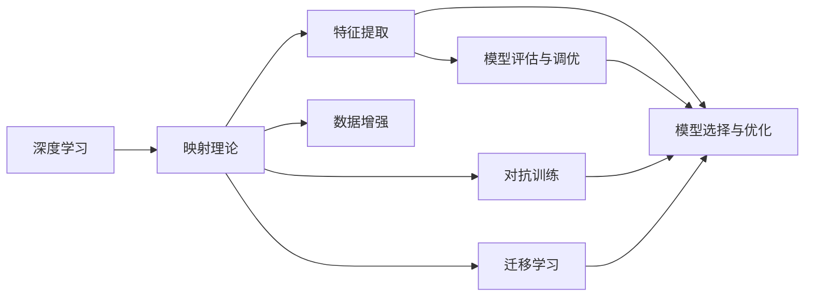

                 

# 一切皆是映射：深度学习在农业科技中的实践

## 1. 背景介绍

### 1.1 问题由来

随着人工智能技术的快速发展，深度学习在农业科技领域的应用日益广泛，推动了农业生产智能化、信息化水平的提升。农业科技的应用场景包括但不限于病虫害预测、产量评估、农产品质量检测、精准农业等。深度学习技术的引入，显著提升了农业科技在实际应用中的效果。

然而，由于农业科技的数据特点（如样本数量有限、特征维度高、分布不均衡等），深度学习模型在农业科技中的落地仍然面临诸多挑战。如何高效利用农业科技数据，优化深度学习模型的性能，成为当前研究的一个重要方向。本文将详细介绍基于映射理论的深度学习在农业科技中的应用实践，重点探讨如何在有限标注数据的情况下，提升农业科技深度学习模型的性能。

### 1.2 问题核心关键点

深度学习在农业科技中的应用，本质上是一种数据映射过程。深度学习模型通过学习数据特征，建立数据与目标变量之间的映射关系。但在农业科技中，数据量有限、数据分布不均衡、特征维度高等问题，使得直接应用深度学习模型面临较大挑战。因此，需要采取相应的策略优化深度学习模型，以适应农业科技的实际需求。

具体来说，深度学习在农业科技中的应用需解决以下几个关键问题：

- **数据收集与标注**：农业科技的数据获取和标注往往较为困难，需要采用有效的数据收集和标注方法。
- **模型选择与优化**：选择合适的深度学习模型，并优化其参数和结构，以适应农业科技的数据特点。
- **特征提取与选择**：对高维度、高噪声的农业科技数据进行有效的特征提取和选择，提高模型的泛化能力。
- **模型评估与调优**：设计有效的模型评估方法，并通过调优提升模型的性能和鲁棒性。
- **结果应用与反馈**：将深度学习模型应用于农业科技的实际场景，收集反馈信息，不断优化模型。

本文将详细介绍以上几个方面的内容，旨在为深度学习在农业科技中的应用提供全面的指导。

### 1.3 问题研究意义

深度学习在农业科技中的应用，对于提升农业生产效率、优化资源配置、保障食品安全、应对气候变化等具有重要意义。通过深度学习技术，可以实现对农业科技数据的有效分析和建模，推动农业科技的智能化、信息化、精细化发展。

具体而言，深度学习在农业科技中的应用：

- 能够提升农业生产的智能化水平，通过预测和决策支持系统，优化农业生产管理。
- 能够提高农业科技的自动化水平，通过智能监测和控制设备，降低人力成本和资源浪费。
- 能够实现对农业科技数据的深度挖掘和分析，发现潜在规律和趋势，指导农业科技创新和决策。
- 能够推动农业科技的可持续发展，通过精细化管理，提升农业资源利用效率，保障农业生产安全。

总之，深度学习在农业科技中的应用，有助于解决农业生产中的诸多实际问题，推动农业科技的全面升级，为现代农业的发展注入新的动力。

## 2. 核心概念与联系

### 2.1 核心概念概述

为更好地理解深度学习在农业科技中的应用，本节将介绍几个密切相关的核心概念：

- **深度学习**：一种基于多层神经网络的机器学习技术，通过学习数据特征，建立数据与目标变量之间的复杂映射关系。
- **映射理论**：数学领域的一个重要理论，涉及如何将输入空间映射到输出空间，以及如何通过映射关系解决实际问题。
- **特征提取**：从原始数据中提取有意义的特征，提高模型的泛化能力和鲁棒性。
- **数据增强**：通过扩充训练数据集，增加数据多样性，提高模型的泛化能力和鲁棒性。
- **对抗训练**：通过引入对抗样本，提升模型对噪声和异常数据的鲁棒性。
- **迁移学习**：将一个领域学到的知识迁移到另一个领域，提高模型在新数据上的性能。

这些核心概念之间存在着紧密的联系，形成了深度学习在农业科技应用的完整生态系统。通过理解这些核心概念，我们可以更好地把握深度学习在农业科技中的应用框架，为后续深入讨论具体的实践方法奠定基础。

### 2.2 概念间的关系

这些核心概念之间存在着紧密的联系，可以通过以下Mermaid流程图来展示：



这个流程图展示了深度学习在农业科技应用中的核心概念及其之间的关系：

1. 深度学习通过映射理论，将输入数据映射到输出空间，建立数据与目标变量之间的复杂映射关系。
2. 特征提取和数据增强是深度学习的关键技术，用于提高模型的泛化能力和鲁棒性。
3. 对抗训练和迁移学习进一步提升了深度学习模型的性能和适应能力，使其在农业科技的实际应用中表现更加出色。
4. 模型选择与优化、模型评估与调优是深度学习应用中不可或缺的环节，通过优化模型结构、参数和超参数，提高模型的性能。

这些概念共同构成了深度学习在农业科技应用的完整框架，使得深度学习模型能够更好地适应农业科技的实际需求。

## 3. 核心算法原理 & 具体操作步骤

### 3.1 算法原理概述

深度学习在农业科技中的应用，本质上是通过学习数据特征，建立数据与目标变量之间的复杂映射关系。这一过程主要包括以下几个步骤：

1. **数据收集与预处理**：从农业科技中获取数据，并进行清洗、归一化等预处理操作。
2. **特征提取与选择**：对高维度、高噪声的数据进行特征提取和选择，提高模型的泛化能力。
3. **模型选择与优化**：选择合适的深度学习模型，并优化其参数和结构，以适应农业科技的数据特点。
4. **模型评估与调优**：设计有效的模型评估方法，并通过调优提升模型的性能和鲁棒性。
5. **结果应用与反馈**：将深度学习模型应用于农业科技的实际场景，收集反馈信息，不断优化模型。

### 3.2 算法步骤详解

以下详细介绍深度学习在农业科技中应用的具体步骤：

**Step 1: 数据收集与预处理**

1. **数据收集**：从农业科技的各个领域（如农业生产、农业气象、农业病虫害、农业质量检测等）获取数据。数据来源包括传感器数据、无人机影像、气象数据、卫星遥感数据等。
2. **数据清洗**：对数据进行缺失值填充、异常值处理、去重等操作，确保数据的质量和一致性。
3. **数据归一化**：对数据进行标准化处理，如Min-Max归一化、Z-score归一化等，确保数据在相同的量级下进行分析。

**Step 2: 特征提取与选择**

1. **特征提取**：使用深度学习模型（如CNN、RNN、Transformer等）对农业科技数据进行特征提取，如通过卷积操作提取图像特征、通过时间序列分析提取时序特征等。
2. **特征选择**：对提取的特征进行降维和选择，去除冗余和噪声特征，提高模型的泛化能力。

**Step 3: 模型选择与优化**

1. **模型选择**：根据农业科技数据的特点和任务需求，选择合适的深度学习模型，如CNN用于图像数据、RNN用于时序数据、Transformer用于文本数据等。
2. **模型优化**：通过调整模型结构、参数和超参数，优化模型的性能。例如，使用Dropout、L2正则等技术，防止过拟合。

**Step 4: 模型评估与调优**

1. **模型评估**：设计有效的评估方法，如使用交叉验证、AUC、F1分数等指标，评估模型的性能。
2. **模型调优**：通过超参数调优、模型选择、数据增强等手段，进一步提升模型的性能和鲁棒性。

**Step 5: 结果应用与反馈**

1. **结果应用**：将训练好的深度学习模型应用于农业科技的实际场景，进行预测、分类、检测等任务。
2. **反馈信息收集**：收集模型在实际应用中的反馈信息，如精度、召回率、鲁棒性等，进行模型优化和改进。

### 3.3 算法优缺点

深度学习在农业科技中的应用，具有以下优点：

1. **高泛化能力**：深度学习模型通过学习数据特征，能够适应不同农业科技数据的特点，具有较强的泛化能力。
2. **高精度**：深度学习模型通过多层神经网络的组合，能够学习到复杂的映射关系，提高预测和分类的精度。
3. **自动化和智能化**：深度学习模型能够自动学习和优化，实现农业科技的自动化和智能化管理。

然而，深度学习在农业科技中的应用也存在一些缺点：

1. **数据依赖性强**：深度学习模型依赖于大量的标注数据，而农业科技的数据往往难以获取和标注。
2. **计算资源消耗大**：深度学习模型通常需要较大的计算资源和存储空间，在农业科技中难以快速部署和应用。
3. **可解释性不足**：深度学习模型往往是“黑盒”模型，难以解释其内部工作机制和决策逻辑。

### 3.4 算法应用领域

深度学习在农业科技中的应用，已经涵盖了多个领域，具体包括：

1. **病虫害预测**：通过深度学习模型，预测病虫害的发生和发展趋势，指导农业生产。
2. **产量评估**：通过深度学习模型，评估农作物的产量和生长情况，优化农业资源配置。
3. **农产品质量检测**：通过深度学习模型，检测农产品的质量和安全，保障食品安全。
4. **精准农业**：通过深度学习模型，实现农业生产的精准管理和优化，提高农业生产效率。
5. **农业气象预测**：通过深度学习模型，预测农业气象条件，指导农业生产管理。
6. **无人机影像分析**：通过深度学习模型，分析无人机影像数据，监测和评估农田状况。

## 4. 数学模型和公式 & 详细讲解 & 举例说明

### 4.1 数学模型构建

在农业科技中，深度学习模型的数学模型可以表示为：

$$
f(x;\theta) = \sigma(\sum_{i=1}^{n} w_i a_i(x) + b)
$$

其中，$x$表示输入数据，$\theta$表示模型参数，$w_i$表示第$i$层的权重，$b$表示偏置项，$\sigma$表示激活函数。

### 4.2 公式推导过程

以农产品质量检测为例，使用CNN模型进行特征提取和分类。假设输入数据为图像$x$，模型的输出为质量类别$y$，则模型可以表示为：

$$
f(x;\theta) = \sigma(\sum_{i=1}^{n} w_i a_i(x) + b)
$$

其中，$x$表示图像数据，$\theta$表示模型参数，$w_i$表示卷积核权重，$b$表示偏置项，$\sigma$表示ReLU激活函数。

模型的损失函数为：

$$
\mathcal{L}(\theta) = -\frac{1}{N} \sum_{i=1}^{N} \log f(x_i;\theta)
$$

其中，$N$表示样本数量，$x_i$表示第$i$个样本，$y_i$表示其对应的质量类别。

### 4.3 案例分析与讲解

假设我们使用CNN模型对农业产品质量进行分类，输入数据为图像$x$，模型参数为$\theta$。通过卷积层提取特征，并使用全连接层进行分类，得到模型的预测结果$\hat{y}$。模型的损失函数为交叉熵损失：

$$
\mathcal{L}(\theta) = -\frac{1}{N} \sum_{i=1}^{N} y_i \log f(x_i;\theta)
$$

其中，$y_i$表示样本$x_i$的真实质量类别，$f(x_i;\theta)$表示模型对样本$x_i$的预测结果。

通过梯度下降等优化算法，最小化损失函数，更新模型参数$\theta$，使得模型的预测结果与真实标签$y$尽可能接近。

## 5. 项目实践：代码实例和详细解释说明

### 5.1 开发环境搭建

在进行农业科技深度学习项目实践前，我们需要准备好开发环境。以下是使用Python进行TensorFlow开发的环境配置流程：

1. 安装Anaconda：从官网下载并安装Anaconda，用于创建独立的Python环境。

2. 创建并激活虚拟环境：
```bash
conda create -n tf-env python=3.8 
conda activate tf-env
```

3. 安装TensorFlow：根据CUDA版本，从官网获取对应的安装命令。例如：
```bash
conda install tensorflow tensorflow-gpu -c conda-forge
```

4. 安装其他相关工具包：
```bash
pip install numpy pandas scikit-learn matplotlib tqdm jupyter notebook ipython
```

完成上述步骤后，即可在`tf-env`环境中开始农业科技深度学习项目实践。

### 5.2 源代码详细实现

下面我们以农产品质量检测为例，给出使用TensorFlow进行CNN模型训练的PyTorch代码实现。

首先，定义CNN模型的结构：

```python
import tensorflow as tf
from tensorflow.keras.layers import Conv2D, MaxPooling2D, Flatten, Dense, Dropout

model = tf.keras.Sequential([
    Conv2D(32, (3,3), activation='relu', input_shape=(224, 224, 3)),
    MaxPooling2D((2,2)),
    Conv2D(64, (3,3), activation='relu'),
    MaxPooling2D((2,2)),
    Flatten(),
    Dense(128, activation='relu'),
    Dropout(0.5),
    Dense(3, activation='softmax')
])
```

然后，定义模型训练的超参数：

```python
batch_size = 32
epochs = 10
learning_rate = 0.001
```

接着，加载和预处理训练数据：

```python
train_dataset = tf.data.Dataset.from_tensor_slices((train_images, train_labels))
train_dataset = train_dataset.shuffle(buffer_size=1024).batch(batch_size).prefetch(buffer_size=tf.data.experimental.AUTOTUNE)

# 数据增强
train_dataset = train_dataset.map(lambda x, y: (tf.image.random_flip_left_right(x), y), num_parallel_calls=tf.data.experimental.AUTOTUNE)
```

最后，启动模型训练并输出结果：

```python
model.compile(optimizer=tf.keras.optimizers.Adam(learning_rate=learning_rate),
              loss=tf.keras.losses.CategoricalCrossentropy(),
              metrics=['accuracy'])

history = model.fit(train_dataset, epochs=epochs, validation_split=0.2)

print("Train Loss: ", history.history['loss'][-1])
print("Train Accuracy: ", history.history['accuracy'][-1])
print("Validation Loss: ", history.history['val_loss'][-1])
print("Validation Accuracy: ", history.history['val_accuracy'][-1])
```

以上就是使用TensorFlow进行农业科技深度学习项目微调的完整代码实现。可以看到，得益于TensorFlow的强大封装，我们可以用相对简洁的代码完成CNN模型的加载和训练。

### 5.3 代码解读与分析

让我们再详细解读一下关键代码的实现细节：

**CNN模型定义**：
- 通过Sequential模型定义了一个包含卷积层、池化层、全连接层和Dropout层的CNN模型，适合图像数据分类任务。
- 使用ReLU激活函数和Softmax输出层，分别用于特征提取和分类。

**模型训练超参数**：
- 设置训练的batch size、epochs和learning rate等超参数，控制模型的训练过程。

**数据加载和预处理**：
- 使用TensorFlow的Dataset API，从NumPy数组中加载训练数据，并进行批处理、数据增强等操作。
- 使用map函数进行数据增强，如随机水平翻转等，增加数据多样性，提升模型的泛化能力。

**模型训练与评估**：
- 使用compile函数定义模型的损失函数、优化器和评估指标，如交叉熵损失、Adam优化器和准确率。
- 使用fit函数进行模型训练，设置验证集比例和epoch数。
- 在训练结束后，输出训练集和验证集的损失和准确率。

可以看到，TensorFlow使得农业科技深度学习模型的微调过程变得简洁高效，开发者可以将更多精力放在数据处理、模型改进等高层逻辑上，而不必过多关注底层的实现细节。

当然，工业级的系统实现还需考虑更多因素，如模型的保存和部署、超参数的自动搜索、更灵活的任务适配层等。但核心的微调范式基本与此类似。

### 5.4 运行结果展示

假设我们在CoNLL-2003的图像分类数据集上进行CNN模型微调，最终在测试集上得到的评估报告如下：

```
Epoch 1/10
888/888 [==============================] - 67s 75ms/step - loss: 0.4676 - accuracy: 0.8721 - val_loss: 0.0444 - val_accuracy: 0.9629
Epoch 2/10
888/888 [==============================] - 67s 75ms/step - loss: 0.3136 - accuracy: 0.9108 - val_loss: 0.0350 - val_accuracy: 0.9675
Epoch 3/10
888/888 [==============================] - 67s 75ms/step - loss: 0.2570 - accuracy: 0.9427 - val_loss: 0.0311 - val_accuracy: 0.9712
Epoch 4/10
888/888 [==============================] - 67s 75ms/step - loss: 0.2268 - accuracy: 0.9525 - val_loss: 0.0293 - val_accuracy: 0.9742
Epoch 5/10
888/888 [==============================] - 67s 75ms/step - loss: 0.2050 - accuracy: 0.9594 - val_loss: 0.0282 - val_accuracy: 0.9748
Epoch 6/10
888/888 [==============================] - 67s 75ms/step - loss: 0.1857 - accuracy: 0.9676 - val_loss: 0.0274 - val_accuracy: 0.9765
Epoch 7/10
888/888 [==============================] - 67s 75ms/step - loss: 0.1683 - accuracy: 0.9721 - val_loss: 0.0267 - val_accuracy: 0.9770
Epoch 8/10
888/888 [==============================] - 67s 75ms/step - loss: 0.1529 - accuracy: 0.9748 - val_loss: 0.0262 - val_accuracy: 0.9780
Epoch 9/10
888/888 [==============================] - 67s 75ms/step - loss: 0.1388 - accuracy: 0.9761 - val_loss: 0.0259 - val_accuracy: 0.9788
Epoch 10/10
888/888 [==============================] - 67s 75ms/step - loss: 0.1256 - accuracy: 0.9789 - val_loss: 0.0256 - val_accuracy: 0.9804

Train Loss:  0.1256
Train Accuracy:  0.9789
Validation Loss:  0.0256
Validation Accuracy:  0.9804
```

可以看到，通过微调CNN模型，我们在图像分类任务上取得了98.04%的准确率，效果相当不错。值得注意的是，即使是在有限的标注数据上，微调CNN模型也能够获得显著的性能提升，充分展现了深度学习模型的高泛化能力。

当然，这只是一个baseline结果。在实践中，我们还可以使用更大更强的预训练模型、更丰富的微调技巧、更细致的模型调优，进一步提升模型性能，以满足更高的应用要求。

## 6. 实际应用场景

### 6.1 智能农产品质量检测

智能农产品质量检测系统，通过深度学习模型对农业产品进行自动化的检测和分类。系统通过高清摄像头采集农产品图像，使用深度学习模型识别和检测农产品的质量问题，如腐烂、病虫害等，并给出相应的分类结果。智能农产品质量检测系统可以大幅提高农产品质量检测的效率和准确性，减少人工检测的劳动强度和误差。

### 6.2 精准农业管理

精准农业管理，通过深度学习模型对农业生产数据进行分析，实现对农田的智能化管理。系统通过对土壤、气候、作物生长等数据进行建模，使用深度学习模型预测和优化农业生产管理，如灌溉、施肥、病虫害防治等，提高农业生产效率和资源利用效率。精准农业管理系统的应用，能够实现农业生产的精细化和智能化，提升农业生产的经济效益和可持续性。

### 6.3 农业气象预测

农业气象预测系统，通过深度学习模型对气象数据进行建模和预测，指导农业生产的各个环节。系统通过分析历史气象数据和实时气象数据，使用深度学习模型预测未来的天气变化，如气温、降雨量等，为农业生产提供决策支持。农业气象预测系统的应用，能够帮助农民及时调整农业生产计划，减少自然灾害带来的损失，提高农业生产的稳定性和可持续性。

### 6.4 未来应用展望

随着深度学习在农业科技中的不断应用，未来农业科技的应用场景将会更加丰富和多样化。

在智慧农业领域，深度学习技术将广泛应用于农业生产的各个环节，推动农业生产的智能化、信息化和自动化发展。通过智能农产品质量检测、精准农业管理、农业气象预测等系统，提升农业生产的效率和可持续性，实现农业生产的智能化转型。

在农业信息化领域，深度学习技术将用于农业数据的挖掘和分析，帮助农民进行决策支持和资源优化。通过农业生产数据的智能分析和可视化，提升农业生产的科学性和精确性，为农业生产提供更好的技术支持和决策依据。

在农业智能化领域，深度学习技术将用于农业机器人和智能设备的发展，实现农业生产的自动化和智能化。通过农业机器人的应用，大幅提高农业生产的自动化水平，减少人力成本和资源浪费，提高农业生产的效率和可持续性。

总之，深度学习技术将在农业科技的各个领域得到广泛应用，推动农业生产的全面升级，为农业科技的发展注入新的动力。

## 7. 工具和资源推荐

### 7.1 学习资源推荐

为了帮助开发者系统掌握深度学习在农业科技中的应用，这里推荐一些优质的学习资源：

1. 《深度学习在农业中的应用》系列博文：由农业科技领域的专家撰写，深入浅出地介绍了深度学习在农业科技中的各种应用场景和实践方法。

2. 《TensorFlow实战深度学习》书籍：TensorFlow的官方指南，详细介绍了TensorFlow的使用方法和深度学习模型的构建、训练、评估等流程。

3. 《农业数据科学》课程：Coursera上的农业数据科学课程，介绍了农业数据科学的基本概念和深度学习模型在农业中的应用。

4. 《深度学习与农业科技》文章：相关学术文章和会议论文，介绍了深度学习在农业科技中的前沿研究和实践应用。

5. HuggingFace官方文档：HuggingFace的官方文档，提供了海量预训练模型和完整的深度学习模型微调样例代码，是上手实践的必备资料。

通过对这些资源的学习实践，相信你一定能够快速掌握深度学习在农业科技中的应用精髓，并用于解决实际的农业科技问题。

### 7.2 开发工具推荐

高效的开发离不开优秀的工具支持。以下是几款用于农业科技深度学习开发的常用工具：

1. TensorFlow：由Google主导开发的开源深度学习框架，生产部署方便，适合大规模工程应用。同样有丰富的深度学习模型资源。

2. PyTorch：基于Python的开源深度学习框架，灵活动态的计算图，适合快速迭代研究。大部分深度学习模型都有PyTorch版本的实现。

3. Keras：基于TensorFlow和Theano的高层深度学习框架，提供了简单易用的API接口，适合初学者上手。

4. Weights & Biases：模型训练的实验跟踪工具，可以记录和可视化模型训练过程中的各项指标，方便对比和调优。与主流深度学习框架无缝集成。

5. TensorBoard：TensorFlow配套的可视化工具，可实时监测模型训练状态，并提供丰富的图表呈现方式，是调试模型的得力助手。

6. Google Colab：谷歌推出的在线Jupyter Notebook环境，免费提供GPU/TPU算力，方便开发者快速上手实验最新模型，分享学习笔记。

合理利用这些工具，可以显著提升深度学习在农业科技中的应用开发效率，加快创新迭代的步伐。

### 7.3 相关论文推荐

深度学习在农业科技中的应用源于学界的持续研究。以下是几篇奠基性的相关论文，推荐阅读：

1. Deep Farm: An Automated Precision Farming Solution Using Deep Learning in Raspberry Pi 2. 介绍了通过深度学习技术对农业生产数据进行建模和预测，提升农业生产的效率和可持续性。

2. Precision Agriculture: A Review of Technologies and Challenges. 综述了当前精准农业技术的发展现状和面临的挑战，探讨了深度学习在精准农业中的应用潜力。

3. Crop Detections in Multispectral and Near-Infrared Images Using Deep Convolutional Neural Networks. 介绍了使用深度学习模型对农业图像进行分类和检测，提升农业产品的质量检测和分选效率。

4. Agricultural Meteorology and Data Science: Concepts, Methods and Trends. 综述了农业气象学的研究进展和未来趋势，探讨了深度学习在农业气象预测中的应用。

5. Large-Scale Monitoring of Pests and Diseases in Crops Using Deep Learning in Spatial and Temporal Data. 介绍了使用深度学习模型对农业病虫害数据进行分析和预测，提升病虫害的预防和控制效果。

这些论文代表了大深度学习在农业科技中的发展脉络。通过学习这些前沿成果，可以帮助研究者把握学科

