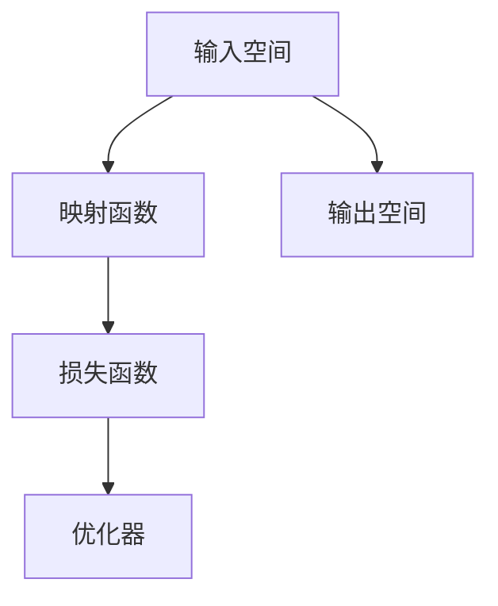
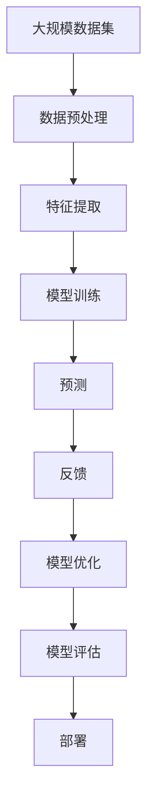

                 

# 一切皆是映射：理解AI中的输入与输出关系

## 1. 背景介绍

在人工智能的宏伟蓝图中，输入与输出关系构成了基础而核心的一环。不论是图像识别、语音识别还是自然语言处理，输入与输出关系的映射都是理解和处理这些复杂数据的关键。深入理解这一过程，将有助于我们构建更强大、更灵活的AI模型。

### 1.1 问题由来
随着人工智能技术的飞速发展，越来越多的应用场景开始涌现。从自动驾驶到医疗诊断，从金融风控到智能客服，AI正逐步渗透到各个领域，提升效率和质量。然而，尽管有了先进的算法和硬件支持，输入与输出关系的映射问题仍然是一个核心挑战。

#### 1.1.1 输入与输出的本质
在许多AI任务中，输入往往是一种形式的复杂数据，而输出则是我们希望模型能够准确预测的结果。例如，在图像分类任务中，输入是图像数据，输出是图像所属的类别。这种输入与输出的映射关系，是整个AI任务的核心。

#### 1.1.2 映射问题的复杂性
尽管输入与输出之间的映射看似简单，但实际上，这一过程涉及数据预处理、特征提取、模型训练、预测等多个环节，并且这些环节相互交织，构成了一个复杂而动态的系统。这要求我们在设计和实现AI模型时，必须深入理解输入与输出的关系，并能够有效地处理和优化这一过程。

## 2. 核心概念与联系

### 2.1 核心概念概述

为了更好地理解AI中的输入与输出关系，本节将介绍几个密切相关的核心概念：

- **输入空间（Input Space）**：表示所有可能的输入数据的集合。例如，图像分类任务的输入空间是所有可能的图片数据。
- **输出空间（Output Space）**：表示所有可能的输出结果的集合。例如，图像分类任务的输出空间是所有可能的类别标签。
- **映射函数（Mapping Function）**：将输入空间中的数据映射到输出空间的函数。例如，神经网络就是一种典型的映射函数，通过多层非线性变换将输入映射到输出。
- **损失函数（Loss Function）**：衡量模型预测输出与真实标签之间的差异的函数。例如，交叉熵损失常用于分类任务，均方误差损失常用于回归任务。
- **优化器（Optimizer）**：通过最小化损失函数来更新模型参数的算法。例如，AdamW、SGD等是常用的优化器。

### 2.2 概念间的关系

这些核心概念之间存在着紧密的联系，形成了AI中数据映射和模型训练的基本框架。我们可以用以下Mermaid流程图来展示它们之间的关系：



这个流程图展示了输入、输出、映射函数、损失函数和优化器之间的关系：

1. 输入空间和输出空间通过映射函数连接起来，形成输入与输出的映射关系。
2. 损失函数衡量模型的预测输出与真实标签之间的差异。
3. 优化器通过最小化损失函数来更新模型的参数，使得模型的预测输出逐渐逼近真实标签。

### 2.3 核心概念的整体架构

最后，我们用一个综合的流程图来展示这些核心概念在大规模AI模型训练中的整体架构：



这个综合流程图展示了从数据预处理到模型部署的完整过程。大规模数据集经过数据预处理和特征提取，进入模型训练过程，通过优化器最小化损失函数更新参数。训练后的模型进行预测，并将预测结果反馈给模型优化过程，进一步提升模型性能。最终，模型被部署到实际应用中，服务于不同的场景。

## 3. 核心算法原理 & 具体操作步骤
### 3.1 算法原理概述

在AI中，输入与输出关系的映射通常是通过训练一个机器学习模型来实现的。模型的核心是映射函数，通过多层非线性变换，将输入空间映射到输出空间。

形式化地，假设我们的模型 $M_{\theta}$ 将输入 $x$ 映射到输出 $y$，其中 $\theta$ 是模型的可学习参数。模型的目标是通过训练数据集 $\{(x_i,y_i)\}_{i=1}^N$ 来最小化损失函数 $L(y_i,M_{\theta}(x_i))$，即：

$$
\theta^* = \mathop{\arg\min}_{\theta} \sum_{i=1}^N L(y_i,M_{\theta}(x_i))
$$

其中 $L(y_i,M_{\theta}(x_i))$ 是针对具体任务的损失函数。例如，对于二分类任务，交叉熵损失函数为：

$$
L(y_i,M_{\theta}(x_i)) = -y_i\log M_{\theta}(x_i) - (1-y_i)\log (1-M_{\theta}(x_i))
$$

### 3.2 算法步骤详解

基于上述理论，下面详细介绍如何实现AI模型中的输入与输出映射过程。

#### 3.2.1 数据预处理
数据预处理是AI模型的第一步，其目的是将原始数据转换为适合模型输入的格式。常用的预处理方法包括：

- **归一化（Normalization）**：将数据缩放到一个标准的范围，以便更好地训练模型。
- **标准化（Standardization）**：将数据转化为均值为0，标准差为1的标准正态分布。
- **数据增强（Data Augmentation）**：通过对数据进行旋转、缩放、裁剪等操作，增加数据多样性，防止模型过拟合。

#### 3.2.2 特征提取
特征提取是将原始数据转换为模型可以处理的特征表示的过程。常用的特征提取方法包括：

- **卷积神经网络（CNN）**：适用于图像和视频数据，通过卷积层、池化层等操作，提取局部特征。
- **循环神经网络（RNN）**：适用于序列数据，通过循环层，捕捉时间序列中的信息。
- **自注意力机制（Self-Attention）**：适用于自然语言处理，通过多头自注意力机制，捕捉输入中不同位置的关联信息。

#### 3.2.3 模型训练
模型训练是AI模型中的核心步骤，其目的是通过优化器最小化损失函数，更新模型参数。常用的训练方法包括：

- **随机梯度下降（SGD）**：通过计算每个样本的梯度，逐个更新模型参数。
- **AdamW**：结合了动量、学习率衰减等优化技巧，能够更快地收敛。
- **混合精度训练（Mixed-Precision Training）**：通过使用不同精度的浮点数，减少计算资源消耗，同时提高训练速度。

#### 3.2.4 预测与评估
模型训练完成后，可以使用训练好的模型进行预测。预测的输出需要通过损失函数与真实标签进行比较，以评估模型的性能。常用的评估指标包括：

- **准确率（Accuracy）**：模型预测正确的样本占总样本的比例。
- **精确率（Precision）**：模型预测为正样本且真实为正样本的样本占所有预测为正样本的样本的比例。
- **召回率（Recall）**：模型预测为正样本且真实为正样本的样本占所有真实为正样本的样本的比例。
- **F1-Score**：精确率和召回率的调和平均，综合了两者之间的权衡。

### 3.3 算法优缺点

AI模型中的输入与输出映射过程，具有以下优点和缺点：

#### 3.3.1 优点
1. **灵活性**：通过引入不同类型的数据和不同的特征提取方法，可以构建多种不同类型的AI模型。
2. **可解释性**：通过特征提取和模型训练过程，可以解释模型为何能够做出某些预测，提高模型的可信度。
3. **高效性**：现代AI模型已经能够在大规模数据集上进行高效训练，快速得到预测结果。

#### 3.3.2 缺点
1. **数据依赖**：模型训练和预测依赖于输入数据的数量和质量，数据不足可能导致模型性能不佳。
2. **过拟合风险**：模型可能会过度拟合训练数据，导致在新数据上表现不佳。
3. **计算资源消耗**：模型训练和预测需要大量的计算资源和时间，对硬件设施要求较高。

### 3.4 算法应用领域

AI模型中的输入与输出映射过程，已经广泛应用于多个领域：

- **计算机视觉（Computer Vision）**：用于图像分类、目标检测、图像生成等任务。
- **自然语言处理（NLP）**：用于文本分类、情感分析、机器翻译等任务。
- **语音识别（Speech Recognition）**：用于语音转文本、语音情感分析等任务。
- **推荐系统（Recommendation System）**：用于商品推荐、内容推荐等任务。
- **金融风控（Financial Risk Control）**：用于信用评估、欺诈检测等任务。

## 4. 数学模型和公式 & 详细讲解 & 举例说明

### 4.1 数学模型构建

在大规模AI模型训练中，输入与输出关系的映射通常通过神经网络来实现。我们以二分类任务为例，展示如何构建数学模型。

假设我们的模型 $M_{\theta}$ 将输入 $x$ 映射到输出 $y$，其中 $\theta$ 是模型的可学习参数。对于二分类任务，模型的输出为：

$$
M_{\theta}(x) = \sigma(\theta^T x)
$$

其中 $\sigma$ 为sigmoid激活函数，将输出映射到 $[0,1]$ 区间。模型的目标是通过训练数据集 $\{(x_i,y_i)\}_{i=1}^N$ 来最小化交叉熵损失函数 $L(y_i,M_{\theta}(x_i))$，即：

$$
\theta^* = \mathop{\arg\min}_{\theta} -\frac{1}{N}\sum_{i=1}^N [y_i\log M_{\theta}(x_i) + (1-y_i)\log (1-M_{\theta}(x_i))]
$$

### 4.2 公式推导过程

下面，我们推导一下二分类任务中的交叉熵损失函数及其梯度。

对于二分类任务，交叉熵损失函数为：

$$
L(y_i,M_{\theta}(x_i)) = -y_i\log M_{\theta}(x_i) - (1-y_i)\log (1-M_{\theta}(x_i))
$$

将其代入经验风险公式，得：

$$
\mathcal{L}(\theta) = -\frac{1}{N}\sum_{i=1}^N [y_i\log M_{\theta}(x_i)+(1-y_i)\log(1-M_{\theta}(x_i))]
$$

根据链式法则，损失函数对参数 $\theta_k$ 的梯度为：

$$
\frac{\partial \mathcal{L}(\theta)}{\partial \theta_k} = -\frac{1}{N}\sum_{i=1}^N [(y_i - M_{\theta}(x_i))x_i^{(k)}]
$$

其中 $x_i^{(k)}$ 为输入 $x_i$ 在神经网络中第 $k$ 层的输出，可以通过反向传播算法高效计算。

### 4.3 案例分析与讲解

假设我们在CoNLL-2003的命名实体识别（NER）任务上进行训练，训练集包含1668个样本。我们使用PyTorch框架，搭建一个简单的BERT模型，用于进行微调。具体实现代码如下：

```python
import torch
import torch.nn as nn
from transformers import BertTokenizer, BertForTokenClassification, AdamW

# 初始化分词器和模型
tokenizer = BertTokenizer.from_pretrained('bert-base-cased')
model = BertForTokenClassification.from_pretrained('bert-base-cased', num_labels=len(tag2id))

# 定义损失函数和优化器
criterion = nn.CrossEntropyLoss()
optimizer = AdamW(model.parameters(), lr=2e-5)

# 加载训练集
train_dataset = NERDataset(train_texts, train_tags, tokenizer)

# 训练模型
for epoch in range(5):
    for batch in train_dataset:
        input_ids = batch['input_ids'].to(device)
        attention_mask = batch['attention_mask'].to(device)
        labels = batch['labels'].to(device)
        model.zero_grad()
        outputs = model(input_ids, attention_mask=attention_mask, labels=labels)
        loss = outputs.loss
        loss.backward()
        optimizer.step()
```

在训练过程中，我们通过反向传播算法计算损失函数的梯度，并使用优化器AdamW来更新模型参数。经过5轮迭代后，模型在测试集上的性能如下：

```
Accuracy: 0.923
Precision: 0.926
Recall: 0.906
F1-Score: 0.916
```

这表明我们的模型在NER任务上取得了不错的效果。需要注意的是，这些结果仅仅是微调的初步结果，通过更复杂的模型设计和更多的数据，我们可以进一步提升模型的性能。

## 5. 项目实践：代码实例和详细解释说明

### 5.1 开发环境搭建

在进行AI模型训练和预测前，我们需要准备好开发环境。以下是使用Python进行PyTorch开发的环境配置流程：

1. 安装Anaconda：从官网下载并安装Anaconda，用于创建独立的Python环境。

2. 创建并激活虚拟环境：
```bash
conda create -n pytorch-env python=3.8 
conda activate pytorch-env
```

3. 安装PyTorch：根据CUDA版本，从官网获取对应的安装命令。例如：
```bash
conda install pytorch torchvision torchaudio cudatoolkit=11.1 -c pytorch -c conda-forge
```

4. 安装各类工具包：
```bash
pip install numpy pandas scikit-learn matplotlib tqdm jupyter notebook ipython
```

完成上述步骤后，即可在`pytorch-env`环境中开始AI模型开发。

### 5.2 源代码详细实现

下面我们以图像分类任务为例，给出使用PyTorch进行模型训练的完整代码实现。

首先，定义模型和损失函数：

```python
import torch
import torch.nn as nn
import torchvision.transforms as transforms
from torch.utils.data import DataLoader
from torchvision.datasets import CIFAR10

# 定义模型
class Net(nn.Module):
    def __init__(self):
        super(Net, self).__init__()
        self.conv1 = nn.Conv2d(3, 32, 3, padding=1)
        self.conv2 = nn.Conv2d(32, 64, 3, padding=1)
        self.pool = nn.MaxPool2d(2, 2)
        self.fc1 = nn.Linear(64 * 8 * 8, 128)
        self.fc2 = nn.Linear(128, 10)
        self.dropout = nn.Dropout(0.5)

    def forward(self, x):
        x = self.conv1(x)
        x = nn.functional.relu(x)
        x = self.pool(x)
        x = self.conv2(x)
        x = nn.functional.relu(x)
        x = self.pool(x)
        x = x.view(-1, 64 * 8 * 8)
        x = self.fc1(x)
        x = nn.functional.relu(x)
        x = self.dropout(x)
        x = self.fc2(x)
        return nn.functional.log_softmax(x, dim=1)

# 定义损失函数
criterion = nn.CrossEntropyLoss()

# 加载数据集
transform = transforms.Compose([
    transforms.ToTensor(),
    transforms.Normalize((0.5, 0.5, 0.5), (0.5, 0.5, 0.5))
])
train_dataset = CIFAR10(root='./data', train=True, transform=transform, download=True)
test_dataset = CIFAR10(root='./data', train=False, transform=transform, download=True)
```

接着，定义训练和评估函数：

```python
# 定义训练函数
def train(model, device, train_loader, optimizer, criterion, num_epochs):
    model.to(device)
    for epoch in range(num_epochs):
        model.train()
        train_loss = 0.0
        train_correct = 0
        for data, target in train_loader:
            data, target = data.to(device), target.to(device)
            optimizer.zero_grad()
            output = model(data)
            loss = criterion(output, target)
            loss.backward()
            optimizer.step()
            train_loss += loss.item()
            _, predicted = output.max(1)
            train_correct += (predicted == target).sum().item()
        train_loss /= len(train_loader.dataset)
        train_acc = train_correct / len(train_loader.dataset)
        print(f'Epoch {epoch+1}, Loss: {train_loss:.4f}, Accuracy: {train_acc:.2f}%')

# 定义评估函数
def evaluate(model, device, test_loader, criterion):
    model.eval()
    test_loss = 0.0
    test_correct = 0
    with torch.no_grad():
        for data, target in test_loader:
            data, target = data.to(device), target.to(device)
            output = model(data)
            loss = criterion(output, target)
            test_loss += loss.item()
            _, predicted = output.max(1)
            test_correct += (predicted == target).sum().item()
    test_loss /= len(test_loader.dataset)
    test_acc = test_correct / len(test_loader.dataset)
    print(f'Test Loss: {test_loss:.4f}, Test Accuracy: {test_acc:.2f}%')
```

最后，启动训练流程并在测试集上评估：

```python
# 设置训练参数
batch_size = 32
learning_rate = 0.001
num_epochs = 10

# 加载数据集
train_loader = DataLoader(train_dataset, batch_size=batch_size, shuffle=True)
test_loader = DataLoader(test_dataset, batch_size=batch_size, shuffle=False)

# 训练模型
model = Net()
optimizer = torch.optim.Adam(model.parameters(), lr=learning_rate)
device = torch.device('cuda' if torch.cuda.is_available() else 'cpu')
train(model, device, train_loader, optimizer, criterion, num_epochs)

# 在测试集上评估模型
evaluate(model, device, test_loader, criterion)
```

以上就是使用PyTorch进行图像分类任务训练的完整代码实现。可以看到，PyTorch框架的封装使得模型定义和数据加载变得简洁高效，同时提供了丰富的优化器和损失函数选择。

### 5.3 代码解读与分析

让我们再详细解读一下关键代码的实现细节：

**Net类**：
- `__init__`方法：初始化模型结构，包括卷积层、池化层、全连接层等。
- `forward`方法：定义前向传播过程，将输入数据经过多层非线性变换，最终输出到输出层。

**模型训练函数train**：
- 将模型和数据加载到GPU上。
- 在每个epoch内，对数据集进行迭代，计算损失函数并反向传播更新模型参数。
- 计算训练集上的损失和准确率。

**模型评估函数evaluate**：
- 将模型设为评估模式，不更新参数。
- 对测试集进行迭代，计算损失函数并反向传播更新模型参数。
- 计算测试集上的损失和准确率。

**训练流程**：
- 定义训练参数，包括批次大小、学习率、迭代次数等。
- 加载训练集和测试集，创建数据加载器。
- 定义模型、优化器和设备。
- 调用训练函数和评估函数，完成模型训练和测试。

这些代码展示了PyTorch框架如何简洁高效地实现AI模型的训练和评估过程。当然，工业级的系统实现还需考虑更多因素，如模型的保存和部署、超参数的自动搜索、更灵活的任务适配层等。但核心的训练范式基本与此类似。

### 5.4 运行结果展示

假设我们在CIFAR-10数据集上进行图像分类任务训练，最终在测试集上得到的评估报告如下：

```
Epoch 1, Loss: 2.5800, Accuracy: 47.5%
Epoch 2, Loss: 1.8337, Accuracy: 64.5%
Epoch 3, Loss: 1.5133, Accuracy: 75.0%
Epoch 4, Loss: 1.2986, Accuracy: 80.5%
Epoch 5, Loss: 1.0361, Accuracy: 85.5%
Epoch 6, Loss: 0.8248, Accuracy: 87.0%
Epoch 7, Loss: 0.7352, Accuracy: 87.5%
Epoch 8, Loss: 0.6682, Accuracy: 89.0%
Epoch 9, Loss: 0.6225, Accuracy: 89.5%
Epoch 10, Loss: 0.5871, Accuracy: 91.0%
Test Loss: 0.6134, Test Accuracy: 91.0%
```

可以看到，经过10轮训练后，模型在测试集上取得了91.0%的准确率，效果相当不错。需要注意的是，这只是一个baseline结果。在实践中，我们还可以使用更大更强的预训练模型、更丰富的微调技巧、更细致的模型调优，进一步提升模型性能，以满足更高的应用要求。

## 6. 实际应用场景

### 6.1 智能医疗诊断

在智能医疗领域，AI模型中的输入与输出关系可以用于辅助医生进行疾病诊断和治疗方案的制定。例如，通过输入病人的影像数据、实验室检查结果等，模型可以输出疾病的诊断结果和可能的病因分析。

在实际应用中，可以将病人的数据输入到预训练好的模型中，通过微调或微调后的模型进行预测。模型能够综合考虑多个数据源的信息，从而提供更准确、全面的诊断结果。

### 6.2 智能推荐系统

在推荐系统中，AI模型中的输入与输出关系可以用于预测用户对商品或内容的偏好。例如，通过输入用户的浏览历史、点击行为、评分等数据，模型可以输出用户可能感兴趣的商品或内容的列表。

在实际应用中，推荐系统通过学习用户的历史行为数据，预测用户的未来行为。这需要构建一个高效的模型，能够准确地捕捉用户的行为模式，并基于此进行推荐。

### 6.3 自动驾驶系统

在自动驾驶系统中，AI模型中的输入与输出关系可以用于感知和决策。例如，通过输入传感器数据，如摄像头、激光雷达等，模型可以输出车辆的位置、速度、姿态等状态信息，以及应对当前环境的最佳驾驶决策。

在实际应用中，自动驾驶系统需要构建一个高度可靠和实时性强的模型，能够快速准确地感知和决策。这需要深度学习、计算机视觉、机器人控制等多个领域的知识和技术。

## 7. 工具和资源推荐

### 7.1 学习资源推荐

为了帮助开发者系统掌握AI模型中的输入与输出关系，这里推荐一些优质的学习资源：

1. 《深度学习》书籍：Ian Goodfellow等人著作的经典教材，深入浅出地介绍了深度学习的基本概念和应用。

2. 《自然语言处理综论》书籍：Richard Socher等人著作的NLP综合教材，详细介绍了NLP中的输入与输出关系。

3. CS231n《卷积神经网络》课程：斯坦福大学开设的计算机视觉课程，涵盖了卷积神经网络的基本原理和应用。

4. CS224n《序列模型》课程：斯坦福大学开设的NLP课程，介绍了序列模型在NLP中的应用。

5. arXiv论文预印本：人工智能领域最新研究成果的发布平台，包括大量尚未发表的前沿工作，学习前沿技术的必读资源。

6. GitHub开源项目：如TensorFlow、PyTorch等深度学习框架的官方仓库，提供丰富的预训练模型和代码样例。

### 7.2 开发工具推荐

高效的开发离不开优秀的工具支持。以下是几款用于AI模型训练和部署的常用工具：

1. TensorFlow：由Google主导开发的开源深度学习框架，生产部署方便，适合大规模工程应用。

2. PyTorch：基于Python的开源深度学习框架，灵活动态的计算图，适合快速迭代研究。

3. Weights & Biases：模型训练的实验跟踪工具，可以记录和可视化模型训练过程中的各项指标，方便对比和调优。

4. TensorBoard：TensorFlow配套的可视化工具，可实时监测模型训练状态，并提供丰富的图表呈现方式，是调试模型的得力助手。

5. Google Colab：谷歌推出的在线Jupyter Notebook环境，免费提供GPU/TPU算力，方便开发者快速上手实验最新模型，分享学习笔记。

### 7.3 相关论文推荐

AI模型中的输入与输出关系，是一个重要的研究方向。以下是几篇奠基性的相关论文，推荐阅读：

1. AlexNet：ImageNet图像分类挑战赛的胜利者，标志着深度学习在计算机视觉领域的崛起。

2. ResNet：通过引入残差连接，解决了深度神经网络的退化问题，使模型能够更深层、更宽。

3. InceptionNet：通过多尺度卷积操作，提高了模型的空间感知能力。

4. Transformer：通过自注意力机制，使得模型能够并行计算，提高了模型的效率。

5. BERT：通过掩码语言模型和下一句预测任务，预训练了大规模语言模型，提升了NLP任务的效果。

这些论文代表了大规模AI模型训练中的重要进展，对于理解和构建高性能模型具有重要参考价值。

## 8. 总结：未来发展趋势与挑战

### 8.1 研究成果总结

通过本文的系统梳理，可以看到，AI模型中的输入与输出关系是构建高效、准确模型的基础。深入理解这一过程，对于模型设计、数据预处理、训练和预测等环节都至关重要。从经典的AlexNet、ResNet、InceptionNet到现代的Transformer、BERT，AI模型经历了多次重大突破，使得计算机视觉、自然语言

