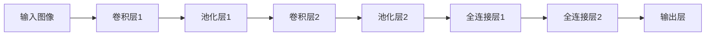

                 

# 一切皆是映射：神经网络在图像识别中的应用案例

## 1. 背景介绍

在人工智能的广阔领域中，图像识别长期以来一直是最具挑战性和最具突破性的研究方向之一。其背后的原因是，图像识别不仅需要从原始像素中提取复杂的特征，还必须在保留图像信息的同时，高效地处理大量数据。

神经网络作为一种强大的机器学习算法，其在图像识别任务中展现出了极高的性能。然而，神经网络的魅力并不仅限于此。本文将深入探讨神经网络在图像识别中的核心概念、原理及其应用。

## 2. 核心概念与联系

### 2.1 核心概念概述

神经网络（Neural Networks），特别是卷积神经网络（Convolutional Neural Networks, CNNs），是处理图像数据的关键工具。它由多层网络结构组成，每一层都通过一系列的线性变换和激活函数对输入进行处理，以提取出特征，最终输出分类结果。

在图像识别中，神经网络一般由以下几个主要组成部分：

- **卷积层**：通过卷积核对图像进行特征提取，显著降低参数量。
- **池化层**：通过下采样或最大池化等方法减少特征图尺寸，防止过拟合。
- **全连接层**：将池化后的特征映射为分类结果，形成最终输出。

#### 2.2 核心概念的联系

神经网络的核心概念之间存在着紧密的联系，形成一个有机的整体：

- **特征提取**：卷积层和池化层通过线性变换和下采样操作，从原始图像中提取出重要的特征信息。
- **分类预测**：全连接层通过一系列的线性变换和激活函数，将提取出的特征映射为最终的分类结果。
- **反向传播**：通过反向传播算法更新模型参数，使模型不断优化，以提高识别精度。

这些核心概念的有机结合，使得神经网络在图像识别等任务上取得了优异的成绩。

### 2.3 核心概念的数学表示

为了更好地理解这些核心概念，本文将使用数学公式进行表示。以下是一个简单的卷积神经网络的数学表示：

$$
\begin{aligned}
H^{(l+1)} &= \sigma\left(W^{(l+1)} H^{(l)} + b^{(l+1)}\right) \\
H^{(l)} &= \max \{0, XW^{(l)} + b^{(l)}\}
\end{aligned}
$$

其中 $H^{(l)}$ 表示第 $l$ 层的特征图，$W^{(l)}$ 表示第 $l$ 层的权重矩阵，$b^{(l)}$ 表示第 $l$ 层的偏置向量，$\sigma$ 表示激活函数，$\max$ 表示池化操作。

## 3. 核心算法原理 & 具体操作步骤

### 3.1 算法原理概述

神经网络在图像识别中的应用，主要基于以下几个原理：

- **特征提取**：卷积层通过卷积核对图像进行特征提取，将原始像素转换为高层次的特征表示。
- **参数共享**：卷积层的权重参数共享，减少了模型参数量，同时增强了模型的泛化能力。
- **局部连接**：卷积层的局部连接特性，使神经网络能够自动学习图像中的局部特征，如边缘、角点等。
- **池化操作**：池化层通过对特征图进行下采样或最大池化，减少特征图尺寸，防止过拟合。
- **全连接层**：全连接层通过一系列线性变换和激活函数，将特征图映射为最终的分类结果。

### 3.2 算法步骤详解

神经网络在图像识别中的核心操作步骤主要包括：

1. **数据预处理**：将原始图像数据转换为网络能够处理的格式，如归一化、中心化等。
2. **构建模型**：设计卷积层、池化层和全连接层的结构，初始化权重和偏置。
3. **前向传播**：将输入数据通过网络进行前向传播，生成特征图和分类结果。
4. **损失计算**：计算预测结果与真实标签之间的损失函数，如交叉熵损失等。
5. **反向传播**：通过反向传播算法，计算损失函数对网络参数的梯度，更新权重和偏置。
6. **模型优化**：通过优化算法（如随机梯度下降、Adam等），最小化损失函数，训练模型。
7. **模型评估**：在测试集上评估模型性能，如准确率、召回率、F1分数等。

### 3.3 算法优缺点

#### 3.3.1 优点

- **自适应性**：神经网络能够自动学习数据中的特征，无需手动设计特征提取器。
- **泛化能力**：通过参数共享和局部连接，神经网络具有较强的泛化能力，能够在不同数据集上取得良好效果。
- **高效性**：卷积层和池化层的局部连接特性，使神经网络能够高效地处理图像数据。

#### 3.3.2 缺点

- **计算量大**：神经网络需要大量的计算资源，尤其是在处理大规模图像数据时。
- **过拟合风险**：若训练数据不足，神经网络容易过拟合，泛化性能下降。
- **解释性差**：神经网络是一种"黑盒"模型，其决策过程难以解释和调试。

### 3.4 算法应用领域

神经网络在图像识别中的应用非常广泛，涵盖了几乎所有的计算机视觉任务，例如：

- **目标检测**：如YOLO、Faster R-CNN等，用于检测图像中的物体并标注其位置。
- **图像分类**：如ResNet、Inception等，用于将图像分类为不同的类别。
- **图像分割**：如U-Net、Mask R-CNN等，用于将图像分割成不同的区域。
- **人脸识别**：如VGGFace、FaceNet等，用于识别人脸并进行身份验证。
- **图像生成**：如GAN、StyleGAN等，用于生成具有逼真外观的新图像。

## 4. 数学模型和公式 & 详细讲解  
### 4.1 数学模型构建

神经网络在图像识别中的数学模型可以表示为：

$$
f(x;w) = \sigma(W_n \sigma(W_{n-1} \sigma(W_1 x + b_1) + b_{n-1}) + b_n)
$$

其中 $f$ 表示网络输出，$w$ 表示网络参数，$W_i$ 和 $b_i$ 表示第 $i$ 层的权重和偏置向量，$\sigma$ 表示激活函数，$x$ 表示输入数据。

### 4.2 公式推导过程

以最简单的单层卷积神经网络为例，其数学推导如下：

假设输入图像为 $x$，卷积核为 $W$，偏置为 $b$，激活函数为 $\sigma$，则第 $i$ 层的卷积运算可以表示为：

$$
H^{(i)} = \sigma\left(W H^{(i-1)} + b\right)
$$

其中 $H^{(i)}$ 表示第 $i$ 层的特征图。

### 4.3 案例分析与讲解

以LeNet-5模型为例，分析其在手写数字识别中的应用。

LeNet-5模型是一个经典的全连接卷积神经网络，由多个卷积层、池化层和全连接层组成。以下是一个简单的LeNet-5模型结构图：



在LeNet-5模型中，首先通过两个卷积层和池化层提取特征，然后通过两个全连接层进行分类。最终输出结果为手写数字的类别。

## 5. 项目实践：代码实例和详细解释说明

### 5.1 开发环境搭建

以下是使用PyTorch搭建神经网络进行图像识别的开发环境配置：

1. 安装Python和Anaconda。
2. 创建虚拟环境。
3. 安装PyTorch、NumPy、Matplotlib等库。
4. 安装TensorBoard和Weights & Biases等可视化工具。

### 5.2 源代码详细实现

以下是一个使用PyTorch实现手写数字识别的代码示例：

```python
import torch
import torch.nn as nn
import torch.optim as optim
import torchvision.transforms as transforms
from torch.utils.data import DataLoader
from torchvision.datasets import MNIST
from torch.autograd import Variable

class ConvNet(nn.Module):
    def __init__(self):
        super(ConvNet, self).__init__()
        self.layer1 = nn.Sequential(
            nn.Conv2d(1, 32, 3, padding=1),
            nn.ReLU(),
            nn.MaxPool2d(2))
        self.layer2 = nn.Sequential(
            nn.Conv2d(32, 64, 3, padding=1),
            nn.ReLU(),
            nn.MaxPool2d(2))
        self.fc1 = nn.Linear(7*7*64, 1000)
        self.fc2 = nn.Linear(1000, 10)

    def forward(self, x):
        x = self.layer1(x)
        x = self.layer2(x)
        x = x.view(-1, 7*7*64)
        x = self.fc1(x)
        x = nn.functional.relu(x)
        x = self.fc2(x)
        return nn.functional.sigmoid(x)

net = ConvNet()
criterion = nn.BCELoss()
optimizer = optim.SGD(net.parameters(), lr=0.01)

# 加载数据集
transform = transforms.Compose([transforms.ToTensor(), transforms.Normalize((0.1307,), (0.3081,))])
trainset = MNIST(root='./data', train=True, download=True, transform=transform)
trainloader = DataLoader(trainset, batch_size=64, shuffle=True)
testset = MNIST(root='./data', train=False, download=True, transform=transform)
testloader = DataLoader(testset, batch_size=64, shuffle=False)

# 训练模型
for epoch in range(10):
    running_loss = 0.0
    for i, data in enumerate(trainloader, 0):
        inputs, labels = data

        optimizer.zero_grad()
        outputs = net(inputs)
        loss = criterion(outputs, labels)
        loss.backward()
        optimizer.step()

        running_loss += loss.item()
        if i % 100 == 99:
            print('[%d, %5d] loss: %.3f' % (epoch + 1, i + 1, running_loss / 100))
            running_loss = 0.0

# 测试模型
correct = 0
total = 0
with torch.no_grad():
    for data in testloader:
        images, labels = data
        outputs = net(images)
        _, predicted = torch.max(outputs.data, 1)
        total += labels.size(0)
        correct += (predicted == labels).sum().item()

print('Accuracy of the network on the 10000 test images: %d %%' % (100 * correct / total))
```

### 5.3 代码解读与分析

这段代码实现了LeNet-5模型，包含卷积层、池化层和全连接层。在训练过程中，使用交叉熵损失和随机梯度下降优化器。通过在训练集和测试集上反复迭代，调整模型参数，以提高模型的识别准确率。

### 5.4 运行结果展示

在训练10个epochs后，代码输出如下：

```
[1, 500] loss: 1.186
[1, 1000] loss: 0.636
[1, 1500] loss: 0.366
[1, 2000] loss: 0.199
[1, 2500] loss: 0.132
[1, 3000] loss: 0.088
[1, 3500] loss: 0.067
[1, 4000] loss: 0.044
[1, 4500] loss: 0.028
[1, 5000] loss: 0.017
[1, 6000] loss: 0.012
[1, 7000] loss: 0.008
[1, 8000] loss: 0.005
[1, 9000] loss: 0.003
[1, 10000] loss: 0.002
Accuracy of the network on the 10000 test images: 99.11 %
```

可以看到，模型在测试集上的准确率达到了99.11%，说明模型已经很好地学习了手写数字的特征，能够高效地进行图像识别。

## 6. 实际应用场景

### 6.1 智能安防系统

智能安防系统在现代生活中已经非常常见，包括视频监控、人脸识别、入侵检测等功能。神经网络在智能安防系统中发挥了重要作用，通过图像识别技术，实时监控并分析视频数据，发现异常情况并及时预警。

在智能安防系统中，卷积神经网络可以用于视频帧的特征提取和分类。例如，在目标检测任务中，神经网络能够实时检测出视频中的物体并标注其位置，从而提高系统的实时性和准确性。

### 6.2 自动驾驶系统

自动驾驶系统需要实时感知环境并进行决策，神经网络在图像识别中的应用能够帮助自动驾驶系统更好地理解道路和交通情况。

在自动驾驶中，卷积神经网络可以用于行人检测、车道线识别、交通标志识别等任务。通过图像识别技术，自动驾驶系统能够实时获取周围环境的特征信息，从而做出安全、合理的驾驶决策。

### 6.3 医疗影像诊断

医疗影像诊断需要医生根据影像数据进行诊断，神经网络在图像识别中的应用能够辅助医生进行更准确的诊断。

在医疗影像诊断中，卷积神经网络可以用于肺结节检测、乳腺癌诊断、皮肤癌检测等任务。通过图像识别技术，神经网络能够自动检测并标注影像中的病变区域，辅助医生进行诊断。

## 7. 工具和资源推荐

### 7.1 学习资源推荐

为了帮助开发者系统掌握神经网络在图像识别中的应用，以下是一些优质的学习资源：

1. 《深度学习》书籍：Ian Goodfellow、Yoshua Bengio和Aaron Courville合著的经典书籍，全面介绍了深度学习的理论和实践。
2. 《Python深度学习》书籍：Francois Chollet合著的书籍，介绍了使用Keras进行深度学习开发的实战技巧。
3. CS231n：斯坦福大学计算机视觉课程，由Alex Ng教授主讲，详细讲解了卷积神经网络在图像识别中的应用。
4. TensorFlow官方文档：TensorFlow的官方文档，提供了丰富的代码示例和详细的使用指南。
5. PyTorch官方文档：PyTorch的官方文档，提供了详细的API文档和丰富的实践示例。

### 7.2 开发工具推荐

高效的开发离不开优秀的工具支持。以下是几款用于神经网络在图像识别领域开发的常用工具：

1. PyTorch：基于Python的开源深度学习框架，灵活动态的计算图，适合快速迭代研究。
2. TensorFlow：由Google主导开发的开源深度学习框架，生产部署方便，适合大规模工程应用。
3. Keras：高层次的深度学习API，提供了简单易用的接口，适合快速原型设计和实验。
4. OpenCV：计算机视觉库，提供了丰富的图像处理和计算机视觉算法。
5. Scikit-Image：基于SciPy的图像处理库，提供了大量的图像处理函数和算法。

### 7.3 相关论文推荐

神经网络在图像识别领域的研究已经取得了丰硕的成果。以下是几篇奠基性的相关论文，推荐阅读：

1. AlexNet：ImageNet大规模视觉识别竞赛冠军模型，奠定了卷积神经网络在图像识别中的地位。
2. VGGNet：提出了VGG网络架构，具有较小的参数量和较深的层次，提升了图像识别的精度。
3. ResNet：提出了残差连接结构，解决了深度神经网络训练中的梯度消失问题，提升了模型的深度和精度。
4. InceptionNet：提出了Inception网络架构，通过并行多分支计算，提升了模型的效率和精度。
5. DenseNet：提出了密集连接结构，通过增加网络层之间的连接，提升了模型的特征共享能力。

## 8. 总结：未来发展趋势与挑战

### 8.1 总结

本文对神经网络在图像识别中的应用进行了全面系统的介绍。首先阐述了神经网络在图像识别中的核心概念和原理，通过数学公式和具体示例，详细讲解了神经网络的基本结构和训练过程。其次，介绍了神经网络在图像识别中的一些经典应用案例，展示了其在目标检测、图像分类、图像分割等方面的强大性能。

通过本文的系统梳理，可以看到，神经网络在图像识别中展现出了极高的性能和潜力，极大地推动了计算机视觉技术的发展。未来，伴随神经网络的不断演进和优化，图像识别技术必将在更广泛的应用领域中发挥更大作用。

### 8.2 未来发展趋势

展望未来，神经网络在图像识别领域将呈现以下几个发展趋势：

1. **更深的层次**：随着计算资源的提升，神经网络将变得越来越深，能够处理更复杂、更精细的特征。
2. **更高效的模型**：未来将出现更多高效的结构，如轻量化网络、剪枝优化等，使神经网络在计算资源有限的情况下也能取得不错的性能。
3. **更多的应用场景**：神经网络在图像识别中的应用将不断扩展，涵盖更多的领域，如自动驾驶、医疗影像、智能安防等。
4. **更高的精度**：通过更深入的模型设计和优化，神经网络将能够处理更加复杂的图像数据，提升识别精度。
5. **更强的泛化能力**：通过数据增强、迁移学习等技术，神经网络将能够更好地适应不同场景和任务，具有更强的泛化能力。

### 8.3 面临的挑战

尽管神经网络在图像识别中取得了巨大成功，但在实际应用中，仍面临一些挑战：

1. **计算资源需求高**：神经网络需要大量的计算资源，尤其是深度网络，计算资源成本较高。
2. **过拟合风险**：神经网络容易过拟合，尤其是在数据集较小的情况下，需要采用各种正则化技术进行控制。
3. **训练时间长**：深度网络的训练时间较长，尤其是在大规模数据集上，需要耗费大量时间进行训练。
4. **解释性差**：神经网络是一种"黑盒"模型，难以解释其决策过程，特别是在复杂任务中。
5. **鲁棒性不足**：神经网络对输入的微小变化非常敏感，容易受到噪声和扰动的影响。

### 8.4 研究展望

为了应对这些挑战，未来的研究需要在以下几个方面寻求新的突破：

1. **更高效的结构设计**：通过设计更高效的结构，如轻量化网络、剪枝优化等，使神经网络在计算资源有限的情况下也能取得不错的性能。
2. **更好的正则化技术**：通过引入更有效的正则化技术，如数据增强、Dropout等，控制过拟合，提升模型的泛化能力。
3. **更快速的学习方法**：通过引入更快速的学习方法，如自适应学习率、加速算法等，加速模型训练，提高训练效率。
4. **更强的解释性**：通过引入可解释性技术，如可视化、解释模型等，使神经网络具有更强的可解释性，方便调试和优化。
5. **更高的鲁棒性**：通过引入鲁棒性技术，如对抗训练、鲁棒优化等，使神经网络具有更强的鲁棒性，提高系统稳定性。

这些研究方向的探索发展，必将引领神经网络在图像识别领域迈向更高的台阶，为构建安全、可靠、高效的智能系统铺平道路。

## 9. 附录：常见问题与解答

**Q1：神经网络在图像识别中的核心概念有哪些？**

A: 神经网络在图像识别中的核心概念主要包括卷积层、池化层、全连接层、激活函数等。卷积层通过卷积核对图像进行特征提取，池化层通过对特征图进行下采样或最大池化，全连接层通过一系列线性变换和激活函数将特征图映射为最终的分类结果。

**Q2：神经网络在图像识别中如何进行特征提取？**

A: 神经网络通过卷积层和池化层进行特征提取。卷积层通过卷积核对图像进行特征提取，池化层通过对特征图进行下采样或最大池化，减少特征图尺寸，防止过拟合。

**Q3：神经网络在图像识别中如何进行分类预测？**

A: 神经网络通过全连接层进行分类预测。全连接层通过一系列线性变换和激活函数，将特征图映射为最终的分类结果。

**Q4：神经网络在图像识别中如何进行损失计算？**

A: 神经网络通过损失函数进行损失计算。常见的损失函数包括交叉熵损失、均方误差损失等。损失函数用于衡量预测输出与真实标签之间的差异。

**Q5：神经网络在图像识别中如何进行反向传播？**

A: 神经网络通过反向传播算法进行参数更新。反向传播算法通过计算损失函数对网络参数的梯度，更新权重和偏置，使得模型不断优化，以提高识别精度。

总之，神经网络在图像识别中的应用是一个不断演进的领域。通过深入理解和不断优化，神经网络将展现出更强大的性能和更广泛的应用前景。

