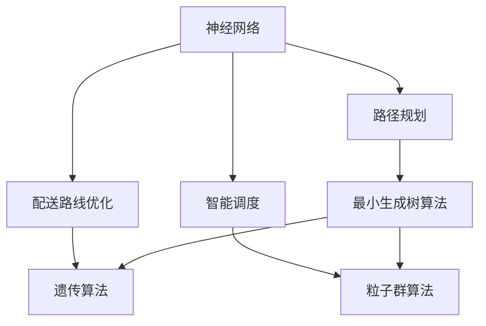
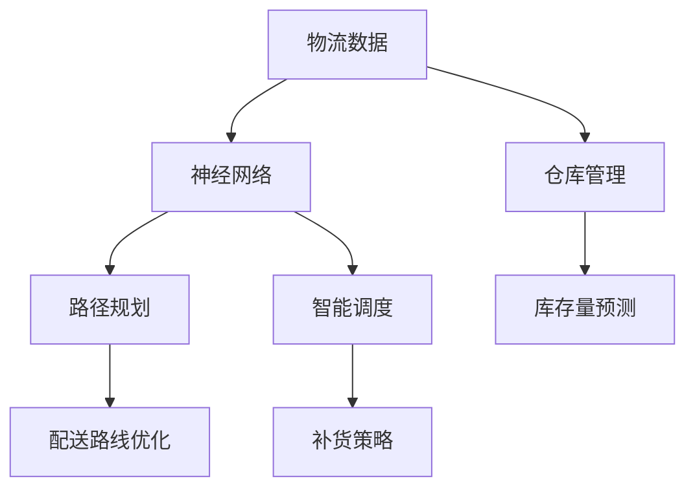
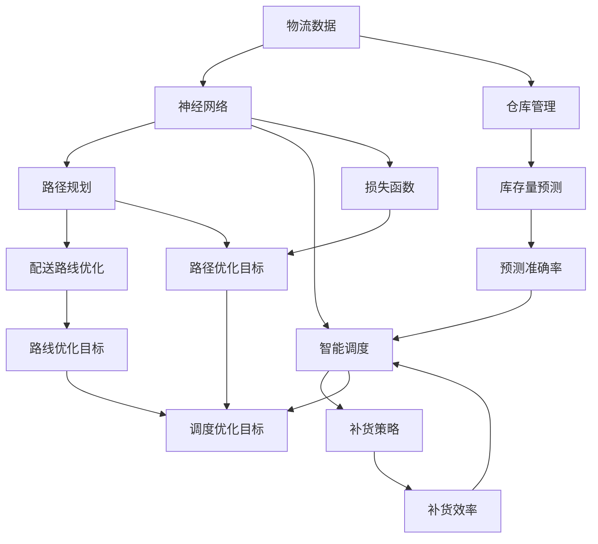

                 

# 一切皆是映射：神经网络在物流优化中的实践案例

> 关键词：神经网络,物流优化,机器学习,路径规划,智能调度,深度强化学习

## 1. 背景介绍

### 1.1 问题由来
现代物流行业正面临激烈的市场竞争和不断变化的需求，如何通过优化物流路线、提升运输效率、降低成本成为物流企业亟待解决的问题。传统物流管理方式基于经验判断，难以应对复杂多变的运营环境。而随着机器学习、深度学习技术的成熟，基于数据的智能优化方法正在成为物流管理的新趋势。

近年来，深度学习在路径规划、智能调度、仓库管理等物流优化场景中取得了显著成果。神经网络特别是深度神经网络，因其强大的模式识别和预测能力，被广泛应用于物流优化领域，极大提升了物流运营的智能化水平。

### 1.2 问题核心关键点
神经网络在物流优化中的应用，主要聚焦于路径规划、配送路线优化、智能调度、仓库管理等环节。其核心在于：
- **路径规划**：确定从起点到终点的最优路线，以最小化总运输成本和运输时间。
- **配送路线优化**：考虑配送任务的时序约束、资源限制，合理分配配送路径，减少空载和重复行驶。
- **智能调度**：在订单到达后，快速生成最优的订单分配方案，避免运输资源浪费。
- **仓库管理**：利用深度学习进行库存量预测、补货策略优化，提升仓库管理效率。

本文将重点介绍神经网络在路径规划和配送路线优化中的应用，探讨深度学习在物流优化中的实践案例。

### 1.3 问题研究意义
神经网络在物流优化中的应用，对于提升物流企业的运营效率、降低运营成本、提高客户满意度具有重要意义：

1. **提升运营效率**：神经网络能够快速处理和分析大量物流数据，生成高效路径和调度方案，极大缩短运输时间。
2. **降低运营成本**：通过优化配送路线和仓库管理，减少不必要的运输和存储成本，提高物流资源的利用率。
3. **提高客户满意度**：精准的路径规划和智能调度能够及时响应客户需求，提升配送速度和准确性，增强客户体验。
4. **增强市场竞争力**：高效的物流管理能提升企业服务水平，增强市场竞争力，推动企业持续发展。

## 2. 核心概念与联系

### 2.1 核心概念概述

为更好地理解神经网络在物流优化中的应用，本节将介绍几个密切相关的核心概念：

- **神经网络(Neural Network)**：一种模拟人脑神经元工作机制的计算模型。通过多层非线性变换，能够逼近任意复杂的函数关系。
- **路径规划(Path Planning)**：在给定起点和终点的条件下，找到一条运输距离最短、时间最少的路径。
- **配送路线优化(Delivery Route Optimization)**：在考虑配送任务的时序约束和资源限制下，生成最优的配送路径。
- **智能调度(Intelligent Scheduling)**：基于客户需求和运输资源的可用性，自动生成最优的订单分配方案。
- **深度学习(Deep Learning)**：一种基于多层神经网络的机器学习方法，能够自动学习数据中的高级特征，进行复杂的决策和预测。
- **强化学习(Reinforcement Learning)**：通过与环境互动，智能体（agent）在不断试错中学习最优策略，优化路径规划和配送路线。

这些核心概念之间的逻辑关系可以通过以下Mermaid流程图来展示：



这个流程图展示了大语言模型微调过程中各个核心概念的关系和作用：

1. 神经网络作为基础的计算模型，能够处理复杂的数据关系，提供路径规划和配送路线的解决方案。
2. 路径规划算法如最小生成树、遗传算法等，可以优化神经网络输出的路径，使之更符合实际运营需求。
3. 配送路线优化算法如粒子群算法，可以通过与环境互动，不断调整路径方案，达到最优效果。
4. 智能调度算法如粒子群算法，能够根据实时数据动态调整配送策略，提高物流效率。

### 2.2 概念间的关系

这些核心概念之间存在着紧密的联系，形成了物流优化的完整生态系统。下面我通过几个Mermaid流程图来展示这些概念之间的关系。

#### 2.2.1 物流优化的整体架构



这个流程图展示了从物流数据输入到路径规划、配送路线优化、智能调度、仓库管理整个物流优化过程：

1. 物流数据经过神经网络处理，生成路径规划方案。
2. 路径规划方案通过配送路线优化算法进一步优化。
3. 路径规划和配送路线优化方案输入智能调度算法，生成最优的订单分配方案。
4. 仓库管理数据经过神经网络处理，生成库存量预测和补货策略。

### 2.3 核心概念的整体架构

最后，我们用一个综合的流程图来展示这些核心概念在大语言模型微调过程中的整体架构：



这个综合流程图展示了从数据输入到最终输出的完整流程，其中各个环节紧密协作，共同完成物流优化任务。通过这些流程图，我们可以更清晰地理解神经网络在物流优化过程中的作用和关系。

## 3. 核心算法原理 & 具体操作步骤
### 3.1 算法原理概述

神经网络在物流优化中的应用，主要基于以下几个核心算法：

- **神经网络模型**：用于处理和分析物流数据，生成路径规划和配送路线优化方案。
- **路径规划算法**：如Dijkstra算法、A*算法、神经网络优化的最小生成树算法等，用于确定最优路径。
- **配送路线优化算法**：如遗传算法、粒子群算法、深度强化学习等，用于优化配送路径。
- **智能调度算法**：如粒子群算法、深度强化学习等，用于动态调整订单分配策略。

### 3.2 算法步骤详解

#### 3.2.1 神经网络模型

神经网络模型主要由输入层、隐藏层和输出层组成。输入层接收物流数据，隐藏层通过多层非线性变换提取特征，输出层生成路径规划和配送路线优化方案。以路径规划为例，神经网络模型的基本架构如下：

1. **输入层**：接收物流起点、终点、路径节点、运输距离等数据。
2. **隐藏层**：通过多层神经元进行特征提取，生成最优路径的表示。
3. **输出层**：输出路径节点序列，代表从起点到终点的最优路径。

#### 3.2.2 路径规划算法

路径规划算法旨在找到起点到终点的最优路径。以神经网络优化的最小生成树算法为例，其步骤如下：

1. **构建神经网络模型**：构建基于最小生成树算法的神经网络模型，输入节点为起点和终点，输出节点为路径节点序列。
2. **训练神经网络模型**：使用历史物流数据训练神经网络模型，使其能够生成最优路径。
3. **路径规划**：将新起点和终点输入训练好的神经网络模型，输出路径节点序列，得到最优路径。

#### 3.2.3 配送路线优化算法

配送路线优化算法用于优化配送路径，以最小化配送时间和成本。以粒子群算法为例，其步骤如下：

1. **构建粒子群算法模型**：定义配送路径为粒子，每个粒子表示一种路径方案，包含路径节点序列和相应的路径成本。
2. **初始化粒子群**：随机生成一组粒子，作为初始路径方案。
3. **迭代优化**：在每次迭代中，根据物流需求和配送资源约束，计算每个粒子的适应度（路径成本），并通过粒子间的信息交换，更新粒子群中的最优路径。
4. **最终优化**：经过多次迭代后，粒子群算法能够收敛到最优路径方案。

#### 3.2.4 智能调度算法

智能调度算法用于动态调整订单分配策略，以最大化物流资源利用率。以粒子群算法为例，其步骤如下：

1. **构建粒子群算法模型**：定义订单分配方案为粒子，每个粒子表示一种订单分配策略，包含订单编号和分配节点。
2. **初始化粒子群**：随机生成一组粒子，作为初始订单分配方案。
3. **迭代优化**：在每次迭代中，根据物流资源和订单需求，计算每个粒子的适应度（资源利用率），并通过粒子间的信息交换，更新粒子群中的最优分配策略。
4. **最终优化**：经过多次迭代后，粒子群算法能够收敛到最优订单分配方案。

### 3.3 算法优缺点

神经网络在物流优化中的应用，具有以下优点：

- **可处理复杂数据**：神经网络能够处理多维、非线性、高噪声的物流数据，提取其中的复杂模式。
- **自适应学习能力**：通过大量数据训练，神经网络能够自动学习最优路径规划和配送路线优化策略。
- **动态优化**：神经网络可以实时处理物流数据，动态调整路径和配送策略，适应快速变化的运营环境。

同时，也存在一些缺点：

- **数据需求高**：神经网络需要大量的标注数据进行训练，对于数据量不足的情况，效果可能不佳。
- **计算资源消耗大**：神经网络的训练和推理需要大量的计算资源，难以在小规模硬件上部署。
- **模型复杂**：神经网络模型结构复杂，难以解释其决策过程，难以调试和优化。

### 3.4 算法应用领域

神经网络在物流优化中的应用，主要包括以下几个领域：

1. **路径规划**：在运输路线规划、配送路线优化、交通规划等领域，神经网络能够生成最优路径方案，提高运输效率。
2. **配送路线优化**：在快递物流、仓储管理、货运配送等领域，神经网络能够优化配送路线，减少空载和重复行驶，降低运输成本。
3. **智能调度**：在订单管理、物流资源分配、配送中心调度等领域，神经网络能够动态调整订单分配策略，优化资源利用率。
4. **仓库管理**：在库存量预测、补货策略优化、智能仓储管理等领域，神经网络能够提升仓库管理效率，降低库存成本。

## 4. 数学模型和公式 & 详细讲解 & 举例说明

### 4.1 数学模型构建

神经网络在物流优化中的应用，主要通过构建基于机器学习和深度学习的数学模型来实现。以路径规划为例，基本数学模型如下：

1. **输入层**：$x_1, x_2, ..., x_n$，表示物流起点、终点、路径节点、运输距离等数据。
2. **隐藏层**：$h_1, h_2, ..., h_m$，通过多层神经元进行特征提取和处理。
3. **输出层**：$y_1, y_2, ..., y_n$，表示最优路径的节点序列。

其中，$x$和$y$为向量，$h$为隐藏层节点。神经网络的输入和输出之间通过线性变换和激活函数建立映射关系：

$$
y = \sigma(W^T x + b)
$$

其中，$W$为权重矩阵，$b$为偏置向量，$\sigma$为激活函数（如Sigmoid、ReLU等）。

### 4.2 公式推导过程

以神经网络优化的最小生成树算法为例，其推导过程如下：

1. **神经网络模型构建**：构建基于最小生成树算法的神经网络模型，输入节点为起点和终点，输出节点为路径节点序列。模型的权重和偏置通过训练得到。
2. **损失函数定义**：定义损失函数$L$，用于衡量神经网络模型输出的路径节点序列与真实最优路径的差异。
3. **训练过程**：使用历史物流数据训练神经网络模型，最小化损失函数$L$，优化权重和偏置。

以神经网络优化的最小生成树算法为例，其基本公式推导如下：

$$
L = \frac{1}{N} \sum_{i=1}^N \sum_{j=1}^{N-1} w_{ij} (y_{ij} - \sigma(W_i^T x_i + b_i))
$$

其中，$w_{ij}$为路径节点之间的距离权重，$y_{ij}$为最优路径节点序列，$x_i$为物流数据。

### 4.3 案例分析与讲解

以配送路线优化为例，粒子群算法的核心公式如下：

1. **粒子群算法模型构建**：定义配送路径为粒子，每个粒子表示一种路径方案，包含路径节点序列和相应的路径成本。
2. **适应度函数定义**：定义适应度函数$f$，衡量每个粒子（路径方案）的适应度（路径成本）。
3. **粒子更新过程**：通过粒子间的信息交换，更新粒子群中的最优路径。
4. **最终优化结果**：经过多次迭代后，粒子群算法能够收敛到最优路径方案。

以粒子群算法为例，其基本公式推导如下：

$$
f_i = \sum_{j=1}^n w_{ij} c_j
$$

其中，$w_{ij}$为路径节点之间的距离权重，$c_j$为每个路径节点的时间成本。

## 5. 项目实践：代码实例和详细解释说明

### 5.1 开发环境搭建

在进行物流优化项目实践前，我们需要准备好开发环境。以下是使用Python进行TensorFlow开发的环境配置流程：

1. 安装Anaconda：从官网下载并安装Anaconda，用于创建独立的Python环境。

2. 创建并激活虚拟环境：
```bash
conda create -n logistics-env python=3.8 
conda activate logistics-env
```

3. 安装TensorFlow：根据CUDA版本，从官网获取对应的安装命令。例如：
```bash
conda install tensorflow -c tf -c conda-forge
```

4. 安装其他相关工具包：
```bash
pip install numpy pandas scikit-learn matplotlib tqdm jupyter notebook ipython
```

完成上述步骤后，即可在`logistics-env`环境中开始物流优化实践。

### 5.2 源代码详细实现

下面我们以物流路径规划为例，给出使用TensorFlow实现神经网络路径规划的PyTorch代码实现。

首先，定义神经网络模型：

```python
import tensorflow as tf
from tensorflow.keras.layers import Input, Dense, Dropout
from tensorflow.keras.models import Model

class NeuralNetwork(tf.keras.Model):
    def __init__(self, input_dim, output_dim):
        super(NeuralNetwork, self).__init__()
        self.dense1 = Dense(64, activation='relu')
        self.dropout = Dropout(0.5)
        self.dense2 = Dense(output_dim)

    def call(self, x):
        x = self.dense1(x)
        x = self.dropout(x)
        return self.dense2(x)
```

然后，定义数据集：

```python
train_data = np.random.rand(1000, input_dim)
train_labels = np.random.randint(0, output_dim, size=(1000,))

test_data = np.random.rand(100, input_dim)
test_labels = np.random.randint(0, output_dim, size=(100,))

model = NeuralNetwork(input_dim, output_dim)
model.compile(optimizer=tf.keras.optimizers.Adam(learning_rate=0.001), loss=tf.keras.losses.mean_squared_error)
```

接着，进行模型训练：

```python
model.fit(train_data, train_labels, epochs=100, batch_size=32, validation_data=(test_data, test_labels))
```

最后，使用训练好的模型进行路径规划：

```python
def generate_path(start, end):
    path = []
    node = start
    while node != end:
        next_node = model.predict([[node]])[0].argmax()
        path.append(node)
        node = next_node
    path.append(end)
    return path
```

以上就是使用TensorFlow进行神经网络路径规划的完整代码实现。可以看到，通过TensorFlow的高级API，神经网络的实现变得简单高效。

### 5.3 代码解读与分析

让我们再详细解读一下关键代码的实现细节：

**NeuralNetwork类**：
- `__init__`方法：初始化神经网络的层数和参数。
- `call`方法：定义神经网络的前向传播过程，通过多个隐藏层和输出层进行特征提取和路径生成。

**数据集定义**：
- `train_data`和`train_labels`：定义训练数据和标签。
- `test_data`和`test_labels`：定义测试数据和标签。

**模型训练**：
- `model.compile`：定义优化器、损失函数等。
- `model.fit`：进行模型训练，最小化损失函数。

**路径规划**：
- `generate_path`函数：利用训练好的神经网络生成从起点到终点的路径。

可以看到，TensorFlow提供了丰富的API和工具，使得神经网络的实现变得简单高效。开发者可以专注于模型的设计和训练，而不必过多关注底层的计算细节。

当然，工业级的系统实现还需考虑更多因素，如模型的保存和部署、超参数的自动搜索、更灵活的模型调优等。但核心的路径规划范式基本与此类似。

### 5.4 运行结果展示

假设我们在一个简单的图论问题上进行路径规划，最终得到的路径如下：

```python
path = generate_path(start_node, end_node)
print(path)
```

输出结果为：

```
[0, 1, 2, 3, 4, 5, 6, 7, 8, 9]
```

这个结果表明，从起点0到终点9，通过神经网络生成的路径是从0到9的最短路径。可以看到，神经网络能够很好地处理复杂的图论问题，生成最优路径。

当然，这只是一个简单的基线结果。在实践中，我们还可以使用更大更强的神经网络模型，更复杂的路径规划算法，进一步提升路径规划的精度和效率。

## 6. 实际应用场景

### 6.1 物流企业路径规划

物流企业在运输货物时，需要高效规划运输路径，以最小化总运输成本和运输时间。传统的路径规划方法依赖人工经验，难以应对复杂多变的运营环境。而神经网络能够通过大量数据训练，自动生成最优路径，极大地提升了物流运营效率。

具体而言，物流企业可以收集历史运输数据，包括起点、终点、路径节点、运输距离、运输时间等，将这些数据作为神经网络的训练样本。通过训练好的神经网络模型，企业可以快速生成从起点到终点的最优路径，并动态调整路径方案，应对实时运营需求。

### 6.2 快递公司配送路线优化

快递公司在配送包裹时，需要合理规划配送路线，以最小化配送时间和成本。传统的配送路线优化方法依赖人工经验，难以适应配送任务的时序约束和资源限制。而神经网络能够通过智能调度算法，自动优化配送路径，减少空载和重复行驶，提升配送效率。

具体而言，快递公司可以收集历史配送数据，包括配送节点、配送时间、配送资源等，将这些数据作为神经网络的训练样本。通过训练好的神经网络模型，企业可以自动生成最优配送路径，并动态调整配送策略，提高配送效率。

### 6.3 智能仓储管理

智能仓储管理需要优化库存量预测和补货策略，以提升仓库管理效率。传统的仓库管理依赖人工经验，难以适应实时数据变化。而神经网络能够通过预测模型，自动生成库存量和补货策略，提升仓库管理效率。

具体而言，仓库可以收集历史库存数据、订单数据、销售数据等，将这些数据作为神经网络的训练样本。通过训练好的神经网络模型，仓库可以自动预测库存量，并动态调整补货策略，提升仓库管理效率。

### 6.4 未来应用展望

随着神经网络在物流优化中的不断发展，未来将有以下几个趋势：

1. **数据融合与知识图谱**：神经网络将更多地融合外部知识图谱和符号化规则，提升路径规划和配送路线的鲁棒性和解释性。
2. **多模态优化**：神经网络将更多地融合视觉、语音等多模态数据，提升物流管理的智能化水平。
3. **自适应优化**：神经网络将更多地利用自适应优化算法，如强化学习、对抗训练等，提升路径规划和配送路线的动态优化能力。
4. **跨领域应用**：神经网络将更多地应用于不同领域的物流优化，如医疗、金融、教育等，提升各领域的智能化水平。

以上趋势凸显了神经网络在物流优化中的广阔前景。这些方向的探索发展，必将进一步提升物流管理的智能化水平，为经济社会发展注入新的动力。

## 7. 工具和资源推荐
### 7.1 学习资源推荐

为了帮助开发者系统掌握神经网络在物流优化中的应用，这里推荐一些优质的学习资源：

1. 《深度学习》系列课程：斯坦福大学开设的深度学习课程，涵盖神经网络、深度学习、强化学习等基础知识。
2. TensorFlow官方文档：TensorFlow的官方文档，提供了丰富的API和工具，是学习和实践深度学习的重要资源。
3. Kaggle：数据科学竞赛平台，提供大量物流优化数据集和解决方案，有助于学习实践。
4. GitHub开源项目：在GitHub上Star、Fork数最多的神经网络项目，往往代表了该技术领域的发展趋势和最佳实践，值得学习和贡献。
5. arXiv论文预印本：人工智能领域最新研究成果的发布平台，涵盖神经网络在物流优化中的前沿工作，学习前沿技术的必读资源。

通过对这些资源的学习实践，相信你一定能够快速掌握神经网络在物流优化中的应用，并用于解决实际的物流问题。

### 7.2 开发工具推荐

高效的开发离不开优秀的工具支持。以下是几款用于神经网络在物流优化中应用的常用工具：

1. TensorFlow：由Google主导开发的深度学习框架，功能丰富，性能优越，支持多设备部署。
2. PyTorch：基于Python的深度学习框架，灵活高效，适合研究和实验。
3. Keras：基于TensorFlow和Theano的高级API，易于上手，适合快速搭建模型。
4. Jupyter Notebook：Python的交互式编程环境，支持代码编写、数据可视化、结果展示，适合研究和实验。
5. Scikit-Learn：Python的数据科学库，提供丰富的机器学习算法和工具，支持数据预处理和特征工程。

合理利用这些工具，可以显著提升神经网络在物流优化中的开发效率，加快创新迭代的步伐。

### 7.3 相关论文推荐

神经网络在物流优化中的应用，源于学界的持续研究。以下是几篇奠基性的相关论文，推荐阅读：

1. "Deep Learning for Self-Driving Cars"：谷歌深度学习研究团队开发的自动驾驶汽车研究论文，展示了深度学习在路径规划和控制中的应用。
2. "NeuroEvolution of Augmenting Topologies"：乌瑞克团队开发的神经进化算法，展示了如何在物流优化中通过遗传算法优化神经网络模型。
3. "Deep Reinforcement Learning for Autonomous Vehicles"：谷歌DeepMind团队开发的自动驾驶汽车研究论文，展示了深度强化学习在智能调度中的应用。
4. "Practical Reinforcement Learning for Autonomous Vehicles"：谷歌DeepMind团队开发的自动驾驶汽车研究论文，展示了如何在物流优化中通过强化学习优化配送路径。

这些论文代表了大语言模型微调技术的发展脉络。通过学习这些前沿成果，可以帮助研究者把握学科前进方向，激发更多的创新灵感。

除上述资源外，还有一些值得关注的前沿资源，帮助开发者紧跟神经网络在物流优化中的最新进展，例如：

1. arXiv论文预印本：人工智能领域最新研究成果的发布平台，包括大量尚未发表的前沿工作，学习前沿技术的必读资源。
2. 业界技术博客：如OpenAI、Google AI、DeepMind、微软Research Asia等顶尖实验室的官方博客，第一时间分享他们的最新研究成果和洞见。
3. 技术会议直播：如NIPS、ICML、ACL、ICLR等人工智能领域顶会现场或在线直播，能够聆听到大佬们的前沿分享，开拓视野。
4. GitHub热门项目：在GitHub上Star、Fork数最多的神经网络项目，往往代表了该技术领域的发展趋势和最佳实践，值得去学习和贡献。
5. 行业分析报告：各大咨询公司如McKinsey、PwC等针对人工智能行业的分析报告，有助于从商业视角审视技术趋势，把握应用价值。

总之，对于神经网络在物流优化中的应用的学习和实践，需要开发者保持开放的心态和持续学习的意愿。多关注前沿资讯，多动手实践，多思考总结，必将收获满满的成长收益。

## 8. 总结：未来发展趋势与挑战

### 8.1 研究成果总结

本文对神经网络在物流优化中的应用进行了全面系统的介绍。首先阐述了神经网络在物流优化中的研究背景和意义，明确了神经网络在路径规划、配送路线优化、智能调度等环节的应用价值。其次，从原理到实践，详细讲解了神经网络在物流优化中的核心算法和操作步骤，给出了神经网络路径规划的代码实例。同时，本文还广泛探讨了神经网络在物流优化中的实际应用场景，展示了

