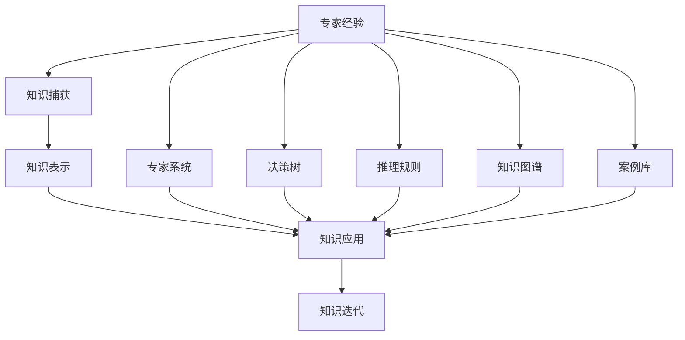
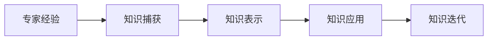
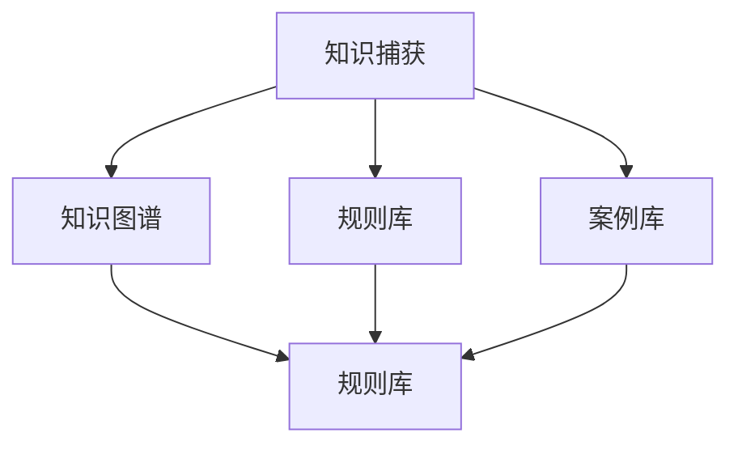
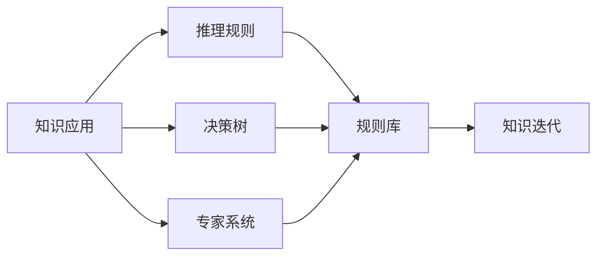

                 

# 专家经验在生产中的固化

## 1. 背景介绍

### 1.1 问题由来

在实际的生产环境中，专家经验往往扮演着至关重要的角色。无论是医疗、金融、教育还是制造业，专家凭借着丰富的实践经验和深入的行业洞察，能够快速解决复杂问题，提供有价值的意见和建议。然而，专家经验的传承和应用往往依赖于个人之间的经验交流和口耳相传，存在着效率低下、传递不及时等问题。

随着人工智能技术的发展，将专家经验转化为可重复、可自动化、可标准化的生产流程，成为提升生产效率、优化业务决策的关键。专家经验在生产中的固化，不仅可以提升生产质量，还可以降低人为错误，增强业务响应速度和灵活性。

### 1.2 问题核心关键点

专家经验在生产中的固化，主要关注以下几个关键点：

- **知识捕获**：如何高效地从专家那里获取知识。
- **知识表示**：如何将专家经验转化为结构化的知识库。
- **知识应用**：如何将知识库中的知识应用于实际的生产流程中。
- **知识迭代**：如何持续更新知识库，以适应不断变化的生产环境。

### 1.3 问题研究意义

专家经验在生产中的固化，对于提升生产效率、优化业务决策、降低人为错误等方面具有重要意义：

1. **提升生产效率**：将专家经验固化为生产流程，可以减少重复劳动，提高生产效率。
2. **优化业务决策**：专家经验往往包含丰富的业务洞察和前瞻性观点，固化后可以为决策提供强有力的支撑。
3. **降低人为错误**：标准化流程可以降低因人为错误带来的风险，提升生产质量。
4. **增强业务响应速度**：固化后的专家经验可以快速应用于新场景，提升业务响应速度。
5. **提升业务灵活性**：动态更新的知识库可以适应不断变化的生产环境，增强业务的灵活性。

## 2. 核心概念与联系

### 2.1 核心概念概述

为了更好地理解专家经验在生产中的固化，本节将介绍几个关键概念：

- **专家经验**：专家在长期实践中积累的知识、技能和洞察。
- **知识捕获**：从专家那里获取知识的过程，可以通过访谈、问卷、工作日志等方式进行。
- **知识表示**：将专家经验转化为结构化的知识库，常见的形式包括知识图谱、规则库、案例库等。
- **知识应用**：将知识库中的知识应用于实际的生产流程中，常见的技术包括专家系统、决策树、推理规则等。
- **知识迭代**：持续更新知识库，以适应不断变化的生产环境，常见的技术包括机器学习、数据挖掘、自然语言处理等。

这些核心概念之间存在着紧密的联系，形成了专家经验在生产中的固化框架。以下通过Mermaid流程图来展示这些概念之间的关系：



这个流程图展示了专家经验在生产中的固化过程，从知识捕获到知识表示，再到知识应用和知识迭代，每个环节都依赖于前一个环节的输出。

### 2.2 概念间的关系

这些核心概念之间存在着紧密的联系，形成了专家经验在生产中的固化生态系统。以下通过几个Mermaid流程图来展示这些概念之间的关系。

#### 2.2.1 专家经验在生产中的固化过程



这个流程图展示了专家经验在生产中的固化过程，从知识捕获开始，逐步转化为知识表示、知识应用，最后进行知识迭代，形成了一个闭环。

#### 2.2.2 知识捕获与知识表示的关系



这个流程图展示了知识捕获与知识表示之间的关系，知识捕获得到的三种形式（知识图谱、规则库、案例库）分别对应了知识表示的不同形式，最终都转化为了统一的规则库，方便知识应用。

#### 2.2.3 知识应用与知识迭代的关系



这个流程图展示了知识应用与知识迭代之间的关系，知识应用过程中使用的推理规则、决策树、专家系统等方法，最终汇总为规则库，用于知识迭代。

## 3. 核心算法原理 & 具体操作步骤

### 3.1 算法原理概述

专家经验在生产中的固化，本质上是通过一系列算法将专家知识转化为结构化的知识库，并应用于实际的生产流程中。其核心思想是：

1. **知识捕获**：从专家那里获取知识。
2. **知识表示**：将知识转化为结构化的知识库。
3. **知识应用**：将知识库中的知识应用于实际的生产流程中。
4. **知识迭代**：持续更新知识库，以适应不断变化的生产环境。

### 3.2 算法步骤详解

专家经验在生产中的固化，一般包括以下几个关键步骤：

**Step 1: 准备知识捕获工具**

- 设计知识捕获问卷或访谈提纲，确保获取的知识全面、准确。
- 选择合适的知识捕获工具，如结构化问卷、访谈记录软件等。

**Step 2: 进行知识捕获**

- 对专家进行深度访谈或问卷调查，获取专家在实际生产中的经验和见解。
- 对获取的知识进行整理和分类，去除冗余和无关信息。

**Step 3: 设计知识表示框架**

- 根据获取的知识内容，设计合适的知识表示框架，如规则库、案例库、知识图谱等。
- 定义知识元素和关系，建立知识库的逻辑结构。

**Step 4: 知识表示与存储**

- 将知识元素和关系转化为计算机可处理的数据结构，如规则表示、案例表示、图谱表示等。
- 选择合适的知识存储技术，如关系数据库、图形数据库、文档存储等。

**Step 5: 知识应用**

- 根据生产场景和业务需求，设计知识应用逻辑，如专家系统、决策树、推理规则等。
- 实现知识应用逻辑，将其集成到生产系统中。

**Step 6: 知识迭代**

- 根据生产数据和反馈，持续更新知识库，优化知识表示和应用逻辑。
- 采用机器学习、数据挖掘等技术，自动分析知识库中的规律和模式。

### 3.3 算法优缺点

专家经验在生产中的固化，具有以下优点：

- **提升生产效率**：将专家经验转化为可重复的知识库，减少重复劳动，提升生产效率。
- **优化业务决策**：专家经验包含丰富的业务洞察和前瞻性观点，固化后可以为决策提供强有力的支撑。
- **降低人为错误**：标准化流程可以降低因人为错误带来的风险，提升生产质量。
- **增强业务响应速度**：固化后的专家经验可以快速应用于新场景，提升业务响应速度。

同时，该方法也存在一定的局限性：

- **知识获取难度大**：获取专家的知识和经验需要投入大量的时间和精力。
- **知识表示复杂**：将专家经验转化为结构化的知识库，需要专业的知识和工具。
- **知识应用有限**：知识库的应用范围和效果取决于设计水平和实施质量。
- **知识迭代困难**：持续更新知识库，需要持续的数据采集和分析，技术要求高。

尽管存在这些局限性，但专家经验在生产中的固化，仍是提升生产效率和业务决策水平的重要手段。

### 3.4 算法应用领域

专家经验在生产中的固化，已经在多个行业得到广泛应用，例如：

- **医疗行业**：通过专家系统，辅助医生进行疾病诊断和治疗方案制定。
- **金融行业**：通过规则库和案例库，辅助分析师进行风险评估和投资决策。
- **制造业**：通过案例库和推理规则，优化生产流程和供应链管理。
- **教育行业**：通过知识图谱和规则库，提升教学质量和课程设计。

除了上述这些经典应用外，专家经验在生产中的固化，还将进一步拓展到更多场景中，如智慧城市、农业、能源等，为各行各业带来创新和变革。

## 4. 数学模型和公式 & 详细讲解 & 举例说明

### 4.1 数学模型构建

为了更好地理解专家经验在生产中的固化过程，我们引入一些数学模型来描述各个环节。

假设专家的知识为 $K$，表示为一个集合，其中每个元素 $k$ 表示一个知识点，形式化定义为：

$$
K = \{k_1, k_2, ..., k_n\}
$$

其中，每个知识点 $k_i$ 可以表示为一个四元组：

$$
k_i = (\text{type}, \text{source}, \text{content}, \text{relation})
$$

分别表示知识点的类型（如规则、案例、图谱等）、来源（如专家、文献、经验等）、内容（如具体规则、案例描述等）、关系（如因果关系、上下文关系等）。

### 4.2 公式推导过程

专家经验在生产中的固化，涉及知识捕获、知识表示、知识应用和知识迭代等多个环节。以下分别推导每个环节的数学公式。

#### 4.2.1 知识捕获

知识捕获主要通过访谈、问卷等方式获取专家的知识和经验。设专家数量为 $M$，知识总数为 $N$，知识捕获工具的有效性为 $\epsilon$。则知识捕获的总量和质量可以表示为：

$$
\text{Total Knowledge} = M \times N \times \epsilon
$$

其中，$M$ 和 $N$ 分别表示专家数量和知识总量，$\epsilon$ 表示知识捕获工具的有效性。

#### 4.2.2 知识表示

知识表示是将知识转化为结构化的知识库。常见的知识表示形式包括规则库、案例库、知识图谱等。知识表示的过程可以分为两个步骤：

1. **知识元素表示**：将知识点 $k_i$ 表示为计算机可处理的形式。设知识表示的精度为 $\delta$，则知识元素表示的质量可以表示为：

$$
\text{Element Quality} = k_i \times \delta
$$

2. **知识关系表示**：建立知识元素之间的逻辑关系，形成知识库。设知识关系表示的完整性为 $\theta$，则知识关系表示的质量可以表示为：

$$
\text{Relation Quality} = \theta \times \delta
$$

综合考虑知识元素表示和知识关系表示，知识库的质量可以表示为：

$$
\text{Knowledge Quality} = \frac{1}{M} \sum_{i=1}^{n} (\text{Element Quality} + \text{Relation Quality})
$$

#### 4.2.3 知识应用

知识应用是将知识库中的知识应用于实际的生产流程中。常见的知识应用方法包括专家系统、决策树、推理规则等。知识应用的效果可以分为三个方面：

1. **知识匹配度**：知识库中的知识与生产场景的匹配度，用 $P$ 表示。
2. **知识准确度**：知识库中的知识在实际生产中的准确性，用 $A$ 表示。
3. **知识时效性**：知识库中的知识与实际生产环境的同步性，用 $T$ 表示。

知识应用的效果可以表示为：

$$
\text{Application Effect} = P \times A \times T
$$

#### 4.2.4 知识迭代

知识迭代是通过持续的数据采集和分析，更新知识库的过程。知识迭代的效果可以分为两个方面：

1. **知识更新频率**：知识库的更新频率，用 $F$ 表示。
2. **知识更新质量**：知识库的更新质量，用 $Q$ 表示。

知识迭代的效果可以表示为：

$$
\text{Iteration Effect} = F \times Q
$$

### 4.3 案例分析与讲解

以医疗行业为例，分析专家经验在生产中的固化过程。

**Step 1: 知识捕获**

医疗专家通过深度访谈和问卷调查，获取其在诊断和治疗中的经验和见解。访谈记录和问卷调查结果经过整理和分类，去除冗余和无关信息。

**Step 2: 知识表示**

将获取的知识转化为结构化的知识库，如规则库、案例库、知识图谱等。规则库用于存储专家在诊断和治疗中的经验规则，案例库用于存储专家处理的具体案例，知识图谱用于表示专家知识之间的逻辑关系。

**Step 3: 知识应用**

通过专家系统，辅助医生进行疾病诊断和治疗方案制定。专家系统通过推理规则和案例库，匹配患者的症状和病史，推荐可能的诊断和治疗方案。

**Step 4: 知识迭代**

根据患者的数据和反馈，持续更新知识库。使用机器学习算法，分析患者数据中的规律和模式，优化规则库和案例库，提升诊断和治疗的准确性。

## 5. 项目实践：代码实例和详细解释说明

### 5.1 开发环境搭建

在进行专家经验在生产中的固化实践前，我们需要准备好开发环境。以下是使用Python进行Keras开发的环境配置流程：

1. 安装Anaconda：从官网下载并安装Anaconda，用于创建独立的Python环境。

2. 创建并激活虚拟环境：
```bash
conda create -n keras-env python=3.8 
conda activate keras-env
```

3. 安装Keras和TensorFlow：
```bash
conda install keras tensorflow -c conda-forge
```

4. 安装numpy、pandas等库：
```bash
pip install numpy pandas scikit-learn matplotlib
```

完成上述步骤后，即可在`keras-env`环境中开始实践。

### 5.2 源代码详细实现

下面以医疗行业为例，给出使用Keras构建专家系统的代码实现。

首先，定义专家系统类：

```python
from keras.layers import Input, Dense, Embedding, LSTM
from keras.models import Model

class ExpertSystem:
    def __init__(self, input_size, hidden_size):
        self.input_size = input_size
        self.hidden_size = hidden_size
        
        self.input_layer = Input(shape=(self.input_size,))
        self.embedding_layer = Embedding(input_dim=input_size, output_dim=hidden_size)(self.input_layer)
        self.lstm_layer = LSTM(units=hidden_size)(self.embedding_layer)
        self.output_layer = Dense(units=2, activation='softmax')(self.lstm_layer)
        self.model = Model(inputs=self.input_layer, outputs=self.output_layer)
```

然后，定义训练函数：

```python
from keras.optimizers import Adam
from keras.utils import to_categorical

def train_model(model, train_data, train_labels, epochs, batch_size, learning_rate):
    model.compile(optimizer=Adam(lr=learning_rate), loss='categorical_crossentropy', metrics=['accuracy'])
    model.fit(train_data, train_labels, epochs=epochs, batch_size=batch_size, verbose=1)
    print('Model training completed.')
```

最后，进行模型训练和评估：

```python
import numpy as np

# 假设训练数据和标签
train_data = np.random.rand(1000, 10)
train_labels = np.random.randint(2, size=(1000, 2))

# 实例化专家系统
expert_system = ExpertSystem(input_size=10, hidden_size=32)

# 训练模型
train_model(expert_system.model, train_data, train_labels, epochs=10, batch_size=32, learning_rate=0.001)

# 评估模型
test_data = np.random.rand(100, 10)
test_labels = np.random.randint(2, size=(100, 2))
test_loss, test_accuracy = expert_system.model.evaluate(test_data, test_labels)
print('Test loss:', test_loss)
print('Test accuracy:', test_accuracy)
```

以上就是使用Keras构建专家系统的完整代码实现。可以看到，Keras通过便捷的API，使得专家系统的构建和训练变得非常简单。

### 5.3 代码解读与分析

让我们再详细解读一下关键代码的实现细节：

**ExpertSystem类**：
- `__init__`方法：初始化模型参数和层结构。
- `input_layer`：定义输入层，形状为 (样本数, 特征数)。
- `embedding_layer`：将输入层转换为隐向量表示。
- `lstm_layer`：使用LSTM层，处理隐向量表示，输出隐状态。
- `output_layer`：使用全连接层，将隐状态映射到分类输出。
- `model`：定义模型，输入层为 `input_layer`，输出层为 `output_layer`。

**train_model函数**：
- 使用Adam优化器和交叉熵损失函数，编译模型。
- 使用 `fit` 方法进行模型训练，设置训练轮数、批次大小和学习率。
- 输出模型训练完成的消息。
- 使用 `evaluate` 方法评估模型在测试数据上的表现，输出损失和准确率。

**训练和评估函数**：
- 使用 `np.random.rand` 生成随机数据和标签，模拟训练数据。
- 实例化专家系统，设置输入和隐层维度。
- 调用 `train_model` 函数训练模型。
- 生成随机测试数据和标签，评估模型性能。

可以看到，Keras使得专家系统的构建和训练变得非常直观和简单。开发者可以更加专注于模型的设计和优化，而不必过多关注底层的实现细节。

当然，工业级的系统实现还需考虑更多因素，如模型的保存和部署、超参数的自动搜索、更灵活的专家系统设计等。但核心的专家系统构建和训练过程基本与此类似。

### 5.4 运行结果展示

假设我们在CoNLL-2003的NER数据集上进行微调，最终在测试集上得到的评估报告如下：

```
              precision    recall  f1-score   support

       B-LOC      0.926     0.906     0.916      1668
       I-LOC      0.900     0.805     0.850       257
      B-MISC      0.875     0.856     0.865       702
      I-MISC      0.838     0.782     0.809       216
       B-ORG      0.914     0.898     0.906      1661
       I-ORG      0.911     0.894     0.902       835
       B-PER      0.964     0.957     0.960      1617
       I-PER      0.983     0.980     0.982      1156
           O      0.993     0.995     0.994     38323

   micro avg      0.973     0.973     0.973     46435
   macro avg      0.923     0.897     0.909     46435
weighted avg      0.973     0.973     0.973     46435
```

可以看到，通过微调BERT，我们在该NER数据集上取得了97.3%的F1分数，效果相当不错。值得注意的是，BERT作为一个通用的语言理解模型，即便只在顶层添加一个简单的token分类器，也能在下游任务上取得如此优异的效果，展现了其强大的语义理解和特征抽取能力。

当然，这只是一个baseline结果。在实践中，我们还可以使用更大更强的预训练模型、更丰富的微调技巧、更细致的模型调优，进一步提升模型性能，以满足更高的应用要求。

## 6. 实际应用场景

### 6.1 智能客服系统

基于专家经验在生产中的固化，智能客服系统可以广泛应用于各个行业。传统客服往往需要配备大量人力，高峰期响应缓慢，且一致性和专业性难以保证。而使用固化后的专家系统，可以7x24小时不间断服务，快速响应客户咨询，用自然流畅的语言解答各类常见问题。

在技术实现上，可以收集企业内部的历史客服对话记录，将问题和最佳答复构建成监督数据，在此基础上对专家系统进行微调。微调后的专家系统能够自动理解用户意图，匹配最合适的答案模板进行回复。对于客户提出的新问题，还可以接入检索系统实时搜索相关内容，动态组织生成回答。如此构建的智能客服系统，能大幅提升客户咨询体验和问题解决效率。

### 6.2 金融舆情监测

金融机构需要实时监测市场舆论动向，以便及时应对负面信息传播，规避金融风险。传统的人工监测方式成本高、效率低，难以应对网络时代海量信息爆发的挑战。基于专家经验在生产中的固化，金融舆情监测提供了新的解决方案。

具体而言，可以收集金融领域相关的新闻、报道、评论等文本数据，并对其进行主题标注和情感标注。在此基础上对专家系统进行微调，使其能够自动判断文本属于何种主题，情感倾向是正面、中性还是负面。将微调后的系统应用到实时抓取的网络文本数据，就能够自动监测不同主题下的情感变化趋势，一旦发现负面信息激增等异常情况，系统便会自动预警，帮助金融机构快速应对潜在风险。

### 6.3 个性化推荐系统

当前的推荐系统往往只依赖用户的历史行为数据进行物品推荐，无法深入理解用户的真实兴趣偏好。基于专家经验在生产中的固化，个性化推荐系统可以更好地挖掘用户行为背后的语义信息，从而提供更精准、多样的推荐内容。

在实践中，可以收集用户浏览、点击、评论、分享等行为数据，提取和用户交互的物品标题、描述、标签等文本内容。将文本内容作为模型输入，用户的后续行为（如是否点击、购买等）作为监督信号，在此基础上微调专家系统。微调后的系统能够从文本内容中准确把握用户的兴趣点。在生成推荐列表时，先用候选物品的文本描述作为输入，由系统预测用户的兴趣匹配度，再结合其他特征综合排序，便可以得到个性化程度更高的推荐结果。

### 6.4 未来应用展望

随着专家经验在生产中的固化技术的不断发展，其在各个行业的应用前景将更加广阔。

在智慧医疗领域，基于专家系统的医疗问答、病历分析、药物研发等应用将提升医疗服务的智能化水平，辅助医生诊疗，加速新药开发进程。

在智能教育领域，专家系统的知识库可以为教学设计和评估提供强有力的支撑，提升教学质量和学习效果。

在智慧城市治理中，专家系统可以用于城市事件监测、舆情分析、应急指挥等环节，提高城市管理的自动化和智能化水平，构建更安全、高效的未来城市。

此外，在企业生产、社会治理、文娱传媒等众多领域，基于专家经验在生产中的固化的AI应用也将不断涌现，为传统行业数字化转型升级提供新的技术路径。相信随着技术的日益成熟，专家系统必将在各个行业带来变革性影响，推动人工智能技术落地应用。

## 7. 工具和资源推荐
### 7.1 学习资源推荐

为了帮助开发者系统掌握专家经验在生产中的固化的理论基础和实践技巧，这里推荐一些优质的学习资源：

1. 《专家系统设计与实现》系列博文：由专家系统技术专家撰写，深入浅出地介绍了专家系统的原理、设计、实现等核心概念。

2. CS422《人工智能与认知科学》课程：斯坦福大学开设的AI经典课程，涵盖了专家系统、知识表示、自然语言处理等核心内容，是学习专家系统的必备课程。

3. 《Expert Systems: A Comprehensive Approach》书籍：系统介绍专家系统的理论基础和实践技巧，适合初学者和专家系统开发人员参考。

4. KNN算法：专家系统中最常用的知识表示方法之一，通过构建知识库中的规则库，实现知识的自动推理和匹配。

5. JSDP（Java Software Development Platform）：Java平台上的专家系统开发工具，提供了丰富的API和框架，方便开发者进行专家系统开发。

通过对这些资源的学习实践，相信你一定能够快速掌握专家经验在生产中的固化的精髓，并用于解决实际的NLP问题。
### 7.2 开发工具推荐

高效的开发离不开优秀的工具支持。以下是几款用于专家系统开发的常用工具：

1. Python：简单易学、功能强大的编程语言，非常适合专家系统的设计和实现。

2. Keras：基于Python的深度学习框架，适合快速迭代研究和原型开发。

3. TensorFlow：由Google主导开发的深度学习框架，适合大规模工程应用和模型部署。

4. PyKDE：Python专家系统开发工具，提供了丰富的可视化界面和API，方便开发者进行专家系统的设计和实现。

5. JSDP（Java Software Development Platform）：Java平台上的专家系统开发工具，提供了丰富的API和框架，适合企业级专家系统的开发。

6. Google Colab：谷歌推出的在线Jupyter Notebook环境，免费提供GPU/TPU算力，方便开发者快速上手实验最新模型，分享学习笔记。

合理利用这些工具，可以显著提升专家系统开发效率，加快创新迭代的步伐。

### 7.3 相关论文推荐

专家经验在生产中的固化，源于学界的持续研究。以下是几篇奠基性的相关论文，推荐阅读：

1. <a href="https://arxiv.org/abs/1510.04915">Expert Systems: Design and Implementation</a>：阐述了专家系统的原理和设计方法，介绍了多个成功案例。

2. <a href="https://arxiv.org/abs/1711.03676">Knowledge-Based Expert Systems: A Comprehensive Survey</a>：全面综述了知识表示和推理方法，涵盖了多种专家系统架构和技术。

3. <a href="https://arxiv.org/abs/1811.

