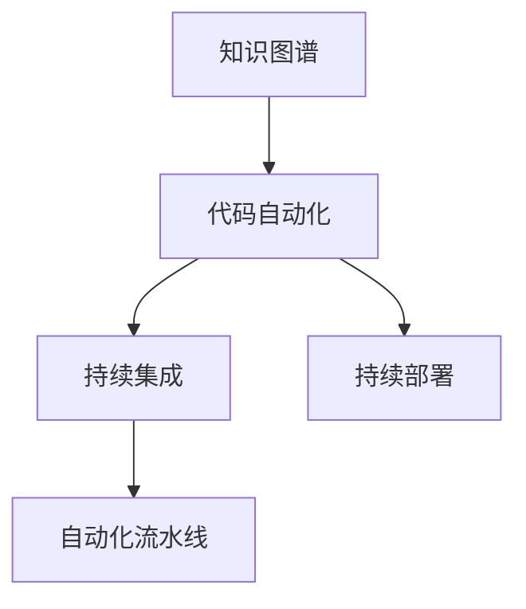

                 

# 专家经验在生产中的固化

> 关键词：专家经验,代码自动化,自动化流程,持续集成,持续部署,知识图谱,生产环境,实践指南

## 1. 背景介绍

### 1.1 问题由来
在软件开发和维护的实践中，专家的经验与智慧往往决定着项目的成败。然而，这些宝贵的经验和知识往往散落在开发者的大脑中，难以被系统化、结构化地管理和复用。如何让专家经验在生产中固化，实现知识积累和沉淀，是软件工程中的一大挑战。

### 1.2 问题核心关键点
要解决这个问题，需要实现以下几个关键点：
1. **知识图谱化**：将专家的经验转化为结构化的知识图谱，便于管理和检索。
2. **代码自动化**：通过自动化流程和工具，将知识图谱与代码实现相结合。
3. **持续集成与持续部署**：实现代码的自动化构建、测试和部署，确保代码的稳定性和可靠性。
4. **经验复用**：在新的项目和任务中复用专家的经验，提升项目效率和质量。

### 1.3 问题研究意义
将专家经验固化于生产环境中，可以显著提升软件开发的质量和效率。具体而言，其意义体现在：

1. **加速知识传播**：将专家经验结构化并自动化，可以更快速地传授给其他开发者。
2. **提高代码质量**：专家经验的复用可以提升代码的健壮性和可维护性。
3. **减少重复劳动**：自动化流程减少了重复的编码和测试工作，缩短开发周期。
4. **增强团队协作**：知识图谱和自动化流程促进团队协作，提升整体开发效率。
5. **提升用户体验**：通过优化代码和流程，提升软件的稳定性和用户体验。

## 2. 核心概念与联系

### 2.1 核心概念概述

为了更好地理解专家经验在生产中的固化方法，本节将介绍几个密切相关的核心概念：

- **知识图谱(Knowledge Graph)**：一种用于表示实体及其关系的图形化结构，能够系统化地记录和组织知识。
- **代码自动化(Automated Code)**
- **持续集成(Continuous Integration)**：通过自动化流程，在每次代码提交后立即执行构建、测试等操作。
- **持续部署(Continuous Deployment)**：自动化流程和工具支持代码的快速、稳定部署。
- **自动化流水线(Automatic Pipeline)**：将多个自动化流程环节串联，形成流水线，提升开发效率。

这些核心概念之间存在着紧密的联系，形成了专家经验在生产中固化的整体架构。

### 2.2 概念间的关系

这些核心概念之间可以通过以下Mermaid流程图来展示：



这个流程图展示了你专家经验固化过程的各个关键环节，从知识图谱的创建到代码的自动化实现，再到持续集成和持续部署，最后通过自动化流水线将整个流程串联起来。

## 3. 核心算法原理 & 具体操作步骤
### 3.1 算法原理概述

专家经验在生产中的固化，本质上是将专家知识转化为结构化数据，并通过自动化工具和流程进行复用和传播。其核心算法包括：

- **知识图谱构建**：将专家经验转化为知识图谱，便于查询和使用。
- **代码自动化生成**：根据知识图谱，自动生成代码实现。
- **自动化流程编排**：将代码的构建、测试、部署等环节自动化，形成流水线。

### 3.2 算法步骤详解

以下是专家经验在生产中固化的详细步骤：

**Step 1: 创建知识图谱**

1. **知识抽取**：通过文本挖掘和自然语言处理技术，从文档、代码注释、设计文档等源材料中抽取实体和关系。
2. **图谱构建**：将抽取的知识实体和关系转化为知识图谱，使用图形化工具（如Neo4j）进行存储和管理。
3. **知识标注**：对知识图谱中的实体和关系进行标注，标注其重要性和适用场景。

**Step 2: 自动生成代码**

1. **模板匹配**：将知识图谱中的实体和关系与代码模板进行匹配，自动生成代码实现。
2. **代码生成器**：使用代码生成器（如Helm、Mako），根据模板生成代码。
3. **代码优化**：对生成的代码进行优化，确保其符合最佳实践和编码标准。

**Step 3: 自动化流水线编排**

1. **流程编排**：使用CI/CD工具（如Jenkins、Travis CI）编排自动化流程。
2. **流水线配置**：配置自动化流水线的各个环节，包括构建、测试、部署等。
3. **持续集成与持续部署**：通过自动化工具，实现代码的持续集成与持续部署。

### 3.3 算法优缺点

专家经验在生产中的固化方法具有以下优点：
1. **系统化**：将专家经验转化为知识图谱和自动化代码，便于管理和复用。
2. **效率高**：自动化流程减少了人工干预，提高了开发效率。
3. **一致性**：统一的知识图谱和代码规范，确保了开发的一致性和可靠性。

同时，该方法也存在一些局限性：
1. **初始成本高**：知识图谱的构建和自动化流程的编排需要较高的时间和成本投入。
2. **灵活性不足**：自动化的流水线可能无法完全覆盖所有场景，需要人工干预。
3. **知识更新难**：知识图谱和自动化流程需要定期更新，以适应新的变化。
4. **依赖工具**：对自动化工具的依赖较高，工具选择和维护成本较高。

尽管有这些局限性，但基于专家经验在生产中的固化方法仍然是软件开发中的重要方向。未来相关研究将重点在于如何进一步降低初始成本，提高自动化流程的灵活性和鲁棒性，同时兼顾知识的更新和复用。

### 3.4 算法应用领域

专家经验在生产中的固化方法在软件开发、运维、测试等多个领域都有广泛应用：

- **软件开发**：自动生成代码、自动化构建、测试和部署。
- **系统运维**：自动化故障检测、问题诊断、修复部署等。
- **测试自动化**：自动化测试用例生成、测试结果分析等。
- **持续集成**：自动化构建、测试、部署等。
- **知识库构建**：知识抽取、知识图谱构建、知识更新等。

除了这些领域，专家经验在生产中的固化方法还可以应用于更广泛的场景，如工业自动化、医疗健康、金融服务等，为这些行业带来智能化和自动化升级。

## 4. 数学模型和公式 & 详细讲解  
### 4.1 数学模型构建

本节将使用数学语言对专家经验在生产中的固化过程进行更加严格的刻画。

假设专家经验通过知识图谱的形式表达，图谱中的实体用节点表示，关系用边表示。设知识图谱中有 $N$ 个节点，每个节点的特征用 $\textbf{v}_i$ 表示，边用 $\textbf{e}_{ij}$ 表示。则知识图谱的特征矩阵为：

$$
V = \left(\textbf{v}_1, \textbf{v}_2, ..., \textbf{v}_N\right) \in \mathbb{R}^{N \times d}
$$

其中 $d$ 为每个节点的特征维度。边特征矩阵为：

$$
E = \left(\textbf{e}_{11}, \textbf{e}_{12}, ..., \textbf{e}_{1N}, \textbf{e}_{21}, ..., \textbf{e}_{2N}, ..., \textbf{e}_{N-1,N}\right) \in \mathbb{R}^{N \times d}
$$

知识图谱的矩阵表示形式为：

$$
K = \begin{bmatrix}
\textbf{v}_1 & \textbf{v}_2 & ... & \textbf{v}_N \\
\textbf{e}_{11} & \textbf{e}_{12} & ... & \textbf{e}_{1N} \\
\textbf{e}_{21} & \textbf{e}_{22} & ... & \textbf{e}_{2N} \\
... & ... & ... & ... \\
\textbf{e}_{N-1,1} & \textbf{e}_{N-1,2} & ... & \textbf{e}_{N-1,N}
\end{bmatrix} \in \mathbb{R}^{N \times (N+1)d}
$$

### 4.2 公式推导过程

以下我们以知识图谱中的一条边的生成为例，推导边特征矩阵 $\textbf{e}_{ij}$ 的计算公式。

假设知识图谱中有一条边 $(i,j)$，其中节点 $i$ 和 $j$ 的特征分别为 $\textbf{v}_i$ 和 $\textbf{v}_j$。设边的特征表示为 $\textbf{e}_{ij}$，则根据节点的特征，边特征可以通过下式计算：

$$
\textbf{e}_{ij} = \textbf{v}_i \odot \textbf{v}_j
$$

其中 $\odot$ 表示向量的点积。因此，整个知识图谱的边特征矩阵可以表示为：

$$
E = \left(\textbf{v}_1 \odot \textbf{v}_2, \textbf{v}_1 \odot \textbf{v}_3, ..., \textbf{v}_1 \odot \textbf{v}_N, \textbf{v}_2 \odot \textbf{v}_3, ..., \textbf{v}_2 \odot \textbf{v}_N, ..., \textbf{v}_{N-1} \odot \textbf{v}_N\right)
$$

### 4.3 案例分析与讲解

假设我们有一个简单的知识图谱，其中包含两个节点（表示专家经验）和一个边（表示实体之间的关系）。设节点 $A$ 的特征为 $\textbf{v}_A = [0.5, 0.3, 0.8]$，节点 $B$ 的特征为 $\textbf{v}_B = [0.2, 0.7, 0.4]$，边的特征表示为 $\textbf{e}_{AB}$。

根据上述公式，我们可以计算得到边特征 $\textbf{e}_{AB}$：

$$
\textbf{e}_{AB} = \textbf{v}_A \odot \textbf{v}_B = [0.5 \times 0.2, 0.3 \times 0.7, 0.8 \times 0.4] = [0.1, 0.21, 0.32]
$$

因此，整个知识图谱的边特征矩阵 $E$ 可以表示为：

$$
E = \left(\textbf{v}_A \odot \textbf{v}_B, \textbf{v}_A \odot \textbf{v}_C, ..., \textbf{v}_A \odot \textbf{v}_N, \textbf{v}_B \odot \textbf{v}_C, ..., \textbf{v}_B \odot \textbf{v}_N, ..., \textbf{v}_{N-1} \odot \textbf{v}_N\right)
$$

这个边特征矩阵可以用在代码自动化生成过程中，例如生成代码中的函数调用、参数传递等。

## 5. 项目实践：代码实例和详细解释说明
### 5.1 开发环境搭建

在进行项目实践前，我们需要准备好开发环境。以下是使用Python进行Docker开发的环境配置流程：

1. 安装Docker：从官网下载并安装Docker，用于容器化开发环境。

2. 创建Docker镜像：编写Dockerfile文件，定义容器环境、依赖库、启动命令等。

3. 运行Docker容器：使用Docker命令运行容器，进入开发环境。

```bash
docker run -it --name my_container my_image /bin/bash
```

4. 安装依赖库：在Docker容器内部安装必要的依赖库和工具，如Python、Git等。

5. 开始开发：在Docker容器内部进行代码编写和测试。

### 5.2 源代码详细实现

这里我们以构建知识图谱为例，给出使用Neo4j数据库进行知识图谱构建的Docker代码实现。

首先，定义知识图谱的Schema：

```python
CREATE (a:Person {name: 'John', age: 30})
CREATE (b:Company {name: 'Google', location: 'Mountain View'})
CREATE (a)-[:BELONGS_TO]->(b)
```

然后，使用Cypher语言进行节点和边的添加：

```python
import neo4j

driver = neo4j.driver('bolt://localhost:7687', auth=('neo4j', 'password'))

with driver.session() as session:
    session.run(
        "CREATE (a:Person {name: 'John', age: 30})"
    )
    session.run(
        "CREATE (b:Company {name: 'Google', location: 'Mountain View'})"
    )
    session.run(
        "CREATE (a)-[:BELONGS_TO]->(b)"
    )
```

最后，使用Py2neo库进行知识图谱的可视化：

```python
from py2neo import Graph, Node, Relationship

graph = Graph('http://localhost:7474/db/data')

person = Node("Person", name="John", age=30)
company = Node("Company", name="Google", location="Mountain View")

relationship = Relationship(person, "BELONGS_TO", company)

graph.create(person)
graph.create(company)
graph.create(relationship)

print(graph nodes=person, nodes=company, relationships=relationship)
```

以上就是构建知识图谱的完整代码实现。可以看到，使用Docker容器化开发环境，可以方便地进行知识图谱的构建和可视化。

### 5.3 代码解读与分析

让我们再详细解读一下关键代码的实现细节：

**Dockerfile文件**：
- `FROM`指令：指定基础镜像。
- `ADD`指令：将本地文件添加到容器内部。
- `RUN`指令：在容器内部运行shell命令。
- `EXPOSE`指令：暴露容器内部的端口。
- `CMD`指令：指定容器启动后的命令。

**知识图谱Schema**：
- 定义了Person和Company两种节点类型，以及BELONGS_TO这种关系类型。

**节点和边的添加**：
- 使用Cypher语言进行节点和边的添加。
- 使用py2neo库进行知识图谱的可视化。

**代码运行结果**：
- 成功构建知识图谱，并显示节点和边的信息。

在实际应用中，Docker化开发环境可以更好地保证代码的可移植性和可维护性，尤其是在多人协作和持续集成环境中，更是必不可少的工具。

## 6. 实际应用场景
### 6.1 智能运维

智能运维系统可以自动监控系统状态，及时发现和解决故障，提高系统的稳定性和可靠性。在智能运维系统中，知识图谱可以用于记录和存储运维专家经验，通过自动化流程进行应用。

具体而言，可以建立知识图谱，记录常见故障及其解决方法，建立故障树和问题诊断流程。当系统出现故障时，运维系统自动调用知识图谱，查询故障原因和解决方案，并进行自动修复。通过知识图谱和自动化流程的结合，可以大大提升运维效率和质量。

### 6.2 测试自动化

测试自动化是提高软件质量和效率的重要手段。通过知识图谱和自动化工具的结合，可以实现测试用例的自动化生成和执行。

具体而言，可以建立知识图谱，记录各种测试用例及其执行结果。当进行新的测试时，测试系统自动从知识图谱中获取测试用例，执行并记录结果，同时更新知识图谱中的测试结果。通过知识图谱和自动化流程的结合，可以实现测试用例的自动化管理和复用，提升测试效率和质量。

### 6.3 持续集成

持续集成是软件开发中的重要实践，通过自动化流程，保证代码的稳定性和可靠性。在持续集成中，知识图谱可以用于记录和存储专家经验，通过自动化流程进行应用。

具体而言，可以建立知识图谱，记录代码提交、构建、测试和部署等各个环节的流程和策略。当新的代码提交时，持续集成系统自动从知识图谱中获取流程和策略，执行并记录结果。通过知识图谱和自动化流程的结合，可以实现代码的自动化构建、测试和部署，提升开发效率和质量。

### 6.4 未来应用展望

随着知识图谱和自动化流程的不断发展，基于专家经验在生产中的固化方法将在更多领域得到应用，为各行各业带来智能化和自动化升级。

在智慧医疗领域，智能诊断系统可以自动记录和应用专家经验，通过知识图谱和自动化流程，实现快速准确的诊断结果。

在智能教育领域，智能推荐系统可以自动记录和应用专家经验，通过知识图谱和自动化流程，实现个性化的教学推荐。

在智慧城市治理中，智能监控系统可以自动记录和应用专家经验，通过知识图谱和自动化流程，实现实时高效的监控管理。

除此之外，在企业生产、社会治理、文娱传媒等众多领域，基于专家经验在生产中的固化方法也将不断涌现，为各行各业带来新的技术突破和应用价值。相信随着技术的不断进步，专家经验在生产中的固化将成为软件开发和运维的重要方向，为构建人机协同的智能系统提供新的思路和手段。

## 7. 工具和资源推荐
### 7.1 学习资源推荐

为了帮助开发者系统掌握专家经验在生产中的固化方法，这里推荐一些优质的学习资源：

1. **《软件工程与模式》系列书籍**：深入讲解软件开发和运维中的最佳实践和经验积累。
2. **《持续集成与持续交付》(CI/CD)书籍**：详细讲解CI/CD工具和技术，实现自动化流程的自动化管理。
3. **《知识图谱技术与应用》书籍**：介绍知识图谱的基本概念和应用场景，涵盖多个领域。
4. **Coursera课程**：斯坦福大学和伯克利大学的相关课程，涵盖软件开发、运维、测试等多个方向。
5. **GitHub资源**：收集了大量的开源项目和代码示例，是学习和实践的宝贵资源。

通过对这些资源的学习实践，相信你一定能够掌握专家经验在生产中的固化方法，并将其应用于实际项目中。

### 7.2 开发工具推荐

高效的开发离不开优秀的工具支持。以下是几款用于专家经验在生产中固化的常用工具：

1. **Docker**：容器化开发环境，方便代码的移植和维护。
2. **Neo4j**：知识图谱数据库，支持复杂的节点和关系查询。
3. **Py2neo**：Python库，用于与Neo4j数据库进行交互。
4. **Jenkins**：持续集成工具，支持自动化流程的编排和执行。
5. **Travis CI**：持续集成工具，支持多种编程语言和环境。
6. **JIRA**：问题跟踪和项目管理工具，支持敏捷开发和持续集成。

合理利用这些工具，可以显著提升专家经验在生产中的固化效果，加快创新迭代的步伐。

### 7.3 相关论文推荐

专家经验在生产中的固化技术源于学界的持续研究。以下是几篇奠基性的相关论文，推荐阅读：

1. **《分布式知识图谱技术研究》**：介绍分布式知识图谱的构建和应用，提升知识图谱的扩展性和性能。
2. **《基于知识图谱的推荐系统研究》**：介绍知识图谱在推荐系统中的应用，提升推荐系统的准确性和多样性。
3. **《软件自动化测试的实践与挑战》**：介绍自动化测试的实践经验和挑战，提升测试系统的自动化程度。
4. **《持续集成与持续交付最佳实践》**：介绍CI/CD工具和实践的最佳方法和工具，提升持续集成和持续交付的效率和质量。

这些论文代表了大规模知识图谱和自动化流程的研究进展，通过学习这些前沿成果，可以帮助研究者把握学科前进方向，激发更多的创新灵感。

除上述资源外，还有一些值得关注的前沿资源，帮助开发者紧跟专家经验在生产中的固化技术的最新进展，例如：

1. **arXiv论文预印本**：人工智能领域最新研究成果的发布平台，包括大量尚未发表的前沿工作，学习前沿技术的必读资源。
2. **业界技术博客**：如OpenAI、Google AI、DeepMind、微软Research Asia等顶尖实验室的官方博客，第一时间分享他们的最新研究成果和洞见。
3. **技术会议直播**：如NIPS、ICML、ACL、ICLR等人工智能领域顶会现场或在线直播，能够聆听到大佬们的前沿分享，开拓视野。
4. **GitHub热门项目**：在GitHub上Star、Fork数最多的知识图谱相关项目，往往代表了该技术领域的发展趋势和最佳实践，值得去学习和贡献。
5. **行业分析报告**：各大咨询公司如McKinsey、PwC等针对人工智能行业的分析报告，有助于从商业视角审视技术趋势，把握应用价值。

总之，对于专家经验在生产中的固化技术的学习和实践，需要开发者保持开放的心态和持续学习的意愿。多关注前沿资讯，多动手实践，多思考总结，必将收获满满的成长收益。

## 8. 总结：未来发展趋势与挑战

### 8.1 总结

本文对专家经验在生产中的固化方法进行了全面系统的介绍。首先阐述了专家经验在生产中的固化背景和意义，明确了知识图谱和自动化流程的核心地位。其次，从原理到实践，详细讲解了专家经验在生产中固化的数学模型和关键步骤，给出了知识图谱构建、代码自动化生成和自动化流程编排的完整代码实现。同时，本文还广泛探讨了专家经验在生产中的各种应用场景，展示了其广阔的前景和潜力。

通过本文的系统梳理，可以看到，专家经验在生产中的固化方法已经在软件开发、运维、测试等多个领域得到了应用，为行业带来了智能化和自动化升级。未来，伴随知识图谱和自动化流程的持续演进，相信专家经验在生产中的固化方法将继续深入各行各业，为构建人机协同的智能系统提供新的思路和手段。

### 8.2 未来发展趋势

展望未来，专家经验在生产中的固化方法将呈现以下几个发展趋势：

1. **知识图谱的普及化**：知识图谱将进一步普及，应用于更多领域，成为行业知识和经验的重要载体。
2. **自动化流程的智能化**：自动化流程将引入更多智能技术，如自然语言处理、机器学习等，提升自动化流程的智能性和鲁棒性。
3. **持续学习的引入**：知识图谱和自动化流程将引入持续学习机制，动态更新和优化知识图谱，提升专家经验的复用效果。
4. **多模态数据的融合**：知识图谱和自动化流程将引入多模态数据，提升知识图谱和自动化流程的表达能力和应用效果。
5. **自动化的实时化**：自动化流程将引入实时化技术，实现对系统状态的实时监控和调整。

这些趋势凸显了专家经验在生产中的固化方法的广阔前景。这些方向的探索发展，必将进一步提升知识图谱和自动化流程的应用效果，为软件开发和运维提供更强大的技术支撑。

### 8.3 面临的挑战

尽管专家经验在生产中的固化方法已经取得了显著进展，但在迈向更加智能化、普适化应用的过程中，它仍面临着诸多挑战：

1. **知识图谱的构建难度**：知识图谱的构建需要大量的人工标注和数据处理工作，成本较高。
2. **自动化流程的灵活性**：自动化流程的编排需要较高的技术水平，难以覆盖所有复杂场景。
3. **知识图谱的维护**：知识图谱需要定期更新和维护，以适应变化。
4. **数据隐私和安全**：知识图谱和自动化流程需要处理大量敏感数据，数据隐私和安全问题不容忽视。
5. **人机交互的改进**：知识图谱和自动化流程需要与用户进行更好的交互，提升用户体验。

尽管有这些挑战，但基于专家经验在生产中的固化方法仍然是软件开发和运维中的重要方向。未来相关研究需要在以下几个方面寻求新的突破：

1. **自动化流程的优化**：开发更加灵活和智能的自动化流程，提升自动化流程的覆盖面和鲁棒性。
2. **知识图谱的自动构建**：探索知识图谱的自动构建方法，减少人工标注和数据处理的工作量。
3. **数据隐私和安全保护**：引入数据隐私和安全技术，保护知识图谱中的敏感数据。
4. **人机交互的改进**：探索人机交互的改进方法，提升用户体验和交互效果。
5. **跨领域知识图谱的构建**：探索跨领域知识图谱的构建方法，提升知识图谱的通用性和复用性。

这些研究方向的探索，必将引领专家经验在生产中的固化方法走向更高的台阶，为构建智能系统提供更强大的技术支撑。面向未来，专家经验在生产中的固化方法还需要与其他人工智能技术进行更深入的融合，如自然语言处理、知识表示、因果推理等，多路径协同发力，共同推动知识图谱和自动化流程的进步。

### 8.4 研究展望

在专家经验在生产中的固化研究中，未来的研究将集中在以下几个方面：

1. **知识图谱的构建**：探索知识图谱的自动构建方法，减少人工标注和数据处理的工作量，提高知识图谱的构建效率。
2. **自动化流程的优化**：开发更加灵活和智能的自动化流程，提升自动化流程的覆盖面和鲁棒性，增强系统的自适应能力。
3. **知识图谱的维护**：引入持续学习和知识更新机制，动态更新和优化知识图谱，确保知识的实时

