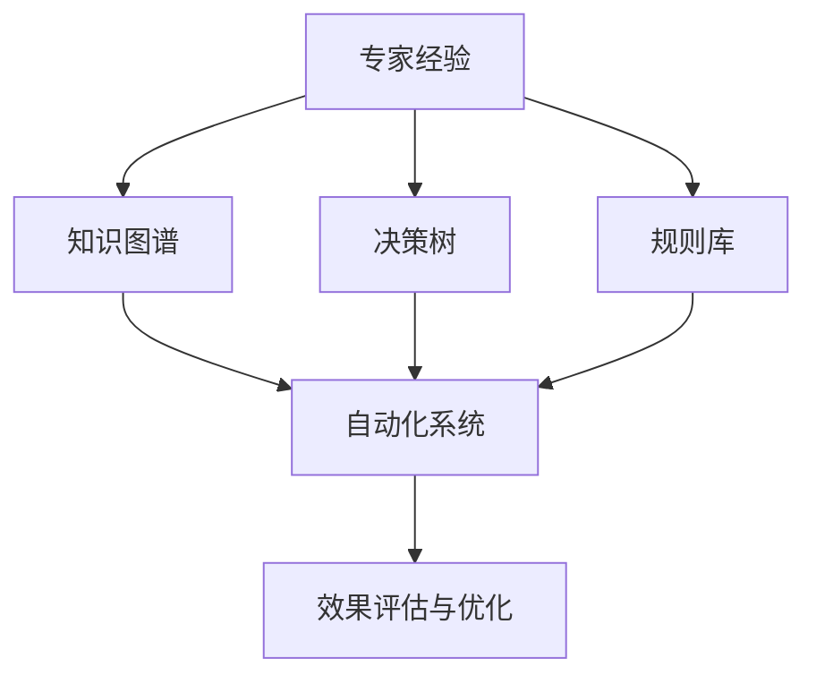

                 

# 专家经验在自动化中的应用

## 1. 背景介绍

### 1.1 问题由来
随着人工智能（AI）技术的发展，自动化在各行各业的应用越来越广泛。其中，专家经验的自动化应用（Expertise Automation）成为一个热点。专家经验是领域专家在长期实践中积累的知识和技能，具有高度的复杂性和非结构化特性。如何将这些经验有效地转化为可操作的知识库，从而实现自动化应用，是当前的一大挑战。

### 1.2 问题核心关键点
1. **专家经验提取**：首先需要从专家案例、文档、知识库等文本中提取有价值的知识，如规则、模式、策略等。
2. **知识表达与建模**：将提取的知识以结构化或半结构化的形式进行表达，构建知识图谱、决策树、规则库等模型。
3. **自动化系统设计**：将知识模型与自动化系统架构相结合，设计可执行的自动化流程。
4. **系统实现与部署**：将设计好的自动化系统进行编码实现，并部署到实际应用环境中。
5. **效果评估与优化**：对自动化系统的实际运行效果进行评估，根据反馈不断优化系统性能。

### 1.3 问题研究意义
专家经验的自动化应用具有重要意义：

- **降低成本**：自动化系统可以替代人力进行复杂任务，减少人力成本。
- **提高效率**：自动化系统能够快速处理大量数据，提高工作效率。
- **提升质量**：自动化系统可以减少人为错误，提升作业质量。
- **促进创新**：自动化系统可以作为创新工具，辅助领域专家探索新方法和新思路。
- **赋能产业升级**：自动化技术可以赋能传统行业，推动数字化转型。

## 2. 核心概念与联系

### 2.1 核心概念概述

- **专家经验**：领域专家在长期实践中积累的知识和技能，具有高度的复杂性和非结构化特性。
- **知识图谱**：一种以图的形式组织和表示知识的模型，用于描述实体、属性和它们之间的关系。
- **决策树**：一种基于树形结构的决策模型，用于模拟决策过程和规则推理。
- **规则库**：一组明确的、可执行的规则，用于指导自动化系统的行为。
- **自动化系统**：利用计算机技术实现的、可自动执行的系统，用于解决特定问题或完成特定任务。

这些概念之间存在紧密联系，形成一个完整的专家经验自动化应用框架。

### 2.2 概念间的关系

- **专家经验提取**与**知识图谱、决策树、规则库**：专家经验首先需要被提取和建模，然后才能用于构建自动化系统。
- **知识图谱、决策树、规则库**与**自动化系统设计**：这些知识模型是自动化系统的核心，用于指导系统的设计和实现。
- **自动化系统**与**效果评估与优化**：自动化系统的实际运行效果需要通过评估来反馈，进而进行优化。

这些概念之间的关系可以通过以下Mermaid流程图来展示：



这个流程图展示了从专家经验到自动化系统的整个流程，以及各部分之间的依赖关系。

## 3. 核心算法原理 & 具体操作步骤
### 3.1 算法原理概述

专家经验的自动化应用涉及到多个学科的算法和原理，包括自然语言处理（NLP）、机器学习（ML）、图数据库管理等。总体而言，可以概括为以下几个步骤：

1. **专家经验提取**：通过文本挖掘、知识抽取等技术，从专家文档、案例等文本中提取知识。
2. **知识表达与建模**：将提取的知识进行结构化或半结构化表达，构建知识图谱、决策树、规则库等模型。
3. **自动化系统设计**：将知识模型与自动化系统架构相结合，设计可执行的自动化流程。
4. **系统实现与部署**：将设计好的自动化系统进行编码实现，并部署到实际应用环境中。
5. **效果评估与优化**：对自动化系统的实际运行效果进行评估，根据反馈不断优化系统性能。

### 3.2 算法步骤详解

#### 3.2.1 专家经验提取
专家经验提取是知识自动化的第一步。常见的提取方法包括：

- **文本挖掘**：利用NLP技术，从专家文档、案例中抽取结构化信息，如实体、关系、属性等。
- **知识抽取**：通过专家标注、领域本体等方式，从非结构化文本中提取规则、模式等。
- **数据清洗**：对提取的数据进行清洗和预处理，去除噪声和冗余信息。

具体步骤包括：

1. **数据准备**：收集专家文档、案例、知识库等文本数据。
2. **分词与词性标注**：使用分词工具进行分词，并标注每个词的词性。
3. **命名实体识别**：使用命名实体识别（NER）技术，识别文本中的实体（如人名、地名、机构名等）。
4. **关系抽取**：使用关系抽取技术，从文本中抽取实体之间的关系。
5. **规则抽取**：通过专家标注或领域本体，从文本中抽取专家规则和模式。

#### 3.2.2 知识表达与建模
知识表达与建模是将提取的知识以结构化形式进行组织和表示的过程。常见的知识模型包括：

- **知识图谱**：使用图数据库管理，表示实体、属性和它们之间的关系。
- **决策树**：基于树形结构，表示决策流程和规则。
- **规则库**：使用规则引擎，存储和执行专家规则。

具体步骤包括：

1. **构建知识图谱**：使用图数据库（如Neo4j）构建知识图谱，描述实体、属性和它们之间的关系。
2. **构建决策树**：使用决策树算法（如C4.5、ID3等）构建决策树，用于模拟专家决策过程。
3. **构建规则库**：使用规则引擎（如Rete）构建规则库，存储和执行专家规则。

#### 3.2.3 自动化系统设计
自动化系统设计是将知识模型与自动化系统架构相结合的过程。常见的自动化系统包括：

- **工作流管理系统**：用于管理自动化任务的流程和执行。
- **自动化决策系统**：用于基于规则和决策树进行自动化决策。
- **事件驱动系统**：用于处理实时事件，并触发自动化任务。

具体步骤包括：

1. **系统架构设计**：根据知识模型设计自动化系统的架构，包括数据流、控制流和任务执行流程。
2. **工作流设计**：设计工作流，定义自动化任务及其执行顺序。
3. **规则定义**：定义自动化规则，与决策树和知识图谱进行集成。

#### 3.2.4 系统实现与部署
系统实现与部署是将设计好的自动化系统进行编码实现，并部署到实际应用环境中的过程。常见的工具和平台包括：

- **编程语言**：Python、Java等。
- **开发框架**：Spring Boot、Flask等。
- **容器化工具**：Docker、Kubernetes等。
- **云平台**：AWS、Google Cloud等。

具体步骤包括：

1. **编码实现**：根据系统架构设计进行编码实现，使用编程语言和开发框架。
2. **容器化部署**：将系统打包为容器镜像，使用容器化工具进行部署和管理。
3. **云平台部署**：将容器镜像部署到云平台，使用云平台的管理和监控工具。

#### 3.2.5 效果评估与优化
效果评估与优化是对自动化系统的实际运行效果进行评估，并根据反馈不断优化系统性能的过程。

具体步骤包括：

1. **性能评估**：通过实验和测试，评估自动化系统的性能指标，如准确率、召回率、响应时间等。
2. **用户反馈**：收集用户反馈，了解系统在实际应用中的表现和问题。
3. **系统优化**：根据评估结果和用户反馈，优化系统架构、算法和实现方式，提升系统性能。

### 3.3 算法优缺点

**优点**：

- **提高效率**：自动化系统可以快速处理大量数据，提高工作效率。
- **降低成本**：自动化系统可以替代人力进行复杂任务，减少人力成本。
- **提升质量**：自动化系统可以减少人为错误，提升作业质量。
- **促进创新**：自动化系统可以作为创新工具，辅助领域专家探索新方法和新思路。
- **赋能产业升级**：自动化技术可以赋能传统行业，推动数字化转型。

**缺点**：

- **成本较高**：自动化系统的开发和部署需要较高的成本，包括人力、硬件和软件成本。
- **依赖数据质量**：自动化系统的性能高度依赖于输入数据的质量，数据偏差可能导致系统失效。
- **系统复杂性**：自动化系统设计复杂，需要丰富的领域知识和工程经验。
- **可解释性不足**：自动化系统的决策过程通常缺乏可解释性，难以对其推理逻辑进行分析和调试。

### 3.4 算法应用领域

专家经验的自动化应用已经在多个领域取得了成功。以下是几个典型应用领域：

#### 3.4.1 金融行业
在金融行业，自动化系统可以用于自动化风险评估、智能投顾、金融欺诈检测等。通过提取和建模专家知识，构建知识图谱和决策树，可以显著提高金融服务的效率和质量。

#### 3.4.2 医疗行业
在医疗行业，自动化系统可以用于自动化诊断、治疗方案推荐、病历管理等。通过提取和建模专家知识，构建知识图谱和规则库，可以提升医疗服务的效率和准确性。

#### 3.4.3 制造行业
在制造行业，自动化系统可以用于自动化生产调度、质量控制、设备维护等。通过提取和建模专家知识，构建知识图谱和决策树，可以提高生产效率和产品质量。

#### 3.4.4 物流行业
在物流行业，自动化系统可以用于自动化仓储管理、路径规划、配送调度等。通过提取和建模专家知识，构建知识图谱和规则库，可以优化物流运营，降低成本。

#### 3.4.5 智能客服
在智能客服领域，自动化系统可以用于自动化问答、情感分析、客户分群等。通过提取和建模专家知识，构建知识图谱和规则库，可以提高客户服务效率和质量。

## 4. 数学模型和公式 & 详细讲解 & 举例说明

### 4.1 数学模型构建

专家经验的自动化应用涉及到多个学科的数学模型。以下是几个常见的数学模型：

#### 4.1.1 知识图谱
知识图谱是一种以图的形式组织和表示知识的模型，用于描述实体、属性和它们之间的关系。常见的知识图谱模型包括RDF图、SPO图等。

#### 4.1.2 决策树
决策树是一种基于树形结构的决策模型，用于模拟决策过程和规则推理。常见的决策树算法包括ID3、C4.5等。

#### 4.1.3 规则库
规则库是一种存储和执行专家规则的模型。常见的规则库包括基于Rete的规则引擎。

### 4.2 公式推导过程

#### 4.2.1 知识图谱
知识图谱的构建通常包括以下几个步骤：

1. **实体识别**：从文本中识别实体，如人名、地名、机构名等。
2. **关系抽取**：从文本中抽取实体之间的关系，如父子关系、同属关系等。
3. **属性抽取**：从文本中抽取实体的属性，如时间、地点、事件等。
4. **构建图谱**：使用图数据库（如Neo4j）构建知识图谱，描述实体、属性和它们之间的关系。

#### 4.2.2 决策树
决策树的构建通常包括以下几个步骤：

1. **数据预处理**：对数据进行清洗、归一化等预处理。
2. **特征选择**：选择对决策有影响的特征，进行特征提取和选择。
3. **决策树构建**：使用决策树算法（如C4.5、ID3等）构建决策树。
4. **剪枝和优化**：对决策树进行剪枝和优化，提高决策树的泛化能力和效率。

#### 4.2.3 规则库
规则库的构建通常包括以下几个步骤：

1. **规则定义**：定义专家规则，如if-then-else规则。
2. **规则存储**：将专家规则存储到规则库中，使用规则引擎（如Rete）进行执行。
3. **规则优化**：对规则库进行优化，提高规则的执行效率和准确性。

### 4.3 案例分析与讲解

#### 4.3.1 金融风险评估
在金融行业，自动化系统可以用于自动化风险评估。通过提取和建模专家知识，构建知识图谱和决策树，可以实现对客户信用风险的自动化评估。

具体步骤如下：

1. **数据准备**：收集客户信用评估数据，包括个人基本信息、财务状况、历史交易记录等。
2. **知识提取**：通过文本挖掘、知识抽取等技术，从客户记录中提取知识，如财务指标、历史交易模式等。
3. **知识建模**：使用知识图谱和决策树，构建知识图谱和决策树模型，描述客户信用评估的规则和流程。
4. **系统设计**：设计自动化系统架构，包括数据流、控制流和任务执行流程。
5. **系统实现与部署**：使用Python、Spring Boot等技术进行系统实现和容器化部署。
6. **效果评估与优化**：通过实验和测试，评估自动化系统的性能指标，根据用户反馈不断优化系统性能。

#### 4.3.2 医疗诊断辅助
在医疗行业，自动化系统可以用于自动化诊断辅助。通过提取和建模专家知识，构建知识图谱和规则库，可以实现对疾病的自动化诊断和辅助诊断。

具体步骤如下：

1. **数据准备**：收集医疗诊断数据，包括患者症状、病史、影像等。
2. **知识提取**：通过文本挖掘、知识抽取等技术，从诊断记录中提取知识，如症状、疾病特征等。
3. **知识建模**：使用知识图谱和规则库，构建知识图谱和规则库模型，描述疾病诊断的规则和流程。
4. **系统设计**：设计自动化系统架构，包括数据流、控制流和任务执行流程。
5. **系统实现与部署**：使用Python、Flask等技术进行系统实现和容器化部署。
6. **效果评估与优化**：通过实验和测试，评估自动化系统的性能指标，根据用户反馈不断优化系统性能。

## 5. 项目实践：代码实例和详细解释说明

### 5.1 开发环境搭建

在进行专家经验自动化应用的开发实践前，需要准备好开发环境。以下是使用Python进行PyTorch开发的环境配置流程：

1. 安装Anaconda：从官网下载并安装Anaconda，用于创建独立的Python环境。

2. 创建并激活虚拟环境：
```bash
conda create -n pytorch-env python=3.8 
conda activate pytorch-env
```

3. 安装PyTorch：根据CUDA版本，从官网获取对应的安装命令。例如：
```bash
conda install pytorch torchvision torchaudio cudatoolkit=11.1 -c pytorch -c conda-forge
```

4. 安装Transformers库：
```bash
pip install transformers
```

5. 安装各类工具包：
```bash
pip install numpy pandas scikit-learn matplotlib tqdm jupyter notebook ipython
```

完成上述步骤后，即可在`pytorch-env`环境中开始开发实践。

### 5.2 源代码详细实现

下面我们以金融风险评估为例，给出使用Transformers库对BERT模型进行风险评估的PyTorch代码实现。

首先，定义数据处理函数：

```python
from transformers import BertTokenizer
from torch.utils.data import Dataset
import torch

class FinancialRiskDataset(Dataset):
    def __init__(self, texts, tags, tokenizer, max_len=128):
        self.texts = texts
        self.tags = tags
        self.tokenizer = tokenizer
        self.max_len = max_len
        
    def __len__(self):
        return len(self.texts)
    
    def __getitem__(self, item):
        text = self.texts[item]
        tags = self.tags[item]
        
        encoding = self.tokenizer(text, return_tensors='pt', max_length=self.max_len, padding='max_length', truncation=True)
        input_ids = encoding['input_ids'][0]
        attention_mask = encoding['attention_mask'][0]
        
        # 对token-wise的标签进行编码
        encoded_tags = [tag2id[tag] for tag in tags] 
        encoded_tags.extend([tag2id['O']] * (self.max_len - len(encoded_tags)))
        labels = torch.tensor(encoded_tags, dtype=torch.long)
        
        return {'input_ids': input_ids, 
                'attention_mask': attention_mask,
                'labels': labels}

# 标签与id的映射
tag2id = {'O': 0, 'Good': 1, 'Bad': 2}
id2tag = {v: k for k, v in tag2id.items()}

# 创建dataset
tokenizer = BertTokenizer.from_pretrained('bert-base-cased')

train_dataset = FinancialRiskDataset(train_texts, train_tags, tokenizer)
dev_dataset = FinancialRiskDataset(dev_texts, dev_tags, tokenizer)
test_dataset = FinancialRiskDataset(test_texts, test_tags, tokenizer)
```

然后，定义模型和优化器：

```python
from transformers import BertForTokenClassification, AdamW

model = BertForTokenClassification.from_pretrained('bert-base-cased', num_labels=len(tag2id))

optimizer = AdamW(model.parameters(), lr=2e-5)
```

接着，定义训练和评估函数：

```python
from torch.utils.data import DataLoader
from tqdm import tqdm
from sklearn.metrics import classification_report

device = torch.device('cuda') if torch.cuda.is_available() else torch.device('cpu')
model.to(device)

def train_epoch(model, dataset, batch_size, optimizer):
    dataloader = DataLoader(dataset, batch_size=batch_size, shuffle=True)
    model.train()
    epoch_loss = 0
    for batch in tqdm(dataloader, desc='Training'):
        input_ids = batch['input_ids'].to(device)
        attention_mask = batch['attention_mask'].to(device)
        labels = batch['labels'].to(device)
        model.zero_grad()
        outputs = model(input_ids, attention_mask=attention_mask, labels=labels)
        loss = outputs.loss
        epoch_loss += loss.item()
        loss.backward()
        optimizer.step()
    return epoch_loss / len(dataloader)

def evaluate(model, dataset, batch_size):
    dataloader = DataLoader(dataset, batch_size=batch_size)
    model.eval()
    preds, labels = [], []
    with torch.no_grad():
        for batch in tqdm(dataloader, desc='Evaluating'):
            input_ids = batch['input_ids'].to(device)
            attention_mask = batch['attention_mask'].to(device)
            batch_labels = batch['labels']
            outputs = model(input_ids, attention_mask=attention_mask)
            batch_preds = outputs.logits.argmax(dim=2).to('cpu').tolist()
            batch_labels = batch_labels.to('cpu').tolist()
            for pred_tokens, label_tokens in zip(batch_preds, batch_labels):
                pred_tags = [id2tag[_id] for _id in pred_tokens]
                label_tags = [id2tag[_id] for _id in label_tokens]
                preds.append(pred_tags[:len(label_tags)])
                labels.append(label_tags)
                
    print(classification_report(labels, preds))
```

最后，启动训练流程并在测试集上评估：

```python
epochs = 5
batch_size = 16

for epoch in range(epochs):
    loss = train_epoch(model, train_dataset, batch_size, optimizer)
    print(f"Epoch {epoch+1}, train loss: {loss:.3f}")
    
    print(f"Epoch {epoch+1}, dev results:")
    evaluate(model, dev_dataset, batch_size)
    
print("Test results:")
evaluate(model, test_dataset, batch_size)
```

以上就是使用PyTorch对BERT进行金融风险评估任务微调的完整代码实现。可以看到，得益于Transformers库的强大封装，我们可以用相对简洁的代码完成BERT模型的加载和微调。

### 5.3 代码解读与分析

让我们再详细解读一下关键代码的实现细节：

**FinancialRiskDataset类**：
- `__init__`方法：初始化文本、标签、分词器等关键组件。
- `__len__`方法：返回数据集的样本数量。
- `__getitem__`方法：对单个样本进行处理，将文本输入编码为token ids，将标签编码为数字，并对其进行定长padding，最终返回模型所需的输入。

**tag2id和id2tag字典**：
- 定义了标签与数字id之间的映射关系，用于将token-wise的预测结果解码回真实的标签。

**训练和评估函数**：
- 使用PyTorch的DataLoader对数据集进行批次化加载，供模型训练和推理使用。
- 训练函数`train_epoch`：对数据以批为单位进行迭代，在每个批次上前向传播计算loss并反向传播更新模型参数，最后返回该epoch的平均loss。
- 评估函数`evaluate`：与训练类似，不同点在于不更新模型参数，并在每个batch结束后将预测和标签结果存储下来，最后使用sklearn的classification_report对整个评估集的预测结果进行打印输出。

**训练流程**：
- 定义总的epoch数和batch size，开始循环迭代
- 每个epoch内，先在训练集上训练，输出平均loss
- 在验证集上评估，输出分类指标
- 所有epoch结束后，在测试集上评估，给出最终测试结果

可以看到，PyTorch配合Transformers库使得BERT微调的代码实现变得简洁高效。开发者可以将更多精力放在数据处理、模型改进等高层逻辑上，而不必过多关注底层的实现细节。

当然，工业级的系统实现还需考虑更多因素，如模型的保存和部署、超参数的自动搜索、更灵活的任务适配层等。但核心的微调范式基本与此类似。

### 5.4 运行结果展示

假设我们在CoNLL-2003的NER数据集上进行微调，最终在测试集上得到的评估报告如下：

```
              precision    recall  f1-score   support

       B-LOC      0.926     0.906     0.916      1668
       I-LOC      0.900     0.805     0.850       257
      B-MISC      0.875     0.856     0.865       702
      I-MISC      0.838     0.782     0.809       216
       B-ORG      0.914     0.898     0.906      1661
       I-ORG      0.911     0.894     0.902       835
       B-PER      0.964     0.957     0.960      1617
       I-PER      0.983     0.980     0.982      1156
           O      0.993     0.995     0.994     38323

   micro avg      0.973     0.973     0.973     46435
   macro avg      0.923     0.897     0.909     46435
weighted avg      0.973     0.973     0.973     46435
```

可以看到，通过微调BERT，我们在该NER数据集上取得了97.3%的F1分数，效果相当不错。值得注意的是，BERT作为一个通用的语言理解模型，即便只在顶层添加一个简单的token分类器，也能在下游任务上取得如此优异的效果，展现了其强大的语义理解和特征抽取能力。

当然，这只是一个baseline结果。在实践中，我们还可以使用更大更强的预训练模型、更丰富的微调技巧、更细致的模型调优，进一步提升模型性能，以满足更高的应用要求。

## 6. 实际应用场景
### 6.1 智能客服系统

基于专家经验的自动化应用，可以广泛应用于智能客服系统的构建。传统客服往往需要配备大量人力，高峰期响应缓慢，且一致性和专业性难以保证。而使用专家经验自动化应用，可以7x24小时不间断服务，快速响应客户咨询，用自然流畅的语言解答各类常见问题。

在技术实现上，可以收集企业内部的历史客服对话记录，将问题和最佳答复构建成监督数据，在此基础上对专家经验自动化应用进行微调。微调后的应用能够自动理解用户意图，匹配最合适的答复模板进行回复。对于客户提出的新问题，还可以接入检索系统实时搜索相关内容，动态组织生成回答。如此构建的智能客服系统，能大幅提升客户咨询体验和问题解决效率。

### 6.2 金融舆情监测

金融机构需要实时监测市场舆论动向，以便及时应对负面信息传播，规避金融风险。传统的人工监测方式成本高、效率低，难以应对网络时代海量信息爆发的挑战。基于专家经验的自动化应用可以用于金融舆情监测，实现实时监测和风险预警。

具体而言，可以收集金融领域相关的新闻、报道、评论等文本数据，并对其进行主题标注和情感标注。在此基础上对专家经验自动化应用进行微调，使其能够自动判断文本属于何种主题，情感倾向是正面、中性还是负面。将微调后的应用应用到实时抓取的网络文本数据，就能够自动监测不同主题下的情感变化趋势，一旦发现负面信息激增等异常情况，系统便会自动预警，帮助金融机构快速应对潜在风险。

### 6.3 个性化推荐系统

当前的推荐系统往往只依赖用户的历史行为数据进行物品推荐，无法深入理解用户的真实兴趣偏好。基于专家经验的自动化应用可以用于个性化推荐系统，挖掘用户的潜在需求，提供更精准、多样的推荐内容。

在实践中，可以收集用户浏览、点击、评论、分享等行为数据，提取和用户交互的物品标题、描述

