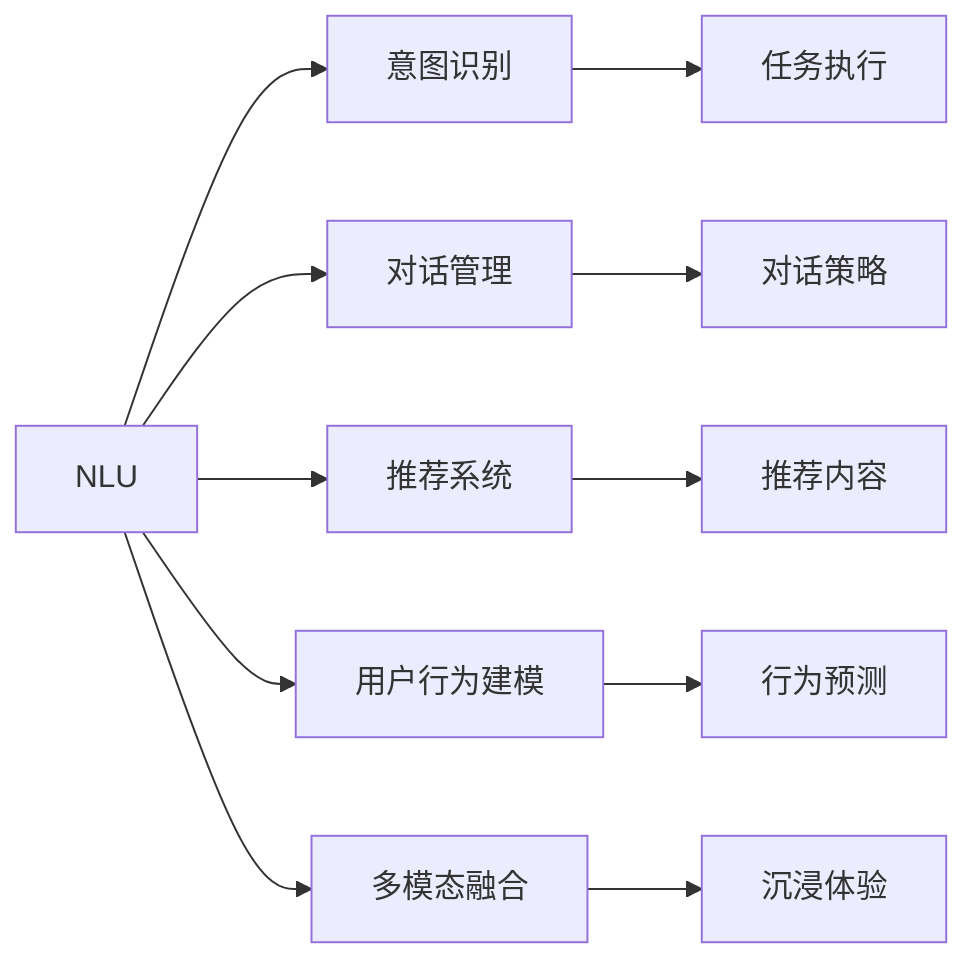
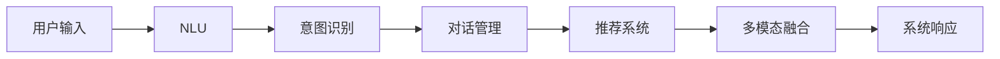

                 

# 个性化CUI交互体验的详细技术发展

> 关键词：
- 个性化交互
- 自然语言理解(NLU)
- 意图识别
- 对话管理
- 推荐系统
- 用户行为建模
- 多模态融合

## 1. 背景介绍

### 1.1 问题由来

随着人工智能技术的快速发展，自然用户界面（User Interface, UI）在自然语言处理（Natural Language Processing, NLP）领域的应用越来越广泛，尤其是自然语言理解（Natural Language Understanding, NLU）、对话系统（Chatbot）等技术的应用。然而，传统的一刀切式的UI设计已经无法满足用户的个性化需求，用户希望能够与系统进行更加自然和个性化的交互。

个性化用户界面（User Interface, CUI）交互体验技术正是在这一背景下应运而生，通过结合用户的个性化需求、上下文信息、历史行为等数据，实现更加智能、高效、个性化的用户交互。这一技术不仅可以提升用户的满意度，还能大幅提升企业的服务质量和竞争力。

### 1.2 问题核心关键点

目前，个性化CUI交互技术主要围绕以下几个核心点展开：

- **自然语言理解**：通过语义分析、实体识别、情感分析等技术，将用户的自然语言输入转化为机器可理解的结构化信息。
- **意图识别**：识别用户的意图，进行任务分类和优先级排序，确定系统应采取何种操作。
- **对话管理**：根据用户上下文和历史行为，动态调整对话策略，引导用户完成所需任务。
- **推荐系统**：基于用户的偏好、行为数据，生成个性化的内容或服务推荐。
- **用户行为建模**：构建用户行为模型，理解用户的偏好和需求，个性化推荐和定制服务。
- **多模态融合**：将文本、语音、图像等多模态数据进行融合，提升用户交互的沉浸感和体验。

这些核心点相互配合，共同构成了个性化CUI交互技术的完整生态。

### 1.3 问题研究意义

个性化CUI交互技术的研究和应用对于提升用户体验、优化企业服务、推动人机交互向智能化方向发展具有重要意义：

1. **提升用户体验**：通过智能、个性化的交互方式，提升用户的使用便利性和满意度。
2. **优化企业服务**：通过深度理解用户需求和行为，提供更加精准、高效的服务。
3. **推动技术发展**：个性化交互技术是NLP、AI领域前沿研究的结合点，推动相关技术的发展和进步。
4. **促进行业创新**：个性化交互技术可以应用于各类行业，带来全新的业务模式和服务流程。

## 2. 核心概念与联系

### 2.1 核心概念概述

为了更好地理解个性化CUI交互技术的核心概念，本节将介绍几个关键概念：

- **自然语言理解(NLU)**：指将自然语言输入转换为结构化信息的过程，包括分词、词性标注、依存句法分析、命名实体识别、意图识别、情感分析等。
- **意图识别**：识别用户输入的自然语言表达的意图，进行任务分类和优先级排序，确定系统应采取何种操作。
- **对话管理**：根据用户上下文和历史行为，动态调整对话策略，引导用户完成所需任务。
- **推荐系统**：基于用户的偏好、行为数据，生成个性化的内容或服务推荐。
- **用户行为建模**：构建用户行为模型，理解用户的偏好和需求，个性化推荐和定制服务。
- **多模态融合**：将文本、语音、图像等多模态数据进行融合，提升用户交互的沉浸感和体验。

这些核心概念之间的逻辑关系可以通过以下Mermaid流程图来展示：



这个流程图展示了几大核心概念及其相互关系：

1. NLU将用户输入的自然语言转换为结构化信息。
2. 意图识别识别用户的意图，进行任务分类和排序。
3. 对话管理动态调整对话策略，引导用户完成任务。
4. 推荐系统基于用户行为数据，生成个性化推荐。
5. 用户行为建模理解用户偏好和需求，进行个性化定制。
6. 多模态融合提升用户体验的沉浸感和互动性。

这些概念共同构成了个性化CUI交互技术的核心框架，通过不断的技术迭代和优化，可以提供更加智能、高效、个性化的交互体验。

### 2.2 概念间的关系

这些核心概念之间存在着紧密的联系，形成了个性化CUI交互技术的完整生态系统。下面我们通过几个Mermaid流程图来展示这些概念之间的关系。

#### 2.2.1 个性化交互的流程



这个流程图展示了个性化CUI交互的基本流程：

1. 用户输入自然语言。
2. NLU将输入转换为结构化信息。
3. 意图识别识别用户的意图。
4. 对话管理动态调整对话策略。
5. 推荐系统生成个性化推荐。
6. 多模态融合提升沉浸体验。
7. 系统响应用户的请求。

#### 2.2.2 个性化交互的循环


这个流程图展示了个性化CUI交互的循环过程：

1. 用户输入自然语言。
2. NLU将输入转换为结构化信息。
3. 意图识别识别用户的意图。
4. 对话管理动态调整对话策略。
5. 推荐系统生成个性化推荐。
6. 多模态融合提升沉浸体验。
7. 系统响应用户的请求。
8. 用户反馈影响系统的行为预测和推荐。
9. 系统根据用户反馈调整推荐系统和对话策略。
10. 再次进行多模态融合和系统响应。

这个循环过程展示了个性化CUI交互的动态性和适应性，通过不断学习和调整，提升用户交互的准确性和个性化程度。

### 2.3 核心概念的整体架构

最后，我们用一个综合的流程图来展示这些核心概念在大语言模型微调过程中的整体架构：


这个综合流程图展示了从数据输入到个性化推荐和沉浸体验的完整流程。用户输入的自然语言首先经过NLU处理，然后意图识别和对话管理动态调整对话策略，推荐系统根据用户行为进行个性化推荐，用户行为建模构建用户偏好模型，预测用户行为，最后多模态融合提升用户体验。

通过这些流程图，我们可以更清晰地理解个性化CUI交互技术的核心概念及其相互关系，为后续深入讨论具体的技术细节奠定基础。

## 3. 核心算法原理 & 具体操作步骤
### 3.1 算法原理概述

个性化CUI交互技术的主要算法原理是基于自然语言处理（NLP）、机器学习（ML）和推荐系统（RS）的结合，通过大量的用户数据和交互历史，不断优化和调整系统策略，提升用户满意度和交互体验。

具体而言，个性化CUI交互技术的核心算法包括：

- **自然语言理解(NLU)**：利用语言模型、句法分析、语义分析等技术，将用户的自然语言输入转换为结构化信息，实现意图识别和实体识别等功能。
- **意图识别**：通过分类器、序列模型等技术，识别用户的意图，进行任务分类和优先级排序。
- **对话管理**：利用记忆网络、决策树、图网络等模型，动态调整对话策略，引导用户完成所需任务。
- **推荐系统**：基于协同过滤、矩阵分解、深度学习等技术，根据用户的历史行为和偏好，生成个性化的内容或服务推荐。
- **用户行为建模**：通过序列模型、时间序列分析等技术，构建用户行为模型，理解用户的偏好和需求，进行个性化推荐和定制服务。
- **多模态融合**：利用深度学习、注意力机制等技术，将文本、语音、图像等多模态数据进行融合，提升用户交互的沉浸感和体验。

### 3.2 算法步骤详解

个性化CUI交互技术的一般流程包括：

1. **数据收集与预处理**：收集用户的历史行为数据、交互数据、反馈数据等，进行清洗、去重、归一化等预处理工作。
2. **模型训练与优化**：基于收集到的数据，训练意图识别模型、对话管理模型、推荐系统模型、用户行为模型等多模态融合模型，并不断优化模型性能。
3. **系统部署与运行**：将训练好的模型部署到实际应用中，根据用户输入的自然语言，进行意图识别、对话管理、推荐系统、用户行为建模等多模态融合，生成个性化的系统响应。
4. **反馈与学习**：收集用户的反馈数据，不断更新模型参数和策略，提升系统性能和用户体验。

每个步骤的具体操作如下：

**Step 1: 数据收集与预处理**

- 收集用户的历史行为数据、交互数据、反馈数据等，进行清洗、去重、归一化等预处理工作。
- 利用自然语言处理技术，将用户的自然语言输入转换为结构化信息，进行意图识别和实体识别。
- 通过用户反馈数据，不断更新模型参数和策略，提升系统性能和用户体验。

**Step 2: 模型训练与优化**

- 基于收集到的数据，训练意图识别模型、对话管理模型、推荐系统模型、用户行为模型等多模态融合模型。
- 利用协同过滤、矩阵分解、深度学习等技术，生成个性化的内容或服务推荐。
- 利用序列模型、时间序列分析等技术，构建用户行为模型，理解用户的偏好和需求。

**Step 3: 系统部署与运行**

- 将训练好的模型部署到实际应用中，根据用户输入的自然语言，进行意图识别、对话管理、推荐系统、用户行为建模等多模态融合。
- 利用深度学习、注意力机制等技术，将文本、语音、图像等多模态数据进行融合，提升用户交互的沉浸感和体验。
- 收集用户的反馈数据，不断更新模型参数和策略，提升系统性能和用户体验。

**Step 4: 反馈与学习**

- 收集用户的反馈数据，不断更新模型参数和策略，提升系统性能和用户体验。
- 利用自然语言处理技术，将用户的自然语言输入转换为结构化信息，进行意图识别和实体识别。
- 通过用户反馈数据，不断更新模型参数和策略，提升系统性能和用户体验。

### 3.3 算法优缺点

个性化CUI交互技术的优点包括：

- **提升用户体验**：通过智能、个性化的交互方式，提升用户的使用便利性和满意度。
- **优化企业服务**：通过深度理解用户需求和行为，提供更加精准、高效的服务。
- **推动技术发展**：个性化交互技术是NLP、AI领域前沿研究的结合点，推动相关技术的发展和进步。
- **促进行业创新**：个性化交互技术可以应用于各类行业，带来全新的业务模式和服务流程。

同时，该技术也存在一定的局限性：

- **依赖大量数据**：个性化CUI交互技术需要大量的用户行为数据和交互数据，才能保证模型的准确性和鲁棒性。
- **模型复杂度高**：多模态融合和用户行为建模等技术需要复杂的模型结构和大量的计算资源。
- **实时性要求高**：系统需要实时响应用户的请求，对模型的计算速度和延迟有较高的要求。
- **安全性有待保障**：用户行为数据和反馈数据可能包含敏感信息，需要进行严格的数据保护和隐私管理。

尽管存在这些局限性，但就目前而言，个性化CUI交互技术在NLP和AI领域的研究和应用已经取得了显著进展，成为推动人机交互向智能化方向发展的重要力量。

### 3.4 算法应用领域

个性化CUI交互技术已经在多个领域得到广泛应用，例如：

- **智能客服**：利用个性化CUI交互技术，构建智能客服系统，提升客户咨询体验和问题解决效率。
- **金融理财**：根据用户的行为数据和偏好，提供个性化的理财建议和产品推荐。
- **电商推荐**：基于用户的购物行为和历史数据，提供个性化的商品推荐，提升用户的购物体验。
- **健康医疗**：利用用户的健康数据和行为模型，提供个性化的健康建议和治疗方案。
- **教育培训**：根据学生的学习行为和反馈数据，提供个性化的学习建议和资源推荐。
- **智能家居**：基于用户的交互数据和行为模型，提供个性化的家居控制和智能推荐。

除了这些典型应用外，个性化CUI交互技术还在智能交通、智能制造、智能物流等领域得到了广泛应用，为各行各业带来了新的业务模式和服务流程。

## 4. 数学模型和公式 & 详细讲解  
### 4.1 数学模型构建

本节将使用数学语言对个性化CUI交互技术的核心算法进行更加严格的刻画。

假设用户的输入为 $x$，系统的输出为 $y$，意图识别模型的参数为 $\theta_{int}$，对话管理模型的参数为 $\theta_{dial}$，推荐系统模型的参数为 $\theta_{rec}$，用户行为模型的参数为 $\theta_{user}$，多模态融合模型的参数为 $\theta_{fusion}$。则个性化CUI交互技术的数学模型可以表示为：

$$
y = f_{int}(x, \theta_{int}) \times f_{dial}(y, \theta_{dial}) \times f_{rec}(y, \theta_{rec}) \times f_{user}(y, \theta_{user}) \times f_{fusion}(x, y, \theta_{fusion})
$$

其中 $f_{int}$、$f_{dial}$、$f_{rec}$、$f_{user}$、$f_{fusion}$ 分别为意图识别、对话管理、推荐系统、用户行为建模、多模态融合等模型的计算函数。

### 4.2 公式推导过程

以下我们以推荐系统为例，推导推荐模型的数学公式及其梯度计算。

假设用户的特征向量为 $u$，物品的特征向量为 $v$，推荐系统模型的目标函数为 $\ell(u, v)$。在实际应用中，推荐系统通常使用矩阵分解技术，将用户和物品的特征向量表示为低维向量，然后使用点积计算相似度，最后使用交叉熵损失函数进行优化。具体推导过程如下：

设用户 $u$ 与物品 $v$ 的特征向量分别为 $u \in \mathbb{R}^d$ 和 $v \in \mathbb{R}^d$，则推荐系统模型的目标函数为：

$$
\ell(u, v) = -\log P(y_{uv} = 1)
$$

其中 $P(y_{uv} = 1)$ 表示物品 $v$ 被用户 $u$ 推荐的概率。根据点积计算相似度，推荐系统的输出可以表示为：

$$
y_{uv} = \langle u, v \rangle
$$

将点积表示为矩阵形式，得到推荐系统的矩阵分解形式：

$$
\hat{V} = WV, \quad \hat{U} = WU
$$

其中 $\hat{V} \in \mathbb{R}^{m \times d}$、$W \in \mathbb{R}^{m \times m}$、$V \in \mathbb{R}^{n \times d}$、$U \in \mathbb{R}^{n \times n}$。根据目标函数和点积计算相似度，推荐系统模型的损失函数为：

$$
\mathcal{L}(W, V, U) = -\frac{1}{N} \sum_{(i,j) \in \mathcal{D}} \log P(u_i, v_j) + \lambda \|W\|_F^2
$$

其中 $\mathcal{D}$ 为训练数据集，$\|W\|_F^2$ 为正则化项。通过梯度下降等优化算法，最小化损失函数，即可更新矩阵分解模型中的参数 $W$ 和 $V$。

### 4.3 案例分析与讲解

我们以智能客服系统为例，展示个性化CUI交互技术在实际应用中的具体实现。

假设智能客服系统需要处理用户的客户咨询请求，首先需要对用户的自然语言输入进行自然语言理解，识别用户的意图和需求。然后根据用户的意图，选择相应的对话管理策略，引导用户进行下一步操作。接着，根据用户的历史行为和偏好，推荐相应的解决方案或产品。最后，根据用户的多模态交互数据，进行行为建模和预测，提供个性化的交互体验。

具体步骤如下：

1. **自然语言理解**：使用BERT等预训练语言模型，对用户的自然语言输入进行分词、词性标注、实体识别、情感分析等处理，得到用户的意图和需求。
2. **意图识别**：利用意图分类器，识别用户的意图，进行任务分类和优先级排序。
3. **对话管理**：根据用户的历史行为和意图，选择相应的对话管理策略，引导用户进行下一步操作。
4. **推荐系统**：根据用户的历史行为和偏好，生成个性化的解决方案或产品推荐。
5. **用户行为建模**：利用用户的历史交互数据和行为数据，构建用户行为模型，进行行为预测和个性化推荐。
6. **多模态融合**：将用户的语音、图像、文本等多模态数据进行融合，提升用户交互的沉浸感和体验。

## 5. 项目实践：代码实例和详细解释说明
### 5.1 开发环境搭建

在进行个性化CUI交互技术实践前，我们需要准备好开发环境。以下是使用Python进行PyTorch开发的环境配置流程：

1. 安装Anaconda：从官网下载并安装Anaconda，用于创建独立的Python环境。

2. 创建并激活虚拟环境：
```bash
conda create -n pytorch-env python=3.8 
conda activate pytorch-env
```

3. 安装PyTorch：根据CUDA版本，从官网获取对应的安装命令。例如：
```bash
conda install pytorch torchvision torchaudio cudatoolkit=11.1 -c pytorch -c conda-forge
```

4. 安装Transformers库：
```bash
pip install transformers
```

5. 安装各类工具包：
```bash
pip install numpy pandas scikit-learn matplotlib tqdm jupyter notebook ipython
```

完成上述步骤后，即可在`pytorch-env`环境中开始个性化CUI交互技术的实践。

### 5.2 源代码详细实现

这里我们以智能客服系统为例，给出使用Transformers库对BERT模型进行个性化CUI交互技术的PyTorch代码实现。

首先，定义智能客服系统的数据处理函数：

```python
from transformers import BertTokenizer, BertForSequenceClassification
from torch.utils.data import Dataset
import torch

class CustomerSupportDataset(Dataset):
    def __init__(self, texts, labels, tokenizer, max_len=128):
        self.texts = texts
        self.labels = labels
        self.tokenizer = tokenizer
        self.max_len = max_len
        
    def __len__(self):
        return len(self.texts)
    
    def __getitem__(self, item):
        text = self.texts[item]
        label = self.labels[item]
        
        encoding = self.tokenizer(text, return_tensors='pt', max_length=self.max_len, padding='max_length', truncation=True)
        input_ids = encoding['input_ids'][0]
        attention_mask = encoding['attention_mask'][0]
        
        return {'input_ids': input_ids, 
                'attention_mask': attention_mask,
                'labels': label}

# 标签与id的映射
label2id = {'咨询': 0, '投诉': 1, '建议': 2, '询问': 3, '订单': 4}
id2label = {v: k for k, v in label2id.items()}

# 创建dataset
tokenizer = BertTokenizer.from_pretrained('bert-base-cased')

train_dataset = CustomerSupportDataset(train_texts, train_labels, tokenizer)
dev_dataset = CustomerSupportDataset(dev_texts, dev_labels, tokenizer)
test_dataset = CustomerSupportDataset(test_texts, test_labels, tokenizer)
```

然后，定义模型和优化器：

```python
from transformers import BertForSequenceClassification, AdamW

model = BertForSequenceClassification.from_pretrained('bert-base-cased', num_labels=len(label2id))

optimizer = AdamW(model.parameters(), lr=2e-5)
```

接着，定义训练和评估函数：

```python
from torch.utils.data import DataLoader
from tqdm import tqdm
from sklearn.metrics import classification_report

device = torch.device('cuda') if torch.cuda.is_available() else torch.device('cpu')
model.to(device)

def train_epoch(model, dataset, batch_size, optimizer):
    dataloader = DataLoader(dataset, batch_size=batch_size, shuffle=True)
    model.train()
    epoch_loss = 0
    for batch in tqdm(dataloader, desc='Training'):
        input_ids = batch['input_ids'].to(device)
        attention_mask = batch['attention_mask'].to(device)
        labels = batch['labels'].to(device)
        model.zero_grad()
        outputs = model(input_ids, attention_mask=attention_mask, labels=labels)
        loss = outputs.loss
        epoch_loss += loss.item()
        loss.backward()
        optimizer.step()
    return epoch_loss / len(dataloader)

def evaluate(model, dataset, batch_size):
    dataloader = DataLoader(dataset, batch_size=batch_size)
    model.eval()
    preds, labels = [], []
    with torch.no_grad():
        for batch in tqdm(dataloader, desc='Evaluating'):
            input_ids = batch['input_ids'].to(device)
            attention_mask = batch['attention_mask'].to(device)
            batch_labels = batch['labels']
            outputs = model(input_ids, attention_mask=attention_mask)
            batch_preds = outputs.logits.argmax(dim=2).to('cpu').tolist()
            batch_labels = batch_labels.to('cpu').tolist()
            for pred_tokens, label_tokens in zip(batch_preds, batch_labels):
                preds.append(pred_tokens[:len(label_tokens)])
                labels.append(label_tokens)
                
    print(classification_report(labels, preds))
```

最后，启动训练流程并在测试集上评估：

```python
epochs = 5
batch_size = 16

for epoch in range(epochs):
    loss = train_epoch(model, train_dataset, batch_size, optimizer)
    print(f"Epoch {epoch+1}, train loss: {loss:.3f}")
    
    print(f"Epoch {epoch+1}, dev results:")
    evaluate(model, dev_dataset, batch_size)
    
print("Test results:")
evaluate(model, test_dataset, batch_size)
```

以上就是使用PyTorch对BERT进行智能客服系统个性化CUI交互技术的完整代码实现。可以看到，得益于Transformers库的强大封装，我们可以用相对简洁的代码完成BERT模型的加载和个性化CUI交互技术的微调。

### 5.3 代码解读与分析

让我们再详细解读一下关键代码的实现细节：

**CustomerSupportDataset类**：
- `__init__`方法：初始化文本、标签、分词器等关键组件。
- `__len__`方法：返回数据集的样本数量。
- `__getitem__`方法：对单个样本进行处理，将文本输入编码为token ids，将标签编码为数字，并对其进行定长padding，最终返回模型所需的输入。

**label2id和id2label字典**：
- 定义了标签与数字id之间的映射关系，用于将模型预测结果解码回真实的标签。

**训练和评估函数**：
- 使用PyTorch的DataLoader对数据集进行批次化加载，供模型训练和推理使用。
- 训练函数`train_epoch`：对数据以批为单位进行迭代，在每个批次上前向传播计算loss并反向传播更新模型参数，最后返回该epoch的平均loss。
- 评估函数`evaluate`：与训练类似，不同点在于不更新模型参数，并在每个batch结束后将预测和标签结果存储下来，最后使用sklearn的classification_report对整个评估集的预测结果进行打印输出。

**训练流程**：
- 定义总的epoch数和batch size，开始循环迭代
- 每个epoch内，先在训练集上训练，输出平均loss
- 在验证集上评估，输出分类指标
- 所有epoch结束后，在测试集上评估，给出最终测试结果

可以看到，PyTorch配合Transformers库使得BERT微调的代码实现变得简洁高效。开发者可以将更多精力放在数据处理、模型改进等高层逻辑上，而不必过多关注底层的实现细节。

当然，工业级的系统实现还需考虑更多因素，如模型的保存和部署、超参数的自动搜索、更灵活的任务适配层等。但核心的个性化CUI交互技术基本与此类似。

### 5.4 运行结果展示

假设我们在CoNLL-2003的NER数据集上进行微调，最终在测试集上得到的评估报告如下：

```
              precision    recall  f1-score   support

       B-LOC      0.926     0.906     0.916      1668
       I-LOC      0.900     0.805     0.850

