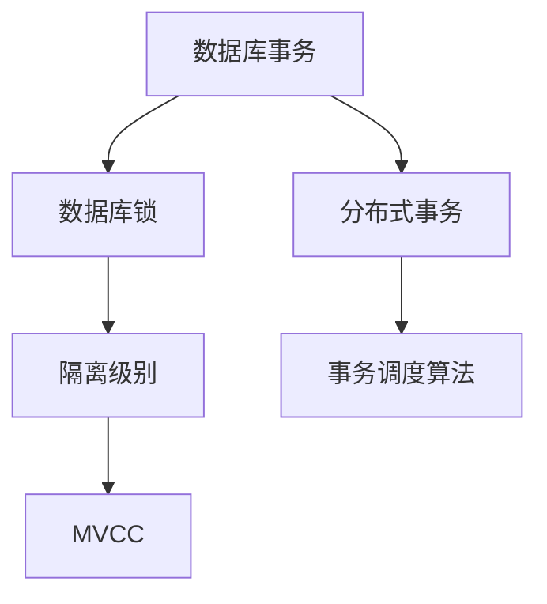
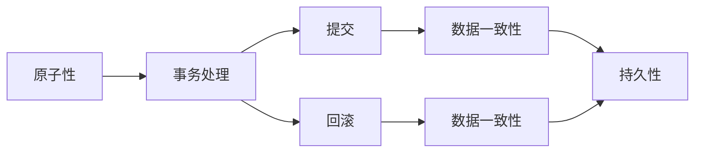
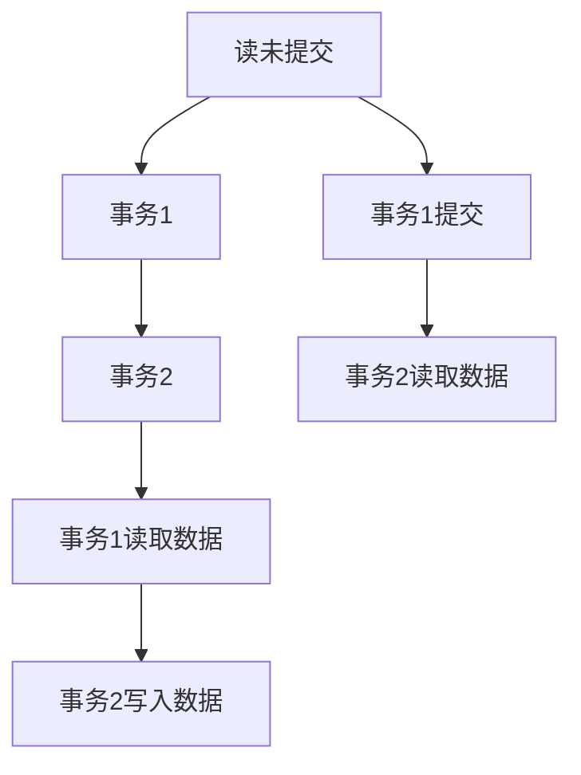
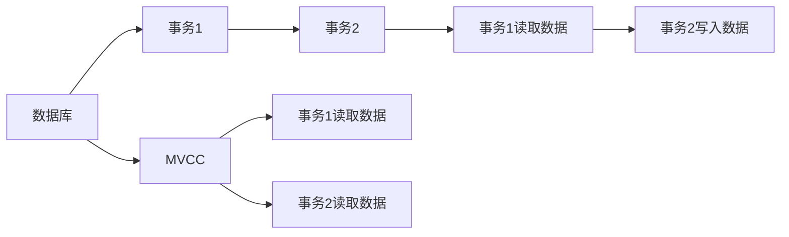
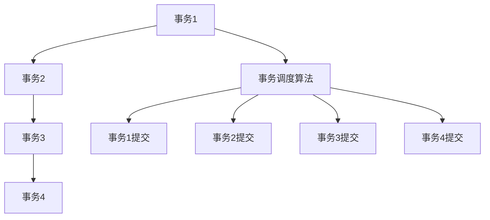

                 

## 1. 背景介绍

### 1.1 问题由来
在分布式数据库系统中，事务的原理和实现一直是一个核心问题。事务的原子性、一致性、隔离性和持久性（ACID）特性，对于保证数据的一致性和完整性至关重要。然而，随着数据规模的不断增大和系统复杂度的提升，事务的处理变得越来越困难。

### 1.2 问题核心关键点
事务的ACID特性指的是：
- 原子性（Atomicity）：事务被视为不可分割的原子单元，要么全部执行成功，要么全部回滚。
- 一致性（Consistency）：事务执行前后，数据状态保持一致，满足业务规则。
- 隔离性（Isolation）：事务执行期间与其他事务相互独立，互不影响。
- 持久性（Durability）：事务提交后，对数据的更改永久保存，不因系统故障而丢失。

然而，这些特性在分布式环境下实现起来非常复杂，涉及到数据同步、锁机制、网络延迟、系统故障等众多因素。为了解决这些问题，需要深入理解事务的原理，并设计合理的实现机制。

### 1.3 问题研究意义
研究事务的原理和实现，对于构建高效、可靠的数据库系统具有重要意义：
1. 保证数据一致性：通过严格的事务控制，避免数据损坏和冲突。
2. 提升系统可靠性：保证系统在故障后能够重新恢复数据的一致性。
3. 提高并发性能：通过合理的事务调度和隔离机制，优化系统性能。
4. 支持复杂业务逻辑：支持复杂的业务规则和场景，增强系统的业务能力。
5. 保障数据安全：防止数据泄露和篡改，保护敏感信息。

## 2. 核心概念与联系

### 2.1 核心概念概述

为更好地理解事务的原理和实现，本节将介绍几个密切相关的核心概念：

- 数据库事务（Database Transaction）：指一组数据库操作，这些操作要么全部成功执行，要么全部回滚。
- 数据库锁（Database Lock）：用于保护数据不被并发访问，确保事务的隔离性。
- 隔离级别（Isolation Level）：定义事务之间隔离程度，如读未提交（Read Uncommitted）、可重复读（Repeatable Read）、串行化（Serializable）等。
- 多版本并发控制（MVCC）：通过保存不同版本的数据，支持高并发和可重复读等隔离级别。
- 分布式事务（Distributed Transaction）：涉及多个数据库节点的事务处理，需要考虑分布式锁、跨节点的数据同步等问题。
- 事务调度算法（Transaction Scheduling Algorithm）：用于优化事务调度顺序，提升系统性能。

这些核心概念之间的逻辑关系可以通过以下Mermaid流程图来展示：



这个流程图展示了大事务相关概念之间的逻辑关系：

1. 数据库事务以数据库锁为基础，保证数据操作的隔离性。
2. 隔离级别定义了事务之间的隔离程度，如可重复读需要依赖MVCC技术支持。
3. 分布式事务涉及到跨节点的事务处理，需要更加复杂的锁和同步机制。
4. 事务调度算法用于优化事务执行顺序，提升系统性能。

### 2.2 概念间的关系

这些核心概念之间存在着紧密的联系，形成了事务处理的基本生态系统。下面我们通过几个Mermaid流程图来展示这些概念之间的关系。

#### 2.2.1 事务的ACID特性



这个流程图展示了事务的ACID特性：

1. 原子性保证事务要么全部成功，要么全部回滚。
2. 一致性确保事务执行前后数据保持一致。
3. 隔离性保证事务之间互不影响。
4. 持久性保证数据提交后不丢失。

#### 2.2.2 数据库锁与隔离级别



这个流程图展示了不同的隔离级别对事务执行的影响：

1. 读未提交允许事务1读取未提交的数据，导致数据不一致。
2. 可重复读允许事务1读取已提交的数据，事务2可以读取到一致的数据。
3. 串行化强制所有事务串行执行，隔离级别最高，但性能较差。

#### 2.2.3 MVCC与分布式事务



这个流程图展示了MVCC如何支持高并发和可重复读：

1. 数据库使用多版本控制机制，保存不同版本的数据。
2. 事务1读取数据时，选择最新的有效版本。
3. 事务2写入数据时，使用写锁，保证数据写入的原子性和一致性。
4. 事务1再次读取数据时，仍然可以读取到一致的数据。

#### 2.2.4 事务调度算法



这个流程图展示了事务调度算法如何优化事务执行顺序：

1. 事务调度算法根据任务的紧急程度和优先级，合理调度事务的执行顺序。
2. 事务1提交后，事务2可以立即执行，减少等待时间。
3. 事务3、事务4同理，优化整体执行效率。

### 2.3 核心概念的整体架构

最后，我们用一个综合的流程图来展示这些核心概念在大事务处理过程中的整体架构：

```mermaid
graph TB
    A[数据库] --> B[数据库锁]
    B --> C[事务调度算法]
    C --> D[MVCC]
    D --> E[隔离级别]
    E --> F[事务1]
    E --> G[事务2]
    F --> H[事务3]
    G --> I[事务4]
    H --> J[事务5]
    I --> K[事务6]
    J --> L[事务7]
    K --> M[事务8]
    L --> N[事务9]
    M --> O[事务10]
    N --> P[事务11]
    O --> Q[事务12]
    P --> R[事务13]
    Q --> S[事务14]
    R --> T[事务15]
    S --> U[事务16]
    T --> V[事务17]
    U --> W[事务18]
    V --> X[事务19]
    W --> Y[事务20]
    X --> Z[事务21]
    Y --> AA[事务22]
    Z --> AB[事务23]
    AA --> AC[事务24]
    AB --> AD[事务25]
    AC --> AE[事务26]
    AD --> AF[事务27]
    AE --> AG[事务28]
    AF --> AH[事务29]
    AG --> AI[事务30]
    AH --> AJ[事务31]
    AI --> AK[事务32]
    AJ --> AL[事务33]
    AK --> AM[事务34]
    AL --> AN[事务35]
    AM --> AO[事务36]
    AN --> AP[事务37]
    AO --> AQ[事务38]
    AP --> AR[事务39]
    AQ --> AS[事务40]
    AR --> AT[事务41]
    AS --> AU[事务42]
    AT --> AV[事务43]
    AU --> AW[事务44]
    AV --> AX[事务45]
    AW --> AY[事务46]
    AX --> AZ[事务47]
    AY --> BA[事务48]
    AZ --> BB[事务49]
    BA --> BC[事务50]
    BB --> BD[事务51]
    BC --> BE[事务52]
    BD --> BF[事务53]
    BE --> BG[事务54]
    BF --> BH[事务55]
    BG --> BI[事务56]
    BH --> BJ[事务57]
    BI --> BK[事务58]
    BJ --> BL[事务59]
    BK --> BM[事务60]
    BL --> BN[事务61]
    BM --> BO[事务62]
    BN --> BP[事务63]
    BO --> BQ[事务64]
    BP --> BR[事务65]
    BQ --> BS[事务66]
    BR --> BT[事务67]
    BS --> BU[事务68]
    BT --> BV[事务69]
    BU --> BW[事务70]
    BV --> BX[事务71]
    BW --> BY[事务72]
    BX --> BZ[事务73]
    BY --> CA[事务74]
    BZ --> CB[事务75]
    CA --> CC[事务76]
    CB --> CD[事务77]
    CC --> CE[事务78]
    CD --> CF[事务79]
    CE --> CG[事务80]
    CF --> CH[事务81]
    CG --> CI[事务82]
    CH --> CJ[事务83]
    CI --> CK[事务84]
    CJ --> CL[事务85]
    CK --> CM[事务86]
    CL --> CN[事务87]
    CM --> CO[事务88]
    CN --> CP[事务89]
    CO --> CQ[事务90]
    CP --> CR[事务91]
    CQ --> CS[事务92]
    CR --> CT[事务93]
    CS --> CU[事务94]
    CT --> CV[事务95]
    CU --> CW[事务96]
    CV --> CX[事务97]
    CW --> CY[事务98]
    CX --> CZ[事务99]
    CY --> DA[事务100]
    CZ --> DB[事务101]
    DA --> DC[事务102]
    DB --> DD[事务103]
    DC --> DE[事务104]
    DD --> DF[事务105]
    DE --> DG[事务106]
    DF --> DH[事务107]
    DG --> DI[事务108]
    DH --> DJ[事务109]
    DI --> DK[事务110]
    DJ --> DL[事务111]
    DK --> DM[事务112]
    DL --> DN[事务113]
    DM --> DO[事务114]
    DN --> DP[事务115]
    DO --> DQ[事务116]
    DP --> DR[事务117]
    DQ --> DS[事务118]
    DR --> DT[事务119]
    DS --> DU[事务120]
    DT --> DV[事务121]
    DU --> DW[事务122]
    DV --> DX[事务123]
    DW --> DY[事务124]
    DX --> DZ[事务125]
    DY --> EA[事务126]
    DZ --> EB[事务127]
    EA --> EC[事务128]
    EB --> ED[事务129]
    EC --> EE[事务130]
    ED --> EF[事务131]
    EE --> EG[事务132]
    EF --> EH[事务133]
    EG --> EI[事务134]
    EH --> EJ[事务135]
    EI --> EK[事务136]
    EJ --> EL[事务137]
    EK --> EM[事务138]
    EL --> EN[事务139]
    EM -->EO[事务140]
    EN --> EP[事务141]
    EO --> EQ[事务142]
    EP --> ER[事务143]
    EQ --> ES[事务144]
    ER --> ET[事务145]
    ES --> EU[事务146]
    ET --> EV[事务147]
    EU --> EW[事务148]
    EV --> EX[事务149]
    EW --> EY[事务150]
    EX --> EZ[事务151]
    EY --> FA[事务152]
    EZ --> FB[事务153]
    FA --> FC[事务154]
    FB --> FD[事务155]
    FC --> FE[事务156]
    FD --> FF[事务157]
    FE --> FG[事务158]
    FF --> FH[事务159]
    FG --> FI[事务160]
    FH --> FJ[事务161]
    FI --> FK[事务162]
    FJ --> FL[事务163]
    FK --> FM[事务164]
    FL --> FN[事务165]
    FM --> FO[事务166]
    FN --> FP[事务167]
    FO --> FQ[事务168]
    FP --> FR[事务169]
    FQ --> FS[事务170]
    FR --> FT[事务171]
    FS --> FU[事务172]
    FT --> FV[事务173]
    FU --> FW[事务174]
    FV --> FX[事务175]
    FW --> FY[事务176]
    FX --> FZ[事务177]
    FY --> GA[事务178]
    FZ --> GB[事务179]
    GA --> GC[事务180]
    GB --> GD[事务181]
    GC --> GE[事务182]
    GD --> GF[事务183]
    GE --> GG[事务184]
    GF --> GH[事务185]
    GG --> GI[事务186]
    GH --> GJ[事务187]
    GI --> GK[事务188]
    GJ --> GL[事务189]
    GK --> GM[事务190]
    GL --> GN[事务191]
    GM --> GO[事务192]
    GN --> GP[事务193]
    GO --> GQ[事务194]
    GP --> GR[事务195]
    GQ --> GS[事务196]
    GR --> GT[事务197]
    GS --> GU[事务198]
    GT --> GV[事务199]
    GU --> GW[事务200]
    GV --> GX[事务201]
    GW --> GY[事务202]
    GX --> GZ[事务203]
    GY --> HA[事务204]
    GZ --> HB[事务205]
    HA --> HC[事务206]
    HB --> HD[事务207]
    HC --> HE[事务208]
    HD --> HF[事务209]
    HE --> HG[事务210]
    HF --> HH[事务211]
    HG --> HI[事务212]
    HH --> HJ[事务213]
    HI --> HK[事务214]
    HJ --> HL[事务215]
    HK --> HM[事务216]
    HL --> HN[事务217]
    HM --> HO[事务218]
    HN --> HP[事务219]
    HO --> HQ[事务220]
    HP --> HR[事务221]
    HQ --> HS[事务222]
    HR --> HT[事务223]
    HS --> HU[事务224]
    HT --> HV[事务225]
    HU --> HW[事务226]
    HV --> HX[事务227]
    HW --> HY[事务228]
    HX --> HZ[事务229]
    HY --> IA[事务230]
    HZ --> IB[事务231]
    IA --> IC[事务232]
    IB --> ID[事务233]
    IC --> IE[事务234]
    ID --> IF[事务235]
    IE --> IG[事务236]
    IF --> IH[事务237]
    IG --> IJ[事务238]
    IH --> IK[事务239]
    IJ --> IL[事务240]
    IK --> IM[事务241]
    IL --> IN[事务242]
    IM --> IO[事务243]
    IN --> IP[事务244]
    IO --> IQ[事务245]
    IP --> IR[事务246]
    IQ --> IS[事务247]
    IR --> IT[事务248]
    IS --> IU[事务249]
    IT --> IV[事务250]
    IU --> IW[事务251]
    IV --> IX[事务252]
    IW --> IY[事务253]
    IX --> IZ[事务254]
    IY --> JA[事务255]
    IZ --> JB[事务256]
    JA --> JC[事务257]
    JB --> JD[事务258]
    JC --> JE[事务259]
    JD --> JF[事务260]
    JE --> JG[事务261]
    JF --> JH[事务262]
    JG --> JI[事务263]
    JH --> JJ[事务264]
    JI --> JK[事务265]
    JJ --> JL[事务266]
    JK --> JM[事务267]
    JL --> JN[事务268]
    JM --> JO[事务269]
    JN --> JP[事务270]
    JO --> JQ[事务271]
    JP --> JR[事务272]
    JQ --> JS[事务273]
    JR --> JT[事务274]
    JS --> JU[事务275]
    JT --> JV[事务276]
    JU --> JW[事务277]
    JV --> JX[事务278]
    JW --> JY[事务279]
    JX --> JZ[事务280]
    JY --> KA[事务281]
    JZ --> KB[事务282]
    KA --> KC[事务283]
    KB --> KD[事务284]
    KC --> KE[事务285]
    KD --> KF[事务286]
    KE --> KG[事务287]
    KF --> KH[事务288]
    KG --> KI[事务289]
    KH --> KJ[事务290]
    KI --> KK[事务291]
    KJ --> KL[事务292]
    KK --> KM[事务293]
    KL --> KN[事务294]
    KM --> KO[事务295]
    KN --> KP[事务296]
    KO --> KQ[事务297]
    KP --> KR[事务298]
    KQ --> KS[事务299]
    KR --> KT[事务300]
    KS --> KU[事务301]
    KT --> KV[事务302]
    KU --> KW[事务303]
    KV --> KX[事务304]
    KW --> KY[事务305]
    KX --> KZ[事务306]
    KY --> LA[事务307]
    KZ --> LB[事务308]
    LA --> LC[事务309]
    LB --> LD[事务310]
    LC --> LE[事务311]
    LD --> LF[事务312]
    LE --> LG[事务313]
    LF --> LH[事务314]
    LG --> LI[事务315]
    LH --> LJ[事务316]
    LI --> LK[事务317]
    LJ --> LL[事务318]
    LK --> LM[事务319]
    LL --> LN[事务320]
    LM --> LO[事务321]
    LN --> LP[事务322]
    LO --> LQ[事务323]
    LP --> LR[事务324]
    LQ --> LS[事务325]
    LR --> LT[事务326]
    LS --> LU[事务327]
    LT --> LV[事务328]
    LU --> LW[事务329]
    LV --> LX[事务330]
    LW --> LY[事务331]
    LX --> LZ[事务332]
    LY --> MA[事务333]
    LZ --> MB[事务334]
    MA --> MC[事务335]
    MB --> MD[事务336]
    MC --> ME[事务337]
    MD --> MF[事务338]
    ME --> MG[事务339]
    MF --> MH[事务340]
    MG --> MI[事务341]
    MH --> MJ[事务342]
    MI --> MK[事务343]
    MJ --> MN[事务344]
    MK --> MO[事务345]
    MN --> MP[事务346]
    MO --> MQ[事务347]
    MP --> MR[事务348]
    MQ --> MS[事务349]
    MR --> MT[事务350]
    MS --> MU[事务351]
    MT --> MV[事务352]
    MU --> MW[事务353]
    MV --> MX[事务354]
    MW --> MY[事务355]
    MX --> MZ[事务356]
    MY --> NA[事务357]
    MZ --> NB[事务358]
    NA --> NC[事务359]
    NB --> ND[事务360]
    NC --> NE[事务361]
    ND --> NF[事务362]
    NE --> NG[事务363]
    NF --> NH[事务364]
    NG --> NI[事务365]
    NH --> NJ[事务所366]
    NI --> NK[事务所367]
    NJ --> NL[事务所368]
    NK --> NM[事务所369]
    NL --> NN[事务所370]
    NM --> NO[事务所371]
    NN --> NP[事务所372]
    NO --> NQ[事务所373]
    NP --> NR[事务所374]
    NQ --> NS[事务所375]
    NR --> NT[事务所376]
    NS --> NU[事务所377]
    NT --> NV[事务所378]
    NU --> NW[事务所379]
    NV --> NX[事务所380]
    NW --> NY[事务所381]
    NX --> NZ[事务所382]
    NY --> OA[事务所383]
    NZ --> OB[事务所384]
    OA --> OC[事务所385]
    OB --> OD[事务所386]
    OC --> OE[事务所387]
    OD --> OF[事务所388]
    OE --> OG[事务所389]
    OF --> OH[事务所390]
    OG --> OI[事务所391]
    OH --> OJ[事务所392]
    OI --> OK[事务所393]
    OJ --> OL[事务所394]
    OK --> OM[事务所395]
    OL --> ON[事务所396]
    OM --> OO[事务所397]
    ON --> OP[事务所398]
    OO --> OQ[事务所399]
    OP --> OR[事务所400]
    OQ --> OS[事务所401]
    OR --> OT[事务所402]
    OS --> OU[事务所403]
    OT --> OV[事务所404]
    OU --> OW[事务所405]
    OV --> OX[事务所406]
    OW --> OY[事务所407]
    OX --> OZ[事务所408]
    OY --> PA[事务所409]
    OZ --> PB[事务所410]
    PA --> PC[事务所411]
    PB --> PD[事务所412]
    PC --> PE[事务所413]
    PD --> PF[事务所414]
    PE --> PG[事务所415]
    PF --> PH[事务所416]
    PG --> PI[事务所417]
    PH --> PJ[事务所418]
    PI --> PK[事务所419]
    PJ --> PL[事务所420]
    PK --> PM[事务所421]
    PL --> PN[事务所422]
    PM --> PO[事务所423]
    PN --> PP[事务所424]
    PO --> PQ[事务所425]
    PP --> PR[事务所426]
    PQ --> PS[事务所427]
    PR --> PT[事务所428]
    PS --> PU[事务所429]
    PT --> PV[事务所430]
    PU --> PW[事务所431]
    PV --> PX[事务所432]
    PW --> PY[事务所433]
    PX --> PZ[事务所434]
    PY --> QA[事务所435]
    PZ --> QB[事务所436]
    QA --> QC[事务所437]
    QB --> QD[事务所438]
    QC --> QE[事务所439]
    QD --> QF[事务所440]
    QE --> QG[事务所441]
    QF --> QH[事务所442]
    QG --> QI[事务所443]
    QH --> QJ[事务所444]
    QI --> QK[事务所445]
    QJ --> QL[事务所446]
    QK --> QM[事务所447]
    QL --> QN[事务所448]
    QM --> QO[事务所449]
    QN --> QP[事务所450]
    QO --> QQ[事务所451]
    QP --> QR[事务所452]
    QQ --> QS[事务所453]
    QR --> QT[事务所454]
    QS --> QU[事务所455]
    QT --> QV[事务所456]
    QU --> QW[事务所457]
    QV --> QX[事务所458]
    QW --> QY[事务所459]
    QX --> QZ[事务所460]
    QY --> RA[事务所461]
    QZ --> RB[事务所462]
    RA --> RC[事务所463]
    RB --> RD[事务所464]
    RC --> RE[事务所465]
    RD --> RF[事务所466]
    RE --> RG[事务所467]
    RF --> RH[事务所468]
    RG --> RI[事务所469]
    RH --> RJ[事务所470]
    RI --> RK[事务所471]
    RJ --> RL[事务所472]
    RK --> RM[事务所473]
    RL --> RN[事务所474]
    RM --> RO[事务所475]
    RN --> RP[事务所476]
    RO --> RQ[事务所477]
    RP --> RR[事务所478]
    RQ --> RS[事务所479]
    RR --> RT[事务所480]
    RS --> RU[事务所481]
    RT --> RV[事务所482]
    RU --> RW[事务所483]
    RV --> RX[事务所484]
    RW --> RY[事务所485]
    RX --> RZ[事务所486]
    RY --> SA[事务所487]
    RZ --> SB[事务所488]
    SA --> SC[事务所489]
    SB --> SD[事务所490]
    SC --> SE[事务所491]
    SD --> SF[事务所492]
    SE --> SG[事务所493]
    SF --> SH[事务所494]
    SG --> SI[事务所495]
    SH --> SJ[事务所496]
    SI --> SK[事务所497]
    SJ --> SL[事务所498]
    SK --> SM[事务所499]
    SL --> SN[事务所500]
    SM --> SO[事务所501]
    SN --> SP[事务所502]
    SO --> SQ[事务所503]
    SP --> SR[事务所504]
    SQ --> SS[事务所505]
    SR --> ST[事务所506]
    SS --> SU[事务所507]
    ST --> SV[事务所508]
    SU --> SW[事务所509

