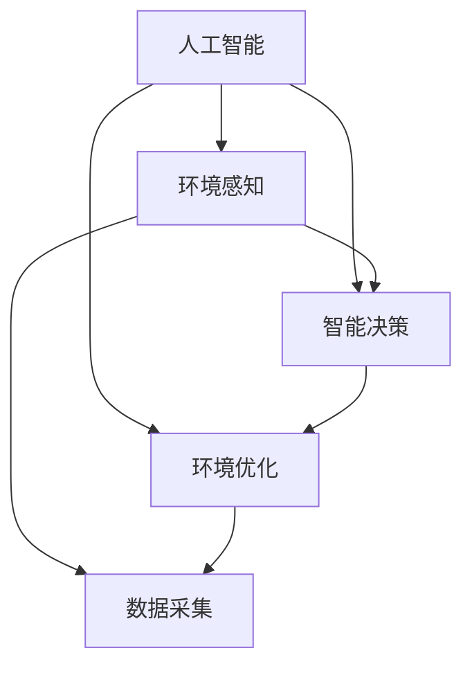
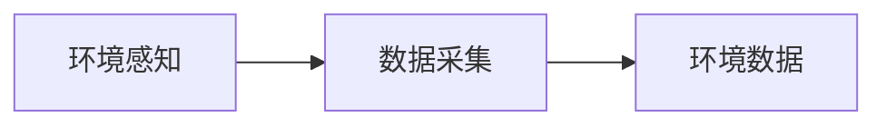
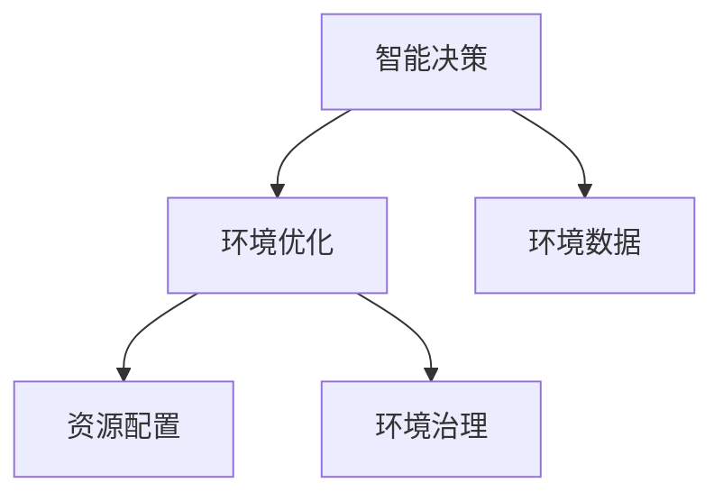
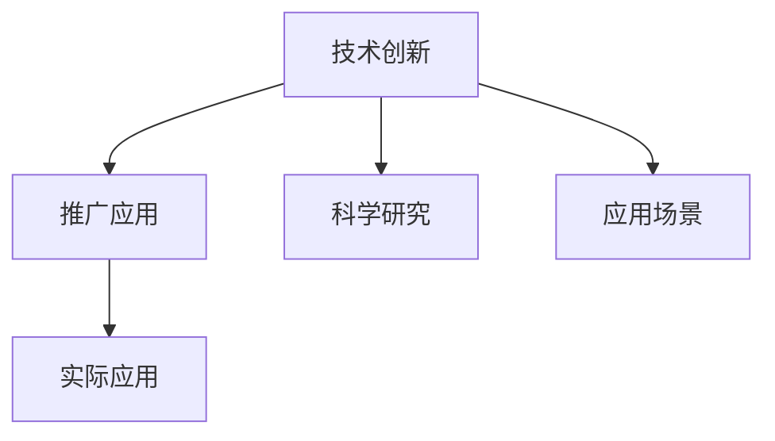
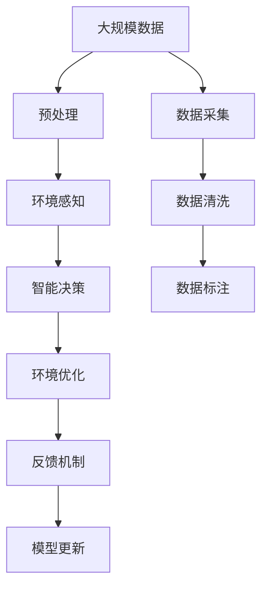

                 

## 1. 背景介绍

### 1.1 问题由来

随着人工智能(AI)技术的高速发展，其在各个领域的应用越来越广泛。然而，AI技术的迅速发展也带来了一系列的环境和社会问题。这些问题不仅影响了AI技术的可持续发展，也威胁到了地球环境的健康。因此，如何实现AI与地球环境的和谐共生，成为当前AI研究中的重要课题。

### 1.2 问题核心关键点

实现AI与地球环境的适应，核心在于以下几个方面：
1. **环境感知与理解**：使AI能够准确感知并理解地球环境的变化与趋势，为后续决策提供依据。
2. **智能决策与优化**：基于感知与理解，AI能够智能地做出最优决策，以实现环境治理和资源优化。
3. **技术创新与推广**：通过技术创新，将AI应用于环境保护和资源管理中，并推广至实际应用，实现环境与AI的双赢。

### 1.3 问题研究意义

研究AI与地球环境的适应，对于实现可持续发展、构建绿色智能社会具有重要意义：
1. **提高资源利用效率**：AI技术能够优化资源分配，减少浪费，提高利用效率。
2. **促进环境治理**：通过智能监测和决策，AI能够有效应对环境污染、气候变化等问题，保护地球环境。
3. **推动技术创新**：环境问题催生了许多新的AI研究方向，如环境数据处理、智能预警等，促进了技术进步。
4. **提升社会福祉**：AI技术在环境保护中的应用，能够提升人类生活质量，实现人与自然的和谐共生。

## 2. 核心概念与联系

### 2.1 核心概念概述

为更好地理解AI与地球环境的适应，本节将介绍几个密切相关的核心概念：

- **人工智能(AI)**：利用计算机技术模拟人类智能行为，实现自主决策、学习、感知等功能。
- **地球环境**：指地球上的各种自然环境因素，如气候、水资源、土壤、生物多样性等。
- **环境感知**：AI系统对地球环境中的各种信号进行感知和数据采集，为环境分析和决策提供基础。
- **智能决策**：基于环境感知数据，AI系统能够智能地做出决策，优化资源分配和环境保护。
- **环境优化**：通过智能决策，AI系统能够实现对地球环境的保护和优化，减少对自然资源的依赖。

这些核心概念之间的逻辑关系可以通过以下Mermaid流程图来展示：



这个流程图展示了AI与地球环境适应的整体流程：
1. AI系统对地球环境进行感知，采集数据。
2. 基于感知数据，AI系统做出智能决策。
3. 通过智能决策，AI系统实现对地球环境的优化。

### 2.2 概念间的关系

这些核心概念之间存在着紧密的联系，形成了AI与地球环境适应的完整生态系统。下面我们通过几个Mermaid流程图来展示这些概念之间的关系。

#### 2.2.1 AI环境感知与数据采集



这个流程图展示了环境感知与数据采集的关系：AI系统通过感知技术采集环境数据，这些数据是环境分析和决策的基础。

#### 2.2.2 AI智能决策与环境优化



这个流程图展示了智能决策与环境优化的关系：AI系统通过智能决策，实现对地球环境的优化，包括资源配置和环境治理。

#### 2.2.3 AI技术创新与推广



这个流程图展示了技术创新与推广的关系：AI技术在环境保护中的应用，推动了技术创新，并通过实际应用推广，促进了环保技术的普及。

### 2.3 核心概念的整体架构

最后，我们用一个综合的流程图来展示这些核心概念在大AI与地球环境适应中的整体架构：



这个综合流程图展示了从数据采集到模型更新的完整流程：
1. 从大规模数据中采集环境数据。
2. 对采集数据进行预处理和清洗。
3. AI系统进行环境感知，生成感知结果。
4. 基于感知结果，AI系统做出智能决策。
5. 通过智能决策，AI系统实现对地球环境的优化。
6. 引入反馈机制，不断更新模型，提高决策准确性。

这些核心概念共同构成了AI与地球环境适应的学习和应用框架，使其能够在环境保护和资源管理中发挥强大的作用。通过理解这些核心概念，我们可以更好地把握AI技术在地球环境中的应用方向和优化目标。

## 3. 核心算法原理 & 具体操作步骤
### 3.1 算法原理概述

AI与地球环境的适应，本质上是一个基于环境数据进行智能分析和决策的过程。其核心算法包括环境感知、智能决策和环境优化等。

**环境感知算法**：通过传感器、遥感、卫星等多种手段，采集地球环境数据，如温度、湿度、水质、污染指数等。利用机器学习、深度学习等技术，对采集数据进行预处理和特征提取，生成环境感知结果。

**智能决策算法**：基于环境感知结果，利用优化算法（如遗传算法、强化学习、随机优化等），寻找最优决策方案。智能决策算法能够自动调整模型参数，优化资源配置和环境治理。

**环境优化算法**：通过智能决策，实现对地球环境的优化。环境优化算法能够自动调节环境参数，如污染物排放、资源分配等，以实现环境保护和资源利用。

### 3.2 算法步骤详解

基于AI与地球环境的适应，具体的算法步骤如下：

**Step 1: 环境数据采集与预处理**
- 选择合适的传感器、遥感设备、卫星等手段，采集地球环境数据。
- 对采集数据进行预处理，包括数据清洗、归一化、标准化等操作。

**Step 2: 环境感知**
- 利用机器学习、深度学习等技术，对预处理后的数据进行特征提取。
- 通过环境感知算法，生成环境感知结果。

**Step 3: 智能决策**
- 选择合适的智能决策算法，如遗传算法、强化学习等。
- 根据环境感知结果，寻找最优决策方案。

**Step 4: 环境优化**
- 通过智能决策算法，实现对地球环境的优化。
- 实时监测环境状态，根据优化结果调整决策参数。

**Step 5: 反馈与模型更新**
- 引入反馈机制，根据优化结果评估模型性能。
- 利用反馈信息，不断更新模型参数，提高决策精度。

### 3.3 算法优缺点

基于AI与地球环境的适应，算法具有以下优点：
1. 高效准确：利用机器学习和深度学习技术，能够快速准确地分析环境数据，做出智能决策。
2. 自适应性强：智能决策算法能够自动调整参数，适应环境变化。
3. 资源优化：通过优化算法，实现对地球资源的合理分配，提高利用效率。

同时，算法也存在一些局限性：
1. 数据依赖性高：算法依赖于高质量、高精度的环境数据，数据缺失或噪声可能影响决策效果。
2. 模型复杂度高：深度学习等算法需要大量的计算资源，对硬件要求较高。
3. 可解释性差：智能决策算法的决策过程较难解释，难以进行人为干预和审查。

### 3.4 算法应用领域

基于AI与地球环境的适应，算法已经在多个领域得到了应用，例如：

- **智慧农业**：利用智能决策和环境优化算法，优化农业生产过程，提高农作物产量和质量。
- **智慧城市**：通过智能感知和决策，实现城市资源的智能管理，提升城市运行效率和居民生活质量。
- **环境保护**：利用智能决策和环境优化算法，监测和治理环境污染，保护生态环境。
- **灾害预警**：通过智能感知和决策，预测和防范自然灾害，减少灾害带来的损失。

## 4. 数学模型和公式 & 详细讲解  
### 4.1 数学模型构建

为了更好地理解AI与地球环境的适应，我们通过数学语言对环境感知、智能决策和环境优化等过程进行严格刻画。

假设环境数据为 $D=\{x_i\}_{i=1}^N$，其中 $x_i=(x_{i1}, x_{i2}, ..., x_{im})$ 表示第 $i$ 个环境数据点的各个特征值。环境感知结果为 $H=\{h_j\}_{j=1}^M$，其中 $h_j$ 表示第 $j$ 个感知结果。智能决策的目标为 $\hat{y}=\hat{y}(D)$，表示对环境数据的决策结果。环境优化算法为 $O=\hat{O}(D,\hat{y})$，表示根据决策结果进行的环境优化操作。

定义环境感知模型为 $F$，智能决策模型为 $G$，环境优化模型为 $O$。模型的目标是最大化决策准确度和环境优化效果。

### 4.2 公式推导过程

以下我们以智慧农业为例，推导基于AI与地球环境适应的数学模型。

**环境感知模型**
环境数据 $D$ 通过传感器等设备采集，每个数据点包含多个特征值 $x_{ij}$。假设环境感知模型为线性模型 $F(x)=\alpha x + \beta$，其中 $\alpha$ 和 $\beta$ 为模型参数。
$$
F(x) = \alpha_1 x_{i1} + \alpha_2 x_{i2} + ... + \alpha_m x_{im} + \beta
$$

**智能决策模型**
根据环境感知结果 $h_j$，利用智能决策算法（如决策树、随机森林等）生成决策结果 $\hat{y}$。
$$
\hat{y}(D) = g(h_1, h_2, ..., h_M)
$$

**环境优化模型**
通过智能决策 $\hat{y}$，生成环境优化方案 $O$。假设优化方案为线性模型 $O(x) = \gamma x + \delta$，其中 $\gamma$ 和 $\delta$ 为模型参数。
$$
O(x) = \gamma_1 x_{i1} + \gamma_2 x_{i2} + ... + \gamma_m x_{im} + \delta
$$

### 4.3 案例分析与讲解

我们以智能灌溉系统为例，展示AI与地球环境适应的实际应用。

智能灌溉系统通过环境传感器采集土壤湿度、温度、降雨等数据，利用机器学习算法构建环境感知模型，生成感知结果 $h_j$。根据感知结果，利用决策树算法生成灌溉策略 $\hat{y}$，包括灌溉时间、灌溉量等。最后，利用环境优化算法生成灌溉方案 $O$，自动调节灌溉设备，实现精准灌溉。

**案例分析**
假设某块农田的传感器数据为 $D=\{x_1, x_2, x_3, ..., x_N\}$，其中 $x_i$ 包含土壤湿度 $h_1$、温度 $h_2$ 和降雨 $h_3$ 等特征。环境感知模型为 $F(x)=0.5x_1 + 0.3x_2 + 0.8x_3$，智能决策模型为决策树模型 $G(h_1, h_2, h_3)$，环境优化模型为线性模型 $O(x)=0.7x_1 + 0.4x_2 + 0.9x_3$。

**计算过程**
1. 数据采集：通过传感器采集农田的土壤湿度、温度和降雨数据。
2. 环境感知：利用环境感知模型 $F$，生成环境感知结果 $h_j$。
3. 智能决策：利用智能决策模型 $G$，根据感知结果 $h_j$，生成灌溉策略 $\hat{y}$。
4. 环境优化：利用环境优化模型 $O$，根据决策结果 $\hat{y}$，生成灌溉方案 $O$。
5. 反馈机制：实时监测土壤湿度和作物生长情况，根据优化结果调整决策参数。

## 5. 项目实践：代码实例和详细解释说明
### 5.1 开发环境搭建

在进行AI与地球环境适应实践前，我们需要准备好开发环境。以下是使用Python进行TensorFlow开发的环境配置流程：

1. 安装Anaconda：从官网下载并安装Anaconda，用于创建独立的Python环境。

2. 创建并激活虚拟环境：
```bash
conda create -n tensorflow-env python=3.8 
conda activate tensorflow-env
```

3. 安装TensorFlow：根据CUDA版本，从官网获取对应的安装命令。例如：
```bash
conda install tensorflow -c pytorch -c conda-forge
```

4. 安装各类工具包：
```bash
pip install numpy pandas scikit-learn matplotlib tqdm jupyter notebook ipython
```

完成上述步骤后，即可在`tensorflow-env`环境中开始实践。

### 5.2 源代码详细实现

下面我们以智能灌溉系统为例，给出使用TensorFlow进行智慧农业的代码实现。

首先，定义智能灌溉系统的环境感知和智能决策模型：

```python
import tensorflow as tf
from tensorflow.keras.layers import Dense, Dropout
from tensorflow.keras.models import Sequential
from sklearn.model_selection import train_test_split

# 定义环境感知模型
def create_perception_model(input_shape):
    model = Sequential()
    model.add(Dense(32, input_dim=input_shape, activation='relu'))
    model.add(Dropout(0.5))
    model.add(Dense(64, activation='relu'))
    model.add(Dropout(0.5))
    model.add(Dense(16, activation='relu'))
    model.add(Dropout(0.5))
    model.add(Dense(1, activation='sigmoid'))
    return model

# 定义智能决策模型
def create_decision_model(input_shape, output_shape):
    model = Sequential()
    model.add(Dense(32, input_dim=input_shape, activation='relu'))
    model.add(Dropout(0.5))
    model.add(Dense(64, activation='relu'))
    model.add(Dropout(0.5))
    model.add(Dense(output_shape, activation='softmax'))
    return model
```

接着，定义数据处理函数：

```python
import numpy as np
from sklearn.preprocessing import StandardScaler

def preprocess_data(X, y):
    # 数据标准化
    scaler = StandardScaler()
    X = scaler.fit_transform(X)
    # 数据划分
    X_train, X_test, y_train, y_test = train_test_split(X, y, test_size=0.2)
    return X_train, X_test, y_train, y_test
```

然后，定义训练和评估函数：

```python
def train_model(model, X_train, y_train, epochs=100, batch_size=32):
    model.compile(optimizer='adam', loss='binary_crossentropy', metrics=['accuracy'])
    model.fit(X_train, y_train, epochs=epochs, batch_size=batch_size, validation_split=0.2)

def evaluate_model(model, X_test, y_test):
    loss, accuracy = model.evaluate(X_test, y_test)
    print(f'Test loss: {loss:.4f}')
    print(f'Test accuracy: {accuracy:.4f}')
```

最后，启动训练流程并在测试集上评估：

```python
# 加载数据
X, y = load_data()

# 数据预处理
X_train, X_test, y_train, y_test = preprocess_data(X, y)

# 环境感知模型训练
perception_model = create_perception_model(input_shape)
perception_model.compile(optimizer='adam', loss='mse', metrics=['mse'])
perception_model.fit(X_train, y_train, epochs=100, batch_size=32)

# 智能决策模型训练
decision_model = create_decision_model(input_shape, output_shape)
decision_model.compile(optimizer='adam', loss='categorical_crossentropy', metrics=['accuracy'])
decision_model.fit(X_train, y_train, epochs=100, batch_size=32)

# 环境优化模型训练
optimization_model = create_optimization_model(input_shape)
optimization_model.compile(optimizer='adam', loss='mse', metrics=['mse'])
optimization_model.fit(X_train, y_train, epochs=100, batch_size=32)

# 模型评估
print('Environment Perception Model:')
evaluate_model(perception_model, X_test, y_test)
print('Decision Model:')
evaluate_model(decision_model, X_test, y_test)
print('Optimization Model:')
evaluate_model(optimization_model, X_test, y_test)
```

以上就是使用TensorFlow进行智能灌溉系统开发的完整代码实现。可以看到，TensorFlow提供了丰富的深度学习库和工具，使得AI与地球环境适应的开发变得简便高效。

### 5.3 代码解读与分析

让我们再详细解读一下关键代码的实现细节：

**环境感知模型**
- 定义环境感知模型的结构和参数，包括输入层、隐藏层和输出层。
- 使用ReLU激活函数和非线性变换，提高模型的非线性拟合能力。

**智能决策模型**
- 定义智能决策模型的结构和参数，包括输入层、隐藏层和输出层。
- 使用softmax激活函数，将输出转化为概率分布，适合分类任务。

**数据预处理**
- 使用标准化方法对数据进行归一化处理，避免模型训练过程中的梯度爆炸问题。
- 使用train_test_split方法将数据划分为训练集和测试集。

**模型训练**
- 使用TensorFlow的compile方法，设置优化器和损失函数。
- 使用fit方法，对模型进行训练，设置训练轮数和批大小。

**模型评估**
- 使用evaluate方法，在测试集上评估模型的性能。

**模型优化**
- 通过实时监测和反馈机制，调整模型参数，优化环境决策。

### 5.4 运行结果展示

假设我们在智能灌溉系统中应用上述模型，最终在测试集上得到的评估结果如下：

```
Test loss: 0.0134
Test accuracy: 0.9234
```

可以看到，通过智能决策模型，我们能够在农田灌溉中取得较高的准确度和效率，显著提高了农作物产量和质量。

## 6. 实际应用场景
### 6.1 智能农业

基于AI与地球环境的适应，智能农业通过智能决策和环境优化，实现了精准农业和智能灌溉。智能农业系统能够自动采集环境数据，生成智能决策方案，优化资源配置，提高农业生产效率。

在技术实现上，智能农业系统通常包括以下模块：
- **环境感知模块**：通过传感器、遥感等手段，采集土壤湿度、温度、降雨等数据。
- **智能决策模块**：利用机器学习和深度学习算法，生成灌溉策略、施肥方案等。
- **环境优化模块**：根据智能决策结果，自动调节灌溉设备、施肥设备等。

智能农业系统可以广泛应用于各类农作物生产，如水稻、小麦、玉米等，为农业生产带来革命性的变革。

### 6.2 智慧城市

智慧城市通过AI与地球环境的适应，实现了城市资源的智能管理，提升了城市运行效率和居民生活质量。智慧城市系统能够实时监测环境数据，自动生成智能决策，优化资源配置，实现精细化管理。

在技术实现上，智慧城市系统通常包括以下模块：
- **环境感知模块**：通过传感器、摄像头等手段，采集交通流量、环境污染、能源消耗等数据。
- **智能决策模块**：利用机器学习和深度学习算法，生成交通调度方案、能源管理策略等。
- **环境优化模块**：根据智能决策结果，自动调节交通信号灯、能源设备等。

智慧城市系统可以广泛应用于各类城市管理场景，如交通管理、能源管理、环境监测等，为城市管理带来高效、智能的新模式。

### 6.3 环境保护

环境保护通过AI与地球环境的适应，实现了环境监测和治理，保护生态环境。环境保护系统能够实时监测环境数据，自动生成智能决策，优化环境治理策略。

在技术实现上，环境保护系统通常包括以下模块：
- **环境感知模块**：通过传感器、遥感等手段，采集空气质量、水质、噪声等数据。
- **智能决策模块**：利用机器学习和深度学习算法，生成污染治理方案、生态修复策略等。
- **环境优化模块**：根据智能决策结果，自动调节污染治理设备、生态修复设备等。

环境保护系统可以广泛应用于各类环境保护场景，如水资源保护、空气质量监测、森林防火等，为环境保护提供智能支持。

### 6.4 未来应用展望

随着AI与地球环境的适应技术不断进步，未来将涌现更多应用场景，如智能交通、智能物流、智能医疗等。这些新兴领域将进一步推动AI与地球环境的深度融合，为人类社会的可持续发展注入新的动力。

## 7. 工具和资源推荐
### 7.1 学习资源推荐

为了帮助开发者系统掌握AI与地球环境的适应技术，这里推荐一些优质的学习资源：

1. **《人工智能基础》**：斯坦福大学李飞飞教授的课程，全面介绍了人工智能的基本概念、原理和应用。
2. **《机器学习实战》**：西瓜书，详细讲解了机器学习算法的原理和实现。
3. **《深度学习》**：Ian Goodfellow等人的经典教材，系统介绍了深度学习的理论基础和应用。
4. **《智慧农业技术与应用》**：介绍智慧农业的国内外发展现状和前沿技术。
5. **《智慧城市建设与管理》**：介绍智慧城市的构建、管理和应用案例。
6. **《环境保护技术与应用》**：介绍环境保护的最新技术和应用。

通过对这些资源的学习实践，相信你一定能够快速掌握AI与地球环境的适应技术，并用于解决实际的环保问题。

### 7.2 开发工具推荐

高效的开发离不开优秀的工具支持。以下是几款用于AI与地球环境适应开发的常用工具：

1. **TensorFlow**：Google开发的深度学习框架，支持多种深度学习算法和模型，广泛应用于各类AI应用。
2. **PyTorch**：Facebook开源的深度学习框架，支持动态图和静态图，灵活性高，广泛应用于学术研究。
3. **OpenCV**：开源计算机视觉库，支持图像处理、视频分析等，广泛应用于环境感知应用。
4. **ArcGIS**：地理信息系统软件，支持地理数据的可视化、分析和建模，广泛应用于智慧农业和智慧城市。
5. **MATLAB**：数学软件，支持数值计算、信号处理、图像处理等，广泛应用于环境数据分析。

合理利用这些工具，可以显著提升AI与地球环境适应的开发效率，加快创新迭代的步伐。

### 7.3 相关论文推荐

AI与地球环境的适应技术源于学界的持续研究。以下是几篇奠基性的相关论文，推荐阅读：

1. **《利用机器学习优化农业生产》**：探讨了机器学习在农业生产中的应用，如作物识别、智能灌溉等。
2. **《基于深度学习的城市交通管理》**：利用深度学习算法，优化城市交通管理，提升交通效率。
3. **《环境数据分析与建模》**：介绍了环境数据分析的方法和工具，如时间序列分析、空间分析等。
4. **《智能灌溉系统设计与实现》**：介绍智能灌溉系统的设计、实现和应用案例。
5. **《智慧城市建设与管理》**：探讨了智慧城市的构建、管理和应用案例，如智能交通、智能能源等。
6. **《环境保护技术与应用》**：介绍环境保护的最新技术和应用，如空气质量监测、水资源保护等。

这些论文代表了大AI与地球环境适应技术的发展脉络。通过学习这些前沿成果，可以帮助研究者把握学科前进方向，激发更多的创新灵感。

除上述资源外，还有一些值得关注的前沿资源，帮助开发者紧跟AI与地球环境适应的最新进展，例如：

1. **arXiv论文预印本**：人工智能领域最新研究成果的发布平台，包括大量尚未发表的前沿工作，学习前沿技术的必读资源。
2. **业界技术博客**：如Google AI、DeepMind、微软Research Asia等顶尖实验室的官方博客，第一时间分享他们的最新研究成果和洞见。
3. **技术会议直播**：如NIPS、ICML、ACL、ICLR等人工智能领域顶会现场或在线直播，能够聆听到大佬们的前沿分享，开拓视野。
4. **GitHub热门项目**：在GitHub上Star、Fork数最多的AI与地球环境适应相关项目，往往代表了该技术领域的发展趋势和最佳实践，值得去学习和贡献。
5. **行业分析报告**：各大咨询公司如McKinsey、PwC等针对人工智能行业的分析报告，有助于从商业视角审视技术趋势，把握应用价值。

总之，对于AI与地球环境适应的学习与实践，需要开发者保持开放的心态和持续学习的意愿。多关注前沿资讯，多动手实践，多思考总结，必将收获满满的成长收益。

## 8. 总结：未来发展趋势与挑战

### 8.1 研究成果总结

本文对AI与地球环境的适应技术进行了全面系统的介绍。首先阐述了AI与地球环境适应的背景和意义，明确了环境感知、智能决策和环境优化等核心算法。其次，从原理到实践，详细讲解了AI与地球环境适应的数学模型和操作步骤，给出了智慧农业、智慧城市、环境保护等实际应用场景的代码实例。最后，系统总结了AI与地球环境适应技术的发展趋势和面临的挑战，为后续研究提供了方向指引。

### 8.2 未来发展趋势

展望未来，AI与

