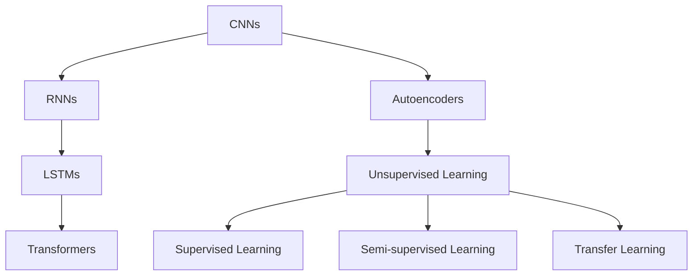
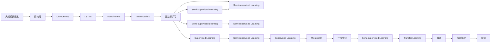

                 

# 人工智能的深度学习与模式识别

> 关键词：深度学习,模式识别,卷积神经网络(CNN),循环神经网络(RNN),长短期记忆网络(LSTM),变换器(Transformer),自动编码器(AE),无监督学习,监督学习,半监督学习

## 1. 背景介绍

### 1.1 问题由来

在人工智能（AI）领域，深度学习（Deep Learning）和模式识别（Pattern Recognition）技术的快速发展，为解决各种复杂问题提供了新的思路和方法。深度学习通过构建多层神经网络模型，自动学习并提取数据中的高层次特征，广泛应用于图像识别、语音识别、自然语言处理等众多场景。模式识别则更侧重于对数据进行分类、识别和描述，涉及机器学习、计算机视觉、信号处理等多个领域。

深度学习与模式识别技术的融合，使得AI系统在识别和理解复杂模式上取得了巨大进展。例如，卷积神经网络（Convolutional Neural Networks, CNNs）在图像识别、自然语言处理等领域表现出色；循环神经网络（Recurrent Neural Networks, RNNs）及其变种长短期记忆网络（Long Short-Term Memory, LSTM）在语音识别、机器翻译等任务中大放异彩；变换器（Transformer）模型则在自然语言处理、图像处理等任务中表现卓越。

本文将深入探讨深度学习在模式识别中的应用，包括卷积神经网络、循环神经网络、变换器等模型的原理和操作步骤，同时也会涉及一些前沿技术，如无监督学习、半监督学习、迁移学习等，力求全面系统地介绍人工智能中的深度学习和模式识别技术。

### 1.2 问题核心关键点

深度学习与模式识别技术涉及诸多关键概念和算法，包括：

- 卷积神经网络（CNNs）：通过卷积操作提取局部特征，适用于图像和信号处理。
- 循环神经网络（RNNs）：通过循环连接处理序列数据，适用于语音识别、自然语言处理等。
- 长短期记忆网络（LSTMs）：一种RNN变种，适用于处理长序列数据，减少梯度消失问题。
- 变换器（Transformer）：通过自注意力机制实现序列数据的处理，适用于自然语言处理和图像生成。
- 自动编码器（Autoencoders）：通过编码器-解码器结构学习数据的低维表示，适用于特征提取和降维。
- 无监督学习（Unsupervised Learning）：仅使用无标注数据进行模型训练。
- 监督学习（Supervised Learning）：使用有标注数据进行模型训练。
- 半监督学习（Semi-supervised Learning）：结合少量有标注数据和大量无标注数据进行模型训练。
- 迁移学习（Transfer Learning）：利用预训练模型在相关任务上快速微调，提升模型性能。

理解这些核心概念及其原理和操作步骤，有助于深入掌握深度学习和模式识别技术的精髓，从而在实际应用中取得良好效果。

### 1.3 问题研究意义

深度学习和模式识别技术的快速发展，极大地推动了AI技术的实际应用，对于各行各业的智能化转型具有重要意义：

1. **降低应用开发成本**：通过深度学习模型，可以快速实现复杂模式的识别和处理，减少传统方法所需的人力成本和时间成本。
2. **提升模型效果**：深度学习模型能够自动学习高层次特征，相较于传统方法，往往能获得更优的识别和分类效果。
3. **加速技术创新**：深度学习和模式识别技术的不断进步，催生了诸如变换器、LSTM等新模型，为AI技术的持续创新提供了动力。
4. **赋能产业升级**：深度学习和模式识别技术的应用，为传统行业数字化转型提供了新的工具和方法，推动了产业升级。
5. **带来技术挑战**：深度学习模型需要大量计算资源和标注数据，如何高效地训练和优化模型，仍然是一个重要问题。

本文旨在系统介绍深度学习和模式识别技术的原理和应用，探讨其中的核心算法和操作步骤，为实际应用提供理论和实践指导。

## 2. 核心概念与联系

### 2.1 核心概念概述

深度学习与模式识别技术的核心概念众多，以下是对其中几个关键概念的概述：

- **卷积神经网络（CNNs）**：通过卷积操作提取图像、信号等数据中的局部特征，适用于图像识别、语音识别等任务。
- **循环神经网络（RNNs）**：通过循环连接处理序列数据，适用于自然语言处理、语音识别等任务。
- **长短期记忆网络（LSTMs）**：一种RNN变种，通过门控机制处理长序列数据，适用于自然语言处理、语音识别等任务。
- **变换器（Transformer）**：通过自注意力机制实现序列数据的处理，适用于自然语言处理、图像生成等任务。
- **自动编码器（Autoencoders）**：通过编码器-解码器结构学习数据的低维表示，适用于特征提取和降维。
- **无监督学习（Unsupervised Learning）**：仅使用无标注数据进行模型训练。
- **监督学习（Supervised Learning）**：使用有标注数据进行模型训练。
- **半监督学习（Semi-supervised Learning）**：结合少量有标注数据和大量无标注数据进行模型训练。
- **迁移学习（Transfer Learning）**：利用预训练模型在相关任务上快速微调，提升模型性能。

这些核心概念之间存在紧密的联系，共同构成了深度学习和模式识别技术的框架体系。通过深入理解这些概念及其联系，可以更好地掌握深度学习和模式识别技术的精髓。

### 2.2 概念间的关系

这些核心概念之间的关系可以通过以下Mermaid流程图来展示：



这个流程图展示了深度学习和模式识别技术的主要概念及其关系：

1. CNNs和RNNs是深度学习中常用的神经网络结构，用于处理图像和序列数据。
2. LSTMs是RNNs的一种变种，通过门控机制处理长序列数据。
3. Transformers通过自注意力机制实现序列数据的处理，适用于自然语言处理和图像生成。
4. Autoencoders通过编码器-解码器结构学习数据的低维表示，适用于特征提取和降维。
5. 无监督学习、监督学习和半监督学习是深度学习常用的学习范式，各自适用于不同的数据情况。
6. 迁移学习利用预训练模型在相关任务上快速微调，提升模型性能。

这些概念通过相互配合，构成了深度学习和模式识别技术的完整体系，适用于各种实际应用场景。

### 2.3 核心概念的整体架构

最后，我们用一个综合的流程图来展示这些核心概念在大规模深度学习和模式识别任务中的整体架构：



这个综合流程图展示了从数据预处理到最终预测的完整过程。大规模数据集首先进行预处理，然后通过CNNs、RNNs、LSTMs、Transformers、Autoencoders等模型进行处理和特征提取，最后通过无监督学习、监督学习和迁移学习等范式，进行模型训练和微调，最终输出预测结果。

通过这些流程图，我们可以更清晰地理解深度学习和模式识别技术的工作原理和优化方向，为后续深入讨论具体的算法和操作步骤奠定基础。

## 3. 核心算法原理 & 具体操作步骤
### 3.1 算法原理概述

深度学习和模式识别技术的核心算法原理，可以归纳为以下几个方面：

- **卷积神经网络（CNNs）**：通过卷积操作提取图像、信号等数据中的局部特征，适用于图像识别、语音识别等任务。
- **循环神经网络（RNNs）**：通过循环连接处理序列数据，适用于自然语言处理、语音识别等任务。
- **长短期记忆网络（LSTMs）**：一种RNN变种，通过门控机制处理长序列数据，适用于自然语言处理、语音识别等任务。
- **变换器（Transformer）**：通过自注意力机制实现序列数据的处理，适用于自然语言处理、图像生成等任务。
- **自动编码器（Autoencoders）**：通过编码器-解码器结构学习数据的低维表示，适用于特征提取和降维。

这些算法原理主要基于神经网络的反向传播算法，通过不断调整模型参数，最小化损失函数，从而实现模型优化和特征提取。以下将详细讲解每种算法的原理和操作步骤。

### 3.2 算法步骤详解

**卷积神经网络（CNNs）**

卷积神经网络主要用于图像识别和处理，其基本原理是通过卷积操作提取图像中的局部特征。CNNs通常包含卷积层、池化层和全连接层。

**卷积层**：通过卷积操作提取图像的局部特征，其中卷积核（Filter）是关键。卷积核在图像上滑动，计算卷积操作，得到特征图。

**池化层**：通过池化操作降低特征图的维度，减少计算量。常用的池化操作包括最大池化和平均池化。

**全连接层**：通过全连接操作将特征图转化为最终的分类结果。

卷积神经网络的训练过程主要通过反向传播算法进行。损失函数一般采用交叉熵损失函数，用于衡量模型预测结果与真实标签之间的差异。具体步骤如下：

1. **前向传播**：将输入数据输入卷积神经网络，通过卷积层和池化层得到特征图，再通过全连接层得到最终输出。
2. **损失计算**：将模型输出与真实标签计算交叉熵损失。
3. **反向传播**：计算损失函数对模型参数的梯度，使用梯度下降等优化算法更新模型参数。
4. **重复迭代**：重复执行前向传播和反向传播，直到损失函数收敛。

**循环神经网络（RNNs）**

循环神经网络主要用于序列数据的处理，其基本原理是通过循环连接处理时间序列数据。RNNs通常包含循环层和激活函数。

**循环层**：通过循环连接处理序列数据，其中循环连接是最关键的部分。循环连接使得模型可以处理变长的序列数据，保存历史信息。

**激活函数**：常用的激活函数包括tanh和ReLU，用于增加模型的非线性表达能力。

循环神经网络的训练过程主要通过反向传播算法进行。损失函数一般采用均方误差损失函数，用于衡量模型预测结果与真实标签之间的差异。具体步骤如下：

1. **前向传播**：将输入序列输入循环神经网络，通过循环层和激活函数得到输出。
2. **损失计算**：将模型输出与真实标签计算均方误差损失。
3. **反向传播**：计算损失函数对模型参数的梯度，使用梯度下降等优化算法更新模型参数。
4. **重复迭代**：重复执行前向传播和反向传播，直到损失函数收敛。

**长短期记忆网络（LSTMs）**

长短期记忆网络是一种RNN变种，通过门控机制处理长序列数据，解决了传统RNN的梯度消失问题。LSTMs通常包含输入门、输出门和遗忘门。

**输入门**：控制新信息的输入。
**遗忘门**：控制历史信息的遗忘。
**输出门**：控制当前信息的输出。

LSTMs的训练过程与RNNs类似，主要通过反向传播算法进行。损失函数一般采用均方误差损失函数，用于衡量模型预测结果与真实标签之间的差异。具体步骤如下：

1. **前向传播**：将输入序列输入长短期记忆网络，通过输入门、遗忘门和输出门得到输出。
2. **损失计算**：将模型输出与真实标签计算均方误差损失。
3. **反向传播**：计算损失函数对模型参数的梯度，使用梯度下降等优化算法更新模型参数。
4. **重复迭代**：重复执行前向传播和反向传播，直到损失函数收敛。

**变换器（Transformer）**

变换器通过自注意力机制实现序列数据的处理，适用于自然语言处理和图像生成等任务。Transformer通常包含编码器-解码器结构。

**编码器**：通过自注意力机制处理输入序列，得到多个表示向量。
**解码器**：通过自注意力机制处理输出序列，得到最终结果。

Transformer的训练过程主要通过反向传播算法进行。损失函数一般采用交叉熵损失函数，用于衡量模型预测结果与真实标签之间的差异。具体步骤如下：

1. **前向传播**：将输入序列输入变换器，通过编码器和解码器得到输出。
2. **损失计算**：将模型输出与真实标签计算交叉熵损失。
3. **反向传播**：计算损失函数对模型参数的梯度，使用梯度下降等优化算法更新模型参数。
4. **重复迭代**：重复执行前向传播和反向传播，直到损失函数收敛。

**自动编码器（Autoencoders）**

自动编码器通过编码器-解码器结构学习数据的低维表示，适用于特征提取和降维。自动编码器的训练过程主要通过反向传播算法进行。

**编码器**：通过编码器将输入数据映射到低维表示。
**解码器**：通过解码器将低维表示映射回原始数据。

自动编码器的训练过程主要通过反向传播算法进行。损失函数一般采用均方误差损失函数，用于衡量模型输出与原始数据之间的差异。具体步骤如下：

1. **前向传播**：将输入数据输入自动编码器，通过编码器和解码器得到输出。
2. **损失计算**：将模型输出与原始数据计算均方误差损失。
3. **反向传播**：计算损失函数对模型参数的梯度，使用梯度下降等优化算法更新模型参数。
4. **重复迭代**：重复执行前向传播和反向传播，直到损失函数收敛。

### 3.3 算法优缺点

深度学习和模式识别技术的核心算法各有优缺点，以下是一些常见的优缺点：

**卷积神经网络（CNNs）**

- **优点**：
  - 适用于图像识别、语音识别等任务。
  - 能够自动提取局部特征，减少手动特征提取的工作量。
  - 参数共享机制减少了模型复杂度。

- **缺点**：
  - 对于不同大小和比例的图像，需要调整卷积核大小，增加了计算复杂度。
  - 对于复杂的图像，特征提取可能不够细致。

**循环神经网络（RNNs）**

- **优点**：
  - 适用于自然语言处理、语音识别等任务。
  - 能够处理变长序列数据，保留历史信息。

- **缺点**：
  - 对于长序列数据，容易发生梯度消失问题。
  - 计算复杂度较高，训练时间长。

**长短期记忆网络（LSTMs）**

- **优点**：
  - 解决了传统RNN的梯度消失问题，适用于处理长序列数据。
  - 通过门控机制，能够控制历史信息的遗忘和输入。

- **缺点**：
  - 模型结构较为复杂，训练难度较高。
  - 对于非常长的序列数据，仍可能出现梯度消失问题。

**变换器（Transformer）**

- **优点**：
  - 适用于自然语言处理、图像生成等任务。
  - 通过自注意力机制，能够捕捉长距离依赖关系。

- **缺点**：
  - 计算复杂度较高，训练时间较长。
  - 对于非常长的序列数据，自注意力机制可能导致计算成本过高。

**自动编码器（Autoencoders）**

- **优点**：
  - 适用于特征提取和降维，能够将高维数据映射到低维空间。
  - 模型结构简单，训练相对容易。

- **缺点**：
  - 对于非线性数据的处理能力较弱。
  - 需要手动设置编码器-解码器结构，可能存在超参数选择的问题。

### 3.4 算法应用领域

深度学习和模式识别技术的核心算法广泛应用于各种领域，以下是一些常见的应用领域：

- **计算机视觉**：通过CNNs处理图像和视频数据，实现图像识别、物体检测、人脸识别等任务。
- **自然语言处理**：通过RNNs、LSTMs、Transformers处理文本数据，实现机器翻译、情感分析、语音识别等任务。
- **语音识别**：通过RNNs、LSTMs处理语音数据，实现语音识别、语音合成等任务。
- **信号处理**：通过CNNs处理音频和信号数据，实现音频分类、信号处理等任务。
- **推荐系统**：通过自动编码器处理用户行为数据，实现推荐算法，推荐个性化的商品和服务。
- **金融分析**：通过LSTMs处理时间序列数据，实现股票预测、风险评估等任务。
- **医疗诊断**：通过CNNs处理医学图像数据，实现疾病诊断、影像识别等任务。
- **交通管理**：通过LSTMs处理交通数据，实现交通预测、交通流量优化等任务。

## 4. 数学模型和公式 & 详细讲解 & 举例说明

### 4.1 数学模型构建

深度学习和模式识别技术的数学模型通常包含以下部分：

- **输入**：原始数据集。
- **特征提取**：通过卷积、池化、自注意力等操作，提取数据的特征。
- **损失函数**：衡量模型预测结果与真实标签之间的差异。
- **优化算法**：用于更新模型参数，最小化损失函数。

以下以卷积神经网络（CNNs）为例，详细讲解其数学模型构建过程。

**输入**：
假设输入数据的维数为 $d$，则输入向量 $x \in \mathbb{R}^d$。

**特征提取**：
通过卷积层和池化层提取局部特征，得到特征图 $h \in \mathbb{R}^n$，其中 $n$ 为特征图的维度。

**损失函数**：
假设模型输出为 $y \in \mathbb{R}^m$，真实标签为 $t \in \mathbb{R}^m$，则交叉熵损失函数定义为：
$$
\mathcal{L}(y, t) = -\frac{1}{m} \sum_{i=1}^m t_i \log y_i
$$

**优化算法**：
假设模型参数为 $\theta$，则通过梯度下降算法更新参数，最小化损失函数：
$$
\theta = \theta - \eta \nabla_{\theta}\mathcal{L}(y, t)
$$
其中 $\eta$ 为学习率，$\nabla_{\theta}\mathcal{L}(y, t)$ 为损失函数对模型参数的梯度。

### 4.2 公式推导过程

以下以卷积神经网络（CNNs）为例，推导其反向传播算法的公式。

假设卷积层包含 $n$ 个卷积核，大小为 $k \times k$，步幅为 $s$，填充量为 $p$。假设输入数据大小为 $d$，卷积层输出特征图大小为 $n$。则卷积层的计算公式为：
$$
h_i = \max_{j} (x_{i*s-j+k-1} * w_j) + b
$$
其中 $w_j$ 为卷积核，$b$ 为偏置项。

假设池化层采用最大池化操作，池化窗口大小为 $w$，步幅为 $s$。则池化层的计算公式为：
$$
h'_i = \max_{j} (h_{i*s-j+w-1})
$$

假设全连接层包含 $m$ 个神经元，则全连接层的计算公式为：
$$
y = \sigma(z)
$$
其中 $z$ 为全连接层的输出，$\sigma$ 为激活函数。

假设损失函数为交叉熵损失函数，则其对模型参数的梯度公式为：
$$
\nabla_{\theta}\mathcal{L}(y, t) = -\frac{1}{m} (t - y) \nabla_{\theta}\mathcal{L}(y, t)
$$

假设使用梯度下降算法更新模型参数，则更新公式为：
$$
\theta = \theta - \eta \nabla_{\theta}\mathcal{L}(y, t)
$$

通过以上公式，可以计算卷积神经网络的反向传播算法，更新模型参数。

### 4.3 案例分析与讲解

假设在图像识别任务中，使用卷积神经网络（CNNs）进行模型训练。

首先，将图像数据输入卷积神经网络，通过卷积层和池化层提取特征。假设卷积核大小为 $3 \times 3$，步幅为 $1$，填充量为 $1$。则卷积层的计算公式为：
$$
h_{i,j} = \max_{k=1}^n (x_{i,j-2} * w_k) + b
$$

然后，将特征图输入全连接层，通过激活函数得到模型输出。假设全连接层包含 $100$ 个神经元，激活函数为ReLU。则全连接层的计算公式为：
$$
y = \sigma(z)
$$

最后，将模型输出与真实标签计算交叉熵损失，使用梯度下降算法更新模型参数。

假设使用交叉熵损失函数，则其对模型参数的梯度公式为：
$$
\nabla_{\theta}\mathcal{L}(y, t) = -\frac{1}{m} (t - y) \nabla_{\theta}\mathcal{L}(y, t)
$$

假设使用梯度下降算法更新模型参数，则更新公式为：
$$
\theta = \theta - \eta \nabla_{\theta}\mathcal{L}(y, t)
$$

通过以上案例分析，可以更直观地理解卷积神经网络（CNNs）的反向传播算法和参数更新过程。

## 5. 项目实践：代码实例和详细解释说明

### 5.1 开发环境搭建

在进行深度学习和模式识别技术的项目实践前，需要准备好开发环境。以下是使用Python进行Keras框架的开发环境配置流程：

1. 安装Anaconda：从官网下载并安装Anaconda，用于创建独立的Python环境。

2. 创建并激活虚拟环境：
```bash
conda create -n keras-env python=3.8 
conda activate keras-env
```

3. 安装Keras：
```bash
pip install keras tensorflow numpy matplotlib sklearn
```

4. 安装其他相关库：
```bash
pip install pyplot h5py
```

完成上述步骤后，即可在`keras-env`环境中开始项目实践。

### 5.2 源代码详细实现

这里我们以手写数字识别（MNIST）任务为例，给出使用Keras框架进行卷积神经网络（CNNs）训练的代码实现。

首先，定义数据处理函数：

```python
import numpy as np
import keras
from keras.datasets import mnist
from keras.utils import to_categorical

def load_data():
    (x_train, y_train), (x_test, y_test) = mnist.load_data()
    x_train = x_train / 255.0
    x_test = x_test / 255.0
    y_train = to_categorical(y_train, 10)
    y_test = to_categorical(y_test, 10)
    return x_train, y_train, x_test, y_test
```

然后，定义模型和训练函数：

```python
from keras.models import Sequential
from keras.layers import Conv2D, MaxPooling2D, Flatten, Dense, Dropout

def create_model():
    model = Sequential()
    model.add(Conv2D(32, kernel_size=(3, 3), activation='relu', input_shape=(28, 28, 1)))
    model.add(MaxPooling2D(pool_size=(2, 2)))
    model.add(Conv2D(64, kernel_size=(3, 3), activation='relu'))
    model.add(MaxPooling2D(pool_size=(2, 2)))
    model.add(Flatten())
    model.add(Dense(128, activation='relu'))
    model.add(Dropout(0.5))
    model.add(Dense(10, activation='softmax'))
    return model

def train_model(model, x_train, y_train, x_test, y_test):
    model.compile(optimizer='adam', loss='categorical_crossentropy', metrics=['accuracy'])
    model.fit(x_train, y_train, epochs=10, batch_size=32, validation_data=(x_test, y_test))
```

最后，启动训练流程并在测试集上评估：

```python
x_train, y_train, x_test, y_test = load_data()
model = create_model()
train_model(model, x_train, y_train, x_test, y_test)
```

以上就是使用Keras框架进行卷积神经网络（CNNs）训练的完整代码实现。可以看到，使用Keras框架可以非常方便地实现CNNs的构建和训练，代码简洁高效。

### 5.3 代码解读与分析

让我们再详细解读一下关键代码的实现细节：

**load_data函数

