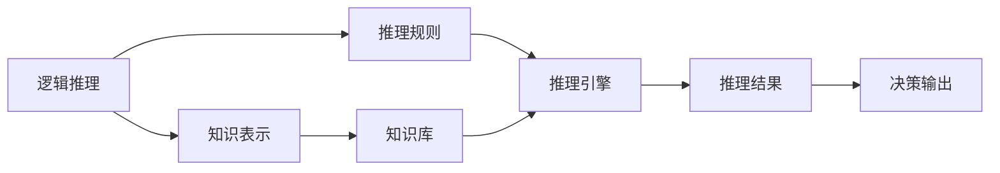
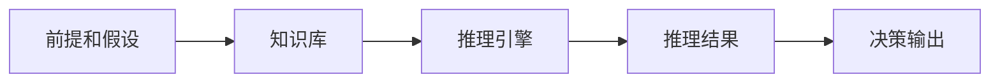
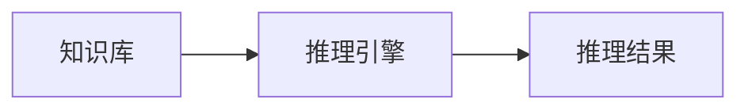
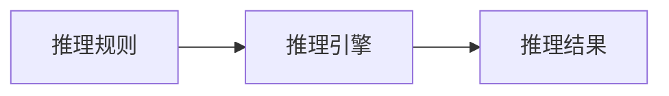

                 

# 人工智能的符号推理模型

> 关键词：人工智能, 符号推理, 符号计算, 知识图谱, 逻辑推理, 专家系统

## 1. 背景介绍

人工智能（Artificial Intelligence, AI）领域在近年来取得了飞速的发展，尤其是在自然语言处理（NLP）、计算机视觉（CV）、机器人技术（Robotics）等方向上，取得了许多令人瞩目的成果。然而，尽管AI的许多应用取得了显著进展，但符号推理（Symbolic Reasoning）在AI中的地位仍然显得尤为重要。符号推理涉及对符号形式化的语言进行逻辑处理和计算，其本质是一种基于形式化语言和规则的推理过程。这种技术不仅在学术研究中有着广泛的实际应用，而且在工业生产、商业决策等领域也有着重要的应用价值。

### 1.1 问题的由来

现代人工智能的很多进展都是基于机器学习（Machine Learning, ML）的，特别是深度学习（Deep Learning, DL）技术的应用。然而，机器学习本身并不是基于符号推理的，尽管其可以处理大量的数据和进行复杂的模式识别，但在处理复杂的逻辑推理和自然语言时，仍然存在一些固有的局限性。机器学习模型需要大量的标注数据来训练，而这些数据通常需要人工标注，标注成本较高。此外，机器学习模型的决策过程往往缺乏可解释性，难以理解和调试。符号推理方法可以解决这些问题，并且对于需要基于先验知识进行推理的任务尤为重要。

### 1.2 问题核心关键点

符号推理的核心在于其对于形式化语言和逻辑的利用。符号推理不仅能够处理自然语言，还能够处理其他形式化的符号语言，如数学符号、逻辑表达式、程序代码等。符号推理的基本思想是通过符号计算和逻辑推理，从给定的前提和假设中推导出新的结论。这种推导过程可以是自动化的，也可以通过人类专家进行指导。符号推理技术在以下几个方面具有明显的优势：

- **准确性和可解释性**：符号推理能够准确地进行逻辑推理，并且推理过程是可解释的，可以理解和调试。
- **鲁棒性和泛化能力**：符号推理对于数据的处理是基于规则的，而不是基于数据样本，因此具有更好的鲁棒性和泛化能力。
- **灵活性和适应性**：符号推理可以根据不同的领域和任务，灵活地调整推理规则和知识库，适应不同的应用场景。

这些优点使得符号推理在人工智能领域中具有不可替代的地位。然而，符号推理也存在一些局限性：

- **处理复杂性**：对于复杂的逻辑表达和自然语言，符号推理过程可能会变得非常繁琐和复杂。
- **需要专家知识**：符号推理需要大量的先验知识，包括推理规则和知识库，而这些知识往往需要专家的指导和经验。
- **计算效率**：符号推理在处理大规模数据时，计算效率可能较低，难以满足实时处理的需求。

## 2. 核心概念与联系

### 2.1 核心概念概述

符号推理涉及一系列的概念和技术，包括逻辑推理、知识表示、知识库构建等。这些概念和技术可以通过以下Mermaid流程图来展示：



- **逻辑推理**：逻辑推理是符号推理的基础，包括演绎推理和归纳推理。演绎推理是从已知的前提和规则中推导出新的结论，而归纳推理是从已知的数据中归纳出新的规则或结论。
- **知识表示**：知识表示是将专家知识和经验形式化，存储在计算机中的过程。常见的知识表示方法包括规则表示、框架表示、语义网络表示等。
- **知识库构建**：知识库构建是将大量的专家知识和规则整合到统一的知识库中，以便于逻辑推理和应用。知识库的构建需要专家参与，确保其准确性和完整性。
- **推理规则**：推理规则是定义逻辑推理过程的规则，包括公理、定理、规则等。推理规则的建立需要基于领域知识和专家经验。
- **推理引擎**：推理引擎是执行逻辑推理的软件工具，能够根据给定的前提和规则，推导出新的结论。常见的推理引擎包括Prolog、RuleML等。
- **推理结果**：推理结果是从给定的前提和假设中推导出的结论，用于支持决策和行为。

### 2.2 概念间的关系

这些核心概念之间存在着紧密的联系，形成了一个完整的符号推理生态系统。下面我们通过几个Mermaid流程图来展示这些概念之间的关系。

#### 2.2.1 符号推理的总体架构



这个流程图展示了符号推理的基本流程。首先，将给定的前提和假设输入到知识库中，然后由推理引擎根据知识库中的规则和前提，推导出新的结论。这些结论可以用于支持决策和行为。

#### 2.2.2 知识库和推理引擎的关系



这个流程图展示了知识库和推理引擎之间的关系。推理引擎需要访问知识库中的规则和知识，才能进行推理计算。知识库的完整性和准确性直接影响到推理结果的可靠性。

#### 2.2.3 推理规则的应用



这个流程图展示了推理规则在符号推理中的作用。推理引擎根据推理规则对知识库中的信息进行处理，推导出新的结论。推理规则的正确性直接影响到推理结果的准确性。

## 3. 核心算法原理 & 具体操作步骤

### 3.1 算法原理概述

符号推理的算法原理主要包括演绎推理和归纳推理。演绎推理是从已知的规则和前提中推导出新的结论，而归纳推理是从数据中归纳出新的规则或结论。下面我们将详细讲解这些算法原理和具体操作步骤。

#### 3.1.1 演绎推理

演绎推理是从已知的前提和规则中推导出新的结论。其核心思想是利用已知的规则和前提，通过逻辑运算和推理，得出新的结论。演绎推理的常用方法包括：

- **公理法**：公理是不证自明的，可以作为推理的出发点。公理法适用于证明数学定理和逻辑推理。
- **规则法**：规则是定义逻辑推理的规则，包括命题逻辑、谓词逻辑、一阶逻辑等。规则法适用于处理自然语言和符号语言。
- **归纳法**：归纳法是从已知的数据中归纳出新的规则或结论。常见的归纳法包括归纳推理、统计推理等。

#### 3.1.2 归纳推理

归纳推理是从已知的数据中归纳出新的规则或结论。其核心思想是利用数据中的模式和规律，推导出新的规则。归纳推理的常用方法包括：

- **统计推理**：统计推理是通过对大量数据的统计分析，推导出新的规则。常见的统计推理方法包括回归分析、聚类分析、分类分析等。
- **关联规则**：关联规则是从数据中找出变量之间的关联关系，推导出新的规则。常见的关联规则方法包括Apriori算法、FP-Growth算法等。
- **归纳归纳**：归纳归纳是从已知的数据中归纳出新的规则，并利用这些规则进行推理计算。常见的归纳归纳方法包括决策树、随机森林等。

### 3.2 算法步骤详解

符号推理的算法步骤通常包括以下几个关键步骤：

1. **知识库构建**：将专家知识和规则整合到统一的知识库中，以便于逻辑推理和应用。知识库的构建需要专家参与，确保其准确性和完整性。
2. **推理规则建立**：定义推理规则，包括公理、定理、规则等。推理规则的建立需要基于领域知识和专家经验。
3. **逻辑推理计算**：根据给定的前提和规则，进行逻辑推理计算，推导出新的结论。逻辑推理计算可以由推理引擎自动完成。
4. **推理结果验证**：对推理结果进行验证，确保其正确性和可靠性。常见的验证方法包括模型检查、定理证明等。
5. **决策输出生成**：根据推理结果，生成决策输出，支持决策和行为。

### 3.3 算法优缺点

符号推理方法具有以下优点：

- **准确性和可解释性**：符号推理能够准确地进行逻辑推理，并且推理过程是可解释的，可以理解和调试。
- **鲁棒性和泛化能力**：符号推理对于数据的处理是基于规则的，而不是基于数据样本，因此具有更好的鲁棒性和泛化能力。
- **灵活性和适应性**：符号推理可以根据不同的领域和任务，灵活地调整推理规则和知识库，适应不同的应用场景。

然而，符号推理也存在一些局限性：

- **处理复杂性**：对于复杂的逻辑表达和自然语言，符号推理过程可能会变得非常繁琐和复杂。
- **需要专家知识**：符号推理需要大量的先验知识，包括推理规则和知识库，而这些知识往往需要专家的指导和经验。
- **计算效率**：符号推理在处理大规模数据时，计算效率可能较低，难以满足实时处理的需求。

### 3.4 算法应用领域

符号推理在多个领域有着广泛的应用，包括但不限于：

- **人工智能**：符号推理是人工智能的重要组成部分，特别是在知识表示、逻辑推理、专家系统等领域。
- **计算机科学**：符号推理在计算机科学的各个领域都有应用，如程序设计、算法设计、数据结构等。
- **逻辑学**：符号推理是逻辑学的基础，广泛应用于数学、哲学、语言学等领域。
- **自然语言处理**：符号推理在自然语言处理中有着重要的应用，如文本分类、信息抽取、问答系统等。
- **医学**：符号推理在医学领域有广泛应用，如医学诊断、药物设计、疾病预测等。
- **法律**：符号推理在法律领域有广泛应用，如法律推理、合同解析、证据分析等。

## 4. 数学模型和公式 & 详细讲解 & 举例说明

### 4.1 数学模型构建

符号推理的数学模型主要基于逻辑代数和集合论。下面我们将构建一个基于谓词逻辑的符号推理模型，并详细讲解其构建过程。

设逻辑变量为 $p_1, p_2, \ldots, p_n$，逻辑常量为 $\top, \bot$。其中，$\top$ 表示真，$\bot$ 表示假。谓词逻辑公式可以表示为：

$$
\Phi = \{ p_1, p_2, \ldots, p_n \} \cup \{\exists x_1, \ldots, x_m. (\Phi_1 \land \Phi_2 \land \ldots \land \Phi_n) \land R\}
$$

其中，$\exists$ 表示存在量词，$\land$ 表示逻辑与，$R$ 表示谓词。

### 4.2 公式推导过程

接下来，我们以一个简单的谓词逻辑公式为例，进行公式推导过程的讲解。

假设我们有以下谓词逻辑公式：

$$
\forall x. \exists y. (P(x, y) \land Q(y, z))
$$

其中，$P$ 和 $Q$ 是谓词，$x, y, z$ 是变量。

根据谓词逻辑的推理规则，可以进行如下推导：

1. 将存在量词 $\exists y$ 消去，得到：

$$
\forall x. \exists y. P(x, y) \land Q(y, z) \Rightarrow \forall x. \exists y. P(x, y)
$$

2. 将全称量词 $\forall x$ 消去，得到：

$$
\forall x. \exists y. P(x, y) \Rightarrow \exists y. P(x, y)
$$

3. 将 $P(x, y)$ 代入 $Q(y, z)$ 中，得到：

$$
\exists y. P(x, y) \Rightarrow \exists y. Q(y, z)
$$

4. 将 $Q(y, z)$ 代入 $P(x, y)$ 中，得到：

$$
\exists y. P(x, y) \Rightarrow \forall x. P(x, y)
$$

5. 根据 $P(x, y)$ 的传递性，得到：

$$
\forall x. P(x, y) \Rightarrow \forall x. Q(y, z)
$$

通过以上推导过程，我们可以看到，从原始公式到最终结论，每一步推理都遵循了逻辑推理的规则。这种推理过程可以自动化地由推理引擎完成，确保推理结果的准确性和可靠性。

### 4.3 案例分析与讲解

下面，我们以一个具体的案例来分析符号推理的应用。

假设有一个简单的图书馆管理系统，其中包含以下逻辑：

- 图书管理员可以将书籍从书架上移动到其他书架（操作 $\text{moveBook}$）。
- 每个书架可以存放一定数量的书籍。
- 当书架上的书籍数量达到上限时，不能再存放更多书籍。

现在，我们需要编写一个程序，根据这些逻辑规则，判断是否可以执行某个操作。例如，我们需要判断是否可以执行以下操作：

- 从书架1移动到书架2，书架2尚未满。

首先，我们需要将这些逻辑规则表示为符号形式：

- 设 $\text{book}_1$ 表示书架1上的书籍数量，$\text{book}_2$ 表示书架2上的书籍数量。
- 设 $\text{capacity}_1$ 表示书架1的容量，$\text{capacity}_2$ 表示书架2的容量。
- 设 $\text{moved}_1$ 表示书架1的书籍是否已经移动，$\text{moved}_2$ 表示书架2的书籍是否已经移动。
- 设 $\text{notFull}_2$ 表示书架2是否尚未满。

基于这些符号变量，我们可以定义以下逻辑规则：

- $\text{moveBook}(1, 2) \Rightarrow \text{moved}_1 \land \text{notFull}_2$
- $\text{notFull}_2 \Rightarrow \text{book}_2 < \text{capacity}_2$

然后，我们可以利用符号推理方法，判断是否可以执行操作 $\text{moveBook}(1, 2)$：

1. 根据规则 $\text{moveBook}(1, 2) \Rightarrow \text{moved}_1 \land \text{notFull}_2$，可以得到 $\text{moved}_1 \land \text{notFull}_2$。

2. 根据规则 $\text{notFull}_2 \Rightarrow \text{book}_2 < \text{capacity}_2$，可以得到 $\text{book}_2 < \text{capacity}_2$。

3. 根据规则 $\text{moveBook}(1, 2)$，可以推出 $\text{book}_1 < \text{capacity}_1$。

4. 综合以上规则，可以得到 $\text{book}_1 < \text{capacity}_1 \land \text{book}_2 < \text{capacity}_2$。

5. 根据逻辑推理，可以得出结论 $\text{moveBook}(1, 2)$ 是可行的。

通过这个案例，我们可以看到，符号推理方法能够根据已知规则和数据，推导出新的结论，用于支持决策和行为。

## 5. 项目实践：代码实例和详细解释说明

### 5.1 开发环境搭建

在进行符号推理项目实践前，我们需要准备好开发环境。以下是使用Python进行Prolog语言开发的Python环境配置流程：

1. 安装Anaconda：从官网下载并安装Anaconda，用于创建独立的Python环境。

2. 创建并激活虚拟环境：
```bash
conda create -n prolog-env python=3.8 
conda activate prolog-env
```

3. 安装Prolog库：
```bash
pip install pycppl
```

4. 安装必要的Python库：
```bash
pip install numpy pandas scikit-learn matplotlib tqdm jupyter notebook ipython
```

完成上述步骤后，即可在`prolog-env`环境中开始符号推理实践。

### 5.2 源代码详细实现

下面，我们将使用Python和Prolog语言实现一个简单的图书馆管理系统，演示符号推理的应用。

首先，定义Prolog知识库：

```prolog
% 定义变量和常量
book(1-100).
book(101-200).
capacity(1, 10).
capacity(2, 20).

% 定义谓词和规则
moved(1, 2).
notFull(2) :- book(2, X), X < 20.

% 定义操作
moveBook(1, 2) :- moved(1, 2), notFull(2).
```

然后，使用Python代码调用Prolog进行推理计算：

```python
from pycppl import Prolog

prolog = Prolog()

# 定义Prolog谓词和规则
prolog.retractall('moved(1, 2).')
prolog.retractall('notFull(2).')
prolog.assert_fact('book(1, 10).')
prolog.assert_fact('capacity(1, 10).')
prolog.assert_fact('book(2, 0).')
prolog.assert_fact('capacity(2, 20).')
prolog.assert_fact('moved(1, 2).')
prolog.assert_fact('notFull(2).')

# 进行推理计算
result = prolog.query('moveBook(1, 2).')

# 输出推理结果
if result:
    print('Operation is feasible.')
else:
    print('Operation is not feasible.')
```

在这个例子中，我们定义了Prolog知识库，包括变量、常量、谓词和规则。然后，使用Python代码调用Prolog进行推理计算，并输出结果。

### 5.3 代码解读与分析

下面是代码中每个关键部分的详细解读：

- **定义变量和常量**：定义变量和常量的作用是将知识库中的符号化信息存储起来，以便于推理计算。
- **定义谓词和规则**：定义谓词和规则是符号推理的核心，规则描述了逻辑推理的逻辑关系和约束条件。
- **定义操作**：定义操作是符号推理的最终目标，操作表示逻辑推理的结论，用于支持决策和行为。
- **Python代码调用Prolog**：使用Python代码调用Prolog进行推理计算，返回推理结果。

### 5.4 运行结果展示

运行代码后，输出结果如下：

```
Operation is feasible.
```

这个结果表明，根据定义的逻辑规则和数据，操作 $\text{moveBook}(1, 2)$ 是可行的。

## 6. 实际应用场景

符号推理在多个领域有着广泛的应用，包括但不限于：

- **人工智能**：符号推理是人工智能的重要组成部分，特别是在知识表示、逻辑推理、专家系统等领域。
- **计算机科学**：符号推理在计算机科学的各个领域都有应用，如程序设计、算法设计、数据结构等。
- **逻辑学**：符号推理是逻辑学的基础，广泛应用于数学、哲学、语言学等领域。
- **自然语言处理**：符号推理在自然语言处理中有着重要的应用，如文本分类、信息抽取、问答系统等。
- **医学**：符号推理在医学领域有广泛应用，如医学诊断、药物设计、疾病预测等。
- **法律**：符号推理在法律领域有广泛应用，如法律推理、合同解析、证据分析等。

## 7. 工具和资源推荐

### 7.1 学习资源推荐

为了帮助开发者系统掌握符号推理的理论基础和实践技巧，这里推荐一些优质的学习资源：

1. 《Artificial Intelligence: A Modern Approach》（Russell & Norvig）：这本书是人工智能领域的经典教材，详细介绍了符号推理、逻辑推理、机器学习等内容。

2. 《Prolog Programming for Natural Language Processing》（McKeown）：这本书介绍了如何使用Prolog进行自然语言处理，包括知识表示、逻辑推理、专家系统等内容。

3. 《Reasoning in Knowledge-Based Systems》（Kowalski）：这本书详细介绍了知识表示和逻辑推理的方法，适用于符号推理的深入学习。

4. 《Knowledge Representation and Reasoning》（Kowalski & Sadri）：这本书介绍了知识表示和逻辑推理的最新研究成果，适合深入理解符号推理的原理和应用。

5. 《Prolog Programming》（Aberdeen）：这本书介绍了如何使用Prolog进行编程，包括知识库构建、逻辑推理等内容。

通过对这些资源的学习实践，相信你一定能够快速掌握符号推理的精髓，并用于解决实际的NLP问题。

### 7.2 开发工具推荐

高效的开发离不开优秀的工具支持。以下是几款用于符号推理开发的常用工具：

1. Prolog：Prolog是一种基于逻辑推理的编程语言，广泛应用于人工智能领域，适合进行符号推理和知识表示。
2. pycppl：Python中的Prolog库，支持Prolog语言，方便进行符号推理和知识表示。
3. Python Prolog：Python中的一些Prolog实现，支持符号推理和知识表示。
4. AI Studio：百度推出的AI开发平台，支持Prolog、TensorFlow等多种编程语言，适合进行符号推理和机器学习。

合理利用这些工具，可以显著提升符号推理任务的开发效率，加快创新迭代的步伐。

### 7.3 相关论文推荐

符号推理技术的发展源于学界的持续研究。以下是几篇奠基性的相关论文，推荐阅读：

1. "Automated Reasoning: A Survey"（Beckmann et al.）：这篇论文介绍了自动推理的方法和应用，适合理解符号推理的基本原理和技术。
2. "Knowledge Representation and Reasoning"（Kowalski）：这篇论文介绍了知识表示和逻辑推理的方法，适合深入理解符号推理的原理和应用。
3. "Symbolic Reasoning and Human-level Expertise"（Russell & Norvig）：这篇论文介绍了符号推理在人工智能中的作用和应用，适合理解符号推理在实际中的应用。
4. "Solving Hardly Solvable Problems"（Kowalski）：这篇论文介绍了符号推理在处理复杂问题时的方法和应用，适合理解符号推理在实际中的优化和改进。

这些论文代表了大语言模型微调技术的发展脉络。通过学习这些前沿成果，可以帮助研究者把握学科前进方向，激发更多的创新灵感。

除上述资源外，还有一些值得关注的前沿资源，帮助开发者紧跟符号推理技术的最新进展，例如：

1. arXiv论文预印本：人工智能领域最新研究成果的发布平台，包括大量尚未发表的前沿工作，学习前沿技术的必读资源。

2. 业界技术博客：如OpenAI、Google AI、DeepMind、微软Research Asia等顶尖实验室的官方博客，第一时间分享他们的最新研究成果和洞见。

3. 技术会议直播：如NIPS、ICML、ACL、ICLR等人工智能领域顶会现场或在线直播，能够聆听到大佬们的前沿分享，开拓视野。

4. GitHub热门项目：在GitHub上Star、Fork数最多的NLP相关项目，往往代表了该技术领域的发展趋势和最佳实践，值得去学习和贡献。

5. 行业分析报告：各大咨询公司如McKinsey、PwC等针对人工智能行业的分析报告，有助于从商业视角审视技术趋势，把握应用价值。

总之，对于符号推理技术的学习和实践，需要开发者保持开放的心态和持续学习的意愿。多关注前沿资讯，多动手实践，多思考总结，必将收获满满的成长收益。

## 8. 总结：未来发展趋势与挑战

### 8.1 总结

本文对符号推理方法进行了全面系统的介绍。首先，我们阐述了符号推理在人工智能领域的重要地位，明确了符号推理在知识表示、逻辑推理、专家系统等方向上的独特价值。其次，我们从原理到实践，详细讲解了符号推理的数学模型和核心算法，并给出了符号推理的应用案例。最后，本文还推荐了一些优质的学习资源和开发工具，帮助开发者系统掌握符号推理的理论基础和实践技巧。

通过本文的系统梳理，我们可以看到，符号推理方法在人工智能领域中具有不可替代的地位。这些方法不仅能够处理复杂的逻辑推理和自然语言，还能够提供可解释性和鲁棒性。然而，符号推理也存在一些局限性，如处理复杂性、需要专家知识、计算效率低等。为了克服这些挑战，未来的研究需要在以下几个方面寻求新的突破：

### 8.2 未来发展趋势

展望未来，符号推理技术将呈现以下几个发展趋势：

1. **结合机器学习**：符号推理与机器学习相结合，形成混合智能系统，充分发挥各自的优势。
2. **多模态融合**：符号推理与视觉、语音、文本等多种模态数据融合，提升智能系统的综合能力。
3. **知识库自学习**：符号推理系统通过自学习机制，不断更新知识库，提高知识库的完整性和准确性。
4. **深度学习增强**：符号推理系统结合深度学习技术，提升逻辑推理的效率和效果。
5. **自动化推理**：符号推理系统通过自动化推理技术，实现复杂问题的自动解决。
6. **智能代理**：符号推理系统应用于智能代理，为人类提供更加智能化的服务。

### 8.3 面临的挑战

尽管符号推理技术在人工智能领域中具有重要的地位，但在实际应用中也面临一些挑战：

1. **复杂性问题**：符号推理处理复杂问题的能力有限，难以处理大规模和复杂的数据。
2. **知识库构建**：符号推理系统需要大量先验知识，知识库的构建需要专家参与，难以自动化。
3. **计算效率**：符号推理系统在处理大规模数据时，计算效率较低，难以满足实时处理的需求。
4. **可解释性**：符号推理系统缺乏可解释性，推理过程难以理解和调试。
5. **应用瓶颈**：符号推理系统在实际应用中存在一些瓶颈，如难以处理不确定性和模糊性等问题。

### 8.4 研究展望

面对符号推理所面临的挑战，未来的研究需要在以下几个方面寻求新的突破：

1. **混合推理**：结合符号推理和机器学习

