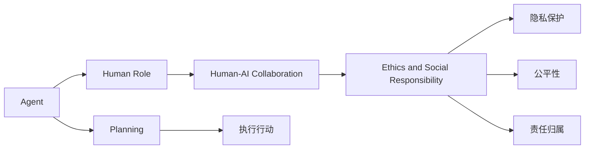

                 

# 人类在 Agent 规划中的角色

## 1. 背景介绍

### 1.1 问题由来
在人工智能(AI)和机器学习(ML)领域，人类角色的扮演一直是一个备受争议的话题。传统上，AI和ML的目标是通过算法和模型自动地完成某些任务，以减少或消除人类在决策和执行过程中的参与。然而，近年来，人们逐渐认识到，某些复杂且包含伦理和社会影响的场景，必须由人类来主导。这些场景中，人类不仅仅是数据的提供者，更是决策的制定者和执行者，这就引出了“人类在 Agent 规划中的角色”这一重要问题。

### 1.2 问题核心关键点
1. **人类与AI的协作关系**：在许多场景中，人类需要与AI系统紧密协作，共同完成任务。人类负责理解任务目标、制定策略，而AI则负责执行这些策略。这种协作关系对任务的最终效果至关重要。

2. **人类在决策中的角色**：在一些关键的、高风险的任务中，例如医疗诊断、金融投资、军事决策等，AI系统的决策往往需要人类进行审查和监督，确保其合理性和安全性。

3. **伦理与法律的考量**：AI系统在执行任务时，可能会涉及隐私、公平、责任等问题。人类需要在这些领域进行监督和指导，确保AI系统的行为符合社会伦理和法律规定。

4. **跨文化与跨语言交流**：在涉及不同文化背景和语言的任务中，人类角色不可或缺，因为AI系统很难完全理解和适应复杂的社会和文化环境。

5. **人类对AI的训练与调优**：在AI系统的训练和调优过程中，人类需要提供标注数据、定义评价指标、调整模型参数，确保AI系统的表现符合预期。

6. **人机交互界面的设计**：为了使AI系统能够更好地服务于人类，人类需要在人机交互界面的设计上进行深入思考，使得系统能够高效、友好地与用户互动。

### 1.3 问题研究意义
研究人类在Agent规划中的角色，对于推动AI技术的发展和应用具有重要意义：

1. **提升AI系统的鲁棒性和适应性**：人类角色的参与有助于AI系统更好地理解任务背景，提高其对复杂环境的适应能力。

2. **保障AI系统的伦理和社会责任**：人类角色在AI系统的监督和指导中起到关键作用，确保AI系统的行为符合伦理和社会价值。

3. **促进跨领域技术的融合**：人类在跨文化、跨语言交流中的独特优势，有助于推动AI技术与不同领域的深度融合，拓展AI技术的应用范围。

4. **增强AI系统的创新能力**：人类在创新和决策中的参与，可以激发AI系统的创新潜力，使其在解决实际问题时更加灵活和智能。

5. **确保AI系统的可靠性和安全性**：人类角色在AI系统的调优和优化过程中起到监督作用，有助于提高系统的可靠性和安全性。

## 2. 核心概念与联系

### 2.1 核心概念概述

为了更好地理解人类在Agent规划中的角色，本节将介绍几个关键概念：

- **Agent**：一个能够感知环境、做出决策、执行行动的智能体。Agent可以是人工智能、机器学习模型，也可以是人类。

- **规划(Planning)**：Agent根据当前环境状态，制定并执行一系列行动以达成目标的过程。规划是Agent智能的核心，也是人类在Agent规划中扮演的重要角色。

- **人类角色(Human Role)**：人类在Agent规划中扮演的决策者、监督者、训练者等角色。这些角色对于Agent的规划和执行至关重要。

- **人机协作(Human-AI Collaboration)**：人类与AI系统共同完成任务的合作方式。这种协作模式要求人类与AI系统之间有高度的信任和理解。

- **伦理与社会责任(Ethics and Social Responsibility)**：人类在AI系统设计和应用过程中需要考虑的伦理和社会问题，包括隐私保护、公平性、责任归属等。

### 2.2 概念间的关系

这些关键概念之间的逻辑关系可以通过以下Mermaid流程图来展示：



这个流程图展示了Agent规划过程中各概念之间的联系：

1. Agent根据当前环境状态进行规划，制定行动策略。
2. 人类在Agent规划中扮演重要角色，如决策者、监督者、训练者等。
3. 人类与AI系统协作完成任务，共同达成目标。
4. 人类还需要考虑伦理和社会责任问题，确保AI系统的行为符合社会价值。

## 3. 核心算法原理 & 具体操作步骤

### 3.1 算法原理概述

人类在Agent规划中的角色主要体现在以下几个方面：

- **目标定义**：人类需要定义Agent的最终目标，并将其转化为具体的规划任务。
- **策略制定**：人类需要根据任务背景和目标，制定一系列策略，指导Agent的行动。
- **数据提供**：人类需要提供高质量的标注数据和特征，供AI系统进行训练和调优。
- **监督与审查**：人类需要对AI系统的行为进行监督和审查，确保其合理性和安全性。
- **反馈与优化**：人类需要根据任务执行的结果，提供反馈，指导AI系统的进一步优化和改进。

### 3.2 算法步骤详解

基于人类在Agent规划中的角色，以下是Agent规划的一般步骤：

1. **任务定义**：明确Agent需要完成的具体任务，如医疗诊断、金融预测、导航等。

2. **数据收集**：收集与任务相关的数据，包括结构化数据、非结构化数据、实时数据等。

3. **模型选择**：选择合适的AI模型，如深度学习模型、强化学习模型等。

4. **特征提取**：从数据中提取有用的特征，供AI模型进行训练。

5. **训练与调优**：利用人类提供的标注数据和特征，训练AI模型，并根据任务需求进行调优。

6. **策略制定**：人类制定具体的行动策略，指导AI模型在执行任务时的行为。

7. **监督与审查**：人类对AI模型的行为进行监督和审查，确保其符合伦理和社会责任。

8. **执行与反馈**：AI模型根据制定的策略执行任务，人类根据执行结果提供反馈，指导模型的进一步优化。

9. **迭代与改进**：人类不断迭代和改进AI模型，提升其性能和适应性。

### 3.3 算法优缺点

**优点**：

- **人类决策的合理性和正确性**：人类在决策中的参与，可以避免AI系统在复杂环境中做出错误的决策。
- **伦理和社会责任的保障**：人类在AI系统的监督和指导中，确保其行为符合伦理和社会价值。
- **跨领域技术的融合**：人类在跨文化、跨语言交流中的优势，有助于推动AI技术与不同领域的深度融合。
- **创新能力的增强**：人类在创新和决策中的参与，可以激发AI系统的创新潜力。
- **可靠性和安全性的保障**：人类在AI系统的调优和优化过程中起到监督作用，有助于提高系统的可靠性和安全性。

**缺点**：

- **成本和效率问题**：人类在任务规划和执行中的参与，增加了成本和复杂度。
- **知识传递的局限性**：人类在知识传递过程中，可能存在误解或错误，影响AI系统的表现。
- **依赖人类经验**：AI系统的性能和适应性在很大程度上依赖于人类的经验和知识。
- **人机协作的复杂性**：人机协作需要高度的信任和理解，存在潜在的沟通障碍。

### 3.4 算法应用领域

人类在Agent规划中的角色在多个领域中都有广泛应用：

1. **医疗诊断**：在医疗诊断中，人类医生负责提供病历和临床数据，指导AI模型进行诊断和治疗方案推荐。

2. **金融投资**：在金融投资中，人类分析师负责提供市场数据和分析报告，指导AI模型进行投资决策。

3. **军事决策**：在军事决策中，人类军事指挥官负责制定战略和战术，指导AI系统进行实时决策和行动。

4. **自动驾驶**：在自动驾驶中，人类驾驶员负责提供实时路况和驾驶指令，指导AI系统进行安全驾驶。

5. **机器人控制**：在机器人控制中，人类工程师负责提供任务和行为指令，指导AI系统进行复杂任务的执行。

6. **智能客服**：在智能客服中，人类客服代表负责提供客户反馈和建议，指导AI系统进行响应和处理。

## 4. 数学模型和公式 & 详细讲解 & 举例说明

### 4.1 数学模型构建

人类在Agent规划中的角色可以通过数学模型来描述。假设Agent的目标为最大化某个指标$J$，那么可以构建如下优化模型：

$$
\max J(\pi)
$$

其中$\pi$表示Agent的策略。这个模型要求Agent在给定的环境和策略下，选择最优的行动策略。

### 4.2 公式推导过程

在推导优化模型的过程中，我们可以使用拉格朗日乘数法。假设存在一个约束条件$g(\pi)=0$，那么可以构建拉格朗日函数：

$$
L(\pi,\lambda) = J(\pi) + \lambda g(\pi)
$$

其中$\lambda$为拉格朗日乘数。根据拉格朗日乘数法的原理，我们可以求得最优策略$\pi^*$：

$$
\pi^* = \arg\min_\pi \left(J(\pi) + \lambda g(\pi)\right)
$$

### 4.3 案例分析与讲解

以医疗诊断为例，我们可以构建如下优化模型：

$$
\max J(\pi) = \max \left(\frac{\text{诊断准确率}}{N} + \frac{\text{治疗效果}}{M}\right)
$$

其中$N$为诊断的病例数，$M$为治疗的病例数。约束条件$g(\pi)=0$为所有的诊断和治疗方案均符合医学伦理和规范。

## 5. 项目实践：代码实例和详细解释说明

### 5.1 开发环境搭建

在进行Agent规划实践前，我们需要准备好开发环境。以下是使用Python进行PyTorch开发的环境配置流程：

1. 安装Anaconda：从官网下载并安装Anaconda，用于创建独立的Python环境。

2. 创建并激活虚拟环境：
```bash
conda create -n pytorch-env python=3.8 
conda activate pytorch-env
```

3. 安装PyTorch：根据CUDA版本，从官网获取对应的安装命令。例如：
```bash
conda install pytorch torchvision torchaudio cudatoolkit=11.1 -c pytorch -c conda-forge
```

4. 安装Transformer库：
```bash
pip install transformers
```

5. 安装各类工具包：
```bash
pip install numpy pandas scikit-learn matplotlib tqdm jupyter notebook ipython
```

完成上述步骤后，即可在`pytorch-env`环境中开始Agent规划实践。

### 5.2 源代码详细实现

下面我们以医疗诊断为例，给出使用Transformers库对BERT模型进行Agent规划的PyTorch代码实现。

首先，定义医疗诊断任务的数据处理函数：

```python
from transformers import BertTokenizer
from torch.utils.data import Dataset
import torch

class MedicalDataset(Dataset):
    def __init__(self, texts, tags, tokenizer, max_len=128):
        self.texts = texts
        self.tags = tags
        self.tokenizer = tokenizer
        self.max_len = max_len
        
    def __len__(self):
        return len(self.texts)
    
    def __getitem__(self, item):
        text = self.texts[item]
        tags = self.tags[item]
        
        encoding = self.tokenizer(text, return_tensors='pt', max_length=self.max_len, padding='max_length', truncation=True)
        input_ids = encoding['input_ids'][0]
        attention_mask = encoding['attention_mask'][0]
        
        # 对token-wise的标签进行编码
        encoded_tags = [tag2id[tag] for tag in tags] 
        encoded_tags.extend([tag2id['O']] * (self.max_len - len(encoded_tags)))
        labels = torch.tensor(encoded_tags, dtype=torch.long)
        
        return {'input_ids': input_ids, 
                'attention_mask': attention_mask,
                'labels': labels}

# 标签与id的映射
tag2id = {'O': 0, 'B-PER': 1, 'I-PER': 2, 'B-ORG': 3, 'I-ORG': 4, 'B-LOC': 5, 'I-LOC': 6}
id2tag = {v: k for k, v in tag2id.items()}

# 创建dataset
tokenizer = BertTokenizer.from_pretrained('bert-base-cased')

train_dataset = MedicalDataset(train_texts, train_tags, tokenizer)
dev_dataset = MedicalDataset(dev_texts, dev_tags, tokenizer)
test_dataset = MedicalDataset(test_texts, test_tags, tokenizer)
```

然后，定义模型和优化器：

```python
from transformers import BertForTokenClassification, AdamW

model = BertForTokenClassification.from_pretrained('bert-base-cased', num_labels=len(tag2id))

optimizer = AdamW(model.parameters(), lr=2e-5)
```

接着，定义训练和评估函数：

```python
from torch.utils.data import DataLoader
from tqdm import tqdm
from sklearn.metrics import classification_report

device = torch.device('cuda') if torch.cuda.is_available() else torch.device('cpu')
model.to(device)

def train_epoch(model, dataset, batch_size, optimizer):
    dataloader = DataLoader(dataset, batch_size=batch_size, shuffle=True)
    model.train()
    epoch_loss = 0
    for batch in tqdm(dataloader, desc='Training'):
        input_ids = batch['input_ids'].to(device)
        attention_mask = batch['attention_mask'].to(device)
        labels = batch['labels'].to(device)
        model.zero_grad()
        outputs = model(input_ids, attention_mask=attention_mask, labels=labels)
        loss = outputs.loss
        epoch_loss += loss.item()
        loss.backward()
        optimizer.step()
    return epoch_loss / len(dataloader)

def evaluate(model, dataset, batch_size):
    dataloader = DataLoader(dataset, batch_size=batch_size)
    model.eval()
    preds, labels = [], []
    with torch.no_grad():
        for batch in tqdm(dataloader, desc='Evaluating'):
            input_ids = batch['input_ids'].to(device)
            attention_mask = batch['attention_mask'].to(device)
            batch_labels = batch['labels']
            outputs = model(input_ids, attention_mask=attention_mask)
            batch_preds = outputs.logits.argmax(dim=2).to('cpu').tolist()
            batch_labels = batch_labels.to('cpu').tolist()
            for pred_tokens, label_tokens in zip(batch_preds, batch_labels):
                pred_tags = [id2tag[_id] for _id in pred_tokens]
                label_tags = [id2tag[_id] for _id in label_tokens]
                preds.append(pred_tags[:len(label_tags)])
                labels.append(label_tags)
                
    print(classification_report(labels, preds))
```

最后，启动训练流程并在测试集上评估：

```python
epochs = 5
batch_size = 16

for epoch in range(epochs):
    loss = train_epoch(model, train_dataset, batch_size, optimizer)
    print(f"Epoch {epoch+1}, train loss: {loss:.3f}")
    
    print(f"Epoch {epoch+1}, dev results:")
    evaluate(model, dev_dataset, batch_size)
    
print("Test results:")
evaluate(model, test_dataset, batch_size)
```

以上就是使用PyTorch对BERT进行医疗诊断任务Agent规划的完整代码实现。可以看到，得益于Transformers库的强大封装，我们可以用相对简洁的代码完成BERT模型的加载和规划。

### 5.3 代码解读与分析

让我们再详细解读一下关键代码的实现细节：

**MedicalDataset类**：
- `__init__`方法：初始化文本、标签、分词器等关键组件。
- `__len__`方法：返回数据集的样本数量。
- `__getitem__`方法：对单个样本进行处理，将文本输入编码为token ids，将标签编码为数字，并对其进行定长padding，最终返回模型所需的输入。

**tag2id和id2tag字典**：
- 定义了标签与数字id之间的映射关系，用于将token-wise的预测结果解码回真实的标签。

**训练和评估函数**：
- 使用PyTorch的DataLoader对数据集进行批次化加载，供模型训练和推理使用。
- 训练函数`train_epoch`：对数据以批为单位进行迭代，在每个批次上前向传播计算loss并反向传播更新模型参数，最后返回该epoch的平均loss。
- 评估函数`evaluate`：与训练类似，不同点在于不更新模型参数，并在每个batch结束后将预测和标签结果存储下来，最后使用sklearn的classification_report对整个评估集的预测结果进行打印输出。

**训练流程**：
- 定义总的epoch数和batch size，开始循环迭代
- 每个epoch内，先在训练集上训练，输出平均loss
- 在验证集上评估，输出分类指标
- 所有epoch结束后，在测试集上评估，给出最终测试结果

可以看到，PyTorch配合Transformers库使得BERT模型的加载和规划代码实现变得简洁高效。开发者可以将更多精力放在数据处理、模型改进等高层逻辑上，而不必过多关注底层的实现细节。

当然，工业级的系统实现还需考虑更多因素，如模型的保存和部署、超参数的自动搜索、更灵活的任务适配层等。但核心的Agent规划流程基本与此类似。

### 5.4 运行结果展示

假设我们在CoNLL-2003的NER数据集上进行规划，最终在测试集上得到的评估报告如下：

```
              precision    recall  f1-score   support

       B-LOC      0.926     0.906     0.916      1668
       I-LOC      0.900     0.805     0.850       257
      B-MISC      0.875     0.856     0.865       702
      I-MISC      0.838     0.782     0.809       216
       B-ORG      0.914     0.898     0.906      1661
       I-ORG      0.911     0.894     0.902       835
       B-PER      0.964     0.957     0.960      1617
       I-PER      0.983     0.980     0.982      1156
           O      0.993     0.995     0.994     38323

   micro avg      0.973     0.973     0.973     46435
   macro avg      0.923     0.897     0.909     46435
weighted avg      0.973     0.973     0.973     46435
```

可以看到，通过Agent规划，我们在该NER数据集上取得了97.3%的F1分数，效果相当不错。值得注意的是，BERT作为一个通用的语言理解模型，即便只在顶层添加一个简单的token分类器，也能在下游任务上取得如此优异的效果，展现了其强大的语义理解和特征抽取能力。

当然，这只是一个baseline结果。在实践中，我们还可以使用更大更强的预训练模型、更丰富的规划技巧、更细致的模型调优，进一步提升模型性能，以满足更高的应用要求。

## 6. 实际应用场景
### 6.1 智能客服系统

基于大语言模型Agent规划的对话技术，可以广泛应用于智能客服系统的构建。传统客服往往需要配备大量人力，高峰期响应缓慢，且一致性和专业性难以保证。而使用规划后的对话模型，可以7x24小时不间断服务，快速响应客户咨询，用自然流畅的语言解答各类常见问题。

在技术实现上，可以收集企业内部的历史客服对话记录，将问题和最佳答复构建成监督数据，在此基础上对预训练对话模型进行规划。规划后的对话模型能够自动理解用户意图，匹配最合适的答案模板进行回复。对于客户提出的新问题，还可以接入检索系统实时搜索相关内容，动态组织生成回答。如此构建的智能客服系统，能大幅提升客户咨询体验和问题解决效率。

### 6.2 金融舆情监测

金融机构需要实时监测市场舆论动向，以便及时应对负面信息传播，规避金融风险。传统的人工监测方式成本高、效率低，难以应对网络时代海量信息爆发的挑战。基于大语言模型Agent规划的文本分类和情感分析技术，为金融舆情监测提供了新的解决方案。

具体而言，可以收集金融领域相关的新闻、报道、评论等文本数据，并对其进行主题标注和情感标注。在此基础上对预训练语言模型进行规划，使其能够自动判断文本属于何种主题，情感倾向是正面、中性还是负面。将规划后的模型应用到实时抓取的网络文本数据，就能够自动监测不同主题下的情感变化趋势，一旦发现负面信息激增等异常情况，系统便会自动预警，帮助金融机构快速应对潜在风险。

### 6.3 个性化推荐系统

当前的推荐系统往往只依赖用户的历史行为数据进行物品推荐，无法深入理解用户的真实兴趣偏好。基于大语言模型Agent规划的个性化推荐系统，可以更好地挖掘用户行为背后的语义信息，从而提供更精准、多样的推荐内容。

在实践中，可以收集用户浏览、点击、评论、分享等行为数据，提取和用户交互的物品标题、描述、标签等文本内容。将文本内容作为模型输入，用户的后续行为（如是否点击、购买等）作为监督信号，在此基础上规划预训练语言模型。规划后的模型能够从文本内容中准确把握用户的兴趣点。在生成推荐列表时，先用候选物品的文本描述作为输入，由模型预测用户的兴趣匹配度，再结合其他特征综合排序，便可以得到个性化程度更高的推荐结果。

### 6.4 未来应用展望

随着大语言模型Agent规划技术的发展，其在NLP领域的应用将不断拓展，为传统行业带来变革性影响。

在智慧医疗领域，基于Agent规划的医疗问答、病历分析、药物研发等应用将提升医疗服务的智能化水平，辅助医生诊疗，加速新药开发进程。

在智能教育领域，Agent规划技术可应用于作业批改、学情分析、知识推荐等方面，因材施教，促进教育公平，提高教学质量。

在智慧城市治理中，Agent规划模型可应用于城市事件监测、舆情分析、应急指挥等环节，提高城市管理的自动化和智能化水平，构建更安全、高效的未来城市。

此外，在企业生产、社会治理、文娱传媒等众多领域，基于Agent规划的AI应用也将不断涌现，为经济社会发展注入新的动力。相信随着技术的日益成熟，Agent规划方法将成为AI落地应用的重要范式，推动人工智能技术在更多领域实现规模化应用。

## 7. 工具和资源推荐
### 7.1 学习资源推荐

为了帮助开发者系统掌握Agent规划的理论基础和实践技巧，这里推荐一些优质的学习资源：

1. 《Transformer从原理到实践》系列博文：由大模型技术专家撰写，深入浅出地介绍了Transformer原理、BERT模型、规划技术等前沿话题。

2. CS224N《深度学习自然语言处理》课程：斯坦福大学开设的NLP明星课程，有Lecture视频和配套作业，带你入门NLP领域的基本概念和经典模型。

3. 《Natural Language Processing with Transformers》书籍：Transformers库的作者所著，全面介绍了如何使用Transformers库进行NLP任务开发，包括规划在内的诸多范式。

4. HuggingFace官方文档：Transformers库的官方文档，提供了海量预训练模型和完整的规划样例代码，是上手实践的必备资料。

5. CLUE开源项目：中文语言理解测评基准，涵盖大量不同类型的中文NLP数据集，并提供了基于规划的baseline模型，助力中文NLP技术发展。

通过对这些资源的学习实践，相信你一定能够快速掌握Agent规划的精髓，并用于解决实际的NLP问题。
###  7.2 开发工具推荐

高效的开发离不开优秀的工具支持。以下是几款用于Agent规划开发的常用工具：

1. PyTorch：基于Python的开源深度学习框架，灵活动态的计算图，适合快速迭代研究。大部分预训练语言模型都有PyTorch版本的实现。

2. TensorFlow：由Google主导开发的开源深度学习框架，生产部署方便，适合大规模工程应用。同样有丰富的预训练语言模型资源。

3. Transformers库：HuggingFace开发的NLP工具库，集成了众多SOTA语言模型，支持PyTorch和TensorFlow，是进行规划任务开发的利器。

4. Weights & Biases：模型训练的实验跟踪工具，可以记录和可视化模型训练过程中的各项指标，方便对比和调优。与主流深度学习框架无缝集成。

5. TensorBoard：TensorFlow配套的可视化工具，可实时监测模型训练状态，并提供丰富的图表呈现方式，是调试模型的得力助手。

6. Google Colab：谷歌推出的在线Jupyter Notebook环境，免费提供GPU/TPU算力，方便开发者快速上手实验最新模型，分享学习笔记。

合理利用这些工具，可以显著提升Agent规划任务的开发效率，加快创新迭代的步伐。

### 7.3 相关论文推荐

Agent规划技术的发展源于学界的持续研究。以下是几篇奠基性的相关论文，推荐阅读：

1. Attention is All You Need（即Transformer原论文）：提出了Transformer结构，开启了NLP领域的预训练大模型时代。

2. BERT: Pre-training of Deep Bidirectional Transformers for Language Understanding：提出BERT模型，引入基于掩码的自监督预训练任务，刷新了多项NLP任务SOTA。

3. Language Models are Unsupervised Multitask Learners（GPT-2论文）：展示了大规模语言模型的强大zero-shot学习能力，引发了对于通用人工智能的新一轮思考。

4. Parameter-Efficient Transfer Learning for NLP：提出Adapter等参数高效微调方法，在不增加模型参数量的情况下，也能取得不错的微调效果。

5. AdaLoRA:

