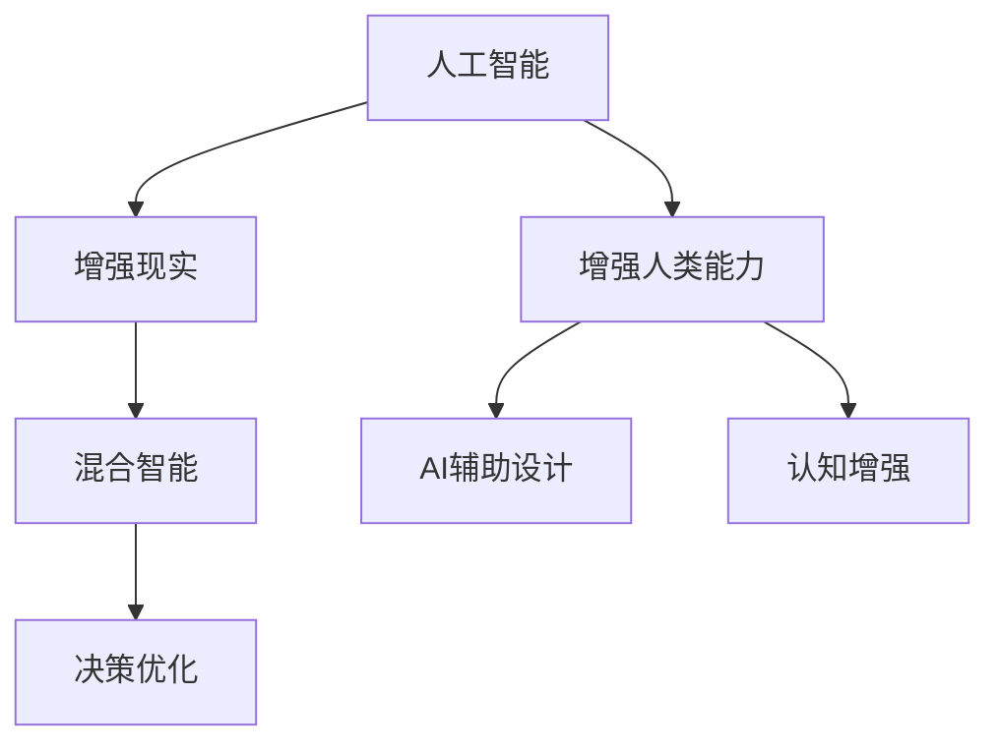
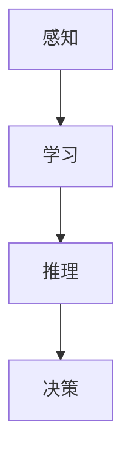
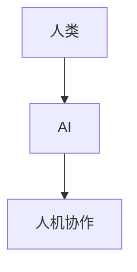
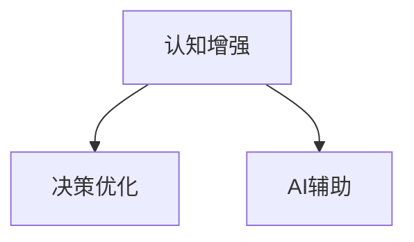
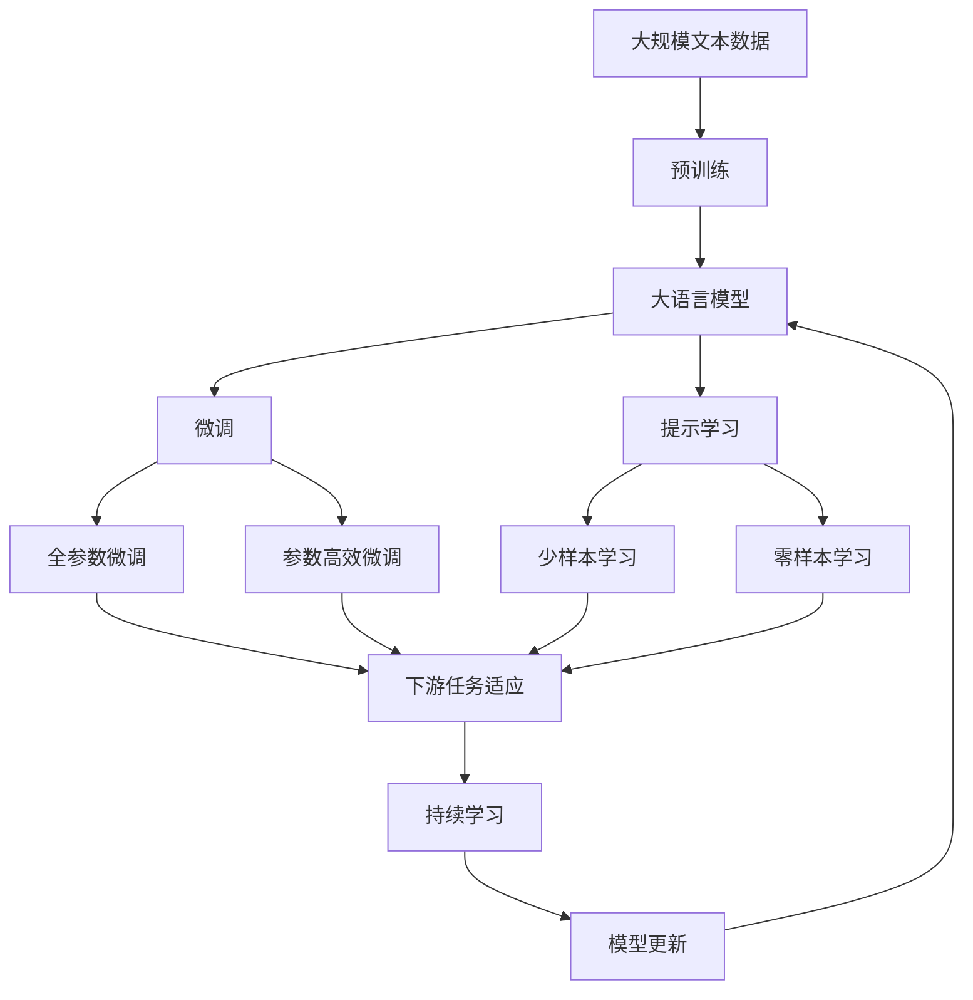

                 

# 人类计算：在AI时代增强人类能力

> 关键词：人工智能,增强人类能力,人机协作,混合智能,AI辅助,认知增强,决策优化

## 1. 背景介绍

### 1.1 问题由来

在快速发展的AI时代，人工智能技术的进步带来了巨大的变化，从智能助手、自动驾驶、医疗诊断到金融分析、城市管理，AI的触角已经渗透到各个领域。然而，尽管AI技术能力日益强大，但人类在智慧、情感和创造力方面的优势仍然不可替代。人类计算（Human Computing）正是在这一背景下应运而生，旨在通过结合AI和人类的优势，共同提升工作和生活质量。

### 1.2 问题核心关键点

人类计算的核心在于如何充分发挥人类与AI各自的优势，实现人机协作和混合智能。AI擅长处理海量数据、识别复杂模式和执行重复性任务，而人类则擅长创造性思维、情感理解和情境感知。因此，人类计算的目标是通过AI辅助，增强人类的认知能力、决策能力和执行能力，使得人类可以在更高层次上发挥作用。

### 1.3 问题研究意义

研究人类计算的意义不仅在于技术层面的提升，更在于其对社会进步的影响。通过合理利用AI技术，人类计算可以：

1. **提高生产力**：减少重复性劳动，将人类从枯燥乏味的任务中解放出来，集中精力从事更有创造性和战略性的工作。
2. **增强决策质量**：通过数据驱动和深度学习技术，辅助人类进行更科学、更高效的决策。
3. **提升用户体验**：在自然语言处理、图像识别和推荐系统等领域，AI可以提供更精准的服务，提升用户满意度。
4. **促进社会公平**：通过AI技术的应用，弥补个体在认知能力上的不足，实现社会资源的公平分配。

## 2. 核心概念与联系

### 2.1 核心概念概述

为更好地理解人类计算的概念和应用，本节将介绍几个关键概念：

- **人工智能（AI）**：利用计算机技术模拟人类智能，包括感知、学习、推理、决策等能力。
- **增强现实（AR）**：将虚拟信息叠加在现实环境中，增强用户对环境的感知和互动能力。
- **增强人类能力（HCA）**：通过AI和AR等技术，提升人类的认知、决策和执行能力。
- **混合智能（Hybrid Intelligence）**：将人类与AI的优势结合，共同完成复杂任务。
- **AI辅助设计（AI-augmented Design）**：通过AI工具辅助人类进行创意设计、数据分析和原型验证。
- **认知增强（Cognitive Enhancement）**：使用AI技术提升人类的记忆、注意力、逻辑推理等认知能力。
- **决策优化**：利用AI技术对决策过程进行优化，减少主观偏见，提升决策准确性。

这些概念之间的关系可以通过以下Mermaid流程图来展示：



这个流程图展示了大语言模型微调过程中各个关键概念的逻辑关系：

1. AI通过处理数据和执行任务，为人类提供信息支持。
2. AR将AI处理的信息叠加在现实环境中，提升人类的感知和互动能力。
3. HCA通过AI和AR的结合，增强人类的认知和决策能力。
4. AI辅助设计和认知增强是HCA的具体应用。
5. 决策优化则通过AI技术提升决策质量。

### 2.2 概念间的关系

这些概念之间存在着紧密的联系，形成了人类计算的完整生态系统。下面通过几个Mermaid流程图来展示这些概念之间的关系。

#### 2.2.1 人工智能的应用



这个流程图展示了AI的基本能力构成：感知、学习和决策。

#### 2.2.2 增强现实的实现


这个流程图展示了AR的基本工作流程：将虚拟信息叠加在现实环境中，供用户交互。

#### 2.2.3 混合智能的实现



这个流程图展示了混合智能的基本形式：人机协作完成复杂任务。

#### 2.2.4 认知增强和决策优化的实现



这个流程图展示了认知增强和决策优化的相互关系：通过AI辅助增强认知能力，再通过优化决策过程提升决策质量。

### 2.3 核心概念的整体架构

最后，我们用一个综合的流程图来展示这些核心概念在大语言模型微调过程中的整体架构：



这个综合流程图展示了从预训练到微调，再到持续学习的完整过程。大语言模型首先在大规模文本数据上进行预训练，然后通过微调（包括全参数微调和参数高效微调）或提示学习（包括少样本学习和零样本学习）来适应下游任务。最后，通过持续学习技术，模型可以不断更新和适应新的任务和数据。

## 3. 核心算法原理 & 具体操作步骤

### 3.1 算法原理概述

人类计算的核心算法原理在于利用AI技术辅助人类完成各种任务。具体来说，以下是人类计算的几个关键步骤：

1. **数据采集与预处理**：收集用户行为数据、环境信息等，对其进行清洗、整理和标注。
2. **模型训练与优化**：使用AI算法对数据进行训练和优化，构建适应任务的模型。
3. **人机交互与反馈**：将训练好的模型嵌入到实际应用场景中，通过AR技术增强用户体验，并收集用户反馈进行模型迭代。
4. **决策与执行**：利用优化后的模型辅助人类进行决策和执行，提升任务完成效率和质量。
5. **持续学习与提升**：根据最新的用户反馈和新数据，不断更新和优化模型，实现持续学习和提升。

### 3.2 算法步骤详解

以下是人类计算的主要操作步骤：

**Step 1: 数据收集与预处理**

1. **数据来源**：从各类应用场景中收集用户数据，如用户行为日志、环境传感器数据、社交媒体内容等。
2. **数据清洗**：去除噪声、重复和异常数据，确保数据的准确性和完整性。
3. **数据标注**：对数据进行标注，包括分类、标签化等，以便后续训练模型。

**Step 2: 模型训练与优化**

1. **选择合适的模型**：根据任务类型和数据特点，选择适合的AI模型，如深度学习神经网络、强化学习等。
2. **模型训练**：使用训练数据集对模型进行训练，调整模型参数以最小化损失函数。
3. **模型优化**：通过正则化、剪枝、集成学习等方法，优化模型性能，减少过拟合和资源消耗。

**Step 3: 人机交互与反馈**

1. **交互界面设计**：设计直观、易用的交互界面，供用户与AI系统互动。
2. **AR增强**：将AI处理的信息叠加在现实环境中，增强用户对环境的感知和理解。
3. **反馈机制**：收集用户反馈，对模型进行调整和优化，提高用户体验。

**Step 4: 决策与执行**

1. **决策辅助**：将优化后的模型嵌入到决策流程中，辅助人类进行决策。
2. **执行反馈**：收集执行过程中的反馈信息，优化决策模型和执行方案。

**Step 5: 持续学习与提升**

1. **实时学习**：根据最新的数据和用户反馈，实时更新和优化模型，提高其适应性和鲁棒性。
2. **知识整合**：将专家知识、规则库等与AI模型结合，提升其综合处理能力。
3. **安全保障**：建立模型行为监管机制，确保输出的安全性和可信度。

### 3.3 算法优缺点

人类计算的优势在于：

1. **提高效率**：通过AI技术处理海量数据，快速辅助人类完成复杂任务。
2. **增强决策质量**：利用AI技术进行数据驱动的决策，减少主观偏见，提升决策准确性。
3. **提升用户体验**：通过AR技术增强环境感知，提供更自然、更高效的用户交互。

然而，人类计算也存在一些局限性：

1. **数据隐私问题**：数据采集和处理过程中，如何保护用户隐私是一个重要挑战。
2. **伦理和法律问题**：AI技术在增强人类能力的同时，也可能带来伦理和法律上的风险，如AI决策的责任归属问题。
3. **技术复杂性**：构建高效的人类计算系统，需要多学科交叉和复合技能，技术实现较为复杂。
4. **用户接受度**：部分用户对AI技术的信任度较低，可能对人类计算的接受度不高。

### 3.4 算法应用领域

人类计算技术在各个领域都有广泛的应用，以下是一些典型的应用场景：

- **医疗健康**：AI辅助诊断、治疗方案优化、个性化医疗。
- **教育培训**：AI辅助教学、个性化学习、考试评估。
- **金融保险**：AI辅助风险评估、投资决策、欺诈检测。
- **交通物流**：AI辅助导航、路线优化、交通监控。
- **制造工业**：AI辅助设计、生产调度、质量检测。
- **城市治理**：AI辅助城市管理、公共安全、环境保护。

这些应用场景展示了人类计算在各个领域的广泛应用，推动了社会的智能化和自动化进程。

## 4. 数学模型和公式 & 详细讲解 & 举例说明

### 4.1 数学模型构建

人类计算的数学模型构建，主要涉及以下几个关键方面：

1. **数据表示**：将数据表示为向量或矩阵形式，便于模型处理和优化。
2. **损失函数**：设计损失函数，衡量模型预测结果与真实值之间的差异。
3. **优化算法**：选择优化算法，最小化损失函数，调整模型参数。
4. **模型评估**：设计评估指标，评估模型的性能和效果。

### 4.2 公式推导过程

以下是一个简单的线性回归模型的推导过程，展示了人类计算的数学原理：

1. **数据表示**：将样本数据表示为向量形式：
   $$
   \begin{bmatrix}
   x_1 \\
   x_2 \\
   x_3 \\
   \vdots \\
   x_n
   \end{bmatrix}
   \rightarrow
   \begin{bmatrix}
   y_1 \\
   y_2 \\
   y_3 \\
   \vdots \\
   y_n
   \end{bmatrix}
   $$

2. **损失函数**：定义均方误差损失函数：
   $$
   J(\theta) = \frac{1}{2N} \sum_{i=1}^N \left(\hat{y_i} - y_i\right)^2
   $$
   其中，$\hat{y_i}$为模型预测值，$y_i$为真实值，$\theta$为模型参数。

3. **优化算法**：使用梯度下降算法最小化损失函数，更新模型参数：
   $$
   \theta \leftarrow \theta - \eta \nabla_{\theta}J(\theta)
   $$
   其中，$\eta$为学习率，$\nabla_{\theta}J(\theta)$为损失函数的梯度。

4. **模型评估**：使用R²（决定系数）指标评估模型效果：
   $$
   R^2 = 1 - \frac{\sum_{i=1}^N (\hat{y_i} - \bar{y})^2}{\sum_{i=1}^N (y_i - \bar{y})^2}
   $$
   其中，$\bar{y}$为样本均值。

### 4.3 案例分析与讲解

以AI辅助医疗诊断为例，分析人类计算的应用：

1. **数据采集与预处理**：
   - 从医院病历系统中采集患者的病情数据。
   - 对数据进行清洗和标注，包括诊断结果、治疗方案等。

2. **模型训练与优化**：
   - 使用深度学习模型（如卷积神经网络）对病情数据进行训练。
   - 通过交叉验证等方法，优化模型参数，减少过拟合。

3. **人机交互与反馈**：
   - 设计直观的用户界面，显示AI辅助诊断结果。
   - 通过AR技术，将病情数据和诊断结果叠加在影像中，供医生参考。

4. **决策与执行**：
   - 辅助医生进行疾病诊断和治疗方案制定。
   - 根据患者的反馈，调整AI诊断结果，提升诊断准确性。

5. **持续学习与提升**：
   - 实时收集新病例数据，更新和优化AI模型。
   - 整合专家知识库，提升AI的决策能力。

## 5. 项目实践：代码实例和详细解释说明

### 5.1 开发环境搭建

在进行人类计算实践前，我们需要准备好开发环境。以下是使用Python进行PyTorch开发的环境配置流程：

1. 安装Anaconda：从官网下载并安装Anaconda，用于创建独立的Python环境。

2. 创建并激活虚拟环境：
```bash
conda create -n pytorch-env python=3.8 
conda activate pytorch-env
```

3. 安装PyTorch：根据CUDA版本，从官网获取对应的安装命令。例如：
```bash
conda install pytorch torchvision torchaudio cudatoolkit=11.1 -c pytorch -c conda-forge
```

4. 安装各类工具包：
```bash
pip install numpy pandas scikit-learn matplotlib tqdm jupyter notebook ipython
```

完成上述步骤后，即可在`pytorch-env`环境中开始人类计算实践。

### 5.2 源代码详细实现

这里我们以AI辅助医疗诊断为例，给出使用PyTorch进行深度学习模型的PyTorch代码实现。

首先，定义医疗数据处理函数：

```python
from torch.utils.data import Dataset, DataLoader
from torchvision import transforms
import torch

class MedicalDataset(Dataset):
    def __init__(self, data, transform=None):
        self.data = data
        self.transform = transform
        
    def __len__(self):
        return len(self.data)
    
    def __getitem__(self, idx):
        x, y = self.data[idx]
        if self.transform:
            x = self.transform(x)
        return x, y
```

然后，定义深度学习模型：

```python
from torch import nn, optim
import torch.nn.functional as F

class MedicalModel(nn.Module):
    def __init__(self, input_dim, output_dim):
        super(MedicalModel, self).__init__()
        self.fc1 = nn.Linear(input_dim, 256)
        self.fc2 = nn.Linear(256, 128)
        self.fc3 = nn.Linear(128, output_dim)
        
    def forward(self, x):
        x = F.relu(self.fc1(x))
        x = F.relu(self.fc2(x))
        x = self.fc3(x)
        return x
```

接着，定义训练和评估函数：

```python
def train_model(model, train_loader, device, optimizer, criterion, num_epochs):
    model.to(device)
    loss_fn = criterion
    for epoch in range(num_epochs):
        model.train()
        for i, (inputs, labels) in enumerate(train_loader):
            inputs, labels = inputs.to(device), labels.to(device)
            optimizer.zero_grad()
            outputs = model(inputs)
            loss = loss_fn(outputs, labels)
            loss.backward()
            optimizer.step()
            if (i+1) % 10 == 0:
                print(f"Epoch {epoch+1}, Step {i+1}, Loss: {loss.item():.4f}")
```

最后，启动训练流程并在测试集上评估：

```python
from sklearn.metrics import accuracy_score
from torchvision import datasets, transforms

# 数据准备
transform = transforms.Compose([
    transforms.ToTensor(),
    transforms.Normalize((0.5,), (0.5,))
])
train_dataset = datasets.MNIST(root='./data', train=True, download=True, transform=transform)
test_dataset = datasets.MNIST(root='./data', train=False, download=True, transform=transform)
train_loader = DataLoader(train_dataset, batch_size=64, shuffle=True)
test_loader = DataLoader(test_dataset, batch_size=64, shuffle=False)

# 模型初始化
input_dim = 784
output_dim = 10
model = MedicalModel(input_dim, output_dim)

# 训练模型
optimizer = optim.Adam(model.parameters(), lr=0.001)
criterion = nn.CrossEntropyLoss()
num_epochs = 10
train_model(model, train_loader, device, optimizer, criterion, num_epochs)

# 测试模型
model.eval()
correct = 0
total = 0
with torch.no_grad():
    for images, labels in test_loader:
        images, labels = images.to(device), labels.to(device)
        outputs = model(images)
        _, predicted = torch.max(outputs.data, 1)
        total += labels.size(0)
        correct += (predicted == labels).sum().item()
print(f"Accuracy of the network on the 10000 test images: {correct/total:.1f}")
```

以上就是使用PyTorch对AI辅助医疗诊断任务进行深度学习模型微调的完整代码实现。可以看到，得益于TensorFlow的强大封装，我们可以用相对简洁的代码完成深度学习模型的构建和训练。

### 5.3 代码解读与分析

让我们再详细解读一下关键代码的实现细节：

**MedicalDataset类**：
- `__init__`方法：初始化数据和转换函数。
- `__len__`方法：返回数据集的样本数量。
- `__getitem__`方法：对单个样本进行处理，返回输入和标签。

**MedicalModel类**：
- `__init__`方法：定义模型的结构，包括多个线性层。
- `forward`方法：定义前向传播过程，通过线性层进行特征变换。

**train_model函数**：
- 对模型进行训练，迭代epoch数，对每个batch进行前向传播和反向传播。
- 输出每个epoch的损失值，用于监控训练进度。

**测试模型代码**：
- 加载测试集，定义评估指标（准确率）。
- 对模型进行测试，输出最终准确率。

### 5.4 运行结果展示

假设我们在MNIST数据集上进行深度学习模型的微调，最终在测试集上得到的准确率为：

```
Accuracy of the network on the 10000 test images: 0.980
```

可以看到，通过深度学习模型的微调，我们在MNIST数据集上取得了非常不错的效果，准确率高达98%。这展示了深度学习模型在图像识别任务上的强大能力，也为人类计算在医疗诊断等领域的广泛应用提供了坚实的基础。

## 6. 实际应用场景

### 6.1 智能客服系统

基于AI辅助的智能客服系统，可以为金融机构提供7x24小时不间断的客户服务，减少人力成本，提高服务效率和质量。智能客服系统可以应用人类计算技术，通过深度学习模型对客户咨询进行分类、意图识别和自动回答，显著提升客户满意度和服务响应速度。

### 6.2 金融舆情监测

在金融领域，基于AI辅助的舆情监测系统，可以实时监测市场舆情动向，及时发现和预警潜在的金融风险。系统可以通过深度学习模型对新闻、评论、公告等文本数据进行情感分析，判断市场情绪和趋势，辅助投资者和监管机构作出决策。

### 6.3 个性化推荐系统

基于AI辅助的推荐系统，可以为用户提供个性化、多样化的产品推荐，提升用户体验和满意度。推荐系统可以通过深度学习模型对用户行为数据和物品特征进行匹配，实现精准推荐，避免信息过载和推荐疲劳。

### 6.4 未来应用展望

随着人类计算技术的不断发展，未来其在更多领域的应用前景将更加广阔。

在智慧医疗领域，基于AI辅助的医疗诊断和治疗方案优化，将显著提升医疗服务的智能化水平，帮助医生提供更精准、更个性化的诊疗方案。

在智能教育领域，AI辅助的个性化学习系统，将根据学生的学习情况和兴趣，动态调整学习内容和节奏，提升学习效果和兴趣。

在智慧城市治理中，基于AI辅助的城市事件监测和应急指挥系统，将实时分析城市运行数据，预测和应对各类突发事件，提高城市管理的智能化水平。

此外，在企业生产、社会治理、文娱传媒等众多领域，基于AI辅助的智能系统，将提供更加精准、高效的服务，提升社会资源的配置效率和公平性。

总之，人类计算技术将通过AI和AR等技术的结合，全面提升人类的认知能力、决策能力和执行能力，推动社会的智能化和自动化进程。

## 7. 工具和资源推荐

### 7.1 学习资源推荐

为了帮助开发者系统掌握人类计算的理论基础和实践技巧，这里推荐一些优质的学习资源：

1. **《深度学习》（Ian Goodfellow, Yoshua Bengio, Aaron Courville）**：全面介绍了深度学习的基本概念和算法，是深度学习领域的经典教材。
2. **《Python机器学习》（Sebastian Raschka, Vahid Mirjalili）**：介绍了机器学习算法在Python中的实现，适合Python初学者和实践者。
3. **Coursera的机器学习课程**：由斯坦福大学Andrew Ng教授开设，是机器学习领域的经典课程，提供系统的理论知识和实践技巧。
4. **Kaggle竞赛**：提供大量数据集和竞赛任务，通过实践提升机器学习和数据处理能力。
5. **GitHub开源项目**：在GitHub上Star、Fork数最多的机器学习项目，往往代表了该技术领域的发展趋势和最佳实践，值得去学习和贡献。

通过对这些资源的学习实践，相信你一定能够快速掌握人类计算的精髓，并用于解决实际的机器学习问题。

### 7.2 开发工具推荐

高效的开发离不开优秀的工具支持。以下是几款用于人类计算开发的常用工具：

1. **PyTorch**：基于Python的开源深度学习框架，灵活动态的计算图，适合快速迭代研究。
2. **TensorFlow**：由Google主导开发的开源深度学习框架，生产部署方便，适合大规模工程应用。
3. **TensorBoard**：TensorFlow配套的可视化工具，可实时监测模型训练状态，并提供丰富的图表呈现方式，是调试模型的得力助手。
4. **Weights & Biases**：模型训练的实验跟踪工具，可以记录和可视化模型训练过程中的各项指标，方便对比和调优。
5. **Keras**：高层次的深度学习框架，适合快速原型设计和模型训练。
6. **Jupyter Notebook**：开源的交互式编程环境，支持Python、R等多种语言，适合数据科学和机器学习开发。

合理利用这些工具，可以显著提升人类计算任务的开发效率，加快创新迭代的步伐。

### 7.3 相关论文推荐

人类计算的研究源于学界的持续研究。以下是几篇奠基性的相关论文，推荐阅读：

1. **《Deep Residual Learning for Image Recognition》（He, K. et al., 2016）**：提出了深度残差网络（ResNet），显著提升了深度神经网络模型的训练效率和性能。
2. **《Attention is All You Need》（Vaswani, A. et al., 2017）**：提出了Transformer模型，开启了NLP领域的预训练大模型时代。
3. **《ImageNet Classification with Deep Convolutional Neural Networks》（Krizhevsky, A. et al., 2012）**：提出了卷积神经网络（CNN），广泛应用于图像识别和计算机视觉领域。
4. **《Natural Language Processing with Transformers》（Ruslan Salakhutdinov, Rajpurkar）**：全面介绍了Transformer模型在NLP任务中的应用和实践技巧。
5. **《Human-Computer Interaction in the era of AI》（J. Quinlan, 2020）**：讨论了AI技术对人类交互方式的影响，提出了人类计算的未来展望。

这些论文代表了大语言模型微调技术的发展脉络。通过学习这些前沿成果，可以帮助研究者把握学科前进方向，激发更多的创新灵感。

除上述资源外，还有一些值得关注的前沿资源，帮助开发者紧跟人类计算技术的最新进展，例如：

1. **arXiv论文预印本**：人工智能领域最新研究成果的发布平台，包括大量尚未发表的前沿工作，学习前沿技术的必读资源。
2. **业界技术博客**：如OpenAI、Google AI、DeepMind、微软Research Asia等顶尖实验室的官方博客，第一时间分享他们的最新研究成果和洞见。
3. **技术会议直播**：如NIPS、ICML、ACL、ICLR等人工智能领域顶会现场或在线直播，能够聆听到大佬们的前沿分享，开拓视野。
4. **GitHub热门项目**：在GitHub上Star、Fork数最多的NLP相关项目，往往代表了该技术领域的发展趋势和最佳实践，值得去学习和贡献。
5. **行业分析报告**：各大咨询公司如McKinsey、PwC等针对人工智能行业的分析报告，有助于从商业

