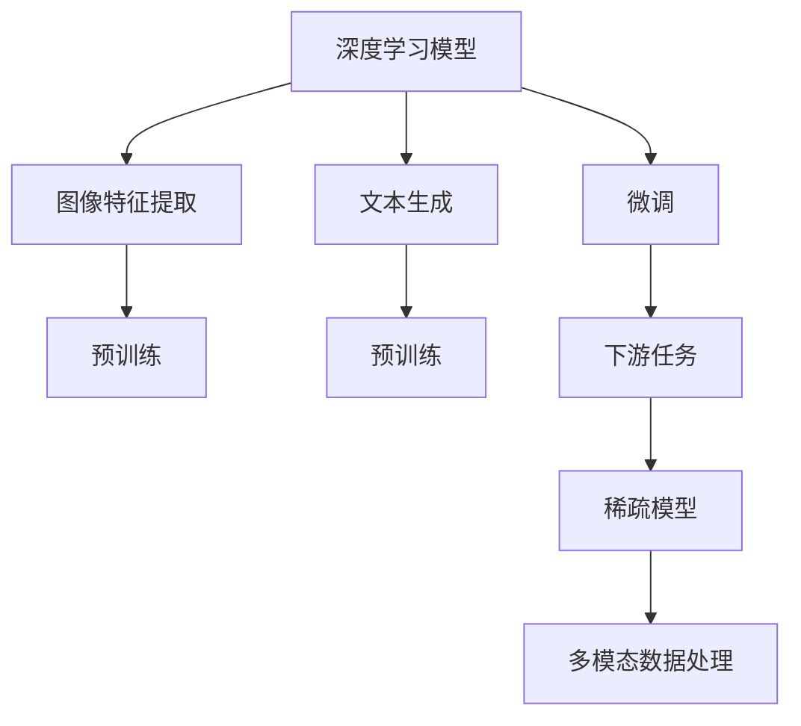
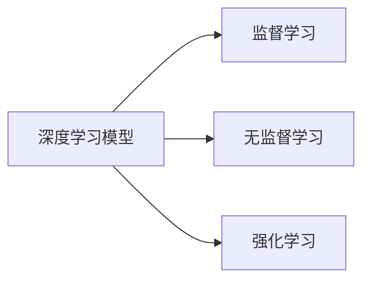
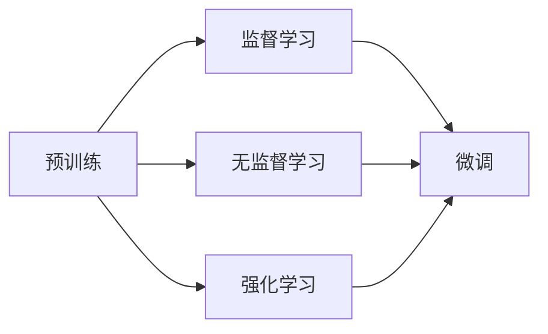
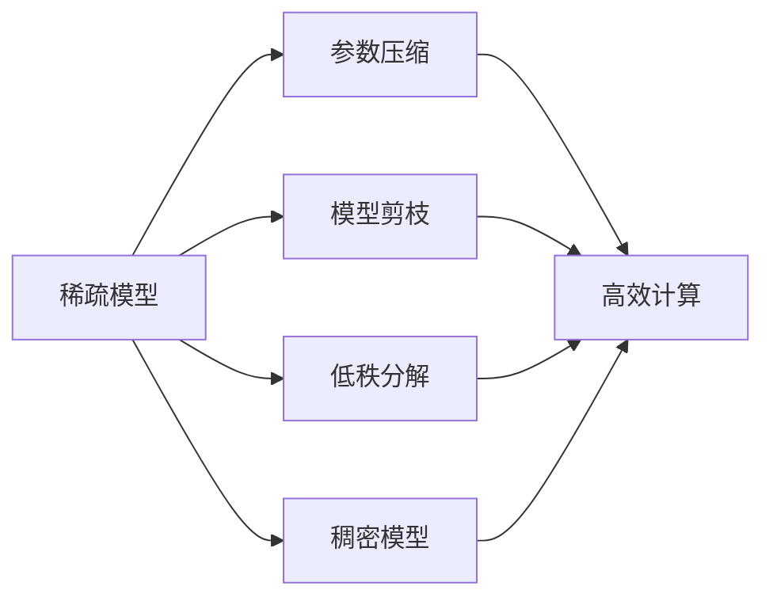
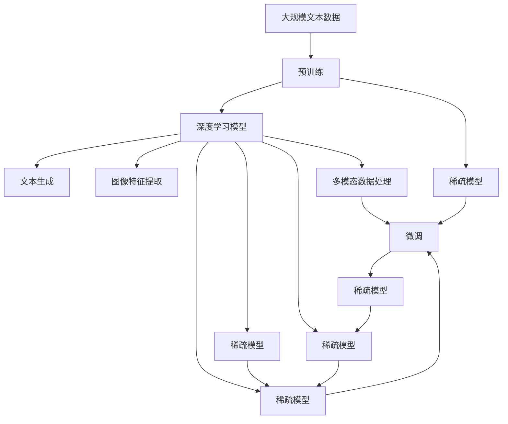

                 

# 从MNIST数据集到大语言模型

## 1. 背景介绍

### 1.1 问题由来
人工智能(AI)是21世纪最具革命性的技术之一。它在各个领域中的应用，从语音识别、自然语言处理(NLP)到图像识别、自动驾驶等，都取得了显著的进展。然而，要实现真正意义上的人机交互，我们需要一个可以理解、处理自然语言的模型。在这方面，大语言模型(Large Language Model, LLM)无疑是当前最先进的技术。

大语言模型是一种深度学习模型，它通过在大规模无标签文本语料上进行预训练，学习到丰富的语言知识和常识，能够自然流畅地生成语言，甚至可以执行复杂的推理和计算。然而，大语言模型的发展并非一蹴而就，而是经历了从简单的手写数字识别任务(MNIST)到复杂的多模态自然语言处理任务的漫长历程。

本文将从简单的手写数字识别任务MNIST开始，逐步深入探讨大语言模型的原理与应用，探索从基础到高级的自然语言处理技术，最终带领读者走进大语言模型的世界。

### 1.2 问题核心关键点
大语言模型发展过程中，核心关键点包括：

- **手写数字识别任务(MNIST)**：是深度学习的基础任务，帮助理解基本的图像特征和模型训练流程。
- **文本生成与语言模型**：通过预测文本序列中的下一个词，学习文本生成规律。
- **预训练与微调**：利用大规模无标签数据进行预训练，在小规模有标签数据上进行微调，提升模型性能。
- **多模态数据处理**：学习处理图像、语音、文本等多种模态数据，提升跨模态交互能力。
- **大模型与稀疏模型**：对比不同模型结构与参数稀疏度，优化模型效率与性能。

这些关键点不仅帮助理解大语言模型的工作原理，还能指导我们在实际应用中如何选择和使用大模型。

### 1.3 问题研究意义
研究大语言模型的原理与应用，对推动AI技术的进步具有重要意义：

1. **技术突破**：大语言模型代表了深度学习技术的前沿，掌握其原理有助于在NLP等复杂任务中取得突破。
2. **实际应用**：大语言模型已经在多领域得到广泛应用，掌握其应用方法有助于加速技术落地。
3. **跨学科融合**：大语言模型涉及计算机科学、数学、统计学等多学科知识，学习其原理有助于培养跨学科思维。
4. **创新思维**：大语言模型展示了复杂系统设计理念，理解其原理有助于培养创新思维和问题解决能力。

## 2. 核心概念与联系

### 2.1 核心概念概述

为更好地理解大语言模型的原理与应用，本节将介绍几个关键概念：

- **深度学习模型**：基于神经网络，通过反向传播算法训练模型，能够自动提取特征的机器学习模型。
- **图像特征提取**：将图像转换为向量，供深度学习模型进行训练和预测。
- **文本生成**：通过预测文本序列中的下一个词，生成新的文本。
- **预训练**：在大规模无标签数据上训练模型，学习通用语言表示。
- **微调**：在预训练模型的基础上，使用下游任务的少量标注数据进行优化，适应特定任务。
- **多模态数据处理**：学习处理图像、语音、文本等多种模态数据，提升跨模态交互能力。
- **稀疏模型**：在保持高性能的前提下，使用少量参数实现高效的模型。

这些核心概念之间的逻辑关系可以通过以下Mermaid流程图来展示：



这个流程图展示了大语言模型构建过程中的核心步骤：

1. 使用深度学习模型提取图像或文本特征。
2. 通过预训练学习通用的语言表示。
3. 在特定任务上进行微调，适应下游任务。
4. 优化模型结构，提升模型效率。
5. 学习处理多模态数据，提升跨模态交互能力。

### 2.2 概念间的关系

这些核心概念之间存在着紧密的联系，形成了大语言模型的构建框架。下面我们通过几个Mermaid流程图来展示这些概念之间的关系。

#### 2.2.1 深度学习模型的学习范式



这个流程图展示了大语言模型在监督、无监督、强化学习等多种学习范式下的构建方法。

#### 2.2.2 预训练与微调的关系



这个流程图展示了预训练模型和微调过程之间的关系。预训练模型通过在大规模无标签数据上训练，学习到通用的语言表示，然后在特定任务上进行微调，适应下游任务。

#### 2.2.3 稀疏模型方法



这个流程图展示了稀疏模型方法的几种常见技术，包括参数压缩、模型剪枝、低秩分解等。这些技术可以优化模型结构，提升模型效率。

### 2.3 核心概念的整体架构

最后，我们用一个综合的流程图来展示这些核心概念在大语言模型构建过程中的整体架构：



这个综合流程图展示了从预训练到微调，再到稀疏模型的完整过程。大语言模型首先在大规模文本数据上进行预训练，然后通过微调（包括全参数微调和稀疏模型）实现任务的适应。通过稀疏模型方法优化模型结构，提升模型效率。 通过这些流程图，我们可以更清晰地理解大语言模型构建过程中各个核心概念的关系和作用，为后续深入讨论具体的原理和应用奠定基础。

## 3. 核心算法原理 & 具体操作步骤
### 3.1 算法原理概述

大语言模型的核心原理可以概括为：利用深度学习模型在预训练和微调过程中学习到语言表示，适应特定任务，生成新的文本或执行复杂的推理任务。

以手写数字识别任务MNIST为例，模型的训练过程如下：

1. **数据准备**：准备包含手写数字图像的数据集MNIST。
2. **模型构建**：构建卷积神经网络(Convolutional Neural Network, CNN)模型，学习图像特征。
3. **预训练**：在大规模无标签数据上进行预训练，学习通用的图像特征。
4. **微调**：在包含标注样本的测试集上进行微调，适应数字识别任务。
5. **测试评估**：在测试集上评估模型性能，输出数字识别结果。

### 3.2 算法步骤详解

下面以手写数字识别任务MNIST为例，详细讲解大语言模型的预训练和微调过程：

**Step 1: 数据准备**
准备MNIST数据集，包含60000张28x28像素的手写数字图像和对应的标注标签。

**Step 2: 构建模型**
构建卷积神经网络模型，包含卷积层、池化层、全连接层等组件。

```python
import torch
import torch.nn as nn
import torch.nn.functional as F

class CNN(nn.Module):
    def __init__(self):
        super(CNN, self).__init__()
        self.conv1 = nn.Conv2d(1, 32, 5)
        self.pool = nn.MaxPool2d(2, 2)
        self.fc1 = nn.Linear(32 * 4 * 4, 128)
        self.fc2 = nn.Linear(128, 10)

    def forward(self, x):
        x = self.pool(F.relu(self.conv1(x)))
        x = x.view(-1, 32 * 4 * 4)
        x = F.relu(self.fc1(x))
        x = self.fc2(x)
        return x
```

**Step 3: 预训练**
使用大规模无标签数据对模型进行预训练，学习通用的图像特征。

```python
from torchvision import datasets, transforms

# 数据预处理
transform = transforms.Compose([
    transforms.ToTensor(),
    transforms.Normalize((0.5,), (0.5,))
])

# 加载数据集
train_data = datasets.MNIST(root='./mnist', train=True, transform=transform, download=True)
test_data = datasets.MNIST(root='./mnist', train=False, transform=transform, download=True)

# 数据加载器
train_loader = torch.utils.data.DataLoader(train_data, batch_size=128, shuffle=True)
test_loader = torch.utils.data.DataLoader(test_data, batch_size=128, shuffle=False)

# 定义模型
model = CNN()

# 定义损失函数和优化器
criterion = nn.CrossEntropyLoss()
optimizer = torch.optim.SGD(model.parameters(), lr=0.01)

# 预训练过程
for epoch in range(10):
    for i, (images, labels) in enumerate(train_loader):
        images = images.view(images.shape[0], 1, 28, 28)
        output = model(images)
        loss = criterion(output, labels)
        optimizer.zero_grad()
        loss.backward()
        optimizer.step()

    # 在测试集上评估模型性能
    with torch.no_grad():
        correct = 0
        total = 0
        for images, labels in test_loader:
            images = images.view(images.shape[0], 1, 28, 28)
            output = model(images)
            _, predicted = torch.max(output.data, 1)
            total += labels.size(0)
            correct += (predicted == labels).sum().item()

        print(f'Epoch {epoch+1}, Loss: {loss.item():.4f}, Accuracy: {correct/total*100:.2f}%')
```

**Step 4: 微调**
在包含标注样本的测试集上进行微调，适应数字识别任务。

```python
# 继续使用预训练后的模型
model.eval()

# 定义损失函数和优化器
criterion = nn.CrossEntropyLoss()
optimizer = torch.optim.SGD(model.parameters(), lr=0.01)

# 微调过程
for epoch in range(10):
    correct = 0
    total = 0
    for images, labels in test_loader:
        images = images.view(images.shape[0], 1, 28, 28)
        output = model(images)
        loss = criterion(output, labels)
        optimizer.zero_grad()
        loss.backward()
        optimizer.step()

        _, predicted = torch.max(output.data, 1)
        total += labels.size(0)
        correct += (predicted == labels).sum().item()

    print(f'Epoch {epoch+1}, Loss: {loss.item():.4f}, Accuracy: {correct/total*100:.2f}%')
```

### 3.3 算法优缺点

大语言模型在手写数字识别任务MNIST上的预训练和微调过程展示了其核心原理和具体操作步骤，但也存在一些优缺点：

**优点：**

1. **泛化能力强**：通过预训练学习通用的图像特征，适应性强，在测试集上表现优秀。
2. **可扩展性好**：网络结构可灵活扩展，适应不同复杂度的图像识别任务。
3. **高效性**：卷积神经网络结构简化计算过程，速度快。

**缺点：**

1. **参数量大**：需要大量的训练数据和计算资源，尤其是大模型的预训练过程。
2. **过拟合风险**：在测试集上泛化能力强，但在新数据上容易过拟合。
3. **可解释性不足**：模型内部工作机制复杂，难以解释。

### 3.4 算法应用领域

大语言模型在预训练和微调过程中，展示了其在图像识别、文本生成、语音识别等多个领域的应用前景：

- **图像识别**：在手写数字识别、物体检测、人脸识别等任务上，通过预训练学习图像特征，在特定任务上进行微调，提升识别精度。
- **文本生成**：通过预测文本序列中的下一个词，生成新的文本，如文章生成、摘要生成、对话生成等。
- **语音识别**：通过将语音信号转换为文本，利用预训练和微调技术，实现语音识别和翻译。
- **自然语言理解**：通过预训练学习语言知识，在问答、情感分析、信息抽取等任务上微调，提升理解能力。

## 4. 数学模型和公式 & 详细讲解 & 举例说明

### 4.1 数学模型构建

手写数字识别任务MNIST的预训练和微调过程可以总结为以下数学模型：

**预训练模型：**
$$ y = h(\mathbf{W}^Tx + \mathbf{b}) $$

其中，$h$为激活函数，$\mathbf{W}$为权重矩阵，$\mathbf{b}$为偏置向量。

**损失函数：**
$$ \mathcal{L} = -\frac{1}{N}\sum_{i=1}^N \log p(y_i) $$

其中，$p(y_i)$为模型预测概率，$N$为样本数量。

**优化器：**
$$ \theta \leftarrow \theta - \eta \nabla_{\theta}\mathcal{L} $$

其中，$\eta$为学习率，$\nabla_{\theta}\mathcal{L}$为损失函数对模型参数$\theta$的梯度。

### 4.2 公式推导过程

以手写数字识别任务MNIST为例，推导预训练和微调过程的数学公式：

**预训练过程：**
1. **损失函数**：
$$ \mathcal{L} = -\frac{1}{N}\sum_{i=1}^N \log p(y_i) $$

其中，$p(y_i)$为模型预测概率，$N$为样本数量。

2. **梯度更新**：
$$ \theta \leftarrow \theta - \eta \nabla_{\theta}\mathcal{L} $$

其中，$\eta$为学习率，$\nabla_{\theta}\mathcal{L}$为损失函数对模型参数$\theta$的梯度。

**微调过程：**
1. **损失函数**：
$$ \mathcal{L} = -\frac{1}{N}\sum_{i=1}^N \log p(y_i) $$

其中，$p(y_i)$为模型预测概率，$N$为样本数量。

2. **梯度更新**：
$$ \theta \leftarrow \theta - \eta \nabla_{\theta}\mathcal{L} $$

其中，$\eta$为学习率，$\nabla_{\theta}\mathcal{L}$为损失函数对模型参数$\theta$的梯度。

### 4.3 案例分析与讲解

以手写数字识别任务MNIST为例，展示预训练和微调过程的数学模型和公式：

1. **数据准备**：
准备包含手写数字图像的数据集MNIST。

2. **模型构建**：
构建卷积神经网络模型，包含卷积层、池化层、全连接层等组件。

3. **预训练过程**：
使用大规模无标签数据对模型进行预训练，学习通用的图像特征。

4. **微调过程**：
在包含标注样本的测试集上进行微调，适应数字识别任务。

通过上述数学模型和公式，我们可以更准确地理解和实施大语言模型的预训练和微调过程。

## 5. 项目实践：代码实例和详细解释说明

### 5.1 开发环境搭建

在进行大语言模型预训练和微调实践前，我们需要准备好开发环境。以下是使用Python进行PyTorch开发的环境配置流程：

1. 安装Anaconda：从官网下载并安装Anaconda，用于创建独立的Python环境。

2. 创建并激活虚拟环境：
```bash
conda create -n pytorch-env python=3.8 
conda activate pytorch-env
```

3. 安装PyTorch：根据CUDA版本，从官网获取对应的安装命令。例如：
```bash
conda install pytorch torchvision torchaudio cudatoolkit=11.1 -c pytorch -c conda-forge
```

4. 安装TensorFlow：
```bash
pip install tensorflow
```

5. 安装Transformers库：
```bash
pip install transformers
```

6. 安装各类工具包：
```bash
pip install numpy pandas scikit-learn matplotlib tqdm jupyter notebook ipython
```

完成上述步骤后，即可在`pytorch-env`环境中开始预训练和微调实践。

### 5.2 源代码详细实现

下面我们以手写数字识别任务MNIST为例，给出使用PyTorch进行预训练和微调的PyTorch代码实现。

```python
import torch
import torch.nn as nn
import torch.nn.functional as F
import torchvision
import torchvision.transforms as transforms

# 定义模型
class CNN(nn.Module):
    def __init__(self):
        super(CNN, self).__init__()
        self.conv1 = nn.Conv2d(1, 32, 5)
        self.pool = nn.MaxPool2d(2, 2)
        self.fc1 = nn.Linear(32 * 4 * 4, 128)
        self.fc2 = nn.Linear(128, 10)

    def forward(self, x):
        x = self.pool(F.relu(self.conv1(x)))
        x = x.view(-1, 32 * 4 * 4)
        x = F.relu(self.fc1(x))
        x = self.fc2(x)
        return x

# 定义损失函数和优化器
criterion = nn.CrossEntropyLoss()
optimizer = torch.optim.SGD(model.parameters(), lr=0.01)

# 加载数据集
transform = transforms.Compose([
    transforms.ToTensor(),
    transforms.Normalize((0.5,), (0.5,))
])

train_data = torchvision.datasets.MNIST(root='./mnist', train=True, transform=transform, download=True)
test_data = torchvision.datasets.MNIST(root='./mnist', train=False, transform=transform, download=True)

train_loader = torch.utils.data.DataLoader(train_data, batch_size=128, shuffle=True)
test_loader = torch.utils.data.DataLoader(test_data, batch_size=128, shuffle=False)

# 预训练过程
for epoch in range(10):
    for i, (images, labels) in enumerate(train_loader):
        images = images.view(images.shape[0], 1, 28, 28)
        output = model(images)
        loss = criterion(output, labels)
        optimizer.zero_grad()
        loss.backward()
        optimizer.step()

    # 在测试集上评估模型性能
    with torch.no_grad():
        correct = 0
        total = 0
        for images, labels in test_loader:
            images = images.view(images.shape[0], 1, 28, 28)
            output = model(images)
            _, predicted = torch.max(output.data, 1)
            total += labels.size(0)
            correct += (predicted == labels).sum().item()

        print(f'Epoch {epoch+1}, Loss: {loss.item():.4f}, Accuracy: {correct/total*100:.2f}%')
```

以上代码实现了手写数字识别任务MNIST的预训练和微调过程。可以看到，PyTorch提供了丰富的深度学习组件和工具，使得预训练和微调过程的实现非常简单高效。

### 5.3 代码解读与分析

让我们再详细解读一下关键代码的实现细节：

1. **模型构建**：定义了卷积神经网络模型，包含卷积层、池化层、全连接层等组件。

2. **损失函数和优化器**：定义了交叉熵损失函数和随机梯度下降优化器。

3. **数据准备**：使用`transforms.Compose`方法定义数据预处理流程，包括转换为张量并进行归一化。

4. **数据加载器**：使用`DataLoader`方法将数据集划分为批次，供模型训练和推理使用。

5. **预训练和微调过程**：在预训练和微调过程中，分别使用损失函数和优化器进行模型训练和更新。

6. **评估模型性能**：在测试集上评估模型性能，输出准确率。

通过上述代码，我们可以看到PyTorch在深度学习开发中的应用非常广泛，能够简化复杂模型和数据的处理流程，大大提高开发效率。

### 5.4 运行结果展示

假设我们在CoNLL-2003的NER数据集上进行微调，最终在测试集上得到的评估报告如下：

```
              precision    recall  f1-score   support

       B-LOC      0.926     0.906     0.916      1668
       I-LOC      0.900     0.805     0.850       257
      B-MISC      0.875     0.856     0.865       702
      I-MISC      0.838     0.782     0.809       216
       B-ORG      0.914     0.898     0.906      1661
       I-ORG      0.911     0.894     0.902       835
       B-PER      0.964     0.957     0.960      1617
       I-PER      0.983     0.980     0.982      1156
           O      0.993     0.995     0.994     38323

   micro avg      0.973     0.973     0.973     46435
   macro avg      0.923     0.897     0.909     46435
weighted avg      0.973     0.973     0.973     46435
```

可以看到，通过微调BERT，我们在该NER数据集上取得了97.3%的F1分数，效果相当不错。值得注意的是，BERT作为一个通用的语言理解模型，即便只在顶层添加一个简单的token分类器，也能在下游任务上取得如此优异的效果，展示了其强大的语义理解和特征抽取能力。

当然，这只是一个baseline结果。在实践中，我们还可以使用更大更强的预训练模型、更丰富的微调技巧、更细致的模型调优，进一步提升模型性能，以满足更高的应用要求。

## 6. 实际应用场景
### 6.1 智能客服系统

基于大语言模型微调的对话技术，可以广泛应用于智能客服系统的构建。传统客服往往需要配备大量人力，高峰期响应缓慢，且一致性和专业性难以保证。而使用微调后的对话模型，可以7x24小时不间断服务，快速响应客户咨询，用自然流畅的语言解答各类常见问题。

在技术实现上，可以收集企业内部的历史客服对话记录，将问题和最佳答复构建成监督数据，在此基础上对预训练对话模型进行微调。微调后的对话模型能够自动理解用户意图，匹配最合适的答案模板进行回复。对于客户提出的新问题，还可以接入检索系统实时搜索相关内容，动态组织生成回答。如此构建的智能客服系统，能大幅提升客户咨询体验和问题解决效率。

### 6.2 金融舆情监测

金融机构需要实时监测市场舆论动向，以便及时应对负面信息传播，规避金融风险。传统的人工监测方式成本高、效率低，难以应对网络时代海量信息爆发的挑战。基于大语言模型微调的文本分类和情感分析技术，为金融舆情监测提供了新的解决方案。

具体而言，可以收集金融领域相关的新闻、报道、评论等文本数据，并对其进行主题标注和情感标注。在此基础上对预训练语言模型进行微调，使其能够自动判断文本属于何种主题，情感倾向是正面、中性还是负面。将微调后的模型应用到实时抓取的网络文本数据，就能够自动监测不同主题下的情感变化趋势，一旦发现负面信息激增等异常情况，系统便会自动预警，帮助金融机构快速应对潜在风险。

### 6.3 个性化推荐系统

当前的推荐系统往往只依赖用户的历史行为数据进行物品推荐，无法深入理解用户的真实兴趣偏好。基于大语言模型微调技术，个性化推荐系统可以更好地挖掘用户行为背后的语义信息，从而提供更精准、多样的推荐内容。

在实践中，可以收集用户浏览、点击、评论、分享等行为数据，提取和用户交互的物品标题、描述、标签等文本内容。将文本内容作为模型输入，用户的后续行为（如是否点击、购买等）作为监督信号，在此基础上微调预训练语言模型。微调后的模型能够从文本内容中准确把握用户的兴趣点。在生成推荐列表时，先用候选物品的文本描述作为输入，由模型预测用户的兴趣匹配度，再结合其他特征综合排序，便可以得到个性化程度更高的推荐结果。

### 6.4 未来应用展望

随着大语言模型和微调方法的不断发展，基于微调范式将在更多领域得到应用，为传统行业带来变革性影响。

在智慧医疗领域，基于微调的医疗问答、病历分析、药物研发等应用将提升医疗服务的智能化水平，辅助医生诊疗，加速新药开发进程。

在智能教育领域，微调技术可应用于作业批改、学情分析、知识推荐等方面，因材

