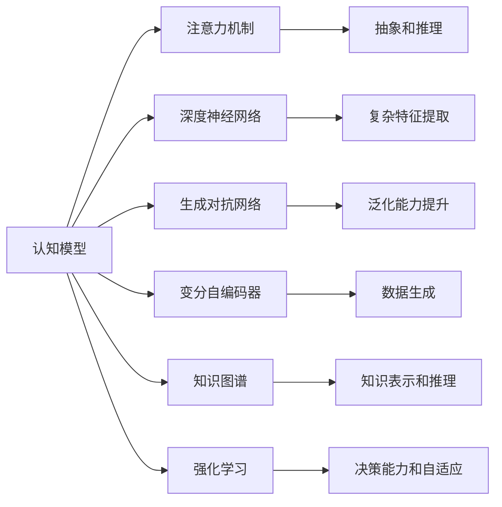
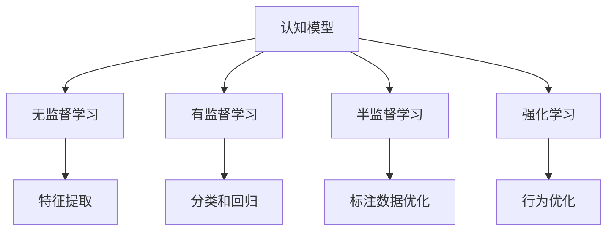
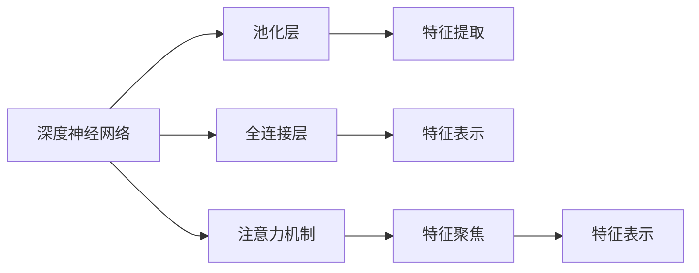
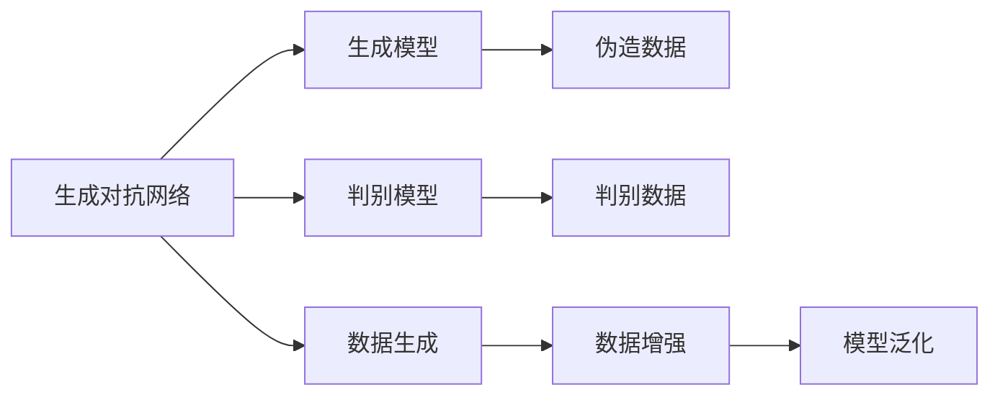
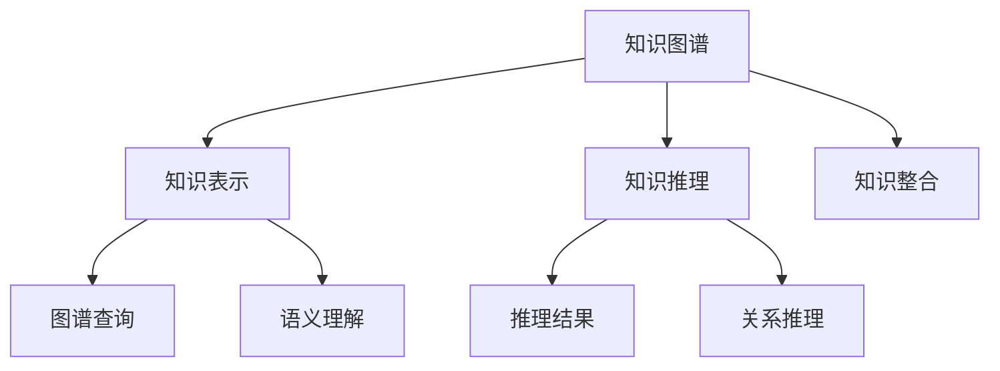
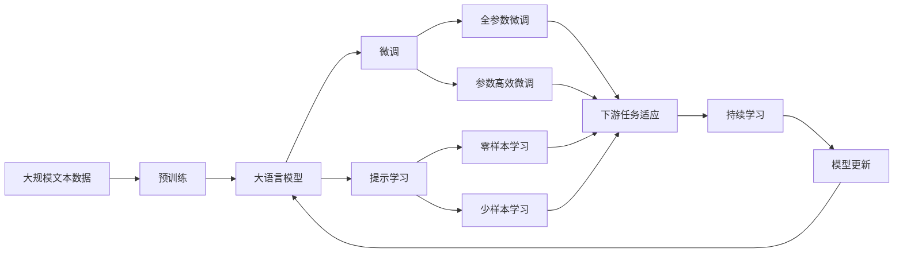

                 

# 从浅薄到深刻的认知转变

## 1. 背景介绍

### 1.1 问题由来
在人工智能领域，认知模型的发展经历了从浅薄到深刻的过程。早期的人工智能系统主要依赖浅层特征提取和简单的统计模型，难以处理复杂的人类认知任务。而随着深度学习技术的发展，尤其是卷积神经网络（CNN）和循环神经网络（RNN）的提出，认知模型开始具备了一定的深度学习能力，能够在图像、语音等模态中取得显著的进步。

然而，尽管如此，这些认知模型仍面临诸多挑战。首先是数据驱动的特征提取方式，即依赖大量标注数据进行模型训练，这不仅耗时耗力，而且数据本身的偏差可能导致模型学习到的特征具有局限性。其次是模型的抽象能力，虽然能够处理某些高层次的抽象任务，但在处理语言、推理、决策等高度复杂的认知任务时，仍显得力不从心。

面对这些挑战，研究人员逐渐意识到，单一的浅层或深层特征提取方法不足以应对现实世界中的复杂认知任务。为了提升认知模型的深度和广度，需要引入更高级的认知模型，特别是那些能够处理高级抽象和复杂推理任务的模型。

### 1.2 问题核心关键点
近年来，认知模型的研究已经取得了显著进展，特别是在认知深度和广度上。研究者们探索了多种高级认知模型，包括但不限于：

- **注意力机制（Attention Mechanism）**：用于增强模型的注意力能力，使其能够聚焦于输入中最相关的部分，提升模型的抽象和推理能力。
- **深度神经网络（Deep Neural Networks）**：通过增加模型的深度，使其能够处理更复杂的抽象任务。
- **生成对抗网络（Generative Adversarial Networks, GANs）**：通过生成模型和判别模型之间的对抗训练，生成逼真的数据和图像，提升模型的泛化能力。
- **变分自编码器（Variational Autoencoders, VAEs）**：通过生成模型对数据进行建模和重构，提升模型的表示能力和数据生成能力。
- **知识图谱（Knowledge Graph）**：用于知识表示和推理，提升模型的推理能力和知识迁移能力。
- **强化学习（Reinforcement Learning, RL）**：通过与环境交互，增强模型的决策能力和自适应能力。

这些认知模型在不同的应用场景中都展示了其独特的优势，但也存在各自的局限性。如何在保持模型深度的同时提升其广度，成为认知模型发展的一个核心问题。

### 1.3 问题研究意义
研究高级认知模型，对于推动人工智能技术的进一步发展，具有重要意义：

1. **提升认知能力**：高级认知模型能够处理更复杂的抽象和推理任务，提升认知系统的综合能力。
2. **降低标注成本**：通过引入高级认知模型，能够利用更少的标注数据进行模型训练，降低人工标注成本。
3. **增强泛化能力**：高级认知模型具有更强的泛化能力，能够在不同的场景和任务中表现出良好的适应性。
4. **提高数据生成能力**：通过生成对抗网络和变分自编码器等技术，模型能够生成高质量的数据，提升数据的丰富性和多样性。
5. **增强知识表示和推理**：知识图谱和推理模型能够帮助模型更好地理解和运用知识，提升推理能力和知识迁移能力。
6. **促进人机协同**：高级认知模型能够更好地理解人类行为和需求，促进人机协同，提高系统性能和用户体验。

## 2. 核心概念与联系

### 2.1 核心概念概述

为更好地理解高级认知模型的发展，本节将介绍几个密切相关的核心概念：

- **认知模型（Cognitive Model）**：用于模拟人类认知过程的计算模型，具有学习、记忆、推理等高级认知功能。
- **注意力机制（Attention Mechanism）**：用于增强模型的注意力能力，使其能够聚焦于输入中最相关的部分，提升模型的抽象和推理能力。
- **深度神经网络（Deep Neural Networks）**：通过增加模型的深度，使其能够处理更复杂的抽象任务。
- **生成对抗网络（Generative Adversarial Networks, GANs）**：通过生成模型和判别模型之间的对抗训练，生成逼真的数据和图像，提升模型的泛化能力。
- **变分自编码器（Variational Autoencoders, VAEs）**：通过生成模型对数据进行建模和重构，提升模型的表示能力和数据生成能力。
- **知识图谱（Knowledge Graph）**：用于知识表示和推理，提升模型的推理能力和知识迁移能力。
- **强化学习（Reinforcement Learning, RL）**：通过与环境交互，增强模型的决策能力和自适应能力。

这些核心概念之间的逻辑关系可以通过以下Mermaid流程图来展示：



这个流程图展示了几类高级认知模型之间的关系：

1. **注意力机制**：增强模型的抽象和推理能力。
2. **深度神经网络**：增加模型的深度，处理更复杂的特征。
3. **生成对抗网络**：提升模型的泛化能力和数据生成能力。
4. **变分自编码器**：提升模型的表示能力和数据生成能力。
5. **知识图谱**：增强模型的知识表示和推理能力。
6. **强化学习**：增强模型的决策能力和自适应能力。

这些概念共同构成了高级认知模型的框架，使其能够更好地应对复杂的人类认知任务。通过理解这些核心概念，我们可以更好地把握认知模型的工作原理和优化方向。

### 2.2 概念间的关系

这些核心概念之间存在着紧密的联系，形成了高级认知模型的完整生态系统。下面我通过几个Mermaid流程图来展示这些概念之间的关系。

#### 2.2.1 认知模型的学习范式



这个流程图展示了认知模型的几种主要学习范式：

1. **无监督学习**：通过未标注的数据进行特征提取，提升模型的泛化能力。
2. **有监督学习**：通过标注数据进行分类和回归任务，提升模型的准确性。
3. **半监督学习**：利用少量标注数据和大量未标注数据，提升模型的泛化能力。
4. **强化学习**：通过与环境的交互，优化模型的行为和决策。

#### 2.2.2 注意力机制与深度神经网络的关系



这个流程图展示了注意力机制与深度神经网络之间的关系：

1. **深度神经网络**：通过增加深度，提取复杂特征。
2. **注意力机制**：聚焦于输入中最相关的部分，提升特征表示能力。

#### 2.2.3 生成对抗网络与变分自编码器之间的关系



这个流程图展示了生成对抗网络与变分自编码器之间的关系：

1. **生成对抗网络**：通过生成模型和判别模型的对抗训练，生成逼真的数据和图像。
2. **变分自编码器**：通过生成模型对数据进行建模和重构，提升模型的表示能力和数据生成能力。

#### 2.2.4 知识图谱与推理模型之间的关系



这个流程图展示了知识图谱与推理模型之间的关系：

1. **知识图谱**：用于知识表示和推理，提升模型的推理能力和知识迁移能力。
2. **推理模型**：通过图谱查询和关系推理，提升模型的推理能力。

### 2.3 核心概念的整体架构

最后，我们用一个综合的流程图来展示这些核心概念在大语言模型微调过程中的整体架构：



这个综合流程图展示了从预训练到微调，再到持续学习的完整过程。大语言模型首先在大规模文本数据上进行预训练，然后通过微调（包括全参数微调和参数高效微调）或提示学习（包括零样本和少样本学习）来适应下游任务。最后，通过持续学习技术，模型可以不断更新和适应新的任务和数据。

通过这些流程图，我们可以更清晰地理解高级认知模型的学习过程和各个组件之间的关系。

## 3. 核心算法原理 & 具体操作步骤
### 3.1 算法原理概述

高级认知模型的核心原理之一是**深度学习**。深度学习通过多层次的神经网络结构，逐步提取和抽象输入数据中的高级特征，从而实现复杂认知任务的求解。深度学习的核心在于**反向传播算法**（Backpropagation），它能够通过梯度下降等优化算法，更新模型的参数，最小化损失函数。

在高级认知模型中，注意力机制是一个重要的组成部分。注意力机制通过计算输入数据中不同部分的权重，聚焦于最相关的部分，提升模型的抽象和推理能力。生成对抗网络和变分自编码器等生成模型，则通过生成数据和重构数据的双向训练，提升模型的泛化能力和数据生成能力。知识图谱和推理模型则用于增强模型的知识表示和推理能力，使其能够更好地理解和应用知识。

### 3.2 算法步骤详解

高级认知模型的训练通常包括以下几个关键步骤：

**Step 1: 准备数据集**
- 收集和预处理大规模数据集，如图片、文本、音频等，构建数据管道。
- 使用无监督学习、半监督学习和有监督学习等方法进行特征提取和模型训练。

**Step 2: 设计模型架构**
- 选择合适的深度神经网络架构，如CNN、RNN、Transformer等。
- 在模型中引入注意力机制、生成对抗网络和变分自编码器等技术。
- 设计知识图谱和推理模型，增强模型的知识表示和推理能力。

**Step 3: 设置超参数**
- 选择合适的优化算法及其参数，如Adam、SGD等。
- 设置学习率、批大小、迭代轮数等超参数。
- 应用正则化技术，如L2正则、Dropout等。

**Step 4: 执行训练**
- 将数据集分批次输入模型，前向传播计算损失函数。
- 反向传播计算参数梯度，根据设定的优化算法和学习率更新模型参数。
- 周期性在验证集上评估模型性能，根据性能指标决定是否触发 Early Stopping。
- 重复上述步骤直到满足预设的迭代轮数或 Early Stopping 条件。

**Step 5: 评估和部署**
- 在测试集上评估训练后的模型，对比训练前后的性能提升。
- 使用训练后的模型对新样本进行推理预测，集成到实际的应用系统中。
- 持续收集新的数据，定期重新训练模型，以适应数据分布的变化。

以上是高级认知模型训练的一般流程。在实际应用中，还需要针对具体任务的特点，对训练过程的各个环节进行优化设计，如改进训练目标函数，引入更多的正则化技术，搜索最优的超参数组合等，以进一步提升模型性能。

### 3.3 算法优缺点

高级认知模型具有以下优点：

1. **强大的抽象能力**：通过多层次的神经网络结构，能够处理复杂抽象任务。
2. **泛化能力**：通过生成对抗网络和变分自编码器等技术，模型具有较强的泛化能力。
3. **知识表示和推理**：通过知识图谱和推理模型，模型能够更好地理解和应用知识。
4. **自适应能力**：通过强化学习等技术，模型能够根据环境变化进行自适应调整。

同时，高级认知模型也存在一些局限性：

1. **计算资源消耗大**：由于深度神经网络结构复杂，计算资源消耗较大，需要高性能的GPU/TPU设备。
2. **模型训练时间长**：大规模数据的训练需要较长时间，且需要较多的标注数据。
3. **数据驱动的偏见**：模型训练依赖标注数据，数据本身的偏见可能导致模型学习到有偏见的特征。
4. **可解释性不足**：深度学习模型通常缺乏可解释性，难以对其内部决策过程进行理解和调试。

尽管存在这些局限性，但就目前而言，高级认知模型仍然是大规模复杂认知任务处理的重要工具。未来相关研究的重点在于如何进一步降低计算资源消耗，提高模型的可解释性，以及解决数据驱动的偏见问题。

### 3.4 算法应用领域

高级认知模型已经在多个领域展示了其强大的应用能力，如计算机视觉、自然语言处理、语音识别等。以下是几个典型的应用场景：

- **计算机视觉**：通过卷积神经网络（CNN）对图像进行分类、检测、分割等任务。
- **自然语言处理**：通过注意力机制、深度神经网络等技术进行文本分类、情感分析、机器翻译等任务。
- **语音识别**：通过循环神经网络（RNN）对语音进行识别和转换，提升语音交互的准确性和自然度。
- **游戏AI**：通过强化学习等技术开发游戏AI，提升游戏的智能水平和玩家体验。
- **推荐系统**：通过生成对抗网络等技术，提升推荐系统的个性化和多样化。
- **医学影像分析**：通过知识图谱等技术，提升医学影像的诊断和分析能力。

这些应用场景展示了高级认知模型在现实世界中的强大潜力，相信未来将有更多领域的创新应用，带来更深远的社会影响。

## 4. 数学模型和公式 & 详细讲解 & 举例说明

### 4.1 数学模型构建

高级认知模型的数学模型通常采用深度神经网络架构，通过反向传播算法进行训练。这里我们使用卷积神经网络（CNN）进行示例。

记输入数据为 $\mathbf{x} \in \mathbb{R}^{d_1}$，模型参数为 $\theta$，输出数据为 $\mathbf{y} \in \mathbb{R}^{d_2}$。模型的前向传播过程为：

$$
\mathbf{h} = \mathbf{W}_1 \mathbf{x} + \mathbf{b}_1 \\
\mathbf{y} = \mathbf{W}_2 \mathbf{h} + \mathbf{b}_2
$$

其中 $\mathbf{W}_1, \mathbf{W}_2$ 为权重矩阵，$\mathbf{b}_1, \mathbf{b}_2$ 为偏置向量。模型的损失函数为：

$$
\mathcal{L}(\theta) = \frac{1}{N} \sum_{i=1}^N \ell(\mathbf{y}_i, \hat{\mathbf{y}}_i)
$$

其中 $\ell$ 为损失函数，$\hat{\mathbf{y}}_i$ 为模型的预测输出，$\mathbf{y}_i$ 为真实的标签。

### 4.2 公式推导过程

以下是CNN模型的前向传播和反向传播过程的详细推导：

**前向传播**：

$$
\mathbf{h} = \mathbf{W}_1 \mathbf{x} + \mathbf{b}_1 \\
\mathbf{y} = \mathbf{W}_2 \mathbf{h} + \mathbf{b}_2
$$

**损失函数**：

$$
\mathcal{L}(\theta) = \frac{1}{N} \sum_{i=1}^N \ell(\mathbf{y}_i, \hat{\mathbf{y}}_i)
$$

**梯度计算**：

$$
\frac{\partial \mathcal{L}(\theta)}{\partial \theta} = \frac{1}{N} \sum_{i=1}^N \nabla_{\theta} \ell(\mathbf{y}_i, \hat{\mathbf{y}}_i)
$$

**反向传播**：

$$
\frac{\partial \mathcal{L}(\theta)}{\partial \mathbf{h}} = \frac{\partial \mathcal{L}(\theta)}{\partial \mathbf{y}} \cdot \frac{\partial \mathbf{y}}{\partial \mathbf{h}} = \frac{\partial \mathcal{L}(\theta)}{\partial \mathbf{y}} \cdot \mathbf{W}_2^T \\
\frac{\partial \mathcal{L}(\theta)}{\partial \mathbf{x}} = \frac{\partial \mathcal{L}(\theta)}{\partial \mathbf{h}} \cdot \frac{\partial \mathbf{h}}{\partial \mathbf{x}} = \frac{\partial \mathcal{L}(\theta)}{\partial \mathbf{h}} \cdot \mathbf{W}_1^T
$$

通过上述推导，我们得到了CNN模型前向传播和反向传播的公式。这些公式帮助我们理解高级认知模型的基本计算过程和优化方法。

### 4.3 案例分析与讲解

下面我们以计算机视觉中的图像分类任务为例，给出CNN模型的详细实现。

首先，定义输入数据和标签：

```python
import torch
import torch.nn as nn
import torch.optim as optim
import torchvision.transforms as transforms
import torchvision.datasets as datasets

# 定义输入数据和标签
transform = transforms.Compose([
    transforms.ToTensor(),
    transforms.Normalize((0.5, 0.5, 0.5), (0.5, 0.5, 0.5))
])

train_dataset = datasets.CIFAR10(root='./data', train=True, download=True, transform=transform)
test_dataset = datasets.CIFAR10(root='./data', train=False, download=True, transform=transform)

# 定义批处理大小
batch_size = 64

# 定义训练和验证集
train_loader = torch.utils.data.DataLoader(train_dataset, batch_size=batch_size, shuffle=True)
test_loader = torch.utils.data.DataLoader(test_dataset, batch_size=batch_size, shuffle=False)
```

然后，定义模型架构：

```python
class Net(nn.Module):
    def __init__(self):
        super(Net, self).__init__()
        self.conv1 = nn.Conv2d(3, 6, 5)
        self.pool = nn.MaxPool2d(2, 2)
        self.conv2 = nn.Conv2d(6, 16, 5)
        self.fc1 = nn.Linear(16 * 5 * 5, 120)
        self.fc2 = nn.Linear(120, 84)
        self.fc3 = nn.Linear(84, 10)

    def forward(self, x):
        x = self.pool(nn.functional.relu(self.conv1(x)))
        x = self.pool(nn.functional.relu(self.conv2(x)))
        x = x.view(-1, 16 * 5 * 5)
        x = nn.functional.relu(self.fc1(x))
        x = nn.functional.relu(self.fc2(x))
        x = self.fc3(x)
        return x

# 实例化模型
model = Net()
```

接着，定义优化器和损失函数：

```python
# 定义优化器和损失函数
optimizer = optim.SGD(model.parameters(), lr=0.001, momentum=0.9)
loss_fn = nn.CrossEntropyLoss()
```

最后，进行训练和评估：

```python
# 训练和评估过程
for epoch in range(10):
    for i, (inputs, labels) in enumerate(train_loader):
        # 前向传播
        outputs = model(inputs)
        loss = loss_fn(outputs, labels)
        optimizer.zero_grad()
        loss.backward()
        optimizer.step()

    # 评估模型
    with torch.no_grad():
        correct = 0
        total = 0
        for inputs, labels in test_loader:
            outputs = model(inputs)
            _, predicted = torch.max(outputs.data, 1)
            total += labels.size(0)
            correct += (predicted == labels).sum().item()

        print(f'Epoch {epoch+1}, Accuracy: {100 * correct / total:.2f}%')
```

以上就是使用PyTorch实现CNN模型进行图像分类的完整代码。可以看到，通过合理的模型设计、超参数设置和优化器选择，CNN模型能够在计算机视觉任务中取得优秀的性能。

## 5. 项目实践：代码实例和详细解释说明

### 5.1 开发环境搭建

在进行项目实践前，我们需要准备好开发环境。以下是使用Python进行PyTorch开发的环境配置流程：

1. 安装Anaconda：从官网下载并安装Anaconda，用于创建独立的Python环境。

2. 创建并激活虚拟环境：
```bash
conda create -n pytorch-env python=3.8 
conda activate pytorch-env
```

3. 安装PyTorch：根据CUDA版本，从官网获取对应的安装命令。例如：
```bash
conda install pytorch torchvision torchaudio cudatoolkit=11.1 -c pytorch -c conda-forge
```

4. 安装TensorFlow：
```bash
pip install tensorflow
```

5. 安装各类工具包：
```bash
pip install numpy pandas scikit-learn matplotlib tqdm jupyter notebook ipython
```

完成上述步骤后，即可在`pytorch-env`环境中开始项目实践。

### 5.2 源代码详细实现

下面我们以计算机视觉中的图像分类任务为例，给出使用PyTorch实现CNN模型的详细代码。

首先，定义输入数据和标签：

```python
import torch
import torch.nn as nn
import torch.optim as optim
import torchvision.transforms as transforms
import torchvision.datasets as datasets

# 定义输入数据和标签
transform = transforms.Compose([
    transforms.ToTensor(),
    transforms.Normalize((0.5, 0.5, 0.5), (0.5, 0.5, 0.5))
])

train_dataset = datasets.CIFAR10(root='./data', train=True, download=True, transform=transform)
test_dataset = datasets.CIFAR10(root='./data', train=False, download=True, transform=transform)

# 定义批处理大小
batch_size = 64

# 定义训练和验证集
train_loader = torch.utils.data.DataLoader(train_dataset, batch_size=batch_size, shuffle=True)
test_loader = torch.utils.data.DataLoader(test_dataset, batch_size=batch_size, shuffle=False)
```

然后，定义模型架构：

```python
class Net(nn.Module):
    def __init__(self):
        super(Net, self).__init__()
        self.conv1 = nn.Conv2d(3, 6, 5)
        self.pool = nn.MaxPool2d(2, 2)
        self.conv2 = nn.Conv2d(6, 16, 5)
        self.fc1 = nn.Linear(16 * 5 * 5, 120)
        self.fc2 = nn.Linear(120, 84)
        self.fc3 = nn.Linear(84, 10)

    def forward(self, x):
        x = self.pool(nn.functional.relu(self.conv1(x)))
        x = self.pool(nn.functional.relu(self.conv2(x)))
        x = x.view(-1, 16 * 5 * 5)
        x = nn.functional.relu(self.fc1(x))
        x = nn.functional.relu(self.fc2(x))
        x = self.fc3(x)
        return x

# 实例化模型
model = Net()
```

接着，定义优化器和损失函数：

```python
# 定义优化器和损失函数
optimizer = optim.SGD(model.parameters(), lr=0.001, momentum=0.9)
loss_fn = nn.CrossEntropyLoss()
```

最后，进行训练和评估：

```python
# 训练和评估过程
for epoch in range(10):
    for i, (inputs, labels) in enumerate(train_loader):
        # 前向传播
        outputs = model(inputs)
        loss = loss_fn(outputs, labels)
        optimizer.zero_grad()
        loss.backward()
        optimizer.step()

    # 评估模型
    with torch.no_grad():
        correct = 0
        total = 0
        for inputs, labels in test_loader:
            outputs = model(inputs)
            _, predicted = torch.max(outputs.data, 1)
            total += labels.size(0)
            correct += (predicted == labels).sum().item()

        print(f'Epoch {epoch+1}, Accuracy: {100 * correct / total:.2f}%')
```

以上就是使用PyTorch实现CNN模型进行图像分类的完整代码。可以看到，通过合理的模型设计、超参数

