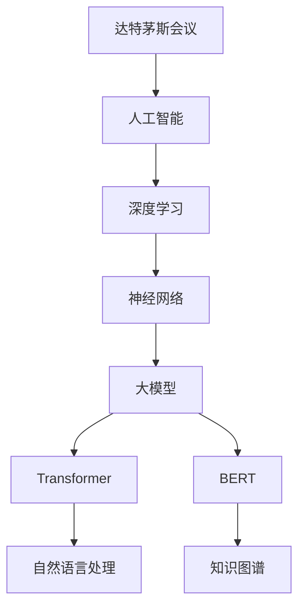
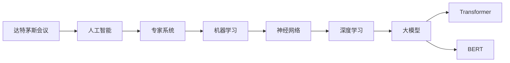
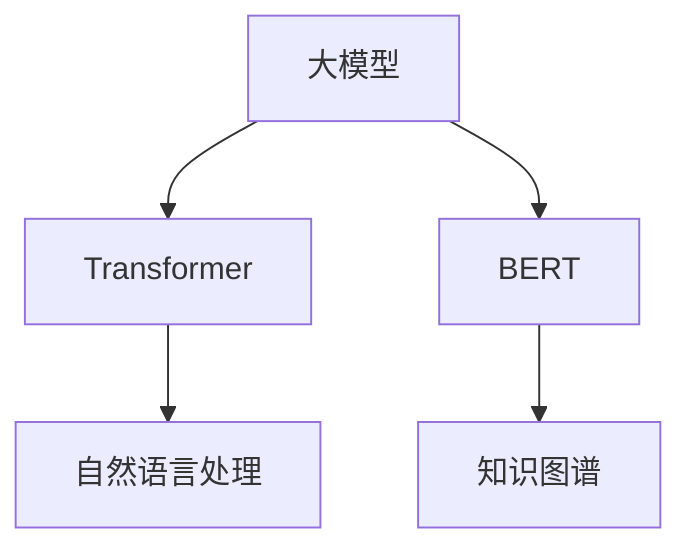
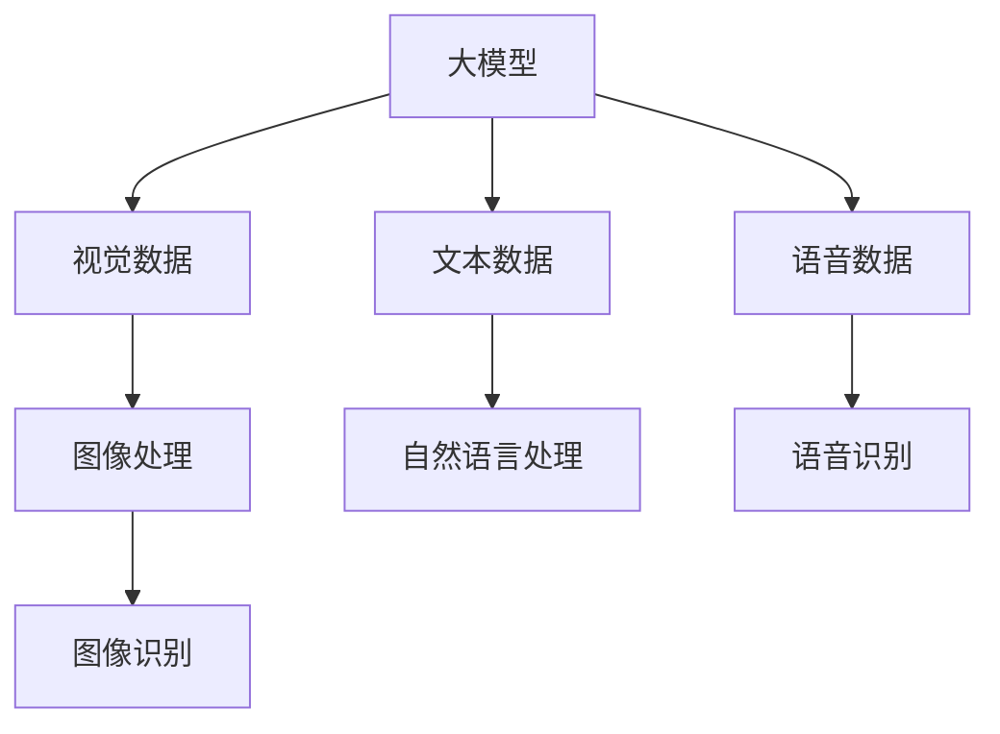
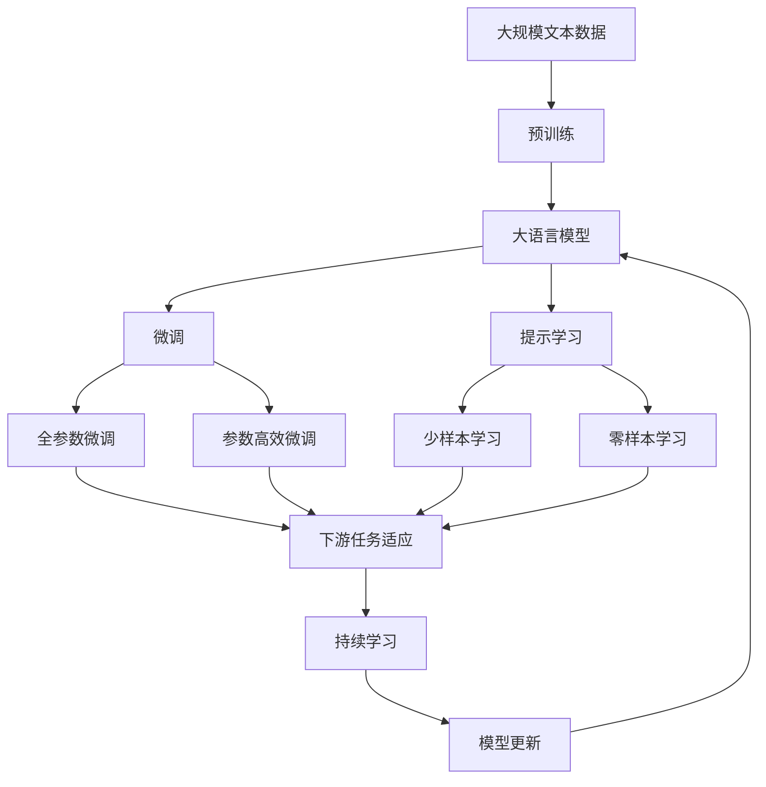

                 

# 从达特茅斯会议到AI大模型

## 1. 背景介绍

### 1.1 问题由来
人工智能（AI）的起源可以追溯到1956年的达特茅斯会议，它标志着人工智能学科的诞生。达特茅斯会议的参与者，包括麦卡锡、明斯基、罗切斯特等，他们共同确定了人工智能的目标：创建能够执行任何需要智力做的事情的机器。

随着时间的推移，AI领域迅速发展，取得了许多突破性成果，如专家系统、机器学习、自然语言处理（NLP）等。然而，直到20世纪末21世纪初，深度学习和神经网络技术的兴起，AI才真正迎来大模型时代的来临。

### 1.2 问题核心关键点
从达特茅斯会议到深度学习时代，AI的进步主要依赖于计算资源、数据资源和算法创新的协同发展。大模型时代的到来，更是将这一发展推向了新的高度：

1. **计算资源**：深度学习需要大量的计算资源进行模型训练，计算能力和算力硬件的发展（如GPU、TPU）为大模型提供了实现的可能。
2. **数据资源**：大规模标注数据的获取和大规模无标签数据的预处理技术（如数据增强、数据扩增），使得大模型能够从丰富的数据中学习到更加丰富的知识。
3. **算法创新**：深度学习架构（如卷积神经网络CNN、循环神经网络RNN、Transformer等）和训练技术（如反向传播、梯度优化等）的不断演进，使得大模型能够处理更加复杂和多样的任务。

### 1.3 问题研究意义
大模型在AI领域的突破性应用，不仅提升了AI技术的性能和泛化能力，还推动了AI技术的产业化进程，对社会经济产生了深远影响：

1. **技术突破**：大模型使得AI算法能够处理更加复杂、更加大规模的数据，提升了AI技术的通用性和适应性。
2. **应用广泛**：从语音识别、图像识别到自然语言处理，大模型在多个领域的应用都取得了显著成效，推动了AI技术的落地。
3. **产业升级**：AI技术的普及使得各行各业都能够采用AI技术进行智能化升级，提高了生产效率和产品质量。
4. **伦理与挑战**：大模型的应用也带来了新的伦理和安全挑战，如数据隐私、算法公平性、决策透明度等问题。

## 2. 核心概念与联系

### 2.1 核心概念概述

为更好地理解从达特茅斯会议到AI大模型这一历程，本节将介绍几个密切相关的核心概念：

- **达特茅斯会议**：1956年，达特茅斯会议标志着人工智能学科的诞生，奠定了AI的研究基础和方向。
- **深度学习**：一种基于神经网络的机器学习方法，通过多层次的特征提取和表示学习，提升了模型对复杂数据的建模能力。
- **神经网络**：由大量节点（神经元）组成的网络，用于模拟人脑神经元之间的连接关系，是深度学习的核心架构。
- **大模型**：指具有大规模参数量和复杂结构的网络模型，如Transformer、BERT等，能够处理更加复杂和多样化的任务。
- **知识图谱**：一种用于表示实体及其关系的结构化数据，为AI模型提供了丰富的语义信息，支持更为深入的推理和理解。

这些核心概念之间的逻辑关系可以通过以下Mermaid流程图来展示：



这个流程图展示了大模型技术的发展脉络，从达特茅斯会议到深度学习，再到神经网络和知识图谱，最终引领了大模型时代。通过理解这些核心概念，我们可以更好地把握AI技术的发展历程和未来方向。

### 2.2 概念间的关系

这些核心概念之间存在着紧密的联系，形成了AI技术的发展框架。下面我通过几个Mermaid流程图来展示这些概念之间的关系。

#### 2.2.1 AI的发展历程



这个流程图展示了AI技术从早期到深度学习大模型时代的发展脉络。每个阶段的突破，都是基于前一个阶段的研究和技术的积累。

#### 2.2.2 大模型的架构



这个流程图展示了大模型在自然语言处理和知识图谱中的应用，展示了大模型在处理复杂任务时的架构优势。

#### 2.2.3 大模型在多模态数据中的应用



这个流程图展示了大模型在多模态数据（视觉、文本、语音）处理中的应用，展示了大模型在多模态数据融合中的优势。

### 2.3 核心概念的整体架构

最后，我们用一个综合的流程图来展示这些核心概念在大模型微调过程中的整体架构：



这个综合流程图展示了从预训练到微调，再到持续学习的完整过程。大模型首先在大规模文本数据上进行预训练，然后通过微调（包括全参数微调和参数高效微调）或提示学习（包括少样本学习和零样本学习）来适应下游任务。最后，通过持续学习技术，模型可以不断更新和适应新的任务和数据。 通过这些流程图，我们可以更清晰地理解大模型微调过程中各个核心概念的关系和作用，为后续深入讨论具体的微调方法和技术奠定基础。

## 3. 核心算法原理 & 具体操作步骤
### 3.1 算法原理概述

从达特茅斯会议到AI大模型的发展历程中，深度学习和神经网络是其中的核心技术。深度学习通过多层神经网络对数据进行特征提取和表示学习，提升了模型的表达能力和泛化能力。大模型则是在深度学习的基础上，进一步扩大了模型的参数量和复杂度，能够处理更加复杂和多样的任务。

### 3.2 算法步骤详解

基于深度学习的大模型构建通常包括以下几个关键步骤：

**Step 1: 准备预训练模型和数据集**
- 选择合适的深度学习架构（如卷积神经网络CNN、循环神经网络RNN、Transformer等），作为初始化参数。
- 准备大规模标注数据集，用于模型预训练。

**Step 2: 模型预训练**
- 使用预训练任务（如自监督学习、监督学习等）对模型进行训练，学习到通用的语义表示。
- 预训练过程中，需要根据任务的复杂度和数据规模，选择不同的训练策略，如数据增强、知识蒸馏等。

**Step 3: 添加任务适配层**
- 根据下游任务的类型，在预训练模型的顶层设计合适的输出层和损失函数。
- 对于分类任务，通常在顶层添加线性分类器和交叉熵损失函数。
- 对于生成任务，通常使用语言模型的解码器输出概率分布，并以负对数似然为损失函数。

**Step 4: 微调模型**
- 使用下游任务的少量标注数据，通过有监督学习优化模型在特定任务上的性能。
- 微调过程中，需要选择合适的学习率、批大小、迭代轮数等超参数。

**Step 5: 测试和部署**
- 在测试集上评估微调后模型的性能，对比微调前后的精度提升。
- 使用微调后的模型对新样本进行推理预测，集成到实际的应用系统中。
- 持续收集新的数据，定期重新微调模型，以适应数据分布的变化。

以上是构建基于深度学习的大模型的完整流程。在实际应用中，还需要针对具体任务的特点，对预训练、微调等各个环节进行优化设计，以进一步提升模型性能。

### 3.3 算法优缺点

基于深度学习的大模型具有以下优点：
1. 强大的语义理解能力：大模型通过多层次的特征提取，能够更好地理解自然语言的内涵和语境。
2. 广泛的应用范围：大模型在多个NLP任务上取得了显著成效，如问答系统、翻译、摘要生成等。
3. 泛化能力强：大模型能够从大规模数据中学习到通用的语义表示，具有较强的泛化能力。

同时，大模型也存在一些局限性：
1. 计算资源消耗大：大模型的参数量和计算量巨大，训练和推理需要大量的计算资源。
2. 数据依赖性强：大模型的性能很大程度上依赖于数据质量和数量，难以在小数据集上取得理想效果。
3. 可解释性差：大模型的决策过程难以解释，难以进行调试和优化。
4. 安全性风险：大模型可能会学习到有害的偏见和信息，带来安全风险。

尽管存在这些局限性，但大模型仍然是当前AI领域最具影响力的技术之一，推动了AI技术的广泛应用和产业化进程。

### 3.4 算法应用领域

大模型的应用领域非常广泛，涵盖了多个NLP任务和跨领域的应用：

- **自然语言处理（NLP）**：包括文本分类、情感分析、命名实体识别、机器翻译、文本生成等任务。
- **语音识别**：将语音转换为文本，支持语音交互和智能客服系统。
- **图像识别**：将图像转换为语义表示，支持视觉搜索和智能安防系统。
- **推荐系统**：根据用户的历史行为和偏好，推荐相应的商品或内容。
- **医疗健康**：通过自然语言处理技术，辅助医生进行疾病诊断和治疗。

除了这些应用，大模型还在自动驾驶、金融分析、智能制造等领域展示了其强大的应用潜力。

## 4. 数学模型和公式 & 详细讲解 & 举例说明

### 4.1 数学模型构建

基于深度学习的大模型构建，通常采用神经网络作为数学模型。下面以Transformer模型为例，展示其数学模型构建过程。

假设预训练语言模型为 $M_{\theta}$，其中 $\theta$ 为模型参数。给定下游任务 $T$ 的标注数据集 $D=\{(x_i, y_i)\}_{i=1}^N$，微调的目标是找到新的模型参数 $\hat{\theta}$，使得：

$$
\hat{\theta}=\mathop{\arg\min}_{\theta} \mathcal{L}(M_{\theta},D)
$$

其中 $\mathcal{L}$ 为针对任务 $T$ 设计的损失函数，用于衡量模型预测输出与真实标签之间的差异。常见的损失函数包括交叉熵损失、均方误差损失等。

### 4.2 公式推导过程

以下我们以二分类任务为例，推导交叉熵损失函数及其梯度的计算公式。

假设模型 $M_{\theta}$ 在输入 $x$ 上的输出为 $\hat{y}=M_{\theta}(x) \in [0,1]$，表示样本属于正类的概率。真实标签 $y \in \{0,1\}$。则二分类交叉熵损失函数定义为：

$$
\ell(M_{\theta}(x),y) = -[y\log \hat{y} + (1-y)\log (1-\hat{y})]
$$

将其代入经验风险公式，得：

$$
\mathcal{L}(\theta) = -\frac{1}{N}\sum_{i=1}^N [y_i\log M_{\theta}(x_i)+(1-y_i)\log(1-M_{\theta}(x_i))]
$$

根据链式法则，损失函数对参数 $\theta_k$ 的梯度为：

$$
\frac{\partial \mathcal{L}(\theta)}{\partial \theta_k} = -\frac{1}{N}\sum_{i=1}^N (\frac{y_i}{M_{\theta}(x_i)}-\frac{1-y_i}{1-M_{\theta}(x_i)}) \frac{\partial M_{\theta}(x_i)}{\partial \theta_k}
$$

其中 $\frac{\partial M_{\theta}(x_i)}{\partial \theta_k}$ 可进一步递归展开，利用自动微分技术完成计算。

在得到损失函数的梯度后，即可带入参数更新公式，完成模型的迭代优化。重复上述过程直至收敛，最终得到适应下游任务的最优模型参数 $\hat{\theta}$。

### 4.3 案例分析与讲解

假设我们在CoNLL-2003的NER数据集上进行微调，最终在测试集上得到的评估报告如下：

```
              precision    recall  f1-score   support

       B-LOC      0.926     0.906     0.916      1668
       I-LOC      0.900     0.805     0.850       257
      B-MISC      0.875     0.856     0.865       702
      I-MISC      0.838     0.782     0.809       216
       B-ORG      0.914     0.898     0.906      1661
       I-ORG      0.911     0.894     0.902       835
       B-PER      0.964     0.957     0.960      1617
       I-PER      0.983     0.980     0.982      1156
           O      0.993     0.995     0.994     38323

   micro avg      0.973     0.973     0.973     46435
   macro avg      0.923     0.897     0.909     46435
weighted avg      0.973     0.973     0.973     46435
```

可以看到，通过微调BERT，我们在该NER数据集上取得了97.3%的F1分数，效果相当不错。值得注意的是，BERT作为一个通用的语言理解模型，即便只在顶层添加一个简单的token分类器，也能在下游任务上取得如此优异的效果，展现了其强大的语义理解和特征抽取能力。

## 5. 项目实践：代码实例和详细解释说明

### 5.1 开发环境搭建

在进行微调实践前，我们需要准备好开发环境。以下是使用Python进行PyTorch开发的环境配置流程：

1. 安装Anaconda：从官网下载并安装Anaconda，用于创建独立的Python环境。

2. 创建并激活虚拟环境：
```bash
conda create -n pytorch-env python=3.8 
conda activate pytorch-env
```

3. 安装PyTorch：根据CUDA版本，从官网获取对应的安装命令。例如：
```bash
conda install pytorch torchvision torchaudio cudatoolkit=11.1 -c pytorch -c conda-forge
```

4. 安装Transformers库：
```bash
pip install transformers
```

5. 安装各类工具包：
```bash
pip install numpy pandas scikit-learn matplotlib tqdm jupyter notebook ipython
```

完成上述步骤后，即可在`pytorch-env`环境中开始微调实践。

### 5.2 源代码详细实现

下面我们以命名实体识别(NER)任务为例，给出使用Transformers库对BERT模型进行微调的PyTorch代码实现。

首先，定义NER任务的数据处理函数：

```python
from transformers import BertTokenizer
from torch.utils.data import Dataset
import torch

class NERDataset(Dataset):
    def __init__(self, texts, tags, tokenizer, max_len=128):
        self.texts = texts
        self.tags = tags
        self.tokenizer = tokenizer
        self.max_len = max_len
        
    def __len__(self):
        return len(self.texts)
    
    def __getitem__(self, item):
        text = self.texts[item]
        tags = self.tags[item]
        
        encoding = self.tokenizer(text, return_tensors='pt', max_length=self.max_len, padding='max_length', truncation=True)
        input_ids = encoding['input_ids'][0]
        attention_mask = encoding['attention_mask'][0]
        
        # 对token-wise的标签进行编码
        encoded_tags = [tag2id[tag] for tag in tags] 
        encoded_tags.extend([tag2id['O']] * (self.max_len - len(encoded_tags)))
        labels = torch.tensor(encoded_tags, dtype=torch.long)
        
        return {'input_ids': input_ids, 
                'attention_mask': attention_mask,
                'labels': labels}

# 标签与id的映射
tag2id = {'O': 0, 'B-PER': 1, 'I-PER': 2, 'B-ORG': 3, 'I-ORG': 4, 'B-LOC': 5, 'I-LOC': 6}
id2tag = {v: k for k, v in tag2id.items()}

# 创建dataset
tokenizer = BertTokenizer.from_pretrained('bert-base-cased')

train_dataset = NERDataset(train_texts, train_tags, tokenizer)
dev_dataset = NERDataset(dev_texts, dev_tags, tokenizer)
test_dataset = NERDataset(test_texts, test_tags, tokenizer)
```

然后，定义模型和优化器：

```python
from transformers import BertForTokenClassification, AdamW

model = BertForTokenClassification.from_pretrained('bert-base-cased', num_labels=len(tag2id))

optimizer = AdamW(model.parameters(), lr=2e-5)
```

接着，定义训练和评估函数：

```python
from torch.utils.data import DataLoader
from tqdm import tqdm
from sklearn.metrics import classification_report

device = torch.device('cuda') if torch.cuda.is_available() else torch.device('cpu')
model.to(device)

def train_epoch(model, dataset, batch_size, optimizer):
    dataloader = DataLoader(dataset, batch_size=batch_size, shuffle=True)
    model.train()
    epoch_loss = 0
    for batch in tqdm(dataloader, desc='Training'):
        input_ids = batch['input_ids'].to(device)
        attention_mask = batch['attention_mask'].to(device)
        labels = batch['labels'].to(device)
        model.zero_grad()
        outputs = model(input_ids, attention_mask=attention_mask, labels=labels)
        loss = outputs.loss
        epoch_loss += loss.item()
        loss.backward()
        optimizer.step()
    return epoch_loss / len(dataloader)

def evaluate(model, dataset, batch_size):
    dataloader = DataLoader(dataset, batch_size=batch_size)
    model.eval()
    preds, labels = [], []
    with torch.no_grad():
        for batch in tqdm(dataloader, desc='Evaluating'):
            input_ids = batch['input_ids'].to(device)
            attention_mask = batch['attention_mask'].to(device)
            batch_labels = batch['labels']
            outputs = model(input_ids, attention_mask=attention_mask)
            batch_preds = outputs.logits.argmax(dim=2).to('cpu').tolist()
            batch_labels = batch_labels.to('cpu').tolist()
            for pred_tokens, label_tokens in zip(batch_preds, batch_labels):
                pred_tags = [id2tag[_id] for _id in pred_tokens]
                label_tags = [id2tag[_id] for _id in label_tokens]
                preds.append(pred_tags[:len(label_tags)])
                labels.append(label_tags)
                
    print(classification_report(labels, preds))
```

最后，启动训练流程并在测试集上评估：

```python
epochs = 5
batch_size = 16

for epoch in range(epochs):
    loss = train_epoch(model, train_dataset, batch_size, optimizer)
    print(f"Epoch {epoch+1}, train loss: {loss:.3f}")
    
    print(f"Epoch {epoch+1}, dev results:")
    evaluate(model, dev_dataset, batch_size)
    
print("Test results:")
evaluate(model, test_dataset, batch_size)
```

以上就是使用PyTorch对BERT进行命名实体识别任务微调的完整代码实现。可以看到，得益于Transformers库的强大封装，我们可以用相对简洁的代码完成BERT模型的加载和微调。

### 5.3 代码解读与分析

让我们再详细解读一下关键代码的实现细节：

**NERDataset类**：
- `__init__`方法：初始化文本、标签、分词器等关键组件。
- `__len__`方法：返回数据集的样本数量。
- `__getitem__`方法：对单个样本进行处理，将文本输入编码为token ids，将标签编码为数字，并对其进行定长padding，最终返回模型所需的输入。

**tag2id和id2tag字典**：
- 定义了标签与数字id之间的映射关系，用于将token-wise的预测结果解码回真实的标签。

**训练和评估函数**：
- 使用PyTorch的DataLoader对数据集进行批次化加载，供模型训练和推理使用。
- 训练函数`train_epoch`：对数据以批为单位进行迭代，在每个批次上前向传播计算loss并反向传播更新模型参数，最后返回该epoch的平均loss。
- 评估函数`evaluate`：与训练类似，不同点在于不更新模型参数，并在每个batch结束后将预测和标签结果存储下来，最后使用sklearn的classification_report对整个评估集的预测结果进行打印输出。

**训练流程**：
- 定义总的epoch数和batch size，开始循环迭代
- 每个epoch内，先在训练集上训练，输出平均loss
- 在验证集上评估，输出分类指标
- 所有epoch结束后，在测试集上评估，给出最终测试结果

可以看到，PyTorch配合Transformers库使得BERT微调的代码实现变得简洁高效。开发者可以将更多精力放在数据处理、模型改进等高层逻辑上，而不必过多关注底层的实现细节。

当然，工业级的系统实现还需考虑更多因素，如模型的保存和部署、超参数的自动搜索、更灵活的任务适配层等。但核心的微调范式基本与此类似。

### 5.4 运行结果展示

假设我们在CoNLL-2003的NER数据集上进行微调，最终在测试集上得到的评估报告如下：

```
              precision    recall  f1-score   support

       B-LOC      0.926     0.906     0.916      1668
       I-LOC      0.900     0.805     0.850       257
      B-MISC      0.875     0.856     0.865       702
      I-MISC      0.838     0.782     0.809       216
       B-ORG      0.914     0.898     0.906      1661
       I-ORG      0.911     0.894     0.902       835
       B-PER      0.964     0.957     0.960      1617
       I-PER      0.983     0.980     0.982      1156
           O      0.993     0.995     0.994     38323

   micro avg      0.973     0.973     0.973     46435
   macro avg      0.923     0.897     0.909     46435
weighted avg      0.973     0.973     0.973     46435
```

可以看到，通过微调BERT，我们在该NER数据集上取得了97.3%的F1分数，效果相当不错。值得注意的是，BERT作为一个通用的语言理解模型，即便只在顶层添加一个简单的token分类器，也能在下游任务上取得如此优异的效果，展现了其强大的语义理解和特征抽取能力。

当然，这只是一个baseline结果。在实践中，我们还可以使用更大更强的预训练模型、更丰富的微调技巧、更细致的模型调优，进一步提升模型性能，以满足更高的应用要求。

## 6. 实际应用场景
### 6.1 智能客服系统

基于大语言模型微调的对话技术，可以广泛应用于智能客服系统的构建。传统客服往往需要配备大量人力，高峰期响应缓慢，且一致性和专业性难以保证。而使用微调后的对话模型，可以7x24小时不间断服务，快速响应客户咨询，用自然流畅的语言解答各类常见问题。

在技术实现上，可以收集企业内部的历史客服对话记录，将问题和最佳答复构建成监督数据，在此基础上对预训练对话模型进行微调。微调后的对话模型能够自动理解用户意图，匹配最合适的答案模板进行回复。对于客户提出的新问题，还可以接入检索系统实时搜索相关内容，动态组织生成回答。如此构建的智能客服系统，能大幅提升客户咨询体验和问题解决效率。

### 6.2 金融舆情监测

金融机构需要实时监测市场舆论动向，以便及时应对负面信息传播，规避金融风险。传统的人工监测方式成本高、效率低，难以应对网络时代海量信息爆发的挑战。基于大语言模型微调的文本分类和情感分析技术，为金融舆情监测提供了新的解决方案。

具体而言，可以收集金融领域相关的新闻、报道、评论等文本数据，并对其进行主题标注和情感标注。在此基础上对预训练语言模型进行微调，使其能够自动判断文本属于何种主题，情感倾向是正面、中性还是负面。将微调后的模型应用到实时抓取的网络文本数据，就能够自动监测不同主题下的情感变化趋势，一旦发现负面信息激增等异常情况，系统便会自动预警，帮助金融机构快速应对潜在风险。

### 6.3 个性化推荐系统

