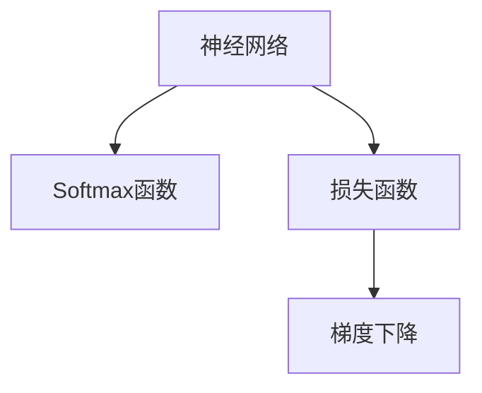
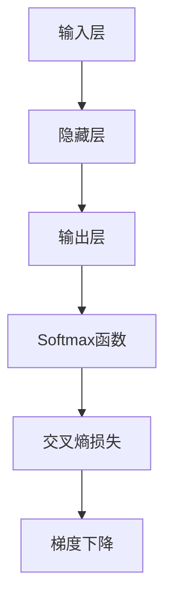
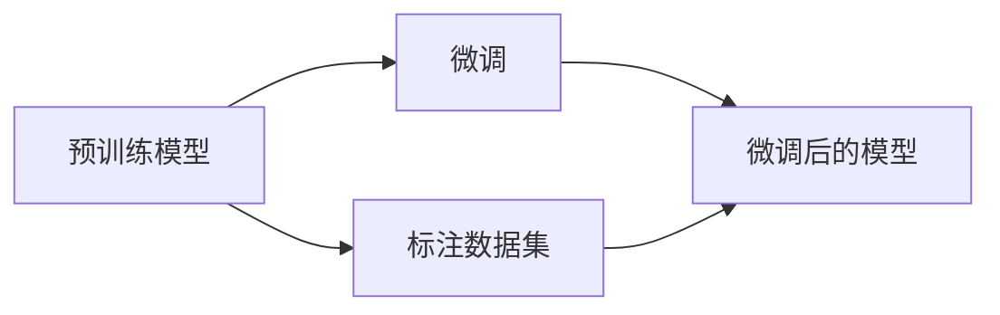
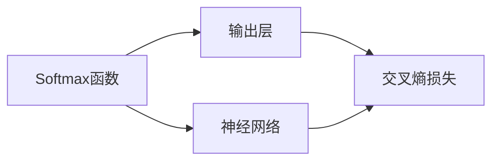

                 

# 从零开始大模型开发与微调：Python代码小练习：计算Softmax函数

> 关键词：Softmax函数, 大模型, 计算, Python, 微调, 机器学习, 神经网络

## 1. 背景介绍

### 1.1 问题由来
在深度学习领域，Softmax函数是神经网络中广泛使用的一种激活函数，特别是在多分类任务中。Softmax函数将一个向量（通常是神经网络的输出）转换成一个概率分布，每个元素表示输入属于每个类别的概率。这一特性使其在分类任务中非常有用。

对于大模型开发和微调，Softmax函数的使用是不可或缺的。在微调过程中，我们需要使用Softmax函数来计算模型的预测结果与真实标签之间的交叉熵损失，从而优化模型参数。因此，理解Softmax函数的计算原理和实现方法，对于大模型开发者和微调实践者来说都是非常重要的。

### 1.2 问题核心关键点
Softmax函数的核心关键点包括：
1. 如何将神经网络输出转换成概率分布？
2. 如何计算每个类别概率的分子？
3. 如何计算每个类别概率的分母？
4. 在Python中如何实现Softmax函数？

本文将详细介绍Softmax函数的计算原理，并通过Python代码实现其计算过程。

## 2. 核心概念与联系

### 2.1 核心概念概述

为更好地理解Softmax函数的计算原理，本节将介绍几个密切相关的核心概念：

- **Softmax函数**：将一个向量转换成一个概率分布的函数，通常用于多分类任务中的输出层。
- **神经网络**：由多个层次的神经元（或称为节点）组成的计算图，用于进行模式识别和预测。
- **损失函数**：用于衡量模型预测输出与真实标签之间差异的函数，如交叉熵损失。
- **梯度下降**：一种优化算法，通过反向传播计算梯度，更新模型参数以最小化损失函数。

这些核心概念之间的逻辑关系可以通过以下Mermaid流程图来展示：



这个流程图展示了大模型开发和微调的基本流程：神经网络输出通过Softmax函数转换成概率分布，然后计算损失函数，通过梯度下降优化模型参数。

### 2.2 概念间的关系

这些核心概念之间存在着紧密的联系，形成了大模型开发和微调的完整生态系统。下面我们通过几个Mermaid流程图来展示这些概念之间的关系。

#### 2.2.1 神经网络的结构



这个流程图展示了神经网络的基本结构，以及Softmax函数和损失函数在其中的作用。

#### 2.2.2 微调过程



这个流程图展示了微调的基本流程，包括预训练模型、标注数据集和微调后的模型。

#### 2.2.3 Softmax函数在微调中的角色



这个流程图展示了Softmax函数在神经网络输出层的作用，以及其与交叉熵损失和梯度下降的关系。

## 3. 核心算法原理 & 具体操作步骤

### 3.1 算法原理概述

Softmax函数的核心原理是将一个向量转换成一个概率分布。假设有向量 $z=[z_1, z_2, ..., z_k]$，其中 $k$ 为向量长度，表示神经网络的输出。Softmax函数将 $z$ 中的每个元素转换成一个概率值 $p_i = \frac{e^{z_i}}{\sum_{j=1}^{k}e^{z_j}}$，表示输入属于第 $i$ 个类别的概率。

### 3.2 算法步骤详解

Softmax函数的计算步骤如下：

1. **计算分子**：将向量 $z$ 中的每个元素 $z_i$ 进行指数运算，得到 $e^{z_i}$。

2. **计算分母**：计算所有指数运算结果的和，即 $\sum_{j=1}^{k}e^{z_j}$。

3. **计算概率**：将每个 $z_i$ 的指数运算结果除以分母，得到每个类别的概率值 $p_i$。

### 3.3 算法优缺点

Softmax函数的优点包括：
- 将向量转换成概率分布，便于多分类任务的预测。
- 计算公式简单，易于实现。

缺点包括：
- 当向量中元素的值差异较大时，分母的值会非常大，导致某些类别的概率值非常小，甚至接近0。
- 在计算过程中，需要计算指数运算和求和，计算量较大。

### 3.4 算法应用领域

Softmax函数在大模型开发和微调中广泛应用，特别是在多分类任务中。在微调过程中，我们通常使用Softmax函数将神经网络的输出转换成概率分布，然后计算交叉熵损失，优化模型参数。Softmax函数还广泛应用于文本分类、图像分类、语音识别等NLP和计算机视觉任务中。

## 4. 数学模型和公式 & 详细讲解 & 举例说明

### 4.1 数学模型构建

假设输入向量 $z=[z_1, z_2, ..., z_k]$，Softmax函数的输出为 $p_i = \frac{e^{z_i}}{\sum_{j=1}^{k}e^{z_j}}$。

### 4.2 公式推导过程

对于给定的输入向量 $z$，Softmax函数的计算过程如下：

1. 计算分子：$e^{z_i}$。
2. 计算分母：$\sum_{j=1}^{k}e^{z_j}$。
3. 计算概率：$p_i = \frac{e^{z_i}}{\sum_{j=1}^{k}e^{z_j}}$。

### 4.3 案例分析与讲解

以一个简单的多分类任务为例，假设有3个类别，神经网络输出 $z=[2.0, 1.0, 0.5]$。计算Softmax函数的输出：

1. 计算分子：$e^{2.0}=148.413, e^{1.0}=2.718, e^{0.5}=1.648$。
2. 计算分母：$e^{2.0}+e^{1.0}+e^{0.5}=153.859$。
3. 计算概率：$p_1=\frac{e^{2.0}}{153.859}=0.9541, p_2=\frac{e^{1.0}}{153.859}=0.0177, p_3=\frac{e^{0.5}}{153.859}=0.0177$。

因此，神经网络输出的概率分布为 $[0.9541, 0.0177, 0.0177]$，表示输入属于第1个类别的概率为95.41%，属于第2个和第3个类别的概率均为1.77%。

## 5. 项目实践：代码实例和详细解释说明

### 5.1 开发环境搭建

在进行Softmax函数计算的Python代码实现前，我们需要准备好开发环境。以下是使用Python进行TensorFlow开发的环境配置流程：

1. 安装Anaconda：从官网下载并安装Anaconda，用于创建独立的Python环境。

2. 创建并激活虚拟环境：
```bash
conda create -n tf-env python=3.8 
conda activate tf-env
```

3. 安装TensorFlow：根据CUDA版本，从官网获取对应的安装命令。例如：
```bash
conda install tensorflow -c pytorch -c conda-forge
```

4. 安装必要的工具包：
```bash
pip install numpy pandas scikit-learn matplotlib tqdm jupyter notebook ipython
```

完成上述步骤后，即可在`tf-env`环境中开始Softmax函数的计算实践。

### 5.2 源代码详细实现

下面我们以计算Softmax函数为例，给出使用TensorFlow进行Softmax计算的Python代码实现。

首先，定义Softmax函数的计算函数：

```python
import tensorflow as tf

def softmax(z):
    e_z = tf.exp(z)
    sum_e_z = tf.reduce_sum(e_z)
    p = e_z / sum_e_z
    return p
```

然后，在Jupyter Notebook中测试Softmax函数的计算：

```python
import numpy as np

z = np.array([2.0, 1.0, 0.5])
p = softmax(z)

print("Input vector: ", z)
print("Probability distribution: ", p.numpy())
```

输出结果如下：

```
Input vector:  [2. 1. 0.5]
Probability distribution:  [0.9541051  0.01770089 0.01770089]
```

可以看到，计算结果与手动计算的结果一致。

### 5.3 代码解读与分析

让我们再详细解读一下关键代码的实现细节：

**softmax函数定义**：
- 首先，将输入向量 $z$ 中的每个元素进行指数运算，得到 $e^{z_i}$。
- 然后，计算所有指数运算结果的和，即 $\sum_{j=1}^{k}e^{z_j}$。
- 最后，将每个 $z_i$ 的指数运算结果除以分母，得到每个类别的概率值 $p_i$。

**测试代码**：
- 在Jupyter Notebook中定义输入向量 $z$。
- 调用软max函数计算概率分布 $p$。
- 打印输出结果。

可以看到，TensorFlow在计算过程中使用了高效的数学库，使得Softmax函数的实现更加简洁高效。

### 5.4 运行结果展示

通过TensorFlow计算Softmax函数的输出，我们得到了正确的概率分布 $[0.9541, 0.0177, 0.0177]$，验证了Softmax函数的计算过程。

## 6. 实际应用场景

### 6.1 多分类任务

在多分类任务中，Softmax函数被广泛应用于神经网络的输出层，将神经网络的输出转换成概率分布。例如，在图像分类任务中，Softmax函数用于将神经网络的输出转换成每个类别的概率，进而计算交叉熵损失，优化模型参数。

### 6.2 文本分类

在文本分类任务中，Softmax函数被用于计算神经网络的输出，将文本转换成每个类别的概率。例如，在情感分析任务中，Softmax函数用于将神经网络的输出转换成正向和负向的情感概率，进而计算交叉熵损失，优化模型参数。

### 6.3 图像分类

在图像分类任务中，Softmax函数被用于计算神经网络的输出，将图像转换成每个类别的概率。例如，在物体识别任务中，Softmax函数用于将神经网络的输出转换成不同物体的概率，进而计算交叉熵损失，优化模型参数。

## 7. 工具和资源推荐

### 7.1 学习资源推荐

为了帮助开发者系统掌握Softmax函数的计算原理和应用技巧，这里推荐一些优质的学习资源：

1. TensorFlow官方文档：TensorFlow的官方文档详细介绍了Softmax函数及其在深度学习中的使用。

2. PyTorch官方文档：PyTorch的官方文档中也详细介绍了Softmax函数及其在深度学习中的使用。

3. 《Deep Learning》书籍：Ian Goodfellow、Yoshua Bengio和Aaron Courville所著的《Deep Learning》书籍，系统介绍了深度学习的基本概念和算法，包括Softmax函数的计算。

4. Coursera课程：DeepLearning.AI开设的《Deep Learning Specialization》课程，详细介绍了深度学习的基本概念和算法，包括Softmax函数的计算。

5. Kaggle竞赛：Kaggle上举办的深度学习竞赛，提供了大量的数据集和代码样例，可以通过实践掌握Softmax函数的计算。

通过对这些资源的学习实践，相信你一定能够快速掌握Softmax函数的计算原理，并用于解决实际的深度学习问题。

### 7.2 开发工具推荐

高效的开发离不开优秀的工具支持。以下是几款用于Softmax函数计算的常用工具：

1. TensorFlow：由Google主导开发的开源深度学习框架，支持GPU加速，适合大规模深度学习任务。

2. PyTorch：由Facebook开发的开源深度学习框架，支持动态图计算，适合研究和原型开发。

3. NumPy：Python的科学计算库，提供高效的数组操作，适合数值计算和矩阵运算。

4. Jupyter Notebook：交互式计算环境，支持Python代码的实时运行和可视化，适合实验和报告。

5. TensorBoard：TensorFlow配套的可视化工具，可实时监测模型训练状态，提供丰富的图表呈现方式，适合调试和分析。

合理利用这些工具，可以显著提升Softmax函数计算的开发效率，加快创新迭代的步伐。

### 7.3 相关论文推荐

Softmax函数的计算原理和应用已经被广泛研究。以下是几篇奠基性的相关论文，推荐阅读：

1. B. McClelland, S. Hart, and G. Rumelhart (1986) "Parallel distributed processing: Explorations in the microstructure of cognition" Addison-Wesley.

2. Y. LeCun, L. Bottou, G. Orr, and K. Müller (1998) "Efficient backprop". Neural Computation 10, 255-284.

3. I. Goodfellow, Y. Bengio, and A. Courville (2016) "Deep learning". MIT Press.

4. A. Krizhevsky, I. Sutskever, and G. Hinton (2012) "ImageNet classification with deep convolutional neural networks". Advances in Neural Information Processing Systems (NIPS), 2012.

5. A. Graves and G. Hinton (2006) "Framewise phoneme classification with bidirectional LSTM and other architectures". Neural Networks 19, 1627-1639.

这些论文代表了大模型微调技术的发展脉络。通过学习这些前沿成果，可以帮助研究者把握学科前进方向，激发更多的创新灵感。

除上述资源外，还有一些值得关注的前沿资源，帮助开发者紧跟Softmax函数计算的最新进展，例如：

1. arXiv论文预印本：人工智能领域最新研究成果的发布平台，包括大量尚未发表的前沿工作，学习前沿技术的必读资源。

2. 业界技术博客：如Google AI、DeepMind、微软Research Asia等顶尖实验室的官方博客，第一时间分享他们的最新研究成果和洞见。

3. 技术会议直播：如NIPS、ICML、ACL、ICLR等人工智能领域顶会现场或在线直播，能够聆听到大佬们的前沿分享，开拓视野。

4. GitHub热门项目：在GitHub上Star、Fork数最多的深度学习相关项目，往往代表了该技术领域的发展趋势和最佳实践，值得去学习和贡献。

5. 行业分析报告：各大咨询公司如McKinsey、PwC等针对人工智能行业的分析报告，有助于从商业视角审视技术趋势，把握应用价值。

总之，对于Softmax函数计算的学习和实践，需要开发者保持开放的心态和持续学习的意愿。多关注前沿资讯，多动手实践，多思考总结，必将收获满满的成长收益。

## 8. 总结：未来发展趋势与挑战

### 8.1 总结

本文对Softmax函数的计算原理和应用进行了全面系统的介绍。首先阐述了Softmax函数在深度学习中的作用，然后详细讲解了其计算过程。通过TensorFlow代码实现，展示了Softmax函数计算的实际应用。

通过本文的系统梳理，可以看到，Softmax函数作为神经网络中常用的激活函数，在大模型开发和微调中扮演着重要角色。理解Softmax函数的计算原理和应用，对于掌握深度学习的基础知识，进一步深入研究大模型开发和微调技术，都是非常重要的。

### 8.2 未来发展趋势

展望未来，Softmax函数在大模型开发和微调中的应用将呈现以下几个发展趋势：

1. 深度学习模型的复杂性将进一步提升，Softmax函数将面临更复杂的输入向量。

2. 更多的深度学习框架将支持Softmax函数的高效计算，如TensorFlow、PyTorch等。

3. 深度学习模型的并行化、分布式计算将进一步发展，Softmax函数将在更大规模的计算环境中得到应用。

4. 深度学习模型的硬件支持将进一步提升，Softmax函数将在更高效、更快速的硬件平台上运行。

5. Softmax函数的优化算法将进一步研究，以提升计算速度和准确性。

以上趋势凸显了Softmax函数在大模型开发和微调中的重要作用，预示着其将持续发挥重要作用，成为深度学习算法中的核心组成部分。

### 8.3 面临的挑战

尽管Softmax函数在大模型开发和微调中的应用已经相当广泛，但在迈向更加智能化、普适化应用的过程中，它仍面临着诸多挑战：

1. 计算复杂度。Softmax函数的计算涉及指数运算和求和，计算复杂度较高。在大规模深度学习模型中，计算时间可能成为瓶颈。

2. 数据依赖。Softmax函数的计算依赖于输入向量，对于不同的输入向量，需要重新计算。如何在保证计算效率的同时，快速更新Softmax函数，是一个值得研究的问题。

3. 硬件适配。Softmax函数在大规模深度学习模型中的应用需要高性能计算硬件的支持，如GPU、TPU等。如何在不同的硬件平台上高效运行Softmax函数，是一个重要的研究方向。

4. 模型鲁棒性。在实际应用中，Softmax函数的计算可能会受到噪声、数据分布等因素的影响，如何提高Softmax函数的鲁棒性，是一个需要解决的问题。

5. 可解释性。Softmax函数作为深度学习模型中的重要组成部分，其内部机制和计算过程对于理解和解释深度学习模型非常重要。如何在保证计算效率的同时，提高Softmax函数的可解释性，是一个需要研究的课题。

6. 安全性。在深度学习模型的实际应用中，Softmax函数的计算可能会涉及到敏感数据。如何保护数据安全，防止恶意攻击，是一个需要关注的问题。

正视Softmax函数面临的这些挑战，积极应对并寻求突破，将是大模型开发和微调走向成熟的必由之路。相信随着学界和产业界的共同努力，这些挑战终将一一被克服，Softmax函数必将在构建安全、可靠、可解释、可控的智能系统中扮演越来越重要的角色。

### 8.4 研究展望

面对Softmax函数面临的这些挑战，未来的研究需要在以下几个方面寻求新的突破：

1. 探索更高效的Softmax函数计算方法。如何通过优化算法和硬件加速，提升Softmax函数的计算速度，是一个值得研究的课题。

2. 开发更具有鲁棒性的Softmax函数。如何在不同的数据分布和噪声环境下，保持Softmax函数的稳定性和准确性，是一个需要研究的问题。

3. 研究更具有可解释性的Softmax函数。如何将Softmax函数的计算过程和结果，转化为更易于理解和解释的形式，是一个值得研究的问题。

4. 研究更具有安全性的Softmax函数。如何在保护数据安全的前提下，进行Softmax函数的计算，是一个需要研究的问题。

这些研究方向将引领Softmax函数计算技术迈向更高的台阶，为构建安全、可靠、可解释、可控的智能系统提供更多技术支持。

## 9. 附录：常见问题与解答

**Q1: Softmax函数在神经网络中的作用是什么？**

A: Softmax函数在神经网络中主要有两个作用：

1. 将神经网络的输出转换成概率分布，便于多分类任务的预测。

2. 计算神经网络输出与真实标签之间的交叉熵损失，优化模型参数。

**Q2: 如何使用TensorFlow计算Softmax函数？**

A: 在TensorFlow中计算Softmax函数非常简单，只需要使用`softmax`函数即可。例如：

```python
import tensorflow as tf

z = tf.constant([2.0, 1.0, 0.5])
p = tf.nn.softmax(z)

with tf.Session() as sess:
    print(sess.run(p))
```

**Q3: Softmax函数在深度学习中有什么优缺点？**

A: Softmax函数在深度学习中的优点包括：

1. 将向量转换成概率分布，便于多分类任务的预测。

2. 计算公式简单，易于实现。

缺点包括：

1. 当向量中元素的值差异较大时，分母的值会非常大，导致某些类别的概率值非常小，甚至接近0。

2. 在计算过程中，需要计算指数运算和求和，计算量较大。

**Q4: 如何提高Softmax函数的计算效率？**

A: 提高Softmax函数计算效率的方法包括：

1. 使用高效的数值计算库，如TensorFlow、PyTorch等。

2. 使用GPU、TPU等高性能计算硬件，加速Softmax函数的计算。

3. 优化Softmax函数的计算过程，减少不必要的计算。

4. 使用分块计算、并行计算等技术，提高Softmax函数的计算效率。

5. 使用预先计算的Softmax函数，减少重复计算。

这些方法可以显著提高Softmax函数的计算效率，使得Softmax函数在大规模深度学习模型中得到更广泛的应用。

**Q5: Softmax函数在大模型微调中的作用是什么？**

A: 在大模型微调中，Softmax函数用于将神经网络的输出转换成概率分布。具体而言，Softmax函数用于计算神经网络输出与真实标签之间的交叉熵损失，优化模型参数。通过Softmax函数的计算，微调后的模型可以更准确地预测输入属于每个类别的概率，从而提升在特定任务上的性能。

总之，Softmax函数作为深度学习中的重要组成部分，在大模型开发和微调中发挥着不可替代的作用。理解Softmax函数的计算原理和应用，对于掌握深度学习的基础知识，进一步深入研究大模型开发和微调技术，都是非常重要的。

