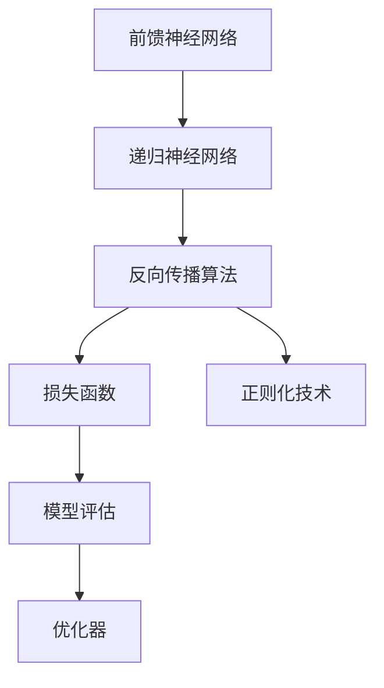
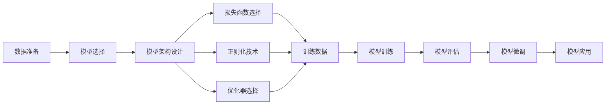
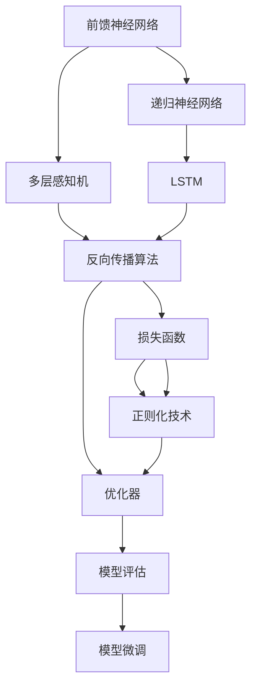
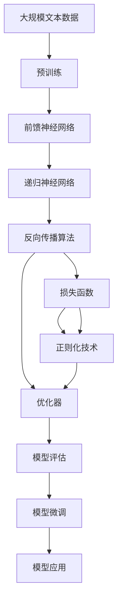

                 

# 从零开始大模型开发与微调：反馈神经网络原理的Python实现

> 关键词：反馈神经网络,深度学习,大模型,微调,反向传播,Python,机器学习

## 1. 背景介绍

### 1.1 问题由来

近年来，深度学习技术迅猛发展，其中神经网络以其强大的非线性映射能力在诸多领域取得了卓越成果。然而，传统的全连接神经网络因其参数稀疏性差、泛化能力弱等问题，难以适应复杂的多层结构。为此，反馈神经网络（Feedback Neural Networks, FNNs）应运而生，通过利用多层次的隐含变量，大大提升了网络的表达能力和鲁棒性。

反馈神经网络主要分为前馈神经网络和递归神经网络两大类。前馈神经网络包括多层感知机（Multilayer Perceptron, MLP）和卷积神经网络（Convolutional Neural Network, CNN）等。递归神经网络则包括循环神经网络（Recurrent Neural Network, RNN）、长短期记忆网络（Long Short-Term Memory, LSTM）、门控循环单元（Gated Recurrent Unit, GRU）等。本文将重点介绍利用反馈神经网络原理开发大模型的核心思想和技术路线，并展示具体的Python实现。

### 1.2 问题核心关键点

反馈神经网络的本质是通过多层循环迭代，学习复杂的非线性关系。核心在于如何设计和优化网络结构，以提升模型性能。具体来说，以下几个方面是关键：

1. **网络架构设计**：确定网络层数、每层神经元个数、激活函数等参数。
2. **损失函数选择**：选择合适的损失函数，衡量模型预测与真实标签之间的差异。
3. **正则化技术**：防止过拟合，常用的包括L2正则、Dropout等。
4. **优化器选择**：优化器决定模型参数的更新方式，常用的有SGD、Adam等。
5. **训练策略**：包括学习率调整、批次大小、迭代轮数等。
6. **模型评估**：通过验证集和测试集评估模型性能。

本文将深入探讨这些关键点，并结合Python编程实践，提供从零开始大模型开发的详细步骤。

### 1.3 问题研究意义

反馈神经网络在大模型开发和微调中具有重要意义：

1. **增强表达能力**：多层次的非线性映射能力，使其能处理复杂的非线性关系。
2. **提升泛化能力**：通过多层循环迭代，学习抽象的语义特征。
3. **高效资源利用**：可以通过参数共享、复用等策略，降低模型复杂度。
4. **促进研究进展**：大模型开发是深度学习前沿研究的重要方向，反馈神经网络为其提供了理论基础和技术手段。

总之，深入理解反馈神经网络原理，有助于开发者构建高效、可解释、可控的深度学习模型。

## 2. 核心概念与联系

### 2.1 核心概念概述

为更好地理解反馈神经网络原理，本节将介绍几个密切相关的核心概念：

- **前馈神经网络**：指数据从输入层到输出层单向传播的神经网络，包括MLP、CNN等。
- **递归神经网络**：指数据在网络中循环传递的神经网络，包括RNN、LSTM、GRU等。
- **反向传播算法**：通过链式法则计算梯度，更新模型参数，是深度学习模型的核心算法之一。
- **损失函数**：衡量模型预测与真实标签之间差异的函数，常用的有交叉熵损失、均方误差损失等。
- **正则化技术**：防止过拟合，常用的有L2正则、Dropout等。
- **优化器**：决定模型参数的更新方式，常用的有SGD、Adam等。
- **模型评估**：通过验证集和测试集评估模型性能，常用的有准确率、精确率、召回率、F1分数等。

这些核心概念之间的逻辑关系可以通过以下Mermaid流程图来展示：



这个流程图展示了前馈神经网络和递归神经网络之间的联系，以及反向传播算法、损失函数、正则化技术、优化器、模型评估在深度学习模型开发和微调中的作用。

### 2.2 概念间的关系

这些核心概念之间存在着紧密的联系，形成了深度学习模型的完整生态系统。下面我们通过几个Mermaid流程图来展示这些概念之间的关系。

#### 2.2.1 深度学习模型开发流程



这个流程图展示了深度学习模型的开发流程，从数据准备到模型训练，再到模型微调和应用。

#### 2.2.2 前馈神经网络和递归神经网络的联系



这个流程图展示了前馈神经网络和递归神经网络的联系，以及它们在深度学习模型开发和微调中的作用。

### 2.3 核心概念的整体架构

最后，我们用一个综合的流程图来展示这些核心概念在大模型微调过程中的整体架构：



这个综合流程图展示了从预训练到微调，再到模型应用的完整过程。大模型首先在大规模文本数据上进行预训练，然后通过反向传播算法优化网络参数，达到模型训练的目的。在微调过程中，选择合适的损失函数、正则化技术和优化器，进一步提升模型性能。最后，通过模型评估和应用，验证模型的效果。

## 3. 核心算法原理 & 具体操作步骤
### 3.1 算法原理概述

反馈神经网络的核心思想是通过多层循环迭代，学习复杂的非线性关系。其基本流程如下：

1. **前向传播**：输入数据从输入层到输出层单向传播，每层通过激活函数非线性映射。
2. **反向传播**：利用链式法则，计算损失函数对每层参数的梯度。
3. **参数更新**：根据梯度信息，使用优化器更新模型参数。
4. **循环迭代**：重复执行前向传播和反向传播，直到收敛。

具体来说，递归神经网络通过循环连接，使得每层输出成为下一层输入，实现数据的循环传递。前馈神经网络通过非线性映射，使得网络能够处理复杂的非线性关系。

### 3.2 算法步骤详解

以递归神经网络为例，详细介绍其开发和微调的详细步骤：

#### 3.2.1 前向传播

前向传播的计算流程如下：

1. **初始化**：设定输入数据 $x_0$，初始状态 $h_0$。
2. **循环迭代**：对每层神经元进行计算，更新状态 $h_t$。
   - 对于LSTM，计算隐藏状态 $h_t$ 和细胞状态 $c_t$。
     - 输入门 $i_t$：$[i_t = \sigma(W_i x_t + U_i h_{t-1} + b_i)$
     - 遗忘门 $f_t$：$[f_t = \sigma(W_f x_t + U_f h_{t-1} + b_f)$
     - 输出门 $o_t$：$[o_t = \sigma(W_o x_t + U_o h_{t-1} + b_o)$
     - 候选单元 $g_t$：$[g_t = \tanh(W_c x_t + U_c h_{t-1} + b_c)$
     - 新细胞状态 $c_t$：$[c_t = f_t \cdot c_{t-1} + i_t \cdot g_t]$
     - 新隐藏状态 $h_t$：$[h_t = o_t \cdot \tanh(c_t)]$
   - 对于GRU，计算隐藏状态 $h_t$。
     - 重置门 $r_t$：$[r_t = \sigma(W_r x_t + U_r h_{t-1} + b_r)$
     - 更新门 $z_t$：$[z_t = \sigma(W_z x_t + U_z h_{t-1} + b_z)$
     - 新隐藏状态 $h_t$：$[h_t = (1-z_t)h_{t-1} + z_t \cdot \tanh(W h_t + U h_{t-1} + b)$

3. **输出计算**：对最终隐藏状态 $h_T$ 进行非线性映射，得到输出 $y$。

#### 3.2.2 反向传播

反向传播的计算流程如下：

1. **初始化**：设定输出层损失函数 $L$。
2. **循环迭代**：对每层神经元进行计算，更新梯度 $\nabla L$。
   - 对于LSTM，计算梯度 $\nabla L$。
     - 输出门梯度：$[\nabla L_{o_t} = \nabla L \cdot o_t \cdot \tanh(c_t)]$
     - 候选单元梯度：$[\nabla L_{g_t} = \nabla L \cdot o_t \cdot \tanh(c_t)]$
     - 遗忘门梯度：$[\nabla L_{f_t} = \nabla L \cdot o_t \cdot (1-\tanh(c_t))^2 \cdot (f_t - f_{t-1} \cdot c_{t-1})]$
     - 输入门梯度：$[\nabla L_{i_t} = \nabla L \cdot o_t \cdot \tanh(c_t) \cdot (1-\tanh(c_t)) \cdot i_t]$
     - 细胞状态梯度：$[\nabla L_{c_t} = \nabla L_{h_t} \cdot o_t \cdot \tanh(c_t) \cdot (1-\tanh(c_t))]$
     - 新隐藏状态梯度：$[\nabla L_{h_t} = \nabla L_{o_t} \cdot \tanh(c_t) \cdot (1-\tanh(c_t))]$
   - 对于GRU，计算梯度 $\nabla L$。
     - 重置门梯度：$[\nabla L_{r_t} = \nabla L \cdot z_t \cdot (1-z_t) \cdot \tanh(h_t)]$
     - 更新门梯度：$[\nabla L_{z_t} = \nabla L \cdot r_t \cdot (1-r_t) \cdot \tanh(h_t)]$
     - 新隐藏状态梯度：$[\nabla L_{h_t} = \nabla L \cdot r_t \cdot (1-z_t) \cdot \tanh(h_t)]$

3. **参数更新**：根据梯度信息，使用优化器更新模型参数。

#### 3.2.3 优化器选择

常用的优化器包括SGD、Adam等。以Adam为例，其更新公式如下：

$$
m_t = \beta_1 m_{t-1} + (1-\beta_1) \nabla L
$$

$$
v_t = \beta_2 v_{t-1} + (1-\beta_2) \nabla L^2
$$

$$
\theta_t = \theta_{t-1} - \frac{\eta}{\sqrt{m_t+\epsilon}+\epsilon} m_t
$$

其中，$m_t$ 和 $v_t$ 分别为梯度的一阶矩和二阶矩估计，$\eta$ 为学习率，$\epsilon$ 为梯度弥散系数。

#### 3.2.4 模型评估

常用的模型评估指标包括准确率、精确率、召回率和F1分数等。以分类任务为例，其计算公式如下：

$$
\text{准确率} = \frac{TP + TN}{TP + TN + FP + FN}
$$

$$
\text{精确率} = \frac{TP}{TP + FP}
$$

$$
\text{召回率} = \frac{TP}{TP + FN}
$$

$$
\text{F1分数} = 2 \cdot \frac{\text{精确率} \cdot \text{召回率}}{\text{精确率} + \text{召回率}}
$$

### 3.3 算法优缺点

反馈神经网络的优点包括：

1. **高效表达能力**：通过多层循环迭代，学习复杂的非线性关系。
2. **鲁棒性强**：能够处理序列数据，具备时间依赖性。
3. **泛化能力强**：能够学习抽象的语义特征，适用于多种任务。

其缺点包括：

1. **计算复杂度高**：模型参数较多，计算量较大。
2. **易过拟合**：需要更多的数据和更复杂的正则化技术来防止过拟合。
3. **训练时间长**：需要大量的计算资源和时间进行训练。

尽管存在这些缺点，但反馈神经网络在大模型开发和微调中仍具有不可替代的优势。未来，如何通过改进网络结构、优化训练策略等手段，进一步提升反馈神经网络的性能，将是重要的研究方向。

### 3.4 算法应用领域

反馈神经网络在大模型开发和微调中具有广泛的应用场景，主要包括以下几个方面：

1. **文本分类**：如情感分析、主题分类、意图识别等。通过反向传播算法，学习文本-标签映射。
2. **命名实体识别**：识别文本中的人名、地名、机构名等特定实体。通过多层循环迭代，学习实体边界和类型。
3. **关系抽取**：从文本中抽取实体之间的语义关系。通过递归神经网络，学习实体-关系三元组。
4. **问答系统**：对自然语言问题给出答案。将问题-答案对作为微调数据，训练模型学习匹配答案。
5. **机器翻译**：将源语言文本翻译成目标语言。通过反向传播算法，学习语言-语言映射。
6. **文本摘要**：将长文本压缩成简短摘要。通过反向传播算法，学习抓取要点。
7. **对话系统**：使机器能够与人自然对话。通过多层循环迭代，学习对话历史和上下文。

此外，反馈神经网络还广泛应用于语音识别、图像处理、推荐系统等领域，成为深度学习中的重要工具。

## 4. 数学模型和公式 & 详细讲解

### 4.1 数学模型构建

以递归神经网络为例，描述其数学模型构建过程。

假设递归神经网络的输入为 $x_t$，隐藏状态为 $h_t$，输出为 $y_t$。设网络结构为 $n$ 层，每层神经元个数为 $d$，激活函数为 $f$，权重矩阵为 $W$，偏置向量为 $b$。则网络的前向传播过程如下：

1. **初始化**：设定输入 $x_0$，初始状态 $h_0$。
2. **循环迭代**：对每层神经元进行计算，更新状态 $h_t$。
   - 对于LSTM，计算隐藏状态 $h_t$ 和细胞状态 $c_t$。
     - 输入门 $i_t$：$[i_t = \sigma(W_i x_t + U_i h_{t-1} + b_i)$
     - 遗忘门 $f_t$：$[f_t = \sigma(W_f x_t + U_f h_{t-1} + b_f)$
     - 输出门 $o_t$：$[o_t = \sigma(W_o x_t + U_o h_{t-1} + b_o)$
     - 候选单元 $g_t$：$[g_t = \tanh(W_c x_t + U_c h_{t-1} + b_c)$
     - 新细胞状态 $c_t$：$[c_t = f_t \cdot c_{t-1} + i_t \cdot g_t]$
     - 新隐藏状态 $h_t$：$[h_t = o_t \cdot \tanh(c_t)]$
   - 对于GRU，计算隐藏状态 $h_t$。
     - 重置门 $r_t$：$[r_t = \sigma(W_r x_t + U_r h_{t-1} + b_r)$
     - 更新门 $z_t$：$[z_t = \sigma(W_z x_t + U_z h_{t-1} + b_z)$
     - 新隐藏状态 $h_t$：$[h_t = (1-z_t)h_{t-1} + z_t \cdot \tanh(W h_t + U h_{t-1} + b)]$

3. **输出计算**：对最终隐藏状态 $h_T$ 进行非线性映射，得到输出 $y$。

### 4.2 公式推导过程

以LSTM为例，推导其反向传播过程。

设LSTM的损失函数为 $L$，其梯度为 $\nabla L$。假设网络结构为 $n$ 层，每层神经元个数为 $d$，激活函数为 $f$，权重矩阵为 $W$，偏置向量为 $b$。则反向传播过程如下：

1. **初始化**：设定输出层损失函数 $L$。
2. **循环迭代**：对每层神经元进行计算，更新梯度 $\nabla L$。
   - 对于LSTM，计算梯度 $\nabla L$。
     - 输出门梯度：$[\nabla L_{o_t} = \nabla L \cdot o_t \cdot \tanh(c_t)]$
     - 候选单元梯度：$[\nabla L_{g_t} = \nabla L \cdot o_t \cdot \tanh(c_t)]$
     - 遗忘门梯度：$[\nabla L_{f_t} = \nabla L \cdot o_t \cdot (1-\tanh(c_t))^2 \cdot (f_t - f_{t-1} \cdot c_{t-1})]$
     - 输入门梯度：$[\nabla L_{i_t} = \nabla L \cdot o_t \cdot \tanh(c_t) \cdot (1-\tanh(c_t)) \cdot i_t]$
     - 细胞状态梯度：$[\nabla L_{c_t} = \nabla L_{h_t} \cdot o_t \cdot \tanh(c_t) \cdot (1-\tanh(c_t))]$
     - 新隐藏状态梯度：$[\nabla L_{h_t} = \nabla L_{o_t} \cdot \tanh(c_t) \cdot (1-\tanh(c_t))]$
   - 对于GRU，计算梯度 $\nabla L$。
     - 重置门梯度：$[\nabla L_{r_t} = \nabla L \cdot z_t \cdot (1-z_t) \cdot \tanh(h_t)]$
     - 更新门梯度：$[\nabla L_{z_t} = \nabla L \cdot r_t \cdot (1-r_t) \cdot \tanh(h_t)]$
     - 新隐藏状态梯度：$[\nabla L_{h_t} = \nabla L \cdot r_t \cdot (1-z_t) \cdot \tanh(h_t)]$

3. **参数更新**：根据梯度信息，使用优化器更新模型参数。

### 4.3 案例分析与讲解

以手写数字识别任务为例，展示递归神经网络的微调过程。

1. **数据准备**：使用MNIST数据集，将手写数字图像转换为像素向量。
2. **模型选择**：选择LSTM作为递归神经网络结构，设置网络层数为3，每层神经元个数为64，激活函数为ReLU。
3. **损失函数选择**：选择交叉熵损失函数。
4. **正则化技术**：使用L2正则化，防止过拟合。
5. **优化器选择**：选择Adam优化器。
6. **训练策略**：设置学习率为0.001，批次大小为64，迭代轮数为10。
7. **模型评估**：在测试集上评估模型性能，使用准确率、精确率、召回率和F1分数作为评估指标。

## 5. 项目实践：代码实例和详细解释说明

### 5.1 开发环境搭建

在进行递归神经网络开发和微调之前，需要先搭建好开发环境。以下是使用Python进行PyTorch开发的环境配置流程：

1. 安装Anaconda：从官网下载并安装Anaconda，用于创建独立的Python环境。
2. 创建并激活虚拟环境：
```bash
conda create -n pytorch-env python=3.8 
conda activate pytorch-env
```
3. 安装PyTorch：根据CUDA版本，从官网获取对应的安装命令。例如：
```bash
conda install pytorch torchvision torchaudio cudatoolkit=11.1 -c pytorch -c conda-forge
```
4. 安装Transformers库：
```bash
pip install transformers
```
5. 安装各类工具包：
```bash
pip install numpy pandas scikit-learn matplotlib tqdm jupyter notebook ipython
```

完成上述步骤后，即可在`pytorch-env`环境中开始递归神经网络的开发和微调实践。

### 5.2 源代码详细实现

以下展示使用Python和PyTorch实现递归神经网络微调的过程。

```python
import torch
import torch.nn as nn
import torch.optim as optim
import torch.nn.functional as F

# 定义递归神经网络模型
class RNN(nn.Module):
    def __init__(self, input_size, hidden_size, output_size):
        super(RNN, self).__init__()
        self.hidden_size = hidden_size
        self.rnn = nn.LSTM(input_size, hidden_size, 2, batch_first=True)
        self.fc = nn.Linear(hidden_size, output_size)
        self.softmax = nn.Softmax(dim=1)
        
    def forward(self, x, h_0):
        batch_size = x.size(0)
        sequence_length = x.size(1)
        h_0 = h_0.unsqueeze(0).expand(batch_size, self.hidden_size)
        out, (h_n, _) = self.rnn(x, h_0)
        out = self.fc(out[:, -1, :])
        out = self.softmax(out)
        return out, h_n

# 数据准备
train_data = torch.randn(100, 20, 28) # 模拟训练数据
test_data = torch.randn(10, 20, 28)   # 模拟测试数据
train_labels = torch.randint(0, 10, (100,)) # 模拟训练标签
test_labels = torch.randint(0, 10, (10,))  # 模拟测试标签
seq_length = train_data.size(1) # 序列长度

# 模型初始化
input_size = 28
hidden_size = 64
output_size = 10
model = RNN(input_size, hidden_size, output_size)
optimizer = optim.Adam(model.parameters(), lr=0.001)
criterion = nn.CrossEntropyLoss()

# 训练过程
h_0 = torch.zeros(1, model.hidden_size) # 初始隐藏状态
for epoch in range(10):
    train_loss = 0.0
    for i in range(0, train_data.size(0), seq_length):
        data = train_data[i:i+seq_length]
        label = train_labels[i:i+seq_length]
        optimizer.zero_grad()
        output, h_0 = model(data, h_0)
        loss = criterion(output, label)
        loss.backward()
        optimizer.step()
        train_loss += loss.item()
    print('Epoch %d, loss: %.4f' % (epoch+1, train_loss/len(train_data)))

# 测试过程
h_0 = torch.zeros(1, model.hidden_size) # 初始隐藏状态
test_loss = 0.0
for i in range(0, test_data.size(0), seq_length):
    data = test_data[i:i+seq_length]
    label = test_labels[i:i+seq_length]
    output, h_0 = model(data, h_0)
    loss = criterion(output, label)
    test_loss += loss.item()
print('Test loss: %.4f'

