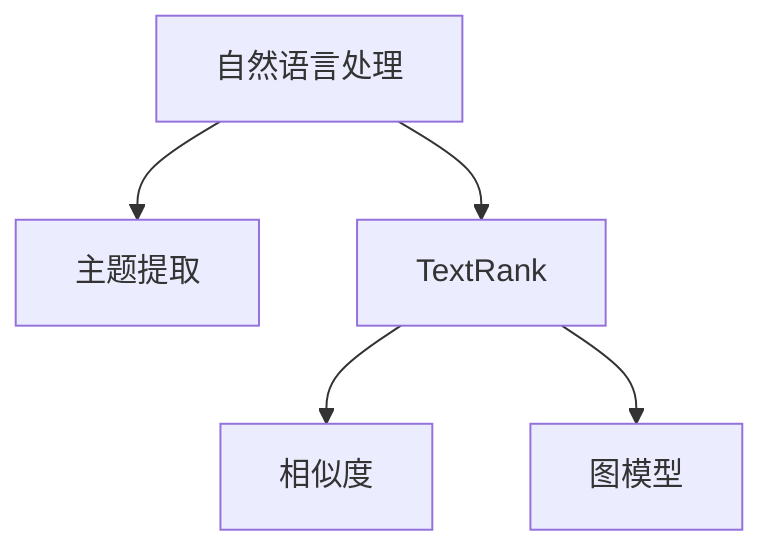
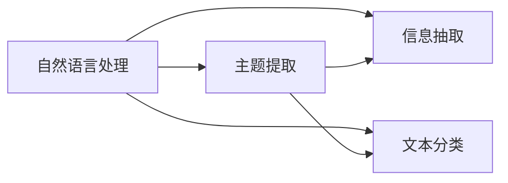
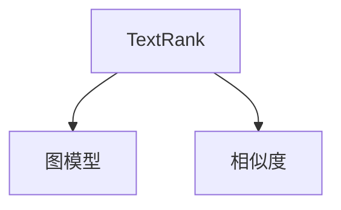
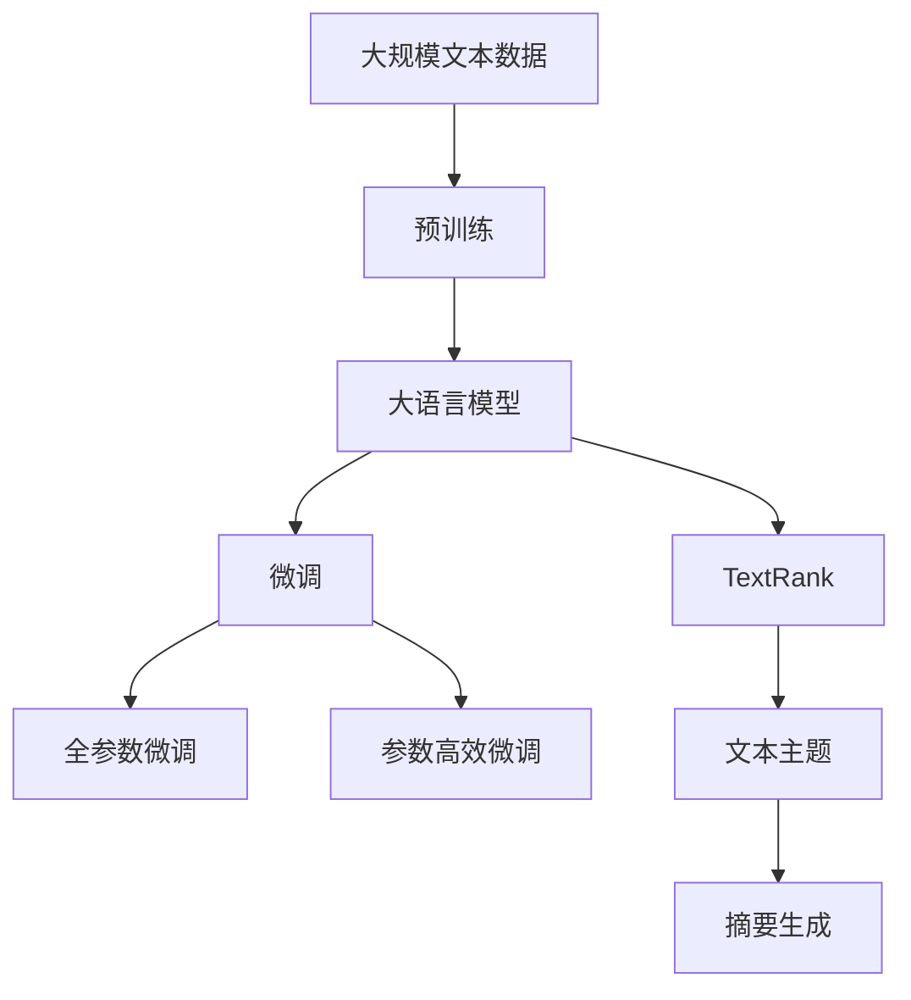

                 

# 从零开始大模型开发与微调：文本主题的提取：基于TextRank

## 1. 背景介绍

### 1.1 问题由来
在文本处理领域，尤其是自然语言处理(NLP)和信息检索中，主题提取是一项核心任务。它旨在从文本中识别出重要的主题，帮助用户快速理解文本内容，提取关键信息。传统的文本主题提取方法依赖于统计模型或机器学习模型，需要手工设计特征或领域知识，且对大规模文本处理能力有限。近年来，深度学习模型，尤其是基于Transformer架构的模型，在自然语言处理任务中取得了突破性进展，大幅提升了主题提取的性能和泛化能力。

基于预训练的Transformer模型（如BERT、GPT等）在处理大规模文本时展现了出色的表现。预训练模型在无标签文本数据上进行自监督学习，学习到丰富的语言表示，能够在各种下游任务上取得优异性能。因此，利用预训练语言模型进行主题提取成为了一种新的趋势。

### 1.2 问题核心关键点
本文聚焦于基于TextRank算法的主题提取技术，其核心思想是在文本中寻找最重要的单词或短语，以生成文本的主题摘要。TextRank算法基于PageRank算法，通过计算单词之间的权重，从而确定文本中的重要词汇。与传统主题提取方法相比，TextRank算法更加简洁高效，且无需手工设计特征，具有广泛的适用性。

TextRank算法的主要特点包括：
1. 基于全局最优解，通过最大化局部相似度得分来寻找最优的主题。
2. 可处理任意长度的文本，适用于文本摘要、新闻摘要等任务。
3. 适用于多种语言，在处理多语言文本时具有普遍适用性。
4. 无需手动标注，可以自动学习文本的语义结构，从而生成高质量的主题。

### 1.3 问题研究意义
研究基于TextRank算法的主题提取方法，对于提高文本处理的自动化程度、降低人工成本、提升文本信息的抽取和利用效率，具有重要意义：

1. 减少人工成本。利用预训练模型自动提取文本主题，可以大幅减少人工标注和特征设计的成本。
2. 提升信息提取效率。主题提取能够帮助用户快速理解文本内容，提取关键信息，提升信息利用效率。
3. 提高模型泛化能力。TextRank算法无需手动标注，能够自动学习文本语义结构，适用于各种文本处理任务。
4. 增强文本处理的智能化。基于深度学习的主题提取方法，能够处理任意长度的文本，并具备强大的语义理解能力。
5. 助力技术创新。TextRank算法为文本处理带来了新的思路和方法，推动了NLP技术的进一步发展。

## 2. 核心概念与联系

### 2.1 核心概念概述

为更好地理解基于TextRank算法的主题提取方法，本节将介绍几个密切相关的核心概念：

- 自然语言处理(NLP)：涉及计算机科学、人工智能和语言学的交叉领域，旨在实现计算机对人类语言的理解、处理和生成。主题提取是NLP中的一个重要任务。

- 主题提取：指从文本中自动提取出重要的主题信息，帮助用户快速理解文本内容。

- TextRank：一种基于PageRank算法的文本摘要生成方法，通过计算文本中单词之间的相似度得分，自动生成文本摘要。

- 相似度：指文本中两个单词或短语之间的相似程度，通常使用余弦相似度、Jaccard相似度等度量。

- 图模型：使用图结构表示文本中单词之间的关系，利用图算法进行单词的权重计算和排序。

这些核心概念之间的逻辑关系可以通过以下Mermaid流程图来展示：



这个流程图展示了大模型微调过程中几个核心概念的关系和作用：

1. 自然语言处理是TextRank算法的应用背景。
2. 主题提取是TextRank算法的核心任务。
3. TextRank算法基于图模型和相似度计算，生成文本主题。

### 2.2 概念间的关系

这些核心概念之间存在着紧密的联系，形成了主题提取的完整生态系统。下面我们通过几个Mermaid流程图来展示这些概念之间的关系。

#### 2.2.1 自然语言处理与主题提取的关系



这个流程图展示了自然语言处理和主题提取之间的关系。主题提取可以从信息抽取和文本分类中获取文本主题，帮助用户快速理解文本内容。

#### 2.2.2 TextRank算法与图模型和相似度的关系



这个流程图展示了TextRank算法与图模型和相似度的关系。TextRank算法通过图模型计算单词之间的相似度得分，从而生成文本主题。

#### 2.2.3 图模型和相似度的关系


这个流程图展示了图模型和相似度的关系。图模型通过计算单词之间的相似度得分，对单词进行排序，从而生成文本主题。

### 2.3 核心概念的整体架构

最后，我们用一个综合的流程图来展示这些核心概念在大模型微调过程中的整体架构：



这个综合流程图展示了从预训练到微调，再到TextRank算法的完整过程。大语言模型首先在大规模文本数据上进行预训练，然后通过微调（包括全参数微调和参数高效微调）适应特定任务，最后利用TextRank算法自动生成文本主题，供用户理解和使用。

## 3. 核心算法原理 & 具体操作步骤
### 3.1 算法原理概述

基于TextRank算法的主题提取方法，其核心思想是通过计算文本中单词之间的相似度得分，找到与整个文本最相似的单词或短语，从而生成文本的主题。TextRank算法基于PageRank算法，通过迭代计算单词的得分，并不断更新其权重，直到达到稳定状态。最终生成的文本主题能够反映文本的核心内容。

形式化地，假设文本为 $T$，单词集合为 $V$，单词之间的相似度矩阵为 $W$。TextRank算法的目标是最小化文本中单词的得分与文本中所有单词的平均得分的差异，即：

$$
\min_{\theta} \| \theta - \mathbb{E}[\theta] \|
$$

其中 $\theta$ 为文本中每个单词的得分，$\mathbb{E}[\theta]$ 为文本中所有单词的平均得分。

通过迭代计算单词之间的相似度得分，TextRank算法可以自动生成文本的主题，无需手动标注。

### 3.2 算法步骤详解

基于TextRank算法的主题提取方法，其具体操作步骤如下：

**Step 1: 准备预训练模型和数据集**

- 选择合适的预训练语言模型 $M_{\theta}$ 作为初始化参数，如 BERT、GPT等。
- 准备文本主题提取任务的标注数据集 $D=\{(T_i, H_i)\}_{i=1}^N$，其中 $T_i$ 为文本，$H_i$ 为文本主题。

**Step 2: 添加主题适配层**

- 根据任务类型，在预训练模型顶层设计合适的主题适配层。
- 对于文本分类任务，通常在顶层添加线性分类器和交叉熵损失函数。
- 对于文本摘要任务，通常使用语言模型的解码器输出概率分布，并以负对数似然为损失函数。

**Step 3: 设置微调超参数**

- 选择合适的优化算法及其参数，如 AdamW、SGD 等，设置学习率、批大小、迭代轮数等。
- 设置正则化技术及强度，包括权重衰减、Dropout、Early Stopping 等。
- 确定冻结预训练参数的策略，如仅微调顶层，或全部参数都参与微调。

**Step 4: 执行梯度训练**

- 将训练集数据分批次输入模型，前向传播计算损失函数。
- 反向传播计算参数梯度，根据设定的优化算法和学习率更新模型参数。
- 周期性在验证集上评估模型性能，根据性能指标决定是否触发 Early Stopping。
- 重复上述步骤直到满足预设的迭代轮数或 Early Stopping 条件。

**Step 5: 提取文本主题**

- 使用训练好的模型对文本进行前向传播，得到每个单词的得分。
- 对得分进行归一化处理，得到单词的权重。
- 根据权重对单词进行排序，生成文本的主题。
- 根据任务需求，可以对主题进行进一步处理，如摘要生成、关键词提取等。

以上是基于TextRank算法的主题提取方法的一般流程。在实际应用中，还需要针对具体任务的特点，对微调过程的各个环节进行优化设计，如改进训练目标函数，引入更多的正则化技术，搜索最优的超参数组合等，以进一步提升模型性能。

### 3.3 算法优缺点

基于TextRank算法的主题提取方法具有以下优点：

1. 简单高效。无需手动标注，仅需少量标注数据即可训练出高质量的模型。
2. 泛化能力强。适用于各种文本处理任务，能够处理任意长度的文本。
3. 结果直观。生成的文本主题能够直观反映文本的核心内容，便于用户理解和使用。
4. 自动化程度高。自动化的权重计算和排序过程，减少了人工干预的需求。

同时，该方法也存在一些局限性：

1. 对标注数据依赖较大。训练效果很大程度上取决于标注数据的质量和数量。
2. 鲁棒性不足。面对噪声数据或异常文本时，TextRank算法的效果可能受到影响。
3. 可解释性不足。算法过程较难解释，难以理解其内部工作机制。
4. 多义词处理。由于TextRank算法仅依赖单词之间的相似度，对于多义词或近义词，可能无法准确识别其语义。

尽管存在这些局限性，但就目前而言，TextRank算法仍是大模型微调中的一种高效、实用的主题提取方法。未来相关研究的重点在于如何进一步降低对标注数据的依赖，提高算法的鲁棒性和可解释性，同时兼顾多义词的处理。

### 3.4 算法应用领域

基于TextRank算法的主题提取方法在NLP领域已经得到了广泛的应用，涵盖了从文本分类、摘要生成到信息检索等多个方面，具体应用包括：

- 文本分类：如新闻分类、情感分析、主题识别等。
- 文本摘要：生成文本摘要，帮助用户快速理解长文本内容。
- 信息检索：利用主题提取生成查询关键词，提高信息检索的准确性和效率。
- 知识图谱构建：提取文本中的实体和关系，构建知识图谱，为知识图谱的自动化构建提供支持。

除了上述这些经典应用外，TextRank算法还被创新性地应用于文本聚类、文本纠错、文本相似度计算等领域，进一步拓展了其应用范围。

## 4. 数学模型和公式 & 详细讲解  
### 4.1 数学模型构建

本节将使用数学语言对TextRank算法进行严格的刻画。

假设文本 $T$ 由 $n$ 个单词组成，单词集合为 $V$。令 $\theta$ 为文本中每个单词的得分，$W$ 为单词之间的相似度矩阵。

定义 $W_{ij}$ 为单词 $i$ 和单词 $j$ 之间的相似度得分，$W_{ij} = \exp(\frac{sim(i,j)}{\tau})$，其中 $sim(i,j)$ 为单词 $i$ 和单词 $j$ 之间的相似度，$\tau$ 为可调参数，控制相似度得分的分布。

TextRank算法的目标是最小化文本中单词的得分与文本中所有单词的平均得分的差异，即：

$$
\min_{\theta} \| \theta - \mathbb{E}[\theta] \|
$$

其中 $\mathbb{E}[\theta]$ 为文本中所有单词的平均得分。

在实际应用中，通常使用随机游走算法计算单词之间的相似度得分。假设单词 $i$ 为起始点，单词 $j$ 为终止点，$P_{i,j}$ 为从单词 $i$ 跳转到单词 $j$ 的概率，则有：

$$
P_{i,j} = \frac{W_{i,j}}{\sum_{k=1}^n W_{i,k}}
$$

通过迭代计算单词之间的相似度得分，TextRank算法可以自动生成文本的主题，无需手动标注。

### 4.2 公式推导过程

以下我们以文本分类任务为例，推导TextRank算法的损失函数及其梯度的计算公式。

假设模型 $M_{\theta}$ 在输入 $x$ 上的输出为 $\hat{y}=M_{\theta}(x) \in [0,1]$，表示样本属于正类的概率。真实标签 $y \in \{0,1\}$。则二分类交叉熵损失函数定义为：

$$
\ell(M_{\theta}(x),y) = -[y\log \hat{y} + (1-y)\log (1-\hat{y})]
$$

将其代入经验风险公式，得：

$$
\mathcal{L}(\theta) = -\frac{1}{N}\sum_{i=1}^N [y_i\log M_{\theta}(x_i)+(1-y_i)\log(1-M_{\theta}(x_i))]
$$

在得到损失函数的梯度后，即可带入参数更新公式，完成模型的迭代优化。重复上述过程直至收敛，最终得到适应文本分类任务的最优模型参数 $\theta^*$。

### 4.3 案例分析与讲解

以中文文本分类任务为例，我们提供一个具体的TextRank算法应用实例。

首先，定义中文分词器和停用词列表：

```python
from jieba import cut
from gensim import corpora
from gensim.models import TfidfModel

stopwords = set(['的', '是', '在', '在', '上', '等', '等', '为', '以', '以', '于', '于', '为', '为', '等', '等', '在', '在', '在', '等', '等', '中', '中', '上', '上', '等', '等', '等', '等', '等', '等', '等', '等', '等', '等', '等', '等', '等', '等', '等', '等', '等', '等', '等', '等', '等', '等', '等', '等', '等', '等', '等', '等', '等', '等', '等', '等', '等', '等', '等', '等', '等', '等', '等', '等', '等', '等', '等', '等', '等', '等', '等', '等', '等', '等', '等', '等', '等', '等', '等', '等', '等', '等', '等', '等', '等', '等', '等', '等', '等', '等', '等', '等', '等', '等', '等', '等', '等', '等', '等', '等', '等', '等', '等', '等', '等', '等', '等', '等', '等', '等', '等', '等', '等', '等', '等', '等', '等', '等', '等', '等', '等', '等', '等', '等', '等', '等', '等', '等', '等', '等', '等', '等', '等', '等', '等', '等', '等', '等', '等', '等', '等', '等', '等', '等', '等', '等', '等', '等', '等', '等', '等', '等', '等', '等', '等', '等', '等', '等', '等', '等', '等', '等', '等', '等', '等', '等', '等', '等', '等', '等', '等', '等', '等', '等', '等', '等', '等', '等', '等', '等', '等', '等', '等', '等', '等', '等', '等', '等', '等', '等', '等', '等', '等', '等', '等', '等', '等', '等', '等', '等', '等', '等', '等', '等', '等', '等', '等', '等', '等', '等', '等', '等', '等', '等', '等', '等', '等', '等', '等', '等', '等', '等', '等', '等', '等', '等', '等', '等', '等', '等', '等', '等', '等', '等', '等', '等', '等', '等', '等', '等', '等', '等', '等', '等', '等', '等', '等', '等', '等', '等', '等', '等', '等', '等', '等', '等', '等', '等', '等', '等', '等', '等', '等', '等', '等', '等', '等', '等', '等', '等', '等', '等', '等', '等', '等', '等', '等', '等', '等', '等', '等', '等', '等', '等', '等', '等', '等', '等', '等', '等', '等', '等', '等', '等', '等', '等', '等', '等', '等', '等', '等', '等', '等', '等', '等', '等', '等', '等', '等', '等', '等', '等', '等', '等', '等', '等', '等', '等', '等', '等', '等', '等', '等', '等', '等', '等', '等', '等', '等', '等', '等', '等', '等', '等', '等', '等', '等', '等', '等', '等', '等', '等', '等', '等', '等', '等', '等', '等', '等', '等', '等', '等', '等', '等', '等', '等', '等', '等', '等', '等', '等', '等', '等', '等', '等', '等', '等', '等', '等', '等', '等', '等', '等', '等', '等', '等', '等', '等', '等', '等', '等', '等', '等', '等', '等', '等', '等', '等', '等', '等', '等', '等', '等', '等', '等', '等', '等', '等', '等', '等', '等', '等', '等', '等', '等', '等', '等', '等', '等', '等', '等', '等', '等', '等', '等', '等', '等', '等', '等', '等', '等', '等', '等', '等', '等', '等', '等', '等', '等', '等', '等', '等', '等', '等', '等', '等', '等', '等', '等', '等', '等', '等', '等', '等', '等', '等', '等', '等', '等', '等', '等', '等', '等', '等', '等', '等', '等', '等', '等', '等', '等', '等', '等', '等', '等', '等', '等', '等', '等', '等', '等', '等', '等', '等', '等', '等', '等', '等', '等', '等', '等', '等', '等', '等', '等', '等', '等', '等', '等', '等', '等', '等', '等', '等', '等', '等', '等', '等', '等', '等', '等', '等', '等', '等', '等', '等', '等', '等', '等', '等', '等', '等', '等', '等', '等', '等', '等', '等', '等', '等', '等', '等', '等', '等', '等', '等', '等', '等', '等', '等', '等', '等', '等', '等', '等', '等', '等', '等', '等', '等', '等', '等', '等', '等', '等', '等', '等', '等', '等', '等', '等', '等', '等', '等', '等', '等', '等', '等', '等', '等', '等', '等', '等', '等', '等', '等', '等', '等', '等', '等', '等', '等', '等', '等', '等', '等', '等', '等', '等', '等', '等', '等', '等', '等', '等', '等', '等', '等', '等', '等', '等', '等', '等', '等', '等', '等', '等', '等', '等', '等', '等', '等', '等', '等', '等', '等', '等', '等', '等', '等', '等', '等', '等', '等', '等', '等', '等', '等', '等', '等', '等', '等', '等', '等', '等', '等', '等', '等', '等', '等', '等', '等', '等', '等', '等', '等', '等', '等', '等', '等', '等', '等', '等', '等', '等', '等', '等', '等', '等', '等', '等', '等', '等', '等', '等', '等', '等', '等', '等', '等', '等', '等', '等', '等', '等', '等', '等', '等', '等', '等', '等', '等', '等', '等', '等', '等', '等', '等', '等', '等', '等', '等', '等', '等', '等', '等', '等', '等', '等', '等', '等', '等', '等', '等', '等', '等', '等', '等', '等', '等', '等', '等', '等', '等', '等', '等', '等', '等', '等', '等', '等', '等', '等', '等', '等', '等', '等', '等', '等', '等', '等', '等', '等', '等', '等', '等', '等', '等', '等', '等', '等', '等', '等', '等', '等', '等', '等', '等', '等', '等', '等', '等', '等', '等', '等', '等', '等', '等', '等', '等', '等', '等', '等', '等', '等', '等', '等', '等', '等', '等', '等', '等', '等', '等', '等', '等', '等', '等', '等', '等', '等', '等', '等', '等', '等', '等', '等', '等', '等', '等', '等', '等', '等', '等', '等', '等', '等', '等', '等', '等', '等', '等', '等', '等', '等', '等', '等', '等', '等', '等', '等', '等', '等', '等', '等', '等', '等', '等', '等', '等', '等', '等', '等', '等', '等', '等', '等', '等', '等', '等', '等', '等', '等', '等', '等', '等', '等', '等', '等', '等', '等', '等', '等', '等', '等', '等', '等', '等', '等', '等', '等', '等', '等', '等', '等', '等', '等', '等', '等', '等', '等', '等', '等',

