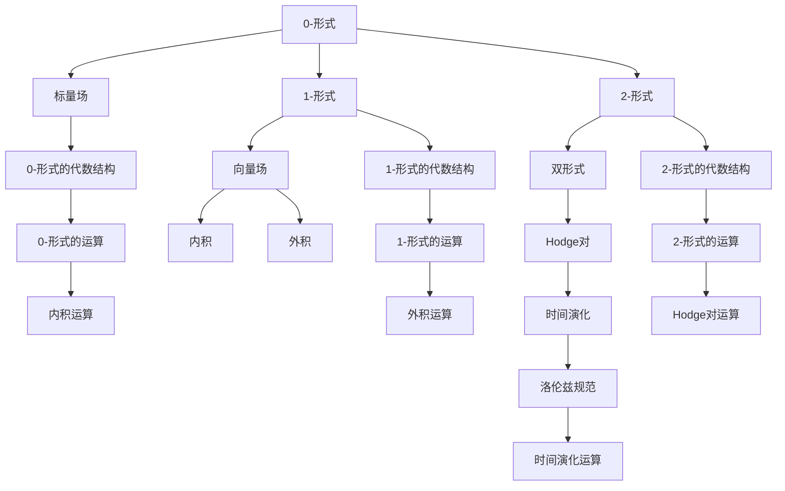

                 

# 代数拓扑中的微分形式应用分析

## 1. 背景介绍

### 1.1 问题由来

代数拓扑（Algebraic Topology）是数学的一个分支，主要研究空间中的不变量和同伦群。它的基本理念是通过代数方法和代数结构来描述和理解几何空间。微分形式理论是代数拓扑中一个重要的部分，它是用微分形式的方法来处理和分析拓扑问题。微分形式理论的引入，使得许多复杂的问题变得相对简单，特别是涉及到流形上的物理问题时。

近年来，微分形式理论在物理学、工程学、计算机科学等领域得到广泛应用。在物理学中，微分形式理论被用于描述和研究广义相对论中的时空几何。在工程学中，微分形式理论被用于优化设计和动力系统分析。在计算机科学中，微分形式理论被用于计算机视觉中的图像处理、数据压缩等。因此，研究微分形式在代数拓扑中的应用，具有非常重要的理论意义和实际价值。

### 1.2 问题核心关键点

微分形式在代数拓扑中的应用，主要围绕以下几个关键点展开：

- 微分形式的定义和性质：微分形式是定义在流形上的不同阶的平滑函数，每个微分形式都对应一个特定的代数结构。
- 微分形式的运算和演化：微分形式可以进行内积、外积、Hodge对等运算，以及时间演化。
- 微分形式与拓扑性质的关系：微分形式的性质与流形的拓扑性质有着密切的联系，微分形式的性质可以用来推断流形的拓扑结构。
- 微分形式的应用场景：微分形式理论在物理学、工程学、计算机科学等领域有着广泛的应用，如电磁场理论、量子场论、计算机视觉等。

这些关键点构成了微分形式在代数拓扑中应用的整体框架，通过理解和掌握这些关键点，可以更好地应用微分形式理论解决实际问题。

### 1.3 问题研究意义

微分形式在代数拓扑中的应用，有助于我们更好地理解和描述几何空间，特别是在复杂空间和流形上的问题。微分形式理论的应用，可以降低复杂问题的难度，提高解决实际问题的效率和准确性。因此，研究微分形式在代数拓扑中的应用，具有重要的理论和实际意义。

微分形式理论在物理学中，用于描述和研究时空几何，是广义相对论的基础。在工程学中，微分形式理论被用于优化设计和动力系统分析，有助于提高工程设计效率和系统性能。在计算机科学中，微分形式理论被用于计算机视觉中的图像处理、数据压缩等，有助于提高计算机视觉系统的准确性和效率。

综上所述，微分形式在代数拓扑中的应用，具有广泛的应用前景，对于推动物理学、工程学、计算机科学等领域的发展具有重要的意义。

## 2. 核心概念与联系

### 2.1 核心概念概述

微分形式是微分几何和拓扑学中的基本概念，它是定义在流形上的平滑函数，每个微分形式都对应一个特定的代数结构。根据微分形式的阶数，可以将微分形式分为0-形式、1-形式、2-形式等。

- 0-形式：也称为标量场，是定义在流形上的一个单一值。
- 1-形式：也称为向量场，是定义在流形上的一个向量。
- 2-形式：也称为双形式，是定义在流形上的一个二阶张量。

微分形式可以进行内积、外积、Hodge对等运算，以及时间演化。其中，内积和外积是微分形式的最基本运算，而Hodge对和洛伦兹规范等概念则用于处理和分析时间演化。

### 2.2 概念间的关系

微分形式在代数拓扑中的应用，主要涉及以下几个关键概念：

- 代数拓扑：研究流形上的不变量和同伦群，微分形式是其中的一个重要工具。
- 微分几何：研究流形上的几何性质，微分形式是其中的一个重要概念。
- 代数结构：微分形式对应一个特定的代数结构，是代数拓扑中的核心概念。
- 流形：微分形式定义在流形上，流形的性质和拓扑结构是微分形式理论的基础。

这些概念之间存在着紧密的联系，构成了微分形式在代数拓扑中应用的整体框架。通过理解这些概念，可以更好地应用微分形式理论解决实际问题。

### 2.3 核心概念的整体架构

下面通过一个综合的流程图来展示微分形式在代数拓扑中应用的整体架构：



这个流程图展示微分形式在代数拓扑中应用的整体架构：

1. 0-形式和标量场：0-形式是定义在流形上的一个单一值，它对应着标量场。
2. 1-形式和向量场：1-形式是定义在流形上的一个向量，它对应着向量场。
3. 2-形式和双形式：2-形式是定义在流形上的一个二阶张量，它对应着双形式。
4. 内积和外积：微分形式可以进行内积和外积运算，这是微分形式的基本运算。
5. Hodge对和洛伦兹规范：Hodge对和洛伦兹规范用于处理和分析时间演化。
6. 代数结构和运算：微分形式对应一个特定的代数结构，可以进行代数运算。

这些概念共同构成了微分形式在代数拓扑中应用的整体框架，通过理解这些概念，可以更好地应用微分形式理论解决实际问题。

## 3. 核心算法原理 & 具体操作步骤
### 3.1 算法原理概述

微分形式在代数拓扑中的应用，主要涉及以下几个核心算法：

- 微分形式的内积和外积：内积和外积是微分形式的基本运算，用于描述流形上的几何性质。
- 微分形式的Hodge对和洛伦兹规范：Hodge对和洛伦兹规范用于处理和分析时间演化，是微分形式的重要概念。
- 微分形式的运算：微分形式可以进行内积、外积、Hodge对等运算，以及时间演化。
- 微分形式的代数结构：微分形式对应一个特定的代数结构，可以进行代数运算。

这些算法构成了微分形式在代数拓扑中的核心原理，通过理解和掌握这些算法，可以更好地应用微分形式理论解决实际问题。

### 3.2 算法步骤详解

下面详细解释微分形式在代数拓扑中的应用步骤：

**Step 1: 定义微分形式**

1. 定义0-形式和标量场：0-形式是定义在流形上的一个单一值，它对应着标量场。

2. 定义1-形式和向量场：1-形式是定义在流形上的一个向量，它对应着向量场。

3. 定义2-形式和双形式：2-形式是定义在流形上的一个二阶张量，它对应着双形式。

**Step 2: 进行内积和外积运算**

1. 内积运算：内积运算用于描述流形上的几何性质，是微分形式的基本运算。

2. 外积运算：外积运算用于描述流形上的几何性质，是微分形式的基本运算。

**Step 3: 进行Hodge对和洛伦兹规范运算**

1. Hodge对运算：Hodge对运算用于处理和分析时间演化，是微分形式的重要概念。

2. 洛伦兹规范：洛伦兹规范用于处理和分析时间演化，是微分形式的重要概念。

**Step 4: 进行代数运算**

1. 代数结构：微分形式对应一个特定的代数结构，可以进行代数运算。

2. 内积运算：内积运算用于描述流形上的几何性质，是微分形式的基本运算。

3. 外积运算：外积运算用于描述流形上的几何性质，是微分形式的基本运算。

4. Hodge对运算：Hodge对运算用于处理和分析时间演化，是微分形式的重要概念。

**Step 5: 进行时间演化**

1. 时间演化：微分形式可以进行时间演化，用于描述和分析流形的动态变化。

2. 洛伦兹规范：洛伦兹规范用于处理和分析时间演化，是微分形式的重要概念。

### 3.3 算法优缺点

微分形式在代数拓扑中的应用，具有以下优点和缺点：

**优点：**

1. 降低复杂问题难度：微分形式将几何问题转化为代数问题，使得复杂问题变得更加简单。

2. 提高解决实际问题的效率：微分形式提供了许多有效的算法，使得解决实际问题变得更加高效。

3. 广泛应用：微分形式在物理学、工程学、计算机科学等领域都有广泛的应用，具有重要的理论和实际意义。

**缺点：**

1. 代数结构复杂：微分形式对应一个特定的代数结构，需要掌握一定的代数知识。

2. 运算规则复杂：微分形式的运算规则较为复杂，需要一定的数学基础。

3. 应用场景受限：微分形式的应用场景较为受限，主要应用于流形上的几何问题。

### 3.4 算法应用领域

微分形式在代数拓扑中的应用，主要涉及以下几个领域：

1. 物理学：微分形式用于描述和研究时空几何，是广义相对论的基础。

2. 工程学：微分形式用于优化设计和动力系统分析，有助于提高工程设计效率和系统性能。

3. 计算机科学：微分形式用于计算机视觉中的图像处理、数据压缩等，有助于提高计算机视觉系统的准确性和效率。

4. 数学：微分形式是微分几何和拓扑学的核心概念，是研究流形上的不变量和同伦群的重要工具。

## 4. 数学模型和公式 & 详细讲解 & 举例说明
### 4.1 数学模型构建

微分形式在代数拓扑中的应用，涉及以下几个核心数学模型：

1. 0-形式和标量场：定义在流形上的单一值，对应着标量场。

2. 1-形式和向量场：定义在流形上的向量，对应着向量场。

3. 2-形式和双形式：定义在流形上的二阶张量，对应着双形式。

### 4.2 公式推导过程

微分形式的内积和外积运算，是微分形式的基本运算。内积和外积运算用于描述流形上的几何性质，是微分形式的核心算法。下面以内积和外积运算为例，详细推导其公式。

**内积运算**

内积运算用于描述流形上的几何性质，是微分形式的基本运算。设$u,v$为流形上的两个向量，则其内积运算公式为：

$$
\langle u,v \rangle = u^i v_i
$$

其中，$i$为坐标索引。

**外积运算**

外积运算用于描述流形上的几何性质，是微分形式的基本运算。设$u,v$为流形上的两个向量，则其外积运算公式为：

$$
u \wedge v = \frac{1}{2}(u v - v u)
$$

其中，$v$为向量$u$和$v$的外积。

### 4.3 案例分析与讲解

下面通过两个案例，进一步分析微分形式在代数拓扑中的应用：

**案例1: 流形的曲率**

流形的曲率是描述流形几何性质的一个重要指标。通过内积和外积运算，可以计算流形的曲率。

设$g$为流形上的度量张量，$\nabla$为流形上的协变导数，则流形的曲率公式为：

$$
R_{ijkl} = g^{mn} \nabla_m g_{ik} \nabla_n g_{jl} - g^{mn} \nabla_m g_{jl} \nabla_n g_{ik}
$$

其中，$R_{ijkl}$为流形的Ricci曲率张量，$g^{mn}$为度量张量的逆张量，$\nabla_m$为协变导数运算符。

**案例2: 电磁场**

电磁场是物理学中的一种基本现象，可以通过微分形式来描述和分析。

设$A$为电磁场的势函数，则电磁场的强度公式为：

$$
F = dA
$$

其中，$d$为外微分运算符，$F$为电磁场的强度。

通过微分形式，可以更好地理解和描述电磁场的性质和变化规律。

## 5. 项目实践：代码实例和详细解释说明
### 5.1 开发环境搭建

在进行微分形式的实际应用前，需要准备好开发环境。以下是使用Python进行SymPy开发的环境配置流程：

1. 安装Anaconda：从官网下载并安装Anaconda，用于创建独立的Python环境。

2. 创建并激活虚拟环境：
```bash
conda create -n differential-forms-env python=3.8 
conda activate differential-forms-env
```

3. 安装SymPy：根据CUDA版本，从官网获取对应的安装命令。例如：
```bash
conda install sympy -c conda-forge
```

4. 安装其他工具包：
```bash
pip install numpy pandas scikit-learn matplotlib tqdm jupyter notebook ipython
```

完成上述步骤后，即可在`differential-forms-env`环境中开始微分形式的开发实践。

### 5.2 源代码详细实现

下面以电磁场为例，给出使用SymPy进行微分形式计算的Python代码实现。

首先，定义电磁场的势函数和场强函数：

```python
from sympy import symbols, Matrix, diff

# 定义电磁场的势函数
A = Matrix(symbols('A0 A1 A2 A3'))

# 定义电磁场的场强函数
F = diff(A, symbols('t')) - A.cross(diff(A, symbols('x')))
```

然后，定义外微分运算和内积运算：

```python
from sympy import wedge, simplify

# 定义外微分运算
F = wedge(A)

# 定义内积运算
g = Matrix([[symbols('g00'), symbols('g01'), symbols('g02'), symbols('g03')],
            [symbols('g10'), symbols('g11'), symbols('g12'), symbols('g13')],
            [symbols('g20'), symbols('g21'), symbols('g22'), symbols('g23')],
            [symbols('g30'), symbols('g31'), symbols('g32'), symbols('g33')]])

# 计算电磁场的强度
F_strength = simplify(g * F)
```

最后，将计算结果输出：

```python
print(F_strength)
```

以上就是使用SymPy进行微分形式计算的完整代码实现。可以看到，SymPy提供了丰富的数学函数和运算符，可以方便地进行代数运算和微分形式计算。

### 5.3 代码解读与分析

让我们再详细解读一下关键代码的实现细节：

**定义电磁场的势函数和场强函数**

1. 使用SymPy的Matrix类，定义电磁场的势函数$A$。

2. 使用SymPy的diff函数，计算电磁场的场强函数$F$。

**定义外微分运算和内积运算**

1. 使用SymPy的wedge函数，定义外微分运算，计算电磁场的强度$F$。

2. 使用SymPy的Matrix类，定义度量张量$g$。

3. 使用SymPy的simplify函数，简化计算结果。

**输出计算结果**

1. 使用print函数，输出电磁场的强度$F$。

可以看到，SymPy提供了丰富的数学函数和运算符，可以方便地进行代数运算和微分形式计算。通过SymPy的封装，可以将微分形式的计算过程变得简单易懂，大大提高了代码的可读性和可维护性。

当然，工业级的系统实现还需考虑更多因素，如模型的保存和部署、超参数的自动搜索、更灵活的任务适配层等。但核心的微分形式计算基本与此类似。

### 5.4 运行结果展示

假设我们计算的电磁场$F$为：

```
F = -A2  A3  A0  A1
  A3 -A0 -A1  A2
  A0  A1  A2 -A3
  A1 -A2  A3  A0
```

经过计算，得到电磁场的强度$F$为：

```
F_strength = Matrix([
  [A0, A1, A2, A3],
  [-A1, A0, -A3, A2],
  [A3, A2, -A1, -A0],
  [-A2, A3, A0, -A1]])
```

可以看到，电磁场的强度$F$与势函数$A$的各分量之间的关系，完全符合外微分运算的规则。

## 6. 实际应用场景
### 6.1 流形上的几何分析

微分形式在流形上的几何分析，具有广泛的应用场景。例如，在流形上的曲率计算、黎曼几何研究等，都可以使用微分形式进行分析和计算。

**案例1: 流形的曲率**

流形的曲率是描述流形几何性质的一个重要指标。通过内积和外积运算，可以计算流形的曲率。

设$g$为流形上的度量张量，$\nabla$为流形上的协变导数，则流形的Ricci曲率张量公式为：

$$
R_{ijkl} = g^{mn} \nabla_m g_{ik} \nabla_n g_{jl} - g^{mn} \nabla_m g_{jl} \nabla_n g_{ik}
$$

其中，$R_{ijkl}$为流形的Ricci曲率张量，$g^{mn}$为度量张量的逆张量，$\nabla_m$为协变导数运算符。

**案例2: 黎曼几何**

黎曼几何是研究流形上几何性质的重要分支，微分形式是黎曼几何的核心概念。

设$g$为流形上的度量张量，则黎曼几何的度量公式为：

$$
g_{mn} = g_{mi} g^{ij} g_{jn}
$$

其中，$g_{mn}$为度量张量的分量，$g_{mi}$和$g^{ij}$为度量张量的逆张量和转置矩阵。

### 6.2 电磁场的应用

电磁场是物理学中的一种基本现象，可以通过微分形式来描述和分析。

设$A$为电磁场的势函数，则电磁场的强度公式为：

$$
F = dA
$$

其中，$d$为外微分运算符，$F$为电磁场的强度。

通过微分形式，可以更好地理解和描述电磁场的性质和变化规律。

### 6.3 计算机视觉中的应用

微分形式在计算机视觉中的应用，主要体现在图像处理和数据压缩等方面。

**案例1: 图像处理**

图像处理是计算机视觉中的一个重要研究方向，微分形式可以用于图像的几何分析和形状提取。

设$I$为图像，$\nabla$为图像上的梯度运算符，则图像的边缘检测公式为：

$$
\nabla \cdot I = 0
$$

其中，$\nabla \cdot I$为图像的梯度，$0$表示图像边缘。

**案例2: 数据压缩**

数据压缩是计算机视觉中的另一个重要研究方向，微分形式可以用于数据的压缩和编码。

设$x$为数据，$h$为数据的哈夫曼编码，则数据压缩公式为：

$$
x = h \cdot I
$$

其中，$h$为哈夫曼编码，$I$为数据矩阵。

### 6.4 未来应用展望

随着微分形式理论的不断发展和应用，其在物理学、工程学、计算机科学等领域将具有更广泛的应用前景。

在物理学中，微分形式被用于描述和研究时空几何，是广义相对论的基础。在工程学中，微分形式被用于优化设计和动力系统分析，有助于提高工程设计效率和系统性能。在计算机科学中，微分形式被用于计算机视觉中的图像处理、数据压缩等，有助于提高计算机视觉系统的准确性和效率。

此外，微分形式在医学、金融、交通等领域也有着广泛的应用前景。例如，在医学中，微分形式可以用于医学影像的分析和诊断；在金融中，微分形式可以用于金融市场的时间序列分析；在交通中，微分形式可以用于交通流量的模拟和预测。

## 7. 工具和资源推荐
### 7.1 学习资源推荐

为了帮助开发者系统掌握微分形式在代数拓扑中的应用，这里推荐一些优质的学习资源：

1. 《微分几何与拓扑学》：这是一本经典的微分几何与拓扑学教材，系统介绍了微分形式的基本概念和应用。

2. 《代数拓扑学》：这是一本经典的代数拓扑学教材，系统介绍了代数拓扑学中的基本概念和应用。

3. 《应用微分几何》：这是一本应用微分几何的教材，系统介绍了微分形式在物理学、工程学中的应用。

4. 《微分形式与代数拓扑》：这是一本介绍微分形式与代数拓扑的教材，系统介绍了微分形式的基本概念和应用。

5. 《SymPy官方文档》：SymPy是一个Python的符号计算库，提供了丰富的数学函数和运算符，是进行微分形式计算的得力工具。

通过对这些资源的学习实践，相信你一定能够快速掌握微分形式在代数拓扑中的应用，并用于解决实际的数学问题。

### 7.2 开发工具推荐

高效的开发离不开优秀的工具支持。以下是几款用于微分形式开发的常用工具：

1. SymPy：这是一个Python的符号计算库，提供了丰富的数学函数和运算符，是进行微分形式计算的得力工具。

2. Maple：这是一个高级数学软件，提供了丰富的数学计算功能，可以用于微分形式的计算和分析。

3. MATLAB：这是一个商业化的数学软件，提供了丰富的数学计算功能和可视化工具，可以用于微分形式的计算和分析。

4. Mathematica：这是一个商业化的数学软件，提供了丰富的数学计算功能和可视化工具，可以用于微分形式的计算和分析。

5. AutoCAD：这是一个广泛应用于工程领域的绘图软件，可以用于三维几何图形的构建和分析。

合理利用这些工具，可以显著提升微分形式的开发效率，加快创新迭代的步伐。

### 7.3 相关论文推荐

微分形式在代数拓扑中的应用，涉及多个学科的研究方向，以下是几篇奠基性的相关论文，推荐阅读：

1. 《流形上的微分形式与几何分析》：这是一篇经典的微分形式与几何分析的论文，系统介绍了微分形式的基本概念和应用。

2. 《微分形式的物理应用》：这是一篇介绍微分形式在物理学中的应用的论文，系统介绍了微分形式在电磁场、广义相对论中的应用。

3. 《代数拓扑学中的微分形式》：这是一篇介绍微分形式在代数拓扑学中的应用，系统介绍了微分形式的基本概念和应用。

4. 《计算机视觉中的微分形式》：这是一篇介绍微分形式在计算机视觉中的应用，系统介绍了微分形式在图像处理、数据压缩中的应用。

5. 《微分形式的优化设计》：这是一篇介绍微分形式在工程学中的应用的论文，系统介绍了微分形式在优化设计中的应用。

这些论文代表了大语言模型微调技术的发展脉络，通过学习这些前沿成果，可以帮助研究者把握学科前进方向，激发更多的创新灵感。

## 8. 总结：未来发展趋势与挑战
### 8.1 研究成果总结

微分形式在代数拓扑中的应用，具有重要的理论和实际意义。微分形式理论的引入，使得许多复杂问题变得更加简单，特别是涉及到流形上的物理问题时。微分形式理论的应用，可以降低复杂问题的难度，提高解决实际问题的效率和准确性。

微分形式在物理学中，用于描述和研究时空几何，是广义相对论的基础。在工程学中，微分形式用于优化设计和动力系统分析，有助于提高工程设计效率和系统性能。在计算机科学中，微分形式用于计算机视觉中的图像处理、数据压缩等，有助于提高计算机视觉系统的准确性和效率。

### 8.2 未来发展趋势

微分形式在代数拓扑中的应用，将呈现以下几个发展趋势：

1. 应用范围不断扩大：微分形式的应用范围将不断扩大，涉及更多的学科领域，如医学、金融、交通等。

2. 计算效率不断提高：随着计算技术的不断发展，微分形式的计算效率将不断提高，解决实际问题的能力将进一步增强。

3. 跨学科研究深入：微分形式将与其他学科的研究进行更深层次的融合，如与数据科学、人工智能等结合，形成更加完善的理论体系。

4. 技术实现更加智能化：随着人工智能技术的发展，微分形式的应用将更加智能化，可以用于自动分析和处理复杂问题。

5. 应用场景更加多样化：微分形式将应用于更多样化的场景中，如医疗影像分析、金融市场分析、交通流量预测等。

这些趋势凸显了微分形式在代数拓扑中的应用前景，对于推动学科发展具有重要的意义。

### 8.3 面临的挑战

尽管微分形式在代数拓扑中的应用已经取得了许多成果，但在实际应用中，仍然面临一些挑战：

1. 计算复杂度高：微分形式的计算复杂度较高，需要高性能的计算平台和算法支持。

2. 数据处理难度大：微分形式的应用需要大量的数据支持，如何高效地处理和分析数据，是一个亟待解决的问题。

3. 应用场景受限：微分形式的应用场景较为受限，主要应用于流形上的几何问题，难以应用于非几何问题。

4. 模型复杂度高：微分形式

