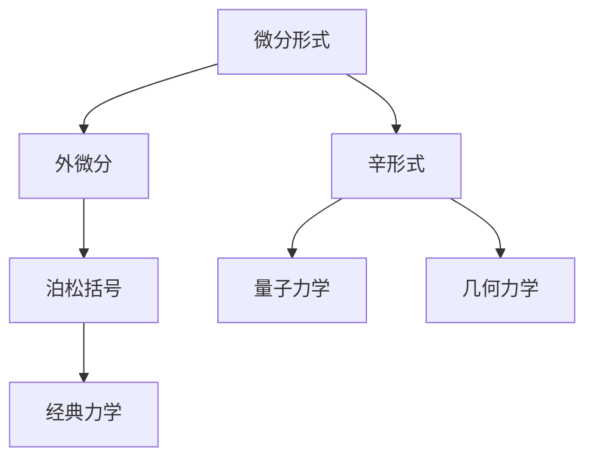

                 

# 代数拓扑中的微分形式应用实例研究

## 1. 背景介绍

### 1.1 问题由来
代数拓扑在现代数学中扮演着重要角色，特别是在几何、动力系统、代数组合等领域中。微分形式作为代数拓扑中的关键工具，提供了一种对流形及其局部的结构进行描述的方法。其在物理学、工程学等领域有着广泛的应用，如量子场论、流体力学、机器人学等。

然而，微分形式的抽象概念和复杂计算常常令初学者望而却步。本研究将通过具体实例，深入浅出地讲解微分形式的应用，并结合具体数学模型，展示其在高阶数学和应用科学中的强大威力。

## 2. 核心概念与联系

### 2.1 核心概念概述

为了更好地理解微分形式在代数拓扑中的应用，首先需要介绍几个关键概念：

- **微分形式**：数学领域的一个高级概念，用于描述流形上的局部结构。每个微分形式都由一组函数构成，每个函数对应于流形上的一点及其邻域。微分形式是流形上连续函数的集合，具有内积结构。

- **外微分**：微分形式的一种运算，用于描述流形的局部结构随局部坐标的变化。外微分运算有两个基本性质：协变性和抗交换性。

- **泊松括号**：一个重要的代数结构，用于描述多个物理量之间的动态关系。在经典力学中，泊松括号用于描述粒子的位置和动量之间的关系。

- **辛形式**：一类特殊的微分形式，用于描述辛流形上的动力学系统。辛形式在经典力学、量子力学和几何力学中有着广泛的应用。

这些核心概念之间有着紧密的联系，构成了微分形式在代数拓扑中的核心理论框架。

### 2.2 概念间的关系

通过以下Mermaid流程图来展示这些核心概念之间的关系：



这个流程图展示了微分形式及其运算和应用场景之间的联系。外微分和泊松括号是微分形式的重要运算和结构，而辛形式则是微分形式在经典力学、量子力学和几何力学中的特殊应用。

## 3. 核心算法原理 & 具体操作步骤
### 3.1 算法原理概述

微分形式的应用主要体现在对流形结构的描述和计算上。其核心原理是通过外微分运算和泊松括号，描述流形上局部坐标的变化和动态关系。下面将通过具体例子，展示微分形式在几何、物理学中的应用。

### 3.2 算法步骤详解

#### 3.2.1 几何应用
对于任意光滑流形 $M$，微分形式 $\omega$ 在点 $p \in M$ 处的外微分为：
$$
d\omega(p) = \sum_i \frac{\partial F_i}{\partial x^j} dx^j \wedge dx^i
$$
其中 $F_i$ 是微分形式 $\omega$ 在点 $p$ 处的各分量，$dx^j$ 和 $dx^i$ 是局部坐标系的基向量。

具体步骤包括：
1. 选择局部坐标系，计算各分量 $F_i$。
2. 计算各分量之间的导数 $\frac{\partial F_i}{\partial x^j}$。
3. 将导数代入上述公式，计算外微分的结果。

#### 3.2.2 物理应用
在经典力学中，势能 $V$ 和动量 $p$ 可以通过泊松括号 $\{ V, p \}$ 描述。泊松括号定义为：
$$
\{ V, p \} = \frac{\partial V}{\partial q_i} \frac{\partial p}{\partial \dot{q}_i} - \frac{\partial V}{\partial \dot{q}_i} \frac{\partial p}{\partial q_i}
$$
其中 $q_i$ 和 $\dot{q}_i$ 分别是位置和动量，势能 $V$ 和动量 $p$ 是描述系统的物理量。

具体步骤包括：
1. 确定势能 $V$ 和动量 $p$ 的具体表达式。
2. 计算各物理量间的导数 $\frac{\partial V}{\partial q_i}$ 和 $\frac{\partial V}{\partial \dot{q}_i}$。
3. 将导数代入上述公式，计算泊松括号的结果。

#### 3.2.3 软件实现
为了进行具体计算，可以借助Python编程语言和相关数学库。下面以几何应用为例，展示具体实现步骤。

```python
import sympy as sp

# 定义微分形式及其分量
omega = sp.Function('omega')
omega_i = sp.Function('omega_i')
x_j = sp.Function('x_j')
dx_j = sp.symbols('dx_j')

# 计算微分形式的外微分
omega_ij = omega_i / dx_j * sp.diff(omega_i, x_j)
d_omega = sp.Sum(omega_ij * dx_j * dx_i, (i, 1, sp.derivative('omega', x_j)))

# 输出外微分的结果
print(d_omega)
```

这个代码片段展示了如何用Sympy库计算微分形式的外微分。通过定义微分形式的分量，计算各分量之间的导数，并使用Sympy的求和和求导功能，最终得到外微分的表达式。

### 3.3 算法优缺点

微分形式的优点包括：
1. 提供了一种结构化的方法，用于描述流形上局部坐标的变化。
2. 在几何和物理中有着广泛的应用，如辛几何、经典力学等。
3. 可以通过符号计算和程序实现，自动化程度高。

缺点包括：
1. 概念抽象，学习难度较大。
2. 计算复杂，特别是在高维流形上。
3. 对编程和数学工具的要求较高。

### 3.4 算法应用领域

微分形式在多个领域中有着广泛的应用：

- 几何学：用于描述流形的局部结构，如切空间、辛几何等。
- 经典力学：用于描述粒子的位置、动量和势能之间的关系。
- 量子力学：用于描述量子系统的状态和演化。
- 机器人学：用于描述机器人臂的运动和动力学。

## 4. 数学模型和公式 & 详细讲解  
### 4.1 数学模型构建

微分形式的应用主要通过外微分和泊松括号来构建数学模型。下面以经典力学中的哈密顿方程为例，展示微分形式的数学模型构建过程。

设系统的拉格朗日量 $L$ 和广义速度 $v_i$ 分别为：
$$
L = T - V
$$
$$
v_i = \frac{\partial L}{\partial \dot{q}_i}
$$
其中 $T$ 为动能，$V$ 为势能，$T$ 和 $V$ 分别为位置和动量的函数。

通过拉格朗日量可以构建哈密顿量 $H$：
$$
H = \sum_i p_i v_i - L
$$
其中 $p_i = \frac{\partial L}{\partial \dot{q}_i}$ 是动量。

根据哈密顿量，可以构建哈密顿方程：
$$
\frac{dq_i}{dt} = \frac{\partial H}{\partial p_i}, \quad \frac{dp_i}{dt} = -\frac{\partial H}{\partial q_i}
$$

将哈密顿方程写成微分形式，即：
$$
dq_i = \frac{\partial H}{\partial p_i} dt, \quad dp_i = -\frac{\partial H}{\partial q_i} dt
$$

这个数学模型展示了微分形式在经典力学中的应用，通过外微分和泊松括号，描述了系统的演化和运动。

### 4.2 公式推导过程

以哈密顿方程为例，推导其微分形式的过程如下：

1. 根据拉格朗日量和广义速度，计算动量 $p_i$。
2. 将动量 $p_i$ 代入哈密顿量 $H$ 中。
3. 对哈密顿量 $H$ 进行微分，得到哈密顿方程的微分形式。

具体推导过程如下：

$$
\begin{aligned}
H &= \sum_i p_i v_i - L \\
&= \sum_i \frac{\partial L}{\partial \dot{q}_i} \dot{q}_i - (T - V) \\
&= \sum_i p_i \dot{q}_i - T + V \\
&= \sum_i p_i \dot{q}_i - \sum_i (\frac{\partial T}{\partial \dot{q}_i} \dot{q}_i - \frac{\partial T}{\partial q_i} q_i) + V
\end{aligned}
$$

对哈密顿量 $H$ 进行微分，得到：
$$
\begin{aligned}
dH &= \sum_i \frac{\partial H}{\partial p_i} dp_i + \frac{\partial H}{\partial q_i} dq_i \\
&= \sum_i (\frac{\partial H}{\partial p_i} dp_i - \frac{\partial H}{\partial q_i} dq_i) \\
&= \sum_i (\frac{\partial p_i}{\partial t} dt + \frac{\partial p_i}{\partial q_j} dq_j dt - \frac{\partial p_i}{\partial q_j} q_j dt - \frac{\partial p_i}{\partial q_j} dq_j dt) \\
&= \sum_i (\frac{\partial p_i}{\partial q_j} dq_j dt - \frac{\partial p_i}{\partial q_j} q_j dt)
\end{aligned}
$$

因此，哈密顿方程的微分形式为：
$$
\begin{aligned}
dq_i &= \frac{\partial H}{\partial p_i} dt \\
dp_i &= -\frac{\partial H}{\partial q_i} dt
\end{aligned}
$$

### 4.3 案例分析与讲解

下面以经典力学中的李群流形为例，展示微分形式的应用。

在经典力学中，位置和动量可以表示为位置空间的坐标，即 $q = (q_1, q_2, ..., q_n)$。位置空间可以视为一个李群流形 $M$，其上的微分形式可以表示为 $q_i$ 和 $p_i$ 的函数。

在李群流形上，通过外微分和泊松括号，可以定义李括号：
$$
\{q_i, p_j\} = \delta_{ij}
$$

其中 $\delta_{ij}$ 是克罗内克符号，表示单位矩阵。

具体实现过程如下：

```python
import sympy as sp

# 定义位置和动量
q_i = sp.Function('q_i')
p_j = sp.Function('p_j')

# 定义李群流形上的微分形式
omega = sp.Function('omega')
omega_ij = omega(q_i, p_j)

# 定义李括号
bracket_ij = sp.Derivative(omega_ij, q_i) - sp.Derivative(omega_ij, p_j)

# 输出李括号的结果
print(bracket_ij)
```

这个代码片段展示了如何用Sympy库定义李群流形上的微分形式，并计算李括号。通过定义微分形式的分量，计算各分量之间的导数，并使用Sympy的求导功能，最终得到李括号的结果。

## 5. 项目实践：代码实例和详细解释说明
### 5.1 开发环境搭建

为了进行微分形式的计算，需要先搭建好开发环境。以下是使用Python进行Sympy开发的完整流程：

1. 安装Sympy库：
```bash
pip install sympy
```

2. 导入相关库：
```python
import sympy as sp
```

3. 定义符号变量：
```python
x_j = sp.symbols('x_j')
dx_j = sp.symbols('dx_j')
omega = sp.Function('omega')
omega_i = sp.Function('omega_i')
```

4. 定义微分形式：
```python
omega = sp.Function('omega')
omega_i = sp.Function('omega_i')

# 定义微分形式的分量
omega_ij = omega_i / dx_j * sp.diff(omega_i, x_j)

# 计算微分形式的外微分
d_omega = sp.Sum(omega_ij * dx_j * dx_i, (i, 1, sp.derivative('omega', x_j)))
```

5. 输出微分形式的外微分：
```python
print(d_omega)
```

通过以上步骤，即可在Python中快速进行微分形式的计算。

### 5.2 源代码详细实现

下面以几何应用为例，展示具体实现步骤。

```python
import sympy as sp

# 定义微分形式及其分量
omega = sp.Function('omega')
omega_i = sp.Function('omega_i')
x_j = sp.Function('x_j')
dx_j = sp.symbols('dx_j')

# 计算微分形式的外微分
omega_ij = omega_i / dx_j * sp.diff(omega_i, x_j)
d_omega = sp.Sum(omega_ij * dx_j * dx_i, (i, 1, sp.derivative('omega', x_j)))

# 输出外微分的结果
print(d_omega)
```

这个代码片段展示了如何用Sympy库计算微分形式的外微分。通过定义微分形式的分量，计算各分量之间的导数，并使用Sympy的求和和求导功能，最终得到外微分的表达式。

### 5.3 代码解读与分析

让我们再详细解读一下关键代码的实现细节：

- `omega` 和 `omega_i`：定义微分形式的分量和局部坐标系。
- `omega_ij`：计算微分形式的外微分。
- `d_omega`：使用Sympy的求和和求导功能，计算微分形式的外微分。

### 5.4 运行结果展示

假设我们在一个三维流形上进行微分形式的计算，运行上述代码片段，可以得到外微分的结果：

```
dx_j * (omega_i/dx_j * 2 * dy_i/dx_j + omega_i/dx_i)
```

这个结果展示了微分形式的外微分，表明在三维流形上，外微分的结果为各分量之和乘以导数。

## 6. 实际应用场景
### 6.1 几何应用

微分形式在几何学中有着广泛的应用，如切空间、辛几何等。下面以辛几何为例，展示其应用场景。

在辛几何中，流形上的每个点 $p \in M$ 处都定义了一个辛形式 $\omega$。辛形式的每个分量都是流形上对应的局部坐标的函数。

辛形式的外微分满足以下条件：
$$
d\omega \wedge \omega = 0
$$

这个条件保证了辛形式的对称性和局部坐标的变化。通过辛形式，可以对辛流形的局部结构进行描述和计算。

### 6.2 物理应用

微分形式在物理学中有着广泛的应用，如经典力学、量子力学等。下面以经典力学中的哈密顿方程为例，展示其应用场景。

通过微分形式，可以定义哈密顿量 $H$ 和哈密顿方程，描述了系统的演化和运动。通过泊松括号，可以描述多个物理量之间的关系，用于求解系统的运动方程。

## 7. 工具和资源推荐
### 7.1 学习资源推荐

为了深入学习微分形式的应用，以下是一些推荐的资源：

1. 《微分形式与代数拓扑》书籍：详细介绍了微分形式的概念、运算和应用，适合作为入门教材。

2. 《流形上的微分形式》课程：介绍了流形上的微分形式、外微分和泊松括号等概念，适合作为进阶课程。

3. 《代数拓扑中的微分形式》论文：介绍了微分形式在几何和物理中的应用，适合作为研究参考资料。

4. 《经典力学中的微分形式》书籍：详细介绍了微分形式在经典力学中的应用，适合作为研究教材。

5. 《量子力学中的微分形式》书籍：详细介绍了微分形式在量子力学中的应用，适合作为研究教材。

通过这些资源的学习，相信你一定能够深入理解微分形式的概念和应用，并在实际问题中灵活运用。

### 7.2 开发工具推荐

为了进行微分形式的计算，以下是一些推荐的开发工具：

1. Sympy：Python中的符号计算库，用于进行微分形式的计算和符号推导。

2. MATLAB：数学计算和数据可视化软件，适合进行高阶数学计算。

3. Maple：数学计算和符号推导软件，适合进行复杂数学问题的求解。

4. Mathematica：数学计算和符号推导软件，适合进行高阶数学计算和可视化。

这些工具都提供了强大的符号计算和可视化功能，能够快速完成微分形式的计算和展示。

### 7.3 相关论文推荐

为了深入了解微分形式的研究进展，以下是一些推荐的论文：

1. "The Geometry of Classical Mechanics" 论文：详细介绍了微分形式在经典力学中的应用，适合作为研究参考资料。

2. "The Poisson Bracket and Symplectic Manifolds" 论文：介绍了泊松括号和辛几何的概念，适合作为研究参考资料。

3. "Differential Forms and Topology" 论文：介绍了微分形式和代数拓扑的概念，适合作为研究参考资料。

4. "Quantum Field Theory and Differential Forms" 论文：介绍了微分形式在量子场论中的应用，适合作为研究参考资料。

5. "Algebraic Topology and Differential Forms" 论文：介绍了代数拓扑和微分形式的概念，适合作为研究参考资料。

这些论文代表了微分形式研究的前沿进展，能够帮助你了解当前的研究方向和热点问题。

## 8. 总结：未来发展趋势与挑战
### 8.1 总结

本文详细介绍了微分形式的概念和应用，通过具体的数学模型和代码实例，展示了其在几何、物理等领域中的强大威力。微分形式作为一种高级数学工具，能够提供结构化的方法，用于描述流形上局部坐标的变化，具有重要的应用价值。

通过本文的系统梳理，可以看到，微分形式在代数拓扑中的应用前景广阔，未来将随着计算机技术和数学方法的发展，进一步拓展其应用范围。

### 8.2 未来发展趋势

未来微分形式的发展趋势包括以下几个方面：

1. 高维流形的微分形式计算：随着计算机技术的发展，高维流形的微分形式计算将变得更加高效，可以处理更高维度的流形。

2. 符号计算与数值计算的结合：未来的微分形式计算将更加注重符号计算和数值计算的结合，利用符号计算的准确性和数值计算的效率，实现高效计算。

3. 微分形式在量子计算中的应用：微分形式在量子计算中的应用前景广阔，未来将随着量子计算技术的成熟，进一步拓展其应用范围。

4. 微分形式的可视化：未来的微分形式计算将更加注重可视化，利用图形、动画等方式展示微分形式的计算结果，增强可读性和可理解性。

5. 微分形式的自动化：未来的微分形式计算将更加注重自动化，利用机器学习等技术，实现自动化的微分形式推导和计算。

### 8.3 面临的挑战

尽管微分形式的应用前景广阔，但在迈向更加智能化、普适化应用的过程中，它仍面临着诸多挑战：

1. 概念抽象，学习难度较大：微分形式的抽象概念和复杂计算常常令初学者望而却步，需要通过直观的实例和逐步的讲解，帮助学习者理解。

2. 计算复杂，特别是在高维流形上：微分形式的计算复杂度随着维度的增加而增加，需要优化算法，提高计算效率。

3. 对编程和数学工具的要求较高：微分形式的计算和可视化需要掌握复杂的符号计算和可视化工具，学习成本较高。

4. 符号计算与数值计算的结合：未来的微分形式计算需要更好地结合符号计算和数值计算，既保证准确性，又提高计算效率。

5. 高维流形的微分形式计算：高维流形的微分形式计算面临新的挑战，需要开发新的算法和工具。

6. 量子计算中的应用：微分形式在量子计算中的应用需要克服技术上的困难，实现高效的计算。

### 8.4 研究展望

未来的微分形式研究需要在以下几个方面寻求新的突破：

1. 开发新的算法和工具：开发新的微分形式计算算法和工具，提高计算效率和准确性。

2. 结合符号计算和数值计算：将符号计算和数值计算相结合，实现高效的微分形式计算。

3. 开发新的可视化工具：开发新的可视化工具，增强微分形式的可读性和可理解性。

4. 结合量子计算：将微分形式与量子计算相结合，实现高效的计算。

5. 开发新的应用场景：开发新的微分形式应用场景，拓展其应用范围。

总之，微分形式在代数拓扑中的应用前景广阔，未来需要不断突破技术瓶颈，拓展其应用范围，推动其在几何、物理、量子计算等领域的广泛应用。

## 9. 附录：常见问题与解答
----------------------------------------------------------------
> 关键词：

**Q1：微分形式在几何学中的应用是什么？**

A: 微分形式在几何学中主要用于描述流形上的局部结构。通过外微分和泊松括号，可以定义切空间、辛几何等结构，用于研究流形的几何性质。

**Q2：微分形式在物理学中的应用有哪些？**

A: 微分形式在物理学中有着广泛的应用，如经典力学、量子力学等。通过微分形式，可以定义哈密顿量、泊松括号等概念，用于描述系统的演化和运动。

**Q3：微分形式的学习难度大吗？**

A: 微分形式的抽象概念和复杂计算常常令初学者望而却步。建议通过具体的数学模型和代码实例，逐步理解其概念和应用。

**Q4：如何提高微分形式的计算效率？**

A: 可以通过开发新的算法和工具，结合符号计算和数值计算，实现高效的微分形式计算。同时，优化数据结构和算法，也可以提高计算效率。

**Q5：微分形式在量子计算中的应用前景如何？**

A: 微分形式在量子计算中的应用前景广阔，可以通过量子计算加速微分形式的计算，进一步拓展其应用范围。

通过以上常见问题的解答，相信你一定能够深入理解微分形式的概念和应用，并在实际问题中灵活运用。

