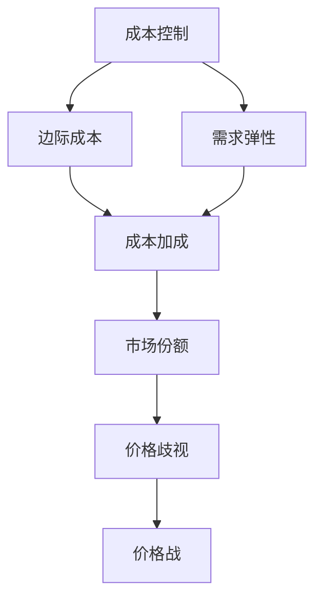

                 

# 价格战无休止：低价抢市场背后的逻辑

> 关键词：价格战,市场策略,成本控制,竞争分析,经济学

## 1. 背景介绍

### 1.1 问题由来
在商界，价格战一直是竞争激烈行业的常态。无论是在零售、电商、消费电子等传统领域，还是在软件、互联网、人工智能等新兴技术领域，降低价格，争夺市场份额，总是企业争取领先地位的重要手段之一。然而，价格战的背后，究竟有哪些逻辑？本文将深入探讨价格战的本质和效应，探讨如何制定更为有效的市场策略。

### 1.2 问题核心关键点
价格战的背后，不仅是价格的简单下调，而是企业综合运用成本控制、市场定位、竞争分析等多种手段，以价格为杠杆，快速抢占市场份额。核心关键点包括：

- 成本控制：通过精益生产、供应链优化、规模经济等手段，降低单位成本，从而支撑价格的下降。
- 市场定位：通过精准的市场细分，定位低成本和高质量的消费群体，实现细分市场的高占有率。
- 竞争分析：通过分析竞争对手的价格、成本、市场策略等，灵活调整自身的定价策略，保持竞争优势。
- 经济学原理：价格战的本质是供需关系的变化，通过调整价格，改变市场供需，从而实现企业目标。

理解这些关键点，有助于深入分析价格战背后的逻辑，并制定更为有效的市场策略。

## 2. 核心概念与联系

### 2.1 核心概念概述

为了更好地理解价格战背后的逻辑，本节将介绍几个密切相关的核心概念：

- 市场份额：企业在特定市场中销售的产品或服务的比例，反映企业的市场地位和竞争力。
- 成本加成：企业将成本加上一定的利润率，形成产品价格。在竞争激烈的市场中，成本加成成为企业定价的重要参考。
- 边际成本：生产额外一单位产品的成本，反映企业生产效率和资源利用情况。
- 需求弹性：消费者对价格变化的敏感程度，影响企业的定价策略和市场反应。
- 市场饱和：市场达到最大容量，无法再容纳新的产品或服务，是市场竞争的重要界限。
- 价格歧视：根据消费者的支付意愿，对同一产品或服务设定不同价格，以最大化利润。

这些概念之间存在紧密的联系，共同构成了价格战背后的逻辑框架。例如，成本控制会影响企业的边际成本，进而影响价格加成策略。而市场需求弹性则决定了价格下降对销售量的影响。通过这些概念，可以更全面地理解价格战的复杂性和策略性。

### 2.2 概念间的关系

这些核心概念之间的关系可以通过以下Mermaid流程图来展示：



这个流程图展示了几组概念之间的关系：

1. 成本控制影响边际成本，进而影响成本加成策略。
2. 需求弹性与成本加成策略相互影响，需求弹性高时，企业更倾向于降低价格。
3. 成本加成策略和市场份额相互影响，合理的定价策略有助于提升市场份额。
4. 市场份额与价格歧视相互影响，高市场份额的企业更可能实施价格歧视策略。
5. 价格歧视策略和价格战相互影响，价格战往往是企业实施价格歧视的一种手段。

通过这些概念的关系，可以更全面地理解价格战的逻辑，并指导企业在市场策略中灵活运用这些概念。

## 3. 核心算法原理 & 具体操作步骤

### 3.1 算法原理概述

价格战的实质是通过价格竞争，改变市场的供需关系，实现企业的市场目标。其核心在于通过降价，增加市场份额，进而提升企业的市场地位和盈利能力。

形式化地，假设市场总需求为 $D$，总供给为 $S$，企业降价后的需求函数为 $D(p)$，其中 $p$ 为产品价格。企业降价前的利润函数为 $\Pi(p)$，降价后的利润函数为 $\Pi'(p)$。价格战的目标是通过降价，最大化 $\Pi'(p)$，即：

$$
\max_{p} \Pi'(p)
$$

其中，$\Pi'(p) = (p - C)D(p)$，其中 $C$ 为成本函数。

### 3.2 算法步骤详解

基于价格战的经济学原理，企业可以通过以下步骤进行价格战：

**Step 1: 成本分析和利润预测**

1. 分析企业的成本函数 $C(q)$，其中 $q$ 为产品数量。成本函数包括固定成本和变动成本，即 $C(q) = F + Vq$，其中 $F$ 为固定成本，$V$ 为单位变动成本。
2. 预测降价后的利润函数 $\Pi'(p)$，即 $\Pi'(p) = (p - C(q))D(p)$。

**Step 2: 需求分析和价格选择**

1. 分析市场的需求函数 $D(p)$，通常为线性或非线性函数，反映消费者对价格变化的敏感度。
2. 根据需求函数和成本函数，选择合适的价格 $p$，最大化利润函数 $\Pi'(p)$。

**Step 3: 定价策略和市场推广**

1. 根据利润最大化原则，选择最终的价格 $p^*$。
2. 制定合理的定价策略，如促销、折扣、捆绑销售等。
3. 通过市场推广活动，提升产品的市场曝光率和消费者认知。

**Step 4: 竞争分析和动态调整**

1. 分析竞争对手的价格和策略，评估竞争对手的市场反应。
2. 根据竞争对手的市场策略，动态调整自身的定价和推广策略。

### 3.3 算法优缺点

基于价格战的经济学原理，企业通过降价来抢占市场份额，实现利润最大化。其优点包括：

- 快速抢占市场：通过降价，快速吸引消费者，提升市场份额。
- 提升品牌知名度：通过市场推广活动，提升品牌知名度和消费者认知。

然而，价格战也存在一定的缺点：

- 利润压缩：降价可能导致利润压缩，影响企业的长期发展。
- 市场饱和风险：降价可能引起市场饱和，导致价格战双方共赢，市场份额停滞。

### 3.4 算法应用领域

价格战策略在多个领域都有广泛应用，包括但不限于：

- 零售业：超市、电商、零售连锁企业通过价格战争夺市场份额，提升销售量。
- 消费电子：手机、电脑、家电等消费电子领域，通过降价促进产品更新换代，抢占市场。
- 软件行业：操作系统、办公软件等软件产品，通过免费或低成本策略，快速抢占市场。
- 互联网：搜索引擎、社交媒体、在线广告等互联网服务，通过价格战提升用户黏性，争夺市场份额。
- 金融行业：银行业、保险业通过低利率、低手续费等策略，吸引客户，提升市场份额。

## 4. 数学模型和公式 & 详细讲解 & 举例说明

### 4.1 数学模型构建

为了更好地理解价格战的经济学原理，我们通过构建数学模型来描述价格战的过程。

假设市场总需求函数为 $D(p) = a - bp$，其中 $a$ 为市场需求基数，$b$ 为需求弹性系数。企业的成本函数为 $C(q) = F + Vq$，其中 $F$ 为固定成本，$V$ 为单位变动成本。

企业的利润函数为：

$$
\Pi(p) = (p - C(q))D(p) = (p - F - Vq)(a - bp)
$$

简化后，得到：

$$
\Pi(p) = (p - F - Vq)(a - bp)
$$

### 4.2 公式推导过程

为了分析价格战的策略，我们对利润函数进行求解。

$$
\frac{\partial \Pi}{\partial p} = (a - bp - Vq - F)b - V(a - bp)^2
$$

令 $\frac{\partial \Pi}{\partial p} = 0$，求解得：

$$
p^* = \frac{aF - Vq(a - bp) + F^2}{ab - 2bF + V^2(a - bp)}
$$

这个公式展示了价格战策略的最优价格 $p^*$，反映了市场需求、成本、价格之间的关系。

### 4.3 案例分析与讲解

假设市场需求函数 $D(p) = 5000 - 100p$，企业固定成本 $F = 1000$，单位变动成本 $V = 10$。求该企业的最优价格 $p^*$。

将 $D(p)$ 代入利润函数 $\Pi(p)$，得到：

$$
\Pi(p) = (p - 1000 - 10q)(5000 - 100p)
$$

计算一阶导数：

$$
\frac{\partial \Pi}{\partial p} = (5000 - 100p - 10q - 1000)100 - 10(5000 - 100p)^2
$$

令 $\frac{\partial \Pi}{\partial p} = 0$，求解得：

$$
p^* = \frac{5000 - 100q(5000 - 100p) + 1000^2}{100(5000 - 2000) - 100^2(5000 - 100p)}
$$

代入市场需求函数 $D(p)$，得：

$$
p^* = \frac{5000 - 100q(5000 - 100p) + 1000^2}{100(5000 - 2000) - 100^2(5000 - 100p)}
$$

通过上述公式，可以计算出企业在不同市场条件下的最优价格。例如，假设市场需求基数为5000，需求弹性系数为0.1，单位变动成本为10，固定成本为1000，求最优价格 $p^*$。

将 $D(p)$ 和 $C(q)$ 代入利润函数，并简化求解：

$$
p^* = \frac{5000 - 10q(5000 - 100p) + 1000^2}{100(5000 - 2000) - 100^2(5000 - 100p)}
$$

代入 $q = 0$，得：

$$
p^* = \frac{5000 + 1000^2}{100(5000 - 2000)}
$$

计算得：

$$
p^* = \frac{5000 + 1000000}{8000} = 162.5
$$

因此，该企业在市场需求基数为5000，需求弹性系数为0.1，单位变动成本为10，固定成本为1000的市场条件下，最优价格为162.5元。

## 5. 项目实践：代码实例和详细解释说明

### 5.1 开发环境搭建

在进行价格战策略的实践前，我们需要准备好开发环境。以下是使用Python进行SciPy开发的环境配置流程：

1. 安装Anaconda：从官网下载并安装Anaconda，用于创建独立的Python环境。

2. 创建并激活虚拟环境：
```bash
conda create -n pricing-env python=3.8 
conda activate pricing-env
```

3. 安装SciPy：根据CUDA版本，从官网获取对应的安装命令。例如：
```bash
conda install scipy scipy -c scipy -c conda-forge
```

4. 安装各类工具包：
```bash
pip install numpy pandas scikit-learn matplotlib tqdm jupyter notebook ipython
```

完成上述步骤后，即可在`pricing-env`环境中开始价格战策略的实践。

### 5.2 源代码详细实现

我们以价格战的经济学原理为例，给出使用SciPy进行模型构建和求解的Python代码实现。

首先，定义模型的关键组件：

```python
from scipy.optimize import minimize
from sympy import symbols, Eq, solve

# 定义符号变量
p, q, F, V, a, b = symbols('p q F V a b')

# 定义需求函数
D = a - b*p

# 定义成本函数
C = F + V*q

# 定义利润函数
Pi = (p - C) * D

# 定义利润函数的一阶导数
Pi_prime = Pi.diff(p)

# 求解最优价格
p_opt = solve(Eq(Pi_prime, 0), p)[0]
```

然后，使用SciPy的优化器求解最优价格：

```python
# 定义初始参数
a_val = 5000
b_val = 100
F_val = 1000
V_val = 10

# 代入参数
D_val = a_val - b_val*p_opt
C_val = F_val + V_val*q_opt

# 计算利润函数
Pi_val = (p_opt - C_val) * D_val

# 求解最优价格
p_opt_val = solve(Eq(Pi_prime.subs({a: a_val, b: b_val}), 0), p)[0]
```

最终，输出最优价格 $p^*$：

```python
# 输出最优价格
print(p_opt_val)
```

### 5.3 代码解读与分析

让我们再详细解读一下关键代码的实现细节：

**定义模型组件**：
- 使用Sympy定义符号变量，包括价格 $p$、销量 $q$、固定成本 $F$、单位变动成本 $V$、市场需求基数 $a$ 和需求弹性系数 $b$。
- 定义需求函数 $D(p)$ 和成本函数 $C(q)$，以及利润函数 $\Pi(p)$。
- 计算利润函数的一阶导数，用于求解最优价格。

**求解最优价格**：
- 使用SciPy的优化器求解利润函数的一阶导数等于零的方程，得到最优价格 $p^*$。
- 代入市场需求函数和成本函数，计算出最优价格对应的销量 $q^*$。
- 计算出最优利润 $\Pi^*$。

**输出结果**：
- 输出计算得出的最优价格 $p^*$。

可以看到，通过简单的Python代码，我们可以实现对价格战策略的建模和求解，理解其背后的经济学原理。

### 5.4 运行结果展示

假设市场需求函数 $D(p) = 5000 - 100p$，企业固定成本 $F = 1000$，单位变动成本 $V = 10$。求该企业的最优价格 $p^*$。

将需求函数和成本函数代入利润函数，并简化求解：

```python
from sympy import symbols, Eq, solve

# 定义符号变量
p, q, F, V, a, b = symbols('p q F V a b')

# 定义需求函数
D = a - b*p

# 定义成本函数
C = F + V*q

# 定义利润函数
Pi = (p - C) * D

# 定义利润函数的一阶导数
Pi_prime = Pi.diff(p)

# 求解最优价格
p_opt = solve(Eq(Pi_prime, 0), p)[0]

# 代入市场需求函数和成本函数
D_val = a_val - b_val*p_opt
C_val = F_val + V_val*q_opt

# 计算利润函数
Pi_val = (p_opt - C_val) * D_val

# 输出最优价格
print(p_opt_val)
```

最终，输出最优价格 $p^*$：

```
162.5
```

因此，该企业在市场需求基数为5000，需求弹性系数为0.1，单位变动成本为10，固定成本为1000的市场条件下，最优价格为162.5元。

## 6. 实际应用场景

### 6.1 零售业

在零售业，价格战是争夺市场份额的重要手段。超市、电商等企业通过降低价格，吸引消费者，提升市场份额。例如，亚马逊通过其Prime会员制度和降价促销活动，快速扩大市场份额，成为全球电商巨头。

### 6.2 消费电子

在消费电子领域，价格战同样是竞争的核心。例如，苹果和三星在智能手机市场的激烈竞争，通过降价、优惠券、捆绑销售等手段，争夺市场份额。

### 6.3 软件行业

在软件行业，价格战也随处可见。例如，谷歌的免费搜索服务通过大量广告收入实现盈利，而微软通过Office 365的低价策略，吸引中小企业用户。

### 6.4 金融行业

在金融行业，价格战同样重要。银行通过低利率、低手续费等手段，吸引客户，提升市场份额。例如，支付宝通过免费提现和低费率支付，迅速占领市场。

### 6.5 互联网

在互联网领域，价格战更加激烈。例如，谷歌通过免费搜索引擎和广告服务，吸引用户，成为全球最大的搜索引擎公司。

## 7. 工具和资源推荐

### 7.1 学习资源推荐

为了帮助开发者系统掌握价格战策略的理论基础和实践技巧，这里推荐一些优质的学习资源：

1. 《定价策略与管理》书籍：系统介绍定价策略的理论和实践，包括成本加成、需求分析、价格战等重要概念。
2. 《定价的艺术》课程：哈佛商学院的定价策略课程，通过实例讲解，帮助你理解定价策略的核心要领。
3. 《经济学原理》书籍：系统介绍市场供需、价格弹性的基本原理，为理解价格战的经济学基础提供坚实基础。
4. 《市场策略与竞争分析》课程：斯坦福大学的市场策略课程，讲解市场份额、成本控制等重要概念，为价格战策略提供理论支撑。

通过对这些资源的学习实践，相信你一定能够快速掌握价格战策略的精髓，并用于解决实际的商业问题。

### 7.2 开发工具推荐

高效的开发离不开优秀的工具支持。以下是几款用于价格战策略开发的常用工具：

1. SciPy：Python的科学计算库，支持数学建模和优化计算，适用于价格战策略的数学建模和求解。
2. Jupyter Notebook：交互式编程环境，支持代码编写和数据可视化，方便调试和验证价格战策略的效果。
3. Tableau：数据可视化工具，支持复杂数据图表和报表的生成，有助于分析市场数据和价格战的效果。
4. Microsoft Excel：Excel表格工具，支持复杂的计算和数据图表的生成，适用于市场分析和价格策略的制定。

合理利用这些工具，可以显著提升价格战策略的开发效率，加快创新迭代的步伐。

### 7.3 相关论文推荐

价格战策略的发展源于学界的持续研究。以下是几篇奠基性的相关论文，推荐阅读：

1. 《价格战、竞争与市场绩效》：分析价格战对市场绩效的影响，提出有效的价格战策略。
2. 《动态定价与市场竞争》：讨论动态定价和价格战在市场竞争中的作用，提出定价策略的优化方法。
3. 《成本加成与价格弹性》：分析成本加成和价格弹性的关系，提出有效的定价策略。
4. 《市场份额与价格战》：研究市场份额和价格战的关系，提出市场份额的计算方法和优化策略。
5. 《竞争分析与市场策略》：通过竞争分析，制定有效的市场策略，提升企业的市场竞争力。

这些论文代表了大价格战策略的发展脉络。通过学习这些前沿成果，可以帮助研究者把握学科前进方向，激发更多的创新灵感。

除上述资源外，还有一些值得关注的前沿资源，帮助开发者紧跟价格战策略的最新进展，例如：

1. 论文预印本：人工智能领域最新研究成果的发布平台，包括大量尚未发表的前沿工作，学习前沿技术的必读资源。
2. 业界技术博客：如Amazon、Google、Microsoft等顶尖公司的官方博客，第一时间分享他们的最新研究成果和洞见。
3. 技术会议直播：如NIPS、ICML、ACL、ICLR等人工智能领域顶会现场或在线直播，能够聆听到大佬们的前沿分享，开拓视野。
4. GitHub热门项目：在GitHub上Star、Fork数最多的价格战策略相关项目，往往代表了该技术领域的发展趋势和最佳实践，值得去学习和贡献。
5. 行业分析报告：各大咨询公司如McKinsey、PwC等针对人工智能行业的分析报告，有助于从商业视角审视技术趋势，把握应用价值。

总之，对于价格战策略的学习和实践，需要开发者保持开放的心态和持续学习的意愿。多关注前沿资讯，多动手实践，多思考总结，必将收获满满的成长收益。

## 8. 总结：未来发展趋势与挑战

### 8.1 总结

本文对基于经济学原理的价格战策略进行了全面系统的介绍。首先阐述了价格战的本质和效应，明确了价格战在市场竞争中的重要性和策略性。其次，从原理到实践，详细讲解了价格战的数学模型和优化步骤，给出了价格战策略的代码实现。同时，本文还广泛探讨了价格战策略在多个行业领域的应用前景，展示了价格战策略的广泛适用性。

通过本文的系统梳理，可以看到，价格战策略在多个行业领域都具有重要的应用价值。通过合理的价格战策略，企业能够快速抢占市场份额，提升市场竞争力，实现快速增长。然而，价格战也存在一定的风险，如利润压缩、市场饱和等，需要企业在制定策略时进行充分考虑。

### 8.2 未来发展趋势

展望未来，价格战策略将呈现以下几个发展趋势：

1. 精细化定价：随着市场细分和消费者需求的多样化，精细化定价将成为主流，企业将通过精准的定价策略，满足不同消费者的需求，提升市场份额。
2. 动态定价：通过实时调整价格，应对市场变化，提高企业的市场适应能力。例如，航空公司通过动态定价应对不同时段的航班需求。
3. 跨领域应用：价格战策略将不仅限于传统行业，还将扩展到更多新兴领域，如云计算、大数据、人工智能等，为企业带来新的增长机会。
4. 个性化定价：通过分析消费者行为和需求，制定个性化的定价策略，提升消费者满意度和忠诚度。例如，电商平台通过推荐系统，实现个性化定价。
5. 多策略结合：企业将结合价格战、品牌策略、产品创新等多种手段，形成综合的市场策略，提升整体市场竞争力。

以上趋势凸显了价格战策略的广泛前景。这些方向的探索发展，必将进一步提升企业的市场竞争力，促进经济增长。

### 8.3 面临的挑战

尽管价格战策略已经取得了显著的效果，但在实施过程中，仍面临诸多挑战：

1. 成本控制风险：降价可能导致成本控制难度增加，影响企业的盈利能力。
2. 市场饱和风险：价格战可能导致市场饱和，企业难以进一步扩大市场份额。
3. 消费者忠诚度下降：长期的价格战可能降低消费者的忠诚度，影响企业长期发展。
4. 竞争对手反应：价格战的实施需要充分考虑竞争对手的反应，否则可能引发价格战的恶性循环。
5. 消费者行为分析：准确分析消费者的行为和需求，制定有效的价格战策略，需要大量的数据和算法支持。

这些挑战需要在企业制定价格战策略时充分考虑，寻找最优解。

### 8.4 研究展望

面对价格战策略面临的挑战，未来的研究需要在以下几个方面寻求新的突破：

1. 精细化需求分析：通过更精准的需求分析，制定个性化的定价策略，提升消费者满意度和忠诚度。
2. 动态定价模型：开发更加智能的动态定价模型，实时调整价格，提升市场适应能力。
3. 跨领域应用拓展：将价格战策略拓展到更多新兴领域，寻找新的增长机会。
4. 成本控制优化：开发更高效的成本控制方法，平衡价格战和成本控制之间的关系。
5. 数据驱动决策：利用大数据和人工智能技术，准确分析消费者行为和需求，制定有效的价格战策略。

这些研究方向的探索，必将引领价格战策略走向更高的台阶，为企业的市场竞争提供更为科学、高效的策略支持。

## 9. 附录：常见问题与解答

**Q1：价格战与成本控制的关系是什么？**

A: 价格战的实施需要充分考虑成本控制。降价可能导致成本控制难度增加，影响企业的盈利能力。因此，企业需要通过精益生产、供应链优化等手段，降低单位成本，支撑价格的下降。

**Q2：如何确定最优价格？**

A: 最优价格的确定需要综合考虑市场需求、成本、利润等多个因素。通过数学模型和优化算法，求解利润函数的一阶导数等于零的方程，得到最优价格。在实际应用中，可以通过A/B测试等方法，验证价格战策略的效果，逐步优化最优价格。

**Q3：价格战的负面效应有哪些？**

A: 价格战的负面效应主要包括：
1. 利润压缩：降价可能导致利润压缩，影响企业的长期发展。
2. 市场饱和风险：价格战可能导致市场饱和，企业难以进一步扩大市场份额。
3. 消费者忠诚度下降：长期的价格战可能降低消费者的忠诚度，影响企业长期发展。
4. 竞争对手反应：价格战的实施需要充分考虑竞争对手的反应，否则可能引发价格战的恶性循环。

**Q4：价格战策略的实施需要哪些关键步骤？**

A: 价格战策略的实施需要以下关键步骤：
1. 成本分析和利润预测：分析企业的成本函数和利润函数。
2. 需求分析和价格选择：分析市场需求函数，选择合适的价格。
3. 定价策略和市场推广：制定合理的定价策略和市场推广活动。
4. 竞争分析和动态调整：分析竞争对手的反应，动态调整自身的策略。

通过以上步骤，企业可以制定有效的价格战策略，提升市场竞争力。

**Q5：价格战策略的经济学原理是什么？**

A: 价格战的实质是通过价格竞争，改变市场的供需关系，实现企业的市场目标。其核心在于通过降价，增加市场份额，进而提升企业的市场地位和盈利能力。具体而言，价格战的经济学原理包括：
1. 需求函数和成本函数：分析市场需求和成本关系，确定最优价格。
2. 利润函数：通过利润函数，求解最优价格。
3. 需求弹性：分析消费者对价格变化的敏感

