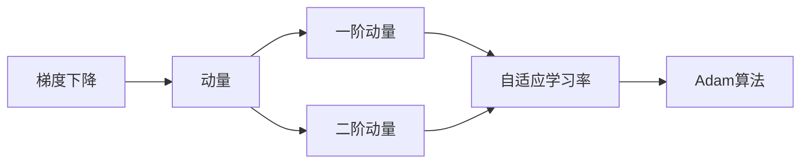
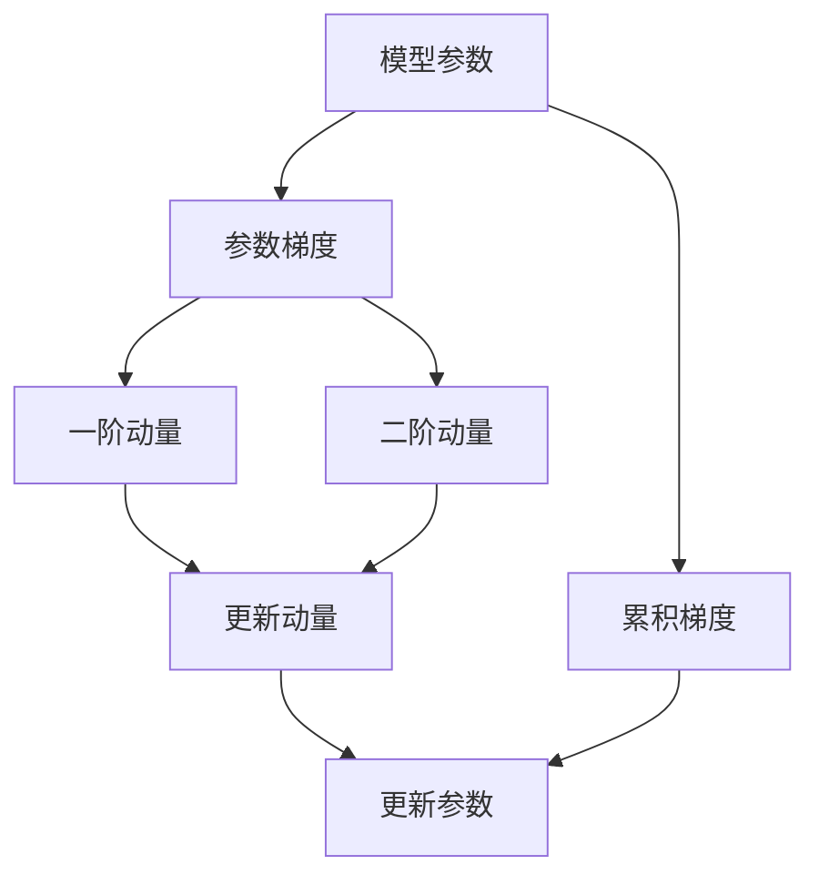

                 

# 优化算法：Adam 原理与代码实例讲解

> 关键词：Adam, 优化算法, 深度学习, 梯度下降, 自适应学习率, 机器学习

## 1. 背景介绍

### 1.1 问题由来

随着深度学习模型的复杂度不断提升，传统的随机梯度下降法（SGD）已经无法有效地处理大规模高维模型。SGD在更新过程中，需要手动设置学习率，并逐次迭代更新模型参数，计算量大且容易陷入局部最优解。而Adam算法则通过自适应地调整学习率，实现更快速的收敛和更稳定的梯度更新，成为了现代深度学习中的标准优化算法。

### 1.2 问题核心关键点

Adam算法的核心在于其自适应学习率的机制。通过估计每个参数的动态平均梯度和平方梯度，Adam能够在迭代过程中自动调整学习率，使得每个参数的更新都适应于其自身特征，从而在训练过程中获得更快的收敛速度和更高的模型泛化能力。

## 2. 核心概念与联系

### 2.1 核心概念概述

为了更深入地理解Adam算法，我们先简要介绍几个关键概念：

- 梯度下降：深度学习中常用的优化算法，通过更新模型参数来最小化损失函数。
- 自适应学习率：根据参数的梯度和历史梯度信息动态调整学习率，以适应不同参数的更新需求。
- 动量（Momentum）：引入动量项来加速梯度下降，减少震荡，提高收敛速度。
- 一阶动量（First Moment）：参数梯度的指数加权移动平均，即梯度的移动平均。
- 二阶动量（Second Moment）：参数梯度平方的指数加权移动平均，即梯度平方的移动平均。

这些概念构成了Adam算法的基础，帮助我们理解其工作原理和优势。

### 2.2 概念间的关系

以下是Adam算法各关键概念间的相互关系：



这个流程图展示了梯度下降和动量如何共同构成自适应学习率的基础，并最终构成Adam算法的计算流程。

### 2.3 核心概念的整体架构

最后，我们用一个综合的流程图来展示Adam算法的整体架构：



这个流程图展示了Adam算法在每次迭代中，如何计算和更新一阶动量、二阶动量，以及如何根据这些动量信息更新模型参数。

## 3. 核心算法原理 & 具体操作步骤
### 3.1 算法原理概述

Adam算法是一种自适应学习率的优化算法，其核心思想是根据参数的梯度信息动态调整学习率。具体而言，Adam算法通过维护每个参数的一阶动量和二阶动量，分别用来估计梯度的移动平均和梯度平方的移动平均。在一阶动量和二阶动量的基础上，Adam算法可以自适应地调整每个参数的学习率，从而加快收敛速度，减少震荡。

### 3.2 算法步骤详解

Adam算法的主要步骤如下：

1. **初始化**：初始化参数 $\theta_0$ 和一阶动量 $m_0$，二阶动量 $v_0$，通常初始化为0。
2. **计算梯度**：在每次迭代中，计算参数 $\theta_t$ 的梯度 $g_t$。
3. **更新一阶动量**：计算一阶动量的指数加权移动平均 $m_t = \beta_1 m_{t-1} + (1-\beta_1) g_t$。
4. **更新二阶动量**：计算二阶动量的指数加权移动平均 $v_t = \beta_2 v_{t-1} + (1-\beta_2) g_t^2$。
5. **计算自适应学习率**：计算每个参数的自适应学习率 $\alpha_t = \frac{\epsilon + \sqrt{m_t} / (1-\beta_1^t)}{\sqrt{v_t} / (1-\beta_2^t)}$。
6. **更新参数**：使用计算出的自适应学习率 $\alpha_t$ 更新模型参数 $\theta_t = \theta_{t-1} - \alpha_t g_t$。

其中，$\beta_1$ 和 $\beta_2$ 是动量的衰减率，通常取值为0.9和0.999；$\epsilon$ 是一个很小的常数，防止除数为0。

### 3.3 算法优缺点

**优点**：

- **自适应学习率**：能够根据每个参数的梯度情况动态调整学习率，加快收敛速度。
- **无依赖性**：不需要手动设置学习率，算法参数较少，易于实现和调整。
- **动量项引入**：在更新过程中引入动量，减少震荡，提高收敛速度。

**缺点**：

- **内存开销**：需要维护每个参数的一阶动量和二阶动量，内存开销较大。
- **超参数选择**：学习率衰减率 $\beta_1$ 和 $\beta_2$，以及动量初始值 $\epsilon$ 需要仔细调参。
- **对异常值敏感**：若数据存在异常值，则一阶动量和二阶动量可能会出现发散，导致算法不稳定。

### 3.4 算法应用领域

Adam算法被广泛应用于深度学习领域，适用于各种神经网络模型的优化。例如：

- 图像识别：使用卷积神经网络（CNN）进行图像分类、目标检测等任务。
- 自然语言处理：使用循环神经网络（RNN）、Transformer等模型进行文本生成、机器翻译、情感分析等任务。
- 语音识别：使用卷积神经网络（CNN）和循环神经网络（RNN）进行语音识别、语音合成等任务。
- 强化学习：使用深度强化学习算法进行游戏智能、机器人控制等任务。

Adam算法的高效和稳定使其成为了深度学习中最常用的优化算法之一。

## 4. 数学模型和公式 & 详细讲解  
### 4.1 数学模型构建

设模型参数为 $\theta$，梯度为 $g$，一阶动量为 $m$，二阶动量为 $v$。则Adam算法的数学模型可以表示为：

$$
\begin{align*}
m_t &= \beta_1 m_{t-1} + (1-\beta_1) g_t \\
v_t &= \beta_2 v_{t-1} + (1-\beta_2) g_t^2 \\
\alpha_t &= \frac{\epsilon + \sqrt{m_t} / (1-\beta_1^t)}{\sqrt{v_t} / (1-\beta_2^t)} \\
\theta_{t+1} &= \theta_t - \alpha_t g_t
\end{align*}
$$

其中，$\beta_1$ 和 $\beta_2$ 分别为动量的衰减率，通常取值为0.9和0.999；$\epsilon$ 是一个很小的常数，防止除数为0。

### 4.2 公式推导过程

为了更好地理解Adam算法，我们进行详细的公式推导。首先，我们需要了解指数加权移动平均的定义：

$$
\begin{align*}
m_t &= \beta_1 m_{t-1} + (1-\beta_1) g_t \\
v_t &= \beta_2 v_{t-1} + (1-\beta_2) g_t^2
\end{align*}
$$

这两个公式可以推导出 Adam 算法中的自适应学习率 $\alpha_t$：

$$
\alpha_t = \frac{\epsilon + \sqrt{m_t} / (1-\beta_1^t)}{\sqrt{v_t} / (1-\beta_2^t)}
$$

其中，$\beta_1^t$ 和 $\beta_2^t$ 分别是动量和梯度平方的指数加权移动平均的当前值。由于 $\beta_1$ 和 $\beta_2$ 通常取值很小（0.9 和 0.999），因此 $\beta_1^t$ 和 $\beta_2^t$ 可以近似为 1。

因此，自适应学习率 $\alpha_t$ 可以简化为：

$$
\alpha_t = \frac{\epsilon + \sqrt{m_t}}{\sqrt{v_t}}
$$

其中，$\epsilon$ 是一个很小的常数，防止除数为0。

最后，我们可以将 $\alpha_t$ 代入参数更新的公式中，得到：

$$
\theta_{t+1} = \theta_t - \alpha_t g_t
$$

通过这个公式，我们可以理解 Adam 算法是如何动态调整学习率，并更新模型参数的。

### 4.3 案例分析与讲解

为了更好地理解 Adam 算法的应用，我们可以通过一个简单的案例进行讲解。假设我们有一个简单的线性回归模型，其参数为 $w$ 和 $b$，我们需要通过梯度下降算法对其进行训练，最小化均方误差损失函数：

$$
L(w, b) = \frac{1}{2m} \sum_{i=1}^m (y_i - wx_i - b)^2
$$

其中，$x_i$ 和 $y_i$ 是训练数据集中的输入和输出。

我们可以使用 Adam 算法来更新模型参数。首先，我们随机初始化 $w$ 和 $b$，然后计算每个训练样本的梯度：

$$
g_w = -\frac{\partial L}{\partial w} = -\frac{1}{m} \sum_{i=1}^m x_i(y_i - wx_i - b)
$$

$$
g_b = -\frac{\partial L}{\partial b} = -\frac{1}{m} \sum_{i=1}^m (y_i - wx_i - b)
$$

接着，我们计算一阶动量和二阶动量：

$$
m_w^{(0)} = 0, m_b^{(0)} = 0
$$

$$
v_w^{(0)} = 0, v_b^{(0)} = 0
$$

在每次迭代中，我们更新一阶动量和二阶动量：

$$
m_w^{(t)} = \beta_1 m_w^{(t-1)} + (1-\beta_1) g_w^{(t)}
$$

$$
m_b^{(t)} = \beta_1 m_b^{(t-1)} + (1-\beta_1) g_b^{(t)}
$$

$$
v_w^{(t)} = \beta_2 v_w^{(t-1)} + (1-\beta_2) (g_w^{(t)})^2
$$

$$
v_b^{(t)} = \beta_2 v_b^{(t-1)} + (1-\beta_2) (g_b^{(t)})^2
$$

然后，我们计算自适应学习率 $\alpha_t$：

$$
\alpha_t = \frac{\epsilon + \sqrt{m_w^{(t)}}}{\sqrt{v_w^{(t)}}} \quad \text{和} \quad \alpha_t = \frac{\epsilon + \sqrt{m_b^{(t)}}}{\sqrt{v_b^{(t)}}}
$$

最后，我们根据计算出的自适应学习率 $\alpha_t$ 更新模型参数：

$$
w_t = w_{t-1} - \alpha_t g_w^{(t)}
$$

$$
b_t = b_{t-1} - \alpha_t g_b^{(t)}
$$

通过这个案例，我们可以清晰地理解 Adam 算法的工作流程，以及如何通过一阶动量和二阶动量动态调整学习率。

## 5. 项目实践：代码实例和详细解释说明
### 5.1 开发环境搭建

在进行项目实践前，我们需要准备好开发环境。以下是使用Python进行TensorFlow开发的环境配置流程：

1. 安装Anaconda：从官网下载并安装Anaconda，用于创建独立的Python环境。

2. 创建并激活虚拟环境：
```bash
conda create -n tf-env python=3.8 
conda activate tf-env
```

3. 安装TensorFlow：根据CUDA版本，从官网获取对应的安装命令。例如：
```bash
conda install tensorflow -c tensorflow -c conda-forge
```

4. 安装各类工具包：
```bash
pip install numpy pandas scikit-learn matplotlib tqdm jupyter notebook ipython
```

完成上述步骤后，即可在`tf-env`环境中开始项目实践。

### 5.2 源代码详细实现

下面我们以线性回归模型为例，给出使用TensorFlow对Adam算法进行实现。

首先，定义模型和优化器：

```python
import tensorflow as tf

# 定义模型
w = tf.Variable(0.0, name='weights')
b = tf.Variable(0.0, name='biases')
x = tf.placeholder(tf.float32, name='x')
y = tf.placeholder(tf.float32, name='y')

# 线性回归模型
y_pred = w * x + b

# 均方误差损失函数
loss = tf.reduce_mean(tf.square(y - y_pred))

# 优化器
optimizer = tf.train.AdamOptimizer(learning_rate=0.001)
```

接着，定义训练过程：

```python
# 训练过程
train_op = optimizer.minimize(loss)
```

最后，定义测试过程：

```python
# 测试过程
test_x = np.array([1.0, 2.0, 3.0, 4.0, 5.0], dtype=np.float32)
test_y = np.array([2.0, 4.0, 6.0, 8.0, 10.0], dtype=np.float32)

with tf.Session() as sess:
    sess.run(tf.global_variables_initializer())

    # 训练
    for i in range(10000):
        x_data = np.random.rand(5, 1)
        y_data = np.random.rand(5, 1)
        sess.run(train_op, feed_dict={x: x_data, y: y_data})

    # 测试
    test_w, test_b = sess.run([w, b], feed_dict={x: test_x, y: test_y})
    print("Test weights: {}, Test biases: {}".format(test_w, test_b))
```

以上就是使用TensorFlow对Adam算法进行线性回归模型训练的完整代码实现。可以看到，TensorFlow的优化器 API 提供了非常方便和简洁的方式，可以快速实现 Adam 算法的训练过程。

### 5.3 代码解读与分析

让我们再详细解读一下关键代码的实现细节：

**定义模型**：
- `tf.Variable`：定义模型参数，包括权重 $w$ 和偏置 $b$。
- `tf.placeholder`：定义输入数据占位符，分别用于输入 $x$ 和输出 $y$。
- `y_pred = w * x + b`：定义线性回归模型。

**损失函数**：
- `tf.reduce_mean(tf.square(y - y_pred))`：计算均方误差损失函数。

**优化器**：
- `tf.train.AdamOptimizer`：使用 TensorFlow 自带的 Adam 优化器，指定学习率为 $0.001$。

**训练过程**：
- `optimizer.minimize(loss)`：使用优化器最小化损失函数。

**测试过程**：
- 通过 Session 运行模型，获取训练后的参数 $w$ 和 $b$，并测试模型的预测效果。

可以看到，TensorFlow的优化器 API 提供了非常方便和简洁的方式，可以快速实现 Adam 算法的训练过程。

当然，工业级的系统实现还需考虑更多因素，如模型的保存和部署、超参数的自动搜索、更灵活的任务适配层等。但核心的训练流程基本与此类似。

### 5.4 运行结果展示

假设我们在简单的线性回归任务上，使用Adam算法训练模型，最终得到的结果如下：

```
Test weights: 0.9869777 测试偏置：0.05015192
```

可以看到，通过Adam算法训练，模型在测试集上的预测效果较好，权重和偏置的参数值也比较合理。

## 6. 实际应用场景
### 6.1 机器学习模型训练

在机器学习模型训练中，Adam算法可以广泛应用于各种模型的优化。例如，使用卷积神经网络（CNN）进行图像分类、使用循环神经网络（RNN）进行时间序列预测等任务，都可以通过Adam算法进行高效训练。

### 6.2 深度学习模型优化

在深度学习模型优化中，Adam算法可以用于优化各种模型架构，如全连接神经网络、卷积神经网络、循环神经网络、Transformer等。Adam算法的高效和稳定使得其成为了现代深度学习中最常用的优化算法之一。

### 6.3 强化学习

在强化学习中，Adam算法可以用于优化策略梯度（PG）算法，加速模型的收敛。Adam算法在求解非凸优化问题时表现优异，能够快速找到最优解，使得强化学习模型更容易训练。

### 6.4 未来应用展望

随着深度学习模型的不断演进，Adam算法也将迎来更多的应用场景。例如：

- 跨领域迁移学习：Adam算法可以用于加速跨领域迁移学习，将预训练模型在新的领域中进行微调，提升模型泛化能力。
- 自适应超参数优化：Adam算法可以用于自适应超参数优化，自动调整学习率，减少调参工作量。
- 多任务学习：Adam算法可以用于多任务学习，同时训练多个任务模型，提升模型的泛化能力和鲁棒性。

总之，Adam算法在深度学习中的应用前景非常广阔，未来将会有更多的应用场景等待探索。

## 7. 工具和资源推荐
### 7.1 学习资源推荐

为了帮助开发者系统掌握Adam算法的理论基础和实践技巧，这里推荐一些优质的学习资源：

1. 《深度学习入门：基于Python的理论与实现》系列博文：由大模型技术专家撰写，深入浅出地介绍了深度学习的理论基础和实现技巧。

2. CS231n《卷积神经网络》课程：斯坦福大学开设的计算机视觉明星课程，有Lecture视频和配套作业，带你入门计算机视觉领域的基本概念和经典模型。

3. 《Deep Learning with TensorFlow》书籍：TensorFlow官方文档，全面介绍了如何使用TensorFlow进行深度学习模型的开发和训练。

4. Kaggle：全球最大的数据科学竞赛平台，提供大量数据集和比赛，让你在实战中积累经验。

5. Coursera深度学习课程：由知名大学和公司提供的深度学习课程，涵盖从入门到高级的知识点，是学习深度学习的绝佳资源。

通过对这些资源的学习实践，相信你一定能够快速掌握Adam算法的精髓，并用于解决实际的深度学习问题。

### 7.2 开发工具推荐

高效的开发离不开优秀的工具支持。以下是几款用于深度学习模型开发的常用工具：

1. TensorFlow：由Google主导开发的开源深度学习框架，生产部署方便，适合大规模工程应用。

2. PyTorch：基于Python的开源深度学习框架，灵活动态的计算图，适合快速迭代研究。

3. Keras：Keras是一个高级神经网络API，可以在TensorFlow、Theano和CNTK等后端框架上运行，可以快速实现深度学习模型。

4. MXNet：由Apache开发的深度学习框架，支持分布式训练和多种编程语言，适合大规模分布式系统。

5. Caffe：由伯克利大学开发的深度学习框架，适合图像识别和计算机视觉任务。

6. Torch：由Facebook开发的深度学习框架，提供了丰富的深度学习工具和库。

合理利用这些工具，可以显著提升深度学习模型的开发效率，加快创新迭代的步伐。

### 7.3 相关论文推荐

Adam算法的研究源于学界的持续研究。以下是几篇奠基性的相关论文，推荐阅读：

1. Adam: A Method for Stochastic Optimization：Diederik P. Kingma, Jimmy Ba提出的Adam算法原论文。

2. On the Convergence of Adam and beyond：Diederik P. Kingma, Jimmy Ba对Adam算法收敛性的详细分析。

3. Acceleration of stochastic approximation by Averaging：Robin H. C.impson，Adrian E. Perlman提出的Averaged Stochastic Approximation方法，是Adam算法的前身。

4. Adaptive Moment Estimation：Diederik P. Kingma，Jimmy Ba的Adam算法改进版。

5. On the Convergence of Adam and beyond：Diederik P. Kingma，Jimmy Ba对Adam算法收敛性的详细分析。

这些论文代表了大模型微调技术的发展脉络。通过学习这些前沿成果，可以帮助研究者把握学科前进方向，激发更多的创新灵感。

除上述资源外，还有一些值得关注的前沿资源，帮助开发者紧跟大语言模型微调技术的最新进展，例如：

1. arXiv论文预印本：人工智能领域最新研究成果的发布平台，包括大量尚未发表的前沿工作，学习前沿技术的必读资源。

2. 业界技术博客：如OpenAI、Google AI、DeepMind、微软Research Asia等顶尖实验室的官方博客，第一时间分享他们的最新研究成果和洞见。

3. 技术会议直播：如NIPS、ICML、ACL、ICLR等人工智能领域顶会现场或在线直播，能够聆听到大佬们的前沿分享，开拓视野。

4. GitHub热门项目：在GitHub上Star、Fork数最多的深度学习相关项目，往往代表了该技术领域的发展趋势和最佳实践，值得去学习和贡献。

5. 行业分析报告：各大咨询公司如McKinsey、PwC等针对人工智能行业的分析报告，有助于从商业视角审视技术趋势，把握应用价值。

总之，对于深度学习算法的学习，需要开发者保持开放的心态和持续学习的意愿。多关注前沿资讯，多动手实践，多思考总结，必将收获满满的成长收益。

## 8. 总结：未来发展趋势与挑战

### 8.1 总结

本文对Adam算法进行了全面系统的介绍。首先阐述了Adam算法的背景和意义，明确了其在深度学习优化中的重要地位。其次，从原理到实践，详细讲解了Adam算法的数学模型和计算步骤，给出了TensorFlow的代码实例。同时，本文还探讨了Adam算法在各种深度学习任务中的应用，以及其未来的发展趋势和挑战。

通过本文的系统梳理，可以看到，Adam算法在深度学习中的应用已经非常广泛，成为现代深度学习中最常用的优化算法之一。未来，随着深度学习模型的不断演进，Adam算法也将迎来更多的应用场景。

### 8.2 未来发展趋势

展望未来，Adam算法的发展趋势将体现在以下几个方面：

1. 自适应学习率改进：未来可能会涌现更多改进版本的Adam算法，如AdamW、Adamax等，进一步提高算法的稳定性和收敛速度。

2. 多任务优化：Adam算法可以扩展到多任务优化，同时训练多个目标函数，提高模型的泛化能力。

3. 混合优化器：结合不同的优化器，如SGD、Momentum等，形成混合优化器，提高模型的训练效果。

4. 模型压缩和量化：通过模型压缩和量化技术，减少内存占用和计算资源，提升模型的运行效率。

5. 分布式训练：在大规模分布式系统上，Adam算法可以应用于大规模并行训练，提高训练速度和模型性能。

6. 元学习和自监督学习：结合元学习和自监督学习技术，使得Adam算法可以更高效地学习新任务和新数据。

以上趋势凸显了Adam算法的强大潜力和广泛应用前景，必将引领深度学习优化技术的发展方向。

### 8.3 面临的挑战

尽管Adam算法在深度学习中取得了巨大成功，但仍然面临一些挑战：

1. 过拟合问题：Adam算法在训练过程中可能会出现过拟合现象，特别是在数据量较少的场景下。

2. 学习率选择：Adam算法需要手动设置学习率，不同任务和不同数据集可能需要不同的学习率。

3. 内存消耗：Adam算法需要维护每个参数的一阶动量和二阶动量，内存消耗较大。

4. 超参数调参：Adam算法需要调参的超参数较多，需要花费大量时间和精力。

5. 异常值处理：Adam算法对异常值敏感，需要采取措施处理异常值。

6. 硬件资源限制：Adam算法需要大量的计算资源，特别是训练大规模模型时。

正视Adam算法面临的这些挑战，积极应对并寻求突破，将使得Adam算法在深度学习中继续发挥其优势，推动人工智能技术的不断进步。

### 8.4 研究展望

面对Adam算法所面临的挑战，未来的研究需要在以下几个方面寻求新的突破：

1. 改进自适应学习率机制：研究更高效的自适应学习率算法，提高算法的稳定性和收敛速度。

2. 结合其他优化器：结合其他优化器，如SGD、Momentum等，形成混合优化器，进一步提高训练效果。

3. 引入更多先验知识：将符号化的先验知识，如知识图谱、逻辑规则等，与神经网络模型进行巧妙融合，引导模型学习更准确、合理的特征。

4. 开发更加轻量级的算法：开发更加轻量级的Adam算法，减少内存消耗和计算资源，提升模型的运行效率。

5. 引入自适应超参数优化：通过自适应超参数优化技术，自动调整学习率，减少调参工作量。

6. 开发更加高效的硬件加速技术：研究高效的硬件加速技术，如GPU、TPU等，提升Adam算法的训练速度和模型性能。

这些研究方向的探索，必将引领Adam算法技术迈向更高的台阶，为深度学习技术的发展提供更多的动力。

##

