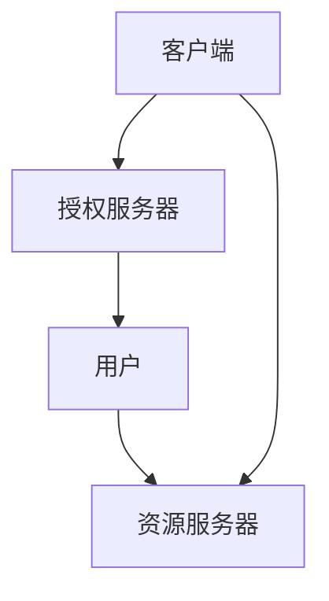
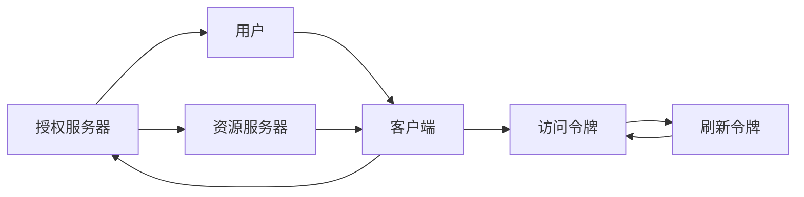

                 

# 使用 OAuth 2.0 进行安全访问

> 关键词：OAuth 2.0, 安全访问, 授权协议, 认证服务, 开放API

## 1. 背景介绍

### 1.1 问题由来
随着互联网和Web技术的发展，越来越多的应用程序需要通过网络进行交互和数据共享。然而，在传统的Web应用程序中，用户的身份信息常常以明文方式在网络中传输，存在着极大的安全风险。同时，不同系统之间的数据访问和授权控制也变得复杂且不兼容。为此，OAuth 2.0协议应运而生，旨在提供一个安全的、统一的、开放的授权机制，解决这些问题。

### 1.2 问题核心关键点
OAuth 2.0的核心思想是通过授权服务器（Authorization Server，简称AS）和资源服务器（Resource Server，简称RS）来实现用户与资源的分离，保障用户隐私和数据安全。其核心包括以下几个关键点：
- 客户端（Client）向授权服务器提出授权请求，请求获得对资源的访问权限。
- 授权服务器向用户发起授权请求，用户同意或拒绝授权。
- 授权服务器向资源服务器发出授权令牌（Token），允许客户端访问资源。
- 资源服务器接收客户端提交的Token，验证通过后向客户端提供请求的资源。

### 1.3 问题研究意义
OAuth 2.0协议为Web应用程序提供了可靠的安全机制，能够保护用户隐私和数据安全，同时也简化了不同系统之间的数据访问和授权控制，降低了系统之间的耦合度。同时，OAuth 2.0还可以实现单点登录（Single Sign-On，SSO），提高用户的使用体验。因此，OAuth 2.0成为了Web应用领域不可或缺的安全协议。

## 2. 核心概念与联系

### 2.1 核心概念概述

为了更好地理解OAuth 2.0协议，本节将介绍几个核心概念：

- **OAuth 2.0**：OAuth 2.0协议是一个安全的授权协议，用于授权第三方应用访问用户资源，同时保护用户隐私和数据安全。
- **授权服务器（Authorization Server）**：负责验证客户端的身份，向用户发起授权请求，发放访问令牌（Access Token）。
- **资源服务器（Resource Server）**：负责验证客户端提交的Token，允许访问资源。
- **客户端（Client）**：需要访问资源的应用程序，可以是Web应用、移动应用等。
- **用户（Resource Owner）**：需要授权的应用的用户，可以是社交媒体用户、公司员工等。
- **访问令牌（Access Token）**：授权服务器发放的令牌，用于验证客户端访问资源的权限。
- **刷新令牌（Refresh Token）**：与访问令牌一同发放的令牌，用于刷新访问令牌。
- **密令（Client Secret）**：客户端的密钥，用于客户端和授权服务器之间的认证。

这些核心概念通过OAuth 2.0协议紧密相连，共同构成了一个安全、开放、统一的授权体系。以下是一个Mermaid流程图，展示了OAuth 2.0的核心流程：



### 2.2 概念间的关系

这些核心概念之间的逻辑关系可以通过以下Mermaid流程图来展示：



这个流程图展示了大体的OAuth 2.0授权流程：客户端向授权服务器发起授权请求，授权服务器向用户发起授权请求，用户同意后，授权服务器发放访问令牌和刷新令牌，客户端使用访问令牌向资源服务器请求资源，资源服务器验证令牌，允许客户端访问资源。

## 3. 核心算法原理 & 具体操作步骤
### 3.1 算法原理概述

OAuth 2.0的授权流程基于客户端认证和授权码（Authorization Code）机制。具体步骤如下：

1. 客户端向授权服务器发送认证请求，请求获取授权码。
2. 授权服务器向用户发起授权请求，用户同意或拒绝授权。
3. 如果用户同意授权，授权服务器发放授权码。
4. 客户端将授权码和客户端密钥一起发送到授权服务器，交换访问令牌和刷新令牌。
5. 客户端使用访问令牌向资源服务器请求资源。
6. 资源服务器验证令牌，允许客户端访问资源。

### 3.2 算法步骤详解

以下是一个详细的OAuth 2.0授权步骤：

1. 客户端向授权服务器发送认证请求，请求获取授权码：

```python
auth_request = Client.send_auth_request(
    authorization_endpoint, 
    redirect_uri, 
    client_secret)
```

2. 授权服务器向用户发起授权请求，用户同意或拒绝授权：

```python
user_auth_url = auth_request['auth_url']
redirect_uri = auth_request['redirect_uri']
```

3. 如果用户同意授权，授权服务器发放授权码：

```python
auth_code = auth_request['auth_code']
```

4. 客户端将授权码和客户端密钥一起发送到授权服务器，交换访问令牌和刷新令牌：

```python
token_response = Client.send_token_request(
    token_endpoint, 
    auth_code, 
    client_secret)
```

5. 客户端使用访问令牌向资源服务器请求资源：

```python
access_token = token_response['access_token']
resource_url = resource_endpoint
```

6. 资源服务器验证令牌，允许客户端访问资源：

```python
resource_response = ResourceServer.get_resource(
    resource_url, 
    access_token)
```

### 3.3 算法优缺点

OAuth 2.0具有以下优点：

- 安全性高：通过授权码机制，防止了令牌泄露和重放攻击。
- 灵活性高：支持多种认证方式，适用于不同的应用场景。
- 可扩展性强：支持多种资源服务器，满足不同需求的系统。

同时，OAuth 2.0也存在一些缺点：

- 认证过程较为复杂：需要多个步骤和多个服务器交互，增加了开发难度。
- 令牌管理较为复杂：需要同时管理访问令牌和刷新令牌，增加了系统负担。
- 客户端和服务器之间的通信需要加密，增加了系统复杂性。

### 3.4 算法应用领域

OAuth 2.0在Web应用、移动应用、物联网等领域得到了广泛应用，以下是一些具体的应用场景：

- **Web应用**：通过OAuth 2.0实现单点登录和资源共享，提高了用户的使用体验和系统的安全性。
- **移动应用**：通过OAuth 2.0实现跨平台授权，支持iOS、Android等不同系统。
- **物联网**：通过OAuth 2.0实现设备间的授权和数据访问，保护用户隐私和设备安全。
- **云服务**：通过OAuth 2.0实现云服务之间的授权和数据共享，降低了系统之间的耦合度。
- **第三方应用**：通过OAuth 2.0实现第三方应用对用户资源的访问，保护用户隐私和数据安全。

## 4. 数学模型和公式 & 详细讲解 & 举例说明（备注：数学公式请使用latex格式，latex嵌入文中独立段落使用 $$，段落内使用 $)
### 4.1 数学模型构建

OAuth 2.0的授权流程涉及多个步骤和服务器之间的交互，可以使用数学模型来描述这个流程。以下是一个简单的数学模型：

假设客户端的ID为$C$，授权服务器ID为$AS$，资源服务器ID为$RS$，用户的ID为$U$。客户端向授权服务器发送认证请求，请求获取授权码。授权服务器向用户发起授权请求，用户同意或拒绝授权。如果用户同意授权，授权服务器发放授权码。客户端将授权码和客户端密钥一起发送到授权服务器，交换访问令牌和刷新令牌。客户端使用访问令牌向资源服务器请求资源。资源服务器验证令牌，允许客户端访问资源。

### 4.2 公式推导过程

以下是一个简单的公式推导过程：

1. 客户端向授权服务器发送认证请求：

$$
C \rightarrow AS: \{C, \text{redirect\_uri}, \text{client\_secret}\}
$$

2. 授权服务器向用户发起授权请求：

$$
AS \rightarrow U: \text{auth\_url}
$$

3. 用户同意授权，授权服务器发放授权码：

$$
U \rightarrow AS: \text{auth\_code}
$$

4. 客户端将授权码和客户端密钥一起发送到授权服务器，交换访问令牌和刷新令牌：

$$
C \rightarrow AS: \{\text{auth\_code}, \text{client\_secret}\} \rightarrow \{\text{access\_token}, \text{refresh\_token}\}
$$

5. 客户端使用访问令牌向资源服务器请求资源：

$$
C \rightarrow RS: \{\text{access\_token}, \text{resource\_url}\} \rightarrow \text{resource\_data}
$$

6. 资源服务器验证令牌，允许客户端访问资源：

$$
RS \rightarrow C: \{\text{resource\_data}\}
$$

### 4.3 案例分析与讲解

以下是一个简单的案例分析：

假设有一个Web应用需要访问用户的邮箱信息。客户端向授权服务器请求获取授权码，授权服务器向用户发起授权请求，用户同意授权，授权服务器发放授权码。客户端将授权码和客户端密钥一起发送到授权服务器，交换访问令牌和刷新令牌。客户端使用访问令牌向资源服务器请求邮箱信息，资源服务器验证令牌，允许客户端访问邮箱信息。

## 5. 项目实践：代码实例和详细解释说明
### 5.1 开发环境搭建

在进行OAuth 2.0实践前，我们需要准备好开发环境。以下是使用Python进行OAuth 2.0开发的常见环境配置流程：

1. 安装Python：从官网下载并安装Python，选择最新版本。
2. 安装OAuth 2.0库：使用pip安装OAuth 2.0库，如requests-oauthlib、oauthlib等。
3. 配置环境变量：设置Python环境变量，如环境变量文件、pip配置文件等。
4. 编写代码：使用Python编写OAuth 2.0授权流程的代码，如客户端认证、授权码交换、资源访问等。

完成上述步骤后，即可在Python环境下进行OAuth 2.0的开发实践。

### 5.2 源代码详细实现

下面是一个简单的OAuth 2.0代码实现：

```python
import requests

# 客户端认证
def client_auth(request, client_id, client_secret):
    auth_data = {
        'client_id': client_id,
        'client_secret': client_secret
    }
    response = requests.post(request, data=auth_data)
    return response.json()

# 获取授权码
def get_auth_code(auth_url, redirect_uri, client_id, client_secret):
    auth_request = {
        'auth_url': auth_url,
        'redirect_uri': redirect_uri,
        'client_id': client_id,
        'client_secret': client_secret
    }
    response = client_auth(auth_request, client_id, client_secret)
    auth_code = response['auth_code']
    return auth_code

# 授权码交换访问令牌和刷新令牌
def exchange_token(token_url, auth_code, client_id, client_secret):
    token_request = {
        'auth_code': auth_code,
        'client_id': client_id,
        'client_secret': client_secret
    }
    response = client_auth(token_url, client_id, client_secret)
    access_token = response['access_token']
    refresh_token = response['refresh_token']
    return access_token, refresh_token

# 使用访问令牌访问资源
def access_resource(resource_url, access_token):
    resource_request = {
        'access_token': access_token
    }
    response = requests.get(resource_url, headers=resource_request)
    return response.text
```

### 5.3 代码解读与分析

以下是代码的详细解读：

- `client_auth`函数：用于客户端认证，发送认证请求并获取响应。
- `get_auth_code`函数：用于获取授权码，将认证请求发送给授权服务器，获取授权码。
- `exchange_token`函数：用于授权码交换访问令牌和刷新令牌，将授权码和客户端密钥一起发送到授权服务器，获取访问令牌和刷新令牌。
- `access_resource`函数：用于使用访问令牌访问资源，发送GET请求并获取资源数据。

## 6. 实际应用场景
### 6.1 未来应用展望

随着OAuth 2.0的普及和应用，其在Web应用、移动应用、物联网等领域的应用前景将更加广阔。未来的应用趋势包括：

1. 更多的应用场景：OAuth 2.0将应用于更多的应用场景，如医疗、金融、教育等领域，保护用户隐私和数据安全。
2. 更高的安全性：OAuth 2.0将进一步提高安全性，通过更多的加密和认证手段，防止令牌泄露和重放攻击。
3. 更强的扩展性：OAuth 2.0将支持更多的认证方式和资源服务器，满足不同需求的系统。
4. 更灵活的授权机制：OAuth 2.0将支持更多的授权方式和权限控制，提高系统的灵活性。
5. 更完善的API设计：OAuth 2.0将提供更完善的API设计，方便开发者实现授权流程。

## 7. 工具和资源推荐
### 7.1 学习资源推荐

为了帮助开发者系统掌握OAuth 2.0协议的理论基础和实践技巧，这里推荐一些优质的学习资源：

1. **OAuth 2.0官方文档**：OAuth 2.0官方文档提供了详细的协议规范和实现指南，是学习OAuth 2.0的最佳入门资源。
2. **OAuth 2.0标准规范**：OAuth 2.0标准规范是OAuth 2.0协议的核心，提供了详细的规范和实现要求。
3. **OAuth 2.0实战指南**：OAuth 2.0实战指南提供了丰富的实践案例和代码实现，帮助开发者深入理解OAuth 2.0。
4. **OAuth 2.0权威指南**：OAuth 2.0权威指南提供了详细的理论基础和实践技巧，是学习OAuth 2.0的权威资源。
5. **OAuth 2.0实战演练**：OAuth 2.0实战演练提供了实际的代码实现和实验环境，帮助开发者动手实践OAuth 2.0。

通过对这些资源的学习实践，相信你一定能够快速掌握OAuth 2.0协议的理论基础和实践技巧，并用于解决实际的OAuth 2.0问题。

### 7.2 开发工具推荐

高效的开发离不开优秀的工具支持。以下是几款用于OAuth 2.0开发的常用工具：

1. **Requests库**：用于发送HTTP请求，支持OAuth 2.0的认证和授权流程。
2. **OAuth 2.0库**：如requests-oauthlib、oauthlib等，提供OAuth 2.0的认证和授权功能。
3. **Postman**：用于测试API接口，支持OAuth 2.0的认证和授权流程。
4. **Swagger**：用于设计API接口，支持OAuth 2.0的认证和授权流程。
5. **Jenkins**：用于持续集成和部署，支持OAuth 2.0的认证和授权流程。

合理利用这些工具，可以显著提升OAuth 2.0开发的效率，加快创新迭代的步伐。

### 7.3 相关论文推荐

OAuth 2.0协议的研究方向涉及到多个领域，以下是几篇奠基性的相关论文，推荐阅读：

1. **OAuth 2.0标准规范**：OAuth 2.0标准规范是OAuth 2.0协议的核心，提供了详细的规范和实现要求。
2. **OAuth 2.0安全性分析**：OAuth 2.0安全性分析提供了详细的安全性分析和改进建议，帮助开发者提高系统的安全性。
3. **OAuth 2.0扩展性设计**：OAuth 2.0扩展性设计提供了详细的扩展性设计和实现方法，帮助开发者提高系统的扩展性。
4. **OAuth 2.0实践指南**：OAuth 2.0实践指南提供了详细的实践案例和代码实现，帮助开发者深入理解OAuth 2.0。
5. **OAuth 2.0技术发展**：OAuth 2.0技术发展提供了详细的技术发展历程和未来趋势，帮助开发者把握技术方向。

除上述资源外，还有一些值得关注的前沿资源，帮助开发者紧跟OAuth 2.0协议的发展趋势，例如：

1. **OAuth 2.0预印本**：OAuth 2.0预印本提供了最新的研究进展和未来趋势，帮助开发者紧跟前沿技术。
2. **OAuth 2.0会议论文**：OAuth 2.0会议论文提供了最新的研究进展和未来趋势，帮助开发者紧跟前沿技术。
3. **OAuth 2.0开源项目**：OAuth 2.0开源项目提供了丰富的实现案例和代码实现，帮助开发者深入理解OAuth 2.0。

总之，对于OAuth 2.0协议的学习和实践，需要开发者保持开放的心态和持续学习的意愿。多关注前沿资讯，多动手实践，多思考总结，必将收获满满的成长收益。

## 8. 总结：未来发展趋势与挑战
### 8.1 研究成果总结

OAuth 2.0协议自发布以来，在Web应用、移动应用、物联网等领域得到了广泛应用，极大地提高了系统的安全性和可靠性。然而，OAuth 2.0协议也存在一些挑战和局限性，需要在未来的研究中进一步改进和完善。

### 8.2 未来发展趋势

OAuth 2.0协议未来的发展趋势包括：

1. 更高的安全性：OAuth 2.0将进一步提高安全性，通过更多的加密和认证手段，防止令牌泄露和重放攻击。
2. 更强的扩展性：OAuth 2.0将支持更多的认证方式和资源服务器，满足不同需求的系统。
3. 更灵活的授权机制：OAuth 2.0将支持更多的授权方式和权限控制，提高系统的灵活性。
4. 更完善的API设计：OAuth 2.0将提供更完善的API设计，方便开发者实现授权流程。
5. 更广泛的应用场景：OAuth 2.0将应用于更多的应用场景，如医疗、金融、教育等领域，保护用户隐私和数据安全。

### 8.3 面临的挑战

尽管OAuth 2.0协议已经取得了显著的成就，但在迈向更加智能化、普适化应用的过程中，仍面临诸多挑战：

1. 认证过程较为复杂：需要多个步骤和多个服务器交互，增加了开发难度。
2. 令牌管理较为复杂：需要同时管理访问令牌和刷新令牌，增加了系统负担。
3. 客户端和服务器之间的通信需要加密，增加了系统复杂性。
4. 授权流程较为繁琐：需要多个步骤和多个服务器交互，增加了系统复杂性。
5. 跨平台兼容性较差：不同系统之间的兼容性和互操作性较差，增加了系统的复杂性。

### 8.4 研究展望

面对OAuth 2.0协议面临的挑战，未来的研究需要在以下几个方面寻求新的突破：

1. 简化认证流程：通过简化认证流程，减少认证步骤，提高系统的易用性。
2. 优化令牌管理：通过优化令牌管理，减少令牌数量，降低系统负担。
3. 增强安全性：通过增强安全性，防止令牌泄露和重放攻击，提高系统的可靠性。
4. 提高跨平台兼容性：通过提高跨平台兼容性，增强不同系统之间的互操作性，降低系统的复杂性。
5. 增强灵活性：通过增强灵活性，支持更多的认证方式和资源服务器，满足不同需求的系统。

这些研究方向的探索，必将引领OAuth 2.0协议迈向更高的台阶，为构建安全、可靠、灵活的Web应用提供强大的技术支持。总之，OAuth 2.0协议需要开发者不断探索和优化，才能更好地服务于Web应用和移动应用，保障用户隐私和数据安全。

## 9. 附录：常见问题与解答
### 9.1 常见问题

以下列举了OAuth 2.0协议的一些常见问题及其解答：

**Q1：OAuth 2.0协议是如何保证安全的？**

A：OAuth 2.0协议通过授权码机制、令牌交换、令牌验证等机制，保证系统的安全性。授权码机制防止令牌泄露，令牌交换防止令牌重放，令牌验证防止令牌篡改。

**Q2：OAuth 2.0协议支持的认证方式有哪些？**

A：OAuth 2.0协议支持的认证方式包括密码认证、客户端认证、第三方认证等。不同的认证方式适用于不同的应用场景。

**Q3：OAuth 2.0协议的授权码和访问令牌有什么不同？**

A：授权码是授权服务器发放的，用于授权客户端访问资源。访问令牌是授权服务器发放的，用于验证客户端访问资源的权限。

**Q4：OAuth 2.0协议的刷新令牌和访问令牌有什么不同？**

A：刷新令牌是授权服务器发放的，用于刷新访问令牌。访问令牌是授权服务器发放的，用于验证客户端访问资源的权限。

**Q5：OAuth 2.0协议的客户端认证和资源认证有什么区别？**

A：客户端认证是指客户端向授权服务器证明其身份，获取访问令牌和刷新令牌的过程。资源认证是指资源服务器验证客户端提交的令牌，允许访问资源的过程。

**Q6：OAuth 2.0协议的授权码和访问令牌应该如何存储和管理？**

A：授权码和访问令牌应该存储在客户端的安全位置，避免泄露。同时，应该定期刷新令牌，以保持令牌的有效性。

总之，OAuth 2.0协议是一个安全、开放、统一的授权协议，能够保护用户隐私和数据安全，同时也简化了不同系统之间的数据访问和授权控制，降低了系统之间的耦合度。面对未来更广阔的应用场景和更高的安全性要求，OAuth 2.0协议需要开发者不断探索和优化，才能更好地服务于Web应用和移动应用，保障用户隐私和数据安全。

---

作者：禅与计算机程序设计艺术 / Zen and the Art of Computer Programming

