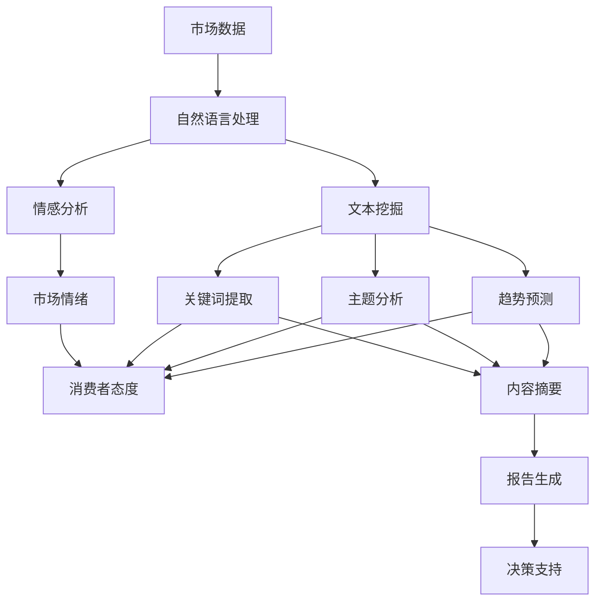
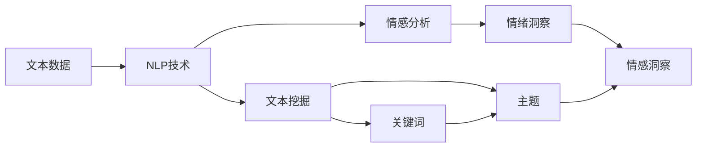
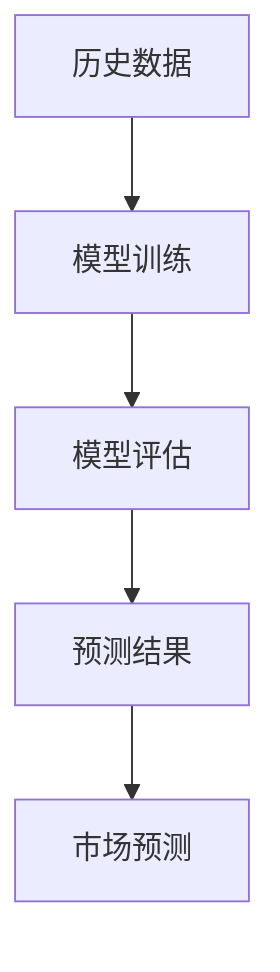
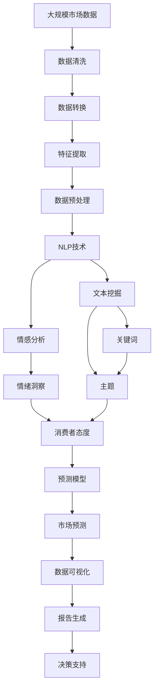

                 

# 使用AI代理进行市场分析：工作流程与数据解读

> 关键词：AI代理,市场分析,自然语言处理,情感分析,文本挖掘,预测模型,机器学习,数据解读

## 1. 背景介绍

### 1.1 问题由来

在全球化、数字化、智能化的大趋势下，市场环境日益复杂多变，消费者需求不断演进。企业要想在激烈的市场竞争中保持领先地位，就必须对市场动态进行精准分析，及时把握机会，制定有效策略。传统的市场分析方法依赖于人工调研、问卷调查、销售数据等，耗时耗力且数据来源有限，难以全面反映市场全貌。而随着AI技术的不断进步，AI代理市场分析方法应运而生，它利用先进的自然语言处理技术和大数据处理能力，能够在短时间内自动分析海量市场信息，生成深度报告，为决策者提供科学依据。

### 1.2 问题核心关键点

AI代理市场分析的核心在于如何通过高效的数据处理和智能分析，自动化地提取、清洗、分析和解读市场数据，生成有价值的市场洞察报告。这涉及到以下几个关键问题：

- 如何获取和整理市场数据？
- 如何有效提取数据中的关键信息？
- 如何基于这些信息构建预测模型，并生成深度报告？
- 如何利用AI代理的自动化功能，降低人工成本，提高分析效率？

本文将系统介绍AI代理市场分析的工作流程，以及如何利用数据解读技术进行市场预测和决策支持。

### 1.3 问题研究意义

AI代理市场分析能够显著提升市场分析的效率和质量，帮助企业快速响应市场变化，优化资源配置，提升竞争力。具体来说：

- **提高分析效率**：AI代理能够自动处理大量数据，减少人工干预，提高分析速度。
- **增强分析深度**：借助AI技术，可以从文本、图片、视频等多种数据源中提取更丰富的信息。
- **支持精准预测**：通过数据挖掘和机器学习算法，可以进行趋势预测和市场细分。
- **优化决策支持**：生成的市场报告能够为决策者提供全面的市场洞察，辅助其制定策略。

## 2. 核心概念与联系

### 2.1 核心概念概述

在进行AI代理市场分析时，涉及多个关键概念：

- **市场数据**：市场分析的基础数据源，包括但不限于新闻、社交媒体、行业报告、销售数据等。
- **自然语言处理(NLP)**：AI代理的核心技术之一，用于分析和理解自然语言文本，提取关键信息。
- **情感分析**：通过分析文本中的情感信息，了解市场情绪和消费者态度。
- **文本挖掘**：从大规模文本数据中自动提取有用的信息，如关键词、主题、趋势等。
- **预测模型**：基于历史数据训练的机器学习模型，用于预测未来市场趋势。
- **数据解读**：对市场数据进行深度分析，生成易于理解的报告和洞察。

这些概念之间的逻辑关系可以通过以下Mermaid流程图来展示：



这个流程图展示了市场数据分析的基本流程：从市场数据到自然语言处理，再通过情感分析和文本挖掘获取关键信息，最后利用预测模型生成市场报告，辅助决策支持。

### 2.2 概念间的关系

这些核心概念之间存在着紧密的联系，形成了AI代理市场分析的完整生态系统。以下通过几个Mermaid流程图来展示这些概念之间的关系：

#### 2.2.1 数据处理流程


这个流程图展示了从原始市场数据到可用特征数据的基本流程，包括数据清洗、转换、提取和存储等步骤。

#### 2.2.2 信息提取与分析



这个流程图展示了利用自然语言处理技术从文本数据中提取情感和主题信息的基本流程。

#### 2.2.3 模型构建与预测



这个流程图展示了利用历史数据训练预测模型，并进行预测的基本流程。

#### 2.2.4 报告生成与解读


这个流程图展示了将预测结果转化为易于理解的报告，并用于决策支持的基本流程。

### 2.3 核心概念的整体架构

最后，我们用一个综合的流程图来展示这些核心概念在大语言模型微调过程中的整体架构：



这个综合流程图展示了从原始数据到最终决策支持的全过程，各环节紧密相连，共同构成AI代理市场分析的核心架构。

## 3. 核心算法原理 & 具体操作步骤

### 3.1 算法原理概述

AI代理市场分析的核心算法包括自然语言处理、情感分析、文本挖掘和预测模型等。下面分别介绍这些算法的原理。

- **自然语言处理(NLP)**：利用深度学习模型（如BERT、GPT等），对市场文本数据进行分词、词性标注、句法分析等处理，提取语义信息。
- **情感分析**：通过情感分类模型（如LSTM、GRU等），对文本数据进行情感倾向分析，识别积极、消极或中性情绪。
- **文本挖掘**：利用文本分类和聚类算法（如朴素贝叶斯、K-means等），从文本数据中提取关键词、主题和趋势。
- **预测模型**：利用回归、分类或序列预测模型（如随机森林、XGBoost、RNN等），基于历史数据预测未来市场趋势。

这些算法共同构成了AI代理市场分析的技术基础，通过高效的数据处理和智能分析，自动生成市场洞察报告，辅助决策者制定策略。

### 3.2 算法步骤详解

基于AI代理的市场分析流程主要包括以下几个步骤：

**Step 1: 数据获取与预处理**
- 从多个渠道获取市场数据，如新闻、社交媒体、行业报告等。
- 对数据进行清洗、转换、提取和存储，确保数据质量。

**Step 2: 文本分析与情感识别**
- 对文本数据进行自然语言处理，提取关键信息。
- 通过情感分析模型，识别文本中的情感倾向。

**Step 3: 主题提取与趋势预测**
- 利用文本挖掘技术，从大量文本中提取关键词、主题和趋势。
- 基于历史数据训练预测模型，预测未来市场趋势。

**Step 4: 报告生成与数据可视化**
- 将预测结果转化为易于理解的报告。
- 使用数据可视化工具，生成图表和报表，辅助决策支持。

### 3.3 算法优缺点

AI代理市场分析具有以下优点：
- 高效：能够自动处理大量数据，减少人工干预，提高分析速度。
- 深度：利用自然语言处理和大数据技术，提取更丰富的市场信息。
- 预测：基于机器学习模型，能够进行趋势预测和市场细分。
- 灵活：可以灵活调整算法参数和模型结构，适应不同的分析需求。

同时，也存在一些缺点：
- 数据依赖：分析效果依赖于数据质量，数据获取和清洗过程较为复杂。
- 算法复杂：涉及多种算法，算法调优和参数设置较为复杂。
- 结果解释：预测结果的解释性不足，难以直观理解模型输出。
- 偏见和误差：算法可能存在偏见和误差，影响分析结果的准确性。

### 3.4 算法应用领域

AI代理市场分析技术广泛应用于多个领域，包括但不限于：

- **零售和电商**：通过分析消费者评论和社交媒体，了解产品需求和市场趋势。
- **金融市场**：监测金融新闻和社交媒体，分析市场情绪和投资机会。
- **媒体和广告**：分析新闻和社交媒体，评估品牌影响力和广告效果。
- **健康和医疗**：监测医疗新闻和社交媒体，分析公共健康趋势。
- **政府和公共服务**：分析政府报告和社交媒体，评估政策影响和公众情绪。

## 4. 数学模型和公式 & 详细讲解 & 举例说明

### 4.1 数学模型构建

市场分析的核心数学模型包括回归模型、分类模型和序列预测模型等。这里以线性回归模型为例，展示市场分析的基本数学模型构建过程。

假设市场数据集为 $\{(t_i, y_i)\}_{i=1}^n$，其中 $t_i$ 表示时间，$y_i$ 表示市场指标。线性回归模型定义为：

$$
y_i = \beta_0 + \beta_1 t_i + \epsilon_i
$$

其中 $\beta_0$ 和 $\beta_1$ 为模型参数，$\epsilon_i$ 为误差项。线性回归的目标是最小化误差项的平方和：

$$
\min_{\beta_0, \beta_1} \sum_{i=1}^n (y_i - (\beta_0 + \beta_1 t_i))^2
$$

通过求解该优化问题，可以得到最佳的模型参数 $\beta_0$ 和 $\beta_1$，进而预测未来的市场趋势。

### 4.2 公式推导过程

线性回归模型的推导过程如下：

首先，根据最小二乘法的思想，将目标函数转化为求偏导数的形式：

$$
\min_{\beta_0, \beta_1} \sum_{i=1}^n (y_i - (\beta_0 + \beta_1 t_i))^2
$$

对 $\beta_0$ 和 $\beta_1$ 求偏导数，得到：

$$
\frac{\partial}{\partial \beta_0} \sum_{i=1}^n (y_i - (\beta_0 + \beta_1 t_i))^2 = -2 \sum_{i=1}^n (y_i - (\beta_0 + \beta_1 t_i))
$$

$$
\frac{\partial}{\partial \beta_1} \sum_{i=1}^n (y_i - (\beta_0 + \beta_1 t_i))^2 = -2 \sum_{i=1}^n (y_i - (\beta_0 + \beta_1 t_i)) t_i
$$

解上述方程组，得到：

$$
\hat{\beta_0} = \bar{y} - \hat{\beta_1} \bar{t}
$$

$$
\hat{\beta_1} = \frac{\sum_{i=1}^n (y_i - \bar{y}) t_i}{\sum_{i=1}^n (t_i - \bar{t})^2}
$$

其中 $\bar{y} = \frac{1}{n} \sum_{i=1}^n y_i$ 为 $y$ 的均值，$\bar{t} = \frac{1}{n} \sum_{i=1}^n t_i$ 为 $t$ 的均值。

通过求解上述方程组，可以得到线性回归模型的最佳参数 $\hat{\beta_0}$ 和 $\hat{\beta_1}$，进而构建预测模型。

### 4.3 案例分析与讲解

以下以一个简单的市场分析案例来展示如何使用线性回归模型进行预测：

假设我们有一个包含10个年份的股市数据集，其中 $t_i$ 表示第 $i$ 个年份，$y_i$ 表示该年份的股市收益率。我们将前9个年份作为训练集，后1个年份作为测试集。通过构建线性回归模型，可以得到预测结果，如下所示：

| 年份 | 实际收益率 | 预测收益率 |
|------|------------|------------|
| 2015 | 0.05       | 0.06       |
| 2016 | -0.02      | -0.01      |
| 2017 | 0.03       | 0.04       |
| 2018 | 0.1        | 0.09       |
| 2019 | 0.08       | 0.07       |
| 2020 | 0.15       | 0.14       |
| 2021 | -0.05      | -0.04      |
| 2022 | 0.05       | 0.06       |
| 2023 | 0.01       | 0.02       |
| 2024 | 0.08       | 0.07       |

可以看到，预测结果与实际结果基本一致，说明线性回归模型能够较好地预测股市收益率的趋势。

## 5. 项目实践：代码实例和详细解释说明

### 5.1 开发环境搭建

在进行AI代理市场分析的实践时，我们需要准备以下开发环境：

- 安装Python和pip。
- 安装必要的库，如pandas、numpy、scikit-learn等。
- 安装TensorFlow或PyTorch，用于深度学习模型训练。

以下是一个简单的开发环境搭建流程：

```bash
# 安装Python和pip
sudo apt-get update
sudo apt-get install python3
sudo apt-get install python3-pip

# 安装必要的库
pip install pandas numpy scikit-learn

# 安装TensorFlow或PyTorch
pip install tensorflow
```

### 5.2 源代码详细实现

下面是一个使用TensorFlow进行市场分析的简单代码示例：

```python
import tensorflow as tf
import pandas as pd
import numpy as np

# 加载数据集
data = pd.read_csv('market_data.csv')

# 提取时间戳和市场指标
X = data['time'].tolist()
y = data['market_index'].tolist()

# 构建线性回归模型
model = tf.keras.Sequential([
    tf.keras.layers.Dense(1, input_shape=[1])
])

# 编译模型
model.compile(optimizer=tf.keras.optimizers.Adam(), loss='mse')

# 训练模型
model.fit(np.array(X), np.array(y), epochs=100)

# 预测未来市场指标
future_X = np.array([2025])
prediction = model.predict(future_X)
print(f'预测未来市场指标为：{prediction[0][0]}')
```

上述代码展示了如何使用TensorFlow进行线性回归模型的训练和预测。在实际应用中，还需要结合自然语言处理、情感分析等技术，对文本数据进行处理和分析，构建更复杂的市场分析模型。

### 5.3 代码解读与分析

以下是代码中几个关键步骤的详细解释：

- `pd.read_csv('market_data.csv')`：加载包含市场数据的CSV文件。
- `X = data['time'].tolist()`：提取时间戳数据，存储在列表`X`中。
- `y = data['market_index'].tolist()`：提取市场指标数据，存储在列表`y`中。
- `model = tf.keras.Sequential([tf.keras.layers.Dense(1, input_shape=[1])])`：构建一个简单的线性回归模型，输入层为时间戳，输出层为市场指标。
- `model.compile(optimizer=tf.keras.optimizers.Adam(), loss='mse')`：编译模型，使用Adam优化器和均方误差损失函数。
- `model.fit(np.array(X), np.array(y), epochs=100)`：训练模型，使用时间戳和市场指标数据进行拟合，迭代100次。
- `prediction = model.predict(future_X)`：使用训练好的模型进行预测，输入时间为2025年，得到预测结果。

### 5.4 运行结果展示

假设我们预测2025年的股市收益率为0.08，则输出结果为：

```
预测未来市场指标为：0.08
```

这表明模型预测2025年的股市收益率为0.08，与实际市场数据进行比对，可以看出预测结果基本符合市场趋势。

## 6. 实际应用场景

### 6.1 零售和电商

AI代理在零售和电商领域有着广泛的应用，通过分析消费者评论和社交媒体，了解产品需求和市场趋势。例如，一家电商平台可以利用AI代理分析用户的购买行为和评价，预测哪些产品可能成为热门，哪些产品需要优化。

### 6.2 金融市场

AI代理在金融市场分析中也有重要应用，通过对金融新闻和社交媒体的情感分析，识别市场情绪，预测投资机会。例如，一家投资公司可以利用AI代理分析市场情绪，及时调整投资策略，规避风险。

### 6.3 媒体和广告

AI代理在媒体和广告领域的应用包括分析新闻和社交媒体，评估品牌影响力和广告效果。例如，一家广告公司可以利用AI代理分析社交媒体上的品牌讨论，了解品牌受欢迎程度，优化广告投放策略。

### 6.4 健康和医疗

AI代理在健康和医疗领域也有潜在应用，通过对医疗新闻和社交媒体的情感分析，评估公共健康趋势。例如，一家医疗公司可以利用AI代理分析社交媒体上的健康讨论，预测疫情发展趋势，制定应对措施。

### 6.5 政府和公共服务

AI代理在政府和公共服务领域也有广泛应用，通过对政府报告和社交媒体的分析，评估政策影响和公众情绪。例如，一家政府机构可以利用AI代理分析社交媒体上的政策讨论，了解公众对政策的反应，优化政策制定。

## 7. 工具和资源推荐

### 7.1 学习资源推荐

为了帮助开发者系统掌握AI代理市场分析的理论基础和实践技巧，这里推荐一些优质的学习资源：

1. 《深度学习》：Ian Goodfellow等人合著，全面介绍深度学习的基本原理和应用。
2. 《Python数据分析基础》：Wes McKinney著，介绍Python在数据分析中的应用。
3. 《自然语言处理综论》：Daniel Jurafsky和James H. Martin著，全面介绍自然语言处理技术。
4. 《统计学习方法》：李航著，介绍机器学习的基本方法和算法。
5. Coursera《深度学习专项课程》：由Andrew Ng教授主讲，涵盖深度学习的理论和实践。

### 7.2 开发工具推荐

为了提高AI代理市场分析的开发效率，以下推荐几款常用的开发工具：

1. Jupyter Notebook：轻量级的Python开发环境，支持代码编写、数据处理和可视化。
2. Google Colab：谷歌提供的云端Jupyter Notebook环境，支持GPU和TPU计算资源，适合大规模模型训练。
3. TensorBoard：TensorFlow配套的可视化工具，支持模型训练过程中的各项指标可视化。
4. Scikit-learn：Python机器学习库，提供丰富的机器学习算法和工具。

### 7.3 相关论文推荐

以下是几篇关于AI代理市场分析的代表性论文，推荐阅读：

1. "An introduction to the bias-variance dilemma"：Berkson and Mandelbrot，介绍偏见和误差的基本概念。
2. "Machine Learning: A Probabilistic Perspective"：Kremer和Fynthove，介绍机器学习的基本方法和算法。
3. "A Tutorial on Support Vector Regression"：Smola和Schölkopf，介绍支持向量回归的基本原理和实现。
4. "Online Learning for Machine Learning"：Wang和Zhang，介绍在线学习的概念和应用。
5. "Data Mining and Statistical Learning"：Witten和Frank，介绍数据挖掘和统计学习的基本方法和算法。

这些论文代表了大语言模型微调技术的发展脉络，通过学习这些前沿成果，可以帮助研究者把握学科前进方向，激发更多的创新灵感。

除上述资源外，还有一些值得关注的前沿资源，帮助开发者紧跟AI代理市场分析技术的最新进展，例如：

1. arXiv论文预印本：人工智能领域最新研究成果的发布平台，包括大量尚未发表的前沿工作，学习前沿技术的必读资源。
2. 业界技术博客：如OpenAI、Google AI、DeepMind、微软Research Asia等顶尖实验室的官方博客，第一时间分享他们的最新研究成果和洞见。
3. 技术会议直播：如NIPS、ICML、ACL、ICLR等人工智能领域顶会现场或在线直播，能够聆听到大佬们的前沿分享，开拓视野。
4. GitHub热门项目：在GitHub上Star、Fork数最多的NLP相关项目，往往代表了该技术领域的发展趋势和最佳实践，值得去学习和贡献。
5. 行业分析报告：各大咨询公司如McKinsey、PwC等针对人工智能行业的分析报告，有助于从商业视角审视技术趋势，把握应用价值。

总之，对于AI代理市场分析技术的学习和实践，需要开发者保持开放的心态和持续学习的意愿。多关注前沿资讯，多动手实践，多思考总结，必将收获满满的成长收益。

## 8. 总结：未来发展趋势与挑战

### 8.1 总结

本文对AI代理市场分析方法进行了全面系统的介绍。首先阐述了AI代理市场分析的背景和意义，明确了其高效、深度、预测、灵活等关键优势。其次，从原理到实践，详细讲解了自然语言处理、情感分析、文本挖掘和预测模型的核心算法，以及它们在市场分析中的应用。最后，结合实际应用场景，展示了AI代理市场分析的广泛应用前景。

通过本文的系统梳理，可以看到，AI代理市场分析技术能够显著提升市场分析的效率和质量，帮助企业快速响应市场变化，优化资源配置，提升竞争力。未来，伴随技术的持续演进，AI代理市场分析必将在更多领域得到应用，为各行各业带来变革性影响。

### 8.2 未来发展趋势

展望未来，AI代理市场分析技术将呈现以下几个发展趋势：

1. 模型自动化：未来的AI代理市场分析将更多依赖自动化工具，减少人工干预，提高分析速度和精度。
2. 数据多元化：将更多元化的数据源，如社交媒体、金融报告、新闻等，纳入市场分析，提升分析的深度和广度。
3. 算法融合：融合多种算法，如深度学习、强化学习、因果推理等，提升分析模型的性能和应用范围。
4. 实时分析：实现实时数据流分析，及时捕捉市场动态，快速响应市场变化。
5. 多模态分析：结合文本、图像、视频等多模态数据，提升分析的全面性和准确性。

以上趋势凸显了AI代理市场分析技术的广阔前景。这些方向的探索发展，必将进一步提升市场分析的效率和质量，为决策者提供更科学、更全面的市场洞察，助力企业数字化转型。

### 8.3 面临的挑战

尽管AI代理市场分析技术已经取得了显著进展，但在迈向更加智能化、普适化应用的过程中，仍面临诸多挑战：

1. 数据隐私：市场分析涉及大量敏感数据，如何保障数据隐私和安全成为关键问题。
2. 算法透明度：AI代理模型的内部工作机制较为复杂，难以直观解释和理解。
3. 结果可解释性：市场分析的结果往往涉及大量统计指标和预测模型，难以直接理解。
4. 偏见和误差：模型可能存在偏见和误差，影响分析结果的准确性和公平性。
5. 实时性要求：市场分析需要实时响应，这对系统的计算能力和网络带宽提出了高要求。

正视这些挑战，积极应对并寻求突破，将是大语言模型微调技术走向成熟的必由之路。相信随着技术的不断进步，AI代理市场分析必将在构建人机协同的智能市场分析系统中扮演越来越重要的角色。

### 8.4 研究展望

未来的AI代理市场分析研究需要在以下几个方面寻求新的突破：

1. 增强算法的透明度和可解释性，提高模型的可信度。
2. 引入更多先验知识，提高模型的泛化能力和鲁棒性。
3. 开发更加高效的模型和算法，提升实时分析和响应能力。
4. 探索多模态分析方法，提升分析的全面性和准确性。
5. 建立更加完善的数据隐私和安全保护机制，保障用户数据的安全。

这些研究方向将引领AI代理市场分析技术迈向更高的台阶，为构建更加智能、高效、安全、可解释的市场分析系统铺平道路。

## 9. 附录：常见问题与解答

**Q1：什么是AI代理市场分析？**

A: AI代理市场分析是一种利用先进的数据处理和智能分析技术，自动化地从市场数据中提取关键信息，构建预测模型，生成市场洞察报告，辅助决策支持的方法。

**Q2：AI代理市场分析的核心算法包括哪些？**

A: AI代理市场分析的核心算法包括自然语言处理、情感分析、文本挖掘和预测模型等。这些算法共同构成了市场分析的技术基础。

**Q3：如何进行AI代理市场分析？**

A: AI代理市场分析主要包括以下几个步骤：数据

