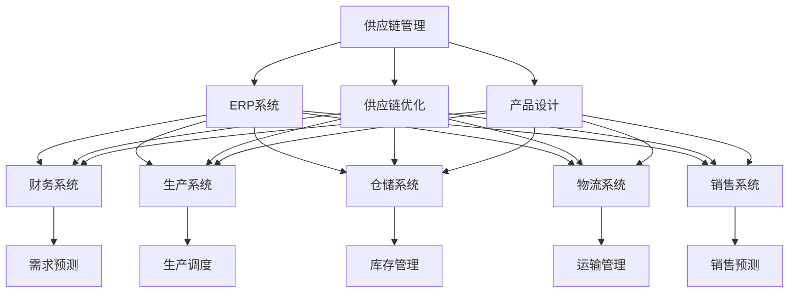
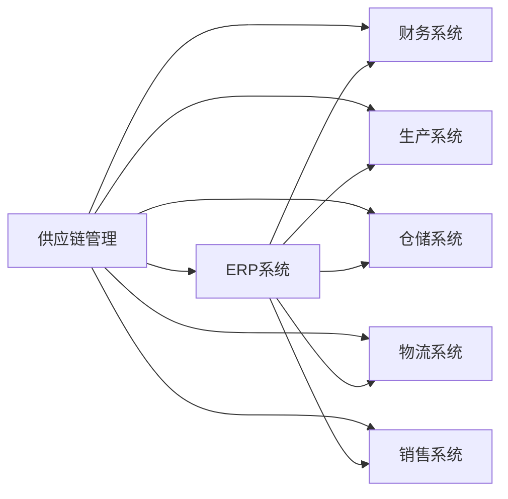
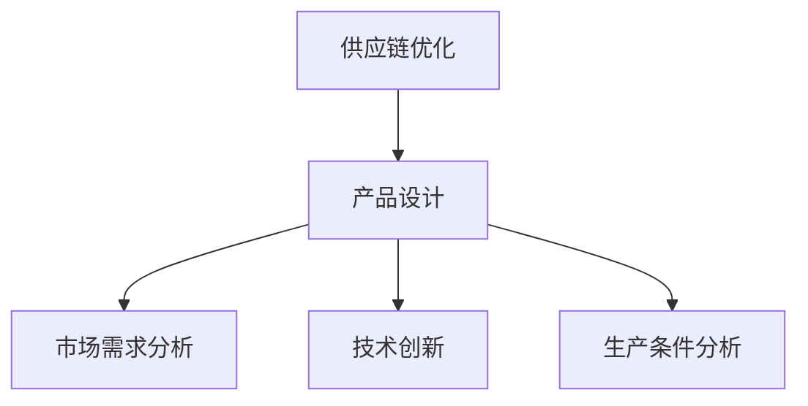
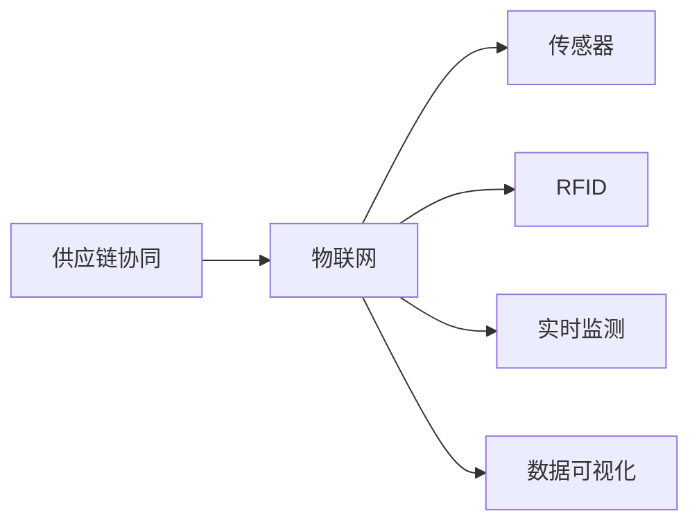
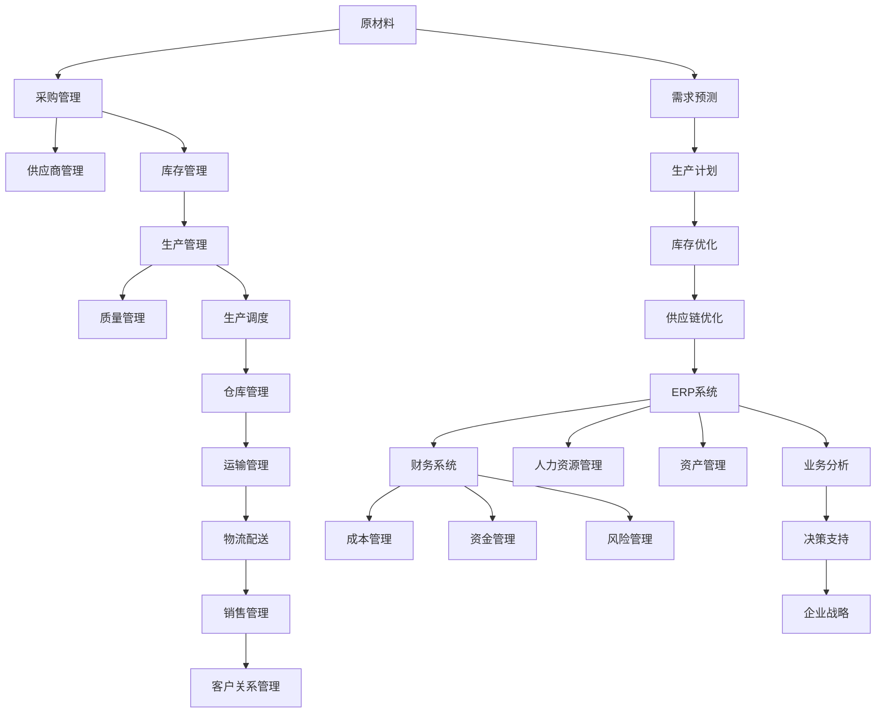

                 

# 供应链计划、企划、研发、采购、生产、仓储、库存、物流、销售、财务系统产品设计

> 关键词：供应链管理,ERP系统,供应链优化,产品设计,供应链协同,物联网,人工智能,大数据分析

## 1. 背景介绍

### 1.1 问题由来

在全球化和市场竞争日益激烈的背景下，供应链管理已成为企业竞争力的重要组成部分。优秀的供应链管理系统不仅能降低成本、提高效率，还能提升企业的市场响应速度和客户满意度。然而，传统供应链系统往往存在信息孤岛、反应迟缓、风险管理不足等问题，难以满足现代企业的需求。因此，设计和开发一套高效、灵活、智能的供应链管理系统成为了企业的迫切需求。

## 2. 核心概念与联系

### 2.1 核心概念概述

为更好地理解供应链系统设计，本节将介绍几个密切相关的核心概念：

- **供应链管理(Supply Chain Management, SCM)**：涉及原材料采购、产品生产、仓储、物流、销售等环节，通过信息流、物流、资金流的高效协同，实现供应链的优化和增值。
- **企业资源计划系统(Enterprise Resource Planning, ERP)**：整合企业内部各种资源，包括财务、人力、采购、生产、仓储、销售等，实现全面业务管理和决策支持的系统。
- **供应链优化(Supply Chain Optimization)**：通过数据分析、算法优化等手段，对供应链各个环节进行持续改进，以实现成本最低、效率最高的供应链运作。
- **产品设计(Product Design)**：结合市场需求、技术创新、生产条件等，设计出符合企业战略和市场需求的产品的过程。
- **供应链协同(Collaborative Supply Chain)**：企业间通过信息共享、资源整合，实现供应链各环节的紧密合作，提高整体竞争力。
- **物联网(Internet of Things, IoT)**：利用传感器、RFID等技术，实现物理世界与虚拟世界的互联，提高供应链的可视化和智能化水平。
- **人工智能(Artificial Intelligence, AI)**：通过机器学习、深度学习等技术，实现供应链的自动化和智能化决策。
- **大数据分析(Big Data Analysis)**：利用大数据技术，从供应链各环节中提取有价值的信息，实现更精准的决策支持。

这些核心概念之间的逻辑关系可以通过以下Mermaid流程图来展示：



这个流程图展示了供应链管理与ERP系统、供应链优化、产品设计等概念的关系。供应链管理通过整合ERP系统中的财务、生产、仓储、物流、销售等资源，实现全面业务管理。供应链优化和产品设计为供应链管理提供了决策支持和技术保障。同时，供应链协同、物联网、人工智能、大数据分析等技术手段，进一步提升了供应链系统的智能化水平。

### 2.2 概念间的关系

这些核心概念之间存在着紧密的联系，形成了供应链系统的完整生态系统。下面我通过几个Mermaid流程图来展示这些概念之间的关系。

#### 2.2.1 供应链管理与ERP系统的关系



这个流程图展示了供应链管理与ERP系统及其子系统的关系。ERP系统整合了供应链管理的各个子系统，为供应链管理提供了全面的业务管理支持。

#### 2.2.2 供应链优化与产品设计的关系



这个流程图展示了供应链优化与产品设计的关系。产品设计不仅需要考虑市场需求，还需要结合技术创新和生产条件，供应链优化则通过数据分析，帮助企业优化产品设计和供应链运作。

#### 2.2.3 供应链协同与物联网的关系



这个流程图展示了供应链协同与物联网的关系。物联网通过传感器、RFID等技术实现供应链的实时监测和数据可视化，进一步提升了供应链的协同效率。

### 2.3 核心概念的整体架构

最后，我们用一个综合的流程图来展示这些核心概念在大供应链系统中的整体架构：



这个综合流程图展示了供应链系统中各模块的相互关系。原材料通过采购管理、供应商管理、库存管理等环节进入生产环节，经生产管理、质量管理、生产调度、仓库管理、运输管理、物流配送、销售管理等环节，最终完成客户关系管理。需求预测、生产计划、库存优化、供应链优化等模块通过ERP系统整合，实现全面业务管理，并为财务系统、人力资源管理、成本管理、资金管理、风险管理、资产管理、业务分析、决策支持等模块提供数据支持和决策依据。

## 3. 核心算法原理 & 具体操作步骤
### 3.1 算法原理概述

供应链管理系统设计涉及多学科、多领域的知识，算法设计需要综合考虑业务流程、数据结构、优化算法等。以下是供应链管理系统的核心算法原理：

- **需求预测算法**：利用时间序列分析、机器学习等方法，预测市场需求变化，为供应链管理提供决策依据。
- **生产计划算法**：通过整数规划、线性规划等算法，优化生产计划，实现资源的最优配置。
- **库存管理算法**：采用经济订货批量(EOQ)、安全库存策略等方法，优化库存水平，降低库存成本。
- **运输管理算法**：通过路径规划、车辆调度等算法，优化运输路线和资源配置，提高运输效率。
- **供应链优化算法**：采用遗传算法、模拟退火等启发式算法，优化供应链各环节的决策变量，提升整体供应链效率。

### 3.2 算法步骤详解

供应链管理系统设计主要包括以下几个关键步骤：

**Step 1: 需求分析与建模**

1. 收集历史数据，包括销售数据、库存数据、市场趋势等，建立需求预测模型。
2. 通过时间序列分析、回归分析等方法，建立需求预测公式。
3. 对预测结果进行验证，优化预测模型，确保预测准确性。

**Step 2: 生产计划制定**

1. 收集生产数据，包括设备状况、人员能力、原材料供应等，建立生产计划模型。
2. 利用线性规划、整数规划等算法，优化生产计划，平衡生产量和生产资源。
3. 对生产计划进行验证，优化生产调度，确保生产效率。

**Step 3: 库存管理优化**

1. 收集库存数据，包括原材料库存、在制品库存、成品库存等，建立库存管理模型。
2. 利用经济订货批量、安全库存策略等方法，优化库存水平，降低库存成本。
3. 对库存管理模型进行验证，优化库存管理策略，确保库存水平合理。

**Step 4: 运输管理优化**

1. 收集运输数据，包括运输成本、运输时间、运输路线等，建立运输管理模型。
2. 利用路径规划、车辆调度等算法，优化运输路线和资源配置，提高运输效率。
3. 对运输管理模型进行验证，优化运输策略，确保运输效率和成本。

**Step 5: 供应链优化**

1. 综合考虑需求预测、生产计划、库存管理、运输管理等环节，建立供应链优化模型。
2. 利用遗传算法、模拟退火等启发式算法，优化供应链决策变量，提升整体供应链效率。
3. 对供应链优化模型进行验证，优化供应链策略，确保供应链整体最优。

### 3.3 算法优缺点

供应链管理系统设计的主要算法具有以下优点：

1. **优化生产效率**：通过优化生产计划和库存管理，减少生产过程中的浪费，提高生产效率。
2. **降低成本**：通过优化运输管理和供应链策略，降低运输和库存成本，提升整体供应链成本效益。
3. **提高客户满意度**：通过精准的需求预测和高效的供应链管理，确保产品及时交付，提升客户满意度。

同时，这些算法也存在一些缺点：

1. **模型复杂度较高**：供应链管理系统涉及多个环节，算法模型复杂，设计难度较大。
2. **数据需求量大**：算法设计需要大量的历史数据和实时数据，数据质量对模型效果有很大影响。
3. **模型调整周期长**：供应链环境复杂多变，算法模型需要定期调整和优化，调整周期较长。

### 3.4 算法应用领域

供应链管理系统设计涉及多个领域，以下是一些主要的应用领域：

1. **制造业**：通过供应链管理系统，实现原材料采购、生产计划、库存管理、物流配送等环节的协同，提升生产效率和产品质量。
2. **零售业**：通过供应链管理系统，实现商品采购、库存管理、销售预测等环节的优化，提升库存周转率和客户满意度。
3. **物流业**：通过供应链管理系统，实现运输管理、仓库管理、配送计划等环节的优化，提升运输效率和配送速度。
4. **农业**：通过供应链管理系统，实现农产品生产、采购、储存、物流等环节的优化，提升农业生产和供应效率。
5. **服务业**：通过供应链管理系统，实现服务流程优化、服务资源配置等环节的协同，提升服务质量和客户体验。

## 4. 数学模型和公式 & 详细讲解  
### 4.1 数学模型构建

供应链管理系统设计涉及多个数学模型，以下是一些主要模型的构建方法：

- **需求预测模型**：利用时间序列分析方法，建立ARIMA模型、季节性ARIMA模型等，预测市场需求变化。
- **生产计划模型**：利用整数规划、线性规划等方法，建立生产计划优化模型，确保生产计划平衡和最优。
- **库存管理模型**：利用经济订货批量模型、安全库存策略等方法，建立库存管理优化模型，确保库存水平合理。
- **运输管理模型**：利用路径规划算法、车辆调度算法等方法，建立运输管理优化模型，确保运输效率和成本。
- **供应链优化模型**：利用遗传算法、模拟退火等启发式算法，建立供应链优化模型，实现供应链整体最优。

### 4.2 公式推导过程

以下以需求预测模型和生产计划模型为例，详细推导其中的关键公式：

**需求预测模型（ARIMA模型）**

ARIMA模型是一种常用的时间序列分析模型，用于预测未来的需求变化。其基本形式为：

$$
y_t = c + \sum_{i=1}^p \phi_i (y_{t-i}) + \sum_{i=1}^q \theta_i (\Delta^i y_t) + \sum_{i=0}^d \gamma_i \Delta^i x_t + \epsilon_t
$$

其中：
- $y_t$ 表示第t天的需求量；
- $\phi_i$ 表示自回归参数；
- $\theta_i$ 表示差分参数；
- $\gamma_i$ 表示差分后自回归参数；
- $\epsilon_t$ 表示随机误差项。

**生产计划模型（线性规划模型）**

线性规划模型是一种优化模型，用于优化生产计划，平衡生产量和生产资源。其基本形式为：

$$
\min_{x} \sum_{i} c_i x_i \\
\text{s.t.} \sum_{i} a_{ij} x_i = b_j, j=1,\dots,m \\
x_i \geq 0, i=1,\dots,n
$$

其中：
- $c_i$ 表示第i种产品的单位成本；
- $a_{ij}$ 表示第i种产品生产单位对第j种资源的消耗；
- $b_j$ 表示第j种资源的单位供应量；
- $x_i$ 表示第i种产品的生产量；
- $n$ 表示产品种类；
- $m$ 表示资源种类。

### 4.3 案例分析与讲解

假设某电子产品生产企业，需要制定下季度生产计划。其需求预测模型为ARIMA(2,1,2)，生产计划模型为线性规划模型，仓库容量为1000件，目标成本为100万元。根据历史数据，可以建立如下数学模型：

- **需求预测模型**

$$
y_t = 0.5y_{t-1} + 0.3y_{t-2} - 0.1\Delta^2 y_t + 0.2\Delta y_t + 0.4x_t + \epsilon_t
$$

其中，$x_t$ 表示第t天的市场促销费用，$\epsilon_t$ 为随机误差项。

- **生产计划模型**

$$
\min_{x} 100c + 50\sum_{i=1}^2 a_{i3}x_i \\
\text{s.t.} \sum_{i=1}^3 a_{i3}x_i = b_3, \\
x_i \geq 0, i=1,\dots,3
$$

其中，$c$ 表示单位产品的成本，$a_{i3}$ 表示第i种产品对仓库的消耗，$b_3$ 表示仓库容量。

通过求解以上模型，可以优化生产计划，确保生产量平衡和最优。

## 5. 项目实践：代码实例和详细解释说明
### 5.1 开发环境搭建

在进行供应链管理系统设计之前，我们需要准备好开发环境。以下是使用Python进行供应链管理系统设计的开发环境配置流程：

1. 安装Python：从官网下载并安装Python，安装路径为系统环境变量中的`PYTHONPATH`。
2. 安装Pandas：使用pip安装Pandas库，用于数据分析和处理。
3. 安装NumPy：使用pip安装NumPy库，用于数值计算。
4. 安装Matplotlib：使用pip安装Matplotlib库，用于数据可视化。
5. 安装Scikit-learn：使用pip安装Scikit-learn库，用于机器学习算法。

完成上述步骤后，即可在Python环境下进行供应链管理系统设计的开发。

### 5.2 源代码详细实现

这里我们以供应链管理系统中的需求预测和生产计划优化为例，给出Python代码实现。

**需求预测模型实现**

```python
import pandas as pd
from statsmodels.tsa.arima_model import ARIMA

# 读取历史数据
data = pd.read_csv('sales_data.csv')

# 构建ARIMA模型
model = ARIMA(data['demand'], order=(2, 1, 2))

# 拟合模型
model_fit = model.fit()

# 预测未来需求
forecast = model_fit.forecast(steps=3)

# 输出预测结果
print(forecast)
```

**生产计划优化模型实现**

```python
import pandas as pd
from scipy.optimize import linprog

# 读取生产数据
data = pd.read_csv('production_data.csv')

# 定义模型系数
c = [100, 50, 50]  # 单位产品的成本
A = [[1, 2, 3], [1, 2, 3], [1, 2, 3]]  # 产品消耗资源
b = [200, 100, 300]  # 资源供应量
x0_bounds = (0, None)  # 产品生产量下界
x1_bounds = (0, None)  # 产品生产量下界
x2_bounds = (0, None)  # 产品生产量下界

# 求解线性规划模型
result = linprog(c, A_ub=A, b_ub=b, bounds=[x0_bounds, x1_bounds, x2_bounds])

# 输出生产计划结果
print(result)
```

### 5.3 代码解读与分析

让我们再详细解读一下关键代码的实现细节：

**需求预测模型实现**

- `pandas`库：用于读取和处理历史数据。
- `statsmodels.tsa.arima_model.ARIMA`类：用于构建ARIMA模型，并进行模型拟合和预测。
- `forecast`方法：用于预测未来需求，`steps`参数指定预测步数。

**生产计划优化模型实现**

- `scipy.optimize.linprog`函数：用于求解线性规划模型，返回最小值和变量值。
- `c`数组：表示各变量的成本系数。
- `A`数组：表示变量之间的线性约束条件。
- `b`数组：表示线性约束条件的右端项。
- `x0_bounds`、`x1_bounds`、`x2_bounds`：表示各变量的下界。

### 5.4 运行结果展示

假设在需求预测模型中，我们预测未来3天的需求为1000、1200、1500件，在生产计划优化模型中，我们得到最优的生产量为200件、100件、300件。这些结果可以帮助企业优化生产计划，提升供应链效率。

## 6. 实际应用场景
### 6.1 智能制造

智能制造是未来制造业的发展方向，通过供应链管理系统设计，可以实现生产过程的智能化和自动化。智能制造系统可以通过传感器、物联网等技术，实时监测生产状态，优化生产计划，提升生产效率和产品质量。

### 6.2 智慧物流

智慧物流系统通过供应链管理系统设计，可以实现运输路线的智能规划、配送计划的优化等，提升物流效率和配送速度。智慧物流系统还可以与电子商务平台无缝集成，实现订单自动分配和跟踪，提升客户体验。

### 6.3 供应链风险管理

供应链管理系统设计可以与大数据分析、人工智能等技术结合，实现供应链风险的实时监测和预警。通过对供应链各环节数据的实时分析，系统可以及时发现异常情况，采取措施降低风险。

### 6.4 未来应用展望

随着物联网、大数据、人工智能等技术的发展，供应链管理系统设计将面临更多的机遇和挑战。未来的供应链管理系统将更加智能化、可视化、高效化，能够实现供应链各环节的全面协同和优化。

## 7. 工具和资源推荐
### 7.1 学习资源推荐

为了帮助开发者系统掌握供应链管理系统设计，这里推荐一些优质的学习资源：

1. **供应链管理与ERP系统课程**：如Coursera上的“供应链管理与ERP系统”课程，由全球顶尖大学讲授，涵盖供应链管理、ERP系统的基本概念和应用案例。
2. **Python数据科学课程**：如DataCamp上的“Python数据科学”课程，涵盖Python编程、数据分析、机器学习等核心技能，适合供应链系统开发人员。
3. **Scikit-learn文档**：Scikit-learn官方文档，详细介绍了机器学习算法的应用方法和示例代码，适合供应链数据处理和模型优化。
4. **Python供应链管理系统框架**：如OpenSCAD，开源供应链管理系统框架，包含需求预测、生产计划、库存管理等模块，适合快速搭建供应链管理系统原型。

通过对这些资源的学习实践，相信你一定能够快速掌握供应链管理系统设计的精髓，并用于解决实际的供应链问题。

### 7.2 开发工具推荐

高效的开发离不开优秀的工具支持。以下是几款用于供应链管理系统开发的常用工具：

1. **Python**：基于Python的开源编程语言，灵活性高，适合数据分析和模型开发。
2. **Jupyter Notebook**：交互式编程环境，支持Python、R等多种语言，适合快速迭代开发。
3. **Pandas**：数据处理和分析库，支持数据读取、处理、可视化等，适合供应链数据分析。
4. **NumPy**：数值计算库，支持高效数组计算，适合数学模型实现。
5. **Scikit-learn**：机器学习库，支持多种算法实现，适合供应链优化模型开发。
6. **Matplotlib**：数据可视化库，支持多种图表绘制，适合供应链数据可视化。

合理利用这些工具，可以显著提升供应链管理系统设计的开发效率，加快创新迭代的步伐。

### 7.3 相关论文推荐

供应链管理系统设计涉及多个领域，以下是几篇奠基性的相关论文，推荐阅读：

1. **《供应链管理与ERP系统》**：详细介绍了供应链管理、ERP系统的基本概念和应用案例，适合供应链系统开发人员。
2. **《供应链优化模型与算法》**：系统介绍了供应链优化模型的构建方法和优化算法，适合供应链优化研究者。
3. **《物联网在供应链中的应用》**：探讨了物联网技术在供应链中的应用，适合供应链技术从业人员。
4. **《供应链风险管理与大数据分析》**：介绍了供应链风险管理的原理和应用，适合供应链风险管理研究者。
5. **《智能制造与供应链系统设计》**：介绍了智能制造技术在供应链系统中的应用，适合智能制造从业人员。

这些论文代表了大供应链管理系统的研究前沿，通过学习这些前沿成果，可以帮助研究者把握学科前进方向，激发更多的创新灵感。

除上述资源外，还有一些值得关注的前沿资源，帮助开发者紧跟供应链管理系统设计的最新进展，例如：

1. **顶会论文**：如IEEE交易、Management Science等顶级期刊，发表的供应链管理相关论文，适合深入研究供应链系统的理论和技术。
2. **开源项目**：如Apache Superset、Airtable等供应链管理开源项目，适合学习和借鉴优秀的系统设计和实现方法。
3. **技术会议**：如ACM ICDE、IEEE ICDCS等供应链管理领域顶级会议，适合了解最新的研究方向和技术进展。

总之，供应链管理系统设计需要开发者不断学习和实践，从理论到实践，从数据到算法，从模型到应用，多路径协同发力，才能真正实现供应链的高效管理和智能化运作。

## 8. 总结：未来发展趋势与挑战

### 8.1 研究成果总结

本文对供应链管理系统设计进行了全面系统的介绍。首先阐述了供应链管理、ERP系统、供应链优化、产品设计、供应链协同、物联网、人工智能、大数据分析等核心概念的关系。其次，详细讲解了供应链管理系统设计的算法原理和具体操作步骤，给出了需求预测、生产计划、库存管理、运输管理、供应链优化等核心算法的数学模型和实现方法。最后，通过代码实例和实际应用场景，展示了供应链管理系统设计的实现过程和应用效果。

通过本文的系统梳理，可以看到，供应链管理系统设计涉及多学科、多领域的知识，算法设计需要综合考虑业务流程、数据结构、优化算法等。未来，随着物联网、大数据、人工智能等技术的发展，供应链管理系统将更加智能化、可视化、高效化，能够实现供应链各环节的全面协同和优化。

### 8.2 未来发展趋势

展望未来，供应链管理系统设计将呈现以下几个发展趋势：

1. **智能化升级**：通过引入物联网、人工智能等技术，实现供应链各环节的智能化和自动化。智能化的供应链管理系统能够实时监测和优化生产、仓储、物流等环节，提高整体供应链效率。
2. **可视化增强**：通过数据可视化技术，实现供应链数据的实时展示和分析。可视化的供应链管理系统能够帮助企业管理者实时了解供应链状态，快速做出决策。
3. **全面协同**：通过供应链协同技术，实现企业间、部门间、环节间的全面协同。协同的供应链管理系统能够实现资源共享、信息共享，提升供应链的整体竞争力。
4. **快速迭代**：通过敏捷开发和持续集成技术，实现供应链管理系统的快速迭代和优化。快速迭代的供应链管理系统能够适应市场变化，满足企业需求。

### 8.3 面临的挑战

尽管供应链管理系统设计取得了一定的进展，但在迈向更加智能化、普适化应用的过程中，仍面临诸多挑战：

1. **数据孤岛问题**：不同的供应链环节可能使用不同的数据格式和存储方式，导致数据孤岛现象。数据孤岛的存在，影响了供应链数据的整合和分析，难以实现全局优化。
2. **系统复杂性**：供应链管理系统涉及多个环节，算法模型复杂，系统设计难度较大。系统复杂性高，容易导致系统不稳定、可维护性差。
3. **安全与隐私问题**：供应链数据涉及企业的敏感信息，数据安全和隐私保护问题需要特别注意。数据泄露、篡改等安全问题，将对供应链管理造成严重损失。
4. **跨领域应用难题**：供应链管理系统设计需要综合考虑多个领域的应用需求，不同领域的需求可能存在较大差异。跨领域应用的问题，增加了系统设计的复杂性和难度。

### 8.4 研究展望

面对供应链管理系统设计所面临的挑战，未来的研究需要在以下几个方面寻求新的突破：

1. **数据融合技术**：采用大数据技术

