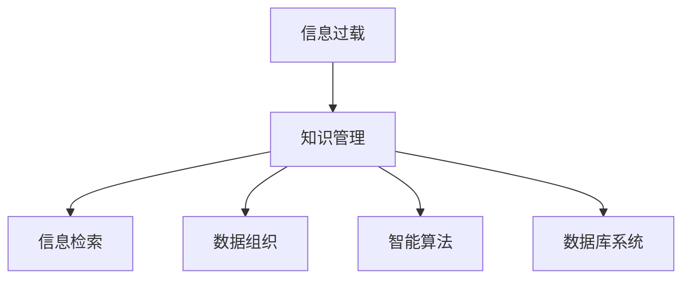
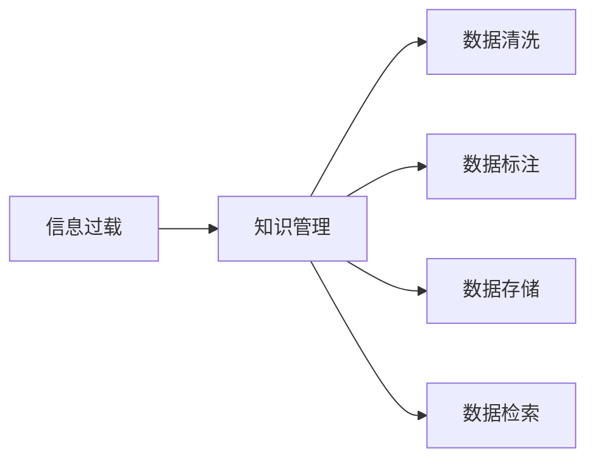
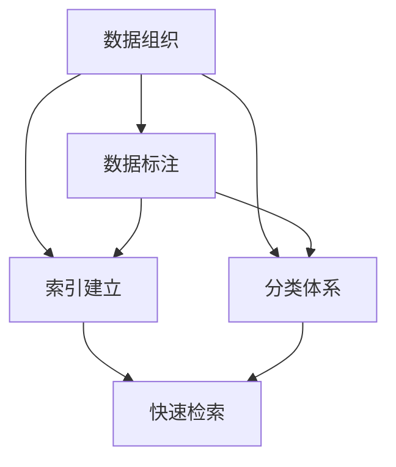
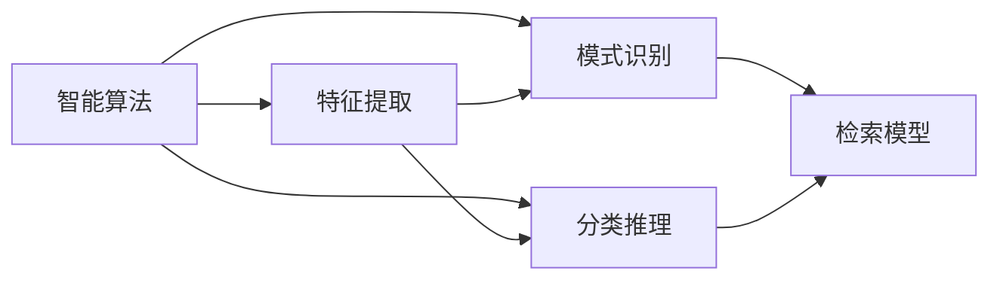
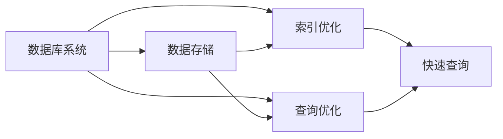
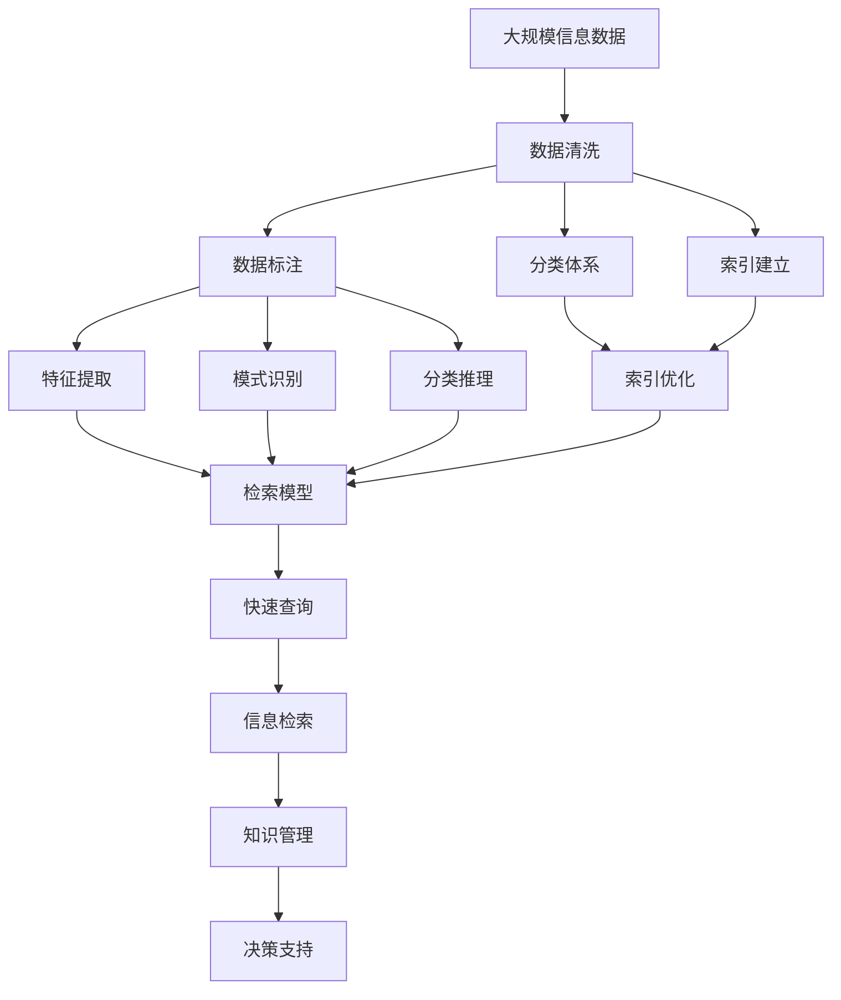

                 

# 信息过载与知识管理策略：有效组织和检索信息的指南

> 关键词：信息过载, 知识管理, 信息检索, 数据组织, 智能算法, 机器学习, 数据库系统

## 1. 背景介绍

### 1.1 问题由来
随着信息技术的高速发展和互联网的普及，人类社会正面临前所未有的信息过载（Information Overload）问题。据统计，全球每天产生的新信息量已超过5亿条，这些信息来自社交媒体、新闻报道、研究论文、电子商务等多个渠道，覆盖了文本、图像、音频、视频等多种类型。信息量激增的同时，信息的种类和格式也日益多样化，对于个体和组织而言，如何有效组织和检索这些信息，成为了一大难题。

信息过载不仅增加了人们处理信息的工作量，还可能造成认知过载（Cognitive Overload），影响决策和注意力，降低工作效率。例如，在商业决策、医疗诊断、科学研究等领域，信息过载可能导致误解和误判，进而影响决策的准确性和效率。因此，如何在海量信息中快速定位有价值的信息，并有效管理组织这些信息，成为了现代知识管理（Knowledge Management）的核心问题。

### 1.2 问题核心关键点
信息过载问题主要体现在以下几个方面：

1. **信息量庞大**：数据量呈指数级增长，难以处理和存储。
2. **信息类型多样**：包括文本、图像、音频、视频等多种格式，需要多样化的处理方法。
3. **信息来源复杂**：来自不同渠道和平台，格式和质量参差不齐。
4. **信息更新频繁**：实时数据流和动态信息更新，需要高效的更新机制。
5. **信息内容复杂**：涉及语言、文化、技术等多重维度，需要智能化处理方法。

这些问题共同构成了信息过载的核心挑战，需要通过知识管理策略和技术手段，实现信息的有效组织和检索。

## 2. 核心概念与联系

### 2.1 核心概念概述

为更好地理解信息过载与知识管理策略，本节将介绍几个密切相关的核心概念：

- **信息过载（Information Overload）**：指个体或组织面临的信息量远远超过其处理能力的现象。表现为信息过剩、信息噪音、信息干扰等。
- **知识管理（Knowledge Management）**：通过策略和技术手段，有效管理和利用知识，提升组织和个人的信息处理能力。
- **信息检索（Information Retrieval）**：通过算法和工具，从大量信息中快速检索出所需信息，提高信息获取效率。
- **数据组织（Data Organization）**：通过分类、标注、索引等手段，将信息组织成易于管理和检索的结构化或半结构化形式。
- **智能算法（Intelligent Algorithms）**：利用机器学习和深度学习技术，自动识别、推理、分类和检索信息，增强信息处理能力。
- **数据库系统（Database Systems）**：提供结构化数据存储和检索功能，支持大规模数据管理。

这些核心概念之间的逻辑关系可以通过以下Mermaid流程图来展示：



这个流程图展示了一个从信息过载到知识管理的过程，其中信息检索、数据组织、智能算法和数据库系统都是知识管理的重要组成部分。

### 2.2 概念间的关系

这些核心概念之间存在着紧密的联系，形成了知识管理策略的完整框架。下面我们通过几个Mermaid流程图来展示这些概念之间的关系。

#### 2.2.1 信息过载与知识管理的关系



这个流程图展示了信息过载与知识管理之间的联系。信息过载需要通过数据清洗、标注、存储和检索等手段，转化为可管理、可利用的知识。

#### 2.2.2 数据组织与信息检索的关系



这个流程图展示了数据组织和信息检索之间的关系。数据组织通过标注和索引，将数据转化为易于检索的形式，从而支持快速的信息检索。

#### 2.2.3 智能算法与信息检索的关系



这个流程图展示了智能算法与信息检索之间的关系。智能算法通过特征提取和模式识别，自动抽取和分类信息，支持更准确的信息检索。

#### 2.2.4 数据库系统与信息检索的关系



这个流程图展示了数据库系统与信息检索之间的关系。数据库系统通过存储和索引优化，支持高效的查询操作，是信息检索的基础设施。

### 2.3 核心概念的整体架构

最后，我们用一个综合的流程图来展示这些核心概念在大规模信息管理中的整体架构：



这个综合流程图展示了从大规模信息数据的处理，到最终的知识管理和决策支持的全过程。通过数据清洗、标注、分类、索引、特征提取、模式识别、分类推理等步骤，将海量信息转化为易于管理和检索的形式。最终，通过快速查询、信息检索、知识管理等环节，将信息转化为决策支持，提升组织和个人的信息处理能力。

## 3. 核心算法原理 & 具体操作步骤
### 3.1 算法原理概述

信息过载与知识管理的核心在于信息的有效组织和检索。以下我们将详细介绍几种核心的算法原理和技术手段。

- **数据清洗（Data Cleaning）**：通过去除噪声、填补缺失值、处理异常值等手段，提升数据质量，为后续分析和检索奠定基础。
- **数据标注（Data Annotation）**：通过人工或自动化手段，给数据打上标签，建立分类体系，支持信息检索和分类。
- **索引建立（Indexing）**：将数据转化为索引形式，支持快速定位和检索。
- **特征提取（Feature Extraction）**：从原始数据中提取有用的特征，支持模式识别和分类。
- **模式识别（Pattern Recognition）**：通过机器学习模型，自动识别数据中的模式和规律，增强信息检索的准确性。
- **分类推理（Classification and Reasoning）**：通过分类器和推理器，自动对信息进行分类和推理，支持决策支持。

这些算法和手段共同构成了信息过载与知识管理的技术框架，有助于提升信息处理的效率和准确性。

### 3.2 算法步骤详解

#### 3.2.1 数据清洗

1. **数据预处理**：
   - 去除噪音：过滤掉无关、重复、错误的信息。
   - 数据格式转换：统一数据格式，如将PDF、HTML等转换为结构化数据。
   - 数据标准化：将数据转化为统一的格式和单位，如日期、货币等。

2. **缺失值处理**：
   - 删除缺失值：直接删除缺失值较多的记录。
   - 填补缺失值：使用均值、中位数、众数等方法填补缺失值。
   - 数据插值：使用插值法填补缺失值，如线性插值、样条插值等。

3. **异常值处理**：
   - 检测异常值：使用统计方法或算法检测异常值，如Z-score、IQR、孤立森林等。
   - 处理异常值：根据异常值类型，采用删除、替换等方法处理异常值。

#### 3.2.2 数据标注

1. **标注体系建立**：
   - 定义分类标准：根据业务需求，定义数据分类的标准和标签。
   - 训练标注模型：使用机器学习或人工标注的方式训练标注模型。
   - 模型评估与优化：评估标注模型的准确性和效率，不断优化模型。

2. **标注数据生成**：
   - 人工标注：由人工对数据进行标注，适用于数据量较小的情况。
   - 半监督标注：使用少量人工标注数据和机器学习算法进行标注。
   - 主动学习：利用模型在未标注数据上进行预测，标注高置信度数据。

#### 3.2.3 索引建立

1. **索引结构设计**：
   - 选择索引类型：根据数据类型和查询需求，选择倒排索引、B+树索引、哈希索引等。
   - 设计索引字段：根据查询需求，选择关键字段建立索引，如标题、关键词、时间等。
   - 索引维护与更新：定期更新索引，保持索引的准确性和实时性。

2. **索引构建**：
   - 数据预处理：将数据进行预处理，如分词、去除停用词等。
   - 索引构建：根据索引结构设计，构建索引数据结构。
   - 索引优化：优化索引结构，提升检索效率。

#### 3.2.4 特征提取

1. **特征选择**：
   - 特征提取：从原始数据中提取有用的特征，如TF-IDF、Word2Vec、Doc2Vec等。
   - 特征选择：选择与任务相关的特征，去除冗余特征。
   - 特征变换：使用特征变换方法，如PCA、LDA等，提取更有意义的特征。

2. **特征工程**：
   - 特征组合：将不同特征进行组合，形成新的特征。
   - 特征衍生：根据业务需求，衍生新的特征，如计算词频、句法结构等。
   - 特征处理：使用归一化、标准化等方法处理特征。

#### 3.2.5 模式识别

1. **模型选择**：
   - 选择机器学习模型：根据任务需求，选择SVM、KNN、决策树、随机森林等模型。
   - 选择深度学习模型：根据任务需求，选择CNN、RNN、LSTM等深度学习模型。
   - 选择预训练模型：根据任务需求，选择BERT、GPT等预训练模型。

2. **模型训练**：
   - 数据预处理：将数据进行预处理，如数据标准化、特征提取等。
   - 模型训练：使用训练数据训练机器学习或深度学习模型。
   - 模型评估：评估模型的准确性和泛化能力。

#### 3.2.6 分类推理

1. **分类器设计**：
   - 选择分类器：根据任务需求，选择逻辑回归、SVM、决策树、随机森林等分类器。
   - 设计分类器：根据业务需求，设计分类器的特征选择和参数调优。
   - 模型集成：使用集成方法，如Bagging、Boosting、Stacking等，提升分类器的准确性。

2. **推理器设计**：
   - 选择推理器：根据任务需求，选择规则推理器、贝叶斯推理器、马尔可夫推理器等。
   - 设计推理器：根据业务需求，设计推理器的规则库和推理算法。
   - 推理优化：优化推理器，提升推理效率和准确性。

### 3.3 算法优缺点

信息过载与知识管理技术的主要优点包括：

- **效率提升**：通过自动化处理和智能化分析，大幅度提升信息处理效率。
- **成本降低**：减少人工标注和数据清洗的成本，降低信息管理的复杂度。
- **决策支持**：通过自动化的分类和推理，提供更精准的决策支持。

同时，这些技术也存在一些局限性：

- **依赖数据质量**：数据清洗和标注的质量直接影响信息处理的准确性和效率。
- **算法复杂性**：模型选择和调优过程复杂，需要较高的技术水平。
- **数据隐私**：在数据标注和处理过程中，需要注意隐私保护和数据安全。
- **模型解释性**：某些深度学习模型缺乏可解释性，难以解释决策过程。

尽管存在这些局限性，但信息过载与知识管理技术仍然是应对海量信息挑战的重要手段，具有广泛的应用前景。

### 3.4 算法应用领域

信息过载与知识管理技术已经在多个领域得到了广泛应用，例如：

- **商业智能（Business Intelligence, BI）**：通过数据清洗和特征提取，支持商业决策和市场分析。
- **科学研究**：通过数据标注和模式识别，支持科研论文的检索和引用。
- **医疗健康**：通过数据清洗和分类推理，支持医疗诊断和治疗方案的优化。
- **金融风控**：通过数据标注和模式识别，支持信用评分和风险评估。
- **智能客服**：通过数据清洗和特征提取，支持客户问题和解答的智能匹配。
- **教育培训**：通过数据标注和分类推理，支持个性化推荐和智能辅导。

除了上述这些经典应用外，信息过载与知识管理技术还被创新性地应用到更多场景中，如智能推荐系统、舆情监测、智能合约等，为各行各业带来了新的变革。

## 4. 数学模型和公式 & 详细讲解 & 举例说明

### 4.1 数学模型构建

本节将使用数学语言对信息过载与知识管理的关键算法进行更加严格的刻画。

设原始数据集为 $D=\{(x_i, y_i)\}_{i=1}^N, x_i \in \mathcal{X}, y_i \in \mathcal{Y}$，其中 $x_i$ 表示原始数据，$y_i$ 表示标注标签。信息过载与知识管理的核心任务是数据清洗、标注、索引、特征提取、模式识别和分类推理。

定义数据清洗函数 $F_{clean}$，数据标注函数 $F_{annotate}$，索引构建函数 $F_{index}$，特征提取函数 $F_{extract}$，模式识别函数 $F_{recognize}$，分类推理函数 $F_{reason}$。

信息过载与知识管理的整体流程可以表示为：

$$
F_{clean}(D) \rightarrow F_{annotate}(D) \rightarrow F_{index}(D) \rightarrow F_{extract}(D) \rightarrow F_{recognize}(D) \rightarrow F_{reason}(D)
$$

其中，每个函数表示对数据进行特定处理的步骤。

### 4.2 公式推导过程

#### 4.2.1 数据清洗

数据清洗的目标是去除噪声、填补缺失值和处理异常值，提升数据质量。设数据清洗后的数据集为 $D_{clean}=\{(x'_i, y'_i)\}_{i=1}^N, x'_i \in \mathcal{X'}, y'_i \in \mathcal{Y}$，其中 $\mathcal{X'}$ 表示清洗后的特征空间，$\mathcal{Y}$ 表示标签空间。

数据清洗的具体步骤包括：

1. **去噪**：
   $$
   F_{clean}(D) = D - F_{noise}(D)
   $$
   其中 $F_{noise}(D)$ 表示去除噪声的操作，包括过滤无关信息、去除重复信息等。

2. **补缺**：
   $$
   F_{clean}(D) = F_{clean}(D) - F_{missing}(F_{clean}(D))
   $$
   其中 $F_{missing}(D)$ 表示填补缺失值的操作，包括删除缺失值、均值填补、插值填补等。

3. **处理异常**：
   $$
   F_{clean}(D) = F_{clean}(D) - F_{outliers}(F_{clean}(D))
   $$
   其中 $F_{outliers}(D)$ 表示处理异常值的操作，包括检测异常值、删除异常值、替换异常值等。

#### 4.2.2 数据标注

数据标注的目标是给数据打上标签，建立分类体系。设数据标注后的数据集为 $D_{annotate}=\{(x''_i, y''_i)\}_{i=1}^N, x''_i \in \mathcal{X''}, y''_i \in \mathcal{Y''}$，其中 $\mathcal{X''}$ 表示标注后的特征空间，$\mathcal{Y''}$ 表示标注后的标签空间。

数据标注的具体步骤包括：

1. **标注体系建立**：
   $$
   F_{annotate}(D) = F_{classify}(D)
   $$
   其中 $F_{classify}(D)$ 表示分类体系建立的操作，包括定义标签、训练标注模型、评估标注模型等。

2. **标注数据生成**：
   $$
   F_{annotate}(D) = F_{annotate}(D) \cup F_{generate}(D)
   $$
   其中 $F_{generate}(D)$ 表示标注数据生成的操作，包括人工标注、半监督标注、主动学习等。

#### 4.2.3 索引建立

索引建立的目标是提升数据的检索效率。设数据索引后的数据集为 $D_{index}=\{(x'''_i, y'''_i)\}_{i=1}^N, x'''_i \in \mathcal{X'''}$, $y'''_i \in \mathcal{Y'''}$，其中 $\mathcal{X'''}$ 表示索引后的特征空间，$\mathcal{Y'''}$ 表示索引后的标签空间。

索引建立的具体步骤包括：

1. **索引结构设计**：
   $$
   F_{index}(D) = F_{design}(D)
   $$
   其中 $F_{design}(D)$ 表示索引结构设计的操作，包括选择索引类型、设计索引字段、维护索引等。

2. **索引构建**：
   $$
   F_{index}(D) = F_{build}(D)
   $$
   其中 $F_{build}(D)$ 表示索引构建的操作，包括数据预处理、构建索引数据结构、优化索引等。

#### 4.2.4 特征提取

特征提取的目标是从原始数据中提取有用的特征，支持模式识别和分类。设特征提取后的数据集为 $D_{extract}=\{(x''''_i, y''''_i)\}_{i=1}^N, x''''_i \in \mathcal{X''''}, y''''_i \in \mathcal{Y''''}$，其中 $\mathcal{X''''}$ 表示提取后的特征空间，$\mathcal{Y''''}$ 表示标签空间。

特征提取的具体步骤包括：

1. **特征选择**：
   $$
   F_{extract}(D) = F_{selection}(D)
   $$
   其中 $F_{selection}(D)$ 表示特征选择的操作，包括选择有用特征、去除冗余特征等。

2. **特征工程**：
   $$
   F_{extract}(D) = F_{engineering}(D)
   $$
   其中 $F_{engineering}(D)$ 表示特征工程的操作，包括特征组合、特征衍生、特征处理等。

#### 4.2.5 模式识别

模式识别的目标是通过机器学习模型自动识别数据中的模式和规律，支持信息检索和分类。设模式识别后的数据集为 $D_{recognize}=\{(x''''''_i, y''''''_i)\}_{i=1}^N, x''''''_i \in \mathcal{X''''''}, y''''''_i \in \mathcal{Y''''''}$，其中 $\mathcal{X''''''}$ 表示识别后的特征空间，$\mathcal{Y''''''}$ 表示标签空间。

模式识别的具体步骤包括：

1. **模型选择**：
   $$
   F_{recognize}(D) = F_{select}(D)
   $$
   其中 $F_{select}(D)$ 表示模型选择的操作，包括选择机器学习模型、深度学习模型、预训练模型等。

2. **模型训练**：
   $$
   F_{recognize}(D) = F_{train}(D)
   $$
   其中 $F_{train}(D)$ 表示模型训练的操作，包括数据预处理、模型训练、模型评估等。

#### 4.2.6 分类推理

分类推理的目标是通过分类器和推理器自动对信息进行分类和推理，支持决策支持。设分类推理后的数据集为 $D_{reason}=\{(x''''''''_i, y''''''''_i)\}_{i=1}^N, x''''''''_i \in \mathcal{X''''''''}, y''''''''_i \in \mathcal{Y''''''''}$，其中 $\mathcal{X''''''''}$ 表示推理后的特征空间，$\mathcal{Y''''''''}$ 表示推理后的标签空间。

分类推理的具体步骤包括：

1. **分类器设计**：
   $$
   F_{reason}(D) = F_{classifier}(D)
   $$
   其中 $F_{classifier}(D)$ 表示分类器的设计操作，包括选择分类器、设计分类器的特征选择和参数调优等。

2. **推理器设计**：
   $$
   F_{reason}(D) = F_{reasoner}(D)
   $$
   其中 $F_{reasoner}(D)$ 表示推理器的设计操作，包括选择推理器、设计推理器的规则库和推理算法等。

### 4.3 案例分析与讲解

#### 4.3.1 文本数据清洗

文本数据清洗是信息过载处理的重要步骤之一。以下是一个简单的文本数据清洗案例：

假设有一份包含10万条新闻的文本数据集，存在大量噪声、格式不一致、缺失值等问题。

1. **数据预处理**：
   - 去除无关信息：过滤掉标题中的广告、链接、标签等无关信息。
   - 数据标准化：将所有日期转换为标准格式，将所有货币单位转换为USD。

2. **缺失值处理**：
   - 删除缺失值：删除缺失新闻的记录。
   - 填补缺失值：使用均值填补缺失的单词数量。

3. **异常值处理**：
   - 检测异常值：使用孤立森林检测异常长的新闻标题。
   - 处理异常值：删除异常长的标题。

#### 4.3.2 图片数据标注

图片数据标注是计算机视觉领域的重要任务之一。以下是一个简单的图片数据标注案例：

假设有一份包含1000张医学图像的数据集，需要标注每张图像中的器官位置。

1. **标注体系建立**：
   - 定义标签：定义器官标签，如心脏、肝脏、肺等。
   - 训练标注模型：使用机器学习模型训练标注模型，如随机森林、深度学习模型等。
   - 模型评估与优化：评估标注模型的准确性和效率，不断优化模型。

2. **标注数据生成**：
   - 人工标注：由人工对每张图片进行标注，标注器官位置和面积。
   - 半监督标注：使用少量人工标注数据和机器学习算法进行标注。
   - 主动学习：利用模型在未标注数据上进行预测，标注高置信度数据。

#### 4.3.3 自然语言检索

自然语言检索是信息过载处理的重要应用之一。以下是一个简单的自然语言检索案例：

假设有一个包含数百万篇学术论文的数据库，用户需要查找关于“人工智能”相关的主题。

1. **数据清洗**：
   - 去除无关信息：过滤掉摘要中的广告、链接、引用等无关信息。
   - 数据标准化：将所有关键词转换为标准格式，将所有单位转换为英文。

2. **索引建立**：
   - 选择索引类型：选择倒排索引，构建关键词索引。
   - 设计索引字段：选择关键词作为索引字段，建立关键词索引。
   - 索引构建：构建倒排索引数据结构，优化索引。

3. **特征提取**：
   - 特征选择：选择摘要作为特征，提取TF-IDF特征。
   - 特征工程：使用特征变换方法，如PCA、LDA等，提取更有意义的特征。

4. **模式识别**：
   - 选择模型：选择TF-IDF作为特征提取方法，选择线性回归作为模型。
   - 模型训练：使用训练数据训练模型，评估模型准确性。

5. **分类推理**：
   - 选择分类器：选择逻辑回归作为分类器。
   - 设计分类器：根据论文主题定义标签，设计分类器。
   - 推理器设计：设计推理器，提供论文推荐。

## 5. 项目实践：代码实例和详细解释说明

### 5.1 开发环境搭建

在进行信息过载与知识管理实践前，我们需要准备好开发环境。以下是使用Python进行Scikit-Learn开发的环境配置流程：

1. 安装Anaconda：从官网下载并安装Anaconda，用于创建独立的Python环境。

2. 创建并激活虚拟环境：
```bash
conda create -n sklearn-env python=3.8 
conda activate sklearn-env
```


