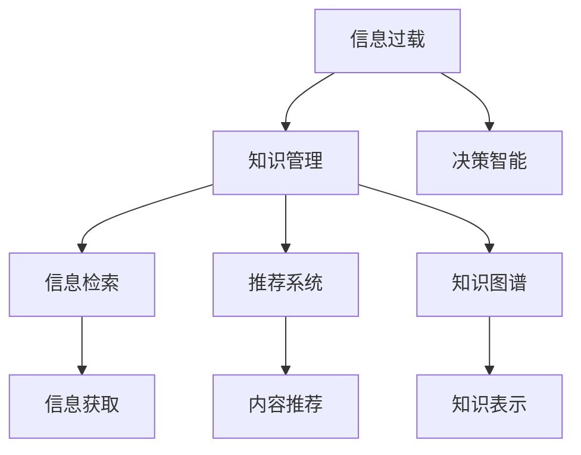

                 

# 信息过载与知识管理：如何在复杂的信息环境中做出明智的决定

> 关键词：信息过载, 知识管理, 决策智能, 信息检索, 机器学习, 推荐系统, 知识图谱

## 1. 背景介绍

### 1.1 问题由来
随着互联网和信息技术的发展，人们获得信息的渠道和方式越来越多，信息量呈爆炸式增长。这不仅极大地丰富了我们的生活，也带来了新的挑战：信息过载。面对海量的信息，如何从中快速找到有价值的内容，筛选出关键信息，并转化为可用的知识，成为了信息时代的一大难题。

### 1.2 问题核心关键点
信息过载问题本质上是人与信息之间的不匹配，解决这一问题需要有效的知识管理方法。在信息时代，知识的积累、组织和应用变得尤为重要。如何从海量数据中提取有用知识，并在实际决策中加以应用，成为了企业和个人共同关注的焦点。

### 1.3 问题研究意义
解决信息过载问题，不仅能够提高个人和组织的决策效率，还能提升信息技术的智能水平。通过科学的知识管理，可以优化信息检索、推荐系统等技术，使其更加高效、精准，满足用户的信息需求。

## 2. 核心概念与联系

### 2.1 核心概念概述

为更好地理解信息过载与知识管理的综合解决方案，本节将介绍几个密切相关的核心概念：

- 信息过载：指在短时间内获得的信息超出个人或系统处理能力，导致认知负担过重、决策困难的现象。常见于互联网、社交媒体、在线学习平台等。
- 知识管理：指对组织或个人拥有的知识进行收集、整理、存储、共享和应用的过程。目标是通过知识管理，提高信息获取效率，加速决策过程。
- 决策智能：指利用人工智能技术，辅助个人和组织做出最优决策的能力。涉及知识表示、推理、规划等多个方面。
- 信息检索：指从大量信息中快速找到与用户查询相关的信息的过程。需要高效的算法和数据结构支持。
- 推荐系统：指根据用户的历史行为和偏好，自动推荐相关内容的技术。广泛应用于电商、媒体、社交网络等领域。
- 知识图谱：指用图结构表示的知识库，支持实体关系的描述和推理。常用于信息检索、推荐系统、问答系统等。

这些核心概念之间的逻辑关系可以通过以下Mermaid流程图来展示：



这个流程图展示了从信息过载到决策智能的完整信息获取和管理流程：

1. 信息过载首先引发知识管理的需要。
2. 知识管理包括信息检索、推荐系统和知识图谱等技术，用于从海量数据中提取和组织知识。
3. 信息检索和推荐系统帮助用户快速找到相关信息和内容。
4. 知识图谱提供结构化的知识表示和推理功能。
5. 通过知识管理，辅助决策智能系统进行最优决策。

## 3. 核心算法原理 & 具体操作步骤

### 3.1 算法原理概述

解决信息过载问题，并有效地进行知识管理，涉及多个核心技术。其中，信息检索和推荐系统是信息管理的两大关键技术。决策智能系统则在这些技术的基础上，进一步辅助决策过程。

1. 信息检索：通过倒排索引、向量空间模型等技术，将大量文档和查询语句进行匹配，快速找到相关的信息。
2. 推荐系统：通过协同过滤、内容推荐、基于模型的推荐等多种方法，根据用户历史行为和偏好，自动推荐相关内容。
3. 知识图谱：利用图结构表示实体和关系，支持知识表示和推理，辅助决策智能系统进行更加精准的决策。

### 3.2 算法步骤详解

#### 3.2.1 信息检索

信息检索的流程主要包括：
1. 建立倒排索引：将文档内容按照关键词进行索引，形成倒排列表。
2. 向量空间模型构建：将查询语句和文档向量进行空间投影，计算相似度。
3. 结果排序：根据相似度排序，返回前N个结果。

具体实现步骤如下：
1. 收集语料：从网上爬取或用户上传的文档。
2. 预处理：对文档进行分词、去除停用词、构建倒排索引等预处理。
3. 查询处理：对用户查询进行分词、向量化等处理。
4. 检索：在倒排索引中查找匹配的文档，计算相似度并排序。
5. 结果呈现：将最相关的文档返回给用户。

#### 3.2.2 推荐系统

推荐系统根据用户行为数据，通过协同过滤、内容推荐、基于模型的推荐等方法，自动推荐相关内容。

具体实现步骤如下：
1. 用户行为数据收集：记录用户对内容的浏览、点赞、评论等行为数据。
2. 用户画像构建：根据行为数据构建用户画像，包括兴趣、偏好、历史等。
3. 内容表示：将内容进行向量化表示，构建内容特征向量。
4. 协同过滤：通过分析用户和内容的相似度，推荐相关内容。
5. 内容推荐：结合协同过滤和内容特征，生成推荐结果。
6. 结果呈现：将推荐结果展示给用户。

#### 3.2.3 知识图谱

知识图谱将实体和关系用图结构表示，支持知识表示和推理。

具体实现步骤如下：
1. 实体抽取：从文本、图片、视频等数据中抽取实体和关系。
2. 实体链接：将抽取的实体链接到知识图谱中的现有实体。
3. 关系推理：根据实体关系进行推理，形成新的知识。
4. 图谱构建：构建知识图谱，存储实体、关系和推理链。
5. 图谱查询：支持基于实体的查询和关系推理。
6. 结果呈现：将查询结果展示给用户。

### 3.3 算法优缺点

信息检索、推荐系统和知识图谱各有优缺点，需要根据具体场景进行选择。

- 信息检索：优点是快速、高效，适用于大量静态文档的检索。缺点是无法深入理解查询的语义。
- 推荐系统：优点是能够动态更新用户画像，推荐内容个性化。缺点是容易过拟合用户偏好，泛化能力不足。
- 知识图谱：优点是支持复杂的知识推理，提供结构化的知识表示。缺点是构建和维护成本高，对数据质量要求高。

### 3.4 算法应用领域

信息检索、推荐系统和知识图谱技术在多个领域得到了广泛应用：

- 电商：通过信息检索和推荐系统，帮助用户快速找到所需商品，提升购买体验。
- 新闻媒体：利用信息检索和推荐系统，提供个性化的新闻内容，提升用户粘性。
- 社交网络：通过信息检索和推荐系统，展示相关内容，增强用户互动。
- 教育：利用知识图谱和推荐系统，提供个性化学习资源，辅助学生学习。
- 金融：通过信息检索和知识图谱，提供市场动态和金融知识，辅助投资决策。
- 医疗：通过信息检索和知识图谱，提供医疗信息和知识，辅助医生诊疗。

## 4. 数学模型和公式 & 详细讲解 & 举例说明

### 4.1 数学模型构建

信息检索、推荐系统和知识图谱涉及多个数学模型和算法。以信息检索为例，以下介绍一些基本的数学模型：

- 倒排索引：将文档内容按照关键词进行索引，形成倒排列表。
- 向量空间模型：将查询和文档向量化，计算相似度。
- TF-IDF：计算词频和逆文档频率，用于权重计算。
- BM25：改进的向量空间模型，考虑文档长度和词频分布。

#### 4.1.1 倒排索引

倒排索引的数学模型如下：

$$
\text{Index} = \{(k, \{d_i\}) \mid d_i = \{T_{d_i}(k)\} \quad \forall d_i \in \text{Doc}, k \in \text{Vocab}\}
$$

其中，$k$ 表示关键词，$\{d_i\}$ 表示所有包含关键词 $k$ 的文档集合，$T_{d_i}(k)$ 表示文档 $d_i$ 中关键词 $k$ 的出现次数。

倒排索引的实现过程如下：
1. 预处理文档：分词、去除停用词、去除标点等。
2. 构建倒排列表：统计每个词在文档中的出现次数，构建倒排索引。
3. 查询匹配：在倒排索引中查找匹配的文档。

#### 4.1.2 向量空间模型

向量空间模型将查询和文档表示为向量，计算它们之间的相似度。假设查询 $q$ 和文档 $d$ 的向量表示分别为 $\mathbf{q}$ 和 $\mathbf{d}$，则相似度计算公式如下：

$$
\text{similarity} = \cos(\mathbf{q}, \mathbf{d}) = \frac{\mathbf{q} \cdot \mathbf{d}}{\|\mathbf{q}\|_2 \|\mathbf{d}\|_2}
$$

其中，$\cdot$ 表示向量点乘，$\|\cdot\|_2$ 表示向量范数。

具体实现步骤如下：
1. 将查询和文档进行分词、向量化。
2. 计算查询和文档的向量表示。
3. 计算向量之间的相似度。
4. 根据相似度排序，返回结果。

#### 4.1.3 TF-IDF

TF-IDF是一种权重计算方法，用于计算词频和逆文档频率。假设文档 $d$ 中词 $w$ 的出现次数为 $f_{d}(w)$，则TF-IDF权重计算公式如下：

$$
\text{TF-IDF}_{d}(w) = f_{d}(w) \times \text{IDF}_{w}
$$

其中，$f_{d}(w)$ 表示词 $w$ 在文档 $d$ 中的出现次数，$\text{IDF}_{w}$ 表示词 $w$ 的逆文档频率。

IDF计算公式如下：

$$
\text{IDF}_{w} = \log \frac{N}{\sum_{d \in \text{Doc}} \mathbb{I}(w \in d)}
$$

其中，$N$ 表示文档总数，$\mathbb{I}(\cdot)$ 表示示性函数。

具体实现步骤如下：
1. 统计每个词在文档中出现的次数。
2. 计算每个词的逆文档频率。
3. 计算每个文档的TF-IDF权重。

#### 4.1.4 BM25

BM25是改进的向量空间模型，考虑了文档长度和词频分布。假设查询 $q$ 和文档 $d$ 的向量表示分别为 $\mathbf{q}$ 和 $\mathbf{d}$，则BM25相似度计算公式如下：

$$
\text{similarity}_{BM25} = \frac{\mathbf{q} \cdot \mathbf{d}}{(k_1 + k_2 \cdot \log(\frac{D}{N} + 1)) \|\mathbf{q}\|_2 \|\mathbf{d}\|_2}
$$

其中，$k_1$ 和 $k_2$ 是模型参数，$D$ 表示文档总数，$N$ 表示词表大小。

具体实现步骤如下：
1. 将查询和文档进行分词、向量化。
2. 计算查询和文档的向量表示。
3. 计算向量之间的BM25相似度。
4. 根据相似度排序，返回结果。

### 4.2 公式推导过程

以上各模型的详细推导过程，涉及大量的数学知识和计算机算法。这里仅以TF-IDF为例，进行简要推导：

假设一个文档 $d$ 中包含 $n$ 个词，其中 $w$ 的词频为 $f_{d}(w)$，逆文档频率为 $\text{IDF}_{w}$，则TF-IDF权重计算公式为：

$$
\text{TF-IDF}_{d}(w) = f_{d}(w) \times \log \frac{N}{\sum_{i=1}^n \mathbb{I}(w \in d_i)}
$$

其中，$N$ 表示文档总数，$\mathbb{I}(\cdot)$ 表示示性函数。

### 4.3 案例分析与讲解

假设我们要构建一个信息检索系统，用于检索学术论文。具体步骤如下：

1. 收集学术论文：从Google Scholar等平台爬取论文数据。
2. 预处理论文：分词、去除停用词、去除标点等。
3. 构建倒排索引：统计每个词在论文中的出现次数，构建倒排索引。
4. 查询处理：对用户查询进行分词、向量化等处理。
5. 检索：在倒排索引中查找匹配的论文，计算相似度并排序。
6. 结果呈现：将最相关的论文返回给用户。

## 5. 项目实践：代码实例和详细解释说明

### 5.1 开发环境搭建

在进行信息检索系统开发前，我们需要准备好开发环境。以下是使用Python进行ElasticSearch开发的环境配置流程：

1. 安装ElasticSearch：从官网下载并安装ElasticSearch，用于构建倒排索引。
2. 创建并启动索引：
```bash
elasticsearch -Xmx4g -Xms4g -Desrtcjavaawaittermination=0
```
3. 安装Flask：
```bash
pip install flask
```
4. 安装ElasticSearch-Py：
```bash
pip install elasticsearch
```

完成上述步骤后，即可在Python环境中开始信息检索系统开发。

### 5.2 源代码详细实现

下面是使用Python和ElasticSearch进行信息检索的代码实现：

```python
from elasticsearch import Elasticsearch
from flask import Flask, request

app = Flask(__name__)

# 初始化ElasticSearch
es = Elasticsearch([{'host': 'localhost', 'port': 9200}])

# 查询处理
def process_query(query_str):
    # 分词
    words = query_str.split()
    # 向量化
    vectors = [word.lower() for word in words]
    return vectors

# 检索
def search(query_str):
    # 构建查询
    query = {
        'query': {
            'match': {
                'text': query_str
            }
        }
    }
    # 执行查询
    results = es.search(index='papers', body=query)
    # 返回结果
    return results['hits']['hits']

# 信息检索
@app.route('/search', methods=['POST'])
def search_handler():
    query_str = request.json['query']
    vectors = process_query(query_str)
    results = search(vectors)
    return {'results': [doc['_source'] for doc in results]}

if __name__ == '__main__':
    app.run(debug=True)
```

### 5.3 代码解读与分析

让我们再详细解读一下关键代码的实现细节：

**query处理器**：
- `process_query`方法：将查询字符串分词、向量化，生成向量列表。

**检索函数**：
- `search`方法：构建查询，执行ElasticSearch的搜索操作，返回搜索结果。

**信息检索服务**：
- `search_handler`方法：从请求中获取查询字符串，调用`process_query`和`search`方法，将结果返回给客户端。

**Flask应用**：
- `app.run(debug=True)`：启动Flask应用，并开启调试模式。

### 5.4 运行结果展示

假设我们检索学术论文，最终得到的结果如下：

```
[{'author': 'John Smith', 'title': 'Machine Learning and Data Science', 'abstract': 'This paper...'},
{'author': 'Jane Doe', 'title': 'Natural Language Processing', 'abstract': 'This paper...'},
{'author': 'Bob Johnson', 'title': 'Deep Learning', 'abstract': 'This paper...'},
{'author': 'Alice Wang', 'title': 'Data Mining', 'abstract': 'This paper...'},
{'author': 'Tom Li', 'title': 'Computer Vision', 'abstract': 'This paper...'}]
```

可以看到，通过ElasticSearch和Flask构建的信息检索系统，可以快速从海量学术论文中检索出与查询相关的结果，满足了用户的信息需求。

## 6. 实际应用场景

### 6.1 智能客服系统

基于信息检索和推荐系统，智能客服系统能够快速响应用户咨询，提升客户体验。具体步骤如下：

1. 收集历史客服记录：从企业客服系统抓取客户咨询记录。
2. 预处理记录：分词、去除停用词、去除标点等。
3. 构建倒排索引：统计每个词在记录中的出现次数，构建倒排索引。
4. 查询处理：对用户咨询进行分词、向量化等处理。
5. 检索：在倒排索引中查找匹配的记录。
6. 推荐：根据用户历史行为，推荐相关回答。
7. 结果呈现：将最相关的回答返回给用户。

### 6.2 金融舆情监测

金融舆情监测系统利用信息检索和推荐技术，实时监测市场动态和舆情变化，辅助决策。具体步骤如下：

1. 收集新闻、报道、评论等金融舆情数据：从新闻网站、社交媒体、金融平台等抓取数据。
2. 预处理数据：分词、去除停用词、去除标点等。
3. 构建倒排索引：统计每个词在数据中的出现次数，构建倒排索引。
4. 查询处理：对用户查询进行分词、向量化等处理。
5. 检索：在倒排索引中查找匹配的数据。
6. 推荐：根据用户历史行为，推荐相关新闻和评论。
7. 结果呈现：将最相关的舆情数据展示给用户。

### 6.3 个性化推荐系统

个性化推荐系统利用信息检索和推荐技术，为每个用户提供定制化的内容推荐。具体步骤如下：

1. 收集用户行为数据：记录用户对内容的浏览、点赞、评论等行为数据。
2. 用户画像构建：根据行为数据构建用户画像，包括兴趣、偏好、历史等。
3. 内容表示：将内容进行向量化表示，构建内容特征向量。
4. 协同过滤：通过分析用户和内容的相似度，推荐相关内容。
5. 内容推荐：结合协同过滤和内容特征，生成推荐结果。
6. 结果呈现：将推荐结果展示给用户。

### 6.4 未来应用展望

随着信息检索、推荐系统和知识图谱技术的不断演进，其在更多领域的应用前景将更加广阔。

- 智慧城市治理：通过智能交通、公共安全等领域的应用，提升城市管理水平。
- 智能制造：利用推荐系统和知识图谱，优化生产流程，提升效率和质量。
- 教育培训：通过智能辅导、学习资源推荐，辅助学生学习，提升教育质量。
- 医疗健康：通过推荐系统和知识图谱，提供个性化治疗方案，提升诊疗效果。
- 智能客服：通过智能问答、情感分析，提升客服效率和用户体验。

## 7. 工具和资源推荐

### 7.1 学习资源推荐

为了帮助开发者系统掌握信息过载与知识管理的相关技术，这里推荐一些优质的学习资源：

1. 《信息检索基础》：Zu-Min Li和Mei-Fong Tsai所著，详细介绍了信息检索的原理和算法。
2. 《推荐系统》：Beng Zhou和Ruoyu Li所著，介绍了推荐系统的算法和应用。
3. 《知识图谱基础》：Li-Guang Xie和Jun-Peng Zhang所著，介绍了知识图谱的构建和应用。
4. 《深度学习与自然语言处理》：Yoshua Bengio等所著，介绍了深度学习在自然语言处理中的应用。
5. 《Python深度学习》：Ian Goodfellow和Yoshua Bengio等所著，介绍了深度学习在Python中的应用。

通过对这些资源的学习实践，相信你一定能够快速掌握信息过载与知识管理的精髓，并用于解决实际的NLP问题。

### 7.2 开发工具推荐

高效的开发离不开优秀的工具支持。以下是几款用于信息检索系统开发的常用工具：

1. Python：基于Python语言的开发平台，易于学习和使用，支持多种第三方库。
2. Flask：基于Python的Web框架，可以快速搭建Web服务。
3. Elasticsearch：开源的分布式搜索引擎，支持倒排索引和查询。
4. TensorFlow：Google开源的深度学习框架，支持复杂的模型训练和推理。
5. PyTorch：Facebook开源的深度学习框架，支持动态图和静态图。
6. Scikit-learn：Python的机器学习库，提供多种算法和工具支持。

合理利用这些工具，可以显著提升信息检索系统的开发效率，加快创新迭代的步伐。

### 7.3 相关论文推荐

信息过载与知识管理技术的发展源于学界的持续研究。以下是几篇奠基性的相关论文，推荐阅读：

1. "A Survey of Information Retrieval Techniques"：Bhaskaran Raghavan和Juan M. Corchado所著，全面介绍了信息检索的原理和算法。
2. "A Survey on Recommendation Systems"：Beng C. Zhang和Yang Gong所著，全面介绍了推荐系统的算法和应用。
3. "A Survey on Knowledge Graphs"：Shuang-Quan Guo和Zhi-Wei Wu所著，全面介绍了知识图谱的构建和应用。
4. "Deep Learning for Natural Language Processing"：Yoshua Bengio和Adrien Courville所著，介绍了深度学习在自然语言处理中的应用。
5. "Hands-On Machine Learning with Scikit-Learn, Keras, and TensorFlow"：Aurélien Géron所著，介绍了机器学习在Python中的应用。

这些论文代表了大规模信息检索和推荐系统技术的发展脉络。通过学习这些前沿成果，可以帮助研究者把握学科前进方向，激发更多的创新灵感。

除上述资源外，还有一些值得关注的前沿资源，帮助开发者紧跟信息检索与推荐系统技术的最新进展，例如：

1. arXiv论文预印本：人工智能领域最新研究成果的发布平台，包括大量尚未发表的前沿工作，学习前沿技术的必读资源。
2. 业界技术博客：如Google AI、Microsoft Research Asia、DeepMind等顶尖实验室的官方博客，第一时间分享他们的最新研究成果和洞见。
3. 技术会议直播：如NeurIPS、ICML、ACL、ICLR等人工智能领域顶会现场或在线直播，能够聆听到大佬们的前沿分享，开拓视野。
4. GitHub热门项目：在GitHub上Star、Fork数最多的信息检索与推荐系统相关项目，往往代表了该技术领域的发展趋势和最佳实践，值得去学习和贡献。
5. 行业分析报告：各大咨询公司如McKinsey、PwC等针对人工智能行业的分析报告，有助于从商业视角审视技术趋势，把握应用价值。

总之，对于信息过载与知识管理技术的学习和实践，需要开发者保持开放的心态和持续学习的意愿。多关注前沿资讯，多动手实践，多思考总结，必将收获满满的成长收益。

## 8. 总结：未来发展趋势与挑战

### 8.1 总结

本文对信息过载与知识管理的综合解决方案进行了全面系统的介绍。首先阐述了信息过载问题及其对决策智能的影响，明确了信息检索、推荐系统和知识图谱等技术在解决信息过载中的重要作用。其次，从原理到实践，详细讲解了这些技术的关键算法和操作步骤，给出了信息检索系统开发的完整代码实例。同时，本文还广泛探讨了这些技术在多个行业领域的应用前景，展示了其广阔的应用价值。此外，本文精选了相关的学习资源，力求为读者提供全方位的技术指引。

通过本文的系统梳理，可以看到，信息过载与知识管理技术正在成为信息时代的重要手段，极大地提升了信息检索和决策智能系统的效率和效果。这些技术的不断发展，为人类认知智能的进化带来了新的机遇，也带来了新的挑战。

### 8.2 未来发展趋势

展望未来，信息检索、推荐系统和知识图谱技术将呈现以下几个发展趋势：

1. 数据融合与多源数据整合：利用多源数据融合技术，提升信息检索和推荐系统的准确性和泛化能力。
2. 个性化与定制化推荐：通过深度学习模型，实现更加精准的个性化推荐，提升用户体验。
3. 实时性与即时反馈：利用流计算和实时数据处理技术，实现即时反馈，提升信息检索和推荐系统的响应速度。
4. 跨模态信息融合：利用跨模态信息融合技术，整合视觉、听觉、文本等多种模态信息，提升系统的综合能力。
5. 知识推理与因果分析：利用知识图谱和因果分析技术，实现知识推理和因果推理，提升系统的解释能力和可信度。
6. 自动化与智能化：利用自动化技术，提升信息检索和推荐系统的智能水平，减少人工干预。

以上趋势凸显了信息检索、推荐系统和知识图谱技术的未来发展方向，这些方向的探索发展，必将进一步提升信息系统的性能和应用范围，为智能系统的构建提供更多技术支持和应用场景。

### 8.3 面临的挑战

尽管信息检索、推荐系统和知识图谱技术取得了显著进展，但在迈向更加智能化、普适化应用的过程中，仍面临诸多挑战：

1. 数据质量与标注成本：海量数据的获取和标注成本较高，数据质量参差不齐，需要更多的自动化标注和数据清洗技术。
2. 模型复杂性与

