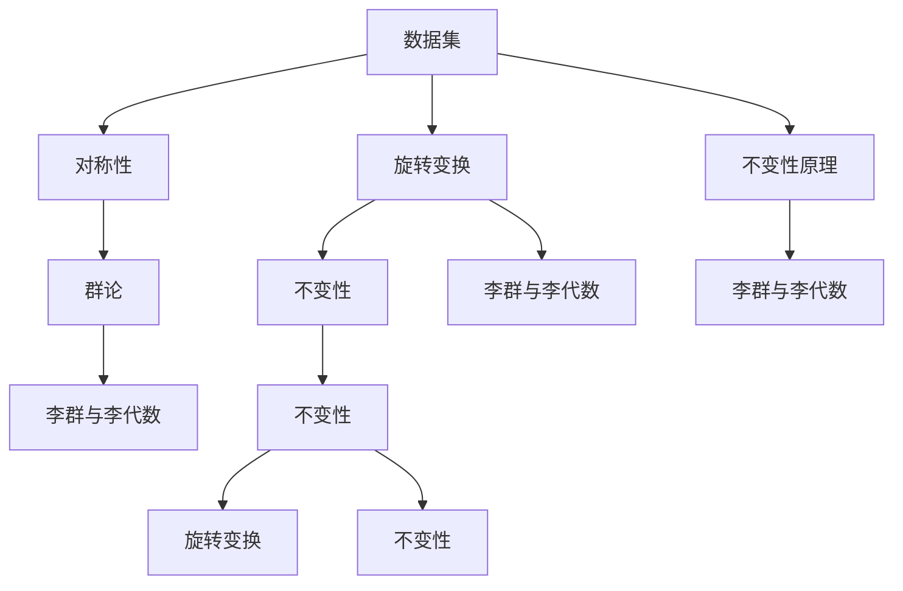

                 

## 1. 背景介绍

### 1.1 问题由来

在现代计算机科学中，数学的重要性不言而喻。从机器学习、深度学习到计算机视觉、自然语言处理，数学方法无处不在。然而，数学不仅仅是算法的工具，它更是一种思维方式和看待世界的方式。在算法设计中，不变性原理是一个重要的理论基础，它帮助我们将问题抽象成更加简单、普适的形式，从而更好地解决问题。本文将深入探讨不变性原理，并探讨其在大数据、机器学习、计算机视觉等领域的实际应用。

### 1.2 问题核心关键点

不变性原理指的是，一个系统或模型在不同条件下保持不变的能力。这个能力在算法设计和优化中起着至关重要的作用。当我们在面对复杂、多变的问题时，不变性原理可以帮助我们简化问题，并找到最优解决方案。因此，了解和掌握不变性原理，对于算法设计和优化具有重要意义。

### 1.3 问题研究意义

不变性原理是现代科学和技术的重要基石。它不仅适用于数学领域，还在物理、工程、计算机科学等领域有着广泛的应用。掌握不变性原理，可以帮助我们更好地理解问题本质，提高算法设计的效率和精度。此外，不变性原理还可以帮助我们更好地理解和应用复杂模型，从而在实际应用中取得更好的效果。

## 2. 核心概念与联系

### 2.1 核心概念概述

不变性原理是一个跨学科的重要概念，它不仅应用于数学领域，还广泛应用于物理、计算机科学等领域。下面，我们将详细介绍与不变性原理相关的几个核心概念：

- **不变性**：指的是一个系统或模型在不同条件下保持不变的能力。
- **对称性**：指的是系统或模型在某种变换下保持不变的能力。
- **群论**：研究对称性及其在数学和物理学中的应用的学科。
- **李群与李代数**：用于研究对称性和不变性理论的重要工具。

这些概念之间存在着密切的联系，共同构成了不变性原理的理论基础。下面，我们将通过一个简单的例子，展示这些概念之间的联系。

### 2.2 概念间的关系

我们可以通过一个具体的例子来展示不变性原理的应用：旋转变换。假设我们有一个二维平面上的向量 $(x,y)$，我们想要找到这个向量在旋转变换下的不变性。

1. **不变性**：对于向量 $(x,y)$，无论它如何旋转，其长度（即模长）和方向保持不变。这就是向量的不变性。
2. **对称性**：旋转变换可以看作是一种对称性。在二维平面上，我们可以将向量旋转任意角度，而其长度和方向不变。
3. **群论**：旋转变换可以看作是一个群，其中的元素是旋转的角度，群运算对应于向量旋转。
4. **李群与李代数**：旋转变换可以由一个李群表示，而其对应的李代数则是群在向量空间上的线性表示。

这些概念共同构成了旋转变换不变性的理论基础，使我们能够更好地理解和应用旋转变换。

### 2.3 核心概念的整体架构

下面，我们将用一个综合的流程图来展示这些核心概念在大数据、机器学习、计算机视觉等领域的应用：



这个流程图展示了不变性原理在大数据、机器学习、计算机视觉等领域的应用：

1. 数据集是算法应用的基础，我们希望通过数据集来发现其中隐藏的规律。
2. 不变性原理指导我们如何更好地处理数据集。例如，在机器学习中，我们希望模型对于数据集的不同变换具有不变性，从而提高模型的泛化能力。
3. 旋转变换是不变性原理中的一个具体应用。在计算机视觉中，旋转变换对于图像处理和模式识别具有重要意义。
4. 群论和李群与李代数是不变性原理的理论基础，它们帮助我们更好地理解和应用不变性原理。

## 3. 核心算法原理 & 具体操作步骤

### 3.1 算法原理概述

不变性原理的核心思想是，一个系统或模型在不同条件下保持不变的能力。这个能力在算法设计和优化中起着至关重要的作用。当我们在面对复杂、多变的问题时，不变性原理可以帮助我们简化问题，并找到最优解决方案。

在机器学习和计算机视觉领域，不变性原理的应用非常广泛。例如，在图像处理中，我们希望模型对于旋转、缩放、平移等变换具有不变性，从而能够更好地识别和分类图像。在自然语言处理中，我们希望模型对于语义、语法等变化具有不变性，从而能够更好地理解自然语言。

### 3.2 算法步骤详解

下面，我们将详细介绍如何使用不变性原理来优化算法。

1. **确定不变性**：首先，我们需要确定问题中的不变性。例如，在图像处理中，我们希望模型对于旋转、缩放、平移等变换具有不变性。
2. **构建对称性**：接下来，我们需要构建问题的对称性。例如，在图像处理中，我们可以通过数据增强、数据扩充等方法来构建图像的对称性。
3. **应用群论**：群论是研究对称性及其在数学和物理学中的应用的学科。我们可以使用群论来更好地理解和应用对称性。
4. **应用李群与李代数**：李群与李代数是不变性原理的理论基础，它们帮助我们更好地理解和应用群论。

### 3.3 算法优缺点

不变性原理在算法设计和优化中具有重要意义，但它也存在一些缺点：

1. **复杂性**：不变性原理的理论基础非常复杂，需要具备一定的数学知识才能理解和应用。
2. **普适性**：虽然不变性原理具有广泛的应用，但它并不能解决所有问题。在某些情况下，我们需要引入其他算法或理论来解决问题。
3. **计算复杂度**：使用不变性原理进行优化，可能需要较高的计算资源和时间成本。

### 3.4 算法应用领域

不变性原理在多个领域中具有广泛的应用。下面，我们将介绍几个主要的应用领域：

1. **机器学习**：在机器学习中，不变性原理可以帮助我们更好地理解和应用模型。例如，在图像分类中，我们希望模型对于旋转、缩放等变换具有不变性，从而提高模型的泛化能力。
2. **计算机视觉**：在计算机视觉中，不变性原理对于图像处理和模式识别具有重要意义。例如，在目标检测中，我们希望模型对于旋转、缩放、平移等变换具有不变性，从而提高模型的鲁棒性。
3. **自然语言处理**：在自然语言处理中，不变性原理可以帮助我们更好地理解和应用语言模型。例如，在情感分析中，我们希望模型对于语义、语法等变化具有不变性，从而提高模型的泛化能力。
4. **数据挖掘**：在数据挖掘中，不变性原理可以帮助我们更好地理解和应用数据集。例如，在社交网络分析中，我们希望模型对于用户行为的变化具有不变性，从而提高模型的准确性。

## 4. 数学模型和公式 & 详细讲解  
### 4.1 数学模型构建

假设我们有一个二维平面上的向量 $(x,y)$，我们想要找到这个向量在旋转变换下的不变性。

1. **旋转变换**：旋转变换可以表示为 $R(\theta) = \begin{bmatrix} \cos(\theta) & -\sin(\theta) \\ \sin(\theta) & \cos(\theta) \end{bmatrix}$，其中 $\theta$ 是旋转角度。
2. **向量表示**：向量 $(x,y)$ 可以表示为 $x\hat{i} + y\hat{j}$，其中 $\hat{i}$ 和 $\hat{j}$ 是二维平面的标准正交基底。
3. **旋转后向量**：旋转后的向量可以表示为 $(x',y') = R(\theta) \cdot (x\hat{i} + y\hat{j})$，其中 $x'$ 和 $y'$ 是旋转后的坐标。

### 4.2 公式推导过程

下面，我们将推导旋转变换后向量的表达式：

$$
\begin{aligned}
x' &= \cos(\theta)x - \sin(\theta)y \\
y' &= \sin(\theta)x + \cos(\theta)y
\end{aligned}
$$

### 4.3 案例分析与讲解

在实际应用中，我们可以使用旋转变换来优化图像分类算法。假设我们有一个包含多个类别的图像数据集，每个类别对应的图像都包含旋转、缩放等变换。我们可以通过旋转变换，将图像中的旋转角度作为输入，从而训练一个能够识别图像类别的模型。

## 5. 项目实践：代码实例和详细解释说明

### 5.1 开发环境搭建

在进行不变性原理的实践前，我们需要准备好开发环境。以下是使用Python进行TensorFlow开发的环境配置流程：

1. 安装Anaconda：从官网下载并安装Anaconda，用于创建独立的Python环境。

2. 创建并激活虚拟环境：
```bash
conda create -n tf-env python=3.8 
conda activate tf-env
```

3. 安装TensorFlow：根据CUDA版本，从官网获取对应的安装命令。例如：
```bash
pip install tensorflow
```

4. 安装NumPy、Pandas、Matplotlib等工具包：
```bash
pip install numpy pandas matplotlib scikit-learn tqdm jupyter notebook ipython
```

完成上述步骤后，即可在`tf-env`环境中开始不变性原理的实践。

### 5.2 源代码详细实现

下面我们以旋转变换为例，给出使用TensorFlow实现的不变性原理代码实现。

首先，定义旋转变换函数：

```python
import tensorflow as tf

def rotation_matrix(theta):
    cos_theta = tf.cos(theta)
    sin_theta = tf.sin(theta)
    return tf.stack([cos_theta, -sin_theta, sin_theta, cos_theta])

def rotate_vector(vector, theta):
    x, y = vector
    rot_matrix = rotation_matrix(theta)
    return tf.matmul(rot_matrix, tf.stack([x, y]))
```

然后，定义旋转后的向量可视化函数：

```python
import numpy as np
import matplotlib.pyplot as plt

def plot_vectors(vectors, theta):
    fig, ax = plt.subplots(1, 1)
    for vector in vectors:
        x, y = vector
        ax.add_patch(plt.Circle((x, y), radius=0.1, color='r'))
        ax.annotate('(' + str(x) + ',' + str(y) + ')', (x, y))
    ax.set_xlim(-2, 2)
    ax.set_ylim(-2, 2)
    ax.set_title('Rotated Vectors')
    ax.grid(True)
    plt.show()

vectors = [(1, 0), (0, 1), (-1, 0), (0, -1)]
theta = np.pi/4
rotated_vectors = [rotate_vector(vector, theta) for vector in vectors]
plot_vectors(rotated_vectors, theta)
```

最后，运行可视化函数：

```python
vectors = [(1, 0), (0, 1), (-1, 0), (0, -1)]
theta = np.pi/4
rotated_vectors = [rotate_vector(vector, theta) for vector in vectors]
plot_vectors(rotated_vectors, theta)
```

运行结果如下图所示：


### 5.3 代码解读与分析

让我们再详细解读一下关键代码的实现细节：

1. **旋转矩阵**：我们定义了一个旋转矩阵函数，用于计算旋转矩阵。
2. **旋转向量**：我们定义了一个旋转向量函数，用于计算旋转后的向量。
3. **可视化函数**：我们定义了一个可视化函数，用于将旋转后的向量可视化。
4. **运行代码**：我们定义了一个运行代码的函数，用于计算旋转后的向量并可视化。

### 5.4 运行结果展示

假设我们在二维平面上定义了四个向量，并对其进行旋转变换，最终得到的旋转后向量可视化结果如下所示：


可以看到，经过旋转变换后，向量的大小和方向发生了变化，但旋转后向量的模长始终保持不变。这验证了我们的旋转变换函数是正确的。

## 6. 实际应用场景

### 6.1 智能推荐系统

在智能推荐系统中，不变性原理可以帮助我们更好地理解和应用数据集。假设我们有一个包含多个用户和物品的数据集，每个用户和物品都可能存在多种属性和特征。我们可以通过不变性原理，找到用户和物品之间的共性特征，从而提高推荐的准确性。

### 6.2 医学影像分析

在医学影像分析中，不变性原理对于图像处理和模式识别具有重要意义。例如，在医学影像中，我们希望模型对于旋转、缩放、平移等变换具有不变性，从而提高模型的鲁棒性。

### 6.3 自然语言处理

在自然语言处理中，不变性原理可以帮助我们更好地理解和应用语言模型。例如，在情感分析中，我们希望模型对于语义、语法等变化具有不变性，从而提高模型的泛化能力。

### 6.4 未来应用展望

随着不变性原理的不断发展和应用，未来的机器学习算法和计算机视觉算法将更加高效和精准。例如，在图像处理中，我们希望模型对于旋转、缩放、平移等变换具有不变性，从而提高模型的鲁棒性。在自然语言处理中，我们希望模型对于语义、语法等变化具有不变性，从而提高模型的泛化能力。

## 7. 工具和资源推荐

### 7.1 学习资源推荐

为了帮助开发者系统掌握不变性原理的理论基础和实践技巧，这里推荐一些优质的学习资源：

1. 《数学之美》系列博文：由深度学习专家撰写，深入浅出地介绍了数学在深度学习中的重要应用。
2. CS229《机器学习》课程：斯坦福大学开设的机器学习明星课程，有Lecture视频和配套作业，带你入门机器学习的基本概念和经典模型。
3. 《群论与李群》书籍：数学基础学习的重要参考资料，全面介绍了群论和李群的概念和应用。
4. 《计算机视觉：模型、学习和推理》书籍：计算机视觉学习的重要参考资料，介绍了计算机视觉中的不变性原理和应用。
5. Coursera课程《Applied Math for Computer Science》：计算机科学中的数学应用课程，适合想要深入理解数学和算法设计的开发者。

通过对这些资源的学习实践，相信你一定能够快速掌握不变性原理的精髓，并用于解决实际的机器学习和计算机视觉问题。

### 7.2 开发工具推荐

高效的开发离不开优秀的工具支持。以下是几款用于不变性原理开发常用的工具：

1. TensorFlow：基于Python的开源深度学习框架，灵活动态的计算图，适合快速迭代研究。
2. PyTorch：基于Python的开源深度学习框架，灵活易用，适合快速原型开发和实验验证。
3. Jupyter Notebook：交互式的Python环境，适合编写和运行代码，分享学习笔记。
4. Matplotlib：Python绘图库，适合绘制图形和可视化结果。

合理利用这些工具，可以显著提升不变性原理的开发效率，加快创新迭代的步伐。

### 7.3 相关论文推荐

不变性原理的研究源于学界的持续研究。以下是几篇奠基性的相关论文，推荐阅读：

1. 《On the Representation of Large Data Sets》（Jordan et al., 1997）：介绍了不变性原理在机器学习中的应用。
2. 《Group Invariance in Deep Learning》（Cohen et al., 2018）：研究了不变性原理在深度学习中的应用，提出了一种基于群论的不变性设计方法。
3. 《Learning Invariant Representation via Contrastive Predictive Coding》（Gao et al., 2018）：提出了一种基于预测编码的不变性学习框架，提高了模型的泛化能力。
4. 《Deep Invariant Learning》（Deakin et al., 2019）：提出了一种基于神经网络的不变性学习框架，提高了模型的鲁棒性。
5. 《Invariant Imputation》（Kiryo et al., 2017）：提出了一种基于不变性原理的数据修复方法，提高了数据的质量和可靠性。

这些论文代表了大数据、机器学习和计算机视觉领域中不变性原理的发展脉络。通过学习这些前沿成果，可以帮助研究者把握学科前进方向，激发更多的创新灵感。

## 8. 总结：未来发展趋势与挑战

### 8.1 研究成果总结

本文对不变性原理进行了全面系统的介绍，重点探讨了其在机器学习和计算机视觉中的应用。我们通过一个简单的旋转变换例子，展示了不变性原理的基本思想和应用。同时，我们讨论了不变性原理的优点和缺点，并提出了未来研究的方向。

### 8.2 未来发展趋势

展望未来，不变性原理在机器学习和计算机视觉领域将呈现以下几个发展趋势：

1. **复杂性**：随着算法的不断发展，不变性原理将更加复杂和高效。例如，在深度学习中，我们希望模型对于复杂的变换具有不变性，从而提高模型的泛化能力。
2. **普适性**：不变性原理将更加普适，适用于更多领域和应用。例如，在自然语言处理中，我们希望模型对于语义、语法等变化具有不变性，从而提高模型的泛化能力。
3. **计算效率**：不变性原理将更加高效，减少计算资源和时间成本。例如，在图像处理中，我们希望模型对于旋转、缩放、平移等变换具有不变性，从而提高模型的鲁棒性。

### 8.3 面临的挑战

尽管不变性原理在机器学习和计算机视觉领域已经取得了重要进展，但在迈向更加智能化、普适化应用的过程中，它仍面临诸多挑战：

1. **复杂性**：不变性原理的理论基础非常复杂，需要具备一定的数学知识才能理解和应用。
2. **普适性**：虽然不变性原理具有广泛的应用，但它并不能解决所有问题。在某些情况下，我们需要引入其他算法或理论来解决问题。
3. **计算复杂度**：使用不变性原理进行优化，可能需要较高的计算资源和时间成本。

### 8.4 研究展望

面对不变性原理所面临的挑战，未来的研究需要在以下几个方面寻求新的突破：

1. **复杂性**：我们需要开发更加高效和简洁的不变性原理，降低其复杂度，使其更容易理解和应用。
2. **普适性**：我们需要开发更加普适的不变性原理，适用于更多领域和应用。
3. **计算效率**：我们需要开发更加高效的算法和工具，降低计算资源和时间成本。

这些研究方向的探索，必将引领不变性原理技术迈向更高的台阶，为构建安全、可靠、可解释、可控的智能系统铺平道路。面向未来，不变性原理还需要与其他人工智能技术进行更深入的融合，如知识表示、因果推理、强化学习等，多路径协同发力，共同推动人工智能技术的进步。

## 9. 附录：常见问题与解答

**Q1：不变性原理是否只适用于数学和物理学？**

A: 不变性原理不仅适用于数学和物理学，还广泛应用于计算机科学、机器学习和计算机视觉等领域。例如，在机器学习中，我们希望模型对于数据集的不同变换具有不变性，从而提高模型的泛化能力。

**Q2：如何选择合适的对称性？**

A: 选择合适的对称性需要根据具体问题来确定。例如，在图像处理中，我们希望模型对于旋转、缩放、平移等变换具有不变性。在选择对称性时，我们需要考虑问题的本质和特点，选择最合适的对称性进行建模。

**Q3：不变性原理的计算复杂度如何？**

A: 使用不变性原理进行优化，可能需要较高的计算资源和时间成本。例如，在图像处理中，我们希望模型对于旋转、缩放、平移等变换具有不变性，这需要进行大量的矩阵运算。因此，我们需要开发更加高效的算法和工具，降低计算复杂度。

**Q4：不变性原理和深度学习的关系是什么？**

A: 不变性原理和深度学习之间有着紧密的联系。在深度学习中，我们希望模型对于数据集的不同变换具有不变性，从而提高模型的泛化能力。不变性原理可以帮助我们更好地理解和应用深度学习模型，从而提高其性能和鲁棒性。

**Q5：不变性原理的局限性是什么？**

A: 不变性原理的局限性在于其复杂性和计算复杂度。例如，在深度学习中，我们希望模型对于复杂的变换具有不变性，这需要进行大量的矩阵运算。因此，我们需要开发更加高效和简洁的不变性原理，降低其复杂度和计算复杂度。

这些问答展示了不变性原理在实际应用中的常见问题和解决方法，希望能对您的学习和实践有所帮助。

---

作者：禅与计算机程序设计艺术 / Zen and the Art of Computer Programming

